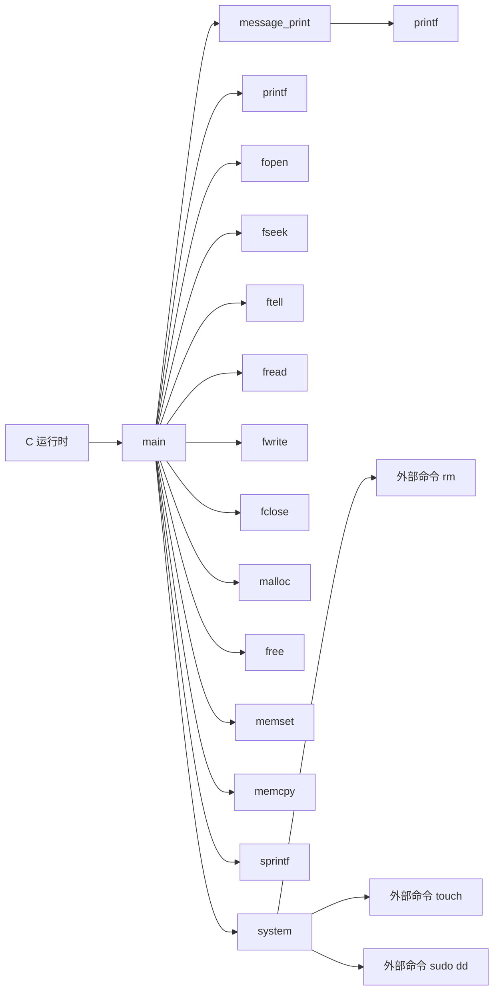
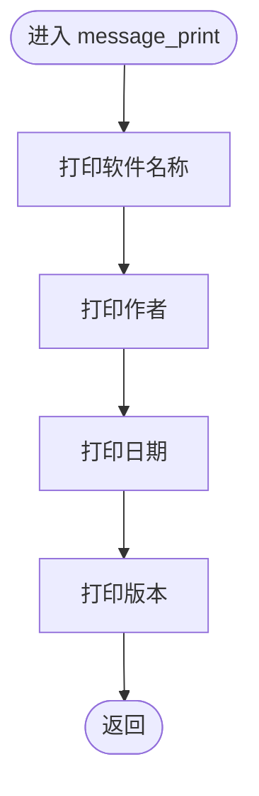
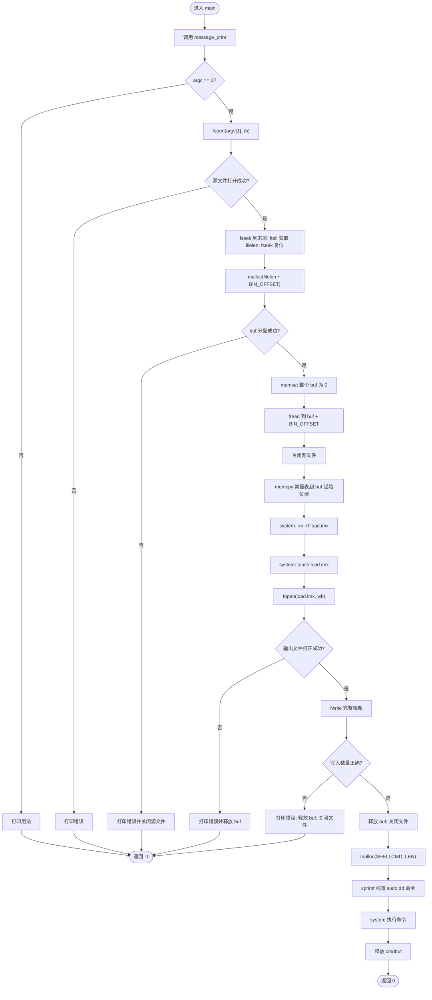
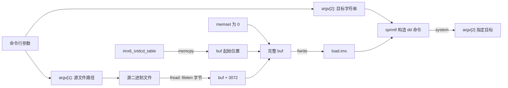

# `imxdownload.c` 详细设计说明书

## 1. 文档范围与分析依据

本文档仅基于当前目录中的 `imxdownload.c` 实际代码进行静态分析，不对代码中未体现的硬件行为、IVT/DCD 字段含义、目标存储介质类型或启动 ROM 行为作推断。

分析对象：

| 项目 | 内容 |
| --- | --- |
| 源文件 | `imxdownload.c` |
| 源文件行数 | 126 行 |
| 语言 | C |
| 文件内函数 | `message_print`、`main` |
| 文件内静态函数 | 无 |
| 全局对象 | `imx6_ivtdcd_table` |
| 结构体定义 | 无 |
| 枚举定义 | 无 |

代码注释说明 `imx6_ivtdcd_table` 从 `imxdownload` ELF 的 `.rodata` 节恢复，并称其前 1 KiB 为 i.MX6UL IVT/DCD 头。该描述属于源代码内已有信息；常量表各字段的准确硬件语义需结合 i.MX6UL 芯片参考手册或其他文件确认。

## 2. 文件职责

`imxdownload.c` 实现一个命令行下载工具，接收源二进制文件路径和目标设备路径，完成以下工作：

1. 输出软件名称、作者、日期和版本信息。
2. 校验命令行参数数量。
3. 读取源二进制文件长度。
4. 在内存中构造镜像：
   - 起始位置复制 `imx6_ivtdcd_table`。
   - 从偏移 `BIN_OFFSET`（3072 字节）处放置源二进制内容。
   - 两者之间以及未被常量表覆盖的区域保持为零。
5. 将内存镜像写入当前工作目录下的 `load.imx`。
6. 通过 `system()` 执行 `sudo dd`，将 `load.imx` 从目标设备的第 2 个 512 字节块之后开始写入。

本文件同时承担镜像构造、临时文件管理和外部下载命令执行，未进行模块拆分。

## 3. 输入、输出与运行约束

### 3.1 命令行接口

代码要求：

```text
sudo ./<程序名> <source_bin> <sd_device>
```

| 参数 | 代码含义 | 使用位置 |
| --- | --- | --- |
| `argv[0]` | 程序名，仅用于打印用法 | `main` 参数错误分支 |
| `argv[1]` | 源二进制文件路径 | `fopen(argv[1], "rb")` |
| `argv[2]` | 传递给 `dd` 的输出目标字符串 | 拼接到 `of=%s` |

`<sd_device>` 是否必须为 SD 卡设备、可接受哪些路径以及设备写入权限要求，源代码未校验，需结合使用说明或其他文件确认。

### 3.2 文件与设备输出

| 输出 | 行为 |
| --- | --- |
| 标准输出 | 输出版本、执行进度及部分错误信息 |
| `load.imx` | 在程序当前工作目录创建或覆盖 |
| `argv[2]` 指定目标 | 由外部 `sudo dd` 命令写入 |

### 3.3 镜像布局

设源文件长度为 `filelen`，则 `load.imx` 长度为 `filelen + 3072`。

```text
load.imx
+-------------------------------+ 偏移 0
| imx6_ivtdcd_table             |
| sizeof(imx6_ivtdcd_table)     |
+-------------------------------+
| 0 填充                        |
| 直到偏移 BIN_OFFSET = 3072    |
+-------------------------------+ 偏移 3072
| 源文件 argv[1] 的内容         |
| filelen 字节                  |
+-------------------------------+ 偏移 3072 + filelen
```

当前源码将 `imx6_ivtdcd_table` 声明为 `const int[256]`。在当前编译环境中 `sizeof(int) == 4`，因此常量表大小为 1024 字节，零填充区为 2048 字节；C 语言标准并不保证所有平台的 `int` 均为 4 字节。

`dd` 命令使用 `bs=512 seek=2`，因此 `load.imx` 从目标设备偏移 `2 * 512 = 1024` 字节处开始写入。由此可直接得到：

| 数据 | 在 `load.imx` 中的偏移 | 在目标设备中的偏移 |
| --- | ---: | ---: |
| `imx6_ivtdcd_table` 起始 | 0 | 1024 |
| 源二进制起始 | 3072 | 4096 |

这些偏移是否满足目标芯片启动规范，需结合芯片文档和其他文件确认。

## 4. 外部依赖

### 4.1 头文件依赖

| 头文件 | 本文件使用的声明 |
| --- | --- |
| `<stdio.h>` | `FILE`、`printf`、`fopen`、`fseek`、`ftell`、`fread`、`fwrite`、`fclose`、`SEEK_END`、`SEEK_SET` |
| `<stdlib.h>` | `malloc`、`free`、`system` |
| `<string.h>` | `memset`、`memcpy` |

### 4.2 C 运行库函数依赖

| 函数 | 用途 | 返回值是否检查 |
| --- | --- | --- |
| `printf` | 输出提示信息 | 否 |
| `fopen` | 打开源文件和 `load.imx` | 是 |
| `fseek` | 移动源文件位置 | 否 |
| `ftell` | 获取源文件长度 | 否 |
| `fread` | 读取源文件 | 否 |
| `fwrite` | 写入 `load.imx` | 是 |
| `fclose` | 关闭文件 | 否 |
| `malloc` | 分配镜像缓冲区和命令缓冲区 | 镜像缓冲区检查；命令缓冲区未检查 |
| `free` | 释放动态内存 | 不适用 |
| `memset` | 将镜像缓冲区清零 | 不适用 |
| `memcpy` | 复制常量表 | 不适用 |
| `sprintf` | 构造 `dd` 命令 | 否 |
| `system` | 执行外部 shell 命令 | 否 |

### 4.3 外部命令依赖

`system()` 通过宿主系统 shell 执行以下命令：

| 命令 | 代码中的完整形式 | 作用 |
| --- | --- | --- |
| `rm` | `rm -rf load.imx` | 删除当前目录下旧的 `load.imx` |
| `touch` | `touch load.imx` | 创建空的 `load.imx` |
| `sudo`、`dd` | `sudo dd iflag=dsync oflag=dsync if=load.imx of=%s bs=512 seek=2` | 将镜像写入 `argv[2]` 指定目标 |

外部命令的安装位置、版本、权限配置和运行平台要求未在本文件中定义，需结合运行环境确认。

## 5. 宏定义

| 宏 | 值 | 使用位置 | 作用 |
| --- | ---: | --- | --- |
| `SHELLCMD_LEN` | `200` | `malloc(SHELLCMD_LEN)` | 指定 `dd` shell 命令缓冲区大小 |
| `BIN_OFFSET` | `3072` | 镜像缓冲区分配、清零、源文件放置、输出长度 | 指定源二进制内容在 `load.imx` 中的起始偏移 |

两个宏均仅在当前文件内使用，但未使用类型安全的常量表达形式。

## 6. 全局变量与静态变量

### 6.1 全局变量

#### `imx6_ivtdcd_table`

```c
const int imx6_ivtdcd_table[256];
```

| 属性 | 内容 |
| --- | --- |
| 链接属性 | 外部链接；未使用 `static` |
| 可写性 | `const`，本文件不修改 |
| 元素数量 | 256 |
| 元素类型 | `int` |
| 使用函数 | `main` |
| 使用方式 | 通过 `memcpy` 复制到镜像缓冲区起始位置 |
| 复制长度 | `sizeof(imx6_ivtdcd_table)` |

代码注释称该表为 i.MX6UL IVT/DCD 头。表内具体字值所对应的寄存器、命令或地址含义，无法仅依据本文件确认。

### 6.2 静态变量

本文件没有文件作用域静态变量，也没有函数内静态变量。

## 7. 结构体与枚举

本文件未定义结构体、联合体或枚举。`FILE` 类型来自 `<stdio.h>`，其内部结构由 C 运行库提供，本文件仅通过指针使用。

## 8. 函数总览

| 函数 | 类型 | 主要职责 | 文件内调用者 |
| --- | --- | --- | --- |
| `message_print(void)` | 非静态、无参数、无返回值 | 输出软件信息 | `main` |
| `main(int argc, char *argv[])` | 程序入口、非静态 | 构造镜像并调用 `dd` 写入目标 | C 运行时 |

本文件没有静态函数。

## 9. 文件级调用关系



调用关系分类：

| 调用者 | 文件内调用 | 文件外调用 |
| --- | --- | --- |
| `message_print` | 无 | `printf` |
| `main` | `message_print` | `printf`、文件 I/O、动态内存、内存操作、字符串格式化、`system` |

## 10. 函数详细设计

### 10.1 `message_print`

#### 10.1.1 函数原型

```c
void message_print(void);
```

#### 10.1.2 功能

依次向标准输出打印软件名称、作者、日期和版本。每个字符串以 `\r\n` 结尾。

#### 10.1.3 入参

无。

#### 10.1.4 返回值

无。

#### 10.1.5 局部变量

无。

#### 10.1.6 全局变量读写

不读取、不写入本文件全局变量。

#### 10.1.7 调用关系

| 类型 | 内容 |
| --- | --- |
| 文件内调用者 | `main` |
| 文件内被调用函数 | 无 |
| 文件外被调用函数 | `printf`，共 4 次 |

#### 10.1.8 执行流程

1. 打印 `I.MX6UL bin download software`。
2. 打印作者 `zuozhongkai`。
3. 打印日期 `2018/8/9`。
4. 打印版本 `V1.0`。
5. 返回调用者。

#### 10.1.9 Mermaid 流程图



### 10.2 `main`

#### 10.2.1 函数原型

```c
int main(int argc, char *argv[]);
```

#### 10.2.2 功能

作为程序入口，校验参数、读取源二进制文件、构造并写出 `load.imx`，最后通过外部 `sudo dd` 命令将该文件写入指定目标。

#### 10.2.3 入参

| 参数 | 类型 | 含义 | 代码约束 |
| --- | --- | --- | --- |
| `argc` | `int` | 命令行参数数量 | 必须等于 3 |
| `argv` | `char *[]` | 命令行参数数组 | 使用 `argv[0]`、`argv[1]`、`argv[2]` |

#### 10.2.4 返回值

| 返回值 | 触发条件 |
| ---: | --- |
| `0` | 执行到函数末尾；不代表 `fread`、`system` 或 `dd` 已成功，因为这些结果未检查 |
| `-1` | 参数数量错误、源文件打开失败、镜像缓冲区分配失败、`load.imx` 打开失败或 `fwrite` 写入长度不匹配 |

从 C 程序退出状态角度看，`return -1` 的具体外部退出码表示由宿主实现处理。

#### 10.2.5 局部变量

| 变量 | 类型 | 初始化 | 用途 |
| --- | --- | --- | --- |
| `fp` | `FILE *` | 未显式初始化 | 先指向源文件，之后复用为 `load.imx` 文件流 |
| `buf` | `unsigned char *` | 未显式初始化 | 指向完整镜像动态缓冲区 |
| `cmdbuf` | `unsigned char *` | 未显式初始化 | 指向用于构造 `sudo dd` 命令的 200 字节缓冲区 |
| `nbytes` | `int` | 未显式初始化 | 保存 `fwrite` 返回的写入元素数量 |
| `filelen` | `int` | 未显式初始化 | 保存 `ftell` 返回的源文件长度 |
| `i` | `int` | `0` | 未使用 |
| `j` | `int` | `0` | 未使用 |

`ftell` 和 `fwrite` 的标准返回类型分别为 `long` 和 `size_t`，代码将结果保存到 `int`，存在范围收窄。

#### 10.2.6 全局变量读写

| 全局变量 | 访问方式 | 说明 |
| --- | --- | --- |
| `imx6_ivtdcd_table` | 只读 | 使用 `memcpy` 将其全部内容复制到 `buf` 起始位置 |

`main` 不写入任何本文件全局变量。

#### 10.2.7 调用关系

文件内调用：

| 被调用函数 | 次数 | 用途 |
| --- | ---: | --- |
| `message_print` | 1 | 输出软件信息 |

文件外调用：

| 被调用函数 | 用途 |
| --- | --- |
| `printf` | 输出用法、错误、文件大小和进度信息 |
| `fopen` | 打开源文件与 `load.imx` |
| `fseek`、`ftell` | 获取源文件长度并复位文件位置 |
| `fread` | 将源文件读入镜像缓冲区偏移 3072 处 |
| `fwrite` | 将完整镜像写入 `load.imx` |
| `fclose` | 关闭文件流 |
| `malloc`、`free` | 管理镜像缓冲区与命令缓冲区 |
| `memset`、`memcpy` | 初始化镜像并复制常量表 |
| `sprintf` | 构造外部下载命令 |
| `system` | 执行删除、创建和下载命令 |

#### 10.2.8 执行流程

1. 调用 `message_print()` 输出软件信息。
2. 判断 `argc` 是否等于 3：
   - 否：打印用法并返回 `-1`。
3. 以二进制只读模式打开 `argv[1]`：
   - 失败：打印错误并返回 `-1`。
4. 通过 `fseek` 移至文件尾，使用 `ftell` 获取长度，再移回文件头。
5. 分配 `filelen + BIN_OFFSET` 字节的镜像缓冲区：
   - 失败：关闭源文件并返回 `-1`。
6. 将整个镜像缓冲区清零。
7. 将源文件内容读取到 `buf + BIN_OFFSET`。
8. 关闭源文件。
9. 将 `imx6_ivtdcd_table` 复制到 `buf` 起始位置。
10. 通过 `system("rm -rf load.imx")` 删除旧文件。
11. 通过 `system("touch load.imx")` 创建新文件。
12. 以二进制写模式打开 `load.imx`：
    - 失败：释放镜像缓冲区并返回 `-1`。
13. 写入 `filelen + BIN_OFFSET` 字节：
    - 写入数量不匹配：释放缓冲区、关闭文件并返回 `-1`。
14. 释放镜像缓冲区并关闭 `load.imx`。
15. 分配 `SHELLCMD_LEN` 字节的命令缓冲区。
16. 使用 `sprintf` 拼接包含 `argv[2]` 的 `sudo dd` 命令。
17. 调用 `system` 执行下载命令。
18. 释放命令缓冲区。
19. 返回 `0`。

#### 10.2.9 资源生命周期

| 资源 | 获取 | 正常释放 | 已覆盖的失败释放 | 未覆盖情况 |
| --- | --- | --- | --- | --- |
| 源文件流 `fp` | `fopen(argv[1], "rb")` | `fclose(fp)` | `buf` 分配失败时关闭 | `fseek`、`ftell`、`fread` 失败未单独处理 |
| 镜像缓冲区 `buf` | `malloc(filelen + BIN_OFFSET)` | 写完后 `free(buf)` | `load.imx` 打开或写入失败时释放 | 长度计算异常可能在分配前产生问题 |
| 输出文件流 `fp` | `fopen("load.imx", "wb")` | `fclose(fp)` | `fwrite` 数量不匹配时关闭 | `fclose` 失败未检查 |
| 命令缓冲区 `cmdbuf` | `malloc(SHELLCMD_LEN)` | `system` 后 `free(cmdbuf)` | 无 | 分配失败仍传给 `sprintf` |

#### 10.2.10 Mermaid 流程图



## 11. 数据流分析

### 11.1 主数据流



### 11.2 控制数据流

| 控制数据 | 来源 | 影响 |
| --- | --- | --- |
| `argc` | C 运行时 | 决定是否继续执行 |
| `fp == NULL` | `fopen` | 决定源文件或输出文件失败分支 |
| `buf == NULL` | `malloc` | 决定是否可构造镜像 |
| `nbytes != filelen + BIN_OFFSET` | `fwrite` 结果 | 决定输出文件写入是否被代码判定为成功 |

`fseek`、`ftell`、`fread`、`cmdbuf` 分配和所有 `system` 调用结果未进入控制判断，因此这些操作失败时，程序可能继续执行。

### 11.3 副作用

| 副作用 | 触发位置 |
| --- | --- |
| 标准输出写入 | 多次 `printf` |
| 当前目录文件删除 | `system("rm -rf load.imx")` |
| 当前目录文件创建/覆盖 | `touch`、`fopen("load.imx", "wb")` |
| 目标设备或目标文件写入 | `sudo dd ... of=argv[2] ...` |
| 提权交互或权限请求 | 外部 `sudo`，具体行为需结合运行环境确认 |

## 12. 错误处理分析

### 12.1 已处理错误

| 错误 | 处理 |
| --- | --- |
| 参数数量不等于 3 | 打印用法，返回 `-1` |
| 源文件无法打开 | 打印错误，返回 `-1` |
| 镜像缓冲区分配失败 | 打印错误，关闭源文件，返回 `-1` |
| `load.imx` 无法打开 | 打印错误，释放镜像缓冲区，返回 `-1` |
| `fwrite` 写入数量不匹配 | 打印错误，释放缓冲区并关闭文件，返回 `-1` |

### 12.2 未处理或未充分处理的错误

| 操作 | 实际行为 |
| --- | --- |
| `fseek` | 未检查返回值 |
| `ftell` | 未检查 `-1L`，并将 `long` 保存为 `int` |
| `fread` | 未检查实际读取长度或错误状态 |
| `fclose` | 未检查返回值 |
| `malloc(SHELLCMD_LEN)` | 未检查是否返回 `NULL` |
| `sprintf` | 未限制写入长度 |
| 三次 `system` | 未检查命令启动或退出状态 |

因此，函数返回 `0` 只能说明代码执行到末尾，不能确认镜像构造和目标写入实际成功。

## 13. 风险与改进建议

### 13.1 高风险

| 风险 | 代码依据 | 影响 | 改进建议 |
| --- | --- | --- | --- |
| Shell 命令注入 | `argv[2]` 未转义直接拼接到 `system` 命令 | 特制参数可执行额外 shell 命令；程序用法提示要求通过 `sudo` 运行，影响可能扩大 | 不使用 shell 拼接；使用 `exec` 系列函数传递独立参数，或在程序内直接打开并写入目标 |
| 命令缓冲区溢出 | 固定分配 200 字节并使用无边界 `sprintf` | 过长的 `argv[2]` 可越界写入内存 | 使用 `snprintf` 并检查结果，按所需长度动态分配 |
| 目标误写 | 未验证 `argv[2]` 类型、存在性或是否为预期设备，直接作为 `dd of=` | 参数错误可覆盖普通文件或错误块设备 | 写入前校验目标、显示确认信息；结合业务要求限制允许的设备类型，具体规则需结合其他文件确认 |
| `cmdbuf` 空指针解引用 | 第二次 `malloc` 返回值未检查，随后立即传给 `sprintf` | 内存分配失败时产生未定义行为 | 检查 `cmdbuf == NULL` 并返回错误 |

### 13.2 中风险

| 风险 | 代码依据 | 影响 | 改进建议 |
| --- | --- | --- | --- |
| 文件长度类型与错误处理不正确 | `ftell` 返回 `long`，保存到 `int`，且未检查失败 | 大文件可能截断；失败值可能参与长度计算和内存分配 | 使用可表达文件大小的类型；检查 `fseek`、`ftell`；进行范围和加法溢出检查 |
| 分配长度可能溢出或异常转换 | `malloc(filelen + BIN_OFFSET)` 未验证 `filelen` | 负值或整数溢出可能转换为异常的分配大小，后续内存操作不安全 | 在计算前验证 `filelen >= 0` 且不超过允许上限 |
| 输入读取结果未检查 | 忽略 `fread` 返回值 | 短读时镜像载荷尾部保持为零，但程序仍继续并可能报告成功 | 检查读取字节数及 `ferror` |
| 下载结果未检查 | 忽略 `system` 返回值 | `sudo` 或 `dd` 失败时程序仍返回 `0` | 检查 `system` 状态并将失败传播为非零退出码 |
| 常量表依赖宿主 `int` 大小和字节序 | 表类型为 `const int[256]`，通过原始字节复制 | 不同平台生成的头部字节可能不同 | 使用明确宽度的 `uint32_t`，并明确所需字节序；目标格式要求需结合芯片文档确认 |

### 13.3 低风险与可维护性问题

| 问题 | 代码依据 | 改进建议 |
| --- | --- | --- |
| 删除和 `touch` 冗余 | 随后的 `fopen("load.imx", "wb")` 本身会创建或截断普通文件 | 移除两个 `system` 调用，直接检查 `fopen` 结果 |
| `rm -rf` 语义过强 | 固定目标虽为 `load.imx`，但递归强制删除并非创建普通输出文件所必需 | 不调用 `rm -rf` |
| 未使用局部变量 | `i`、`j` 初始化后未引用；`gcc -Wall -Wextra -Wpedantic -fsyntax-only` 会报告告警 | 删除未使用变量 |
| `nbytes` 类型不匹配 | `fwrite` 返回 `size_t`，代码使用 `int` | 将 `nbytes` 改为 `size_t` |
| 全局常量暴露外部链接 | `imx6_ivtdcd_table` 仅在本文件使用但未声明为 `static` | 若无需跨文件访问，声明为 `static const` |
| 错误信息不含系统错误原因 | 多数错误仅打印固定文本 | 使用 `perror` 或输出 `strerror(errno)` |
| 职责集中在 `main` | 镜像构造、文件输出和设备写入均在一个函数内 | 拆分为参数校验、镜像构造、文件写入、目标写入函数，并分别测试 |
| 固定输出文件名 | 总是操作当前目录的 `load.imx` | 允许显式指定输出路径，或使用安全的临时文件策略 |

## 14. 可测试性建议

在不写入真实设备的前提下，可按以下边界验证现有行为：

| 测试场景 | 期望验证点 |
| --- | --- |
| 参数数量错误 | 返回非零并打印用法 |
| 源文件不存在 | 返回非零且不构造镜像 |
| 空源文件 | `load.imx` 长度应为 3072 字节 |
| 已知短源文件 | 文件内容应出现在 `load.imx` 偏移 3072 处 |
| 常量表复制 | `load.imx` 起始 `sizeof(imx6_ivtdcd_table)` 字节应与表内存表示一致 |
| 输出文件不可写 | 返回非零 |
| 过长或含 shell 元字符的目标参数 | 当前代码存在溢出和命令注入风险，只应在隔离环境中验证 |
| `dd` 执行失败 | 当前代码仍可能返回 0，应作为错误处理改进后的回归测试 |

目标镜像是否能在实际 i.MX6UL 硬件启动，需结合硬件、芯片启动规范和其他工程文件确认。

## 15. 结论

`imxdownload.c` 的核心设计是将固定常量表、零填充区和用户提供的源二进制组合成 `load.imx`，再调用外部 `dd` 从目标偏移 1024 字节处写入。代码流程短且镜像布局明确，但对文件长度、读取结果、命令缓冲区、外部命令结果和目标设备均缺少充分校验，并存在可由 `argv[2]` 触发的命令注入和缓冲区溢出风险。

常量表内各字段的硬件语义、目标设备约束及偏移设计依据无法仅从本文件确认，需结合其他文件或 i.MX6UL 官方文档确认。
