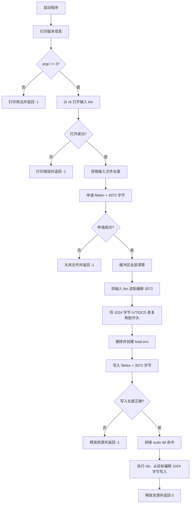

# `imxdownload` 二进制逆向分析与源码重建报告

## 1. 文档目标

本文记录从 Linux ELF 二进制文件 `imxdownload` 出发，分析程序结构、恢复核心逻辑、重建 C 源码，并验证重建程序与原程序行为一致的完整过程。

逆向分析能够恢复程序的等价逻辑，但通常无法恢复以下原始信息：

- 原作者使用的局部变量名。
- 原始注释和代码排版。
- 未保留在二进制中的宏名称。
- 编译器优化前的精确语句形式。
- 原始构建命令和完整编译环境。

本次重建结果位于：

- `imxdownload.c`

重建目标是生成与原二进制核心行为一致的可读 C 源码，而不是生成与原 ELF 文件逐字节一致的新 ELF 文件。

## 2. 分析对象与环境

### 2.1 原始样本

逆向开始时，工程根目录 `imxdownload` 与 `../../bootloader/imxdownload` 完全相同。原始样本信息如下：

| 项目 | 值 |
| --- | --- |
| 文件类型 | ELF 64-bit LSB executable |
| 目标架构 | x86-64 |
| 链接方式 | 动态链接 |
| 是否剥离符号 | 未剥离 |
| 文件大小 | 13384 字节 |
| SHA-256 | `5dd608d5ff9e829dddd710333982fd852276df550eafd4af985818cbe8b3060b` |
| Build ID | `ac8f68c1812ada42652697f763e4a97e253565b9` |
| 编译器标记 | GCC 5.4.0，Ubuntu 16.04 |

分析完成后，工程根目录的 `imxdownload` 被外部重新处理或修改，因此本文以仍保持原始哈希的 `../../bootloader/imxdownload` 作为原始样本基准。

### 2.2 使用的主要工具

| 工具 | 用途 |
| --- | --- |
| `file` | 判断文件格式、架构和链接方式 |
| `stat` | 查看文件大小、权限和时间信息 |
| `sha256sum` | 标识样本并比较输出文件 |
| `nm` | 查看保留的符号及函数地址 |
| `readelf` | 查看 ELF 头、节表、符号表和编译器信息 |
| `strings` | 提取可打印字符串 |
| `objdump` | 反汇编代码并导出只读数据 |
| `objcopy` | 提取 ELF 节数据 |
| `od` | 按 32 位整数显示二进制常量表 |
| `gcc` | 编译重建源码 |
| `cmp` | 对文件进行逐字节比较 |

## 3. 总体分析思路

本次逆向按照以下顺序进行：

1. 识别二进制文件格式，确认是否保留符号。
2. 检查仓库中是否存在同名样本或原始源码。
3. 提取符号、动态依赖和可打印字符串。
4. 根据字符串和导入函数推断程序用途。
5. 反汇编自定义函数，恢复控制流和变量用途。
6. 提取 `.rodata` 中的 IVT/DCD 常量表。
7. 根据反汇编结果重建等价 C 源码。
8. 编译重建源码。
9. 比较常量表、控制台输出和生成的 `load.imx`。
10. 使用受控的假 `sudo` 命令阻止测试过程写入真实磁盘设备。

## 4. 初步识别

### 4.1 判断文件类型

执行：

```bash
file imxdownload
stat imxdownload
sha256sum imxdownload
```

关键输出表明：

```text
ELF 64-bit LSB executable, x86-64
dynamically linked
not stripped
```

`not stripped` 是本次逆向的重要条件，表示 ELF 中仍保留了函数名、全局变量名和源文件名等符号信息。

### 4.2 检查同名文件

在仓库中发现另一个同名文件：

```bash
sha256sum imxdownload ../../bootloader/imxdownload
```

逆向开始时两个文件的 SHA-256 完全一致，因此可确认它们是同一个二进制样本的副本。

### 4.3 搜索原始源码

执行：

```bash
find /home/gs/code/i.MX6UL -type f \
    \( -name 'imxdownload.c' -o -name '*imxdownload*.c' \) -print
```

未在本地仓库中找到原始 `imxdownload.c`，因此继续从 ELF 本身进行恢复。

## 5. ELF 结构与符号分析

### 5.1 提取符号

执行：

```bash
nm -n -C imxdownload
readelf -h -S -s -d imxdownload
```

发现程序中只有两个需要重点分析的自定义函数：

| 地址 | 符号 | 大小 |
| --- | --- | --- |
| `0x400886` | `message_print` | 47 字节 |
| `0x4008b5` | `main` | 789 字节 |

还发现一个重要全局只读对象：

| 地址 | 符号 | 大小 |
| --- | --- | --- |
| `0x400c80` | `imx6_ivtdcd_table` | 1024 字节 |

符号表还保留了源文件名：

```text
imxdownload.c
```

由此可以确认：

- 原程序使用 C 语言编写。
- 核心逻辑集中在 `main()` 中。
- `imx6_ivtdcd_table` 是由 256 个 32 位整数构成的常量表。

### 5.2 动态导入函数

程序导入了以下关键 libc 函数：

```text
fopen
fseek
ftell
fread
fwrite
fclose
malloc
free
memset
printf
puts
sprintf
system
```

根据这些函数可以初步推断程序会：

- 打开并读取输入文件。
- 申请并初始化内存。
- 生成新文件。
- 拼接并执行 shell 命令。

## 6. 字符串分析

执行：

```bash
strings -a -t x imxdownload
```

提取到的关键字符串如下：

```text
I.MX6UL bin download software
Edit by:zuozhongkai
Date:2018/8/9
Version:V1.0
sudo ./%s <source_bin> <sd_device>
Can't Open file %s
file %s size = %dBytes
Mem Malloc Failed!
Delete Old load.imx
rm -rf load.imx
Create New load.imx
touch load.imx
load.imx
Cant't Open load.imx!!!
File Write Error!
sudo dd iflag=dsync oflag=dsync if=load.imx of=%s bs=512 seek=2
Download load.imx to %s  ......
```

仅根据字符串，已经可以推断程序的主要用途：

1. 接收一个源 bin 文件和一个目标块设备。
2. 根据源文件生成 `load.imx`。
3. 使用 `dd` 将 `load.imx` 写入目标设备。
4. `seek=2` 表示跳过目标设备开头的两个 512 字节块，即从 1024 字节偏移处开始写入。

## 7. `message_print()` 反汇编分析

执行：

```bash
objdump -d -Mintel \
    --start-address=0x400886 \
    --stop-address=0x4008b5 \
    imxdownload
```

该函数连续调用四次 `puts()`，分别输出软件名称、作者、日期和版本。

恢复出的等价代码为：

```c
void message_print(void)
{
    printf("I.MX6UL bin download software\r\n");
    printf("Edit by:zuozhongkai\r\n");
    printf("Date:2018/8/9\r\n");
    printf("Version:V1.0\r\n");
}
```

编译器会将只包含固定字符串的 `printf()` 优化为 `puts()`，因此源码写成 `printf()` 仍可以解释反汇编中的 `puts()` 调用。

## 8. `main()` 反汇编分析

执行：

```bash
objdump -d -Mintel --disassemble=main imxdownload
```

### 8.1 参数检查

反汇编首先比较 `argc` 与 `3`：

```asm
cmp DWORD PTR [rbp-0x34],0x3
je  0x40090a
```

由此恢复：

```c
if (argc != 3) {
    printf("Error Usage! Reference Below:\r\n");
    printf("sudo ./%s <source_bin> <sd_device>\r\n", argv[0]);
    return -1;
}
```

参数含义为：

| 参数 | 含义 |
| --- | --- |
| `argv[1]` | 输入 bin 文件 |
| `argv[2]` | 目标设备路径 |

### 8.2 获取输入文件长度

反汇编依次调用：

```text
fopen(argv[1], "rb")
fseek(fp, 0, SEEK_END)
ftell(fp)
fseek(fp, 0, SEEK_SET)
```

恢复出的逻辑为：

```c
fp = fopen(argv[1], "rb");
fseek(fp, 0L, SEEK_END);
filelen = ftell(fp);
fseek(fp, 0L, SEEK_SET);
```

### 8.3 分配镜像缓冲区

反汇编中出现：

```asm
add eax,0xc00
call malloc
```

`0xC00` 等于十进制 `3072`，因此恢复出：

```c
#define BIN_OFFSET 3072

buf = malloc(filelen + BIN_OFFSET);
memset(buf, 0, filelen + BIN_OFFSET);
```

这表明输入 bin 文件不会从 `load.imx` 开头开始存放，而是被放到偏移 `3072` 字节处。

### 8.4 读取输入 bin

`fread()` 的目标地址由缓冲区地址加 `0xC00` 得到：

```asm
lea rdi,[rdx+0xc00]
call fread
```

恢复为：

```c
fread(buf + BIN_OFFSET, 1, filelen, fp);
```

### 8.5 复制 IVT/DCD 表

反汇编从地址 `0x400c80` 向缓冲区开头复制 `0x400` 字节：

```asm
mov edx,0x400c80
mov ecx,0x400
rep movs
```

结合符号表可恢复为：

```c
memcpy(buf, imx6_ivtdcd_table, sizeof(imx6_ivtdcd_table));
```

因此生成镜像的内存布局为：

```text
偏移 0x0000 - 0x03ff：1024 字节 IVT/DCD 表
偏移 0x0400 - 0x0bff：2048 字节零填充
偏移 0x0c00 - 文件末尾：输入 bin 文件内容
```

### 8.6 生成 `load.imx`

反汇编依次调用：

```text
system("rm -rf load.imx")
system("touch load.imx")
fopen("load.imx", "wb")
fwrite(buf, 1, filelen + 3072, fp)
```

恢复为：

```c
printf("Delete Old load.imx\r\n");
system("rm -rf load.imx");
printf("Create New load.imx\r\n");
system("touch load.imx");

fp = fopen("load.imx", "wb");
nbytes = fwrite(buf, 1, filelen + BIN_OFFSET, fp);
```

### 8.7 写入目标设备

程序申请 200 字节命令缓冲区：

```asm
mov edi,0xc8
call malloc
```

随后使用 `sprintf()` 拼接命令：

```c
sprintf(cmdbuf,
        "sudo dd iflag=dsync oflag=dsync if=load.imx of=%s bs=512 seek=2",
        argv[2]);
```

最后调用：

```c
system(cmdbuf);
```

`seek=2` 会使 `dd` 从目标设备偏移 `2 * 512 = 1024` 字节处开始写入 `load.imx`。

## 9. 提取 `imx6_ivtdcd_table`

### 9.1 确定表的位置和长度

符号表显示：

```text
0x400c80  1024 OBJECT GLOBAL imx6_ivtdcd_table
```

1024 字节除以 4 字节，得到 256 个 32 位整数，与恢复源码中的数组长度一致。

### 9.2 导出 `.rodata`

执行：

```bash
objcopy --dump-section .rodata=/tmp/imxdownload.rodata imxdownload
od -An -v -j 32 -N 1024 -t x4 -w32 /tmp/imxdownload.rodata
```

`.rodata` 起始地址为 `0x400c60`，数组起始地址为 `0x400c80`，两者相差 32 字节，因此使用 `od -j 32` 跳过前 32 字节。

提取到的前几个表项为：

```c
0x402000d1, 0x87800000, 0x00000000, 0x877ff42c,
0x877ff420, 0x877ff400, 0x00000000, 0x00000000,
0x877ff000, 0x00200000, 0x00000000, 0x40e801d2
```

全部 256 个表项已写入重建源码 `imxdownload.c`。

## 10. 重建源码

根据符号、字符串、反汇编和只读数据，重建了以下内容：

- `message_print()`。
- `main()` 的完整控制流。
- `BIN_OFFSET`，值为 `3072`。
- `SHELLCMD_LEN`，值为 `200`。
- 256 项 `imx6_ivtdcd_table`。
- 原程序的输出文本。
- 原程序的文件处理顺序。
- 原程序的 `dd` 命令格式。
- 原程序中两个未使用局部变量 `i` 和 `j`。

重建源码保留原程序中可观察到的行为和缺陷，没有在逆向版本中进行重构或安全加固。

## 11. 编译验证

### 11.1 编译重建源码

执行：

```bash
gcc -O0 -fno-pie -no-pie -Wall -Wextra \
    imxdownload.c -o /tmp/imxdownload.recovered
```

编译成功。编译器仅报告两个与原反汇编栈布局相符的未使用变量：

```text
unused variable 'i'
unused variable 'j'
```

不同 GCC 版本、链接器版本和系统启动文件会导致新 ELF 的：

- 文件大小不同。
- 函数地址不同。
- Build ID 不同。
- 启动代码和节布局不同。

因此不能使用“新旧 ELF 文件整体相同”作为源码重建成功的标准。

## 12. 常量表验证

分别从原始 ELF 和重建 ELF 中导出 `.rodata`，再比较 `imx6_ivtdcd_table` 对应的 1024 字节：

```bash
cp ../../bootloader/imxdownload /tmp/imxdownload.original

objcopy --dump-section .rodata=/tmp/original.rodata \
    /tmp/imxdownload.original

objcopy --dump-section .rodata=/tmp/recovered.rodata \
    /tmp/imxdownload.recovered

cmp -n 1024 -i 32:32 \
    /tmp/original.rodata \
    /tmp/recovered.rodata
```

先将原始样本复制到 `/tmp`，是为了避免原始样本所在目录只读时，`objcopy` 因无法创建临时文件而失败。

`cmp` 返回 `0`，证明重建源码中的 256 项 IVT/DCD 表与原始 ELF 中的表逐字节一致。

## 13. 控制台输出验证

### 13.1 用法错误输出

直接运行程序而不传参数，两个程序均返回 `-1`，在 shell 中表现为退出码 `255`。

由于程序会打印 `argv[0]`，比较输出时需要让两个程序使用相同的进程名：

```bash
bash -c 'exec -a imxdownload ../../bootloader/imxdownload' \
    >/tmp/original-usage.out 2>&1

bash -c 'exec -a imxdownload /tmp/imxdownload.recovered' \
    >/tmp/recovered-usage.out 2>&1

cmp /tmp/original-usage.out /tmp/recovered-usage.out
```

`cmp` 返回 `0`，证明同一参数条件下两个程序的用法输出一致。

## 14. 安全的功能验证方法

原程序最终会执行：

```text
sudo dd ... of=<目标设备> ...
```

直接测试可能覆盖真实磁盘或 SD 卡，因此不能使用真实 `sudo` 和设备路径进行自动验证。

测试时创建一个受控的假 `sudo`：

```sh
#!/bin/sh
printf '%s\n' "$*" > /tmp/imxdownload-test/dd-command.txt
exit 0
```

将该脚本所在目录放到 `PATH` 最前面：

```bash
PATH=/tmp/imxdownload-test/fakebin:/usr/bin:/bin \
    ../../bootloader/imxdownload bsp.bin /tmp/fake-device
```

这样程序仍会完整执行到 `system()`，但实际不会调用真正的 `sudo dd`，从而避免写入磁盘设备。

## 15. `load.imx` 字节级验证

使用同一个 `bsp.bin` 分别运行原始程序和重建程序。

输入文件信息：

| 项目 | 值 |
| --- | --- |
| 输入文件 | `bsp.bin` |
| 输入大小 | 288 字节 |
| 输入 SHA-256 | `83d3f6fbd47217d2c3dbbc7f297811ccca09607881cdf462e4cd4046d4fb431f` |

理论生成文件大小：

```text
3072 + 288 = 3360 字节
```

实际验证结果：

| 项目 | 原程序 | 重建程序 |
| --- | --- | --- |
| 退出码 | `0` | `0` |
| `load.imx` 大小 | 3360 字节 | 3360 字节 |
| `load.imx` SHA-256 | `4a1535a84d019d8e9132b955170920664d159ace451ed21f5d8fa766bca1188e` | `4a1535a84d019d8e9132b955170920664d159ace451ed21f5d8fa766bca1188e` |

最后执行：

```bash
cmp original-load.imx recovered-load.imx
```

`cmp` 返回 `0`，证明两个程序生成的 `load.imx` 逐字节完全一致。

这是本次逆向验证中最关键的结果，因为它同时验证了：

- `BIN_OFFSET` 恢复正确。
- 输入文件读取位置正确。
- 零填充范围正确。
- IVT/DCD 表内容和写入位置正确。
- 输出文件长度正确。
- 文件生成流程的核心行为正确。

## 16. 最终恢复出的程序流程



## 17. 恢复源码中的原始缺陷

为了保持逆向结果与原程序行为一致，`imxdownload.c` 保留了以下缺陷：

1. 使用 `system("rm -rf load.imx")` 和 `system("touch load.imx")`，实际可直接通过标准文件接口完成。
2. 将未经转义的 `argv[2]` 拼接到 shell 命令，存在命令注入风险。
3. 使用固定 200 字节缓冲区和 `sprintf()`，目标路径过长时可能发生缓冲区溢出。
4. 未检查命令缓冲区 `malloc()` 是否成功。
5. 未检查 `fread()` 是否读取了完整输入文件。
6. 未检查 `fseek()`、`ftell()` 和 `system()` 的返回值。
7. `ftell()` 的返回值被保存到 `int`，无法可靠处理大文件。
8. 直接执行 `sudo dd`，目标设备参数错误时可能破坏磁盘数据。
9. 存在两个未使用局部变量 `i` 和 `j`。

这些问题属于原二进制行为的一部分。若要将程序用于实际生产环境，应另行编写安全加固版本，而不应直接修改用于逆向对照的恢复源码。

## 18. 验证结论

本次逆向已完成以下验证：

| 验证项 | 结果 |
| --- | --- |
| 自定义函数和全局对象识别 | 成功 |
| 程序主流程恢复 | 成功 |
| 256 项 IVT/DCD 表恢复 | 成功 |
| 重建源码编译 | 成功 |
| IVT/DCD 表逐字节比较 | 完全一致 |
| 同参数用法输出比较 | 完全一致 |
| `load.imx` 文件大小比较 | 完全一致 |
| `load.imx` SHA-256 比较 | 完全一致 |
| `load.imx` 逐字节比较 | 完全一致 |

因此可以确认，重建的 `imxdownload.c` 在本次覆盖的核心功能范围内，与原始 `imxdownload` 二进制具有等价行为。
