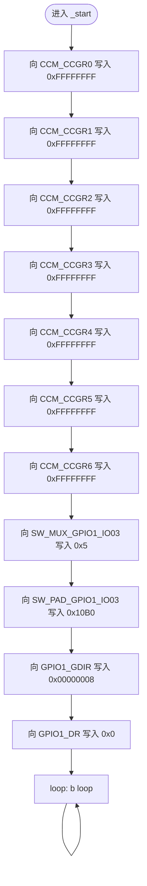
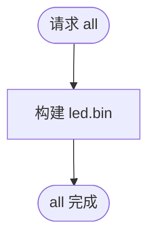
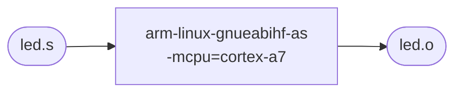
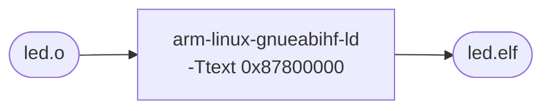
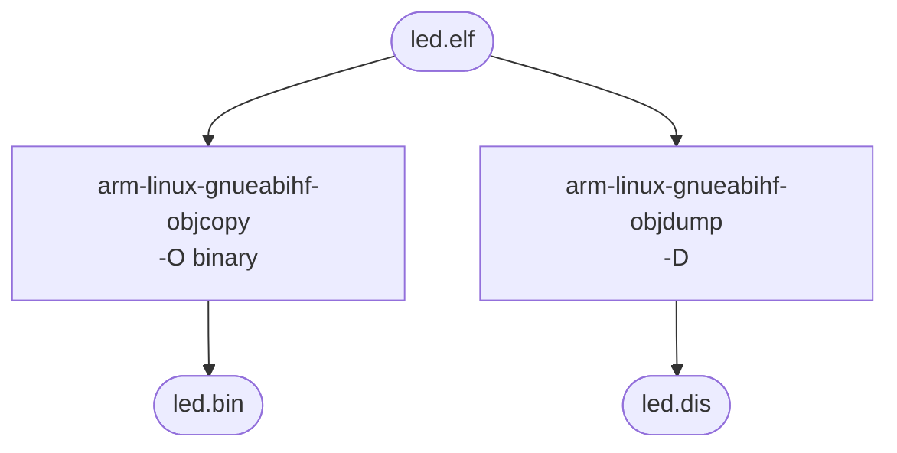
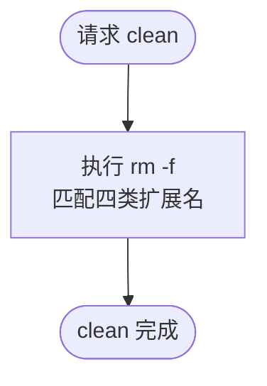
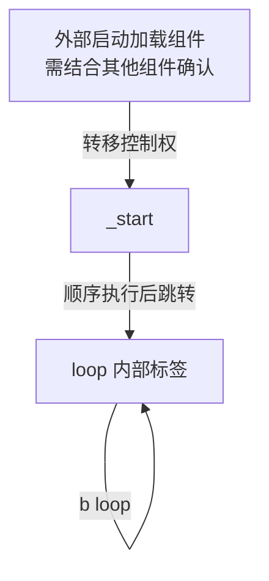
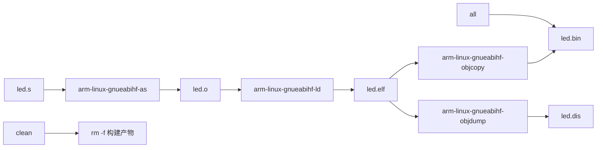

# `led.s` 与 `Makefile` 详细设计说明书

# 1 文件概述

## 1.1 文件信息

| 文件名称 | 文件路径 | 文件类型 |
| --- | --- | --- |
| `led.s` | `baremetal/01-led-s/led.s` | GNU 汇编源文件，目标架构为 ARM Cortex-A7 |
| `Makefile` | `baremetal/01-led-s/Makefile` | GNU Make 构建脚本 |

## 1.2 文件职责

`led.s` 是一个裸机 LED 点亮程序。程序从全局入口符号 `_start` 开始执行，直接访问内存映射寄存器，依次开启时钟、配置 `GPIO1_IO03` 的复用和 PAD 属性、将该 GPIO 设置为输出、输出低电平，最后进入无限循环。

`Makefile` 负责调用 ARM 交叉编译工具链，将 `led.s` 汇编为目标文件，链接为 ELF 文件，再转换为可直接加载的二进制文件，并生成反汇编文件。

## 1.3 主要功能

### `led.s`

1. 将 `CCM_CCGR0` 至 `CCM_CCGR6` 写为 `0xFFFFFFFF`。
2. 将 `GPIO1_IO03` 复用为 GPIO 功能。
3. 配置 `GPIO1_IO03` 的 PAD 电气属性。
4. 将 `GPIO1_IO03` 设置为输出。
5. 将 `GPIO1_IO03` 输出置低，以点亮低电平有效的 LED。
6. 进入无限循环，保持当前硬件状态。

### `Makefile`

1. 定义 ARM 交叉编译工具链命令。
2. 将 `led.s` 汇编为 `led.o`。
3. 将 `led.o` 链接到地址 `0x87800000`，生成 `led.elf`。
4. 从 `led.elf` 生成 `led.bin` 和 `led.dis`。
5. 清理构建产物。

## 1.4 外部依赖

| 依赖项 | 使用文件 | 用途 | 确认情况 |
| --- | --- | --- | --- |
| `arm-linux-gnueabihf-as` | `Makefile` | 将 ARM 汇编源文件生成目标文件 | 由 `CROSS_COMPILE` 与 `AS` 拼接确定 |
| `arm-linux-gnueabihf-ld` | `Makefile` | 链接目标文件并指定代码地址 | 由 `CROSS_COMPILE` 与 `LD` 拼接确定 |
| `arm-linux-gnueabihf-objcopy` | `Makefile` | 从 ELF 提取裸二进制文件 | 由 `CROSS_COMPILE` 与 `OBJCOPY` 拼接确定 |
| `arm-linux-gnueabihf-objdump` | `Makefile` | 生成 ELF 反汇编文件 | 由 `CROSS_COMPILE` 与 `OBJDUMP` 拼接确定 |
| GNU Make | `Makefile` | 解析变量、依赖和构建规则 | 由文件语法确定 |
| ARM Cortex-A7 指令集 | `led.s`、`Makefile` | 执行 `ldr`、`str`、`b` 等指令；汇编参数为 `-mcpu=cortex-a7` | 由实际代码和构建参数确定 |
| CCM、IOMUXC、GPIO1 内存映射寄存器 | `led.s` | 完成时钟、引脚复用、PAD 和 GPIO 控制 | 寄存器名称来自源代码注释；地址及位定义需结合芯片参考手册确认 |
| 启动加载组件 | 两个文件 | 将 `led.bin` 加载到 `0x87800000` 并跳转至 `_start` | 当前文件未定义，需结合 bootloader、下载工具或调试器确认 |
| 目标板 LED 电路 | `led.s` | 低电平输出是否点亮 LED 取决于板级连接 | 需结合开发板原理图确认 |

两个文件均未引入头文件、第三方库或其他源代码模块。`led.s` 不使用操作系统接口或运行时库。

# 2 宏定义分析

## 2.1 `led.s` 宏定义

`led.s` 未使用 `.macro`、`.equ`、`.set` 或预处理器宏。寄存器地址和配置值均以立即数形式直接写在指令中。

## 2.2 `Makefile` 变量

Makefile 变量并非 C/C++ 预处理宏，但它们承担构建参数集中定义和文本替换职责，完整列出如下。

| 宏名称 | 宏值 | 功能说明 |
| --- | --- | --- |
| `CROSS_COMPILE` | `arm-linux-gnueabihf-` | 交叉工具链命令前缀 |
| `AS` | `$(CROSS_COMPILE)as` | 汇编器命令，展开为 `arm-linux-gnueabihf-as` |
| `LD` | `$(CROSS_COMPILE)ld` | 链接器命令，展开为 `arm-linux-gnueabihf-ld` |
| `OBJCOPY` | `$(CROSS_COMPILE)objcopy` | 二进制格式转换命令，展开为 `arm-linux-gnueabihf-objcopy` |
| `OBJDUMP` | `$(CROSS_COMPILE)objdump` | 反汇编命令，展开为 `arm-linux-gnueabihf-objdump` |
| `TARGET` | `led` | 构建产物的基础名称 |
| `SRC` | `led.s` | 汇编源文件名称 |
| `OBJ` | `led.o` | 目标文件名称 |
| `LOAD_ADDR` | `0x87800000` | 链接时通过 `-Ttext` 指定的代码段起始地址 |

所有变量均使用 `:=` 立即展开赋值。`AS`、`LD`、`OBJCOPY` 和 `OBJDUMP` 在定义时即展开 `CROSS_COMPILE`；后续修改 `CROSS_COMPILE` 不会重新计算这些变量。

## 2.3 Make 自动变量

| 自动变量 | 出现位置 | 实际含义 |
| --- | --- | --- |
| `$@` | 汇编、链接、二进制生成规则 | 当前规则的目标文件名 |
| `$<` | 汇编、链接、二进制生成规则 | 当前规则的第一个依赖文件名 |

# 3 全局变量分析

## 3.1 软件全局变量

`led.s` 未定义数据对象、全局变量或静态全局变量。`Makefile` 变量属于构建配置，不属于运行时全局变量。

## 3.2 全局符号

| 符号名 | 类型 | 初始值 | 功能说明 |
| --- | --- | --- | --- |
| `_start` | 全局代码符号 | 不适用 | 通过 `.global _start` 导出，作为程序执行入口 |

`_start` 在程序镜像存在期间有效，可被链接器及外部加载组件引用。它不是可写共享数据，不存在数据并发访问风险。

## 3.3 外设寄存器状态

下列内存映射寄存器不是本文件定义的全局变量，但它们是 `_start` 修改的全局硬件状态。

| 地址 | 源代码注释名称 | 写入值 | 功能说明 |
| --- | --- | --- | --- |
| `0x020C4068` | `CCM_CCGR0` | `0xFFFFFFFF` | 开启对应时钟门控 |
| `0x020C406C` | `CCM_CCGR1` | `0xFFFFFFFF` | 开启对应时钟门控 |
| `0x020C4070` | `CCM_CCGR2` | `0xFFFFFFFF` | 开启对应时钟门控 |
| `0x020C4074` | `CCM_CCGR3` | `0xFFFFFFFF` | 开启对应时钟门控 |
| `0x020C4078` | `CCM_CCGR4` | `0xFFFFFFFF` | 开启对应时钟门控 |
| `0x020C407C` | `CCM_CCGR5` | `0xFFFFFFFF` | 开启对应时钟门控 |
| `0x020C4080` | `CCM_CCGR6` | `0xFFFFFFFF` | 开启对应时钟门控 |
| `0x020E0068` | `SW_MUX_GPIO1_IO03` | `0x5` | 将引脚复用为 GPIO 功能 |
| `0x020E02F4` | `SW_PAD_GPIO1_IO03` | `0x10B0` | 设置 PAD 属性 |
| `0x0209C004` | `GPIO1_GDIR` | `0x00000008` | 将 bit3 设置为输出，同时覆盖其他位 |
| `0x0209C000` | `GPIO1_DR` | `0x0` | 输出低电平，同时清零其他位 |

这些寄存器的生命周期属于硬件运行状态，访问范围是所有可访问相同外设的执行实体。若中断、其他处理器或后续代码并发操作同一寄存器，直接整寄存器写入存在覆盖风险。

# 4 数据结构分析

`led.s` 与 `Makefile` 均未定义 `struct`、`union`、`enum`、`typedef` 或 `class`，因此无数据结构成员可分析。

# 5 函数详细设计

## 函数：`_start`

### 5.1 函数定义

```asm
.global _start

_start:
    ...
loop:
    b loop
```

`_start` 是本文件唯一导出的代码入口。源代码未使用 `.type _start, %function` 和 `.size` 声明，因此从汇编元数据角度未显式标记为函数；从控制流和用途角度，它是程序入口例程。

`loop` 是 `_start` 内部的局部控制流目标标签，不是独立函数。

### 5.2 功能描述

**功能目标：** 初始化与 `GPIO1_IO03` 相关的时钟、复用、PAD 和 GPIO 输出状态，并输出低电平。

**实现逻辑：** 使用 `r0` 保存目标寄存器地址，使用 `r1` 保存待写入值，通过 `str r1, [r0]` 依次写入寄存器。完成配置后通过 `b loop` 永久自跳转。

**调用场景：** 由外部启动加载组件加载镜像并将处理器控制权转移到 `_start`。具体加载和跳转方式需结合其他组件确认。

### 5.3 入参说明

无。代码未读取约定参数寄存器、栈或内存输入。

### 5.4 返回值说明

无返回值。函数不执行返回指令，最终进入无限循环。

### 5.5 局部变量分析

汇编代码未定义栈上局部变量。使用的通用寄存器如下。

| 变量名 | 类型 | 用途 |
| --- | --- | --- |
| `r0` | ARM 通用寄存器 | 临时保存目标内存映射寄存器地址 |
| `r1` | ARM 通用寄存器 | 临时保存写入寄存器的配置值 |

### 5.6 读取的全局变量

无。代码只执行立即数加载和寄存器写入，没有从任何外设寄存器或全局内存读取当前值。

### 5.7 修改的全局变量

本文件未定义软件全局变量。修改的全局硬件状态如下。

| 全局变量 | 修改内容 |
| --- | --- |
| `CCM_CCGR0` 至 `CCM_CCGR6` | 分别写入 `0xFFFFFFFF` |
| `SW_MUX_GPIO1_IO03` | 写入 `0x5` |
| `SW_PAD_GPIO1_IO03` | 写入 `0x10B0` |
| `GPIO1_GDIR` | 写入 `0x00000008` |
| `GPIO1_DR` | 写入 `0x0` |

### 5.8 调用关系分析

#### 调用本文件内函数

无。`b loop` 是跳转到当前入口例程内部标签，不是函数调用。

#### 调用本文件外函数

无。代码未使用 `bl`、`blx` 或其他子程序调用指令。

### 5.9 执行流程说明

1. 将 `0xFFFFFFFF` 依次写入 `CCM_CCGR0` 至 `CCM_CCGR6`。
2. 将 `0x5` 写入 `SW_MUX_GPIO1_IO03`，按注释选择 GPIO 功能。
3. 将 `0x10B0` 写入 `SW_PAD_GPIO1_IO03`，按注释设置 PAD 属性。
4. 将 `0x00000008` 写入 `GPIO1_GDIR`，将 `GPIO1_IO03` 设置为输出。
5. 将 `0x0` 写入 `GPIO1_DR`，使 GPIO 输出低电平。
6. 跳转至 `loop`，并持续跳转到自身。

代码没有参数检查、状态检查、错误分支或结果返回。

### 5.10 Mermaid 流程图



### 5.11 注意事项

| 类别 | 分析 |
| --- | --- |
| 参数合法性检查 | 无参数，因此没有参数检查 |
| 边界条件 | 代码假设所有立即数地址均可访问，且处理器已处于可执行该代码的状态；需结合启动环境确认 |
| 异常处理 | 无异常处理；寄存器地址错误、访问权限错误或总线故障均没有恢复路径 |
| 资源释放 | 裸机寄存器配置无需常规资源释放；程序也不会退出 |
| 性能影响 | 开启全部时钟门控可能增加功耗；无限循环持续占用处理器执行带宽 |
| 并发访问风险 | 对 `GPIO1_GDIR` 和 `GPIO1_DR` 进行整寄存器覆盖写入，可能破坏 GPIO1 其他引脚状态 |
| 潜在缺陷 | 未采用读-改-写；未检查时钟或外设状态；寄存器硬编码降低可维护性 |
| 硬件语义 | 地址、配置值和 LED 低电平有效的真实性仅由代码注释表达，需结合芯片参考手册与开发板原理图确认 |

## 5.12 `Makefile` 构建目标详细设计

Make 构建目标不是运行时函数，不具备函数入参、返回值或局部变量。为完整描述构建逻辑，按出现顺序分析如下。

### 构建目标：`all`

```make
all: $(TARGET).bin
```

- 功能：默认构建入口。
- 输入依赖：`led.bin`。
- 执行命令：无；通过依赖触发 `led.bin` 构建。
- 输出：依赖链成功后，`led.bin` 已生成。



### 构建目标：`$(OBJ)`，展开为 `led.o`

```make
$(OBJ): $(SRC)
	$(AS) -mcpu=cortex-a7 -o $@ $<
```

- 功能：将 `led.s` 汇编为 `led.o`。
- 输入依赖：`led.s`。
- 外部调用：`arm-linux-gnueabihf-as`。
- 关键参数：`-mcpu=cortex-a7` 指定目标 CPU；`-o led.o led.s` 指定输出和输入。
- 输出：`led.o`。



### 构建目标：`$(TARGET).elf`，展开为 `led.elf`

```make
$(TARGET).elf: $(OBJ)
	$(LD) -Ttext $(LOAD_ADDR) -o $@ $<
```

- 功能：将 `led.o` 链接为 `led.elf`。
- 输入依赖：`led.o`。
- 外部调用：`arm-linux-gnueabihf-ld`。
- 关键参数：`-Ttext 0x87800000` 指定代码段地址。
- 输出：`led.elf`。



### 构建目标：`$(TARGET).bin`，展开为 `led.bin`

```make
$(TARGET).bin: $(TARGET).elf
	$(OBJCOPY) -O binary $< $@
	$(OBJDUMP) -D $< > $(TARGET).dis
```

- 功能：从 `led.elf` 生成裸二进制镜像和反汇编文本。
- 输入依赖：`led.elf`。
- 外部调用：`arm-linux-gnueabihf-objcopy`、`arm-linux-gnueabihf-objdump`。
- 输出：显式目标 `led.bin`；附带生成但未声明为目标的 `led.dis`。



### 构建目标：`clean`

```make
clean:
	rm -f *.o *.elf *.bin *.dis
```

- 功能：删除当前目录下扩展名为 `.o`、`.elf`、`.bin` 和 `.dis` 的文件。
- 输入依赖：无。
- 外部调用：系统 `rm` 命令。
- 输出：无；匹配的构建产物被删除。



# 6 文件级调用关系分析

## 6.1 运行时调用关系树

```text
外部启动加载组件（需结合其他组件确认）
└── _start
    └── loop（内部跳转标签，自循环；非函数调用）
```

`_start` 不调用任何本文件内部函数或外部函数。

## 6.2 运行时 Mermaid 调用关系图



## 6.3 构建依赖关系树

```text
all
└── led.bin
    ├── led.elf
    │   └── led.o
    │       └── led.s
    └── led.dis（由 led.bin 规则附带生成，未声明为目标）

clean
└── rm -f *.o *.elf *.bin *.dis
```

## 6.4 构建 Mermaid 调用关系图



# 7 数据流分析

## 7.1 运行时数据流

| 数据项 | 来源 | 中间处理 | 去向 |
| --- | --- | --- | --- |
| `0xFFFFFFFF` | `led.s` 中的立即数 | 加载到 `r1`，复用于七次写入 | `CCM_CCGR0` 至 `CCM_CCGR6` |
| `0x5` | `led.s` 中的立即数 | 加载到 `r1` | `SW_MUX_GPIO1_IO03` |
| `0x10B0` | `led.s` 中的立即数 | 加载到 `r1` | `SW_PAD_GPIO1_IO03` |
| `0x00000008` | `led.s` 中的立即数 | 加载到 `r1` | `GPIO1_GDIR` |
| `0x0` | `led.s` 中的立即数 | 加载到 `r1` | `GPIO1_DR` |
| 寄存器地址立即数 | `led.s` 中的地址常量 | 逐个加载到 `r0` | `str r1, [r0]` 的目标地址 |
| GPIO 低电平状态 | `GPIO1_DR` 写入结果 | 通过目标板 GPIO/LED 电路传递 | LED 是否点亮需结合原理图确认 |

运行时不存在输入参数、文件输入、用户输入或寄存器读回数据。全局数据流是“汇编立即数 → 通用寄存器 → 内存映射外设寄存器 → 硬件状态”。

## 7.2 构建数据流

| 数据项 | 来源 | 中间处理 | 去向 |
| --- | --- | --- | --- |
| 汇编源代码 | `led.s` | `arm-linux-gnueabihf-as` | `led.o` |
| ARM 目标代码 | `led.o` | `arm-linux-gnueabihf-ld -Ttext 0x87800000` | `led.elf` |
| ELF 映像 | `led.elf` | `arm-linux-gnueabihf-objcopy -O binary` | `led.bin` |
| ELF 映像 | `led.elf` | `arm-linux-gnueabihf-objdump -D` | `led.dis` |
| 文件通配匹配结果 | 当前目录 | `rm -f` | 文件被删除 |

# 8 风险与改进建议

| 优先级 | 风险或问题 | 实际依据 | 改进建议 |
| --- | --- | --- | --- |
| 高 | `GPIO1_GDIR` 整寄存器写入会将除 bit3 外的所有位清零 | `ldr r1, =0x00000008` 后直接 `str` | 若需保留其他引脚方向，应读取原值并仅设置 bit3 |
| 高 | `GPIO1_DR` 整寄存器写入会清零 GPIO1 全部输出位 | `ldr r1, =0x0` 后直接 `str` | 若需保留其他输出，应使用读-改-写或芯片支持的原子置位/清零寄存器 |
| 中 | 开启所有 `CCM_CCGR0` 至 `CCM_CCGR6` 门控可能增加功耗，并可能影响未使用外设 | 七个寄存器均写入 `0xFFFFFFFF` | 仅开启 LED 初始化所需时钟；具体位需结合芯片参考手册确认 |
| 中 | 寄存器地址和位值全部硬编码，难以审查与移植 | `led.s` 未定义符号常量 | 使用 `.equ` 为地址、位掩码和配置值命名 |
| 中 | 无硬件状态验证与异常处理 | 全部操作仅写入，不读回 | 在适用场景中增加状态读回或故障处理；可行性需结合启动阶段要求确认 |
| 中 | 无限忙循环持续执行分支指令 | `loop: b loop` | 若处理器模式和系统设计允许，可使用低功耗等待指令；需结合中断和启动环境确认 |
| 中 | 链接过程只使用 `-Ttext`，未提供链接脚本和显式入口参数 | `$(LD) -Ttext $(LOAD_ADDR)` | 使用链接脚本明确段布局，并通过 `-e _start` 或脚本 `ENTRY(_start)` 指定入口 |
| 中 | `LOAD_ADDR` 必须与外部加载地址一致，但当前构建无法验证 | Makefile 注释明确说明该约束 | 在下载/启动脚本中共享同一地址定义，或增加构建/部署校验 |
| 低 | `_start` 未用 `.type` 和 `.size` 标注函数范围 | 源文件只有 `.global _start` | 增加 GNU 汇编函数元数据，以改善 ELF 和调试工具识别效果 |
| 低 | `clean` 未声明为伪目标 | Makefile 中无 `.PHONY` | 添加 `.PHONY: all clean`，避免同名文件阻止规则执行 |
| 低 | `led.dis` 是附带产物，但没有声明为目标 | 它只在 `led.bin` 配方中通过重定向生成 | 将其设为独立目标或采用多目标规则，使依赖关系更准确 |
| 低 | 构建规则未将 `Makefile` 自身作为依赖 | 修改 CPU 参数或加载地址后，现有产物可能不自动重建 | 将相关目标依赖于 `Makefile`，或要求配置变化后执行清理重建 |
| 低 | `clean` 使用宽泛通配符 | `rm -f *.o *.elf *.bin *.dis` | 若目录中可能存在非本项目同扩展名文件，改为删除明确产物名称 |

# 9 文件设计总结

`led.s` 的职责是完成最小化裸机 LED 初始化。核心入口 `_start` 使用 `r0` 和 `r1` 将固定立即数写入 CCM、IOMUXC 和 GPIO1 的内存映射寄存器，最终将 `GPIO1_IO03` 输出置低并停留在无限循环。文件无参数、返回值、软件全局变量、数据结构、内部函数调用或外部函数调用。

运行时数据流非常直接：代码中的地址与配置立即数经通用寄存器写入外设寄存器，再由硬件状态影响 LED。寄存器名称、位定义及低电平点亮 LED 的结论来自源代码注释，仍需结合芯片参考手册和开发板原理图确认。

`Makefile` 通过 `arm-linux-gnueabihf-` 工具链依次生成 `led.o`、`led.elf`、`led.bin` 和 `led.dis`，并将代码段链接到 `0x87800000`。外部启动加载组件必须使用匹配的加载地址并转移控制权至 `_start`，其具体实现需结合其他源文件或工具确认。

主要风险是对共享硬件寄存器进行整寄存器覆盖写入、无状态校验、全部开启时钟门控，以及构建规则缺少明确链接脚本、入口声明和部分依赖描述。改进时应优先保护其他 GPIO 位和精确控制时钟，再提升符号化、链接布局和构建依赖的可维护性。
