# i.MX6UL LED C 裸机工程详细设计说明书

## 1. 文档范围

本文档仅基于以下实际文件进行静态分析，并结合当前仓库中的实际构建结果进行验证：

- `imx6ul.lds`
- `Makefile`
- `start.s`
- `main.h`
- `main.c`

本文不把芯片手册、开发板原理图、下载工具实现等未包含内容当作已知事实。无法由上述代码和构建产物确认的信息统一标注为“需结合其他文件确认”。

## 2. 系统概述

该工程是一个不依赖标准库的 ARM 裸机 LED 闪烁程序。构建系统使用 `arm-linux-gnueabihf-` 交叉工具链，将启动汇编和 C 代码链接到 `0x87800000`。处理器从 `_start` 进入，切换到 SVC 模式并设置栈指针，然后跳转到 `main`。`main` 开启时钟门控、初始化 GPIO1_IO03，并通过软件延时循环反复关闭和点亮 LED。

代码声明 LED 为低电平有效；该电气特性是否与实际开发板一致，需结合开发板原理图确认。

## 3. 构建与运行链路

### 3.1 构建输入与输出

| 类别 | 名称 | 说明 |
|---|---|---|
| 输入 | `start.s` | 裸机入口与最小 CPU/栈初始化 |
| 输入 | `main.c` | LED 初始化、控制、延时和主循环 |
| 间接输入 | `main.h` | MMIO 寄存器和 LED 位掩码宏 |
| 链接配置 | `imx6ul.lds` | 入口、装载地址和段布局 |
| 构建配置 | `Makefile` | 编译、链接、转换和反汇编规则 |
| 中间产物 | `start.o`、`main.o` | 目标文件 |
| 输出 | `ledc.elf` | 带 ELF 元数据的可执行文件 |
| 输出 | `ledc.bin` | 去除 ELF 元数据后的原始二进制 |
| 输出 | `ledc.dis` | ELF 反汇编文本 |

### 3.2 外部依赖

| 依赖 | 使用位置 | 用途 | 确认状态 |
|---|---|---|---|
| GNU Make | `Makefile` | 解析依赖并执行构建规则 | 已由构建验证 |
| `arm-linux-gnueabihf-gcc` | `Makefile` | 编译 `.s`、`.S`、`.c` | 已由构建验证 |
| `arm-linux-gnueabihf-ld` | `Makefile` | 使用链接脚本生成 ELF | 已由构建验证 |
| `arm-linux-gnueabihf-objcopy` | `Makefile` | ELF 转换为原始二进制 | 已由构建验证 |
| `arm-linux-gnueabihf-objdump` | `Makefile` | 生成 ARM 反汇编文件 | 已由构建验证 |
| ARM 处理器及 CPSR/SVC 模式 | `start.s` | 执行 ARM 指令并设置处理器模式 | 目标架构可由代码确认，具体上电状态需结合启动链确认 |
| 可用 DDR 地址 `0x80200000` | `start.s` | 作为栈顶 | 是否已初始化且可写，需结合前级启动程序确认 |
| 可执行内存地址 `0x87800000` | `imx6ul.lds` | 程序链接和执行基址 | 是否与加载地址一致，需结合下载/启动流程确认 |
| CCM、IOMUXC、GPIO1 MMIO | `main.h`、`main.c` | 时钟、引脚复用、PAD 和 GPIO 控制 | 地址与位定义是否正确，需结合芯片参考手册确认 |
| 开发板 LED 电路 | `main.c` | GPIO1_IO03 低电平点亮 LED | 需结合开发板原理图确认 |

### 3.3 Makefile 设计

#### 3.3.1 变量

| 变量 | 实际值 | 职责 |
|---|---|---|
| `CROSS_COMPILE` | `arm-linux-gnueabihf-` | 交叉工具链前缀 |
| `CC` | `arm-linux-gnueabihf-gcc` | 汇编和 C 编译驱动 |
| `LD` | `arm-linux-gnueabihf-ld` | 链接器 |
| `OBJCOPY` | `arm-linux-gnueabihf-objcopy` | 二进制格式转换工具 |
| `OBJDUMP` | `arm-linux-gnueabihf-objdump` | 反汇编工具 |
| `TARGET` | `ledc` | 输出文件基础名 |
| `OBJS` | `start.o main.o` | 链接输入对象 |
| `LDS` | `imx6ul.lds` | 链接脚本 |
| `CFLAGS` | `-Wall -nostdlib -O2` | 启用常见警告、传入 `-nostdlib`、开启二级优化；当前编译规则使用 `-c`，实际链接由 `LD` 直接执行 |

#### 3.3.2 目标与规则

| 目标/规则 | 依赖 | 执行动作 |
|---|---|---|
| `all` | `ledc.bin` | 默认构建入口 |
| `ledc.bin` | `start.o main.o` | 链接 `ledc.elf`，转换 `ledc.bin`，生成 `ledc.dis` |
| `%.o: %.s` | 同名小写 `.s` | 使用 GCC 编译汇编源文件 |
| `%.o: %.S` | 同名大写 `.S` | 使用 GCC 编译预处理汇编源文件 |
| `%.o: %.c` | 同名 `.c` | 使用 GCC 编译 C 源文件 |
| `clean` | 无 | 删除当前目录的对象文件及三个构建输出 |

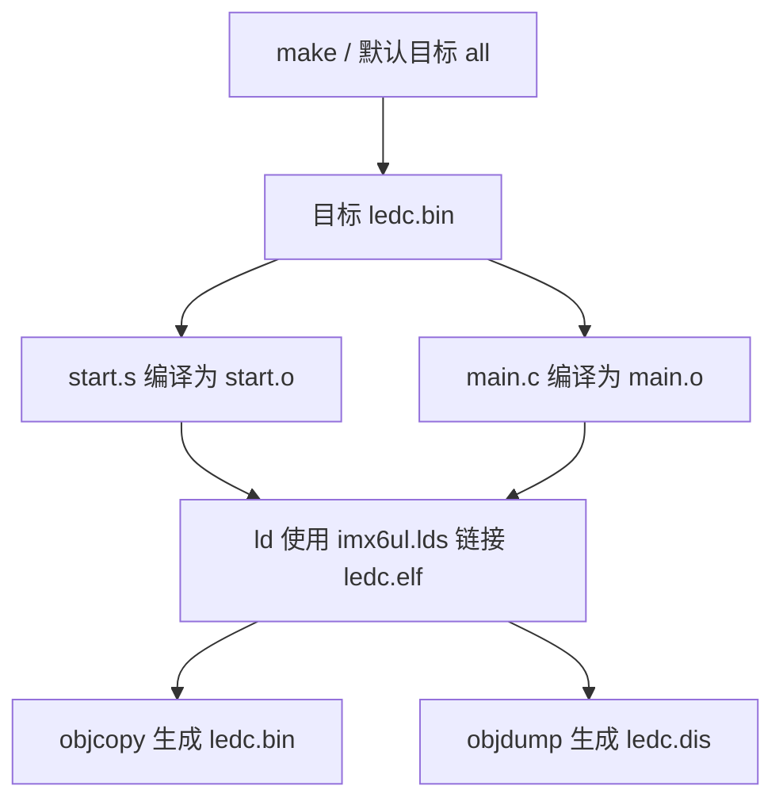

### 3.4 链接脚本设计

| 项目 | 实际设计 | 作用 |
|---|---|---|
| 程序入口 | `ENTRY(_start)` | 将 `_start` 设置为 ELF 入口 |
| 起始地址 | `. = 0x87800000` | 将后续输出段定位到该地址 |
| `.text` | 先保留 `.text._start` 和 `start.o(.text*)`，再收集全部 `.text*` | 保证启动代码位于普通 C 代码之前 |
| `.rodata` | 4 字节对齐并收集 `.rodata*` | 放置只读数据 |
| `.data` | 4 字节对齐并收集 `.data*` | 放置已初始化可写数据 |
| `__bss_start` | `.bss` 前对齐后的当前位置 | 标记 BSS 起点 |
| `.bss` | 4 字节对齐，收集 `.bss*` 和 `COMMON` | 放置零初始化及公共符号 |
| `__bss_end` | `.bss` 后对齐后的当前位置 | 标记 BSS 终点 |

当前 `start.s` 没有使用 `__bss_start`、`__bss_end` 清零 BSS。当前 `main.c` 没有 BSS 数据，因此当前构建产物中未形成 `.bss` 输出段；若后续增加零初始化全局/静态变量，其初值是否为零将取决于加载环境，不能由现有启动代码保证。

### 3.5 当前构建验证结果

执行 `make` 成功生成 `ledc.elf`、`ledc.bin`、`ledc.dis`。当前 ELF 的已验证信息如下：

- ELF 类型：32 位 ARM、小端、可执行文件。
- ELF 入口地址：`0x87800000`，对应 `_start`。
- 当前 `.text` 地址：`0x87800000`，大小 `0x140` 字节。
- 当前 `__bss_start` 与 `__bss_end` 均为 `0x87800140`。
- GCC 生成的 C 函数使用 Thumb 指令；ARM 状态的 `_start` 通过链接器生成的 `__main_from_arm` 跳板进入 Thumb 状态的 `main`。
- `-O2` 下，源代码层面的部分函数调用被内联；符号仍保留，但 `main` 中不一定出现相应 `bl` 调用。

## 4. 文件职责与文件级关系

| 文件 | 职责 | 对内依赖 | 对外依赖 |
|---|---|---|---|
| `Makefile` | 定义完整构建流程 | 引用其他四个文件形成产物 | GNU Make 和 ARM 交叉工具链 |
| `imx6ul.lds` | 定义入口、地址和段布局 | 引用 `_start`、`start.o`，产生 BSS 边界符号 | GNU ld 链接脚本语法 |
| `start.s` | 提供入口、设置 SVC 模式和栈、进入 C | 外部跳转到 `main` | ARM 指令集、有效 DDR |
| `main.h` | 提供 MMIO 访问宏、寄存器宏和 LED 位掩码 | 被 `main.c` 包含 | 芯片寄存器地址定义 |
| `main.c` | 实现时钟、LED、延时和主循环 | 包含 `main.h`；由 `start.s` 进入 | MMIO 硬件语义 |

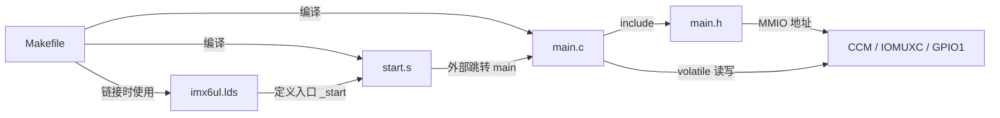

## 5. 符号与数据定义分析

### 5.1 宏定义

#### 5.1.1 通用寄存器访问宏

| 宏 | 定义 | 分析 |
|---|---|---|
| `REG32(addr)` | `(*(volatile unsigned int *)(addr))` | 将整数地址转换为指向 `volatile unsigned int` 的指针并解引用，形成可读写的 32 位 MMIO 左值。`volatile` 保证每次源代码访问都对硬件地址执行访问，但不提供原子性或并发保护。`unsigned int` 是否严格为 32 位需结合目标 ABI 确认；当前 ELF 为 32 位 ARM。 |

#### 5.1.2 CCM 时钟门控寄存器宏

| 宏 | 地址 | `main.c` 使用情况 |
|---|---:|---|
| `CCM_CCGR0` | `0x020C4068` | `clk_enable` 写 `0xffffffff` |
| `CCM_CCGR1` | `0x020C406C` | `clk_enable` 写 `0xffffffff` |
| `CCM_CCGR2` | `0x020C4070` | `clk_enable` 写 `0xffffffff` |
| `CCM_CCGR3` | `0x020C4074` | `clk_enable` 写 `0xffffffff` |
| `CCM_CCGR4` | `0x020C4078` | `clk_enable` 写 `0xffffffff` |
| `CCM_CCGR5` | `0x020C407C` | `clk_enable` 写 `0xffffffff` |
| `CCM_CCGR6` | `0x020C4080` | `clk_enable` 写 `0xffffffff` |

#### 5.1.3 IOMUX 寄存器宏

| 宏 | 地址 | `main.c` 使用情况 |
|---|---:|---|
| `SW_MUX_GPIO1_IO03` | `0x020E0068` | `led_init` 写 `0x5` |
| `SW_PAD_GPIO1_IO03` | `0x020E02F4` | `led_init` 写 `0x10B0` |

`0x5` 和 `0x10B0` 的各字段具体语义未在当前文件中定义，需结合芯片参考手册确认。

#### 5.1.4 GPIO1 寄存器宏

| 宏 | 地址 | `main.c` 使用情况 |
|---|---:|---|
| `GPIO1_DR` | `0x0209C000` | `led_init`、`led_on`、`led_off` 读改写 |
| `GPIO1_GDIR` | `0x0209C004` | `led_init` 读改写 |
| `GPIO1_PSR` | `0x0209C008` | 未使用 |
| `GPIO1_ICR1` | `0x0209C00C` | 未使用 |
| `GPIO1_ICR2` | `0x0209C010` | 未使用 |
| `GPIO1_IMR` | `0x0209C014` | 未使用 |
| `GPIO1_ISR` | `0x0209C018` | 未使用 |
| `GPIO1_EDGE_SEL` | `0x0209C01C` | 未使用 |

#### 5.1.5 LED 位掩码

| 宏 | 值 | 用途 |
|---|---:|---|
| `LED_GPIO_BIT` | `(1U << 3)`，即 `0x00000008` | 选择 GPIO1_IO03 对应的 bit3 |

### 5.2 链接符号与汇编符号

| 符号 | 来源 | 可见性/用途 |
|---|---|---|
| `_start` | `start.s` | 通过 `.global _start` 导出；链接入口 |
| `main` | `main.c` | 被 `start.s` 外部跳转；C 主入口 |
| `__bss_start` | `imx6ul.lds` | BSS 起点；当前代码未引用 |
| `__bss_end` | `imx6ul.lds` | BSS 终点；当前代码未引用 |
| `__main_from_arm` | 当前链接产物 | 链接器生成的 ARM 到 Thumb 跳板，不是源文件显式定义 |

### 5.3 全局变量、静态变量、结构体与枚举

| 类别 | 分析结果 |
|---|---|
| C 全局变量 | 无 |
| C 静态全局变量 | 无 |
| C 静态局部变量 | 无 |
| 结构体 | 无 |
| 枚举 | 无 |
| `typedef` | 无 |
| C 静态函数 | 无 |

寄存器宏展开后是固定地址处的 MMIO 左值，不是由本工程分配存储空间的 C 全局变量。

## 6. 函数与入口详细设计

### 6.1 `_start`

| 项目 | 说明 |
|---|---|
| 所在文件 | `start.s` |
| 类型 | 全局汇编入口标签，不是 C 函数 |
| 功能 | 保留 CPSR 其他位并将模式位改为 `0x13`，设置栈指针，跳转到 `main` |
| 入参 | 无显式入参；进入时寄存器状态未由当前代码约定 |
| 返回值 | 无；使用无链接分支 `b main`，未设置返回路径 |
| 局部变量/临时寄存器 | `r0`：暂存并修改 CPSR；`sp`：写为 `0x80200000` |
| 读全局/外部状态 | CPSR |
| 写全局/外部状态 | CPSR 模式位、栈指针 `sp` |
| 文件内调用 | 无 |
| 文件外调用 | 跳转到 `main.c` 的 `main`；当前构建中经链接器跳板 `__main_from_arm` 进入 Thumb 状态 |

执行流程：

1. 使用 `mrs r0, cpsr` 读取 CPSR。
2. 清除 `r0` 的低 5 位。
3. 将低 5 位设置为 `0x13`。
4. 写回 CPSR，使处理器进入 SVC 模式。
5. 将 `sp` 设置为 `0x80200000`。
6. 无返回跳转到 `main`。

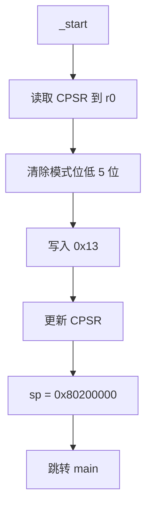

### 6.2 `clk_enable`

| 项目 | 说明 |
|---|---|
| 原型 | `void clk_enable(void)` |
| 功能 | 向七个 CCM 时钟门控寄存器写入全 1 |
| 入参 | 无 |
| 返回值 | 无 |
| 局部变量 | 无 |
| 读全局/外部状态 | 无显式 MMIO 读取 |
| 写全局/外部状态 | `CCM_CCGR0` 至 `CCM_CCGR6` |
| 文件内调用 | 无 |
| 文件外调用 | 无 |
| 调用者 | 源代码中为 `main`；当前 `-O2` 构建已内联到 `main` |

执行流程：按地址顺序向 `0x020C4068` 至 `0x020C4080` 的七个寄存器分别写入 `0xffffffff`。

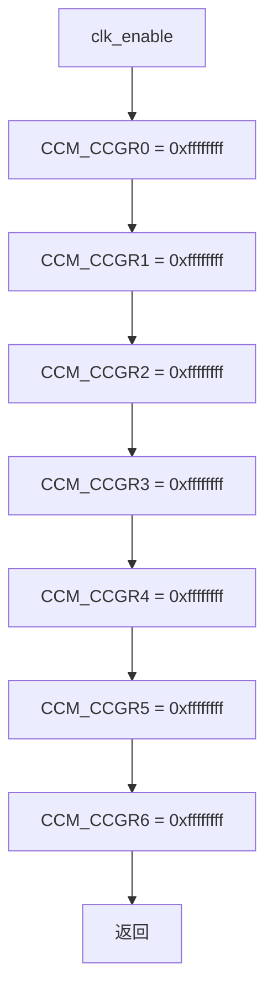

### 6.3 `led_init`

| 项目 | 说明 |
|---|---|
| 原型 | `void led_init(void)` |
| 功能 | 配置 GPIO1_IO03 的复用和 PAD 属性，将其设为输出并输出低电平 |
| 入参 | 无 |
| 返回值 | 无 |
| 局部变量 | 无 |
| 读全局/外部状态 | `GPIO1_GDIR`、`GPIO1_DR` |
| 写全局/外部状态 | `SW_MUX_GPIO1_IO03`、`SW_PAD_GPIO1_IO03`、`GPIO1_GDIR`、`GPIO1_DR` |
| 文件内调用 | 无 |
| 文件外调用 | 无 |
| 调用者 | `main` |

执行流程：

1. 向 `SW_MUX_GPIO1_IO03` 写入 `0x5`。
2. 向 `SW_PAD_GPIO1_IO03` 写入 `0x10B0`。
3. 对 `GPIO1_GDIR` 执行读改写，将 bit3 置 1。
4. 对 `GPIO1_DR` 执行读改写，将 bit3 清 0；代码注释将其定义为点亮 LED。

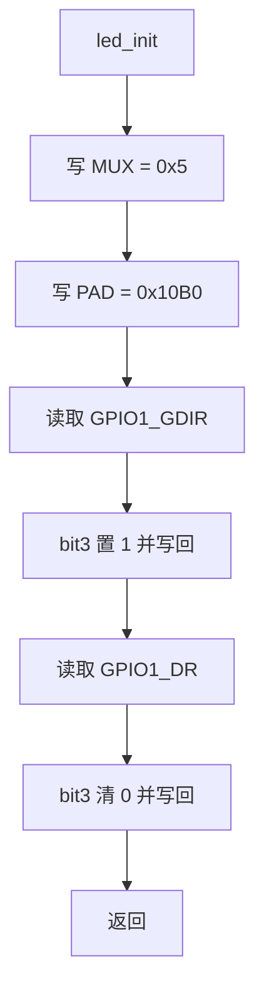

### 6.4 `led_on`

| 项目 | 说明 |
|---|---|
| 原型 | `void led_on(void)` |
| 功能 | 清除 `GPIO1_DR` 的 bit3；按代码注释表示点亮低有效 LED |
| 入参 | 无 |
| 返回值 | 无 |
| 局部变量 | 无 |
| 读全局/外部状态 | `GPIO1_DR` |
| 写全局/外部状态 | `GPIO1_DR` |
| 文件内调用 | 无 |
| 文件外调用 | 无 |
| 调用者 | 源代码中为 `main`；当前 `-O2` 构建已内联到 `main` |

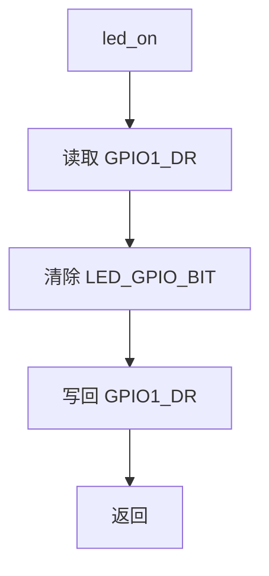

### 6.5 `led_off`

| 项目 | 说明 |
|---|---|
| 原型 | `void led_off(void)` |
| 功能 | 设置 `GPIO1_DR` 的 bit3；按代码注释表示关闭低有效 LED |
| 入参 | 无 |
| 返回值 | 无 |
| 局部变量 | 无 |
| 读全局/外部状态 | `GPIO1_DR` |
| 写全局/外部状态 | `GPIO1_DR` |
| 文件内调用 | 无 |
| 文件外调用 | 无 |
| 调用者 | 源代码中为 `main`；当前 `-O2` 构建已内联到 `main` |

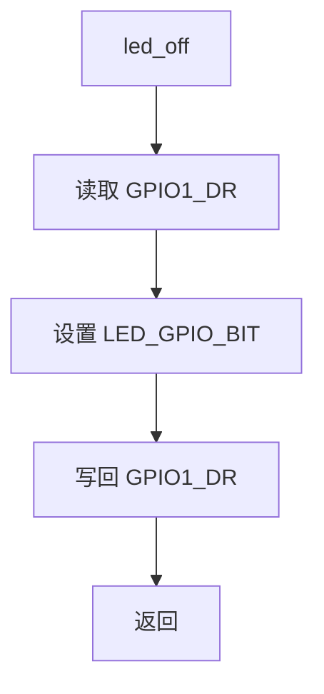

### 6.6 `delay_short`

| 项目 | 说明 |
|---|---|
| 原型 | `void delay_short(volatile unsigned int n)` |
| 功能 | 对参数执行递减空循环，形成软件延时 |
| 入参 | `n`：循环控制值；因其为函数内参数副本，对其递减不修改调用者变量 |
| 返回值 | 无 |
| 局部变量 | 无显式局部变量；参数 `n` 在函数内被反复读写 |
| 读全局/外部状态 | 无 |
| 写全局/外部状态 | 无 |
| 文件内调用 | 无 |
| 文件外调用 | 无 |
| 调用者 | 源代码中为 `delay`；当前 `-O2` 构建已将其循环内联到 `delay` |

循环条件使用后缀递减：每次判断使用递减前的值，同时将 `n` 减 1。传入 `0` 时仍会执行一次条件求值并产生无符号回绕，但循环体不执行。

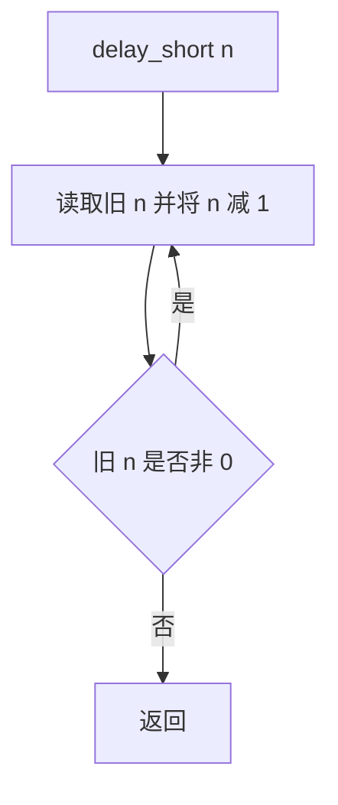

### 6.7 `delay`

| 项目 | 说明 |
|---|---|
| 原型 | `void delay(volatile unsigned int n)` |
| 功能 | 外层递减 `n`，每轮执行一次 `delay_short(0x7ff)` |
| 入参 | `n`：外层循环控制值；代码注释称为毫秒级延时，但没有可验证的时间换算 |
| 返回值 | 无 |
| 局部变量 | 无显式局部变量；参数 `n` 在函数内被反复读写 |
| 读全局/外部状态 | 无 |
| 写全局/外部状态 | 无 |
| 文件内调用 | `delay_short` |
| 文件外调用 | 无 |
| 调用者 | 源代码中为 `main`；当前 `-O2` 构建已将 `delay` 和内部短延时循环内联到 `main` |

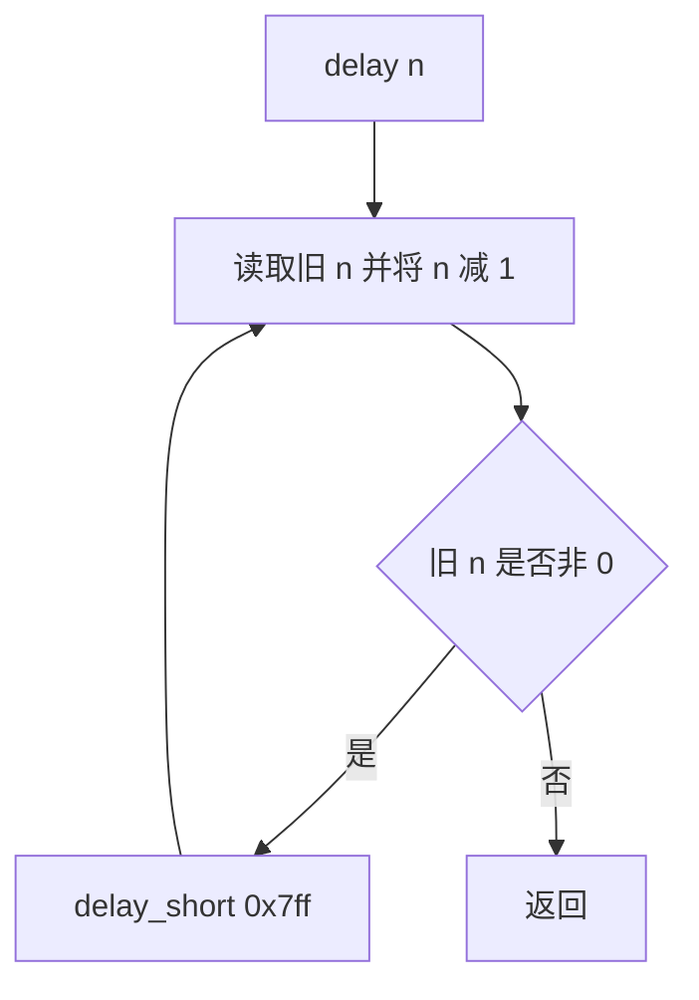

### 6.8 `main`

| 项目 | 说明 |
|---|---|
| 原型 | `int main(void)` |
| 功能 | 初始化时钟和 LED，然后无限循环切换 LED 状态 |
| 入参 | 无 |
| 返回值 | 源代码包含 `return 0`，但因前置无限循环，正常执行路径不可达 |
| 局部变量 | 无 |
| 读全局/外部状态 | 通过被调用函数读取 `GPIO1_GDIR`、`GPIO1_DR` |
| 写全局/外部状态 | 通过被调用函数写 CCM、IOMUXC、GPIO1 寄存器 |
| 文件内调用 | `clk_enable`、`led_init`、`led_off`、`delay`、`led_on` |
| 文件外调用 | 无 |
| 调用者 | `start.s` 的 `_start` |

执行流程：

1. 调用 `clk_enable` 开启时钟门控。
2. 调用 `led_init` 配置并点亮 LED。
3. 进入无限循环。
4. 关闭 LED，调用 `delay(500)`。
5. 点亮 LED，调用 `delay(500)`。
6. 返回步骤 4。

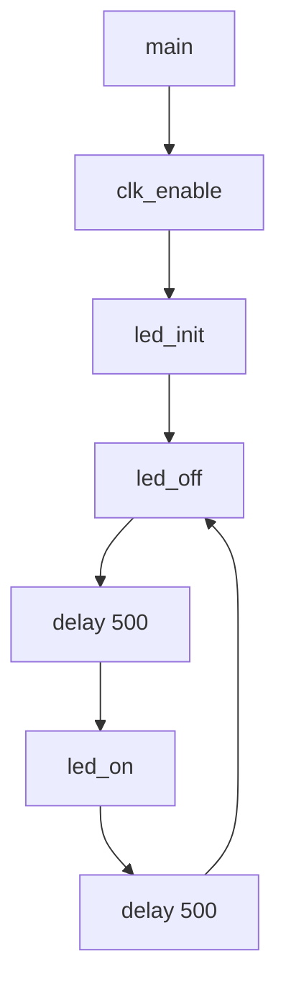

## 7. 调用关系分析

### 7.1 源代码层调用关系

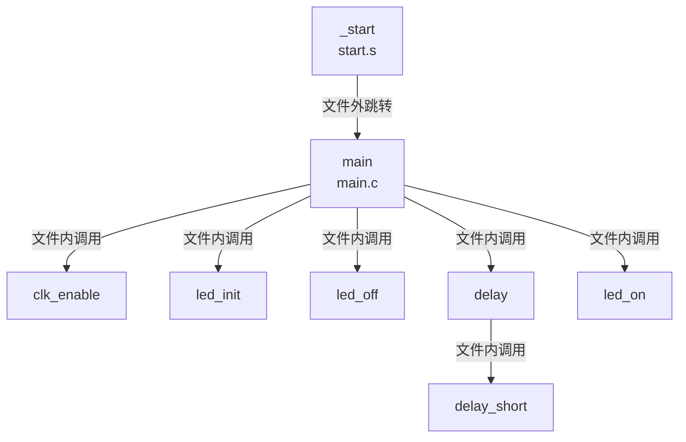

### 7.2 当前 `-O2` 构建产物中的实际关系

反汇编显示：

- `_start` 分支到链接器生成的 `__main_from_arm`，再进入 Thumb 状态的 `main`。
- `main` 中 `clk_enable`、`led_off`、`led_on` 和 `delay` 的逻辑已被内联。
- `main` 仍通过 `bl` 调用 `led_init`。
- `delay` 符号仍存在，但其中的 `delay_short` 循环已内联，不再调用 `delay_short`。
- 所有源代码函数符号仍存在，可供其他对象调用；当前工程没有其他调用者。

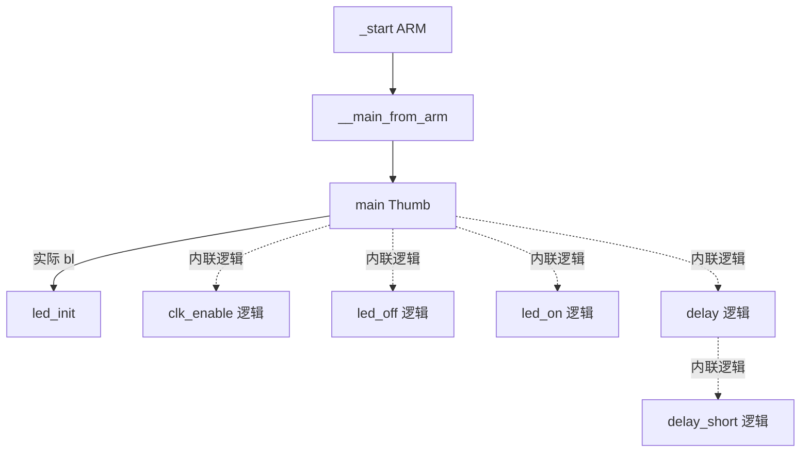

## 8. 数据流分析

### 8.1 控制与状态数据流

| 数据/状态 | 来源 | 变换 | 去向 |
|---|---|---|---|
| CPSR | 处理器当前状态 | 清除低 5 位后写入 `0x13` | CPSR |
| 栈顶地址 `0x80200000` | `start.s` 立即数池 | 直接装载 | `sp` |
| `0xffffffff` | `clk_enable` 常量 | 无 | 七个 CCM_CCGR 寄存器 |
| `0x5` | `led_init` 常量 | 无 | `SW_MUX_GPIO1_IO03` |
| `0x10B0` | `led_init` 常量 | 无 | `SW_PAD_GPIO1_IO03` |
| `LED_GPIO_BIT` | `main.h`，值为 bit3 | 与 GDIR 做 OR | `GPIO1_GDIR` |
| `LED_GPIO_BIT` | `main.h`，值为 bit3 | 与 DR 做 OR/AND-NOT | `GPIO1_DR` |
| `500` | `main` | 作为外层延时循环次数 | `delay` |
| `0x7ff` | `delay` | 作为内层延时循环次数 | `delay_short` |

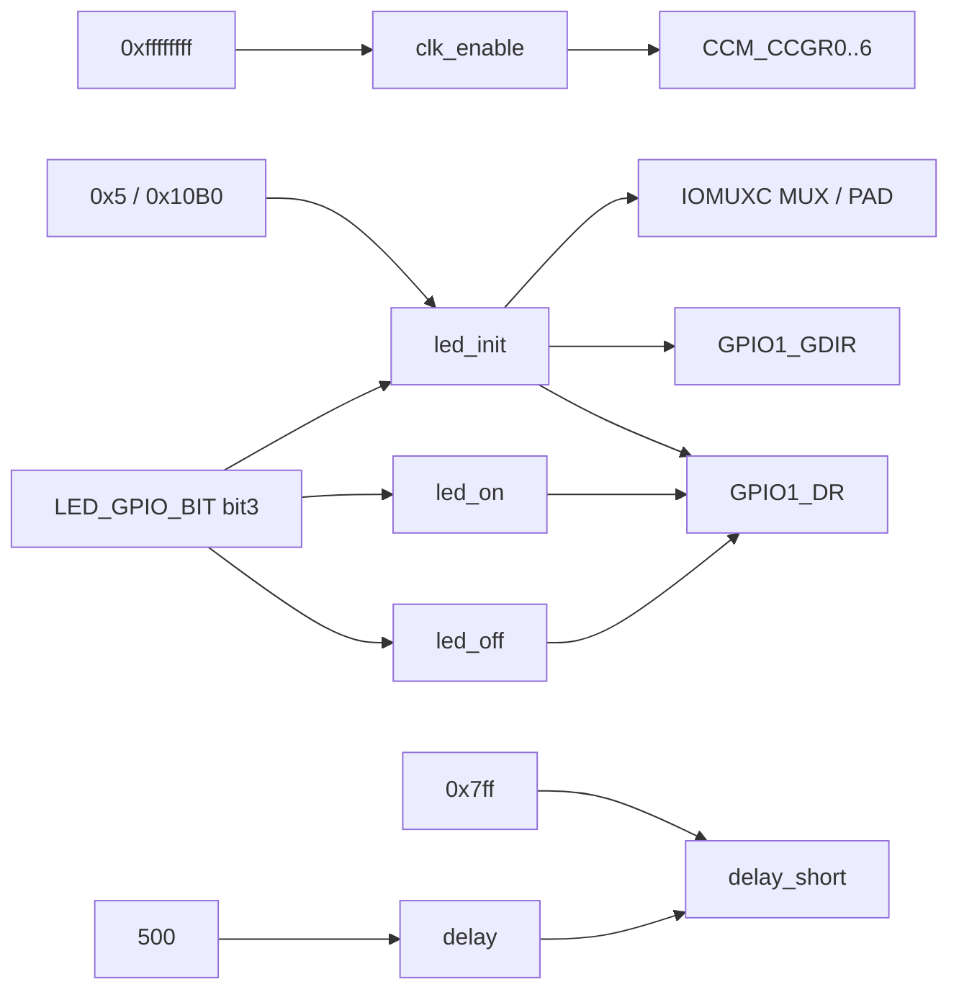

### 8.2 GPIO1_DR 状态演进

设 `D` 为读取到的 `GPIO1_DR` 原值，`M = 0x8`：

| 操作 | 写回值 | bit3 结果 | 按代码注释表示 |
|---|---|---|---|
| `led_init` | `D & ~M` | 0 | LED 点亮 |
| `led_off` | `D | M` | 1 | LED 关闭 |
| `led_on` | `D & ~M` | 0 | LED 点亮 |

所有操作均为寄存器读改写，理论上保持 `GPIO1_DR` 的其他位不变。若有中断、其他执行上下文或硬件机制同时修改该寄存器，是否会发生更新丢失需结合完整系统确认。

### 8.3 时序数据流

`main` 每个闪烁周期依次执行 `delay(500)` 两次。每次 `delay(500)` 源代码层面触发 500 次 `delay_short(0x7ff)`。实际时间由处理器频率、存储器等待、编译器版本和优化结果决定，当前代码没有时钟频率读取、定时器或校准逻辑，因此不能确认其等于 500 ms。

## 9. 风险与改进建议

| 优先级 | 风险/限制 | 实际依据 | 改进建议 |
|---|---|---|---|
| 高 | BSS 未清零 | 链接脚本定义 BSS 边界，但 `_start` 未使用 | 在进入 `main` 前按 `__bss_start` 到 `__bss_end` 清零；增加全局/静态变量前必须处理 |
| 高 | 栈地址和程序地址依赖外部 DDR 初始化与加载约定 | 地址均为硬编码，当前文件无 DDR 初始化和加载校验 | 将内存布局集中定义并与前级启动程序、下载脚本核对；需结合其他文件确认 |
| 高 | 全开所有 CCM 时钟门控可能增加功耗或影响未使用外设 | `clk_enable` 向七个 CCGR 写全 1 | 依据芯片手册仅开启 GPIO1/IOMUX 所需时钟；具体位定义需结合手册确认 |
| 中 | GPIO 读改写可能与其他上下文冲突 | `GPIO1_GDIR |=`、`GPIO1_DR |=`、`GPIO1_DR &=` 都是读改写 | 明确寄存器所有权；存在并发访问时使用临界区或芯片支持的原子设置/清除机制，是否支持需结合手册确认 |
| 中 | 软件延时不可提供稳定毫秒时序 | 延时只依赖空循环，注释也说明依赖频率和优化 | 使用硬件定时器实现可计算延时；具体外设选择需结合其他文件确认 |
| 中 | C 函数没有头文件原型 | `main.h` 仅包含宏，`main.c` 函数均为外部链接 | 若函数需要跨文件调用，在头文件声明；若仅限本文件使用，将辅助函数设为 `static` |
| 中 | 启动代码未明确处理中断状态、异常向量和各模式栈 | `_start` 只设置 SVC 模式和一个 `sp` | 根据完整运行需求初始化异常向量、屏蔽/配置中断并设置所需模式栈；需求需结合其他文件确认 |
| 中 | 链接脚本未声明 `MEMORY` 区域和越界检查 | 仅直接设置位置计数器 | 定义可执行 RAM 范围，并将段映射到内存区域以便链接期检查 |
| 中 | 链接脚本未显式处理未使用段 | 未见 `/DISCARD/`、`.ARM.attributes` 等规则 | 根据镜像要求明确保留或丢弃策略，避免工具链变化带来意外段 |
| 低 | `REG32` 使用基础类型表达 32 位宽度 | 使用 `unsigned int` | 在可用的裸机类型体系中使用明确的 32 位类型；是否引入 `<stdint.h>` 需结合工具链约束确认 |
| 低 | 魔数缺乏字段级说明 | `0x5`、`0x10B0`、`0xffffffff`、`0x7ff`、`500` 直接出现 | 为经手册确认的字段建立具名宏，并记录来源 |
| 低 | `main` 中 `return 0` 不可达 | 前置 `while (1)` 无退出路径 | 保留可表达标准签名，但可增加不可达说明；是否改为其他入口签名需结合 ABI 和团队规范确认 |
| 低 | 构建未生成自动头文件依赖 | `main.o` 规则只直接依赖 `main.c` | 使用 `-MMD -MP` 并包含 `.d` 文件，保证修改 `main.h` 后可靠重编译 |
| 低 | 链接目标未声明链接脚本依赖 | `ledc.bin` 仅依赖 `start.o main.o`，修改 `imx6ul.lds` 后可能不会自动重链接 | 将 `$(LDS)` 加入目标依赖，并在链接命令中明确只传入对象文件 |
| 低 | 构建警告：`start.s` 文件末尾缺少换行 | 当前执行 `make` 可复现 | 在 `start.s` 末尾补换行 |
| 低 | 构建警告：缺少 `.note.GNU-stack` | 当前链接器警告 `start.o` 暗示可执行栈 | 按目标工具链约定在汇编中声明 `.note.GNU-stack`；对裸机镜像的实际影响需结合加载环境确认 |

## 10. 可追踪性矩阵

| 需求/行为 | 实现位置 |
|---|---|
| ELF 入口为 `_start` | `imx6ul.lds:1` |
| 程序链接到 `0x87800000` | `imx6ul.lds:5` |
| 启动代码优先放置 | `imx6ul.lds:9-10` |
| 定义 BSS 边界 | `imx6ul.lds:24-34` |
| 设置 SVC 模式 | `start.s:14-17` |
| 设置栈顶 | `start.s:23` |
| 进入 C 主函数 | `start.s:28` |
| MMIO 访问 | `main.h:7` |
| LED 使用 GPIO1_IO03 bit3 | `main.h:23-24`、`main.h:29-30`、`main.h:41` |
| 开启时钟门控 | `main.c:6-15` |
| 初始化 LED GPIO | `main.c:20-43` |
| 点亮/关闭 LED | `main.c:48-59` |
| 软件延时 | `main.c:64-79` |
| LED 无限闪烁 | `main.c:84-98` |
| 构建 ELF/BIN/反汇编 | `Makefile:16-19` |

## 11. 结论

该工程实现了最小化的 ARM 裸机启动和 GPIO LED 闪烁链路，源代码职责清晰，且当前交叉工具链可成功构建。设计的关键外部前提是：程序确实被加载到 `0x87800000`、`0x80200000` 所在 DDR 已可用、寄存器地址及配置值与目标 i.MX6UL 和开发板一致。上述前提均需结合启动链、芯片参考手册和开发板原理图确认。
