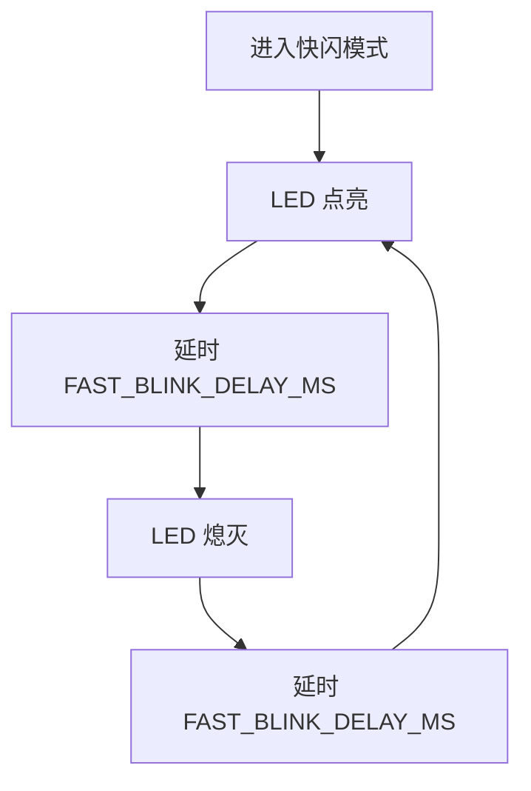
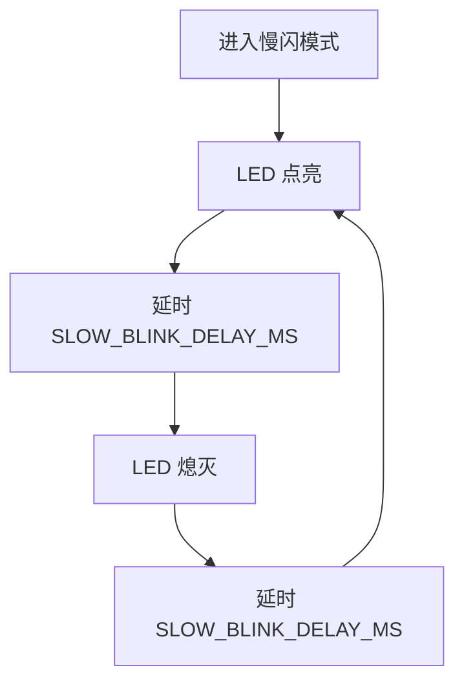
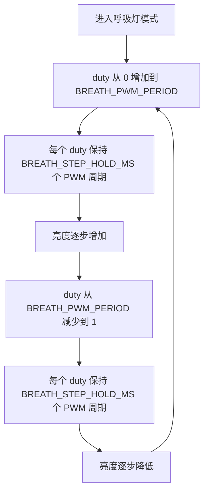

# i.MX6UL LED 三种显示模式详细设计文档

## 1. 文档范围

本文档基于当前工程的 `main.c` 和 `main.h` 编写，说明 GPIO1_IO03 LED 的三种显示模式源码设计：

- 快闪模式
- 慢闪模式
- 呼吸灯模式（软件 PWM 模拟）

本文档不引入定时器、中断、PWM 外设或操作系统。所有时间控制均沿用 `main.c` 中的软件延时函数，因此实际闪烁周期会受 CPU 频率、编译优化等级和运行环境影响。

## 2. 现有代码基础分析

### 2.1 硬件控制对象

当前 LED 接在 `GPIO1_IO03`，对应位掩码为：

```c
#define LED_GPIO_BIT        (1U << 3)
```

代码声明该 LED 为低电平有效：

- `GPIO1_DR &= ~LED_GPIO_BIT`：输出低电平，LED 点亮。
- `GPIO1_DR |= LED_GPIO_BIT`：输出高电平，LED 熄灭。

### 2.2 初始化流程

`main` 入口先执行：

```c
clk_enable();
led_init();
```

`clk_enable` 将 `CCM_CCGR0` 到 `CCM_CCGR6` 写为 `0xffffffff`，打开外设时钟门控。

`led_init` 完成三项工作：

1. 将 `GPIO1_IO03` 复用为 GPIO 功能。
2. 配置 PAD 电气属性。
3. 将 GPIO1 bit3 配置为输出，并默认点亮 LED。

### 2.3 延时模型

当前工程使用空循环延时：

```c
void delay_short(volatile unsigned int n)
{
    while (n--) {
    }
}

void delay(volatile unsigned int n)
{
    while (n--) {
        delay_short(0x7ff);
    }
}
```

`delay(n)` 表示近似毫秒级延时，但不是精确定时。本文后续的 `*_DELAY_MS` 名称表示软件延时单位，不代表严格物理毫秒。

## 3. 模式选择设计

源码使用宏选择默认运行模式：

```c
#define LED_MODE_FAST_BLINK     1
#define LED_MODE_SLOW_BLINK     2
#define LED_MODE_BREATHING      3

#ifndef LED_MODE
#define LED_MODE                LED_MODE_FAST_BLINK
#endif
```

默认模式为快闪。若需要切换模式，可以直接修改 `main.c` 中的默认值，例如：

```c
#define LED_MODE                LED_MODE_BREATHING
```

也可以在编译参数中定义 `LED_MODE`，例如将 `Makefile` 的 `CFLAGS` 临时改为：

```make
CFLAGS := -Wall -nostdlib -O2 -DLED_MODE=LED_MODE_BREATHING
```

`main` 根据宏选择模式：

```c
#if LED_MODE == LED_MODE_FAST_BLINK
    led_fast_blink_mode();
#elif LED_MODE == LED_MODE_SLOW_BLINK
    led_slow_blink_mode();
#elif LED_MODE == LED_MODE_BREATHING
    led_breathing_mode();
#else
    while (1) {
        led_off();
    }
#endif
```

所有模式函数内部均为无限循环，因此进入某个模式后不会返回。

## 4. 快闪模式详细设计

### 4.1 功能

快闪模式让 LED 以较短周期反复点亮和熄灭，用于快速状态提示。

### 4.2 参数

```c
#define FAST_BLINK_DELAY_MS     100
```

该参数表示：

- 点亮持续 `delay(100)`。
- 熄灭持续 `delay(100)`。
- 一个完整亮灭周期约为 `delay(200)`。

### 4.3 源码

```c
void led_fast_blink_mode(void)
{
    led_blink(FAST_BLINK_DELAY_MS, FAST_BLINK_DELAY_MS);
}
```

快闪复用通用闪烁函数：

```c
void led_blink(unsigned int on_delay_ms, unsigned int off_delay_ms)
{
    while (1) {
        led_on();
        delay(on_delay_ms);

        led_off();
        delay(off_delay_ms);
    }
}
```

### 4.4 流程



## 5. 慢闪模式详细设计

### 5.1 功能

慢闪模式让 LED 以较长周期反复点亮和熄灭，用于低频运行状态提示。

### 5.2 参数

```c
#define SLOW_BLINK_DELAY_MS     500
```

该参数表示：

- 点亮持续 `delay(500)`。
- 熄灭持续 `delay(500)`。
- 一个完整亮灭周期约为 `delay(1000)`。

### 5.3 源码

```c
void led_slow_blink_mode(void)
{
    led_blink(SLOW_BLINK_DELAY_MS, SLOW_BLINK_DELAY_MS);
}
```

### 5.4 流程



## 6. 呼吸灯模式详细设计

### 6.1 功能

呼吸灯模式通过软件 PWM 模拟亮度变化。程序在一个固定周期内控制 LED 点亮时间比例：

- 点亮时间比例低时，人眼看到亮度较低。
- 点亮时间比例高时，人眼看到亮度较高。
- 占空比从 0 逐步增加到满周期，再从满周期逐步减少到 0，形成由暗到亮再由亮到暗的视觉效果。

### 6.2 参数

```c
#define BREATH_PWM_PERIOD       40
#define BREATH_PWM_TICK_DELAY   0x3ff
#define BREATH_STEP_HOLD_MS     8
```

| 参数 | 含义 | 影响 |
|---|---|---|
| `BREATH_PWM_PERIOD` | 一个软件 PWM 周期内的 tick 数 | 数值越大，亮度级数越细，但单周期计算量越大 |
| `BREATH_PWM_TICK_DELAY` | 每个 PWM tick 的短延时 | 数值越大，PWM 频率越低 |
| `BREATH_STEP_HOLD_MS` | 每个占空比等级保持的 PWM 周期数 | 数值越大，呼吸变化越慢 |

### 6.3 单周期软件 PWM 源码

```c
void led_soft_pwm_cycle(unsigned int on_ticks, unsigned int period_ticks)
{
    unsigned int i;

    for (i = 0; i < period_ticks; i++) {
        if (i < on_ticks) {
            led_on();
        } else {
            led_off();
        }

        delay_short(BREATH_PWM_TICK_DELAY);
    }
}
```

`on_ticks` 表示本周期内点亮的 tick 数，`period_ticks` 表示本周期总 tick 数。占空比近似为：

```text
duty_ratio = on_ticks / period_ticks
```

例如 `period_ticks = 40` 时：

- `on_ticks = 0`：全灭。
- `on_ticks = 10`：约 25% 亮度。
- `on_ticks = 20`：约 50% 亮度。
- `on_ticks = 40`：全亮。

### 6.4 呼吸循环源码

```c
void led_breathing_mode(void)
{
    unsigned int duty;
    unsigned int hold;

    while (1) {
        for (duty = 0; duty <= BREATH_PWM_PERIOD; duty++) {
            for (hold = 0; hold < BREATH_STEP_HOLD_MS; hold++) {
                led_soft_pwm_cycle(duty, BREATH_PWM_PERIOD);
            }
        }

        for (duty = BREATH_PWM_PERIOD; duty > 0; duty--) {
            for (hold = 0; hold < BREATH_STEP_HOLD_MS; hold++) {
                led_soft_pwm_cycle(duty, BREATH_PWM_PERIOD);
            }
        }
    }
}
```

### 6.5 流程



## 7. 源码结构

当前 `main.c` 的主要函数职责如下：

| 函数 | 职责 |
|---|---|
| `clk_enable` | 打开外设时钟门控 |
| `led_init` | 配置 GPIO1_IO03 为 LED 输出 |
| `led_on` | 点亮低电平有效 LED |
| `led_off` | 熄灭低电平有效 LED |
| `delay_short` | 短空循环延时 |
| `delay` | 基于 `delay_short` 的较长软件延时 |
| `led_blink` | 通用亮灭闪烁循环 |
| `led_fast_blink_mode` | 快闪模式入口 |
| `led_slow_blink_mode` | 慢闪模式入口 |
| `led_soft_pwm_cycle` | 软件 PWM 单周期输出 |
| `led_breathing_mode` | 呼吸灯模式入口 |
| `main` | 初始化硬件并按 `LED_MODE` 进入目标模式 |

## 8. 可调试与验证方法

### 8.1 构建验证

执行：

```bash
make clean
make
```

预期生成：

- `ledc.elf`
- `ledc.bin`
- `ledc.dis`

### 8.2 模式验证

将 `ledc.bin` 下载到开发板后观察 LED：

| 模式 | 预期现象 |
|---|---|
| `LED_MODE_FAST_BLINK` | LED 快速亮灭 |
| `LED_MODE_SLOW_BLINK` | LED 慢速亮灭 |
| `LED_MODE_BREATHING` | LED 亮度由暗到亮，再由亮到暗循环变化 |

### 8.3 参数调试建议

若快闪过快或过慢，调整：

```c
#define FAST_BLINK_DELAY_MS     100
```

若慢闪过快或过慢，调整：

```c
#define SLOW_BLINK_DELAY_MS     500
```

若呼吸灯变化不平滑，优先调整：

```c
#define BREATH_PWM_PERIOD       40
```

若呼吸灯整体变化太快或太慢，优先调整：

```c
#define BREATH_STEP_HOLD_MS     8
```

若呼吸灯有明显闪烁感，说明软件 PWM 频率偏低，可以减小：

```c
#define BREATH_PWM_TICK_DELAY   0x3ff
```

## 9. 设计限制

1. 当前呼吸灯是软件 PWM 模拟，不是硬件 PWM，CPU 会一直被空循环占用。
2. 当前工程没有中断调度能力，进入任意模式后不会执行其他任务。
3. 软件延时不精确，实际周期需要在目标板上实测后校准。
4. 呼吸灯亮度变化是线性占空比变化，人眼感知不是严格线性；如果需要更自然的视觉效果，可以后续增加伽马表，但当前启动代码未清零 BSS，应避免依赖未初始化全局数据。
5. 当前 `led_init` 默认点亮 LED，随后由目标模式接管 LED 状态。
