# i.MX6UL LED 裸机工程详细设计说明书

## 1. 文档范围与分析原则

本文档仅基于以下五个实际文件进行静态分析，并使用当前工程的实际构建产物进行交叉验证：

- `imx6ul.h`
- `imx6ul.lds`
- `main.c`
- `Makefile`
- `start.s`

本文不把芯片参考手册、开发板原理图、下载工具和前级启动程序中未提供的信息当作已知事实。无法由上述文件和当前构建结果确认的信息，统一标注为“需结合其他文件确认”。

## 2. 系统概述

该工程是一个不依赖标准库的 ARM 裸机 LED 闪烁程序。构建系统使用 `arm-linux-gnueabihf-` 交叉工具链，将启动汇编 `start.s` 和 C 程序 `main.c` 链接到地址 `0x87800000`。

处理器从 `_start` 进入后执行以下过程：

1. 将处理器模式切换为 SVC 模式。
2. 使用链接脚本提供的 `__bss_start` 和 `__bss_end` 清零 BSS。
3. 将栈指针设置为 `0x80200000`。
4. 跳转到 `main`。
5. `main` 开启 CCM 的全部七组时钟门控，配置 GPIO1_IO03，并循环切换其输出电平。

代码注释定义 LED 为低电平有效；实际 LED 是否连接到 GPIO1_IO03、是否低电平点亮，需结合开发板原理图确认。

## 3. 文件职责与外部依赖

### 3.1 文件职责

| 文件 | 主要职责 | 对内依赖 | 对外依赖 |
|---|---|---|---|
| `imx6ul.h` | 定义外设基地址、寄存器结构体和 MMIO 访问指针宏 | 被 `main.c` 包含 | 寄存器布局与地址正确性需结合芯片参考手册确认 |
| `imx6ul.lds` | 定义 ELF 入口、链接地址、段布局和 BSS 边界符号 | 引用 `_start` 和 `start.o`；向 `start.s` 提供 BSS 边界 | GNU ld 链接脚本语法 |
| `main.c` | 实现时钟开启、LED 初始化/控制、软件延时和主循环 | 包含 `imx6ul.h`；由 `_start` 进入 | CCM、IOMUX 和 GPIO1 硬件行为 |
| `Makefile` | 定义编译、链接、二进制转换、反汇编和清理规则 | 使用其余四个文件形成产物 | GNU Make 与 ARM 交叉工具链 |
| `start.s` | 提供裸机入口、切换模式、清零 BSS、设置栈并进入 C | 使用链接符号并跳转到 `main` | ARM 指令集、有效栈内存和启动环境 |

### 3.2 外部依赖

| 依赖 | 使用位置 | 用途 | 确认状态 |
|---|---|---|---|
| GNU Make | `Makefile` | 执行构建规则 | 当前环境已验证 |
| `arm-linux-gnueabihf-gcc` | `Makefile` | 编译汇编和 C 文件 | 当前环境已验证 |
| `arm-linux-gnueabihf-ld` | `Makefile` | 使用 `imx6ul.lds` 链接 ELF | 当前环境已验证 |
| `arm-linux-gnueabihf-objcopy` | `Makefile` | 将 ELF 转换为原始二进制 | 当前环境已验证 |
| `arm-linux-gnueabihf-objdump` | `Makefile` | 生成反汇编文件 | 当前环境已验证 |
| ARM 处理器、CPSR 和 SVC 模式 | `start.s` | 执行启动代码 | 目标架构可由代码确认；具体启动状态需结合其他文件确认 |
| 可写地址 `0x80200000` 附近的栈空间 | `start.s` | 作为栈顶 | 是否已初始化且不会覆盖其他数据，需结合其他文件确认 |
| 可执行地址 `0x87800000` | `imx6ul.lds` | 程序链接与执行基址 | 是否与实际加载地址一致，需结合其他文件确认 |
| CCM、IOMUX、GPIO MMIO | `imx6ul.h`、`main.c` | 配置时钟、引脚和 GPIO | 地址、偏移和配置值需结合芯片参考手册确认 |
| 开发板 LED 电路 | `main.c` | 将 GPIO1_IO03 电平映射为 LED 状态 | 需结合其他文件确认 |

### 3.3 文件级关系图

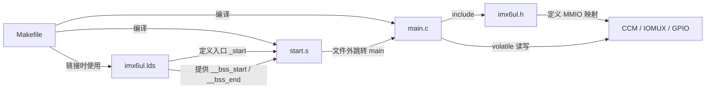

## 4. Makefile 详细设计

### 4.1 变量

| 变量 | 实际值 | 作用 |
|---|---|---|
| `CROSS_COMPILE` | `arm-linux-gnueabihf-` | 交叉工具链命令前缀 |
| `CC` | `arm-linux-gnueabihf-gcc` | 编译 `.s`、`.S` 和 `.c` |
| `LD` | `arm-linux-gnueabihf-ld` | 链接目标文件 |
| `OBJCOPY` | `arm-linux-gnueabihf-objcopy` | 生成原始二进制 |
| `OBJDUMP` | `arm-linux-gnueabihf-objdump` | 生成反汇编文本 |
| `TARGET` | `ledc` | 输出文件基础名 |
| `OBJS` | `start.o main.o` | 链接输入对象 |
| `CFLAGS` | `-Wall -Wextra -O2 -nostdlib -ffreestanding` | 启用常见/额外警告、二级优化、无标准库和独立环境编译 |

### 4.2 目标与规则

| 目标/规则 | 依赖 | 动作 |
|---|---|---|
| 默认目标 `ledc.bin` | `start.o main.o` | 链接 `ledc.elf`，生成 `ledc.bin` 和 `ledc.dis` |
| `%.o: %.s` | 同名小写 `.s` | 使用 `$(CC) $(CFLAGS) -c` 编译 |
| `%.o: %.S` | 同名大写 `.S` | 使用相同命令编译；当前工程没有 `.S` 输入 |
| `%.o: %.c` | 同名 `.c` | 使用相同命令编译 |
| `clean` | 无 | 删除当前目录的对象文件和 `ledc.bin`、`ledc.elf`、`ledc.dis` |

`ledc.bin` 规则没有显式依赖 `imx6ul.lds`；只修改链接脚本后直接执行 `make`，可能不会触发重新链接。

### 4.3 构建流程图

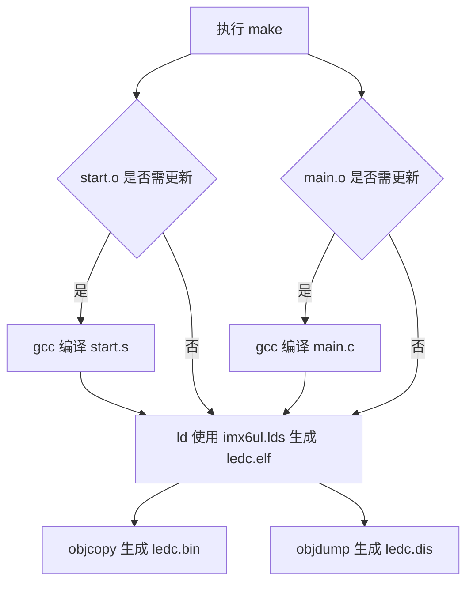

### 4.4 当前构建验证

执行 `make` 成功。当前构建产物验证结果：

| 项目 | 实际结果 |
|---|---|
| ELF 类型 | ELF32、little-endian、ARM、可执行文件 |
| ELF 入口 | `0x87800000`，对应 `_start` |
| `.text` | 地址 `0x87800000`，大小 `0xE0`（224）字节 |
| `.data` / `.bss` | 当前均为 0 字节 |
| `__bss_start` / `__bss_end` | 当前均为 `0x878000E0` |
| `ledc.bin` | 224 字节 |
| 优化结果 | `main.c` 的全部静态函数均被内联，最终 ELF 中没有这些静态函数的独立符号 |
| 状态切换 | `_start` 为 ARM 指令；链接器生成 `__main_from_arm` 跳板进入 Thumb 状态的 `main` |

构建产生两个告警：

- `start.s` 文件末尾没有换行，汇编器自动插入换行。
- `start.o` 缺少 `.note.GNU-stack`，链接器据此提示可执行栈；其对当前裸机加载环境的实际影响需结合其他文件确认。

## 5. 链接脚本 `imx6ul.lds` 详细设计

### 5.1 链接布局

| 项目 | 实际定义 | 作用 |
|---|---|---|
| 入口 | `ENTRY(_start)` | 将 `_start` 设置为 ELF 入口 |
| 起始地址 | `. = 0x87800000` | 将后续输出段定位到该地址 |
| `.text` | 优先保留 `.text._start`、`start.o(.text*)`，再收集 `*(.text*)` | 保证启动代码排在普通代码前 |
| `.rodata` | `ALIGN(4)` 后收集 `*(.rodata*)` | 放置只读数据 |
| `.data` | `ALIGN(4)` 后收集 `*(.data*)` | 放置已初始化可写数据 |
| `__bss_start` | `.bss` 前进行 4 字节对齐后定义 | 供启动代码确定 BSS 起点 |
| `.bss` | `ALIGN(4)` 后收集 `*(.bss*)` 和 `*(COMMON)` | 放置零初始化数据和 COMMON 符号 |
| `__bss_end` | `.bss` 后进行 4 字节对齐后定义 | 供启动代码确定 BSS 终点 |

### 5.2 内存布局图

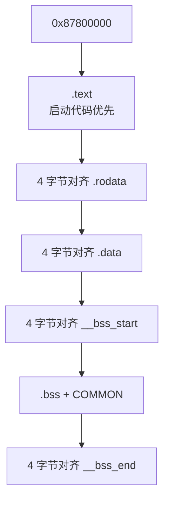

链接脚本没有定义 `MEMORY` 区域、栈区域、堆区域、镜像大小限制或 `/DISCARD/` 规则。实际可用内存边界及加载约束需结合其他文件确认。

## 6. `imx6ul.h` 符号与数据类型设计

### 6.1 头文件保护宏

| 宏 | 作用 |
|---|---|
| `__IMX6UL_H__` | 防止头文件被重复包含 |

该名称以双下划线开头；此类标识符通常应避免由应用代码定义，具体约束需结合采用的 C 语言规范和工具链确认。

### 6.2 外设基地址宏

| 宏 | 地址 | 对应结构类型 | 当前是否使用 |
|---|---:|---|---|
| `CCM_BASE` | `0x020C4000U` | `CCM_Type` | 是 |
| `CCM_ANALOG_BASE` | `0x020C8000U` | `CCM_ANALOG_Type` | 否 |
| `IOMUX_SW_MUX_BASE` | `0x020E0014U` | `IOMUX_SW_MUX_Type` | 是 |
| `IOMUX_SW_PAD_BASE` | `0x020E0204U` | `IOMUX_SW_PAD_Type` | 是 |
| `GPIO1_BASE` | `0x0209C000U` | `GPIO_Type` | 是 |
| `GPIO2_BASE` | `0x020A0000U` | `GPIO_Type` | 否 |
| `GPIO3_BASE` | `0x020A4000U` | `GPIO_Type` | 否 |
| `GPIO4_BASE` | `0x020A8000U` | `GPIO_Type` | 否 |
| `GPIO5_BASE` | `0x020AC000U` | `GPIO_Type` | 否 |

### 6.3 MMIO 指针宏

| 宏 | 展开结果 | 用途 |
|---|---|---|
| `CCM` | `((CCM_Type *)CCM_BASE)` | 访问 CCM 寄存器 |
| `CCM_ANALOG` | `((CCM_ANALOG_Type *)CCM_ANALOG_BASE)` | 访问 CCM 模拟寄存器；当前未使用 |
| `IOMUX_SW_MUX` | `((IOMUX_SW_MUX_Type *)IOMUX_SW_MUX_BASE)` | 访问引脚复用寄存器 |
| `IOMUX_SW_PAD` | `((IOMUX_SW_PAD_Type *)IOMUX_SW_PAD_BASE)` | 访问 PAD 控制寄存器 |
| `GPIO1` 至 `GPIO5` | `((GPIO_Type *)GPIOx_BASE)` | 访问对应 GPIO 控制器；当前仅使用 `GPIO1` |

这些宏是固定地址的类型化指针，不是由程序分配存储空间的全局变量。结构体成员均为 `volatile unsigned int`，因此源代码中的成员读写会形成 MMIO 访问；`unsigned int` 的实际宽度需结合目标 ABI 确认，当前构建为 32 位 ARM。

### 6.4 结构体

#### 6.4.1 `CCM_Type`

职责：按顺序映射 CCM 寄存器。成员共 36 个 32 位槽位，其中保留数组占 5 个槽位。

成员顺序：

`CCR`、`CCDR`、`CSR`、`CCSR`、`CACRR`、`CBCDR`、`CBCMR`、`CSCMR1`、`CSCMR2`、`CSCDR1`、`CS1CDR`、`CS2CDR`、`CDCDR`、`CHSCCDR`、`CSCDR2`、`CSCDR3`、`RESERVED_1[2]`、`CDHIPR`、`RESERVED_2[2]`、`CLPCR`、`CISR`、`CIMR`、`CCOSR`、`CGPR`、`CCGR0`、`CCGR1`、`CCGR2`、`CCGR3`、`CCGR4`、`CCGR5`、`CCGR6`、`RESERVED_3[1]`、`CMEOR`。

当前代码只写 `CCGR0` 至 `CCGR6`。在每个成员占 4 字节且无额外填充的当前目标 ABI 下，其偏移分别为 `0x68` 至 `0x80`；反汇编已验证这些偏移。

#### 6.4.2 `CCM_ANALOG_Type`

职责：按顺序映射 CCM 模拟/PLL/PFD/MISC 寄存器。当前工程只定义访问能力，没有实际读写。

成员分组：

- ARM/USB/SYS PLL：`PLL_ARM` 及其 `SET/CLR/TOG`，`PLL_USB1`、`PLL_USB2`、`PLL_SYS` 及各自 `SET/CLR/TOG`。
- SYS 扩展：`PLL_SYS_SS`、`PLL_SYS_NUM`、`PLL_SYS_DENOM` 及保留槽位。
- AUDIO/VIDEO PLL：`PLL_AUDIO`、`PLL_VIDEO` 及对应扩展和保留槽位。
- ENET/PFD：`PLL_ENET` 及 `SET/CLR/TOG`，`PFD_480` 和 `PFD_528` 及各自 `SET/CLR/TOG`。
- MISC：`MISC0`、`MISC1`、`MISC2` 及各自 `SET/CLR/TOG`。
- 保留数组：`RESERVED_1` 至 `RESERVED_7`。

各字段的硬件语义和保留区长度正确性需结合芯片参考手册确认。

#### 6.4.3 `IOMUX_SW_MUX_Type`

职责：映射 IOMUX 引脚复用选择寄存器。每个成员对应一个具名引脚的复用控制槽位。

成员覆盖以下引脚组：

- 启动与安全：`BOOT_MODE0/1`、`SNVS_TAMPER0..9`。
- JTAG：`JTAG_MOD`、`JTAG_TMS`、`JTAG_TDO`、`JTAG_TDI`、`JTAG_TCK`、`JTAG_TRST_B`。
- GPIO1：`GPIO1_IO00..09`。
- UART：`UART1..5` 的已列出信号。
- ENET：`ENET1`、`ENET2` 的已列出收发信号。
- LCD：`LCD_CLK`、控制信号和 `LCD_DATA00..23`。
- NAND：控制信号和 `NAND_DATA00..07`。
- SD1：`SD1_CMD`、`SD1_CLK`、`SD1_DATA0..3`。
- CSI：时钟、同步和 `CSI_DATA00..07`。

当前代码仅写 `GPIO1_IO03`。其结构体偏移为 `0x54`，对应实际地址 `0x020E0068`；反汇编已验证最终写地址偏移。

#### 6.4.4 `IOMUX_SW_PAD_Type`

职责：映射 IOMUX PAD 电气属性控制寄存器。

成员覆盖以下组：

- DRAM：`DRAM_ADDR00..15`、DQM、RAS/CAS、片选、时钟、数据选通和其他已列出 DRAM 信号。
- 系统/启动/安全：`TEST_MODE`、`POR_B`、`ONOFF`、PMIC 请求、`BOOT_MODE0/1`、`SNVS_TAMPER0..9`。
- JTAG、GPIO1、UART、ENET、LCD、NAND、SD1、CSI：与结构体中列出的具名信号对应。
- 组控制：`GRP_ADDDS`、`GRP_DDRMODE_CTL`、`GRP_B0DS`、`GRP_DDRPK`、`GRP_CTLDS`、`GRP_B1DS`、`GRP_DDRHYS`、`GRP_DDRPKE`、`GRP_DDRMODE`、`GRP_DDR_TYPE`。

当前代码仅写 `GPIO1_IO03`。其结构体偏移为 `0xF0`，对应实际地址 `0x020E02F4`；反汇编已验证最终写地址偏移。

#### 6.4.5 `GPIO_Type`

职责：映射一个 GPIO 控制器的八个寄存器。

| 成员 | 偏移 | 当前使用 | 代码层用途 |
|---|---:|---|---|
| `DR` | `0x00` | 是 | 读改写 GPIO1_IO03 输出电平 |
| `GDIR` | `0x04` | 是 | 读改写 GPIO1_IO03 方向 |
| `PSR` | `0x08` | 否 | 需结合芯片参考手册确认 |
| `ICR1` | `0x0C` | 否 | 需结合芯片参考手册确认 |
| `ICR2` | `0x10` | 否 | 需结合芯片参考手册确认 |
| `IMR` | `0x14` | 否 | 需结合芯片参考手册确认 |
| `ISR` | `0x18` | 否 | 需结合芯片参考手册确认 |
| `EDGE_SEL` | `0x1C` | 否 | 需结合芯片参考手册确认 |

### 6.5 枚举、全局变量和静态变量

| 类别 | 分析结果 |
|---|---|
| 枚举 | 无 |
| C 全局变量 | 无 |
| C 文件级静态变量 | 无 |
| C 静态局部变量 | 无 |
| `typedef` | 有五个匿名结构体类型别名：`CCM_Type`、`CCM_ANALOG_Type`、`IOMUX_SW_MUX_Type`、`IOMUX_SW_PAD_Type`、`GPIO_Type` |
| 链接符号 | `__bss_start`、`__bss_end` |
| 汇编全局符号 | `_start`、`__bss_start`、`__bss_end` |

## 7. `main.c` 宏定义

| 宏 | 值 | 使用位置 | 分析 |
|---|---:|---|---|
| `LED_GPIO_BIT` | `3U` | `led_init`、`led_on`、`led_off` | 通过 `1U << LED_GPIO_BIT` 形成 bit3 掩码 `0x8` |
| `LED_PAD_CONFIG` | `0x10B0U` | `led_init` | 写入 GPIO1_IO03 PAD 配置；字段含义需结合芯片参考手册确认 |
| `LED_MUX_GPIO_MODE` | `0x5U` | `led_init` | 写入 GPIO1_IO03 MUX 配置；模式含义需结合芯片参考手册确认 |

## 8. 函数与入口详细设计

### 8.1 `_start`

| 项目 | 说明 |
|---|---|
| 所在文件 | `start.s` |
| 类型 | 全局汇编入口标签，不是 C 函数 |
| 功能 | 切换到 SVC 模式、清零 BSS、设置栈并跳转到 `main` |
| 入参 | 无显式入参；入口寄存器状态未由当前代码约定 |
| 返回值 | 无；通过无链接分支 `b main` 进入 C 代码 |
| 局部变量/寄存器 | `r0`：CPSR 临时值及 BSS 当前地址；`r1`：BSS 结束地址；`r2`：零值；`sp`：栈指针 |
| 读取全局/外部状态 | CPSR、`__bss_start`、`__bss_end` |
| 写入全局/外部状态 | CPSR 模式位、BSS 地址区间、`sp` |
| 文件内跳转 | `bss_loop`、`bss_done` |
| 文件外调用/跳转 | `main` |

执行流程：

1. 读取 CPSR 到 `r0`。
2. 清除低 5 位并写入 `0x13`，保留 CPSR 其他位。
3. 将 `r0`、`r1` 分别设置为 `__bss_start`、`__bss_end`，将 `r2` 设置为 0。
4. 当 `r0 < r1` 时，每次向 `[r0]` 写入 4 字节零并令 `r0 += 4`。
5. 将 `sp` 设置为 `0x80200000`。
6. 跳转到 `main`。当前构建中实际先经过链接器生成的 `__main_from_arm`。

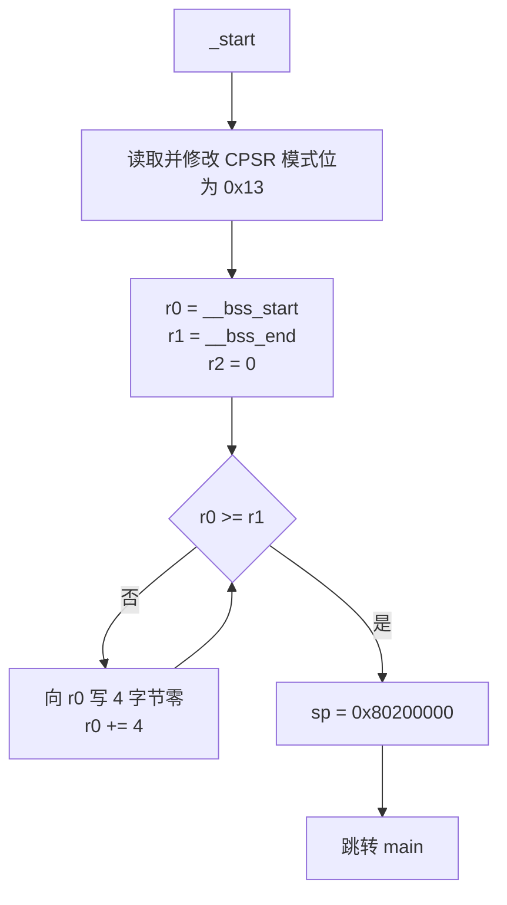

### 8.2 `clk_enable`

| 项目 | 说明 |
|---|---|
| 原型 | `static void clk_enable(void)` |
| 功能 | 向 `CCM->CCGR0` 至 `CCM->CCGR6` 分别写入全 1 |
| 入参 | 无 |
| 返回值 | 无 |
| 局部变量 | 无 |
| 读取全局/外部状态 | 无显式 MMIO 读取 |
| 写入全局/外部状态 | 七个 CCM CCGR 寄存器 |
| 文件内调用 | 无 |
| 文件外调用 | 无 |
| 调用者 | 源码层为 `main`；当前 `-O2` 构建中被内联 |

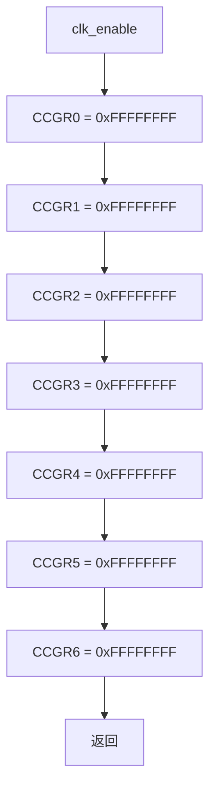

### 8.3 `led_init`

| 项目 | 说明 |
|---|---|
| 原型 | `static void led_init(void)` |
| 功能 | 配置 GPIO1_IO03 的复用和 PAD，设为输出并输出低电平 |
| 入参 | 无 |
| 返回值 | 无 |
| 局部变量 | 无显式局部变量；读改写过程会产生编译器临时值 |
| 读取全局/外部状态 | `GPIO1->GDIR`、`GPIO1->DR` |
| 写入全局/外部状态 | `IOMUX_SW_MUX->GPIO1_IO03`、`IOMUX_SW_PAD->GPIO1_IO03`、`GPIO1->GDIR`、`GPIO1->DR` |
| 文件内调用 | 无 |
| 文件外调用 | 无 |
| 调用者 | 源码层为 `main`；当前 `-O2` 构建中被内联 |

执行流程：

1. 向 MUX 寄存器写 `0x5`。
2. 向 PAD 寄存器写 `0x10B0`。
3. 对 `GPIO1->GDIR` 读改写，将 bit3 置 1。
4. 对 `GPIO1->DR` 读改写，将 bit3 清 0；按代码注释表示点亮 LED。

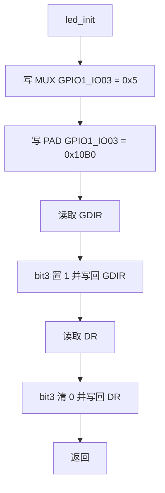

### 8.4 `led_on`

| 项目 | 说明 |
|---|---|
| 原型 | `static void led_on(void)` |
| 功能 | 清除 `GPIO1->DR` 的 bit3；按代码注释表示点亮低有效 LED |
| 入参 | 无 |
| 返回值 | 无 |
| 局部变量 | 无显式局部变量 |
| 读取全局/外部状态 | `GPIO1->DR` |
| 写入全局/外部状态 | `GPIO1->DR` |
| 文件内/文件外调用 | 无 |
| 调用者 | 源码层为 `main`；当前 `-O2` 构建中被内联 |

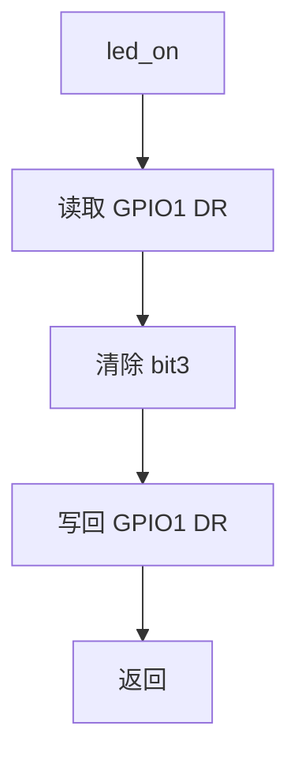

### 8.5 `led_off`

| 项目 | 说明 |
|---|---|
| 原型 | `static void led_off(void)` |
| 功能 | 设置 `GPIO1->DR` 的 bit3；按代码注释表示关闭低有效 LED |
| 入参 | 无 |
| 返回值 | 无 |
| 局部变量 | 无显式局部变量 |
| 读取全局/外部状态 | `GPIO1->DR` |
| 写入全局/外部状态 | `GPIO1->DR` |
| 文件内/文件外调用 | 无 |
| 调用者 | 源码层为 `main`；当前 `-O2` 构建中被内联 |

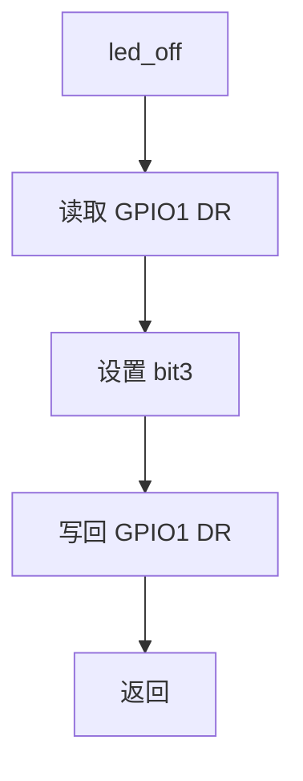

### 8.6 `delay_short`

| 项目 | 说明 |
|---|---|
| 原型 | `static void delay_short(volatile unsigned int count)` |
| 功能 | 对参数执行递减空循环，形成软件延时 |
| 入参 | `count`：循环控制值；按值传递，递减不会修改调用者变量 |
| 返回值 | 无 |
| 局部变量 | 无；参数 `count` 在函数内反复读写 |
| 读取/写入全局状态 | 无 |
| 文件内/文件外调用 | 无 |
| 调用者 | 源码层为 `delay`；当前 `-O2` 构建中被内联 |

循环条件为后缀递减 `count--`：判断使用递减前的值，同时更新函数内参数副本。

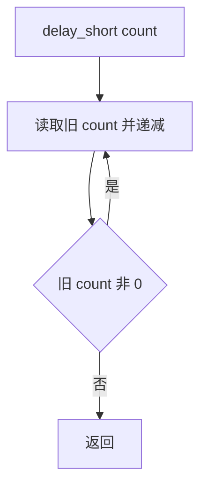

### 8.7 `delay`

| 项目 | 说明 |
|---|---|
| 原型 | `static void delay(volatile unsigned int ms)` |
| 功能 | 外层递减 `ms`，每轮调用 `delay_short(0x7FFU)` |
| 入参 | `ms`：外层循环次数；变量名暗示毫秒，但实际时间无法由当前代码确认 |
| 返回值 | 无 |
| 局部变量 | 无；参数 `ms` 在函数内反复读写 |
| 读取/写入全局状态 | 无 |
| 文件内调用 | `delay_short` |
| 文件外调用 | 无 |
| 调用者 | 源码层为 `main`；当前 `-O2` 构建中被内联 |

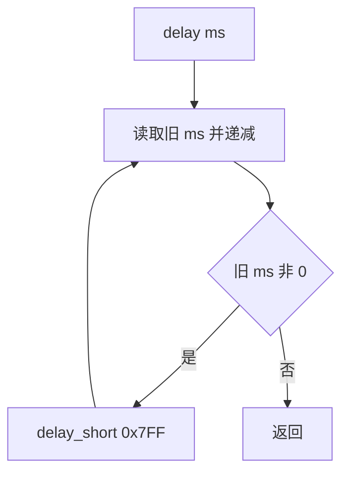

### 8.8 `main`

| 项目 | 说明 |
|---|---|
| 原型 | `int main(void)` |
| 功能 | 初始化时钟和 LED，并无限循环切换 LED 状态 |
| 入参 | 无 |
| 返回值 | 源码包含 `return 0`，但正常执行路径被前置无限循环阻断 |
| 局部变量 | 无 |
| 读取全局/外部状态 | 经辅助函数读取 GPIO1 的 `GDIR` 和 `DR` |
| 写入全局/外部状态 | 经辅助函数写 CCM、IOMUX 和 GPIO1 寄存器 |
| 文件内调用 | `clk_enable`、`led_init`、`led_off`、`delay`、`led_on` |
| 文件外调用 | 无 |
| 调用者 | `start.s` 的 `_start` |

执行流程：

1. 调用 `clk_enable`。
2. 调用 `led_init`，初始化完成后的代码状态为 LED 低电平。
3. 进入无限循环。
4. 调用 `led_off`，再调用 `delay(500U)`。
5. 调用 `led_on`，再调用 `delay(500U)`。
6. 返回循环步骤 4。

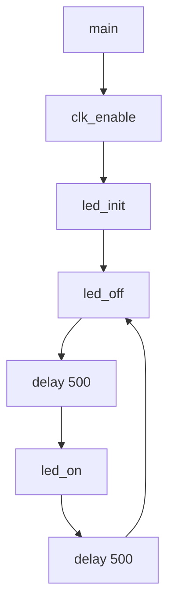

## 9. 调用关系分析

### 9.1 源码级调用关系

实线标识文件内调用，虚线标识文件外跳转。

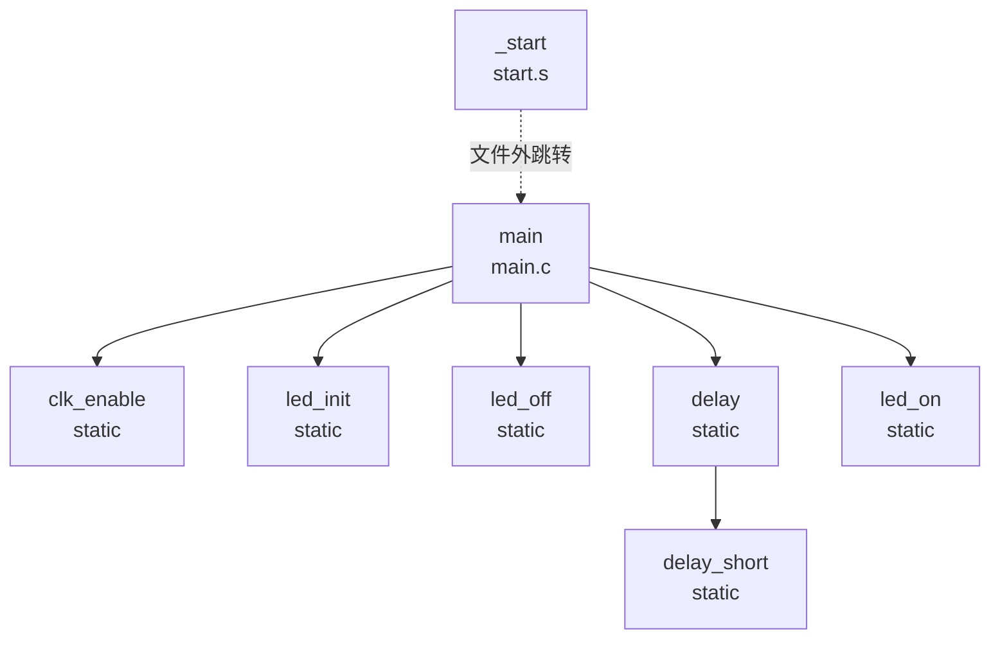

### 9.2 当前 `-O2` 构建产物实际关系

反汇编和符号表显示，`main.c` 的所有静态函数均被内联到 `main`，最终 ELF 只保留 `_start`、`main`、链接器跳板和链接符号，不存在静态函数的独立符号或实际 `bl` 调用。

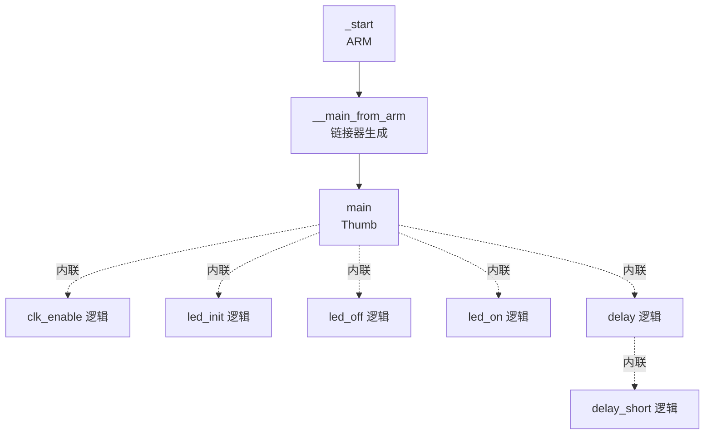

## 10. 数据流分析

### 10.1 启动数据流

| 数据/状态 | 来源 | 处理 | 去向 |
|---|---|---|---|
| CPSR | 处理器当前状态 | 清低 5 位，再置为 `0x13` | CPSR |
| `__bss_start` / `__bss_end` | 链接脚本 | 构成半开区间 `[start, end)` | BSS 清零循环 |
| 零值 | `mov r2, #0` | 每次写 4 字节 | BSS 区间 |
| `0x80200000` | `start.s` 立即数 | 直接加载 | `sp` |

### 10.2 外设配置与控制数据流

| 数据 | 来源 | 处理 | 去向 |
|---|---|---|---|
| `0xFFFFFFFFU` | `clk_enable` | 直接写入 | `CCM->CCGR0..6` |
| `LED_MUX_GPIO_MODE = 0x5U` | `main.c` 宏 | 直接写入 | `IOMUX_SW_MUX->GPIO1_IO03` |
| `LED_PAD_CONFIG = 0x10B0U` | `main.c` 宏 | 直接写入 | `IOMUX_SW_PAD->GPIO1_IO03` |
| `1U << LED_GPIO_BIT = 0x8` | `main.c` 宏和移位 | 与 `GDIR` 做 OR | `GPIO1->GDIR` |
| `0x8` | 同上 | 与 `DR` 做 OR 或 AND-NOT | `GPIO1->DR` |
| `500U` | `main` | 作为外层循环次数 | `delay` |
| `0x7FFU` | `delay` | 作为内层循环次数 | `delay_short` |

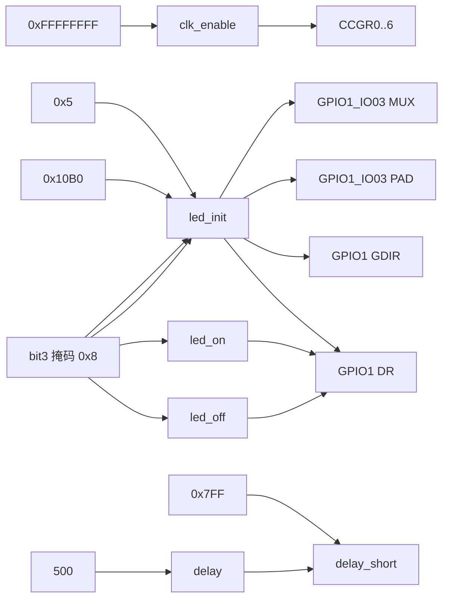

### 10.3 GPIO1 状态演进

设读出的寄存器原值为 `D`，掩码 `M = 0x8`：

| 操作 | 写回值 | bit3 结果 | 按代码注释表示 |
|---|---|---|---|
| `led_init` 设置方向 | `GDIR | M` | `GDIR.bit3 = 1` | 输出方向 |
| `led_init` 设置电平 | `D & ~M` | `DR.bit3 = 0` | LED 点亮 |
| `led_off` | `D | M` | `DR.bit3 = 1` | LED 关闭 |
| `led_on` | `D & ~M` | `DR.bit3 = 0` | LED 点亮 |

上述 GPIO 操作均为读改写，源代码意图是保持同一寄存器其他位不变。若存在中断、其他执行上下文或硬件机制并发修改同一寄存器，是否发生更新丢失需结合其他文件确认。

### 10.4 延时数据流

每次 `delay(500U)` 在源码层执行 500 次 `delay_short(0x7FFU)`。实际延时受处理器频率、存储器等待、编译器版本和优化结果影响。当前代码没有硬件定时器或校准逻辑，因此无法确认参数 `500U` 对应 500 ms。

## 11. 风险与改进建议

| 优先级 | 风险/限制 | 实际依据 | 改进建议 |
|---|---|---|---|
| 高 | 栈地址和程序地址依赖外部内存初始化与加载约定 | `0x80200000`、`0x87800000` 均硬编码 | 与前级启动程序、下载流程和内存地图核对；需结合其他文件确认 |
| 高 | 全开七组 CCM 时钟门控可能增加功耗或影响未使用外设 | `clk_enable` 对 `CCGR0..6` 写全 1 | 按芯片手册仅开启本程序所需时钟；具体位定义需结合芯片参考手册确认 |
| 高 | 结构体布局正确性依赖成员顺序、宽度和芯片寄存器地图一致 | MMIO 直接通过结构体成员访问 | 使用芯片手册逐项核对偏移，并增加编译期偏移/大小断言 |
| 中 | GPIO 读改写可能与其他上下文冲突 | `GDIR |=`、`DR |=`、`DR &=` 均为读改写 | 明确寄存器所有权；如存在并发访问，使用临界区或硬件支持的原子机制，具体能力需结合芯片手册确认 |
| 中 | 软件延时不能提供稳定时间单位 | 延时仅由空循环构成 | 使用硬件定时器或经过校准的延时实现 |
| 中 | 启动代码未明确配置异常向量、中断状态和其他模式栈 | `_start` 只设置 SVC 模式和一个栈 | 按完整系统需求补充异常和中断初始化；需求需结合其他文件确认 |
| 中 | 链接脚本没有内存区域和越界检查 | 未定义 `MEMORY` | 定义可执行 RAM 区域并将各段映射到该区域 |
| 中 | BSS 清零循环假设边界按 4 字节对齐且区间可写 | 每次使用 `str` 写 4 字节 | 当前链接脚本已对齐边界；后续修改链接布局时保持该约束并增加验证 |
| 低 | 修改 `imx6ul.lds` 不一定触发重链接 | `ledc.bin` 依赖中没有链接脚本 | 将 `imx6ul.lds` 加入目标依赖 |
| 低 | 头文件变化不会由 Makefile 自动跟踪 | `main.o` 规则只直接依赖 `main.c` | 使用 `-MMD -MP` 生成并包含依赖文件 |
| 低 | 头文件保护宏使用双下划线标识符 | `__IMX6UL_H__` | 改为项目专用且不保留的名称 |
| 低 | `main` 中 `return 0` 不可达 | 前置 `while (1)` | 保留标准签名时增加说明，或按工程入口规范调整；需结合其他文件确认 |
| 低 | `start.s` 文件末尾缺少换行 | 当前 `make` 可复现告警 | 在文件末尾添加换行 |
| 低 | 汇编对象缺少 `.note.GNU-stack` | 当前链接器可复现告警 | 按工具链约定添加相应节声明；裸机环境实际影响需结合其他文件确认 |
| 低 | `clean` 使用 `rm -rf`，范围由通配符和变量决定 | `Makefile` 第 27 行 | 可使用 `rm -f`，并保持目标变量受控 |

## 12. 可追踪性矩阵

| 设计行为 | 实现位置 |
|---|---|
| 定义 MMIO 基地址 | `imx6ul.h:7-17` |
| 定义 CCM 寄存器结构 | `imx6ul.h:22-60` |
| 定义 CCM 模拟寄存器结构 | `imx6ul.h:65-143` |
| 定义 IOMUX MUX 结构 | `imx6ul.h:148-253` |
| 定义 IOMUX PAD 结构 | `imx6ul.h:258-431` |
| 定义 GPIO 结构 | `imx6ul.h:436-447` |
| 定义类型化 MMIO 指针 | `imx6ul.h:452-463` |
| ELF 入口为 `_start` | `imx6ul.lds:1` |
| 程序链接到 `0x87800000` | `imx6ul.lds:5` |
| 启动代码优先放置 | `imx6ul.lds:9-11` |
| 定义 BSS 边界 | `imx6ul.lds:24-34` |
| 设置 SVC 模式 | `start.s:8-12` |
| 清零 BSS | `start.s:14-23` |
| 设置栈顶 | `start.s:25-27` |
| 进入 C 主函数 | `start.s:29-30` |
| 开启 CCM 时钟门控 | `main.c:7-16` |
| 初始化 LED 引脚 | `main.c:18-31` |
| 点亮/关闭 LED | `main.c:33-42` |
| 软件延时 | `main.c:44-55` |
| LED 无限闪烁 | `main.c:57-70` |
| 构建 ELF/BIN/反汇编 | `Makefile:12-15` |

## 13. 结论

该工程实现了完整的最小裸机链路：链接脚本定义入口和段布局，启动汇编切换模式、清零 BSS、设置栈并进入 C，C 程序通过结构体形式的 MMIO 映射配置 GPIO1_IO03 并循环切换 LED 状态，Makefile 可在当前环境成功生成 ELF、原始二进制和反汇编文件。

工程能否在目标板正确运行的关键外部前提包括：镜像被加载到 `0x87800000`、`0x80200000` 附近内存可用、寄存器结构和配置值与目标 i.MX6UL 一致、LED 硬件确实连接到 GPIO1_IO03 且低电平有效。这些前提均需结合其他文件确认。
