# i.MX6UL 裸机 LED SDK 工程详细设计说明书

## 1. 文档范围与分析原则

本文档基于以下实际代码文件生成：

| 文件 | 行数 | 分析范围 |
| --- | ---: | --- |
| `cc.h` | 35 | 编译器适配、基础类型和寄存器访问限定符 |
| `fsl_common.h` | 117 | SDK 通用宏、状态枚举和状态类型 |
| `fsl_iomuxc.h` | 1116 | 引脚复用宏及两个静态内联配置函数 |
| `imx6ul.lds` | 31 | 链接地址、段布局和 BSS 边界符号 |
| `main.c` | 134 | LED 初始化、控制、延时和主循环 |
| `Makefile` | 32 | 编译、链接、镜像转换、反汇编和清理规则 |
| `MCIMX6Y2.h` | 42091 | i.MX6Y2 中断号、IOMUXC 映射、外设寄存器结构和位域宏 |
| `start.S` | 54 | 裸机启动入口、栈初始化、BSS 清零和跳转到 `main` |

分析原则：

- 仅把指定文件中可以直接确认的内容写为事实。
- 芯片启动前状态、下载工具、运行介质、DDR 初始化过程、LED 所在开发板及电气参数等，指定文件无法确认，统一标注为“需结合其他文件确认”。
- `MCIMX6Y2.h` 包含 33123 个 `#define` 和 51 个寄存器布局结构体；本文完整列出其定义类别和结构体名称，并详细分析本工程实际访问的 `CCM_Type`、`GPIO_Type` 及相关宏。
- `fsl_iomuxc.h` 包含大量引脚功能元组；本文说明其统一格式，并详细分析本工程实际使用的 `IOMUXC_GPIO1_IO03_GPIO1_IO03`。

## 2. 系统设计概述

### 2.1 设计目标

工程构建一个在 `0x87800000` 链接的 ARM 裸机二进制。启动代码进入 SVC 模式、设置栈、清零 BSS 后跳转到 C 入口。`main` 使能全部外设时钟，将 `GPIO1_IO03` 配置为 GPIO 输出，并以忙等待方式循环翻转低电平有效 LED。

### 2.2 运行时调用关系

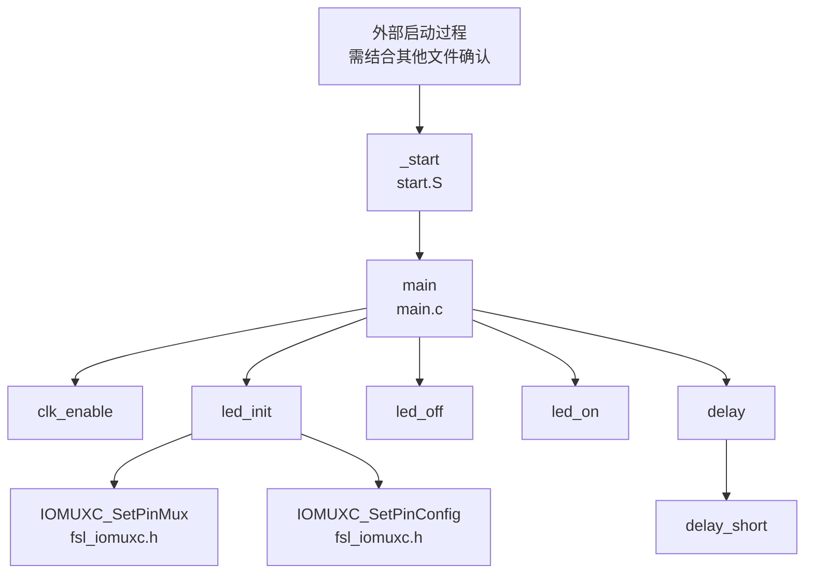

### 2.3 文件级依赖关系

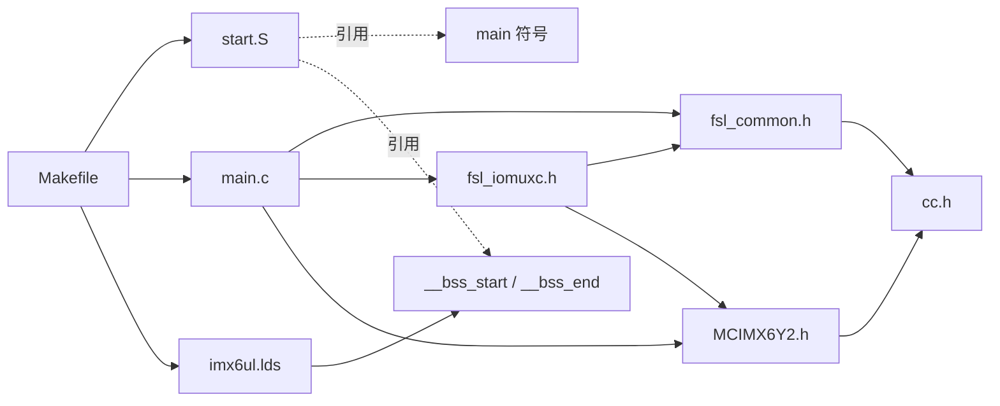

### 2.4 外部依赖

| 依赖 | 使用位置 | 作用 | 可确认性 |
| --- | --- | --- | --- |
| `arm-linux-gnueabihf-gcc` | `Makefile` | 编译 `.c`、`.S`、`.s` | 可由代码确认 |
| `arm-linux-gnueabihf-ld` | `Makefile` | 使用 `imx6ul.lds` 链接 ELF | 可由代码确认 |
| `arm-linux-gnueabihf-objcopy` | `Makefile` | ELF 转换为裸二进制 | 可由代码确认 |
| `arm-linux-gnueabihf-objdump` | `Makefile` | 生成 ARM 反汇编文件 | 可由代码确认 |
| ARM CPSR/SVC 指令语义 | `start.S` | 设置 CPU 模式 | 可由汇编代码确认 |
| i.MX6Y2 内存映射 | `MCIMX6Y2.h` | 提供 CCM、GPIO、IOMUXC 等寄存器地址 | 可由头文件确认 |
| 有效 RAM 地址 `0x80200000` | `start.S` | 初始栈顶 | 地址写死；该地址在目标板是否可用需结合其他文件确认 |
| 可执行装载地址 `0x87800000` | `imx6ul.lds` | 链接起始地址 | 地址写死；由谁装载及 RAM 是否已初始化需结合其他文件确认 |
| LED 与 `GPIO1_IO03` 的连接及低电平有效特性 | `main.c` 注释和实现 | 控制目标 LED | 代码按此假设实现；硬件原理图需结合其他文件确认 |

## 3. 启动、链接与构建设计

### 3.1 `start.S`

#### 3.1.1 文件职责

- 导出全局入口符号 `_start`。
- 引用外部 C 入口 `main`。
- 引用链接脚本定义的 `__bss_start`、`__bss_end`。
- 将 CPU 模式切换为 SVC。
- 将栈指针设置为 `0x80200000`。
- 按 4 字节步长清零 BSS。
- 无链接返回地跳转到 `main`。

#### 3.1.2 外部符号

| 符号 | 来源 | 用途 |
| --- | --- | --- |
| `main` | `main.c` | C 程序入口 |
| `__bss_start` | `imx6ul.lds` | BSS 清零起始地址 |
| `__bss_end` | `imx6ul.lds` | BSS 清零结束地址 |

#### 3.1.3 `_start`

| 项目 | 说明 |
| --- | --- |
| 类型 | 全局汇编入口例程 |
| 入参 | 无显式入参；进入时寄存器和 CPU 状态由前级启动环境决定，需结合其他文件确认 |
| 返回值 | 无；使用 `b main` 跳转，不保存返回地址 |
| 局部状态 | `r0`：CPSR 临时值/BSS 当前地址；`r1`：BSS 结束地址；`r2`：零值；`sp`：栈指针 |
| 读取外部数据 | `__bss_start`、`__bss_end` 的链接地址 |
| 写入外部数据 | CPSR、`sp`、BSS 内存区 |
| 文件内调用/跳转 | 循环跳转到 `clear_bss` |
| 文件外调用/跳转 | 跳转到 `main` |

执行流程：

1. 读取 CPSR 到 `r0`。
2. 清除 CPSR 模式位 `[4:0]`，再写入 `0x13`，切换为 SVC 模式。
3. 将 `sp` 设置为 `0x80200000`。
4. 加载 BSS 起止地址，并将 `r2` 置零。
5. 当当前地址 `r0` 小于结束地址 `r1` 时，写入 4 字节零并递增地址。
6. 跳转到 `main`。

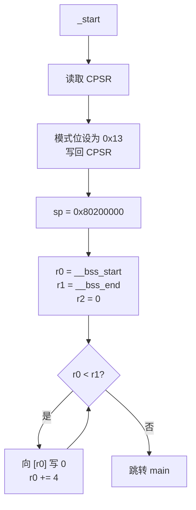

### 3.2 `imx6ul.lds`

#### 3.2.1 文件职责与段布局

链接位置计数器从 `0x87800000` 开始。各段按下表排列：

| 段/符号 | 输入内容 | 对齐 | 说明 |
| --- | --- | --- | --- |
| `.text` | `start.o`、`main.o`、`*(.text)` | 未显式指定 | `start.o` 和 `main.o` 被优先放入；具体对象内全部哪些段被匹配需结合链接器行为确认 |
| `.rodata` | `*(.rodata*)` | 4 字节 | 只读数据 |
| `.data` | `*(.data)` | 4 字节 | 已初始化可写数据 |
| `__bss_start` | 当前地址 | 无单独对齐 | 在 `.bss ALIGN(4)` 之前定义 |
| `.bss` | `*(.bss)`、`*(COMMON)` | 4 字节 | 未初始化数据和 COMMON 符号 |
| `__bss_end` | 当前地址 | 无单独对齐 | BSS 清零结束边界 |

#### 3.2.2 链接符号数据流


### 3.3 `Makefile`

#### 3.3.1 变量与宏

| 变量 | 定义 | 用途 |
| --- | --- | --- |
| `CROSS_COMPILE` | `arm-linux-gnueabihf-` | 工具链命令前缀 |
| `NAME` | 默认 `ledc`，允许命令行覆盖 | 输出文件基础名 |
| `CC` | `$(CROSS_COMPILE)gcc` | 编译器 |
| `LD` | `$(CROSS_COMPILE)ld` | 链接器 |
| `OBJCOPY` | `$(CROSS_COMPILE)objcopy` | 二进制转换 |
| `OBJDUMP` | `$(CROSS_COMPILE)objdump` | 反汇编 |
| `OBJS` | `start.o main.o` | 链接输入 |
| `CFLAGS` | `-Wall -O2 -nostdlib -ffreestanding` | 告警、优化和裸机编译选项 |

#### 3.3.2 构建目标

| 目标 | 前置条件 | 动作 |
| --- | --- | --- |
| `all` | `$(NAME).bin` | 默认目标 |
| `$(NAME).bin` | `start.o main.o` | 链接 ELF、转换 BIN、生成 DIS |
| `%.o: %.S` | 对应大写扩展汇编 | 通过 GCC 编译 |
| `%.o: %.s` | 对应小写扩展汇编 | 通过 GCC 编译 |
| `%.o: %.c` | 对应 C 文件 | 通过 GCC 编译 |
| `clean` | 无 | 删除当前目录下对象文件和三类构建产物 |

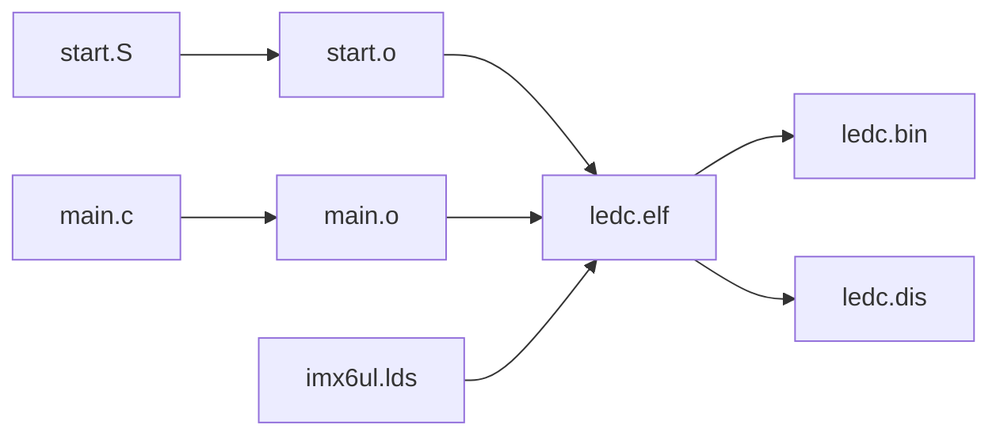

#### 3.3.3 实际构建验证

使用当前 `Makefile` 实际执行 `make` 成功，生成 `ledc.elf`、`ledc.bin` 和 `ledc.dis`。当前工具链生成结果如下：

| 验证项 | 实际结果 |
| --- | --- |
| ELF 格式 | ELF32、little-endian、ARM、EABI5、hard-float ABI |
| ELF 入口 | `0x87800000`，与 `_start` 地址一致 |
| `.text` | 地址 `0x87800000`，大小 `0x150`（336 字节） |
| `.data` / `.bss` | 当前构建均无实际内容，`__bss_start` 与 `__bss_end` 同为 `0x87800150` |
| `_start` | `0x87800000`，ARM 指令状态 |
| `main` | `0x8780005C`，Thumb 指令状态 |
| 状态切换跳板 | 链接器生成 `__main_from_arm`，地址 `0x878000E8` |
| 静态辅助函数 | 在 `-O2` 下均被内联/合并，最终符号表中没有独立函数符号 |
| 链接告警 | `start.o` 缺少 `.note.GNU-stack`，链接器提示该对象隐含可执行栈 |

因此，本文函数调用图描述源码级设计；当前优化构建的实际执行形态是 `_start -> __main_from_arm -> main`，其余 C 辅助函数逻辑均位于优化后的 `main` 内。

## 4. 头文件设计

### 4.1 `cc.h`

#### 4.1.1 文件职责

为 GCC 裸机环境提供 SDK 依赖的基础整数类型和内存映射寄存器访问限定符。文件仅包含宏和类型定义，无函数、结构体、枚举、全局变量或静态变量。

#### 4.1.2 宏定义

| 宏 | 展开 | 语义 |
| --- | --- | --- |
| `__I` | `volatile const` | 易变只读寄存器 |
| `__O` | `volatile` | 易变写寄存器；类型系统未阻止读取 |
| `__IO` | `volatile` | 易变读写寄存器 |

#### 4.1.3 类型定义

| 类型组 | 类型 |
| --- | --- |
| 标准风格有符号整数 | `int8_t`、`int16_t`、`int32_t`、`int64_t` |
| 标准风格无符号整数 | `uint8_t`、`uint16_t`、`uint32_t`、`uint64_t` |
| 短名有符号整数 | `s8`、`s16`、`s32`、`s64` |
| 短名无符号整数 | `u8`、`u16`、`u32`、`u64` |

各类型的确切位宽依赖目标 GCC 对 `char`、`short`、`int` 和 `long long` 的实现；命名表达了预期位宽，是否在所有目标配置下成立需结合工具链确认。

### 4.2 `fsl_common.h`

#### 4.2.1 文件职责与依赖

- 依赖 `cc.h` 的 `int32_t`。
- 提供状态码构造、版本号构造、调试控制台类型编号、状态组枚举、通用状态枚举和 `status_t`。
- 无函数、结构体、全局变量或静态变量。

#### 4.2.2 宏定义

| 类别 | 宏 | 说明 |
| --- | --- | --- |
| 状态码 | `MAKE_STATUS(group, code)` | 计算 `group * 100 + code` |
| 版本号 | `MAKE_VERSION(major, minor, bugfix)` | 主版本左移 16 位、次版本左移 8 位并与修订号按位或 |
| 调试控制台编号 | `DEBUG_CONSOLE_DEVICE_TYPE_NONE` 至 `DEBUG_CONSOLE_DEVICE_TYPE_VUSART` | 定义值 `0U` 至 `7U` |

`MAKE_VERSION` 被 `fsl_iomuxc.h` 用于生成 `FSL_IOMUXC_DRIVER_VERSION`。其他宏在本工程运行代码中未被引用。

#### 4.2.3 枚举与类型

| 枚举/类型 | 内容 | 本工程使用情况 |
| --- | --- | --- |
| `enum _status_groups` | 定义通用、外设和应用状态组编号；从 `kStatusGroup_Generic = 0` 到 `kStatusGroup_ApplicationRangeStart = 100`，编号并非连续 | 未使用 |
| `enum _generic_status` | 通过 `MAKE_STATUS` 定义成功、失败、只读、越界、非法参数、超时、无传输等状态 | 未使用 |
| `status_t` | `int32_t` 的别名 | 未使用 |

### 4.3 `fsl_iomuxc.h`

#### 4.3.1 文件职责与依赖

- 依赖 `MCIMX6Y2.h` 提供 IOMUXC 位域宏和 `uint32_t`。
- 依赖 `fsl_common.h` 提供 `MAKE_VERSION`。
- 定义 IOMUXC 驱动版本。
- 定义 1012 个引脚/功能相关宏；其中绝大部分为五参数引脚功能元组，另有头文件保护宏和驱动版本宏。
- 提供两个 `static inline` 寄存器配置函数。
- 无结构体、枚举、全局变量或独立静态变量。

#### 4.3.2 引脚功能元组

引脚功能宏统一表示五元组：

```text
<muxRegister, muxMode, inputRegister, inputDaisy, configRegister>
```

本工程实际使用：

```c
#define IOMUXC_GPIO1_IO03_GPIO1_IO03 \
    0x020E0068U, 0x5U, 0x00000000U, 0x0U, 0x020E02F4U
```

| 字段 | 值 | 在本工程中的作用 |
| --- | ---: | --- |
| `muxRegister` | `0x020E0068U` | `IOMUXC_SetPinMux` 写入的复用控制寄存器地址 |
| `muxMode` | `0x5U` | 传给 `IOMUXC_SW_MUX_CTL_PAD_MUX_MODE` |
| `inputRegister` | `0x00000000U` | 为零，因此不执行输入选择寄存器写入 |
| `inputDaisy` | `0x0U` | 因 `inputRegister` 为零而不生效 |
| `configRegister` | `0x020E02F4U` | `IOMUXC_SetPinConfig` 写入的 PAD 配置寄存器地址 |

#### 4.3.3 `IOMUXC_SetPinMux`

| 项目 | 说明 |
| --- | --- |
| 类型 | `static inline void`，文件内联函数 |
| 功能 | 写引脚复用寄存器；当输入选择寄存器地址非零时，再写输入 Daisy 值 |
| 入参 | `muxRegister`：复用寄存器地址；`muxMode`：复用模式；`inputRegister`：输入选择寄存器地址；`inputDaisy`：输入选择值；`configRegister`：本函数未使用；`inputOnfield`：软件输入开关字段 |
| 返回值 | 无 |
| 局部变量 | 无 |
| 读写全局变量 | 无 C 全局变量；写 `muxRegister` 指向的 MMIO，条件写 `inputRegister` 指向的 MMIO |
| 文件内调用 | `IOMUXC_SW_MUX_CTL_PAD_MUX_MODE`、`IOMUXC_SW_MUX_CTL_PAD_SION`、`IOMUXC_SELECT_INPUT_DAISY` 宏 |
| 文件外调用 | 无 |

执行流程：

1. 将 `muxMode` 和 `inputOnfield` 分别编码后按位或。
2. 将结果写入 `muxRegister` 指向的 32 位易变寄存器。
3. 判断 `inputRegister` 是否非零。
4. 若非零，将编码后的 `inputDaisy` 写入该寄存器。

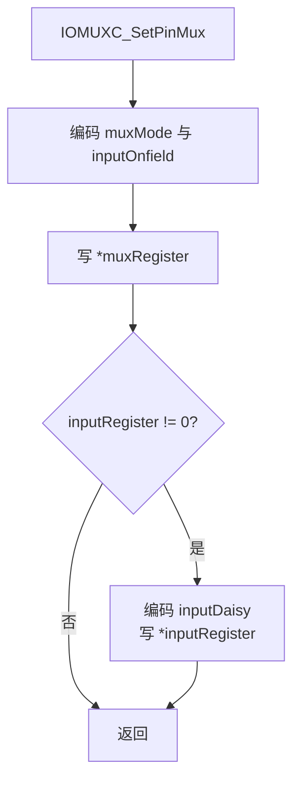

#### 4.3.4 `IOMUXC_SetPinConfig`

| 项目 | 说明 |
| --- | --- |
| 类型 | `static inline void`，文件内联函数 |
| 功能 | 当配置寄存器地址非零时，写入 PAD 配置值 |
| 入参 | `muxRegister`、`muxMode`、`inputRegister`、`inputDaisy`：本函数未使用；`configRegister`：配置寄存器地址；`configValue`：写入值 |
| 返回值 | 无 |
| 局部变量 | 无 |
| 读写全局变量 | 无 C 全局变量；条件写 `configRegister` 指向的 MMIO |
| 文件内调用 | 无 |
| 文件外调用 | 无 |

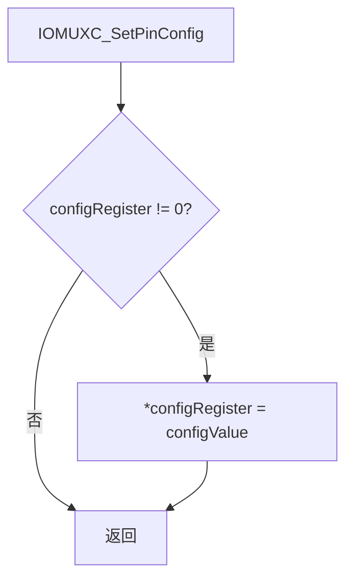

### 4.4 `MCIMX6Y2.h`

#### 4.4.1 文件职责与依赖

该文件依赖 `cc.h`，是设备级内存映射头文件，提供：

- 160 个中断向量编号范围的 `IRQn_Type` 定义。
- Cortex-A7 配置宏。
- 7 类 IOMUXC 映射枚举。
- 51 个外设寄存器布局结构体。
- 外设寄存器位掩码、位移、编码宏。
- 外设基址、类型化基址指针、基址数组和中断数组宏。
- 通用位域转换宏 `NXP_VAL2FLD` 和 `NXP_FLD2VAL`。

文件无函数、全局变量或静态变量；其类型化基址指针均为宏，不分配存储空间。

#### 4.4.2 顶层宏

| 宏 | 值/作用 |
| --- | --- |
| `MCU_MEM_MAP_VERSION` | `0x0300U` |
| `MCU_MEM_MAP_VERSION_MINOR` | `0x0000U` |
| `NUMBER_OF_INT_VECTORS` | `160` |
| `__CA7_REV` | `0x0005` |
| `__GIC_PRIO_BITS` | `5` |
| `__FPU_PRESENT` | `1` |
| `NXP_VAL2FLD(field, value)` | 将值左移并用对应 `_MASK` 截断 |
| `NXP_FLD2VAL(field, value)` | 从寄存器值提取对应位域 |

33123 个宏主要遵循以下模式：

| 宏类别 | 示例 | 作用 |
| --- | --- | --- |
| 位掩码 | `CCM_CCR_OSCNT_MASK` | 标识寄存器字段位置 |
| 位移 | `CCM_CCR_OSCNT_SHIFT` | 标识字段最低位 |
| 字段编码 | `CCM_CCR_OSCNT(x)` | 将输入编码进字段 |
| 基址 | `CCM_BASE`、`GPIO1_BASE` | 定义 MMIO 地址 |
| 类型化指针 | `CCM`、`GPIO1` | 将基址转换为寄存器结构体指针 |
| 实例集合 | `CCM_BASE_ADDRS`、`GPIO_BASE_PTRS` | 初始化实例数组 |
| 中断集合 | `CCM_IRQS`、`GPIO1_IRQS` | 初始化中断号数组 |

#### 4.4.3 枚举

| 枚举类型 | 作用/范围 |
| --- | --- |
| `IRQn_Type` | `NotAvail_IRQn = -128`；CPU 和设备中断号从 `Software0_IRQn = 0` 至 `PMU_IRQ2_IRQn = 159` |
| `iomuxc_sw_mux_ctl_pad_t` | 普通域 PAD 复用控制索引，`0U` 至 `111U` |
| `iomuxc_sw_pad_ctl_pad_ddr_t` | DDR PAD 控制索引，`0U` 至 `33U` |
| `iomuxc_sw_pad_ctl_pad_t` | 普通域 PAD 控制索引，`0U` 至 `111U` |
| `iomuxc_select_input_t` | 输入选择寄存器索引，`0U` 至 `121U` |
| `iomuxc_grp_t` | IOMUXC 分组控制索引，`0U` 至 `9U` |
| `iomuxc_snvs_sw_mux_ctl_pad_t` | SNVS PAD 复用控制索引，`0U` 至 `11U` |
| `iomuxc_snvs_sw_pad_ctl_pad_t` | SNVS PAD 控制索引，`0U` 至 `16U` |

这些枚举在本工程运行代码中未直接使用。

#### 4.4.4 寄存器结构体

文件定义的 51 个外设寄存器布局结构体如下：

`ADC_Type`、`ADC_5HC_Type`、`AIPSTZ_Type`、`APBH_Type`、`ASRC_Type`、`BCH_Type`、`CAN_Type`、`CCM_Type`、`CCM_ANALOG_Type`、`CSI_Type`、`DCP_Type`、`ECSPI_Type`、`EIM_Type`、`ENET_Type`、`EPIT_Type`、`ESAI_Type`、`GPC_Type`、`GPIO_Type`、`GPMI_Type`、`GPT_Type`、`I2C_Type`、`I2S_Type`、`IOMUXC_Type`、`IOMUXC_GPR_Type`、`IOMUXC_SNVS_Type`、`KPP_Type`、`LCDIF_Type`、`MMDC_Type`、`OCOTP_Type`、`PGC_Type`、`PMU_Type`、`PWM_Type`、`PXP_Type`、`QuadSPI_Type`、`RNG_Type`、`ROMC_Type`、`SDMAARM_Type`、`SNVS_Type`、`SPBA_Type`、`SPDIF_Type`、`SRC_Type`、`TEMPMON_Type`、`TSC_Type`、`UART_Type`、`USB_Type`、`USBNC_Type`、`USBPHY_Type`、`USB_ANALOG_Type`、`USDHC_Type`、`WDOG_Type`、`XTALOSC24M_Type`。

本工程只通过 `CCM_Type` 和 `GPIO_Type` 访问寄存器：

| 结构体 | 实际访问成员 | 访问方式 | 作用 |
| --- | --- | --- | --- |
| `CCM_Type` | `CCGR0` 至 `CCGR6`，偏移 `0x68` 至 `0x80` | `CCM->CCGRx` | 写 `0xFFFFFFFF` 使能全部时钟门控字段 |
| `GPIO_Type` | `DR`，偏移 `0x0` | `GPIO1->DR` | 读改写 GPIO1 输出数据 |
| `GPIO_Type` | `GDIR`，偏移 `0x4` | `GPIO1->GDIR` | 读改写 GPIO1 方向 |

相关基址宏：

| 宏 | 定义 | 实际用途 |
| --- | --- | --- |
| `CCM_BASE` | `0x20C4000u` | CCM 基址 |
| `CCM` | `((CCM_Type *)CCM_BASE)` | `clk_enable` 的 MMIO 指针 |
| `GPIO1_BASE` | `0x209C000u` | GPIO1 基址 |
| `GPIO1` | `((GPIO_Type *)GPIO1_BASE)` | 经 `LED_GPIO` 被 LED 函数使用 |

## 5. `main.c` 详细设计

### 5.1 文件职责与外部依赖

`main.c` 是 LED 应用实现，依赖：

| 头文件 | 实际使用内容 |
| --- | --- |
| `fsl_common.h` | 没有直接使用其符号；通过包含关系提供 SDK 通用定义 |
| `fsl_iomuxc.h` | `IOMUXC_SetPinMux`、`IOMUXC_SetPinConfig`、`IOMUXC_GPIO1_IO03_GPIO1_IO03` |
| `MCIMX6Y2.h` | `CCM`、`GPIO1`、`CCM_Type`、`GPIO_Type` 和寄存器成员定义 |

### 5.2 文件内宏、变量、结构体和枚举

| 宏 | 定义 | 作用 |
| --- | --- | --- |
| `LED_GPIO` | `GPIO1` | LED 所属 GPIO 实例指针 |
| `LED_PIN` | `3U` | LED 位编号 |
| `LED_PIN_MASK` | `(1U << LED_PIN)` | 位 3 掩码，结果为 `0x8` |

文件内无全局变量、静态变量、结构体或枚举。全部辅助函数均为 `static`，仅 `main` 具有外部链接属性。

### 5.3 `clk_enable`

| 项目 | 说明 |
| --- | --- |
| 类型 | `static void` |
| 功能 | 将 CCM 的 7 个时钟门控寄存器全部写为 `0xFFFFFFFF` |
| 入参/返回值 | 无/无 |
| 局部变量 | 无 |
| 读写全局变量 | 无 C 全局变量；写 `CCM->CCGR0` 至 `CCM->CCGR6` |
| 文件内调用 | 无 |
| 文件外调用 | 无 |
| 调用者 | `main` |

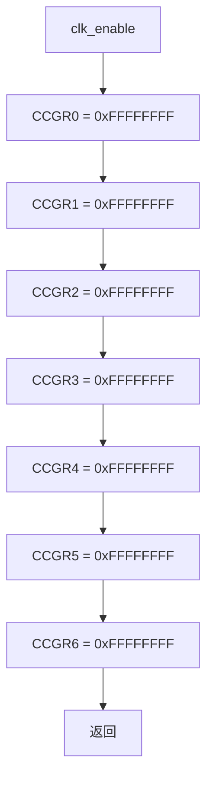

### 5.4 `led_init`

| 项目 | 说明 |
| --- | --- |
| 类型 | `static void` |
| 功能 | 将 `GPIO1_IO03` 配置为 GPIO，设置 PAD 参数，设为输出并默认点亮 LED |
| 入参/返回值 | 无/无 |
| 局部变量 | 无 |
| 读写全局变量 | 无 C 全局变量；写 IOMUXC 复用/PAD 寄存器；读改写 `GPIO1->GDIR` 和 `GPIO1->DR` |
| 文件内调用 | 无 |
| 文件外调用 | `IOMUXC_SetPinMux`、`IOMUXC_SetPinConfig`，二者为头文件静态内联函数 |
| 调用者 | `main` |

执行流程：

1. 以元组 `IOMUXC_GPIO1_IO03_GPIO1_IO03` 和 `inputOnfield = 0` 调用 `IOMUXC_SetPinMux`。
2. 实际向 `0x020E0068` 写入由复用模式 `5` 和 SION `0` 编码的值；输入选择地址为零，不写 Daisy 寄存器。
3. 以同一元组和配置值 `0x10B0` 调用 `IOMUXC_SetPinConfig`，向 `0x020E02F4` 写入 PAD 配置。
4. 对 `GPIO1->GDIR` 执行读改写，置位 bit 3，将引脚设为输出。
5. 对 `GPIO1->DR` 执行读改写，清零 bit 3，按代码注释的低电平有效逻辑点亮 LED。

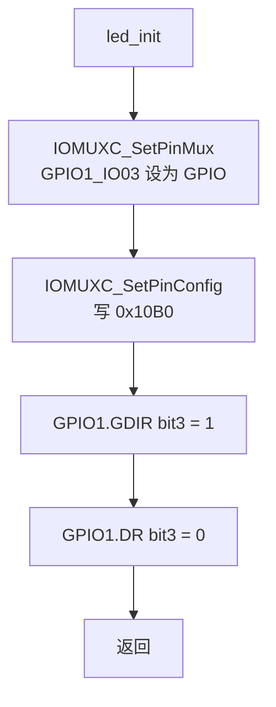

### 5.5 `led_on`

| 项目 | 说明 |
| --- | --- |
| 类型 | `static void` |
| 功能 | 清除 `GPIO1->DR` bit 3，按低电平有效假设点亮 LED |
| 入参/返回值 | 无/无 |
| 局部变量 | 无 |
| 读写全局变量 | 读改写 `GPIO1->DR` |
| 文件内/文件外调用 | 无/无 |
| 调用者 | `main` |


### 5.6 `led_off`

| 项目 | 说明 |
| --- | --- |
| 类型 | `static void` |
| 功能 | 置位 `GPIO1->DR` bit 3，按低电平有效假设熄灭 LED |
| 入参/返回值 | 无/无 |
| 局部变量 | 无 |
| 读写全局变量 | 读改写 `GPIO1->DR` |
| 文件内/文件外调用 | 无/无 |
| 调用者 | `main` |


### 5.7 `delay_short`

| 项目 | 说明 |
| --- | --- |
| 类型 | `static void` |
| 功能 | 通过递减循环消耗 CPU 周期 |
| 入参 | `volatile unsigned int loops`：循环计数，按后缀递减条件判断 |
| 返回值 | 无 |
| 局部变量 | 参数 `loops` 同时作为本地循环状态 |
| 读写全局变量 | 无 |
| 文件内/文件外调用 | 无/无 |
| 调用者 | `delay` |

`while (loops--)` 在每次条件求值时读取旧值并递减；旧值为零时循环结束，但参数会发生无符号下溢。下溢后的值不再被使用。

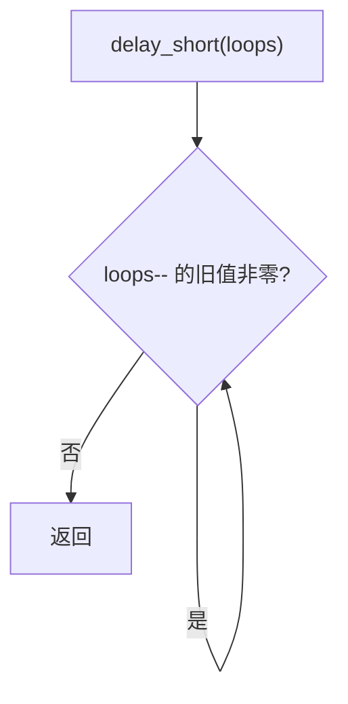

### 5.8 `delay`

| 项目 | 说明 |
| --- | --- |
| 类型 | `static void` |
| 功能 | 每次外层循环调用一次 `delay_short(0x7FF)`，形成近似毫秒级忙等待 |
| 入参 | `volatile unsigned int ms`：外层循环次数；代码没有基于硬件时钟校准其毫秒含义 |
| 返回值 | 无 |
| 局部变量 | 参数 `ms` 同时作为本地循环状态 |
| 读写全局变量 | 无 |
| 文件内调用 | `delay_short` |
| 文件外调用 | 无 |
| 调用者 | `main` |

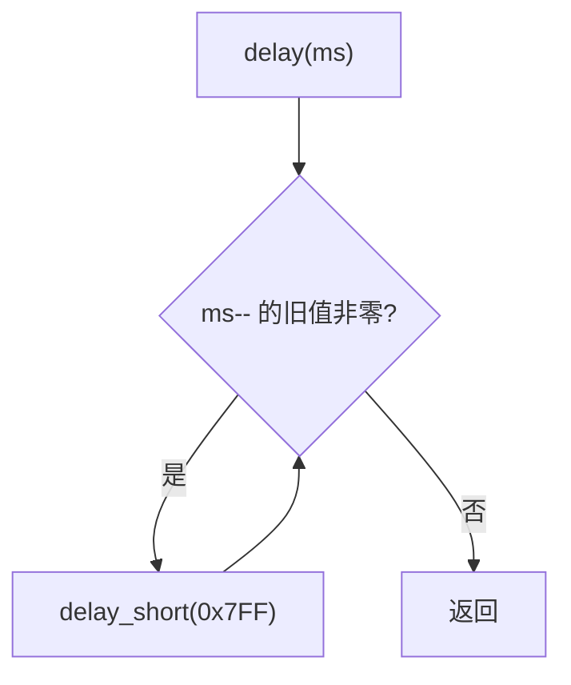

### 5.9 `main`

| 项目 | 说明 |
| --- | --- |
| 类型 | `int main(void)`，外部链接 |
| 功能 | 初始化时钟和 LED，随后永久循环执行熄灭、延时、点亮、延时 |
| 入参 | 无 |
| 返回值 | 源码包含 `return 0`，但前面的 `while (1)` 使其在正常执行路径上不可达 |
| 局部变量 | 无 |
| 读写全局变量 | 通过被调函数间接写 CCM、IOMUXC 和 GPIO1 MMIO；无 C 全局变量 |
| 文件内调用 | `clk_enable`、`led_init`、`led_off`、`delay`、`led_on` |
| 文件外调用 | 无直接文件外调用 |
| 调用者 | `start.S` 的 `_start` |

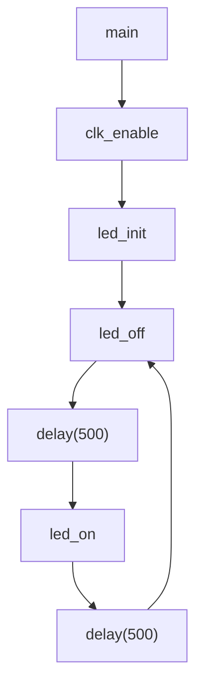

## 6. 调用关系分析

### 6.1 函数级调用矩阵

| 调用者 | 被调用者 | 文件内/外 | 调用次数特征 |
| --- | --- | --- | --- |
| `_start` | `main` | 文件外 | 一次跳转 |
| `main` | `clk_enable` | 文件内 | 初始化阶段一次 |
| `main` | `led_init` | 文件内 | 初始化阶段一次 |
| `main` | `led_off` | 文件内 | 主循环每轮一次 |
| `main` | `delay` | 文件内 | 主循环每轮两次，每次参数为 `500` |
| `main` | `led_on` | 文件内 | 主循环每轮一次 |
| `led_init` | `IOMUXC_SetPinMux` | 文件外定义、当前翻译单元静态内联 | 初始化阶段一次 |
| `led_init` | `IOMUXC_SetPinConfig` | 文件外定义、当前翻译单元静态内联 | 初始化阶段一次 |
| `delay` | `delay_short` | 文件内 | 每次 `delay(500)` 理论调用 500 次 |

### 6.2 无调用关系的定义

- `cc.h`、`fsl_common.h`、`MCIMX6Y2.h` 不定义函数。
- `Makefile` 和 `imx6ul.lds` 不参与运行时函数调用。
- `fsl_common.h` 的状态枚举和 `status_t` 在当前应用中未使用。
- `MCIMX6Y2.h` 中除 CCM、GPIO 相关类型/宏及 IOMUXC 位域宏外，其余设备定义未参与当前应用的运行路径。

## 7. 数据流分析

### 7.1 启动数据流

| 数据 | 来源 | 处理 | 去向 |
| --- | --- | --- | --- |
| CPU CPSR | CPU 当前状态 | 清除模式位并置为 `0x13` | CPU CPSR |
| 栈顶常量 `0x80200000` | `start.S` 立即数 | 直接加载 | `sp` |
| BSS 边界 | `imx6ul.lds` | `_start` 按 `[start, end)` 遍历 | BSS 内存被写零 |

### 7.2 LED 配置与控制数据流

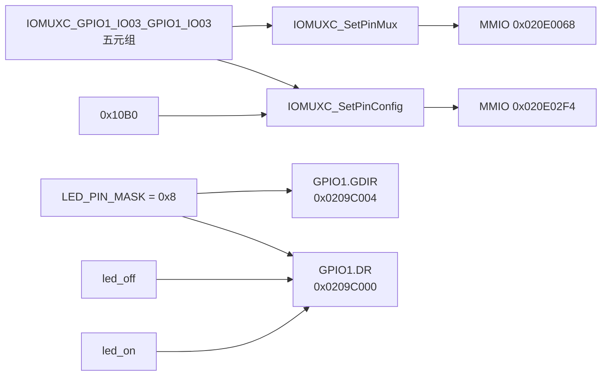

### 7.3 MMIO 读写清单

| 地址/范围 | 表达式 | 操作 | 写入/修改值 |
| --- | --- | --- | --- |
| `0x020C4068` 至 `0x020C4080` | `CCM->CCGR0` 至 `CCM->CCGR6` | 直接写 | 全部写 `0xFFFFFFFF` |
| `0x020E0068` | IOMUXC mux register | 直接写 | 由 mode `5`、SION `0` 编码 |
| `0x020E02F4` | IOMUXC config register | 直接写 | `0x10B0` |
| `0x0209C004` | `GPIO1->GDIR` | 读改写 | 置位 `0x8` |
| `0x0209C000` | `GPIO1->DR` | 读改写 | 点亮时清 `0x8`，熄灭时置 `0x8` |

地址由指定文件中的基址、结构体偏移和引脚元组直接计算得到。

### 7.4 时序数据流

主循环每轮按以下顺序执行：

1. `led_off()`。
2. `delay(500)`，内部执行 500 次 `delay_short(0x7FF)`。
3. `led_on()`。
4. `delay(500)`，内部执行 500 次 `delay_short(0x7FF)`。

延时与真实时间的换算依赖 CPU 频率、编译器优化和指令执行条件，指定代码无法确认精确闪烁周期。

## 8. 全局与静态对象汇总

| 类别 | 对象 |
| --- | --- |
| C 全局变量 | 无 |
| C 静态变量 | 无 |
| C 外部链接函数 | `main` |
| C 静态函数 | `clk_enable`、`led_init`、`led_on`、`led_off`、`delay_short`、`delay` |
| 头文件静态内联函数 | `IOMUXC_SetPinMux`、`IOMUXC_SetPinConfig` |
| 汇编全局符号 | `_start` |
| 汇编局部标签 | `clear_bss` |
| 链接脚本符号 | `__bss_start`、`__bss_end` |

## 9. 风险与改进建议

| 优先级 | 已确认风险/限制 | 影响 | 改进建议 |
| --- | --- | --- | --- |
| 高 | `start.S` 将栈顶固定为 `0x80200000`，链接地址固定为 `0x87800000`，指定文件未定义 RAM 区域和栈边界 | 若前级环境未准备对应 RAM，可能无法运行 | 在链接脚本中声明 `MEMORY` 区域和栈符号，由启动代码引用链接符号；可用内存范围需结合芯片/板级初始化文件确认 |
| 高 | `_start` 清 BSS 时固定每次写 4 字节，依赖 `__bss_start` 和 `__bss_end` 的对齐/长度 | 当前脚本使 `.bss` 起点按 4 字节对齐，但终点是否始终 4 字节对齐需结合链接结果确认 | 在链接脚本中显式对齐 BSS 结束地址，或增加尾字节处理 |
| 高 | 没有异常向量表、异常处理、看门狗处理或中断初始化 | 异常发生后的行为无法由指定代码确认 | 根据实际启动方式补充向量表和最小异常处理；是否由前级程序提供需结合其他文件确认 |
| 高 | 实际链接警告 `start.o` 缺少 `.note.GNU-stack`，从而隐含可执行栈 | 执行栈扩大攻击面，且该链接器兼容行为未来会移除 | 在 `start.S` 末尾增加非执行栈标记节 `.section .note.GNU-stack,"",%progbits` |
| 中 | `clk_enable` 将全部 `CCGR0..6` 写为 `0xFFFFFFFF` | 增加功耗，并可能开启不需要的外设时钟 | 仅设置 GPIO1、IOMUXC 等实际所需时钟字段；具体字段值需结合芯片参考手册确认 |
| 中 | GPIO 使用 `DR` 和 `GDIR` 读改写 | 若其他执行上下文同时修改同一寄存器，可能丢失更新；当前代码是否存在并发上下文无法确认 | 在存在中断/并发时使用临界区或芯片支持的原子置位/清零机制，具体能力需结合其他文件确认 |
| 中 | 忙等待延时占满 CPU，且时间不准确 | 闪烁周期随频率和优化变化，CPU 无法处理其他工作 | 使用 GPT/EPIT 等硬件定时器；时钟树和定时器配置需结合其他文件确认 |
| 中 | `IOMUXC_SetPinMux` 和 `IOMUXC_SetPinConfig` 接受整数地址并直接解引用，没有参数校验 | 错误元组会导致非法 MMIO 写入 | 保持 SDK 元组来源受控；调试版本可增加地址范围断言，但裸机断言机制需结合其他文件确认 |
| 中 | PAD 配置值 `0x10B0` 为裸常量 | 可读性和维护性较弱 | 使用 `MCIMX6Y2.h` 中对应字段宏组合，组合结果应先与 `0x10B0` 核对 |
| 低 | `delay_short` 和 `delay` 的后缀递减条件会在退出判断时使无符号参数下溢 | 下溢值当前未使用，不影响当前流程，但降低可读性 | 改为 `while (loops != 0U) { loops--; }` 等明确形式 |
| 低 | `main` 的 `return 0` 不可达，且 `_start` 使用 `b main` 无返回路径 | 当前永久循环设计下无实际影响 | 可将 `main` 声明/设计为不返回入口，或在意外返回时进入安全死循环 |
| 低 | `Makefile clean` 使用 `rm -rf`，但目标均为当前目录文件模式 | 当前范围有限，`-r` 并非必需 | 使用 `rm -f` 降低清理规则的破坏性 |
| 低 | `Makefile` 直接调用 `ld`，未显式指定 CPU 架构、ABI、入口符号和 map 文件 | 最终架构和入口选择部分依赖工具链默认值及对象属性 | 增加明确架构参数、`ENTRY(_start)` 和链接 map 输出；正确参数需结合目标启动方式确认 |

## 10. 可追溯结论

- 可执行入口由 `start.o` 在 `.text` 中优先放置而间接形成，链接脚本未显式写 `ENTRY(_start)`；当前实际构建的 ELF 入口已验证为 `_start` 的 `0x87800000`。
- 当前实际构建由链接器插入 `__main_from_arm` 完成 ARM 状态 `_start` 到 Thumb 状态 `main` 的切换；该跳板不是源码中显式定义的函数。
- 应用没有普通内存中的全局或静态业务状态，核心状态全部位于 CPU 寄存器、栈参数和 MMIO 寄存器。
- 初始化路径依次为：SVC/栈/BSS 初始化、全外设时钟使能、IOMUXC 配置、GPIO 输出配置。
- 稳态路径只操作 `GPIO1->DR` 并执行忙等待。
- 当前代码不使用中断、动态内存、标准库、状态码体系或除 CCM/GPIO/IOMUXC 外的外设。
- 镜像如何被装载到 `0x87800000`、DDR 如何初始化、栈地址是否有效、LED 硬件连接是否与注释一致，均需结合其他文件确认。
