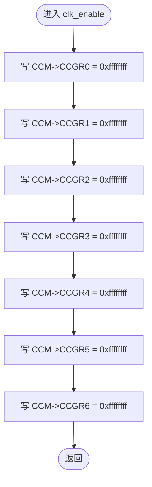
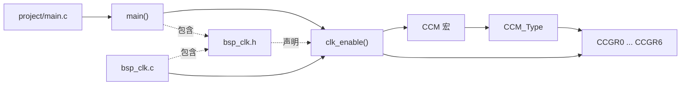
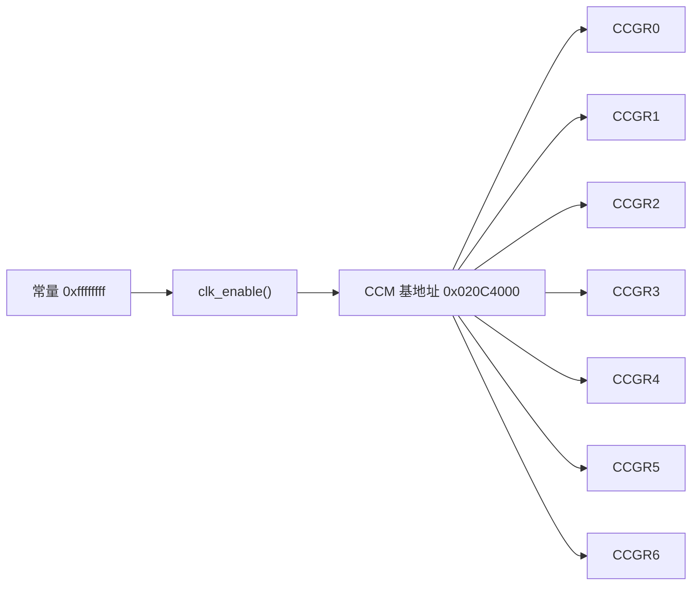

# `bsp_clk.c` 详细设计文档

## 1. 文档范围与分析依据

本文档基于以下实际代码进行静态分析：

- `bsp/clk/bsp_clk.c`
- `bsp/clk/bsp_clk.h`
- `imx6ul/imx6ul.h`
- `imx6ul/MCIMX6Y2.h`
- `project/main.c`
- 项目根目录 `Makefile`

本文档仅描述代码和上述依赖文件中能够确认的内容。寄存器各字段的完整硬件语义、写入时序限制、复位值及保留位要求，需结合 i.MX6UL 芯片参考手册确认。

## 2. 文件概述

### 2.1 文件信息

| 项目 | 内容 |
| --- | --- |
| 文件名 | `bsp_clk.c` |
| 文件类型 | C 源文件 |
| 所属模块 | BSP 时钟模块 |
| 对外接口 | `clk_enable()` |
| 直接包含文件 | `bsp_clk.h` |

### 2.2 文件职责

`bsp_clk.c` 负责实现 BSP 时钟模块的时钟门控初始化接口。文件中的 `clk_enable()` 依次向 CCM 的 `CCGR0` 至 `CCGR6` 寄存器写入 `0xffffffff`。

根据源文件注释，该实现用于裸机学习场景，目的是方便地使能所有外设时钟；实际产品应仅使能需要的时钟以降低功耗。`0xffffffff` 对每个具体时钟门控字段产生的完整硬件效果，需结合芯片参考手册确认。

### 2.3 功能边界

本文件能够确认的功能：

- 提供一个无参数、无返回值的公开函数 `clk_enable()`。
- 直接写入 CCM 的 7 个时钟门控寄存器。
- 不读取寄存器，不保留寄存器原值。
- 不配置时钟源、分频器、PLL 或时钟切换寄存器。
- 不提供单个外设时钟的独立开关接口。
- 不提供错误检测、状态验证或超时处理。

## 3. 外部依赖分析

### 3.1 直接与间接依赖

| 依赖项 | 依赖类型 | 来源 | 在本文件中的用途 |
| --- | --- | --- | --- |
| `bsp_clk.h` | 直接包含的项目头文件 | `bsp/clk/bsp_clk.h` | 提供 `clk_enable()` 声明，并间接提供 CCM 寄存器定义 |
| `imx6ul.h` | 间接包含的项目头文件 | `imx6ul/imx6ul.h` | 聚合芯片相关头文件 |
| `MCIMX6Y2.h` | 间接包含的芯片头文件 | `imx6ul/MCIMX6Y2.h` | 定义 `CCM_Type`、`CCM_BASE` 和 `CCM` |
| `CCM_Type` | 外部结构体类型 | `MCIMX6Y2.h` | 描述 CCM 寄存器布局 |
| `CCM` | 外部宏 | `MCIMX6Y2.h` | 提供 CCM 寄存器块指针 |
| `CCGR0` 至 `CCGR6` | 硬件寄存器成员 | `CCM_Type` | 接收 `0xffffffff` 写入 |

### 3.2 依赖定义链

```text
bsp_clk.c
  -> #include "bsp_clk.h"
      -> #include "imx6ul.h"
          -> #include "MCIMX6Y2.h"
              -> typedef struct {...} CCM_Type
              -> #define CCM_BASE (0x20C4000u)
              -> #define CCM ((CCM_Type *)CCM_BASE)
```

### 3.3 构建依赖

项目根目录 `Makefile` 将 `bsp/clk` 同时加入源文件目录和头文件搜索目录：

- `INCDIRS` 包含 `bsp/clk`。
- `SRCDIRS` 包含 `bsp/clk`。
- `CFILES` 通过通配符收集 `bsp/clk/*.c`。

因此 `bsp_clk.c` 会被编译并参与项目链接。具体链接地址、启动流程及硬件执行环境需结合链接脚本和启动文件确认。

## 4. 宏定义分析

### 4.1 本文件定义的宏

`bsp_clk.c` 未定义任何宏。

| 宏名称 | 宏值 | 说明 |
| --- | --- | --- |
| 无 | 无 | 本文件无 `#define` |

### 4.2 本文件使用的外部宏

| 宏名称 | 实际定义 | 来源 | 用途 |
| --- | --- | --- | --- |
| `CCM_BASE` | `(0x20C4000u)` | `MCIMX6Y2.h` | CCM 外设基地址 |
| `CCM` | `((CCM_Type *)CCM_BASE)` | `MCIMX6Y2.h` | 将 CCM 基地址转换为 `CCM_Type *` |

说明：

- 源代码使用小写字面量 `0xffffffff`，它是整数常量，不是宏。
- `CCM` 指向内存映射硬件寄存器，不是普通 C 全局变量。

## 5. 全局变量与静态变量分析

`bsp_clk.c` 未定义全局变量，也未定义文件级静态变量。

| 类别 | 名称 | 类型 | 说明 |
| --- | --- | --- | --- |
| 全局变量 | 无 | 无 | 本文件未定义 |
| 文件级静态变量 | 无 | 无 | 本文件未定义 |

虽然本文件没有 C 全局变量，但 `clk_enable()` 会修改全局可见的硬件状态，即 CCM 寄存器块中的 `CCGR0` 至 `CCGR6`。

## 6. 结构体、联合体与枚举分析

### 6.1 本文件定义情况

`bsp_clk.c` 未定义结构体、联合体、枚举或 `typedef`。

### 6.2 使用的外部结构体 `CCM_Type`

`CCM_Type` 定义于 `MCIMX6Y2.h`。与本文件直接相关的成员如下：

| 成员 | 声明类型 | 相对 CCM 基地址偏移 | 芯片头文件中的名称 | 本文件访问方式 |
| --- | --- | --- | --- | --- |
| `CCGR0` | `__IO uint32_t` | `0x68` | CCM Clock Gating Register 0 | 写 |
| `CCGR1` | `__IO uint32_t` | `0x6C` | CCM Clock Gating Register 1 | 写 |
| `CCGR2` | `__IO uint32_t` | `0x70` | CCM Clock Gating Register 2 | 写 |
| `CCGR3` | `__IO uint32_t` | `0x74` | CCM Clock Gating Register 3 | 写 |
| `CCGR4` | `__IO uint32_t` | `0x78` | CCM Clock Gating Register 4 | 写 |
| `CCGR5` | `__IO uint32_t` | `0x7C` | CCM Clock Gating Register 5 | 写 |
| `CCGR6` | `__IO uint32_t` | `0x80` | CCM Clock Gating Register 6 | 写 |

`__IO` 的具体定义及其编译器语义需结合 `cc.h` 确认；从芯片头文件命名和使用方式可以确认这些成员用于内存映射寄存器访问。

### 6.3 枚举

本文件未定义或使用枚举。

## 7. 函数总览

| 函数 | 可见性 | 入参 | 返回值 | 文件内调用 | 文件外调用 |
| --- | --- | --- | --- | --- | --- |
| `clk_enable()` | 全局公开 | 无 | `void` | 无 | 无 |

本文件没有静态函数。

## 8. 函数详细设计：`clk_enable`

### 8.1 函数原型

```c
void clk_enable(void);
```

### 8.2 功能说明

`clk_enable()` 依次将 CCM 的 `CCGR0`、`CCGR1`、`CCGR2`、`CCGR3`、`CCGR4`、`CCGR5` 和 `CCGR6` 写为 `0xffffffff`。

从代码能够确认：

- 共执行 7 次 32 位寄存器赋值。
- 每次赋值覆盖对应寄存器的全部 32 位。
- 函数没有条件分支、循环、等待或读取校验。
- 函数执行完成后直接返回。

从 `MCIMX6Y2.h` 能够确认：

- 这些寄存器名为 CCM Clock Gating Register 0 至 6。
- 每个寄存器的字段宏以 2 位掩码形式定义，例如 `CG0` 使用 `0x3`，后续字段按 2 位间隔排列。
- 写入 `0xffffffff` 会将所有位写为 `1`。

各 2 位字段值 `3` 的准确运行模式以及是否存在保留位，需结合芯片参考手册确认。

### 8.3 入参说明

| 参数 | 类型 | 说明 |
| --- | --- | --- |
| 无 | 无 | 函数不接收入参，固定操作宏 `CCM` 指向的 CCM 实例 |

### 8.4 返回值说明

| 返回值 | 说明 |
| --- | --- |
| 无 | `void` 函数，不反馈寄存器写入或硬件状态 |

### 8.5 局部变量

| 变量名 | 类型 | 初始值 | 用途 |
| --- | --- | --- | --- |
| 无 | 无 | 无 | 本函数未定义局部变量 |

### 8.6 读取的全局变量或硬件状态

| 对象 | 是否读取 | 说明 |
| --- | --- | --- |
| C 全局变量 | 否 | 本文件没有全局变量 |
| `CCGR0` 至 `CCGR6` | 否 | 使用直接赋值，不执行读改写 |
| 其他硬件状态 | 否 | 未读取状态寄存器 |

### 8.7 写入的全局变量或硬件状态

| 写入顺序 | 对象 | 写入值 | 可确认结果 |
| --- | --- | --- | --- |
| 1 | `CCM->CCGR0` | `0xffffffff` | 覆盖 `CCGR0` 全部 32 位 |
| 2 | `CCM->CCGR1` | `0xffffffff` | 覆盖 `CCGR1` 全部 32 位 |
| 3 | `CCM->CCGR2` | `0xffffffff` | 覆盖 `CCGR2` 全部 32 位 |
| 4 | `CCM->CCGR3` | `0xffffffff` | 覆盖 `CCGR3` 全部 32 位 |
| 5 | `CCM->CCGR4` | `0xffffffff` | 覆盖 `CCGR4` 全部 32 位 |
| 6 | `CCM->CCGR5` | `0xffffffff` | 覆盖 `CCGR5` 全部 32 位 |
| 7 | `CCM->CCGR6` | `0xffffffff` | 覆盖 `CCGR6` 全部 32 位 |

这些对象是内存映射硬件寄存器，不是 C 语言全局变量。

### 8.8 调用关系

#### 调用的文件内函数

| 函数 | 说明 |
| --- | --- |
| 无 | `clk_enable()` 不调用本文件内其他函数 |

#### 调用的文件外函数

| 函数 | 说明 |
| --- | --- |
| 无 | `clk_enable()` 不调用其他模块函数 |

#### 已确认的外部调用者

| 调用者 | 来源文件 | 调用位置与顺序 |
| --- | --- | --- |
| `main()` | `project/main.c` | 在 `main()` 开始后调用，位于 `led_init()` 之前 |

仓库其他目录或其他最终应用是否调用该函数，需结合实际构建目标确认。

### 8.9 执行流程

1. 进入 `clk_enable()`。
2. 将 `CCM->CCGR0` 写为 `0xffffffff`。
3. 将 `CCM->CCGR1` 写为 `0xffffffff`。
4. 将 `CCM->CCGR2` 写为 `0xffffffff`。
5. 将 `CCM->CCGR3` 写为 `0xffffffff`。
6. 将 `CCM->CCGR4` 写为 `0xffffffff`。
7. 将 `CCM->CCGR5` 写为 `0xffffffff`。
8. 将 `CCM->CCGR6` 写为 `0xffffffff`。
9. 函数返回。

### 8.10 Mermaid 流程图



### 8.11 前置条件与后置状态

前置条件：

- CPU 能够访问 `CCM_BASE` 对应的内存映射地址。
- 调用上下文具备写 CCM 寄存器的权限。
- CCM 寄存器可被当前执行环境直接写入。
- 以上条件的具体建立方式需结合启动代码、处理器模式和芯片手册确认。

后置状态：

- 从软件赋值语句角度，`CCGR0` 至 `CCGR6` 已分别接收一次 `0xffffffff` 写入。
- 硬件实际接受值、回读值及对各外设的最终影响，代码未验证，需结合芯片手册和运行环境确认。

## 9. 文件级调用关系图



关系说明：

- `main.c` 通过 `bsp_clk.h` 获得 `clk_enable()` 声明。
- `bsp_clk.c` 提供 `clk_enable()` 定义。
- `clk_enable()` 不调用其他函数，而是通过 `CCM` 宏直接写寄存器。

## 10. 数据流分析

### 10.1 数据来源

本文件没有运行时输入数据。唯一写入数据是编译期常量 `0xffffffff`。

### 10.2 数据去向



### 10.3 数据流特征

| 特征 | 分析 |
| --- | --- |
| 输入 | 无函数参数，无寄存器读取 |
| 处理 | 将同一个常量依次用于 7 次赋值 |
| 输出 | 无返回值 |
| 副作用 | 修改 CCM 时钟门控寄存器 |
| 状态保留 | 不保留原寄存器值 |
| 反馈闭环 | 无回读、无状态确认、无错误反馈 |

## 11. 风险分析

| 风险 | 代码依据 | 可能影响 | 确认要求 |
| --- | --- | --- | --- |
| 全量开启时钟可能增加功耗 | 7 个 CCGR 寄存器均写 `0xffffffff`；源文件注释明确提示实际产品应按需使能 | 功耗增加，可能影响低功耗设计 | 具体功耗影响需结合硬件设计和芯片手册确认 |
| 覆盖寄存器全部位 | 使用直接赋值而非掩码读改写 | 原有门控配置被覆盖；若存在保留位或特殊字段，可能产生额外影响 | 保留位与字段写入要求需结合芯片手册确认 |
| 无结果验证 | 写入后不回读、不检查状态 | 软件无法确认硬件是否接受配置 | 寄存器是否允许回读及正确验证方式需结合芯片手册确认 |
| 无错误反馈 | 返回类型为 `void` | 调用者无法根据结果采取恢复措施 | 是否需要错误处理取决于系统需求 |
| 固定操作单一 CCM 实例 | 函数没有基地址参数，固定使用 `CCM` | 难以复用或隔离测试 | 项目是否需要可测试抽象需结合整体架构确认 |
| 并发访问风险 | 函数直接写共享硬件寄存器，无同步 | 与其他上下文同时配置 CCM 时可能相互覆盖 | 是否存在中断、多核或并发调用需结合其他文件确认 |
| 初始化顺序依赖 | `main()` 在 `led_init()` 前调用该函数 | 后续模块可能依赖时钟门控状态 | 其他模块的时钟需求需结合其他文件确认 |

## 12. 改进建议

以下建议不改变对当前代码行为的描述，是否实施需结合项目目标和芯片手册确认。

1. 按实际使用的外设配置对应 CCGR 字段，避免无条件写满全部时钟门控寄存器。
2. 使用芯片头文件提供的 `CCM_CCGRx_CGy(...)` 字段宏构造值，提高字段意图的可读性。
3. 在修改前确认寄存器保留位和字段写入规则，必要时采用掩码读改写。
4. 如系统需要可诊断性，可增加配置后回读或状态检查；正确检查方式需结合芯片手册确认。
5. 如存在多个执行上下文会修改 CCM，应建立统一的时钟配置所有权和同步策略。
6. 可将“学习模式下全部使能”和“产品模式下按需使能”拆分为明确接口或编译配置，避免产品代码误用。
7. 可使用带 `U` 后缀的 `UINT32_C(0xffffffff)`、`0xffffffffU` 或字段宏明确 32 位无符号意图；实际编码规范需结合项目规范确认。

## 13. 测试与验证建议

| 测试项 | 验证目标 | 建议方法 |
| --- | --- | --- |
| 编译检查 | 确认函数声明、定义和 CCM 类型解析正确 | 使用项目 `Makefile` 编译 |
| 调用顺序检查 | 确认 `clk_enable()` 在依赖时钟的模块初始化前执行 | 静态检查 `main.c` 或启动流程 |
| 寄存器写入检查 | 确认 7 个目标寄存器接收到预期值 | 调试器或测试环境回读；是否适用需结合硬件手册确认 |
| 功耗检查 | 评估全部开启时钟的影响 | 实板功耗测量 |
| 按需时钟回归 | 确认后续优化未关闭必要时钟 | 对所有使用到的外设执行功能测试 |

当前仓库中未发现针对 `clk_enable()` 的自动化单元测试。是否存在仓库范围之外的测试，需结合其他文件确认。
