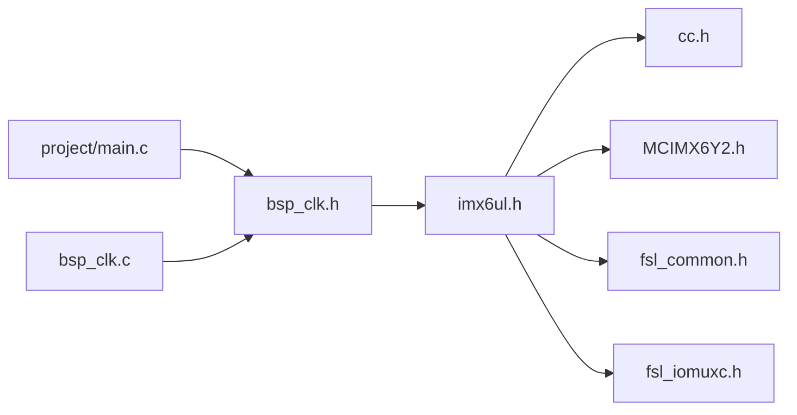
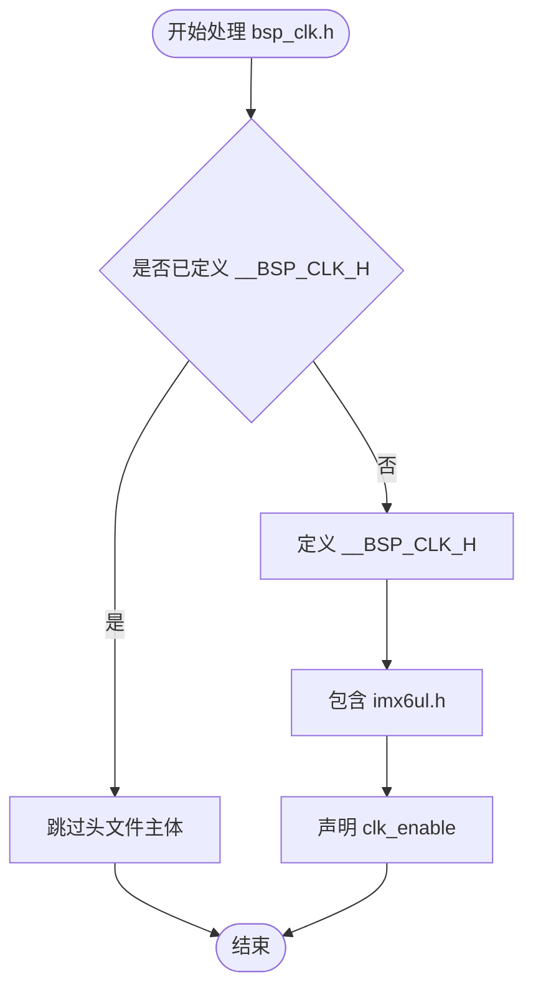
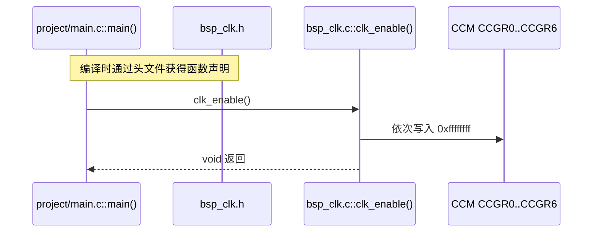
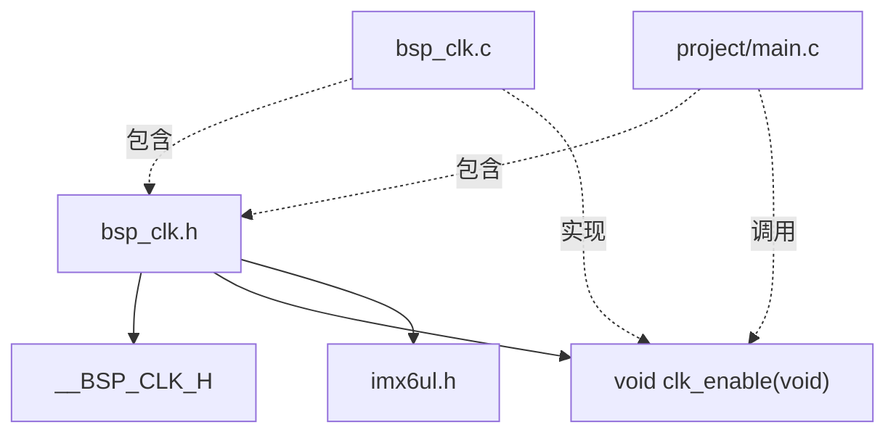
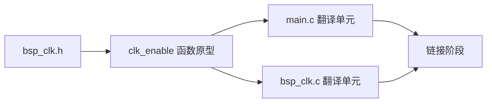

# `bsp_clk.h` 详细设计文档

## 1. 文档范围与分析依据

本文档基于 `bsp_clk.h` 的实际代码，并结合 `bsp_clk.c`、`imx6ul.h`、`MCIMX6Y2.h`、`project/main.c` 和项目根目录 `Makefile` 进行静态分析。

无法从这些文件确认的硬件语义或系统约束均标注为“需结合其他文件确认”。

## 2. 文件概述

### 2.1 文件信息

| 项目 | 内容 |
| --- | --- |
| 文件名 | `bsp_clk.h` |
| 文件类型 | C 头文件 |
| 所属模块 | BSP 时钟模块 |
| 直接包含文件 | `imx6ul.h` |
| 对外声明 | `void clk_enable(void);` |

### 2.2 文件职责

`bsp_clk.h` 是 BSP 时钟模块的公开接口头文件，主要职责如下：

- 通过包含保护宏避免同一翻译单元内重复包含。
- 包含公共芯片头文件 `imx6ul.h`。
- 向其他模块声明 `clk_enable()`。

该头文件不包含函数实现，不定义时钟配置参数，也不定义专属于 BSP 时钟模块的数据类型。

### 2.3 使用场景

已确认的使用场景：

- `bsp_clk.c` 包含该头文件，用于保持函数定义与公开声明一致。
- `project/main.c` 包含该头文件，并调用 `clk_enable()`。

其他文件是否使用该头文件，需结合实际构建范围和仓库其他目录确认。

## 3. 外部依赖分析

### 3.1 直接依赖

| 依赖 | 类型 | 来源 | 用途 |
| --- | --- | --- | --- |
| `imx6ul.h` | 项目公共头文件 | `imx6ul/imx6ul.h` | 向包含者传递芯片类型、寄存器和公共接口定义 |

### 3.2 `imx6ul.h` 的已确认包含项

`imx6ul.h` 包含：

| 头文件 | 作用 |
| --- | --- |
| `cc.h` | 基础类型或编译器相关定义；具体内容需结合该文件确认 |
| `MCIMX6Y2.h` | 芯片寄存器结构、基地址和相关宏定义 |
| `fsl_common.h` | 公共 SDK 定义；本时钟接口是否实际需要需结合编译依赖确认 |
| `fsl_iomuxc.h` | IOMUXC 接口；本时钟接口是否实际需要需结合编译依赖确认 |

### 3.3 依赖传递关系



## 4. 宏定义分析

### 4.1 本文件定义的宏

| 宏名称 | 定义位置 | 有效范围 | 功能 |
| --- | --- | --- | --- |
| `__BSP_CLK_H` | 文件第 1 至 2 行 | 预处理阶段 | 作为头文件包含保护标记 |

### 4.2 包含保护执行逻辑

```c
#ifndef __BSP_CLK_H
#define __BSP_CLK_H
/* 头文件内容 */
#endif /* __BSP_CLK_H */
```

执行逻辑：

1. 首次包含时，`__BSP_CLK_H` 尚未定义，预处理器进入头文件主体。
2. 定义 `__BSP_CLK_H`。
3. 处理 `imx6ul.h` 包含和 `clk_enable()` 声明。
4. 同一翻译单元再次包含时，因 `__BSP_CLK_H` 已定义，预处理器跳过头文件主体。

### 4.3 Mermaid 流程图：包含保护



### 4.4 命名注意事项

包含保护宏以双下划线开头。此类标识符在 C 实现中通常属于保留命名范围，具体约束需结合项目采用的 C 标准和编译器确认。建议使用项目命名空间形式，例如 `BSP_CLK_H` 或 `BSP_CLK_H_`。

## 5. 全局变量与静态变量分析

`bsp_clk.h` 未声明或定义任何全局变量，也未声明静态变量。

| 类别 | 名称 | 类型 | 说明 |
| --- | --- | --- | --- |
| 外部变量声明 | 无 | 无 | 本文件没有 `extern` 变量声明 |
| 变量定义 | 无 | 无 | 本文件没有变量定义 |
| 静态变量 | 无 | 无 | 头文件中没有静态变量 |

## 6. 结构体、联合体与枚举分析

### 6.1 本文件定义情况

`bsp_clk.h` 未定义结构体、联合体、枚举或 `typedef`。

### 6.2 间接暴露的数据类型

由于 `bsp_clk.h` 包含 `imx6ul.h`，包含者会间接获得大量芯片相关类型和宏，其中包括 `CCM_Type` 和 `CCM`。但是 `clk_enable()` 的函数签名不使用任何来自 `imx6ul.h` 的类型。

因此，`imx6ul.h` 是否必须由公开头文件包含，还是仅需由 `bsp_clk.c` 包含，需结合项目接口设计和其他包含者需求确认。

## 7. 函数声明分析

### 7.1 函数总览

| 函数 | 声明 | 可见性 | 实现位置 |
| --- | --- | --- | --- |
| `clk_enable` | `void clk_enable(void);` | 对包含该头文件的翻译单元可见 | `bsp_clk.c` |

本头文件没有静态函数、内联函数或函数宏。

## 8. 函数详细设计：`clk_enable`

### 8.1 声明

```c
void clk_enable(void);
```

### 8.2 接口功能

该声明向调用者公开 BSP 时钟使能接口。函数实现位于 `bsp_clk.c`，实际行为是依次向 `CCM->CCGR0` 至 `CCM->CCGR6` 写入 `0xffffffff`。

接口名称表达“使能时钟”，但未从函数签名表达以下信息：

- 操作的是固定 CCM 实例。
- 操作范围是 `CCGR0` 至 `CCGR6`。
- 操作会覆盖寄存器全部位。
- 函数没有错误反馈。

完整硬件效果需结合 `bsp_clk.c`、芯片头文件和芯片参考手册确认。

### 8.3 入参说明

| 参数 | 类型 | 说明 |
| --- | --- | --- |
| 无 | `void` | 调用者不能指定 CCM 实例、目标外设或门控模式 |

### 8.4 返回值说明

| 返回值 | 说明 |
| --- | --- |
| 无 | 函数不返回执行状态 |

### 8.5 局部变量

头文件仅提供声明，不存在函数体，因此不存在局部变量。

### 8.6 读写全局变量

头文件声明本身不读写任何变量或硬件寄存器。实际实现会写 `CCM->CCGR0` 至 `CCM->CCGR6`，详见 `bsp_clk.c.md`。

### 8.7 调用关系

#### 文件内调用

无。头文件没有函数实现。

#### 已确认的文件外关系

| 关系 | 文件 | 说明 |
| --- | --- | --- |
| 实现者 | `bsp_clk.c` | 定义 `clk_enable()` |
| 调用者 | `project/main.c` | 在 `main()` 中调用 `clk_enable()` |

### 8.8 接口调用流程图



## 9. 文件级调用与依赖关系图



## 10. 数据流分析

头文件本身不执行运行时数据处理，其主要信息流是编译期声明传播：



| 数据或信息 | 来源 | 去向 | 作用 |
| --- | --- | --- | --- |
| `clk_enable()` 原型 | `bsp_clk.h` | `main.c`、`bsp_clk.c` | 提供编译期类型检查 |
| 芯片相关定义 | `imx6ul.h` | 所有包含 `bsp_clk.h` 的文件 | 形成传递依赖 |

## 11. 风险分析

| 风险 | 代码依据 | 可能影响 | 备注 |
| --- | --- | --- | --- |
| 公开头文件传递包含较大的芯片公共头文件 | `bsp_clk.h` 直接包含 `imx6ul.h`，但函数签名不使用其类型 | 增加编译依赖和命名空间暴露 | 实际编译影响需结合工程规模确认 |
| 包含保护宏使用保留风格名称 | `__BSP_CLK_H` 以双下划线开头 | 可能与实现保留标识符规则冲突 | 需结合编译器和编码规范确认 |
| 接口语义过宽 | 名称为 `clk_enable()`，无参数 | 调用者无法从接口判断具体开启范围 | 实现细节需查阅源文件 |
| 无状态返回 | 返回类型为 `void` | 调用者无法判断配置是否成功 | 当前实现也没有检查机制 |
| 缺少 C++ 链接保护 | 未使用 `extern "C"` | 被 C++ 文件直接包含时可能出现名称修饰问题 | 项目当前是否使用 C++ 需结合其他文件确认 |

## 12. 改进建议

1. 将包含保护宏改为不使用保留标识符风格的名称，例如 `BSP_CLK_H`。
2. 评估是否可从公开头文件移除 `#include "imx6ul.h"`，并仅在 `bsp_clk.c` 中包含；当前函数签名不依赖芯片类型。
3. 为公开函数增加接口注释，明确会写入全部 `CCGR0` 至 `CCGR6`，避免调用者只依据名称理解行为。
4. 如需要按外设控制时钟，可增加目标外设或门控配置参数；具体接口需结合系统时钟设计确认。
5. 如项目可能由 C++ 调用，可按项目规范增加 `extern "C"` 保护。
6. 如需要错误检测，可调整返回类型并在实现中增加可验证的状态检查；验证机制需结合芯片手册确认。

## 13. 一致性与验证建议

| 检查项 | 当前状态 | 建议 |
| --- | --- | --- |
| 声明与定义一致性 | `bsp_clk.h` 与 `bsp_clk.c` 均为 `void clk_enable(void)` | 编译时保持告警开启 |
| 调用者参数一致性 | `main.c` 使用无参数调用 | 保持接口变更时同步修改 |
| 重复包含保护 | 已提供 | 建议调整宏命名 |
| 公开接口注释 | 仅有简短模块注释 | 建议补充函数行为与副作用 |
| 自动化测试 | 当前分析范围内未发现 | 是否需要需结合项目测试策略确认 |
