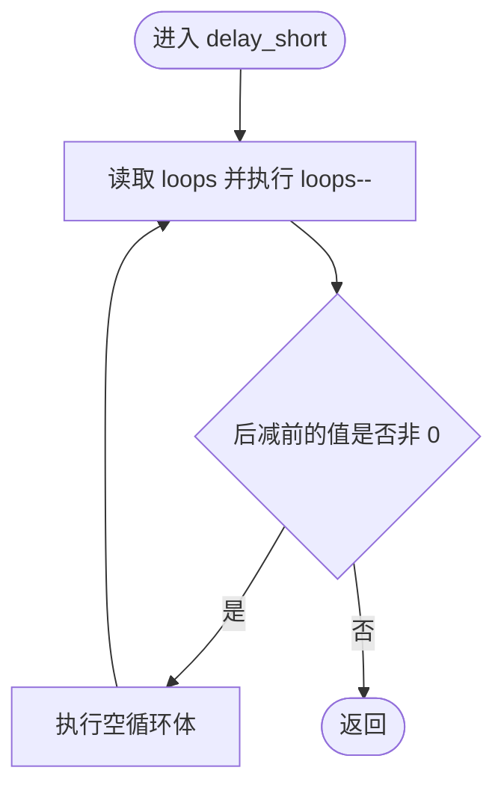
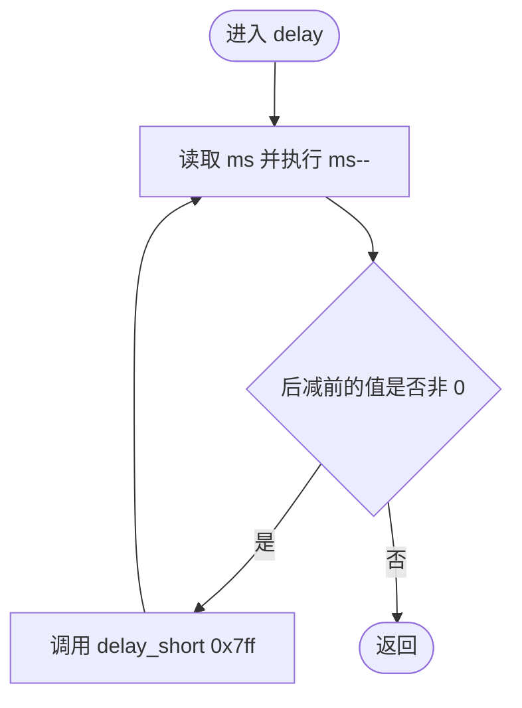
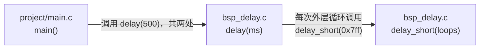
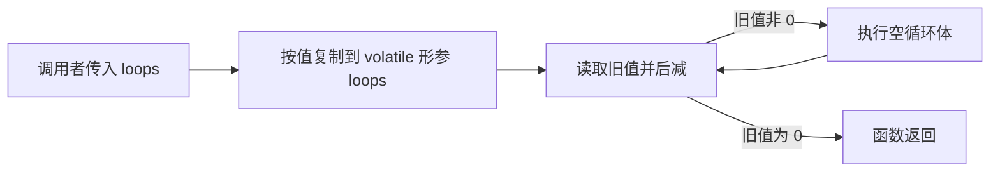
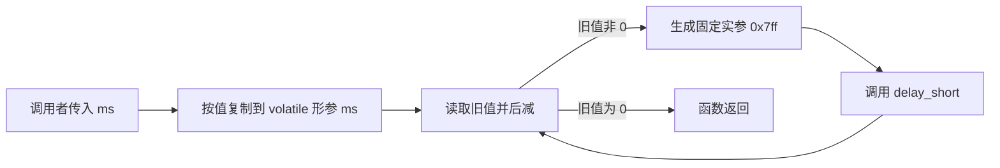

# `bsp_delay.c` 详细设计说明书

## 1. 文档范围与依据

本文档分析对象为 `bsp/delay/bsp_delay.c`，并结合以下实际工程文件确认依赖和调用关系：

- `bsp/delay/bsp_delay.h`
- `project/main.c`
- `Makefile`
- `imx6ul/imx6ul.h`

本文档只描述当前源码能够确认的行为。硬件实际主频、编译器最终生成指令、每条指令耗时和中断影响等无法仅由本文件确认的内容，统一标注为“需结合其他文件确认”。

## 2. 文件职责

`bsp_delay.c` 提供基于 CPU 忙等待循环的延时实现：

- `delay_short()`：按照传入循环次数执行空循环。
- `delay()`：按照传入值重复调用 `delay_short(0x7ff)`，形成更长的近似延时。

该文件不使用硬件定时器，不读取或写入外设寄存器，也不提供精确计时能力。延时期间 CPU 持续执行循环，不能执行其他前台任务。

## 3. 外部依赖

### 3.1 直接依赖

| 依赖 | 类型 | 使用方式 | 实际作用 |
| --- | --- | --- | --- |
| `bsp_delay.h` | 工程头文件 | `#include "bsp_delay.h"` | 提供 `delay_short()` 和 `delay()` 的函数声明，使实现与公开接口保持一致 |

### 3.2 间接依赖

`bsp_delay.h` 包含 `imx6ul.h`，而 `imx6ul.h` 继续包含 `cc.h`、`MCIMX6Y2.h`、`fsl_common.h` 和 `fsl_iomuxc.h`。当前 `bsp_delay.c` 未直接使用这些头文件中的类型、宏、函数或寄存器定义。

### 3.3 构建环境依赖

工程 `Makefile` 将 `bsp/delay` 加入源码目录和头文件搜索目录，并使用以下关键编译参数：

| 参数 | 影响 |
| --- | --- |
| `-O2` | 编译器会优化代码；`volatile` 形参用于约束对循环计数值的访问，但最终指令和耗时仍需检查反汇编确认 |
| `-nostdlib` | 不依赖标准 C 运行库 |
| `-ffreestanding` | 按独立运行环境编译 |

交叉编译器前缀为 `arm-linux-gnueabihf-`。实际编译器版本需结合构建环境确认。

## 4. 宏定义

本文件没有定义或直接使用宏。

`delay()` 内的 `0x7ff` 是整数字面量，不是宏。其十进制值为 `2047`。

## 5. 全局变量与静态变量

本文件没有全局变量，也没有文件作用域静态变量。

## 6. 结构体与枚举

本文件没有定义或使用结构体、联合体或枚举。

## 7. 函数总览

| 函数 | 链接属性 | 功能 | 文件内调用 | 已确认的文件外调用 |
| --- | --- | --- | --- | --- |
| `delay_short()` | 外部链接 | 执行指定次数的空循环 | 无 | 未在当前 `05-led-bsp` 工程其他文件中发现 |
| `delay()` | 外部链接 | 重复调用 `delay_short(0x7ff)` | `delay_short()` | `project/main.c` 中调用两次，实参均为 `500` |

本文件没有静态函数。

## 8. 函数详细设计

### 8.1 `delay_short`

#### 函数原型

```c
void delay_short(volatile unsigned int loops);
```

#### 功能

使用 `while (loops--)` 执行忙等待空循环。每次条件判断都会读取 `loops` 的当前值并执行后减操作；当条件值为 `0` 时退出。

#### 入参

| 参数 | 类型 | 输入/输出 | 说明 |
| --- | --- | --- | --- |
| `loops` | `volatile unsigned int` | 输入；函数内部持续改写其形参副本 | 请求执行的循环次数。由于按值传递，函数内修改不会写回调用者变量 |

#### 返回值

无，返回类型为 `void`。

#### 局部变量

除形参 `loops` 外，没有定义局部变量。

#### 全局变量读写

不读取、不写入任何全局变量或静态变量。

#### 调用关系

- 文件内调用：无。
- 文件外调用：在当前 `05-led-bsp` 工程中未发现；是否被工程外代码调用需结合其他文件确认。
- 被 `delay()` 在本文件内调用。

#### 执行流程

1. 读取 `loops` 当前值作为 `while` 条件值。
2. 对形参副本 `loops` 执行后减。
3. 若条件值非 `0`，执行空循环体并返回步骤 1。
4. 若条件值为 `0`，退出函数。

当入参为 `0` 时，循环体执行 `0` 次；条件表达式仍会执行一次后减，使函数内部形参副本发生无符号回绕，但该副本随后不再使用，也不会影响调用者。

#### Mermaid 流程图



### 8.2 `delay`

#### 函数原型

```c
void delay(volatile unsigned int ms);
```

#### 功能

使用 `while (ms--)` 重复调用 `delay_short(0x7ff)`，形成较长的忙等待延时。

源码注释称该值在 CPU 运行于约 `396 MHz` 时为“millisecond-like”近似延时，但当前文件没有读取或配置 CPU 主频，也没有校准逻辑。因此：

- 参数名 `ms` 表达设计意图，但不能仅依据本函数证明一次外层循环精确等于 `1 ms`。
- 实际延时时间需结合时钟配置、编译器版本、优化结果、存储器执行时序和运行期间中断情况确认。

#### 入参

| 参数 | 类型 | 输入/输出 | 说明 |
| --- | --- | --- | --- |
| `ms` | `volatile unsigned int` | 输入；函数内部持续改写其形参副本 | 请求执行 `delay_short(0x7ff)` 的次数。按值传递，不写回调用者变量 |

#### 返回值

无，返回类型为 `void`。

#### 局部变量

除形参 `ms` 外，没有定义局部变量。

#### 全局变量读写

不读取、不写入任何全局变量或静态变量。

#### 调用关系

- 文件内调用：每次外层循环调用一次 `delay_short(0x7ff)`。
- 文件外被调用：`project/main.c` 中在点亮 LED 后调用 `delay(500)`，在熄灭 LED 后再次调用 `delay(500)`。
- 其他调用者需结合其他文件确认。

#### 执行流程

1. 读取 `ms` 当前值作为 `while` 条件值。
2. 对形参副本 `ms` 执行后减。
3. 若条件值非 `0`，调用 `delay_short(0x7ff)`，然后返回步骤 1。
4. 若条件值为 `0`，退出函数。

当入参为 `N` 时，`delay_short(0x7ff)` 被调用 `N` 次。每次 `delay_short()` 的空循环体执行 `2047` 次，因此从 C 语言逻辑上可确认空循环体总执行次数为 `N × 2047`。实际处理器指令周期数和实际时间需结合反汇编及硬件运行条件确认。

#### Mermaid 流程图



## 9. 文件级调用关系图

以下关系已由当前 `05-led-bsp` 工程源码确认：



`delay_short()` 是否存在工程外直接调用者需结合其他文件确认。

## 10. 数据流分析

### 10.1 `delay_short()` 数据流



- 输入只通过形参传入。
- 数据只在函数内部形参副本中变化。
- 没有输出数据、全局状态变化或外设访问。

### 10.2 `delay()` 数据流



- `ms` 控制 `delay_short()` 的调用次数。
- 固定字面量 `0x7ff` 控制每次短延时的循环次数。
- 函数不返回延时结果，也不反馈实际经过时间。

## 11. 风险与改进建议

| 风险或限制 | 代码依据 | 影响 | 改进建议 |
| --- | --- | --- | --- |
| 延时不精确 | 仅通过嵌套忙等待循环实现，无硬件计时或校准 | 实际延时随 CPU 频率、编译结果和运行环境变化 | 对精度有要求时使用硬件定时器；具体可用定时器资源需结合其他文件确认 |
| CPU 被持续占用 | 循环体不执行其他任务 | 延时期间前台代码无法处理其他工作 | 在存在调度或低功耗需求时改用定时器事件、中断或调度机制；系统架构需结合其他文件确认 |
| 固定常量缺少语义名称 | `delay()` 直接传入 `0x7ff` | 常量来源和调整依据不直观 | 将校准值定义为具有含义的宏或配置项，并记录适用主频与测量依据 |
| 参数名可能暗示精确毫秒 | 参数命名为 `ms`，但实现仅为近似循环 | 调用者可能误认为有毫秒精度保证 | 在接口注释中明确误差范围；误差范围需通过目标板测量确认 |
| 大入参导致长时间阻塞 | `unsigned int` 入参未限制范围 | 极大值会导致长时间忙等待 | 根据调用场景增加范围约束或拆分为可中断的计时机制；允许范围需结合需求确认 |
| 接口暴露实现细节 | `delay_short()` 具有外部链接并在头文件公开 | 外部代码可直接依赖未经校准的底层循环 | 若无文件外使用需求，可考虑改为 `static` 并从公开头文件移除；需先结合其他文件确认外部依赖 |
| 不必要的间接头文件依赖 | `bsp_delay.h` 包含 `imx6ul.h`，但接口仅使用内建 C 类型 | 增加编译依赖和耦合 | 若确认无依赖需求，可移除该包含；需执行全工程构建验证 |

## 12. 结论

`bsp_delay.c` 是一个无全局状态、无外设访问的简单忙等待延时模块。其调用路径和循环次数可以由源码确定，但实际时间精度不能由源码单独保证。当前工程中，`main()` 使用 `delay(500)` 控制 LED 状态切换间隔。
