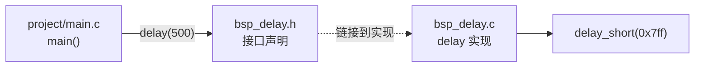
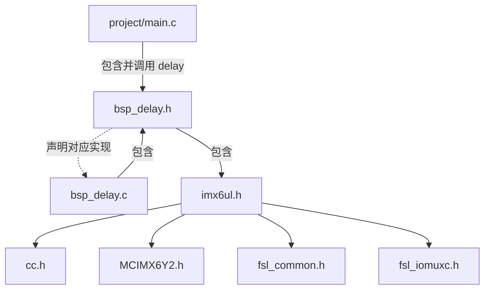

# `bsp_delay.h` 详细设计说明书

## 1. 文档范围与依据

本文档分析对象为 `bsp/delay/bsp_delay.h`，并结合 `bsp_delay.c`、`project/main.c`、`Makefile` 和 `imx6ul/imx6ul.h` 确认公开接口、依赖和调用关系。无法从当前代码确认的信息标注为“需结合其他文件确认”。

## 2. 文件职责

`bsp_delay.h` 是忙等待延时模块的公开接口头文件，职责如下：

- 通过头文件保护宏避免同一翻译单元内重复包含。
- 包含公共 i.MX6UL 包装头文件 `imx6ul.h`。
- 声明 `delay_short()` 和 `delay()` 两个具有外部链接的延时函数。

本文件只声明接口，不包含函数实现。

## 3. 外部依赖

### 3.1 直接依赖

| 依赖 | 类型 | 作用 |
| --- | --- | --- |
| `imx6ul.h` | 工程公共头文件 | 间接引入基础类型定义和 NXP SDK 头文件 |

### 3.2 `imx6ul.h` 的实际包含链

根据当前工程文件，`imx6ul.h` 包含：

- `cc.h`
- `MCIMX6Y2.h`
- `fsl_common.h`
- `fsl_iomuxc.h`

`bsp_delay.h` 中的两个函数声明只使用 C 内建类型 `void` 和 `unsigned int`，未直接使用上述头文件提供的符号。因此该依赖对当前接口是否必要，需结合全工程构建和其他包含场景确认。

## 4. 宏定义

| 宏 | 定义位置 | 功能 | 生命周期 |
| --- | --- | --- | --- |
| `__BSP_DELAY_H` | 文件第 1 至 2 行 | 头文件保护宏，防止同一翻译单元重复处理本头文件内容 | 预处理阶段，从首次包含后持续到当前翻译单元预处理结束 |

保护逻辑：

```c
#ifndef __BSP_DELAY_H
#define __BSP_DELAY_H
/* 头文件内容 */
#endif
```

说明：双下划线开头的标识符通常属于实现保留命名范围，存在命名冲突风险。建议改为项目作用域明确且不以双下划线开头的名称，例如 `BSP_DELAY_H`；是否统一修改需结合工程命名规范确认。

## 5. 全局变量与静态变量

本文件没有声明或定义全局变量、静态变量。

## 6. 结构体与枚举

本文件没有声明或定义结构体、联合体或枚举。

## 7. 函数声明总览

| 函数声明 | 链接属性 | 接口用途 | 实现位置 |
| --- | --- | --- | --- |
| `void delay_short(volatile unsigned int loops);` | 外部链接 | 请求执行指定次数的短忙等待循环 | `bsp_delay.c` |
| `void delay(volatile unsigned int ms);` | 外部链接 | 请求执行较长的近似延时 | `bsp_delay.c` |

本文件没有声明静态函数。

## 8. 函数接口详细设计

### 8.1 `delay_short`

#### 声明

```c
void delay_short(volatile unsigned int loops);
```

#### 功能

公开短忙等待接口。根据 `bsp_delay.c` 的实现，函数使用传入值控制空循环次数。

#### 入参

| 参数 | 类型 | 说明 |
| --- | --- | --- |
| `loops` | `volatile unsigned int` | 循环次数，按值传递；实现内部修改形参副本，不写回调用者 |

#### 返回值

无，返回类型为 `void`。

#### 局部变量、全局变量读写

头文件只提供声明，不定义局部变量，也不直接读写全局变量。实现文件中除形参外无局部变量，且不读写全局变量。

#### 调用关系

- `bsp_delay.c` 中的 `delay()` 调用该函数。
- 当前 `05-led-bsp` 工程其他文件未发现直接调用。
- 工程外调用情况需结合其他文件确认。

#### 执行流程

头文件本身不执行流程。实际实现流程见 `bsp_delay.c.md` 中的 `delay_short` 详细设计。


### 8.2 `delay`

#### 声明

```c
void delay(volatile unsigned int ms);
```

#### 功能

公开较长忙等待接口。根据 `bsp_delay.c` 的实现，函数按照 `ms` 的值重复调用 `delay_short(0x7ff)`。

参数名表达毫秒延时意图，但接口中没有精度、误差或适用主频约束。实际延时是否满足调用方要求需结合时钟配置和目标板测量确认。

#### 入参

| 参数 | 类型 | 说明 |
| --- | --- | --- |
| `ms` | `volatile unsigned int` | 控制短延时调用次数，按值传递；实现内部修改形参副本，不写回调用者 |

#### 返回值

无，返回类型为 `void`。

#### 局部变量、全局变量读写

头文件只提供声明，不定义局部变量，也不直接读写全局变量。实现文件中除形参外无局部变量，且不读写全局变量。

#### 调用关系

- `project/main.c` 中已确认存在两处 `delay(500)` 调用。
- 实现函数在文件内调用 `delay_short(0x7ff)`。
- 其他调用者需结合其他文件确认。

#### 执行流程

头文件本身不执行流程。实际实现流程见 `bsp_delay.c.md` 中的 `delay` 详细设计。



## 9. 文件级依赖与调用关系图



说明：`project/main.c` 对 `bsp_delay.h` 的包含关系及其对 `delay()` 的调用已由当前工程源码确认。图中的 SDK 头文件为包含依赖，不代表延时接口直接使用其中的符号。

## 10. 数据流分析

头文件不执行运行时数据处理，只定义调用者与实现之间的接口契约：


- 输入数据：`unsigned int` 类型的循环控制值。
- 参数传递：按值传递；`volatile` 修饰实现所接收的形参对象，不会使调用者变量被函数写回。
- 输出数据：无。
- 全局状态：接口未声明任何全局状态。

## 11. 风险与改进建议

| 风险或限制 | 代码依据 | 改进建议 |
| --- | --- | --- |
| 接口没有说明延时误差和适用条件 | 注释仅说明为忙等待接口，函数声明无精度约束 | 补充适用主频、误差范围和限制；具体数值需结合目标板测量确认 |
| `ms` 命名可能被理解为精确毫秒 | `delay(volatile unsigned int ms)` | 若无法保证毫秒语义，可使用表达近似延时的名称，或提供经硬件定时器保证的毫秒接口 |
| `delay_short()` 公开暴露 | 声明位于公共头文件且具有外部链接 | 若确认仅由 `delay()` 使用，可改为实现文件内静态函数；需结合其他文件确认无外部调用 |
| `imx6ul.h` 依赖可能不必要 | 两个声明只使用 C 内建类型 | 在全工程构建验证通过的前提下移除不必要包含，降低耦合和编译开销 |
| 头文件保护宏使用双下划线前缀 | `__BSP_DELAY_H` | 改用不属于实现保留命名范围的项目宏名 |
| 参数范围未形成接口契约 | 接口接受完整 `unsigned int` 范围 | 补充允许范围及超范围处理规则；具体范围需结合产品需求确认 |

## 12. 结论

`bsp_delay.h` 对外公开两个无返回值的忙等待延时接口，不包含运行时状态。当前接口能够满足简单裸机 LED 示例中的阻塞延时调用，但没有对延时精度、参数范围和 CPU 占用行为作出明确契约。
