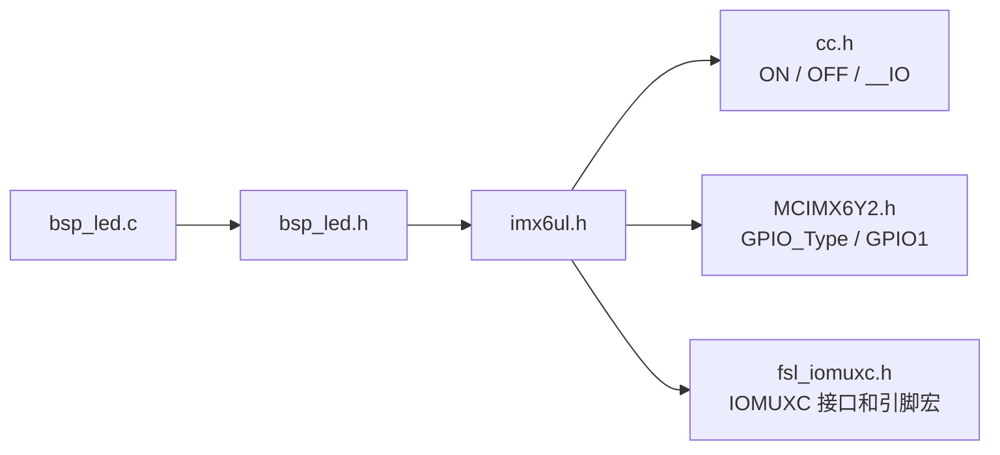
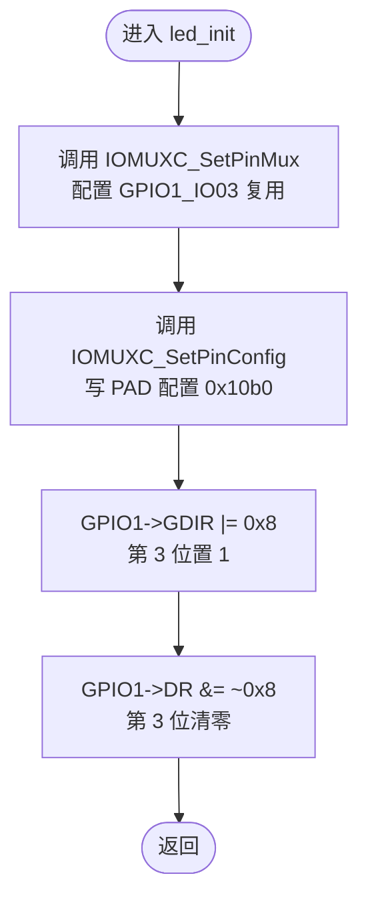
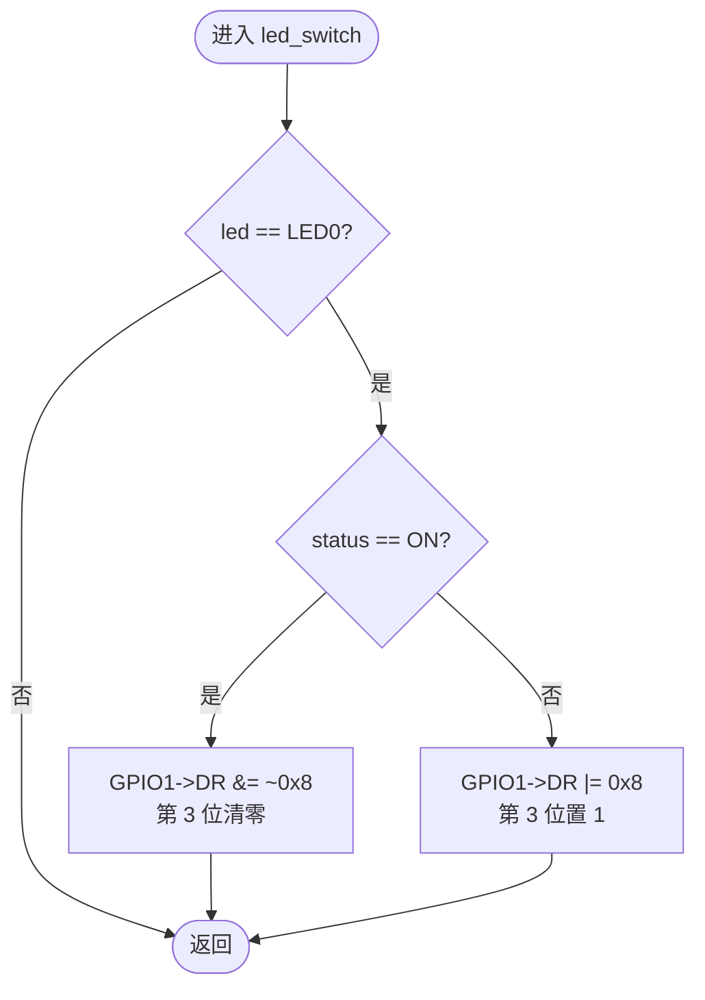
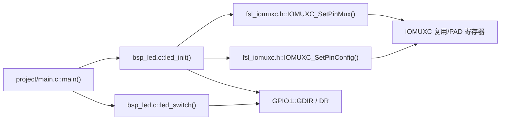
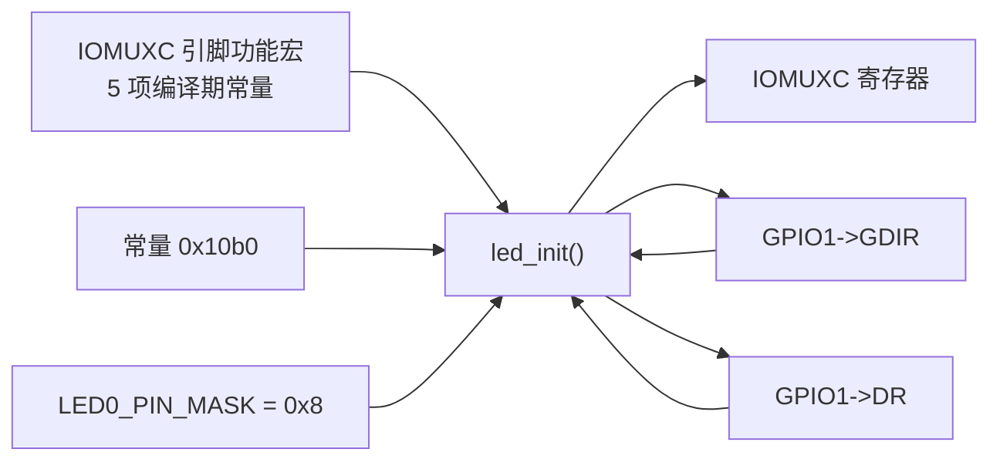
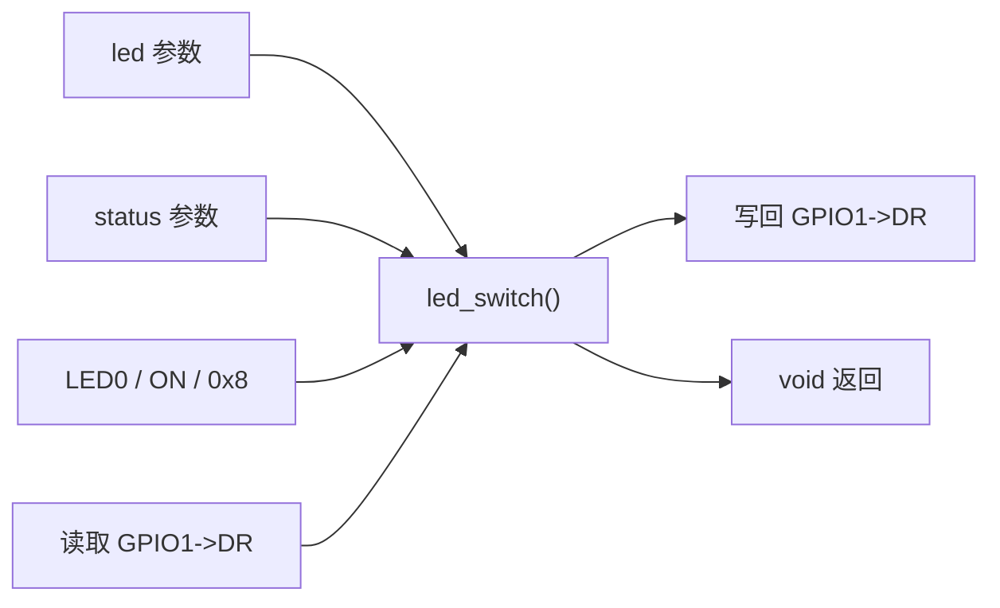

# `bsp_led.c` 详细设计文档

## 1. 文档范围与分析依据

本文档基于以下实际代码进行静态分析：

- `bsp/led/bsp_led.c`
- `bsp/led/bsp_led.h`
- `imx6ul/imx6ul.h`
- `imx6ul/cc.h`
- `imx6ul/MCIMX6Y2.h`
- `imx6ul/fsl_iomuxc.h`
- `project/main.c`
- 项目根目录 `Makefile`

本文仅将上述文件能够确认的内容写为事实。LED 的实际硬件连接、GPIO 电气电平与 LED 亮灭状态的对应关系、寄存器字段的完整硬件语义和写入约束，需结合开发板原理图及芯片参考手册确认。

## 2. 文件概述

### 2.1 文件信息

| 项目 | 内容 |
| --- | --- |
| 文件名 | `bsp_led.c` |
| 文件类型 | C 源文件 |
| 所属模块 | BSP LED 驱动模块 |
| 直接包含文件 | `bsp_led.h` |
| 对外接口 | `led_init()`、`led_switch()` |
| 文件内静态函数 | 无 |

### 2.2 文件职责

`bsp_led.c` 负责固定 LED0 控制通道的初始化与状态切换：

- 将 `GPIO1_IO03` 复用为 `GPIO1_IO03`。
- 将对应 PAD 配置寄存器写为 `0x10b0`。
- 将 `GPIO1` 的第 3 位配置为输出。
- 初始化结束时清零 `GPIO1->DR` 第 3 位。
- 根据 `led_switch()` 的 `status` 参数清零或置位 `GPIO1->DR` 第 3 位。
- 忽略非 `LED0` 的 LED 编号。

源文件注释声明 LED0 连接到 `GPIO1_IO03` 且低电平有效；代码按此约定实现。实际连接与亮灭效果需结合硬件原理图确认。

### 2.3 功能边界

本文件不负责：

- 使能 GPIO1 或 IOMUXC 所需时钟；当前 `main()` 在 `led_init()` 前调用 `clk_enable()`。
- 配置其他 LED 或其他 GPIO 引脚。
- 读取 LED 当前状态。
- 验证寄存器写入结果。
- 对参数错误返回状态。
- 提供并发访问保护。

## 3. 外部依赖分析

### 3.1 直接与间接依赖

| 依赖项 | 类型 | 来源 | 用途 |
| --- | --- | --- | --- |
| `bsp_led.h` | 直接包含 | `bsp/led/bsp_led.h` | 提供公开声明、`LED0` 及间接依赖 |
| `imx6ul.h` | 间接包含 | `imx6ul/imx6ul.h` | 聚合芯片与公共头文件 |
| `cc.h` | 间接包含 | `imx6ul/cc.h` | 定义 `ON`、`OFF`、`uint32_t`、`__IO` |
| `MCIMX6Y2.h` | 间接包含 | `imx6ul/MCIMX6Y2.h` | 定义 `GPIO_Type`、`GPIO1`、寄存器布局 |
| `fsl_iomuxc.h` | 间接包含 | `imx6ul/fsl_iomuxc.h` | 定义引脚功能宏及两个静态内联配置函数 |
| `IOMUXC_SetPinMux()` | 文件外静态内联函数 | `fsl_iomuxc.h` | 写引脚复用寄存器；输入选择地址非零时还会写输入选择寄存器 |
| `IOMUXC_SetPinConfig()` | 文件外静态内联函数 | `fsl_iomuxc.h` | 在配置寄存器地址非零时写 PAD 配置值 |
| `GPIO1` | 外部宏 | `MCIMX6Y2.h` | 提供地址为 `0x0209c000` 的 `GPIO_Type *` |

### 3.2 依赖定义链



### 3.3 构建与调用依赖

项目根目录 `Makefile` 将 `bsp/led` 加入头文件搜索目录和源文件目录，并通过通配符收集其中的 `.c` 文件。因此 `bsp_led.c` 会参与当前项目构建。

当前工程内已确认的调用者为 `project/main.c::main()`：

1. `main()` 调用 `clk_enable()`。
2. `main()` 调用 `led_init()`。
3. `main()` 在无限循环内交替调用 `led_switch(LED0, ON)` 和 `led_switch(LED0, OFF)`。

## 4. 宏定义分析

### 4.1 本文件定义的宏

| 宏名称 | 宏值 | 展开结果或用途 |
| --- | --- | --- |
| `LED0_GPIO` | `GPIO1` | 固定选择 GPIO1 寄存器块 |
| `LED0_PIN` | `3U` | 固定选择 GPIO1 的第 3 位 |
| `LED0_PIN_MASK` | `(1U << LED0_PIN)` | 位掩码，按当前定义计算为 `0x00000008U` |

### 4.2 使用的外部宏

| 宏名称 | 实际定义 | 来源 | 用途 |
| --- | --- | --- | --- |
| `LED0` | `0` | `bsp_led.h` | `led_switch()` 支持的唯一 LED 编号 |
| `ON` | `1` | `cc.h` | `led_switch()` 的开灯判定值 |
| `OFF` | `0` | `cc.h` | 当前 `main()` 的关灯实参；`led_switch()` 未直接判断该宏 |
| `GPIO1_BASE` | `(0x209C000u)` | `MCIMX6Y2.h` | GPIO1 外设基地址 |
| `GPIO1` | `((GPIO_Type *)GPIO1_BASE)` | `MCIMX6Y2.h` | GPIO1 寄存器块指针 |
| `IOMUXC_GPIO1_IO03_GPIO1_IO03` | 五项逗号分隔参数 | `fsl_iomuxc.h` | 向 IOMUXC 配置函数传递寄存器地址及模式参数 |

`IOMUXC_GPIO1_IO03_GPIO1_IO03` 展开为：

```c
0x020E0068U, 0x5U, 0x00000000U, 0x0U, 0x020E02F4U
```

因此：

- `IOMUXC_SetPinMux(..., 0)` 实际接收 6 个参数，向地址 `0x020e0068` 写入由模式 `0x5` 和输入使能值 `0` 组成的值；由于输入选择寄存器地址为 `0`，不会执行输入选择寄存器写入。
- `IOMUXC_SetPinConfig(..., 0x10b0)` 实际接收 6 个参数，向地址 `0x020e02f4` 写入 `0x10b0`。

## 5. 全局变量与静态变量分析

`bsp_led.c` 未定义 C 全局变量，也未定义文件级静态变量。

| 类别 | 名称 | 类型 | 说明 |
| --- | --- | --- | --- |
| 全局变量 | 无 | 无 | 本文件未定义 |
| 文件级静态变量 | 无 | 无 | 本文件未定义 |

函数会访问内存映射硬件寄存器。寄存器是全局硬件状态，不是 C 全局变量。

## 6. 结构体、联合体与枚举分析

### 6.1 本文件定义情况

`bsp_led.c` 未定义结构体、联合体、枚举或 `typedef`，也未使用枚举。

### 6.2 使用的外部结构体 `GPIO_Type`

`GPIO_Type` 定义于 `MCIMX6Y2.h`。本文件直接访问的成员如下：

| 成员 | 类型 | 相对基地址偏移 | 芯片头文件说明 | 本文件访问方式 |
| --- | --- | ---: | --- | --- |
| `DR` | `__IO uint32_t` | `0x0` | GPIO data register | 读改写 |
| `GDIR` | `__IO uint32_t` | `0x4` | GPIO direction register | 读改写 |

`cc.h` 将 `__IO` 定义为 `volatile`。因此这些成员访问是易失内存访问。各位值的完整硬件语义需结合芯片参考手册确认。

## 7. 函数总览

| 函数 | 可见性 | 入参 | 返回值 | 文件内调用 | 文件外调用 |
| --- | --- | --- | --- | --- | --- |
| `led_init()` | 全局公开 | 无 | `void` | 无 | `IOMUXC_SetPinMux()`、`IOMUXC_SetPinConfig()` |
| `led_switch()` | 全局公开 | `int led`、`int status` | `void` | 无 | 无 |

本文件没有静态函数。

## 8. 函数详细设计：`led_init`

### 8.1 函数原型与功能

```c
void led_init(void);
```

该函数配置固定引脚 `GPIO1_IO03`，将其设为 GPIO 输出，并通过清零 `GPIO1->DR` 第 3 位设置默认输出状态。依据源文件注释，默认状态意图为点亮 LED0；硬件实际亮灭需结合原理图确认。

### 8.2 入参、返回值与局部变量

| 项目 | 内容 |
| --- | --- |
| 入参 | 无 |
| 返回值 | 无，不能反馈配置结果 |
| 局部变量 | 无 |

### 8.3 读写全局变量与硬件状态

| 对象 | 操作 | 值或掩码 | 说明 |
| --- | --- | --- | --- |
| C 全局变量 | 无 | 无 | 本文件未定义或访问 C 全局变量 |
| IOMUXC 复用寄存器 `0x020e0068` | 写 | 由模式 `0x5`、输入使能 `0` 生成 | 由 `IOMUXC_SetPinMux()` 完成 |
| IOMUXC PAD 配置寄存器 `0x020e02f4` | 写 | `0x10b0` | 由 `IOMUXC_SetPinConfig()` 完成 |
| `GPIO1->GDIR` | 读改写 | `GDIR |= 0x8` | 保留其他位，将第 3 位置 1 |
| `GPIO1->DR` | 读改写 | `DR &= ~0x8` | 保留其他位，将第 3 位清零 |

### 8.4 调用关系

#### 文件内调用

无。

#### 文件外调用

| 被调用函数 | 来源 | 实参 | 可确认行为 |
| --- | --- | --- | --- |
| `IOMUXC_SetPinMux()` | `fsl_iomuxc.h` | 引脚功能宏展开的 5 项参数，加 `0` | 写复用寄存器；本次不写输入选择寄存器 |
| `IOMUXC_SetPinConfig()` | `fsl_iomuxc.h` | 引脚功能宏展开的 5 项参数，加 `0x10b0` | 写 PAD 配置寄存器 |

#### 已确认的外部调用者

| 调用者 | 来源 | 调用顺序 |
| --- | --- | --- |
| `main()` | `project/main.c` | 在 `clk_enable()` 之后、进入无限循环之前调用一次 |

### 8.5 执行流程

1. 调用 `IOMUXC_SetPinMux()`，将 `GPIO1_IO03` 的复用模式参数设置为 `0x5`，输入使能参数为 `0`。
2. 调用 `IOMUXC_SetPinConfig()`，将对应 PAD 配置寄存器写为 `0x10b0`。
3. 读取 `GPIO1->GDIR`，将第 3 位置 1 后写回。
4. 读取 `GPIO1->DR`，将第 3 位清零后写回。
5. 返回调用者。

### 8.6 Mermaid 流程图



### 8.7 前置条件与后置状态

前置条件：

- 当前执行环境能够访问 IOMUXC 和 GPIO1 内存映射地址。
- 相关时钟和访问权限已准备完成。当前 `main()` 先调用 `clk_enable()`，但其是否满足全部硬件前置条件需结合芯片参考手册确认。
- 没有其他执行上下文同时修改目标寄存器，或并发修改已被妥善协调；是否存在并发需结合其他文件确认。

后置状态：

- 软件已向两个 IOMUXC 寄存器各执行一次写操作。
- `GPIO1->GDIR` 第 3 位被置 1。
- `GPIO1->DR` 第 3 位被清零。
- 代码没有回读或验证硬件最终状态。

## 9. 函数详细设计：`led_switch`

### 9.1 函数原型与功能

```c
void led_switch(int led, int status);
```

该函数仅处理 `led == LED0` 的调用。对于 LED0，当 `status == ON` 时清零 `GPIO1->DR` 第 3 位；其他任意 `status` 值均将该位置 1。代码没有单独判断 `OFF`。

### 9.2 入参说明

| 参数 | 类型 | 判定规则 | 影响 |
| --- | --- | --- | --- |
| `led` | `int` | 必须等于 `LED0`，即 `0` | 不等于 `0` 时立即返回，不修改寄存器 |
| `status` | `int` | 仅 `status == ON`，即 `1`，进入清零分支 | 除 `1` 外的所有值均进入置位分支 |

### 9.3 返回值与局部变量

| 项目 | 内容 |
| --- | --- |
| 返回值 | 无；非法 LED 编号不会反馈错误 |
| 局部变量 | 无 |

### 9.4 读写全局变量与硬件状态

| 条件 | 读取 | 写入 | 结果 |
| --- | --- | --- | --- |
| `led != LED0` | 无硬件读取 | 无 | 直接返回 |
| `led == LED0 && status == ON` | `GPIO1->DR` | `GPIO1->DR` | 第 3 位清零，其他位保持读到的值 |
| `led == LED0 && status != ON` | `GPIO1->DR` | `GPIO1->DR` | 第 3 位置 1，其他位保持读到的值 |

本函数不访问 C 全局变量。

### 9.5 调用关系

#### 文件内调用与文件外调用

均无。函数直接读改写 GPIO1 数据寄存器。

#### 已确认的外部调用者

| 调用者 | 来源 | 调用形式 |
| --- | --- | --- |
| `main()` | `project/main.c` | 无限循环中调用 `led_switch(LED0, ON)` 与 `led_switch(LED0, OFF)` |

### 9.6 执行流程

1. 比较 `led` 与 `LED0`。
2. 若不相等，立即返回。
3. 比较 `status` 与 `ON`。
4. 若相等，读取 `GPIO1->DR`，清零第 3 位后写回。
5. 若不相等，读取 `GPIO1->DR`，置位第 3 位后写回。
6. 返回调用者。

### 9.7 Mermaid 流程图



## 10. 文件级调用关系图



关系说明：

- `main()` 是当前工程内已确认的两个公开接口调用者。
- `led_init()` 调用两个定义在外部头文件中的静态内联函数，并直接访问 GPIO1 寄存器。
- `led_switch()` 不调用其他函数，仅直接访问 `GPIO1->DR`。
- 编译器是否将静态内联函数实际内联，需结合编译结果确认。

## 11. 数据流分析

### 11.1 初始化数据流



### 11.2 状态切换数据流



### 11.3 数据流特征

| 特征 | 分析 |
| --- | --- |
| 配置输入 | 固定编译期宏和常量，不接收运行时配置 |
| 控制输入 | `led`、`status` 两个 `int` 参数 |
| 输出 | 无返回值 |
| 副作用 | 修改 IOMUXC 和 GPIO1 硬件寄存器 |
| 状态保留 | GPIO 读改写保留寄存器其他位在读取时的值 |
| 反馈闭环 | 无回读验证、无错误反馈 |

## 12. 风险分析

| 风险 | 代码依据 | 可能影响 | 确认要求 |
| --- | --- | --- | --- |
| `status` 非法值被当作关闭处理 | 仅判断 `status == ON`，其余值全部进入 `else` | 调用错误被静默接受 | 是否需要严格参数检查需结合接口要求确认 |
| 非 LED0 编号被静默忽略 | `led != LED0` 时直接返回 | 调用者无法发现编号错误 | 是否需要错误反馈需结合系统需求确认 |
| GPIO 读改写存在并发覆盖风险 | 对 `GDIR`、`DR` 使用 `|=` 和 `&=` | 若其他上下文同时修改同一寄存器，可能覆盖其更新 | 是否存在中断或并发访问需结合其他文件确认 |
| 固定硬件绑定 | 宏固定为 GPIO1 第 3 位 | 无法通过接口复用到其他 LED | 是否需要多 LED 支持需结合产品需求确认 |
| 初始化顺序依赖 | `led_init()` 本身不使能时钟 | 单独调用时硬件访问可能不满足前置条件 | 时钟要求需结合芯片手册确认 |
| 无结果验证 | 所有写入后均不回读 | 无法从软件确认配置是否生效 | 正确验证方式需结合芯片手册确认 |
| PAD 配置使用裸常量 | `0x10b0` | 字段意图依赖注释，修改时容易出错 | 各字段语义需结合芯片手册确认 |
| 低电平有效依赖硬件假设 | 清零表示 ON、置位表示 OFF | 若硬件极性不同，行为相反 | 实际极性需结合原理图确认 |
| 初始化瞬态 | 先设置输出方向，再清零数据位 | 引脚在两次操作之间的输出值取决于此前 `DR` 状态 | 瞬态影响需结合硬件状态和芯片手册确认 |

## 13. 改进建议

以下建议不改变当前代码事实，是否实施需结合项目目标和芯片手册确认。

1. 使用明确的状态类型或枚举，并对非 `ON`/`OFF` 输入做显式处理，避免任意值被视为关闭。
2. 如调用者需要识别参数错误或硬件配置失败，可将接口改为返回状态值。
3. 使用 IOMUXC 字段宏组合 PAD 配置值，减少对裸常量 `0x10b0` 和注释同步性的依赖。
4. 评估初始化时先设置 `DR` 目标值、再切换 `GDIR` 的可行性，以减少输出切换瞬态；正确顺序需结合芯片手册和硬件要求确认。
5. 如存在并发修改 GPIO1 寄存器的上下文，应建立统一所有权、临界区或硬件原子置位/清零方案；可用机制需结合芯片能力确认。
6. 将 GPIO 实例、引脚号和有效电平封装为配置数据，可提高多 LED 扩展能力；当前项目是否需要此抽象需结合需求确认。
7. 为公开接口补充前置条件和参数约束注释。

## 14. 测试与验证建议

| 测试项 | 验证目标 | 建议方法 |
| --- | --- | --- |
| 编译检查 | 声明、定义、宏展开和依赖解析正确 | 使用项目 `Makefile` 编译 |
| 初始化寄存器检查 | 复用、PAD、方向和默认数据位符合代码预期 | 调试器回读；是否适用需结合芯片手册确认 |
| LED0 开关检查 | `ON` 清零 DR 第 3 位，`OFF` 置位 | 实板观察与寄存器回读 |
| 非 LED0 参数检查 | 调用不修改 `GPIO1->DR` | 测试前后回读寄存器 |
| 非法状态检查 | 确认除 `ON` 外均进入置位分支 | 单元测试或受控寄存器替身测试 |
| 其他 GPIO 位保持检查 | 读改写不应主动改变其他位 | 比较操作前后其他位 |
| 初始化瞬态检查 | 评估方向设置与数据写入之间的输出变化 | 示波器或逻辑分析仪；是否需要取决于硬件要求 |

当前分析范围内未发现针对 `led_init()` 或 `led_switch()` 的自动化测试。仓库范围外是否存在测试，需结合其他文件确认。
