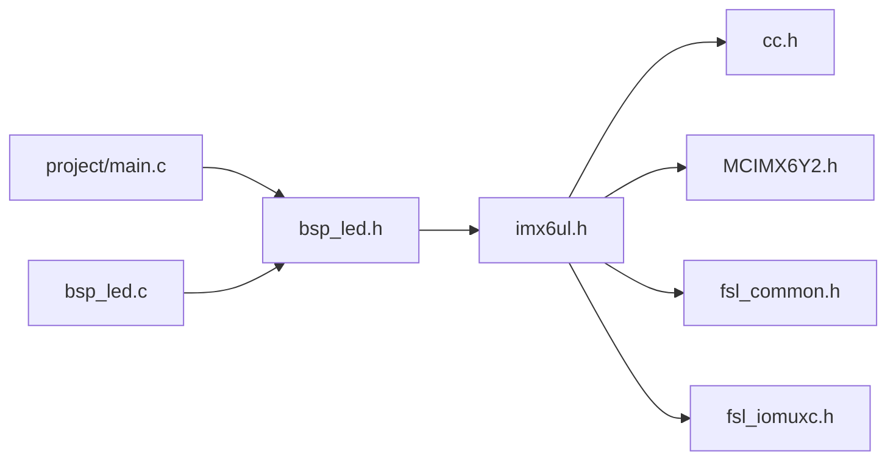
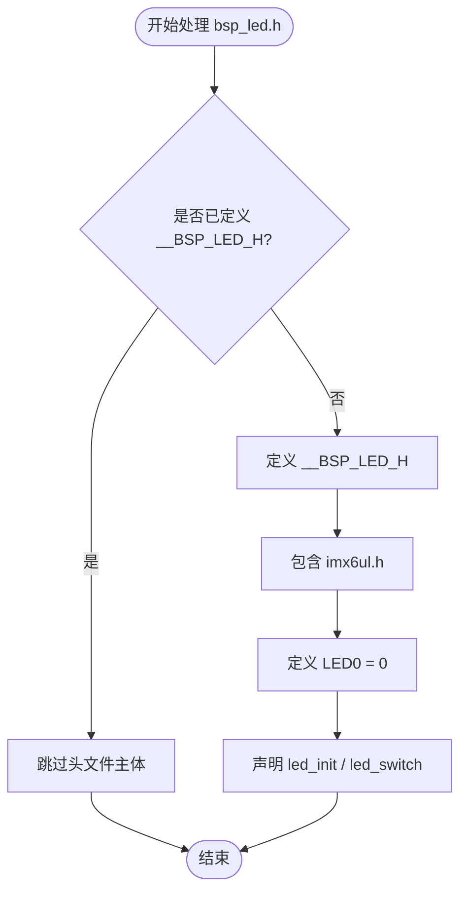
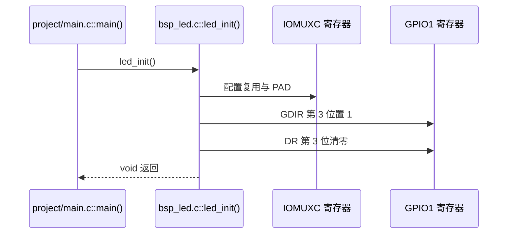
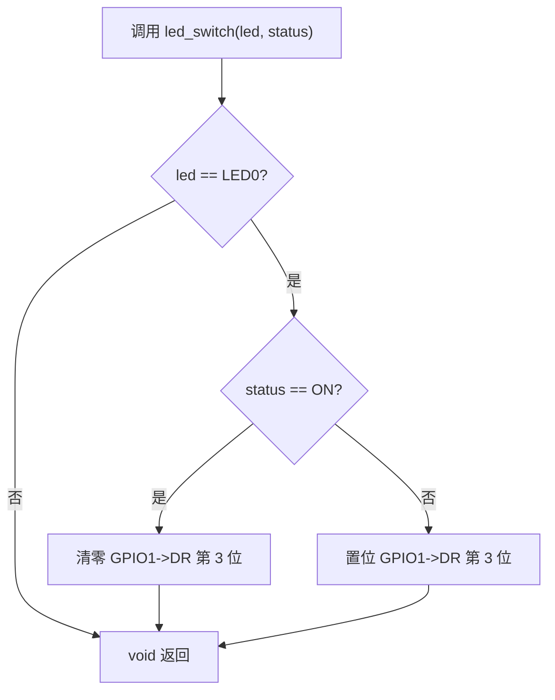
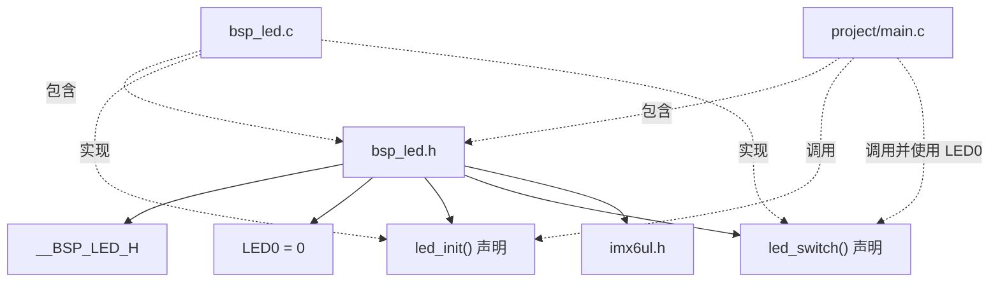
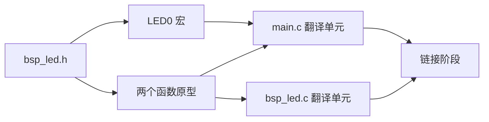

# `bsp_led.h` 详细设计文档

## 1. 文档范围与分析依据

本文档基于 `bsp_led.h` 的实际代码，并结合 `bsp_led.c`、`imx6ul.h`、`cc.h`、`MCIMX6Y2.h`、`fsl_iomuxc.h`、`project/main.c` 和项目根目录 `Makefile` 进行静态分析。

无法从这些文件确认的硬件语义或系统约束均标注为“需结合其他文件确认”。

## 2. 文件概述

### 2.1 文件信息

| 项目 | 内容 |
| --- | --- |
| 文件名 | `bsp_led.h` |
| 文件类型 | C 头文件 |
| 所属模块 | BSP LED 驱动模块 |
| 直接包含文件 | `imx6ul.h` |
| 对外宏 | `LED0` |
| 对外函数声明 | `led_init()`、`led_switch()` |

### 2.2 文件职责

`bsp_led.h` 是 LED 驱动模块的公开接口头文件，职责如下：

- 使用包含保护宏避免同一翻译单元内重复处理头文件主体。
- 包含公共芯片头文件 `imx6ul.h`。
- 定义 LED0 的逻辑编号。
- 声明 LED 初始化与状态切换接口。

该文件不包含函数实现，不定义 GPIO 实例、引脚号或有效电平。具体硬件绑定位于 `bsp_led.c`。

### 2.3 已确认的使用场景

| 使用者 | 使用方式 |
| --- | --- |
| `bsp_led.c` | 包含头文件，并实现其中声明的两个函数 |
| `project/main.c` | 包含头文件，使用 `LED0`、`ON`、`OFF` 并调用两个公开函数 |

其他构建目标或仓库外代码是否包含该头文件，需结合其他文件确认。

## 3. 外部依赖分析

### 3.1 直接依赖

| 依赖 | 类型 | 用途 |
| --- | --- | --- |
| `imx6ul.h` | 项目公共头文件 | 向包含者传递基础类型、状态宏、芯片寄存器和 IOMUXC 接口定义 |

### 3.2 `imx6ul.h` 的已确认包含项

| 头文件 | 与 LED 模块相关的内容 |
| --- | --- |
| `cc.h` | 定义 `ON`、`OFF`、基础整数类型和寄存器访问限定宏 |
| `MCIMX6Y2.h` | 定义 `GPIO_Type`、`GPIO1` 及 GPIO 寄存器布局 |
| `fsl_common.h` | 由 `imx6ul.h` 包含；LED 公开函数签名未直接使用其类型 |
| `fsl_iomuxc.h` | 定义 IOMUXC 引脚宏及配置函数 |

### 3.3 依赖传递关系



`led_init()` 和 `led_switch()` 的公开签名仅使用 C 内建类型，因此公开头文件是否必须直接包含 `imx6ul.h`，需结合项目接口设计确认。

## 4. 宏定义分析

### 4.1 本文件定义的宏

| 宏名称 | 宏值 | 有效范围 | 功能 |
| --- | --- | --- | --- |
| `__BSP_LED_H` | 无显式值 | 预处理阶段 | 头文件包含保护标记 |
| `LED0` | `0` | 所有包含该头文件的翻译单元 | 表示驱动当前支持的 LED0 逻辑编号 |

### 4.2 `LED0` 语义

从代码可确认：

- `project/main.c` 将 `LED0` 作为 `led_switch()` 的第一个参数。
- `bsp_led.c::led_switch()` 仅在 `led == LED0` 时执行寄存器操作。
- `LED0` 是逻辑编号 `0`，不是 GPIO 引脚号。
- `LED0` 与 GPIO1 第 3 位的映射仅在 `bsp_led.c` 中定义。

### 4.3 包含保护流程



包含保护宏以双下划线开头。此类名称通常属于 C 实现保留标识符范围，具体约束需结合项目采用的语言标准和编译器确认。

## 5. 全局变量与静态变量分析

`bsp_led.h` 未声明或定义任何变量。

| 类别 | 名称 | 说明 |
| --- | --- | --- |
| 外部变量声明 | 无 | 没有 `extern` 变量 |
| 变量定义 | 无 | 头文件不定义存储对象 |
| 静态变量 | 无 | 头文件中没有静态变量 |

## 6. 结构体、联合体与枚举分析

### 6.1 本文件定义情况

`bsp_led.h` 未定义结构体、联合体、枚举或 `typedef`，函数声明也不直接使用这些类型。

### 6.2 间接暴露的数据类型

由于本文件包含 `imx6ul.h`，所有包含者会间接获得 `GPIO_Type` 等芯片相关类型以及大量宏。`bsp_led.c` 实际使用 `GPIO_Type` 对应的 `DR` 和 `GDIR` 成员，但这些类型不是 LED 公开接口签名的一部分。

### 6.3 状态表示

LED 状态没有使用枚举。`led_switch()` 使用 `int status`，并依赖 `cc.h` 中的：

```c
#define ON  1
#define OFF 0
```

实现仅显式判断 `ON`；其他任意整数均按非 ON 分支处理。

## 7. 函数声明总览

| 函数 | 声明 | 可见性 | 实现位置 |
| --- | --- | --- | --- |
| `led_init` | `void led_init(void);` | 对包含者可见 | `bsp_led.c` |
| `led_switch` | `void led_switch(int led, int status);` | 对包含者可见 | `bsp_led.c` |

本头文件没有静态函数、内联函数或函数宏。

## 8. 接口详细设计：`led_init`

### 8.1 声明与功能

```c
void led_init(void);
```

该声明向调用者公开 LED 初始化接口。根据 `bsp_led.c` 实现，函数配置 `GPIO1_IO03` 的复用和 PAD 参数，将 GPIO1 第 3 位设为输出，并清零其数据位。

### 8.2 接口属性

| 项目 | 内容 |
| --- | --- |
| 入参 | 无 |
| 返回值 | 无 |
| 局部变量 | 头文件只有声明，不存在局部变量 |
| 读写全局变量 | 声明本身不读写；实现读改写 GPIO1 寄存器 |
| 文件内调用 | 无，头文件没有实现 |
| 实现中的文件外调用 | `IOMUXC_SetPinMux()`、`IOMUXC_SetPinConfig()` |

### 8.3 已确认的调用关系

| 关系 | 文件 | 说明 |
| --- | --- | --- |
| 实现者 | `bsp_led.c` | 定义 `led_init()` |
| 调用者 | `project/main.c` | 在 `clk_enable()` 之后调用一次 |

### 8.4 接口执行流程图



完整逐步流程见 `bsp_led.c.md`。

## 9. 接口详细设计：`led_switch`

### 9.1 声明与功能

```c
void led_switch(int led, int status);
```

该声明向调用者公开 LED 状态切换接口。当前实现仅支持 `LED0`。当 `status == ON` 时清零目标数据位，其他状态值均置位目标数据位。

### 9.2 入参说明

| 参数 | 类型 | 当前实现约束 |
| --- | --- | --- |
| `led` | `int` | 仅 `LED0` 有效，其他值被静默忽略 |
| `status` | `int` | 仅 `ON` 进入开灯分支；包括 `OFF` 在内的其他值均进入另一分支 |

### 9.3 返回值、局部变量与副作用

| 项目 | 内容 |
| --- | --- |
| 返回值 | 无，不反馈非法参数或硬件状态 |
| 局部变量 | 头文件只有声明，不存在局部变量 |
| 读写全局变量 | 声明本身不读写；实现读改写 `GPIO1->DR` |
| 文件内调用 | 无 |
| 文件外调用 | 实现不调用其他函数 |

### 9.4 已确认的调用关系

| 关系 | 文件 | 说明 |
| --- | --- | --- |
| 实现者 | `bsp_led.c` | 定义 `led_switch()` |
| 调用者 | `project/main.c` | 无限循环中分别传入 `LED0, ON` 和 `LED0, OFF` |

### 9.5 接口执行流程图



完整逐步流程见 `bsp_led.c.md`。

## 10. 文件级调用与依赖关系图



## 11. 数据流分析

头文件本身不执行运行时数据处理。其主要信息流发生在预处理、编译和链接阶段：



| 信息 | 来源 | 去向 | 作用 |
| --- | --- | --- | --- |
| `LED0` 编译期常量 | `bsp_led.h` | `main.c`、`bsp_led.c` | 统一 LED0 逻辑编号 |
| 函数原型 | `bsp_led.h` | 调用者和实现翻译单元 | 提供编译期类型检查 |
| 芯片相关定义 | `imx6ul.h` | 所有包含 `bsp_led.h` 的文件 | 形成传递依赖 |

## 12. 风险分析

| 风险 | 代码依据 | 可能影响 | 备注 |
| --- | --- | --- | --- |
| 公开头文件传递芯片级依赖 | 直接包含 `imx6ul.h`，但公开签名仅使用内建类型 | 增加编译依赖并暴露大量宏和类型 | 实际影响需结合工程规模确认 |
| 包含保护宏使用保留风格名称 | `__BSP_LED_H` 以双下划线开头 | 可能与实现保留标识符规则冲突 | 需结合编译器与编码规范确认 |
| LED 编号使用无类型宏 | `#define LED0 0` | 编译器无法限制无效 LED 编号 | 当前实现静默忽略其他值 |
| 状态参数使用 `int` | `led_switch(int led, int status)` | 任意整数都能传入，且除 `ON` 外均按另一状态处理 | 是否需要严格类型需结合需求确认 |
| 接口无错误反馈 | 两个接口均返回 `void` | 调用者无法识别参数错误或配置失败 | 当前实现也未进行验证 |
| 接口注释不足 | 头文件仅有模块级注释 | 调用者无法从头文件确认有效编号、状态规则和前置条件 | 需查阅实现文件 |
| 缺少 C++ 链接保护 | 未使用 `extern "C"` | 被 C++ 直接包含时可能发生名称修饰 | 项目是否使用 C++ 需结合其他文件确认 |

## 13. 改进建议

1. 将包含保护宏改为项目命名空间形式，例如 `BSP_LED_H` 或 `BSP_LED_H_`。
2. 评估是否可从公开头文件移除 `#include "imx6ul.h"`，仅在实现文件包含，以减少传递依赖。
3. 为两个公开函数增加接口注释，明确前置条件、有效参数、低电平有效约定和副作用。
4. 使用枚举或项目定义的明确类型表示 LED 编号和状态，并定义非法值处理策略。
5. 如调用者需要诊断错误，将接口调整为返回状态值。
6. 如项目可能由 C++ 调用，按项目规范增加 `extern "C"` 保护。
7. 若未来支持多个 LED，可将逻辑编号与硬件映射集中管理；具体设计需结合需求确认。

## 14. 一致性与验证建议

| 检查项 | 当前状态 | 建议 |
| --- | --- | --- |
| 声明与定义一致性 | 两个函数声明与 `bsp_led.c` 定义一致 | 保持编译告警开启 |
| 调用参数一致性 | `main.c` 使用 `LED0`、`ON`、`OFF` | 接口变更时同步修改调用者 |
| 重复包含保护 | 已提供 | 建议调整宏命名 |
| 公开接口注释 | 仅有简短模块注释 | 建议补充参数约束和副作用 |
| 自动化测试 | 当前分析范围内未发现 | 是否增加需结合项目测试策略确认 |
