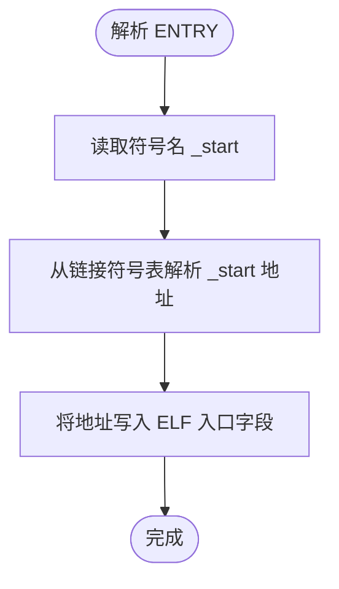
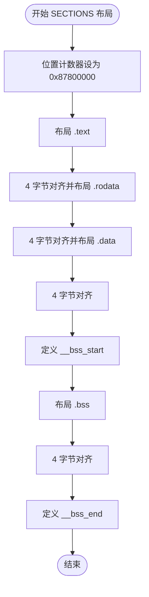
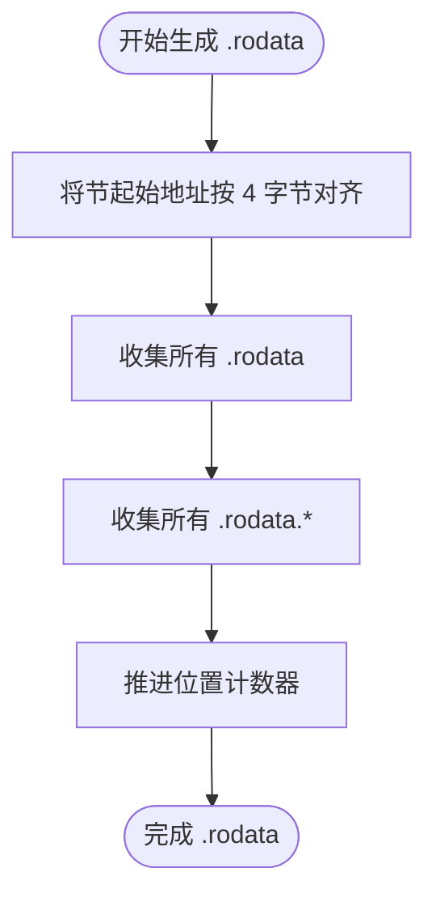
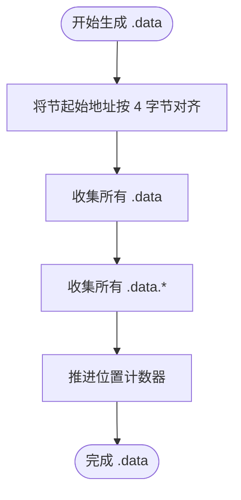
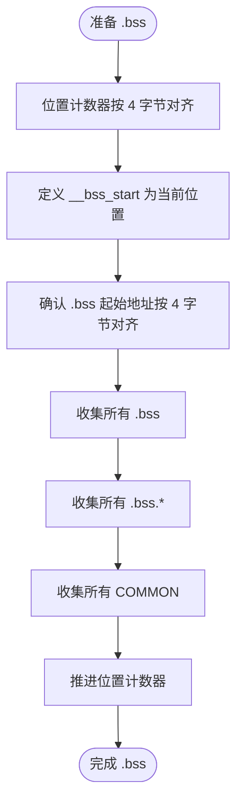
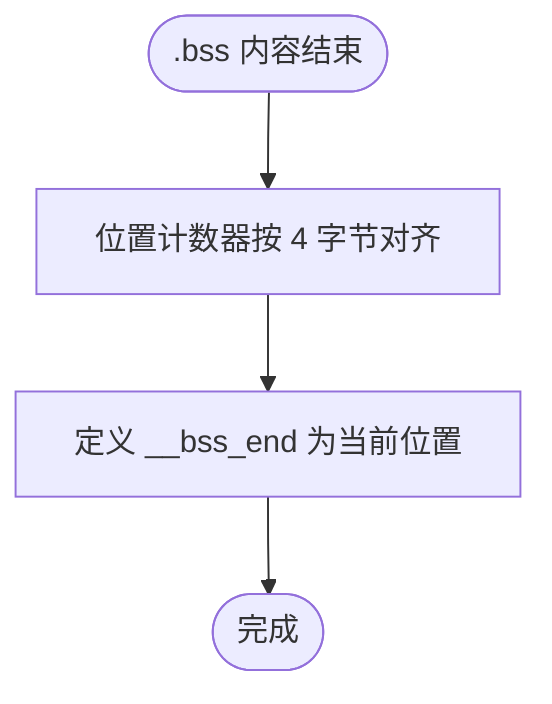
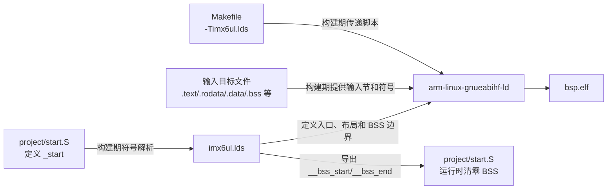
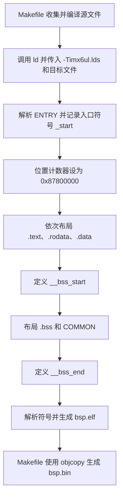
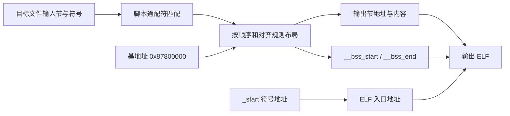

# `imx6ul.lds` 详细设计说明书

## 1. 文档范围与分析依据

本文档分析对象为工程根目录下的 GNU ld 链接脚本 `imx6ul.lds`，并结合以下实际文件确认其构建方式、入口符号和导出符号用途：

- `Makefile`
- `project/start.S`

本文档只描述当前工程源码能够确认的行为。目标板实际内存容量、程序加载器行为、未出现在当前工程中的输入节及工具链版本差异等无法确认的内容，统一标注为“需结合其他文件确认”。

## 2. 文件职责

`imx6ul.lds` 负责控制目标 ELF 文件的链接布局，主要职责如下：

1. 将 `_start` 指定为 ELF 入口符号。
2. 将链接位置计数器初始化为 `0x87800000`，使主要输出节从该地址开始布局。
3. 按 `.text`、`.rodata`、`.data`、`.bss` 的顺序组织输入目标文件中的对应节。
4. 将 `.rodata`、`.data`、`.bss` 及 BSS 边界按 4 字节对齐。
5. 导出 `__bss_start` 和 `__bss_end`，供启动代码确定 BSS 清零范围。
6. 使用 `KEEP(*(.text._start))` 保留启动入口输入节，防止其在启用链接垃圾回收时被删除。

该文件不负责：

- 编译源文件。
- 设置 CPU 模式或栈指针。
- 在运行时清零 BSS。
- 初始化 `.data`。
- 配置 i.MX6UL 外设或 DDR。
- 生成可烧写镜像头。

上述运行时动作中，设置 CPU 模式、栈指针、清零 BSS 和跳转 `main()` 由 `project/start.S` 实现。

## 3. 外部依赖

### 3.1 构建工具依赖

| 依赖 | 代码依据 | 用途 |
| --- | --- | --- |
| GNU ld 兼容链接器脚本语法 | 文件使用 `ENTRY`、`SECTIONS`、`KEEP`、`ALIGN` 等命令 | 解析脚本并生成目标 ELF |
| `arm-linux-gnueabihf-ld` | `Makefile` 中 `CROSS_COMPILE := arm-linux-gnueabihf-`、`LD := $(CROSS_COMPILE)ld` | 当前工程指定的链接器 |
| `Makefile` | `LDFLAGS := -Timx6ul.lds`；链接命令为 `$(LD) $(LDFLAGS) -o $(TARGET).elf $^` | 将本脚本传递给链接器 |

实际链接器版本及不同版本对孤儿节的具体放置规则需结合构建环境确认。

### 3.2 输入目标文件依赖

链接脚本通过通配符收集所有传入链接器的目标文件中的匹配输入节：

| 输入节模式 | 输出节 | 含义 |
| --- | --- | --- |
| `.text._start` | `.text` | 设计用于保留启动入口代码；当前构建产物中不存在该输入节 |
| `.text`、`.text.*` | `.text` | 普通代码及代码子节 |
| `.rodata`、`.rodata.*` | `.rodata` | 只读数据及只读数据子节 |
| `.data`、`.data.*` | `.data` | 已初始化可写数据及其子节 |
| `.bss`、`.bss.*` | `.bss` | 未初始化或零初始化数据及其子节 |
| `COMMON` | `.bss` | 通用符号 |

实际有哪些目标文件和输入节参与链接，由 `Makefile` 中的 `$(OBJS)` 及编译器输出共同决定。

### 3.3 符号依赖

| 符号 | 提供方 | 使用方 | 作用 |
| --- | --- | --- | --- |
| `_start` | `project/start.S` 中 `.global _start` 和 `_start:` | `imx6ul.lds` 中 `ENTRY(_start)` | 指定 ELF 入口地址 |
| `__bss_start` | `imx6ul.lds` | `project/start.S` | BSS 清零起始地址 |
| `__bss_end` | `imx6ul.lds` | `project/start.S` | BSS 清零结束地址 |

`project/start.S` 使用 `.extern __bss_start` 和 `.extern __bss_end` 声明两个链接器符号，并通过 `ldr` 取其地址。

## 4. 宏定义

本文件没有宏定义，也没有使用预处理器宏。

`ENTRY`、`SECTIONS`、`KEEP`、`ALIGN` 和 `COMMON` 均属于链接器脚本语法或输入节选择语法，不是 C/C++ 宏。

## 5. 全局变量与静态变量

本文件没有定义 C/C++ 全局变量或静态变量。

### 5.1 链接器全局符号

虽然不存在变量，但脚本定义了两个可被其他目标文件引用的链接器符号：

| 符号 | 定义位置 | 符号值 | 读写属性 | 当前工程用途 |
| --- | --- | --- | --- | --- |
| `__bss_start` | `.bss` 输出节之前 | 对齐后的当前位置 | 链接时赋值；运行时由启动代码读取 | 指示 BSS 清零起始地址 |
| `__bss_end` | `.bss` 输出节之后 | 对齐后的当前位置 | 链接时赋值；运行时由启动代码读取 | 指示 BSS 清零结束地址 |

这两个符号表示地址边界，不为自身分配存储空间，也不是可在运行时写入的变量。

### 5.2 位置计数器

`.` 是 GNU ld 的位置计数器，不是全局变量。脚本对它执行以下操作：

| 语句 | 作用 |
| --- | --- |
| `. = 0x87800000;` | 将后续输出节的起始布局地址设置为 `0x87800000` |
| `. = ALIGN(4);` | 将当前位置向上对齐到 4 字节边界 |

## 6. 结构体、联合体与枚举

本文件没有定义或使用 C/C++ 结构体、联合体或枚举。

## 7. 函数及静态函数

本文件是链接器脚本，不是 C/C++ 源文件，因此没有定义函数或静态函数，也没有函数入参、返回值、局部变量或函数级全局变量读写。

为满足逐项分析要求，后续章节按链接器命令和输出节逐项说明其输入、输出、符号读写、依赖关系和执行流程。这里的“处理流程”指链接器解析脚本并布局输出文件的过程，不是目标程序运行时函数调用。

## 8. 链接器命令详细设计

### 8.1 `ENTRY(_start)`

#### 功能

将 `_start` 指定为输出 ELF 的入口符号。链接器从符号表解析 `_start` 的最终地址，并将其写入 ELF 文件头入口地址字段。

#### 输入

| 输入 | 来源 | 说明 |
| --- | --- | --- |
| `_start` 符号 | `project/start.S` | 当前工程中由 `.global _start` 和 `_start:` 定义 |

#### 输出

输出 ELF 的入口地址。无 C/C++ 返回值。

#### 局部变量及全局变量读写

无局部变量或 C/C++ 全局变量读写。链接器读取 `_start` 的符号地址并写入 ELF 元数据。

#### 依赖关系

- 文件内：与 `.text` 输出节中的 `KEEP(*(.text._start))` 共同表达保留并使用启动入口的意图。
- 文件外：依赖 `project/start.S` 提供 `_start`。

#### 执行流程

1. 读取入口符号名称 `_start`。
2. 从链接输入和最终符号表中解析 `_start`。
3. 将解析后的地址设置为输出 ELF 的入口地址。
4. 若符号无法解析，链接行为和诊断信息需结合实际链接器确认。



### 8.2 `SECTIONS`

#### 功能

定义输出节布局，控制位置计数器，并定义 BSS 边界符号。

#### 输入

链接器接收到的全部输入目标文件及其输入节。实际目标文件列表由 `Makefile` 的 `$(OBJS)` 决定。

#### 输出

按脚本规则布局的输出节和符号表。

#### 局部变量及全局变量读写

无 C/C++ 变量读写。该命令更新链接器位置计数器 `.`，并定义 `__bss_start`、`__bss_end`。

#### 依赖关系

- 文件内：包含 `.text`、`.rodata`、`.data`、`.bss` 四个显式输出节定义。
- 文件外：依赖输入目标文件提供匹配节。

#### 执行流程



### 8.3 `.text` 输出节

#### 功能

收集启动代码、普通代码和代码子节。该节是从 `0x87800000` 开始布局的第一个显式输出节。

#### 输入

| 顺序 | 输入节选择器 | 说明 |
| --- | --- | --- |
| 1 | `KEEP(*(.text._start))` | 从所有输入文件收集 `.text._start`，并要求在启用节垃圾回收时保留 |
| 2 | `*(.text)` | 从所有输入文件收集精确名称为 `.text` 的节 |
| 3 | `*(.text.*)` | 从所有输入文件收集以 `.text.` 开头的子节 |

#### 输出

输出节 `.text`。其实际大小和结束地址由匹配输入节决定。

#### 符号及状态读写

读取匹配输入节；随着内容放置推进位置计数器 `.`。未定义额外链接器符号。

#### 依赖关系

- `ENTRY(_start)` 依赖 `_start` 的最终地址。
- 当前 `project/start.S` 没有显式声明 `.text._start`；构建产物 `obj/start.o` 的节表和符号表确认 `_start` 实际位于 `.text`。
- `KEEP` 只直接作用于 `.text._start`，不会直接保留其他 `.text` 或 `.text.*` 输入节。
- 当前链接命令未启用 `--gc-sections`，因此 `_start` 所在 `.text` 在当前构建中仍被保留。

#### 执行流程


### 8.4 `.rodata ALIGN(4)` 输出节

#### 功能

将输出节起始地址向上对齐到 4 字节边界，然后收集只读数据。

#### 输入

- `*(.rodata)`
- `*(.rodata.*)`

#### 输出

输出节 `.rodata`。

#### 符号及状态读写

对齐并推进位置计数器 `.`；不定义链接器符号。

#### 依赖关系

在 `.text` 之后布局。是否存在匹配输入节及实际内容需结合编译产物确认。

#### 执行流程



### 8.5 `.data ALIGN(4)` 输出节

#### 功能

将输出节起始地址向上对齐到 4 字节边界，然后收集已初始化可写数据。

#### 输入

- `*(.data)`
- `*(.data.*)`

#### 输出

输出节 `.data`。

#### 符号及状态读写

对齐并推进位置计数器 `.`；不定义链接器符号。

#### 依赖关系

在 `.rodata` 之后布局。脚本没有使用 `AT` 或 `AT>` 为 `.data` 指定独立加载地址，也没有导出 `.data` 复制边界；因此当前脚本表达的是 `.data` 直接位于其运行地址。实际加载器如何放置该内容需结合其他文件确认。

#### 执行流程



### 8.6 `__bss_start` 与 `.bss ALIGN(4)` 输出节

#### 功能

对齐 BSS 起始边界，定义 `__bss_start`，收集未初始化数据和通用符号。

#### 输入

- `*(.bss)`
- `*(.bss.*)`
- `*(COMMON)`

#### 输出

- 链接器符号 `__bss_start`
- 输出节 `.bss`

#### 符号及状态读写

1. `. = ALIGN(4)` 将当前位置向上对齐到 4 字节边界。
2. `__bss_start = .` 将对齐后的位置赋给链接器符号。
3. `.bss ALIGN(4)` 再次要求 `.bss` 起始地址按 4 字节对齐。
4. 收集内容并推进位置计数器。

由于定义 `__bss_start` 前已经执行 4 字节对齐，紧随其后的 `.bss ALIGN(4)` 不会在两者之间引入额外偏移。

#### 依赖关系

- 文件内：`__bss_end` 与其共同界定 BSS 范围。
- 文件外：`project/start.S` 读取 `__bss_start`，并从该地址开始按 4 字节写零。

#### 执行流程



### 8.7 `__bss_end`

#### 功能

将 `.bss` 之后的位置向上对齐到 4 字节边界，并定义 BSS 清零结束地址。

#### 输入

`.bss` 输出节结束后的当前位置。

#### 输出

链接器符号 `__bss_end`。

#### 符号及状态读写

更新位置计数器 `.`，然后将其值赋给 `__bss_end`。

#### 依赖关系

`project/start.S` 将 `__bss_end` 作为不包含在清零范围内的结束边界：启动代码在当前地址低于结束地址时写入 4 字节零值。

#### 执行流程



## 9. 文件级调用与依赖关系图

链接器脚本不存在运行时函数调用。以下图表示构建期依赖及运行时符号使用关系：



## 10. 整体链接流程



## 11. 数据流分析

### 11.1 构建期数据流



### 11.2 BSS 边界运行时数据流


可由当前代码确认：

- `__bss_start` 和 `__bss_end` 均为 4 字节对齐地址。
- 启动代码每次写入 4 字节，并在当前地址低于 `__bss_end` 时继续。
- 因此脚本定义的边界对齐方式与当前启动代码的清零步长一致。

## 12. 输出内存布局

脚本显式描述的顺序如下：

```text
低地址
0x87800000
  |
  +-- .text
  +-- 对齐填充（如需要）
  +-- .rodata（4 字节对齐）
  +-- 对齐填充（如需要）
  +-- .data（4 字节对齐）
  +-- 对齐填充（如需要）
  +-- __bss_start
  +-- .bss（4 字节对齐）
  +-- COMMON
  +-- 对齐填充（如需要）
  +-- __bss_end
高地址
```

该脚本没有 `MEMORY` 命令，因此没有在链接阶段声明或校验可用存储区域的起始地址、长度及读写执行权限。

## 13. 风险与改进建议

| 风险或限制 | 代码依据 | 影响 | 改进建议 |
| --- | --- | --- | --- |
| 未声明内存区域和容量 | 没有 `MEMORY` 命令 | 链接器不能依据脚本检查镜像是否越过目标内存边界 | 根据目标板实际内存映射增加 `MEMORY`，并将输出节绑定到对应区域；实际范围需结合其他文件确认 |
| 固定链接基地址缺少说明和校验 | `. = 0x87800000` | 地址与加载器或目标板内存布局不一致时，程序无法正确运行 | 在脚本或工程文档中说明地址来源，并结合加载器配置验证；地址来源需结合其他文件确认 |
| 启动入口保留规则未匹配当前实际输入节 | `KEEP(*(.text._start))`，但 `obj/start.o` 确认 `_start` 位于 `.text` | 当前未启用 `--gc-sections`，所以入口仍被保留；将来启用节垃圾回收时现有 `KEEP` 不能直接保留 `_start` 所在 `.text` | 在启动汇编中显式使用 `.text._start`，或按预期垃圾回收策略调整 `KEEP` |
| 未显式处理孤儿节 | 只列出四类主要输出节 | `.ARM.exidx`、`.ARM.attributes`、`.note.*` 等未匹配节由链接器按孤儿节规则处理，布局可能受工具链影响 | 根据最终 ELF 节表显式保留或丢弃所需节；具体策略需结合调试、异常展开和工具链需求确认 |
| 未定义栈和堆区域 | 脚本没有栈、堆符号或边界 | 链接阶段无法检查栈、堆与镜像区域是否冲突 | 若工程需要，可定义栈和堆边界并增加断言；实际内存规划需结合其他文件确认 |
| 未使用链接断言 | 没有 `ASSERT` | 入口缺失、镜像过大或边界异常主要依赖链接器默认诊断 | 对关键地址、镜像尺寸和边界关系增加 `ASSERT`；约束值需结合其他文件确认 |
| `.data` 无独立加载地址和复制符号 | `.data ALIGN(4)` 未使用 `AT`，启动代码也未复制 `.data` | 仅适用于加载器直接把 `.data` 内容放到运行地址的场景 | 若程序从非易失存储器搬运运行，应定义加载地址和复制边界并在启动代码复制；当前加载方式需结合其他文件确认 |
| BSS 边界符号未使用 `PROVIDE` 或 `PROVIDE_HIDDEN` | 直接定义 `__bss_start`、`__bss_end` | 符号可见性和与同名输入符号冲突的策略未显式约束 | 根据工程符号约定考虑使用 `PROVIDE`/`PROVIDE_HIDDEN`；是否需要修改需结合其他文件确认 |
| 缺少显式丢弃规则 | 没有 `/DISCARD/` | 不需要的元数据节可能进入 ELF，具体结果取决于输入和链接器规则 | 检查最终节表后仅丢弃确认无用的节，避免误删运行所需内容 |

## 14. 可确认项与待确认项

### 14.1 当前工程可确认

- `Makefile` 使用 `-Timx6ul.lds` 调用本脚本。
- 当前链接器命令直接使用 `arm-linux-gnueabihf-ld`。
- `_start` 由 `project/start.S` 定义，并被脚本指定为入口。
- 当前构建生成的 ELF32 ARM 可执行文件入口地址为 `0x87800000`。
- 当前构建产物 `obj/start.o` 中 `_start` 位于 `.text`，不是 `.text._start`。
- `__bss_start` 和 `__bss_end` 由脚本定义，并被 `project/start.S` 用于 BSS 清零。
- 当前构建没有实际 `.bss` 内容，`__bss_start` 和 `__bss_end` 均为 `0x87800120`。
- 当前最终 ELF 除 `.text` 外还包含由链接器按孤儿节规则放置的 `.ARM.attributes` 和 `.comment`；当前没有生成独立的 `.rodata`、`.data` 或 `.bss` 输出节。
- 输出节从 `0x87800000` 开始，显式布局顺序为 `.text`、`.rodata`、`.data`、`.bss`。
- 各数据节及 BSS 边界按 4 字节对齐。

### 14.2 需结合其他文件确认

- `0x87800000` 的硬件内存规划依据及可用容量。
- 程序由何种加载器加载到该地址，以及加载器是否正确放置 `.data`。
- 孤儿节 `.ARM.attributes` 和 `.comment` 是否需要保留。
- 是否存在工程外代码依赖本脚本导出的符号。
- 是否需要栈、堆、异常表、初始化数组或镜像头等额外链接布局。

## 15. 结论

`imx6ul.lds` 是一个面向当前裸机示例的最小链接脚本。它建立从 `0x87800000` 开始的连续代码与数据布局，指定 `_start` 为入口，并为启动汇编提供准确且按 4 字节对齐的 BSS 清零边界。当前脚本能够表达工程现有启动流程所需的核心信息，但没有内存容量校验、孤儿节显式策略、栈堆规划和加载地址规划；这些内容是否需要补充，需结合目标板内存映射、加载方式及最终 ELF 节表确认。
