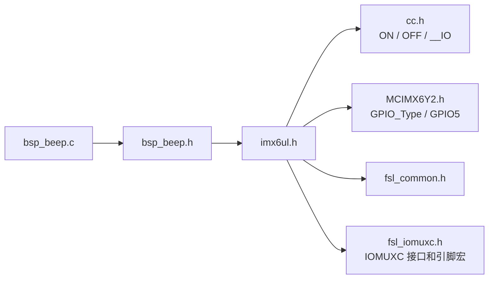
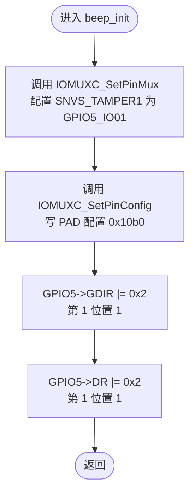
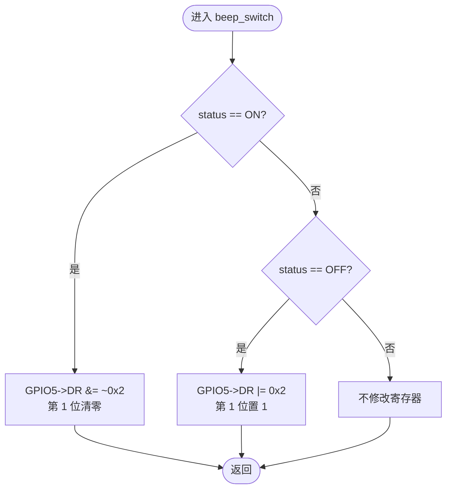
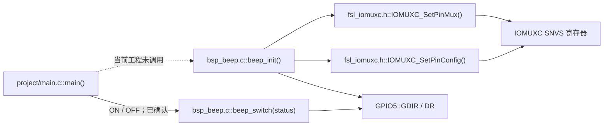
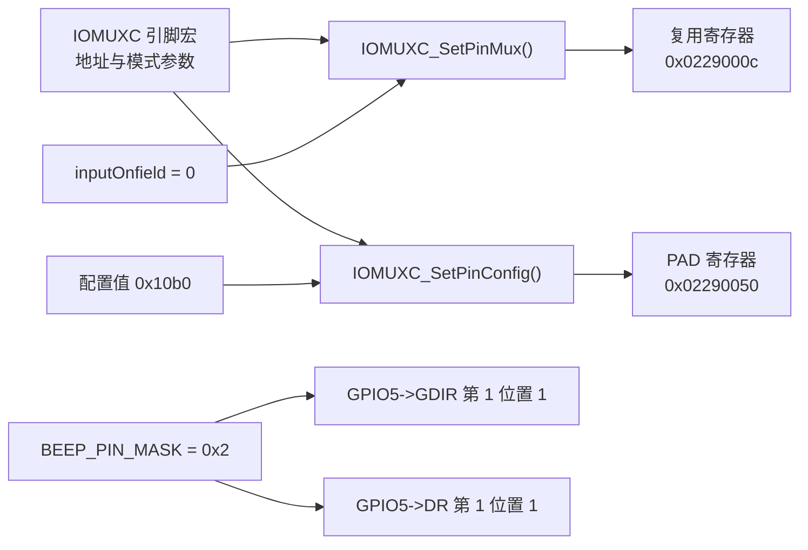
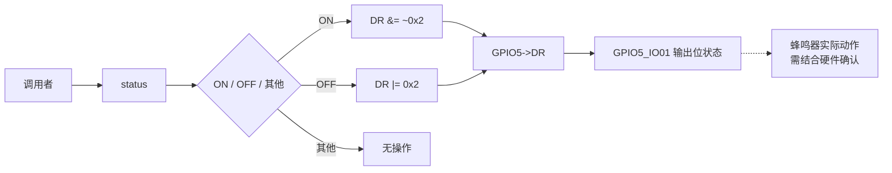

# `bsp_beep.c` 详细设计文档

## 1. 文档范围与分析依据

本文档基于以下实际代码进行静态分析：

- `bsp/beep/bsp_beep.c`
- `bsp/beep/bsp_beep.h`
- `imx6ul/imx6ul.h`
- `imx6ul/cc.h`
- `imx6ul/MCIMX6Y2.h`
- `imx6ul/fsl_iomuxc.h`
- `project/main.c`
- 项目根目录 `Makefile`

本文仅将上述文件能够确认的内容写为事实。蜂鸣器实际硬件连接、有效电平、寄存器字段的完整硬件语义、时钟与访问权限要求，需结合开发板原理图及芯片参考手册确认。

## 2. 文件概述

### 2.1 文件信息

| 项目 | 内容 |
| --- | --- |
| 文件名 | `bsp_beep.c` |
| 文件类型 | C 源文件 |
| 所属模块 | BSP 蜂鸣器驱动模块 |
| 直接包含文件 | `bsp_beep.h` |
| 对外接口 | `beep_init()`、`beep_switch()` |
| 文件内静态函数 | 无 |

### 2.2 文件职责

`bsp_beep.c` 负责固定蜂鸣器控制通道的初始化与状态切换：

- 将 `SNVS_TAMPER1` 引脚复用为 `GPIO5_IO01`。
- 将对应 PAD 配置寄存器写为 `0x10b0`。
- 将 `GPIO5` 的第 1 位配置为输出。
- 初始化结束时将 `GPIO5->DR` 第 1 位置 1。
- 当状态为 `ON` 时清零 `GPIO5->DR` 第 1 位。
- 当状态为 `OFF` 时置位 `GPIO5->DR` 第 1 位。
- 对 `ON`、`OFF` 之外的状态值不执行寄存器操作。

源文件注释声明蜂鸣器连接到 `GPIO5_IO01` 且低电平有效，代码按此约定实现。实际连接和蜂鸣器动作需结合硬件原理图确认。

### 2.3 功能边界

本文件不负责：

- 使能 GPIO5、IOMUXC 或 SNVS 域相关时钟。
- 调用 `beep_init()`；初始化时机由调用者决定。
- 读取或返回蜂鸣器当前状态。
- 生成指定频率、占空比或持续时间的波形。
- 验证寄存器写入结果。
- 对非法状态返回错误。
- 提供并发访问保护。

## 3. 外部依赖分析

### 3.1 直接与间接依赖

| 依赖项 | 类型 | 来源 | 用途 |
| --- | --- | --- | --- |
| `bsp_beep.h` | 直接包含 | `bsp/beep/bsp_beep.h` | 提供公开函数声明及间接依赖 |
| `imx6ul.h` | 间接包含 | `imx6ul/imx6ul.h` | 聚合公共类型和芯片头文件 |
| `cc.h` | 间接包含 | `imx6ul/cc.h` | 定义 `ON`、`OFF`、`uint32_t`、`__IO` |
| `MCIMX6Y2.h` | 间接包含 | `imx6ul/MCIMX6Y2.h` | 定义 `GPIO_Type`、`GPIO5` 和寄存器布局 |
| `fsl_iomuxc.h` | 间接包含 | `imx6ul/fsl_iomuxc.h` | 定义引脚功能宏与 IOMUX 配置函数 |
| `IOMUXC_SetPinMux()` | 文件外静态内联函数 | `fsl_iomuxc.h` | 写引脚复用寄存器；输入选择地址非零时还会写输入选择寄存器 |
| `IOMUXC_SetPinConfig()` | 文件外静态内联函数 | `fsl_iomuxc.h` | 配置寄存器地址非零时写 PAD 配置值 |
| `GPIO5` | 外部宏 | `MCIMX6Y2.h` | 提供基地址为 `0x020ac000` 的 `GPIO_Type *` |

### 3.2 依赖定义链



### 3.3 构建与调用依赖

项目根目录 `Makefile` 将 `bsp/beep` 加入头文件搜索目录和源文件目录，并通过通配符收集其中的 `.c` 文件，因此 `bsp_beep.c` 会参与当前工程构建。

当前工程内已确认：

- `project/main.c::main()` 在无限循环中交替调用 `beep_switch(ON)` 和 `beep_switch(OFF)`。
- 当前工程未检索到 `beep_init()` 的调用点。
- `main()` 在循环前调用了 `clk_enable()` 和 `led_init()`，但未调用 `beep_init()`。

其他构建目标或仓库外代码的调用情况需结合其他文件确认。

## 4. 宏定义分析

### 4.1 本文件定义的宏

| 宏名称 | 宏值 | 展开结果或用途 |
| --- | --- | --- |
| `BEEP_GPIO` | `GPIO5` | 固定选择 GPIO5 寄存器块 |
| `BEEP_PIN` | `1U` | 固定选择 GPIO5 的第 1 位 |
| `BEEP_PIN_MASK` | `(1U << BEEP_PIN)` | 位掩码，按当前定义计算为 `0x00000002U` |

### 4.2 使用的外部宏

| 宏名称 | 实际定义 | 来源 | 用途 |
| --- | --- | --- | --- |
| `ON` | `1` | `cc.h` | `beep_switch()` 的开启判定值 |
| `OFF` | `0` | `cc.h` | `beep_switch()` 的关闭判定值 |
| `GPIO5_BASE` | `(0x20AC000u)` | `MCIMX6Y2.h` | GPIO5 外设基地址 |
| `GPIO5` | `((GPIO_Type *)GPIO5_BASE)` | `MCIMX6Y2.h` | GPIO5 寄存器块指针 |
| `IOMUXC_SNVS_SNVS_TAMPER1_GPIO5_IO01` | 五项逗号分隔参数 | `fsl_iomuxc.h` | 向 IOMUXC 配置函数传递寄存器地址及模式参数 |

`IOMUXC_SNVS_SNVS_TAMPER1_GPIO5_IO01` 展开为：

```c
0x0229000CU, 0x5U, 0x00000000U, 0x0U, 0x02290050U
```

由此可确认：

- `IOMUXC_SetPinMux(..., 0)` 实际接收 6 个参数，向地址 `0x0229000c` 写入由复用模式 `0x5` 和输入使能值 `0` 生成的值。由于输入选择寄存器地址为 `0`，不会写输入选择寄存器。
- `IOMUXC_SetPinConfig(..., 0x10b0)` 实际接收 6 个参数，向地址 `0x02290050` 写入 `0x10b0`。

`0x10b0` 各字段的完整硬件意义需结合芯片参考手册确认；源文件注释给出了 HYS、上下拉、keeper、开漏、速度、驱动能力和压摆率的解释。

## 5. 全局变量与静态变量分析

`bsp_beep.c` 未定义 C 全局变量，也未定义文件级静态变量。

| 类别 | 名称 | 类型 | 说明 |
| --- | --- | --- | --- |
| 全局变量 | 无 | 无 | 本文件未定义 |
| 文件级静态变量 | 无 | 无 | 本文件未定义 |

函数会访问内存映射硬件寄存器。寄存器属于全局硬件状态，但不是 C 全局变量。

## 6. 结构体、联合体与枚举分析

### 6.1 本文件定义情况

`bsp_beep.c` 未定义结构体、联合体、枚举或 `typedef`，也未使用枚举。

### 6.2 使用的外部结构体 `GPIO_Type`

`GPIO_Type` 定义于 `MCIMX6Y2.h`。本文件直接访问的成员如下：

| 成员 | 类型 | 相对基地址偏移 | 芯片头文件说明 | 本文件访问方式 |
| --- | --- | ---: | --- | --- |
| `DR` | `__IO uint32_t` | `0x0` | GPIO data register | 读改写 |
| `GDIR` | `__IO uint32_t` | `0x4` | GPIO direction register | 读改写 |

`cc.h` 将 `__IO` 定义为 `volatile`，因此这些成员访问是易失内存访问。各位的完整硬件语义需结合芯片参考手册确认。

## 7. 函数总览

| 函数 | 可见性 | 入参 | 返回值 | 文件内调用 | 文件外调用 |
| --- | --- | --- | --- | --- | --- |
| `beep_init()` | 全局公开 | 无 | `void` | 无 | `IOMUXC_SetPinMux()`、`IOMUXC_SetPinConfig()` |
| `beep_switch()` | 全局公开 | `int status` | `void` | 无 | 无 |

本文件没有静态函数。

## 8. 函数详细设计：`beep_init`

### 8.1 函数原型与功能

```c
void beep_init(void);
```

该函数配置固定引脚 `SNVS_TAMPER1` 为 `GPIO5_IO01`，写入 PAD 配置，将 GPIO5 第 1 位设为输出，并将数据寄存器对应位置 1。依据源文件注释，该输出状态意图为默认关闭蜂鸣器；实际效果需结合原理图确认。

### 8.2 入参、返回值与局部变量

| 项目 | 内容 |
| --- | --- |
| 入参 | 无 |
| 返回值 | 无，不能反馈配置结果 |
| 局部变量 | 无 |

### 8.3 读写全局变量与硬件状态

| 对象 | 操作 | 值或掩码 | 说明 |
| --- | --- | --- | --- |
| C 全局变量 | 无 | 无 | 本文件未定义或访问 C 全局变量 |
| IOMUXC 复用寄存器 `0x0229000c` | 写 | 由模式 `0x5`、输入使能 `0` 生成 | 由 `IOMUXC_SetPinMux()` 完成 |
| IOMUXC PAD 配置寄存器 `0x02290050` | 写 | `0x10b0` | 由 `IOMUXC_SetPinConfig()` 完成 |
| `GPIO5->GDIR` | 读改写 | `GDIR |= 0x2` | 保留其他位，将第 1 位置 1 |
| `GPIO5->DR` | 读改写 | `DR |= 0x2` | 保留其他位，将第 1 位置 1 |

### 8.4 调用关系

#### 文件内调用

无。

#### 文件外调用

| 被调用函数 | 来源 | 实参 | 可确认行为 |
| --- | --- | --- | --- |
| `IOMUXC_SetPinMux()` | `fsl_iomuxc.h` | 引脚功能宏展开的 5 项参数，加 `0` | 写复用寄存器；本次不写输入选择寄存器 |
| `IOMUXC_SetPinConfig()` | `fsl_iomuxc.h` | 引脚功能宏展开的 5 项参数，加 `0x10b0` | 写 PAD 配置寄存器 |

#### 已确认的外部调用者

当前工程内未检索到 `beep_init()` 调用者。是否由启动代码或其他构建目标调用，需结合其他文件确认。

### 8.5 执行流程

1. 调用 `IOMUXC_SetPinMux()`，将目标引脚的复用模式参数设置为 `0x5`，输入使能参数设置为 `0`。
2. 调用 `IOMUXC_SetPinConfig()`，将对应 PAD 配置寄存器写为 `0x10b0`。
3. 读取 `GPIO5->GDIR`，将第 1 位置 1 后写回。
4. 读取 `GPIO5->DR`，将第 1 位置 1 后写回。
5. 返回调用者。

### 8.6 Mermaid 流程图



### 8.7 前置条件与后置状态

前置条件：

- 当前执行环境能够访问 IOMUXC SNVS 与 GPIO5 内存映射地址。
- 相关时钟和访问权限已准备完成，具体要求需结合芯片参考手册确认。
- 目标引脚未被其他模块配置为冲突功能，需结合其他文件确认。

后置状态：

- 软件已向两个 IOMUXC 寄存器各执行一次写操作。
- `GPIO5->GDIR` 第 1 位被置 1。
- `GPIO5->DR` 第 1 位被置 1。
- 按源文件注释约定，蜂鸣器应处于关闭状态；实际状态需结合硬件确认。

## 9. 函数详细设计：`beep_switch`

### 9.1 函数原型与功能

```c
void beep_switch(int status);
```

该函数根据 `status` 修改 `GPIO5->DR` 第 1 位：

- `status == ON`：清零第 1 位。
- `status == OFF`：置位第 1 位。
- 其他值：不修改寄存器。

依据源文件注释，清零对应开启蜂鸣器，置位对应关闭蜂鸣器；实际效果需结合硬件确认。

### 9.2 入参

| 参数 | 类型 | 有效值 | 行为 |
| --- | --- | --- | --- |
| `status` | `int` | `ON`，实际值为 `1` | 清零 `GPIO5->DR` 第 1 位 |
| `status` | `int` | `OFF`，实际值为 `0` | 置位 `GPIO5->DR` 第 1 位 |
| `status` | `int` | 其他整数 | 无操作，静默返回 |

### 9.3 返回值与局部变量

| 项目 | 内容 |
| --- | --- |
| 返回值 | 无，不能反馈非法状态或硬件操作结果 |
| 局部变量 | 无 |

### 9.4 读写全局变量与硬件状态

| 条件 | 对象 | 操作 | 结果 |
| --- | --- | --- | --- |
| `status == ON` | `GPIO5->DR` | `DR &= ~0x2` | 保留其他位，清零第 1 位 |
| `status == OFF` | `GPIO5->DR` | `DR |= 0x2` | 保留其他位，置位第 1 位 |
| 其他状态 | 无 | 无 | 不改变寄存器 |

本函数不访问 C 全局变量。

### 9.5 调用关系

#### 文件内调用

无。

#### 文件外调用

无。函数体只执行条件判断和 GPIO 寄存器读改写。

#### 已确认的外部调用者

| 调用者 | 来源 | 调用方式 |
| --- | --- | --- |
| `main()` | `project/main.c` | 无限循环中先调用 `beep_switch(ON)`，延时后调用 `beep_switch(OFF)` |

### 9.6 执行流程

1. 比较 `status` 与 `ON`。
2. 若相等，读取 `GPIO5->DR`，清零第 1 位后写回，然后返回。
3. 若不相等，比较 `status` 与 `OFF`。
4. 若相等，读取 `GPIO5->DR`，置位第 1 位后写回，然后返回。
5. 若两个条件均不满足，不执行寄存器操作，直接返回。

### 9.7 Mermaid 流程图



### 9.8 前置条件与后置状态

前置条件：

- `GPIO5_IO01` 已配置为预期 GPIO 输出。当前工程未调用 `beep_init()`，因此该条件在当前 `main()` 路径中不能由代码确认。
- GPIO5 可访问且不存在未协调的并发读改写。

后置状态：

- `ON` 时，`GPIO5->DR` 第 1 位为 0。
- `OFF` 时，`GPIO5->DR` 第 1 位为 1。
- 其他状态时，函数不改变 `GPIO5->DR`。

## 10. 文件级调用关系图



## 11. 数据流分析

### 11.1 初始化数据流



### 11.2 状态控制数据流



### 11.3 寄存器访问特征

| 访问 | 特征 | 影响 |
| --- | --- | --- |
| IOMUXC 寄存器写入 | 直接覆盖写 | 目标寄存器原值不保留 |
| `GPIO5->GDIR |= mask` | volatile 读改写 | 保留其他位，但可能与并发修改产生竞争 |
| `GPIO5->DR |= mask` | volatile 读改写 | 保留其他位，但可能与并发修改产生竞争 |
| `GPIO5->DR &= ~mask` | volatile 读改写 | 保留其他位，但可能与并发修改产生竞争 |

## 12. 风险与改进建议

| 风险或限制 | 代码依据 | 影响 | 改进建议 |
| --- | --- | --- | --- |
| 当前工程未调用 `beep_init()` | `project/main.c` 直接调用 `beep_switch()`，工程内无 `beep_init()` 调用点 | 引脚复用、方向和默认状态是否正确不能由当前代码保证 | 在首次 `beep_switch()` 前调用 `beep_init()`，并确认初始化顺序 |
| `beep_init()` 先设置输出方向，再设置关闭电平 | 先执行 `GDIR |= mask`，后执行 `DR |= mask` | 切换为输出到写入关闭电平之间是否产生瞬态需结合硬件确认 | 若芯片允许，考虑先准备数据寄存器再设置输出方向；需结合参考手册验证 |
| GPIO 寄存器采用读改写 | `|=` 与 `&=` 操作 | 与中断或其他上下文修改同一寄存器时可能丢失更新 | 明确寄存器所有权；必要时在临界区内操作，方案需结合系统并发模型确认 |
| 非法状态被静默忽略 | 仅判断 `ON` 和 `OFF`，返回类型为 `void` | 调用错误不可观测 | 使用明确状态类型，并返回错误码或断言；具体策略需结合项目规范确认 |
| 状态使用通用 `int` 和宏 | `beep_switch(int status)`，`ON/OFF` 为宏 | 类型约束弱，接口可接受任意整数 | 可定义蜂鸣器状态枚举；是否适合当前项目需结合接口规范确认 |
| 初始化和切换均无结果反馈 | 两个函数均返回 `void` | 无法报告访问或配置失败 | 若硬件和系统具备错误检测机制，可增加返回状态 |
| PAD 配置值为裸常量 | `IOMUXC_SetPinConfig(..., 0x10b0)` | 可读性依赖注释，修改时容易出错 | 使用芯片头文件字段宏组合配置值，并用参考手册核对 |
| 硬件绑定写死在源文件 | `GPIO5`、引脚 1、固定 IOMUX 宏 | 难以复用到其他板卡或通道 | 若项目存在多板卡需求，可将绑定集中到板级配置；需求需结合其他文件确认 |
| 头文件传递大量芯片依赖 | `bsp_beep.h` 包含 `imx6ul.h`，公开签名只使用内建类型 | 增加包含耦合和编译依赖 | 可评估将 `imx6ul.h` 移至源文件；需确认其他包含者是否依赖传递包含 |
| 包含保护宏使用保留形式 | `__BSP_BEEP_H` 以双下划线开头 | 可能与实现保留标识符冲突 | 改为项目命名空间形式，例如 `BSP_BEEP_H` |

## 13. 结论

`bsp_beep.c` 是一个固定绑定到 `GPIO5_IO01` 的低层蜂鸣器 GPIO 驱动实现。文件没有全局变量、静态变量、静态函数、结构体或枚举；核心副作用均为 IOMUXC 与 GPIO5 的内存映射寄存器访问。

实现逻辑明确区分 `ON`、`OFF` 和其他状态。当前工程的主要可确认风险是 `main()` 使用 `beep_switch()` 前未调用 `beep_init()`。蜂鸣器有效电平、PAD 配置适用性和寄存器操作时序的硬件效果需结合开发板原理图与芯片参考手册确认。
