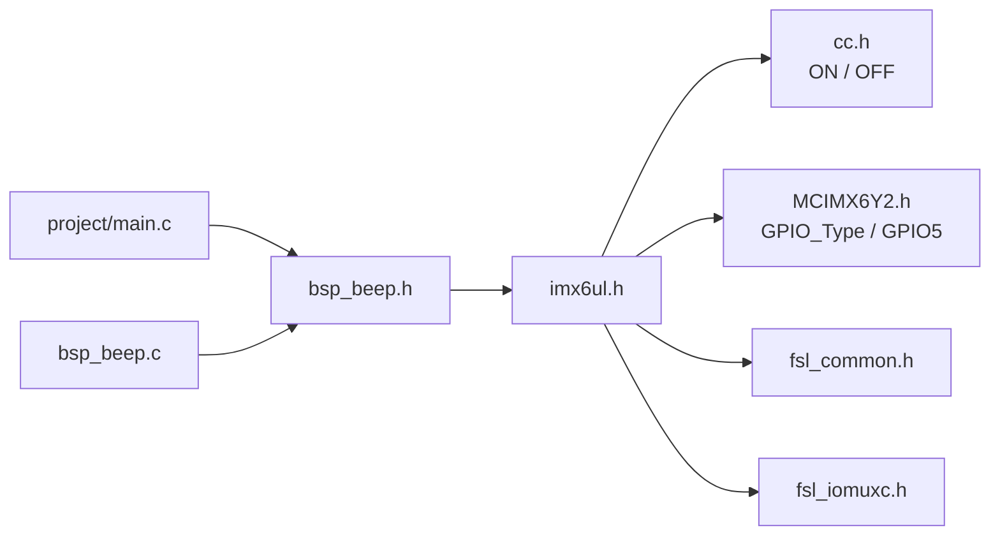
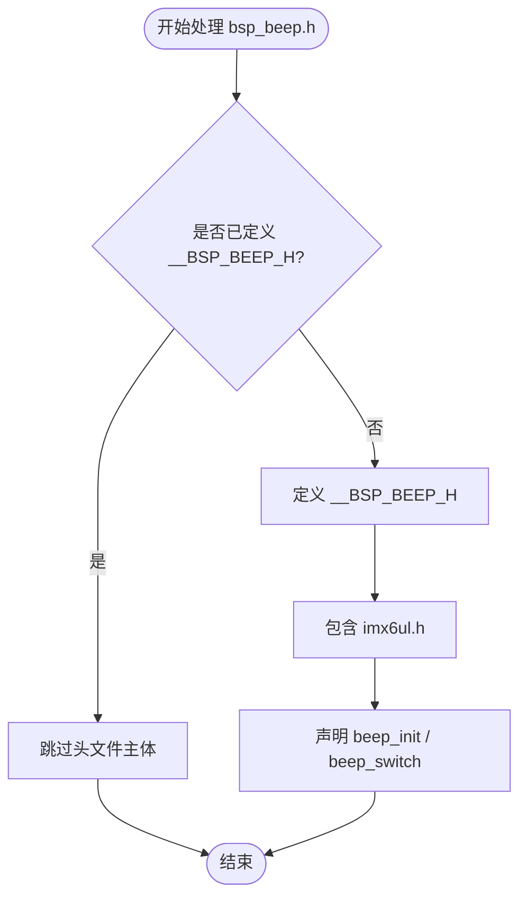
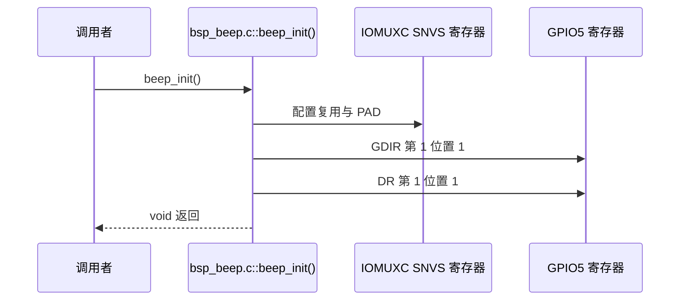
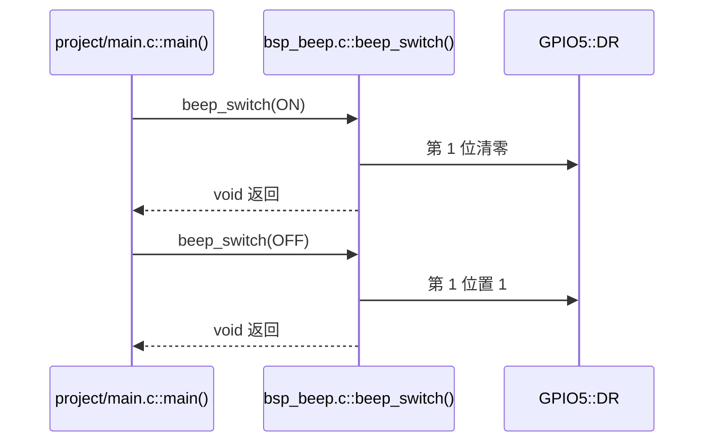
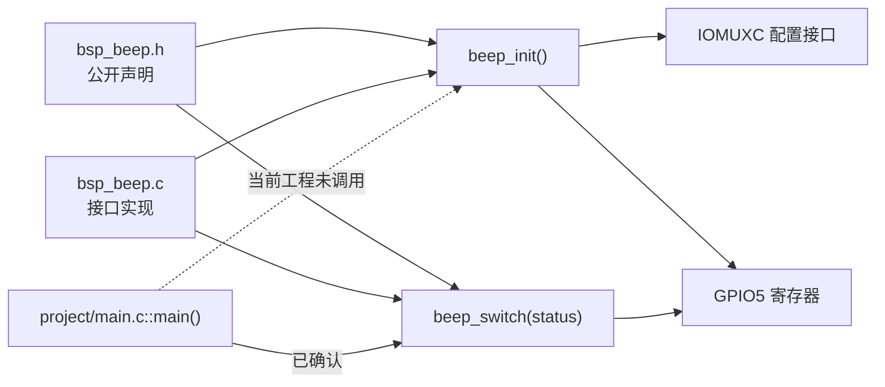
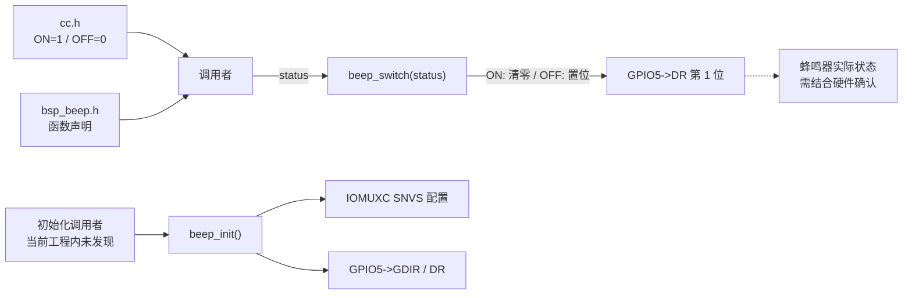

# `bsp_beep.h` 详细设计文档

## 1. 文档范围与分析依据

本文档基于 `bsp_beep.h` 的实际代码，并结合 `bsp_beep.c`、`imx6ul.h`、`cc.h`、`MCIMX6Y2.h`、`fsl_iomuxc.h`、`project/main.c` 和项目根目录 `Makefile` 进行静态分析。

无法从这些文件确认的硬件语义或系统约束均标注为“需结合其他文件确认”。

## 2. 文件概述

### 2.1 文件信息

| 项目 | 内容 |
| --- | --- |
| 文件名 | `bsp_beep.h` |
| 文件类型 | C 头文件 |
| 所属模块 | BSP 蜂鸣器驱动模块 |
| 直接包含文件 | `imx6ul.h` |
| 对外宏 | 无蜂鸣器专用公开宏；包含保护宏除外 |
| 对外函数声明 | `beep_init()`、`beep_switch()` |

### 2.2 文件职责

`bsp_beep.h` 是蜂鸣器驱动模块的公开接口头文件，职责如下：

- 使用包含保护宏避免同一翻译单元内重复处理头文件主体。
- 包含公共芯片头文件 `imx6ul.h`。
- 声明蜂鸣器初始化接口 `beep_init()`。
- 声明蜂鸣器状态切换接口 `beep_switch()`。

该文件不包含函数实现，不定义 GPIO 实例、引脚号、位掩码或有效电平。具体硬件绑定与操作逻辑位于 `bsp_beep.c`。

### 2.3 已确认的使用场景

| 使用者 | 使用方式 |
| --- | --- |
| `bsp_beep.c` | 包含头文件，并实现其中声明的两个函数 |
| `project/main.c` | 包含头文件，调用 `beep_switch(ON)` 与 `beep_switch(OFF)` |

当前工程的 `project/main.c` 未调用 `beep_init()`。其他构建目标或仓库外代码是否包含该头文件，需结合其他文件确认。

## 3. 外部依赖分析

### 3.1 直接依赖

| 依赖 | 类型 | 用途 |
| --- | --- | --- |
| `imx6ul.h` | 项目公共头文件 | 向包含者传递基础类型、状态宏、芯片寄存器和 IOMUXC 接口定义 |

### 3.2 `imx6ul.h` 的已确认包含项

| 头文件 | 与蜂鸣器模块相关的内容 |
| --- | --- |
| `cc.h` | 定义 `ON`、`OFF`、基础整数类型和寄存器访问限定宏 |
| `MCIMX6Y2.h` | 定义 `GPIO_Type`、`GPIO5` 及 GPIO 寄存器布局 |
| `fsl_common.h` | 由 `imx6ul.h` 包含；蜂鸣器公开函数签名未直接使用其类型 |
| `fsl_iomuxc.h` | 定义 IOMUXC 引脚宏及配置函数 |

### 3.3 依赖传递关系



`beep_init()` 和 `beep_switch()` 的公开签名只使用 C 内建类型。头文件是否必须直接包含 `imx6ul.h`，需结合项目对传递包含的依赖确认。

## 4. 宏定义分析

### 4.1 本文件定义的宏

| 宏名称 | 宏值 | 有效范围 | 功能 |
| --- | --- | --- | --- |
| `__BSP_BEEP_H` | 无显式值 | 预处理阶段 | 头文件包含保护标记 |

本头文件未定义蜂鸣器状态宏。接口使用的 `ON` 和 `OFF` 由间接包含的 `cc.h` 定义：

```c
#define ON  1
#define OFF 0
```

### 4.2 包含保护流程



包含保护宏以双下划线开头。此类名称可能属于 C 实现保留标识符范围，具体约束需结合项目采用的语言标准和编译器确认。

## 5. 全局变量与静态变量分析

`bsp_beep.h` 未声明或定义任何变量。

| 类别 | 名称 | 说明 |
| --- | --- | --- |
| 外部变量声明 | 无 | 没有 `extern` 变量 |
| 变量定义 | 无 | 头文件不定义存储对象 |
| 静态变量 | 无 | 头文件中没有静态变量 |

## 6. 结构体、联合体与枚举分析

### 6.1 本文件定义情况

`bsp_beep.h` 未定义结构体、联合体、枚举或 `typedef`，函数声明也不直接使用这些类型。

### 6.2 间接暴露的数据类型

由于本文件包含 `imx6ul.h`，所有包含者会间接获得 `GPIO_Type` 等芯片相关类型以及大量宏。`bsp_beep.c` 实际使用 `GPIO_Type` 对应的 `DR` 和 `GDIR` 成员，但这些类型不是蜂鸣器公开接口签名的一部分。

### 6.3 状态表示

蜂鸣器状态没有使用枚举。`beep_switch()` 使用 `int status`，并依赖 `cc.h` 中的 `ON` 和 `OFF` 宏。

从实现可确认：

- `ON` 清零目标 GPIO 数据位。
- `OFF` 置位目标 GPIO 数据位。
- 其他整数不执行操作。

## 7. 函数声明总览

| 函数 | 声明 | 可见性 | 实现位置 |
| --- | --- | --- | --- |
| `beep_init` | `void beep_init(void);` | 对包含者可见 | `bsp_beep.c` |
| `beep_switch` | `void beep_switch(int status);` | 对包含者可见 | `bsp_beep.c` |

本头文件没有静态函数、内联函数或函数宏。

## 8. 接口详细设计：`beep_init`

### 8.1 声明与功能

```c
void beep_init(void);
```

该声明向调用者公开蜂鸣器初始化接口。根据 `bsp_beep.c` 实现，函数配置 `SNVS_TAMPER1` 为 `GPIO5_IO01`，写入 PAD 配置，将 GPIO5 第 1 位设为输出，并将对应数据位置 1。

### 8.2 接口属性

| 项目 | 内容 |
| --- | --- |
| 入参 | 无 |
| 返回值 | 无 |
| 局部变量 | 头文件只有声明，不存在局部变量 |
| 读写全局变量 | 声明本身不读写；实现读改写 GPIO5 寄存器 |
| 文件内调用 | 无，头文件没有实现 |
| 实现中的文件外调用 | `IOMUXC_SetPinMux()`、`IOMUXC_SetPinConfig()` |

### 8.3 已确认的调用关系

| 关系 | 文件 | 说明 |
| --- | --- | --- |
| 实现者 | `bsp_beep.c` | 定义 `beep_init()` |
| 调用者 | 当前工程内未发现 | 是否由其他目标或启动代码调用需结合其他文件确认 |

### 8.4 接口执行流程图



完整逐步流程见 `bsp_beep.c.md`。

## 9. 接口详细设计：`beep_switch`

### 9.1 声明与功能

```c
void beep_switch(int status);
```

该声明向调用者公开蜂鸣器状态切换接口。当前实现根据 `status` 清零、置位或保持 GPIO5 第 1 数据位。

### 9.2 入参说明

| 参数 | 类型 | 当前实现约束 |
| --- | --- | --- |
| `status` | `int` | `ON` 清零数据位，`OFF` 置位数据位，其他值静默忽略 |

`ON` 和 `OFF` 的定义来自 `cc.h`，不是本头文件自身定义的接口专用状态。

### 9.3 返回值、局部变量与副作用

| 项目 | 内容 |
| --- | --- |
| 返回值 | 无，不反馈非法参数或硬件状态 |
| 局部变量 | 头文件只有声明，不存在局部变量 |
| C 全局变量 | 声明和实现均不访问 C 全局变量 |
| 实现副作用 | 条件满足时读改写 `GPIO5->DR` 第 1 位 |
| 文件内调用 | 无 |
| 文件外调用 | 无 |

### 9.4 已确认的调用关系

| 关系 | 文件 | 说明 |
| --- | --- | --- |
| 实现者 | `bsp_beep.c` | 定义 `beep_switch()` |
| 调用者 | `project/main.c` | 无限循环中交替传入 `ON` 与 `OFF` |

### 9.5 接口执行流程图



完整的非法状态分支和逐步流程见 `bsp_beep.c.md`。

## 10. 文件级调用关系图



## 11. 接口数据流分析



公开接口自身不传递硬件实例、引脚或配置参数。所有硬件绑定均隐藏在 `bsp_beep.c` 中。

## 12. 风险与改进建议

| 风险或限制 | 代码依据 | 改进建议 |
| --- | --- | --- |
| 当前工程使用切换接口但未调用初始化接口 | `main.c` 调用 `beep_switch()`，未调用 `beep_init()` | 在首次切换前调用 `beep_init()`，并确认初始化顺序 |
| 接口状态类型约束弱 | `beep_switch(int status)` | 可定义专用枚举或受约束类型；是否采用需结合项目规范确认 |
| 无错误反馈 | 两个接口均返回 `void` | 若项目需要错误处理，可返回状态码 |
| 初始化前置条件未在接口中表达 | 头文件仅有函数声明 | 在接口注释中明确时钟、访问权限和调用顺序；具体条件需结合参考手册确认 |
| 传递包含造成耦合 | 公开签名不需要 `imx6ul.h` 中的类型，但头文件直接包含它 | 可评估将芯片头文件移至实现文件，并确认包含者没有依赖传递定义 |
| `ON/OFF` 为通用宏 | 状态宏来自 `cc.h` | 可采用蜂鸣器专用状态定义，避免通用名称冲突 |
| 包含保护宏可能使用保留标识符 | `__BSP_BEEP_H` 以双下划线开头 | 改为项目命名空间形式，例如 `BSP_BEEP_H` |
| 公开接口缺少 C++ 链接保护 | 头文件未使用 `extern "C"` | 仅在项目需要被 C++ 包含时增加；需求需结合其他文件确认 |

## 13. 结论

`bsp_beep.h` 提供两个简单的 C 接口声明，不定义变量、结构体、枚举、静态函数或蜂鸣器专用状态宏。它通过包含 `imx6ul.h` 向调用者传递 `ON`、`OFF` 及芯片相关定义，但函数签名本身不依赖芯片专用类型。

当前工程已确认调用 `beep_switch()`，但没有调用 `beep_init()`。接口初始化顺序、硬件有效电平和实际蜂鸣器行为需结合实现文件、开发板原理图及芯片参考手册确认。
