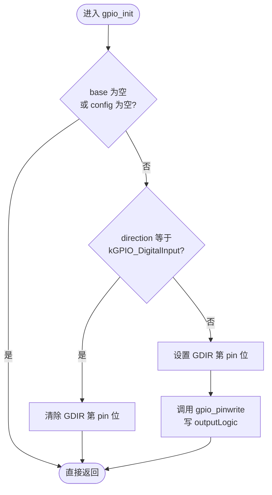
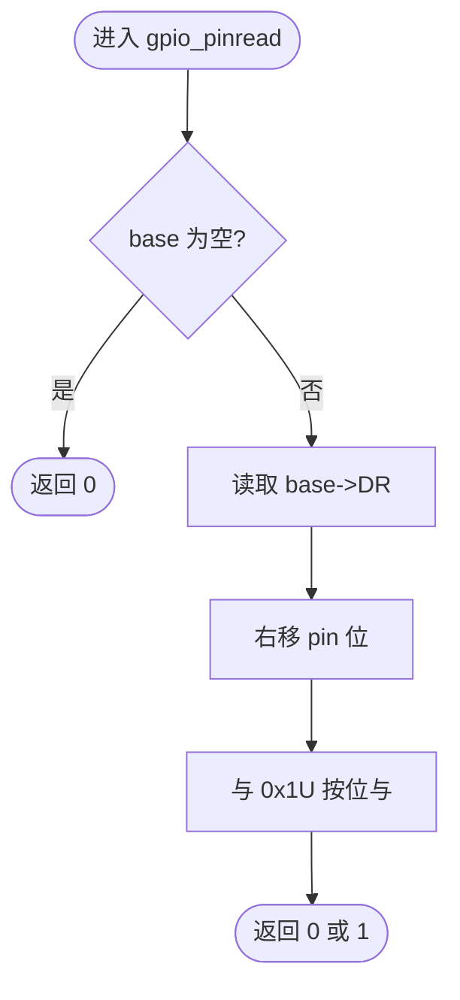
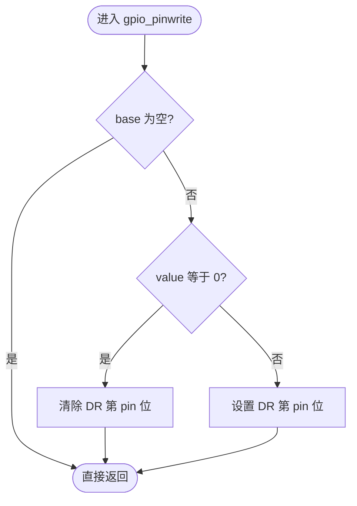
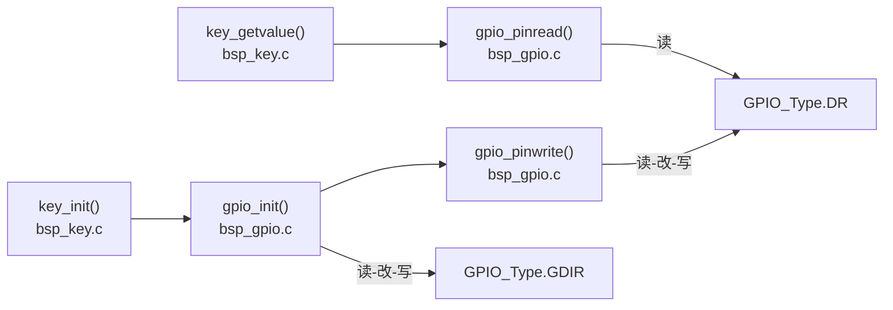
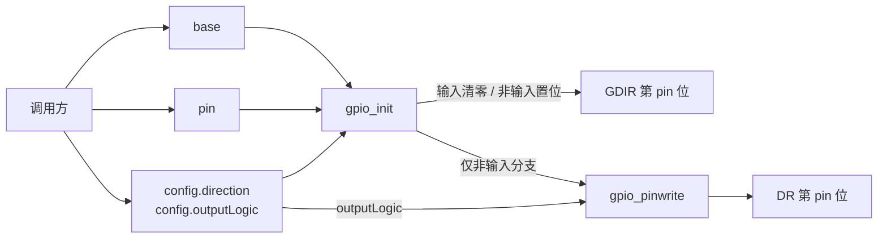
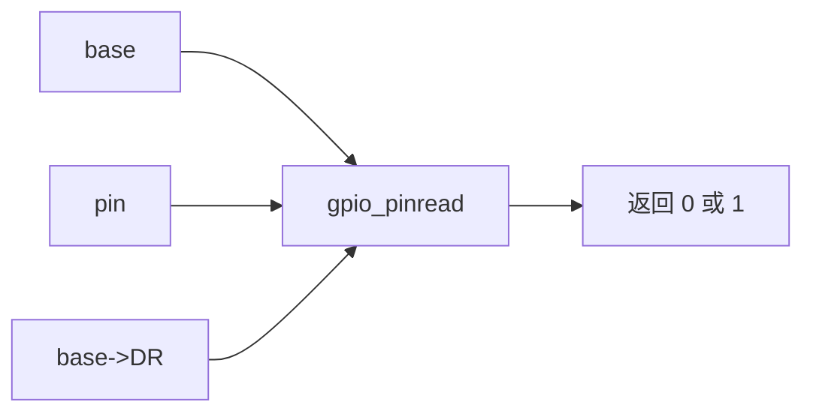
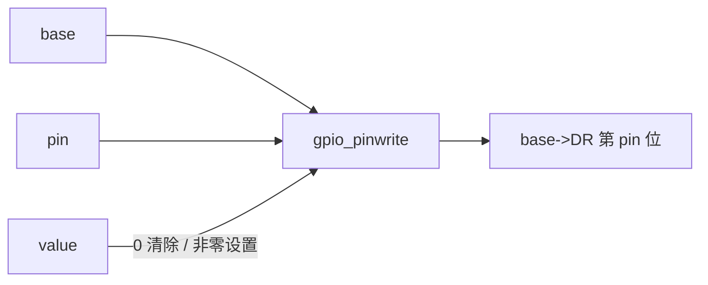

# `bsp_gpio.c` 详细设计文档

## 1. 文档范围与分析依据

本文档分析 `bsp_gpio.c` 的实际实现，并结合以下当前工程文件确认类型、寄存器定义和调用关系：

- `bsp_gpio.h`
- `../../imx6ul/imx6ul.h`
- `../../imx6ul/MCIMX6Y2.h`
- `../key/bsp_key.c`
- `../../Makefile`

本文档不推断芯片手册未在当前工程头文件中体现的寄存器硬件行为、调用方传参范围或并发使用方式。无法由当前代码确认的信息标注为“需结合其他文件确认”。

## 2. 文件职责

`bsp_gpio.c` 是 GPIO BSP 的通用实现文件，提供以下能力：

1. 根据配置将指定 GPIO 控制器内的引脚设为输入或输出。
2. 在配置为输出时写入默认输出逻辑值。
3. 从 GPIO 数据寄存器 `DR` 读取指定引脚位。
4. 通过读-改-写 GPIO 数据寄存器 `DR` 设置或清除指定引脚位。
5. 对空的 GPIO 控制器指针以及空的配置指针执行有限防御。

本文件不负责 GPIO 控制器时钟使能、IOMUXC 管脚复用、PAD 电气属性、GPIO 中断配置或引脚编号范围校验。

## 3. 外部依赖

### 3.1 头文件依赖

| 头文件 | 直接/间接 | 本文件使用内容 | 实际来源 |
| --- | --- | --- | --- |
| `bsp_gpio.h` | 直接 | `gpio_pin_config_t`、`kGPIO_DigitalInput`、三个公开函数声明 | GPIO BSP 公开头文件 |
| `imx6ul.h` | 间接 | `GPIO_Type`、`uint32_t`、`uint8_t` | 由 `bsp_gpio.h` 包含 |
| `MCIMX6Y2.h` | 间接 | `GPIO_Type` 结构体及 `DR`、`GDIR` 寄存器成员 | 由 `imx6ul.h` 包含 |

### 3.2 外部类型依赖

| 类型 | 定义位置 | 本文件用途 |
| --- | --- | --- |
| `GPIO_Type` | `MCIMX6Y2.h` | 通过 `base` 指针访问 GPIO 控制器寄存器 |
| `uint32_t` | 基础类型头，经 `imx6ul.h` 间接可见 | 表示控制器内引脚编号 |
| `gpio_pin_direction_t` | `bsp_gpio.h` | 表示输入或输出方向 |
| `gpio_pin_config_t` | `bsp_gpio.h` | 向 `gpio_init()` 传递方向和默认输出值 |

`GPIO_Type` 在当前芯片头文件中依次定义 `DR`、`GDIR`、`PSR`、`ICR1`、`ICR2`、`IMR`、`ISR` 和 `EDGE_SEL`。本文件只访问 `DR` 与 `GDIR`。

### 3.3 外部函数依赖

本文件不调用其他模块定义的函数。`gpio_init()` 调用同文件定义的 `gpio_pinwrite()`。

### 3.4 当前工程中的外部调用方

| 调用方 | 被调用接口 | 实际用途 |
| --- | --- | --- |
| `bsp_key.c:key_init()` | `gpio_init()` | 将 `GPIO1` 的 18 号引脚配置为输入 |
| `bsp_key.c:key_getvalue()` | `gpio_pinread()` | 读取 `GPIO1` 的 18 号引脚 |

当前工程源文件中未发现 `gpio_pinwrite()` 的直接文件外调用；它由 `gpio_init()` 在输出配置分支中调用。是否存在当前工程之外的调用方，需结合其他文件确认。

## 4. 宏定义

本文件未定义宏。

本文件通过 `bsp_gpio.h` 使用枚举值 `kGPIO_DigitalInput`，但该标识符是枚举项而非宏。

## 5. 全局变量、静态变量与常量

### 5.1 文件级全局变量

本文件未定义文件级全局变量。

### 5.2 文件级静态变量

本文件未定义文件级静态变量。

### 5.3 函数内静态变量

本文件未定义函数内静态变量。

### 5.4 硬件寄存器状态

虽然本文件没有 C 语言全局变量，但会通过调用方传入的 `GPIO_Type *base` 读写硬件寄存器：

| 寄存器成员 | 芯片头文件说明 | 本文件操作 |
| --- | --- | --- |
| `base->GDIR` | GPIO direction register | `gpio_init()` 读-改-写指定引脚位 |
| `base->DR` | GPIO data register | `gpio_pinread()` 读取；`gpio_pinwrite()` 读-改-写指定引脚位 |

## 6. 结构体、枚举与类型

本文件不定义结构体、联合体、枚举或类型别名，使用的 GPIO 配置类型均由 `bsp_gpio.h` 定义。

### 6.1 `gpio_pin_direction_t`

| 枚举项 | 实际值 | 在本文件中的处理 |
| --- | ---: | --- |
| `kGPIO_DigitalInput` | `0U` | `gpio_init()` 清除 `GDIR` 对应位 |
| `kGPIO_DigitalOutput` | `1U` | 因不等于输入值，`gpio_init()` 进入输出分支 |

代码只显式判断是否等于 `kGPIO_DigitalInput`。任何不等于该值的 `direction` 值都会按输出处理。

### 6.2 `gpio_pin_config_t`

| 成员 | 类型 | 读取位置 | 用途 |
| --- | --- | --- | --- |
| `direction` | `gpio_pin_direction_t` | `gpio_init()` | 选择输入或输出分支 |
| `outputLogic` | `uint8_t` | `gpio_init()` 输出分支 | 作为 `gpio_pinwrite()` 的 `value` 实参 |

输入分支不读取 `outputLogic`。

### 6.3 `GPIO_Type`

`GPIO_Type` 定义于 `MCIMX6Y2.h`。本文件使用以下成员：

| 成员 | 限定 | 偏移 | 本文件用途 |
| --- | --- | ---: | --- |
| `DR` | `__IO uint32_t` | `0x0` | 读取或修改引脚数据位 |
| `GDIR` | `__IO uint32_t` | `0x4` | 修改引脚方向位 |

`__IO` 的具体定义和访问语义需结合其他文件确认。

## 7. 函数总览

| 函数 | 链接属性 | 功能 | 文件内调用关系 |
| --- | --- | --- | --- |
| `gpio_init()` | 外部链接 | 配置引脚方向，并为输出引脚写默认逻辑值 | 调用 `gpio_pinwrite()` |
| `gpio_pinread()` | 外部链接 | 读取 `DR` 中指定引脚位并返回 `0` 或 `1` | 不调用其他函数 |
| `gpio_pinwrite()` | 外部链接 | 设置或清除 `DR` 中指定引脚位 | 不调用其他函数 |

本文件没有静态函数。

## 8. 函数详细设计

### 8.1 `gpio_init(GPIO_Type *base, uint32_t pin, const gpio_pin_config_t *config)`

#### 功能

根据 `config->direction` 配置指定 GPIO 引脚：

- 输入：清除 `base->GDIR` 的第 `pin` 位。
- 非输入：设置 `base->GDIR` 的第 `pin` 位，再调用 `gpio_pinwrite()` 写入 `config->outputLogic`。
- `base` 或 `config` 为空：不访问寄存器并直接返回。

#### 函数原型

```c
void gpio_init(GPIO_Type *base, uint32_t pin, const gpio_pin_config_t *config);
```

#### 入参与返回值

| 项目 | 说明 |
| --- | --- |
| `base` | GPIO 控制器寄存器结构体指针；为空时直接返回 |
| `pin` | 控制器内引脚位编号；函数未校验范围 |
| `config` | 只读 GPIO 配置指针；为空时直接返回 |
| 返回值 | 无；无法向调用方区分成功、空指针返回或无效引脚 |

#### 局部变量

本函数未定义局部变量。

#### 全局状态与硬件读写

| 对象 | 操作 | 条件 |
| --- | --- | --- |
| C 全局/静态变量 | 无 | 本函数不访问 |
| `base->GDIR` | 读-改-写，清除第 `pin` 位 | `config->direction == kGPIO_DigitalInput` |
| `base->GDIR` | 读-改-写，设置第 `pin` 位 | `config->direction != kGPIO_DigitalInput` |
| `base->DR` | 通过 `gpio_pinwrite()` 读-改-写 | 输出分支 |

#### 调用关系

| 类型 | 函数 | 条件/说明 |
| --- | --- | --- |
| 文件内调用 | `gpio_pinwrite(base, pin, config->outputLogic)` | 仅输出分支调用 |
| 文件外调用 | 无 | 本函数不调用其他模块函数 |

当前工程文件外调用方为 `bsp_key.c:key_init()`。

#### 执行流程

1. 判断 `base` 或 `config` 是否为空。
2. 任一为空则直接返回。
3. 判断 `config->direction` 是否等于 `kGPIO_DigitalInput`。
4. 输入分支使用 `base->GDIR &= ~(1U << pin)` 清除方向位。
5. 非输入分支使用 `base->GDIR |= (1U << pin)` 设置方向位。
6. 非输入分支调用 `gpio_pinwrite()` 写默认输出逻辑值。
7. 返回调用方。



### 8.2 `gpio_pinread(GPIO_Type *base, uint32_t pin)`

#### 功能

读取 `base->DR` 的第 `pin` 位，并将该位归一化为整数 `0` 或 `1`。当 `base` 为空时返回 `0`。

#### 函数原型

```c
int gpio_pinread(GPIO_Type *base, uint32_t pin);
```

#### 入参与返回值

| 项目 | 说明 |
| --- | --- |
| `base` | GPIO 控制器寄存器结构体指针；为空时返回 `0` |
| `pin` | 控制器内引脚位编号；函数未校验范围 |
| 返回值 | `0`：`base` 为空或读取位为低；`1`：读取位为高 |

空指针与实际低电平都返回 `0`，调用方无法区分两种情况。

#### 局部变量

本函数未定义局部变量。

#### 全局状态与硬件读写

| 对象 | 操作 | 说明 |
| --- | --- | --- |
| C 全局/静态变量 | 无 | 本函数不访问 |
| `base->DR` | 读 | 非空时读取整个 32 位寄存器，再右移并屏蔽最低位 |

#### 调用关系

本函数不调用文件内或文件外函数。当前工程文件外调用方为 `bsp_key.c:key_getvalue()`。

#### 执行流程

1. 判断 `base` 是否为空。
2. 若为空，返回 `0`。
3. 读取 `base->DR`。
4. 将读取值右移 `pin` 位。
5. 与 `0x1U` 按位与，保留最低位。
6. 以 `int` 返回结果。



### 8.3 `gpio_pinwrite(GPIO_Type *base, uint32_t pin, int value)`

#### 功能

通过读-改-写 `base->DR` 设置指定引脚位：

- `value == 0`：清除第 `pin` 位。
- `value != 0`：设置第 `pin` 位。
- `base == NULL`：不访问寄存器并直接返回。

#### 函数原型

```c
void gpio_pinwrite(GPIO_Type *base, uint32_t pin, int value);
```

#### 入参与返回值

| 项目 | 说明 |
| --- | --- |
| `base` | GPIO 控制器寄存器结构体指针；为空时直接返回 |
| `pin` | 控制器内引脚位编号；函数未校验范围 |
| `value` | `0` 表示清除；任意非零值表示设置 |
| 返回值 | 无；无法向调用方区分成功、空指针返回或无效引脚 |

#### 局部变量

本函数未定义局部变量。

#### 全局状态与硬件读写

| 对象 | 操作 | 条件 |
| --- | --- | --- |
| C 全局/静态变量 | 无 | 本函数不访问 |
| `base->DR` | 读-改-写，清除第 `pin` 位 | `value == 0` |
| `base->DR` | 读-改-写，设置第 `pin` 位 | `value != 0` |

#### 调用关系

本函数不调用文件内或文件外函数。文件内调用方为 `gpio_init()`；当前工程未发现文件外直接调用方。

#### 执行流程

1. 判断 `base` 是否为空。
2. 若为空，直接返回。
3. 判断 `value` 是否等于 `0`。
4. 等于 `0` 时，清除 `base->DR` 第 `pin` 位。
5. 非零时，设置 `base->DR` 第 `pin` 位。
6. 返回调用方。



## 9. 文件级调用关系图



图中调用方范围以当前工程源文件为准。是否存在工程外调用方，需结合其他文件确认。

## 10. 数据流分析

### 10.1 初始化数据流



`direction` 决定 `GDIR` 位和是否写默认输出值；`outputLogic` 只在非输入分支影响 `DR`。

### 10.2 读取数据流



当 `base` 为空时，硬件数据不参与数据流，函数直接产生返回值 `0`。

### 10.3 写入数据流



## 11. 风险与改进建议

| 风险/限制 | 代码依据 | 可能影响 | 改进建议 |
| --- | --- | --- | --- |
| 未校验 `pin` 范围 | 三个函数均直接执行 `1U << pin` 或 `base->DR >> pin` | 当 `pin >= 32` 时，移位行为不受当前代码保护，结果不可依赖 | 明确限定 `pin < 32U`，并在函数入口校验或断言 |
| 输入读取使用 `DR` 而非 `PSR` | `gpio_pinread()` 返回 `(base->DR >> pin) & 0x1U`；芯片头文件另定义 `PSR` 为 pad status register | 对输入引脚读取到的是数据寄存器还是实际 PAD 电平，需结合芯片手册确认 | 根据芯片手册确认输入读取寄存器；若应读取 PAD 状态，改用 `PSR` |
| 输出方向先于默认电平写入 | `gpio_init()` 先设置 `GDIR` 位，再调用 `gpio_pinwrite()` | 切换为输出后到默认值写入前，可能短暂输出 `DR` 原有值；实际硬件表现需结合芯片手册确认 | 若硬件允许，先写输出锁存值再切换方向 |
| 方向枚举值缺少严格校验 | 仅判断 `direction == kGPIO_DigitalInput`，其余值全部按输出处理 | 非法或未初始化方向值可能将引脚配置为输出 | 显式处理两个合法枚举项，并为非法值返回错误 |
| 空指针失败不可观察 | `gpio_init()`、`gpio_pinwrite()` 直接返回；`gpio_pinread()` 返回 `0` | 调用方无法区分错误与成功，读取时无法区分空指针和低电平 | 使用状态码返回，或通过断言约束必传参数 |
| `DR` 与 `GDIR` 使用读-改-写 | `&=`、`|=` 操作会读取并重写整个寄存器 | 中断或其他执行上下文同时修改同一寄存器时可能丢失更新；当前工程是否存在并发访问需结合其他文件确认 | 在存在并发时增加临界区，或使用芯片提供的原子置位/清零机制；可用机制需结合芯片手册确认 |
| 未负责外设前置初始化 | 本文件只访问 `DR/GDIR`，不使能时钟、不配置 IOMUXC/PAD | 调用顺序错误时接口可能不能按预期工作 | 在接口注释中明确调用前置条件，或由更高层初始化接口统一管理 |
| 配置指针只在运行时判空 | 接口允许传入任意地址，且仅检查是否为 `NULL` | 无法确认指针有效性，错误指针仍会被解引用 | 保持调用方契约，并通过静态分析、断言或错误返回增强约束 |

## 12. 结论

`bsp_gpio.c` 以三个公开函数封装了 GPIO 方向配置和单引脚数据位读写。实现没有软件全局状态，调用路径简单，并对空指针进行了有限处理。主要需要关注的实际代码风险是引脚编号未校验、非法方向值被视为输出、寄存器读-改-写的并发影响，以及输入读取 `DR` 是否符合目标芯片要求；最后一项需结合芯片手册或其他文件确认。
