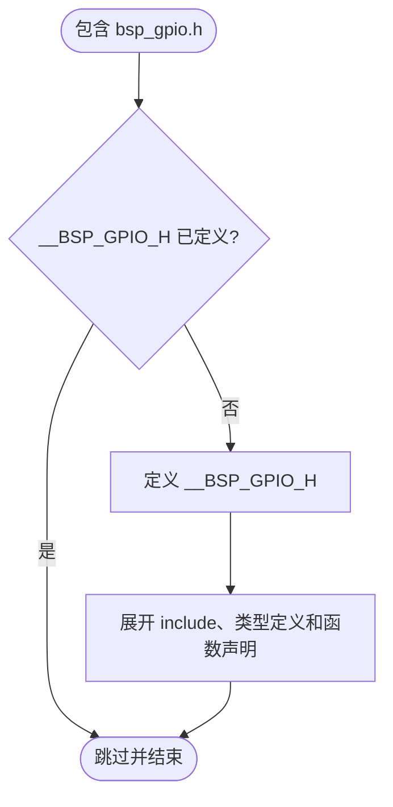
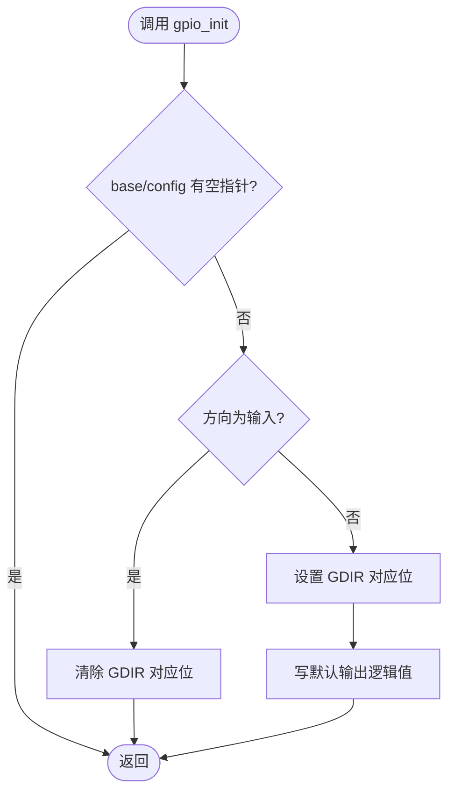
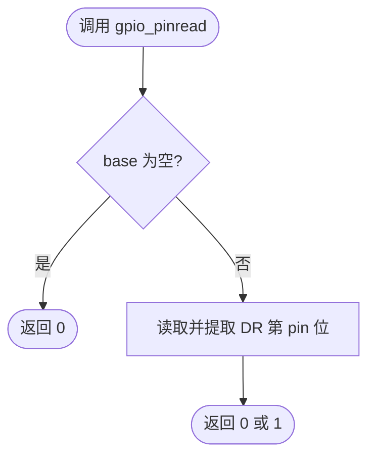
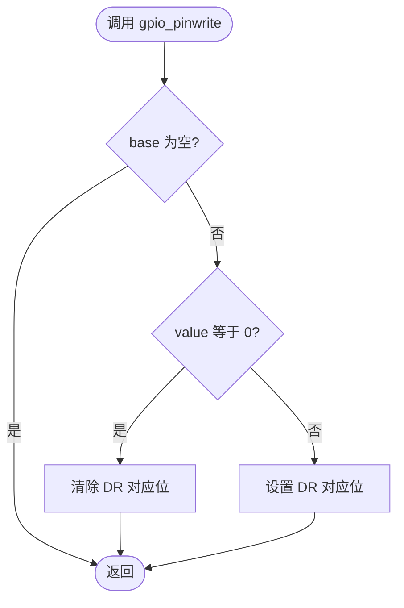
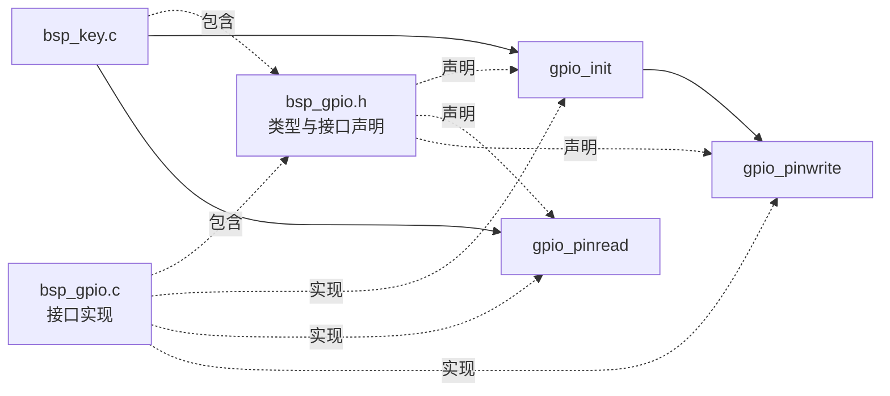
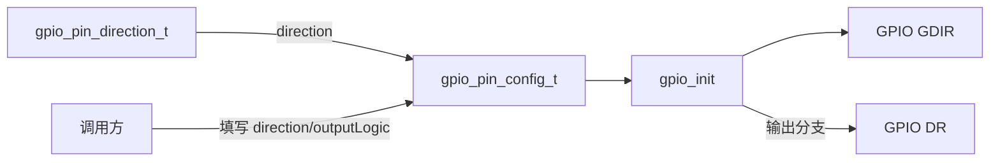
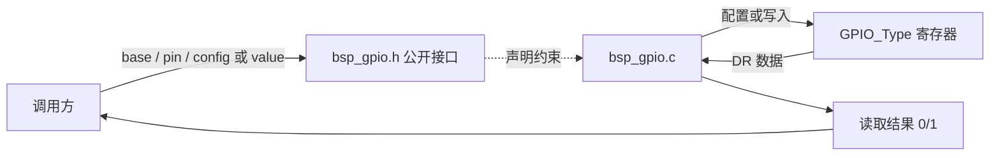

# `bsp_gpio.h` 详细设计文档

## 1. 文档范围与分析依据

本文档分析 `bsp_gpio.h` 的实际接口定义，并结合以下当前工程文件确认实现、类型来源和调用关系：

- `bsp_gpio.c`
- `../../imx6ul/imx6ul.h`
- `../../imx6ul/MCIMX6Y2.h`
- `../key/bsp_key.c`
- `../../Makefile`

本文档只描述当前代码能够确认的内容。未在当前工程中体现的调用方、硬件约束或扩展目的标注为“需结合其他文件确认”。

## 2. 文件职责

`bsp_gpio.h` 是 GPIO BSP 的公开接口头文件，职责如下：

1. 通过头文件保护宏防止重复包含。
2. 包含 i.MX6UL 公共头文件，使 `GPIO_Type`、`uint32_t` 和 `uint8_t` 等类型可见。
3. 定义 GPIO 引脚方向枚举 `gpio_pin_direction_t`。
4. 定义 GPIO 引脚配置结构体 `gpio_pin_config_t`。
5. 声明 GPIO 初始化、单引脚读取和单引脚写入接口。

该头文件不实现寄存器访问；实现位于 `bsp_gpio.c`。

## 3. 外部依赖

### 3.1 直接包含依赖

| 依赖 | 用途 | 进一步依赖 |
| --- | --- | --- |
| `imx6ul.h` | 提供 `GPIO_Type`、`uint32_t`、`uint8_t` 等公开接口所需类型 | 当前文件继续包含 `cc.h`、`MCIMX6Y2.h`、`fsl_common.h`、`fsl_iomuxc.h` |

`GPIO_Type` 实际定义于 `MCIMX6Y2.h`。`uint32_t`、`uint8_t` 的最终定义来源需结合其他文件确认。

### 3.2 实现方与当前调用方

| 文件 | 关系 | 使用内容 |
| --- | --- | --- |
| `bsp_gpio.c` | 接口实现方 | 实现三个公开函数，使用枚举和配置结构体 |
| `bsp_key.c` | 当前调用方 | 使用 `gpio_pin_config_t`、`kGPIO_DigitalInput`、`gpio_init()`、`gpio_pinread()` |

当前工程的 `Makefile` 将 `bsp/gpio` 加入头文件搜索目录和源文件目录。是否存在当前工程之外的调用方，需结合其他文件确认。

## 4. 宏定义

### 4.1 头文件保护宏

| 宏 | 定义值 | 作用 |
| --- | --- | --- |
| `__BSP_GPIO_H` | 空 | 防止同一预处理单元重复展开本头文件 |

处理流程：

1. 若 `__BSP_GPIO_H` 未定义，则定义该宏并展开头文件主体。
2. 若已定义，则跳过头文件主体。



`__BSP_GPIO_H` 以双下划线开头，属于 C 实现保留标识符形式，存在命名冲突风险。

## 5. 全局变量与静态变量

本头文件未声明或定义全局变量、静态变量。

对应实现文件 `bsp_gpio.c` 也未定义文件级全局变量、文件级静态变量或函数内静态变量。

## 6. 结构体、联合体与枚举

本头文件未定义联合体。

### 6.1 `gpio_pin_direction_t`

#### 定义

```c
typedef enum {
	kGPIO_DigitalInput = 0U,
	kGPIO_DigitalOutput = 1U,
} gpio_pin_direction_t;
```

#### 功能

表示 GPIO 引脚的数字输入或数字输出方向，并作为 `gpio_pin_config_t.direction` 的类型。

#### 枚举项

| 枚举项 | 实际值 | 当前实现行为 |
| --- | ---: | --- |
| `kGPIO_DigitalInput` | `0U` | `gpio_init()` 清除 `GDIR` 对应位 |
| `kGPIO_DigitalOutput` | `1U` | `gpio_init()` 设置 `GDIR` 对应位并写默认输出值 |

当前实现只显式判断 `kGPIO_DigitalInput`；任何其他枚举底层值也会进入输出分支。

### 6.2 `gpio_pin_config_t`

#### 定义

```c
typedef struct {
	gpio_pin_direction_t direction;
	uint8_t outputLogic;
} gpio_pin_config_t;
```

#### 功能

封装 `gpio_init()` 所需的引脚方向和默认输出逻辑值。

#### 成员

| 成员 | 类型 | 用途 | 当前实现读取条件 |
| --- | --- | --- | --- |
| `direction` | `gpio_pin_direction_t` | 选择输入或输出配置 | `gpio_init()` 在参数非空后始终读取 |
| `outputLogic` | `uint8_t` | 指定输出引脚默认逻辑值；`0` 为低，非零为高 | 仅非输入分支读取 |

结构体布局、大小和对齐由编译器 ABI 决定，当前头文件未增加打包或对齐属性。

### 6.3 使用的外部类型 `GPIO_Type`

`GPIO_Type` 定义于 `MCIMX6Y2.h`，表示 GPIO 控制器寄存器块。公开函数通过 `GPIO_Type *base` 接收目标控制器。当前实现访问其中的 `DR` 和 `GDIR` 成员。

## 7. 函数及静态函数

本头文件只声明公开函数，不定义函数或静态函数。具体局部变量、寄存器读写和分支流程由 `bsp_gpio.c` 实现。

### 7.1 `gpio_init()`

#### 声明

```c
void gpio_init(GPIO_Type *base, uint32_t pin, const gpio_pin_config_t *config);
```

#### 接口说明

| 项目 | 说明 |
| --- | --- |
| 功能 | 配置指定 GPIO 引脚方向；输出分支同时写默认输出逻辑值 |
| `base` | GPIO 控制器指针；当前实现为空时直接返回 |
| `pin` | 控制器内引脚编号；当前实现未校验范围 |
| `config` | 只读配置指针；当前实现为空时直接返回 |
| 返回值 | 无 |
| 局部变量 | 当前实现无 |
| 读写全局/静态变量 | 当前实现无 |
| 寄存器访问 | 读-改-写 `GDIR`；输出分支通过 `gpio_pinwrite()` 读-改-写 `DR` |
| 文件内调用 | 当前实现调用 `gpio_pinwrite()` |
| 文件外调用 | 当前实现无 |

#### 当前实现流程



### 7.2 `gpio_pinread()`

#### 声明

```c
int gpio_pinread(GPIO_Type *base, uint32_t pin);
```

#### 接口说明

| 项目 | 说明 |
| --- | --- |
| 功能 | 读取 `base->DR` 中指定引脚位 |
| `base` | GPIO 控制器指针；当前实现为空时返回 `0` |
| `pin` | 控制器内引脚编号；当前实现未校验范围 |
| 返回值 | `0` 表示读取位为低或 `base` 为空；`1` 表示读取位为高 |
| 局部变量 | 当前实现无 |
| 读写全局/静态变量 | 当前实现无 |
| 寄存器访问 | 读取 `DR` |
| 文件内调用 | 无 |
| 文件外调用 | 无 |

#### 当前实现流程



### 7.3 `gpio_pinwrite()`

#### 声明

```c
void gpio_pinwrite(GPIO_Type *base, uint32_t pin, int value);
```

#### 接口说明

| 项目 | 说明 |
| --- | --- |
| 功能 | 根据 `value` 设置或清除 `base->DR` 中指定引脚位 |
| `base` | GPIO 控制器指针；当前实现为空时直接返回 |
| `pin` | 控制器内引脚编号；当前实现未校验范围 |
| `value` | `0` 清除对应位；非零设置对应位 |
| 返回值 | 无 |
| 局部变量 | 当前实现无 |
| 读写全局/静态变量 | 当前实现无 |
| 寄存器访问 | 读-改-写 `DR` |
| 文件内调用 | 无 |
| 文件外调用 | 无 |

#### 当前实现流程



## 8. 文件级调用关系

头文件本身不产生运行时调用。下图同时表示编译期接口关系和当前工程中的运行时调用关系。



虚线表示编译期包含、声明或实现关系，实线表示当前工程中的运行时调用。

## 9. 数据流分析

### 9.1 配置类型数据流



### 9.2 公开接口数据流



## 10. 风险与改进建议

| 风险/限制 | 代码依据 | 可能影响 | 改进建议 |
| --- | --- | --- | --- |
| 保护宏使用保留标识符 | `__BSP_GPIO_H` 以双下划线开头 | 严格 C 环境下可能与实现保留名称冲突 | 改为项目唯一且不使用保留形式的名称，例如 `BSP_GPIO_H` |
| 公开接口未声明有效引脚范围 | `pin` 为任意 `uint32_t`，声明旁无约束 | 调用方可能传入大于寄存器位宽的编号 | 在接口注释中明确 `pin < 32U`，实现中增加校验 |
| 错误不可通过接口返回 | 初始化和写入函数返回 `void`；读取以 `0` 表示空指针 | 调用方无法可靠识别无效参数 | 引入状态码，或使用断言并明确参数前置条件 |
| 方向类型与实现校验不完全匹配 | 枚举只有两个值，但实现将所有非输入值按输出处理 | 非法枚举值可能触发输出配置 | 实现中显式匹配两个枚举值并拒绝其他值 |
| 头文件依赖范围较大 | 直接包含聚合头 `imx6ul.h` | 向所有调用方暴露额外 SDK 和芯片定义，增加编译耦合 | 若类型定义允许，改为包含最小必要头文件；具体可行性需结合其他文件确认 |
| 接口未说明前置硬件配置 | 头文件仅有通用注释 | 调用方可能忽略时钟、IOMUXC 和 PAD 初始化 | 在公开接口注释中明确前置条件和调用顺序 |
| `outputLogic` 类型与写接口类型不同 | 结构体成员为 `uint8_t`，`gpio_pinwrite()` 参数为 `int` | 接口表达不统一，虽然当前实现按零/非零解释 | 统一逻辑值类型，或使用布尔类型；可用类型需结合工程规范确认 |
| 读取接口返回 `int` 而语义仅为二值 | `gpio_pinread()` 声明返回 `int` | 类型无法表达错误与二值状态的区别 | 使用明确的状态码加输出参数，或定义包含错误状态的返回类型 |

## 11. 结论

`bsp_gpio.h` 定义了 GPIO BSP 的方向枚举、初始化配置结构体和三个公开接口。接口结构简洁，并由当前按键 BSP 使用。主要改进方向是补充参数与硬件前置条件说明、避免保留形式的保护宏、缩小头文件依赖，并让接口能够表达非法参数和执行错误。
