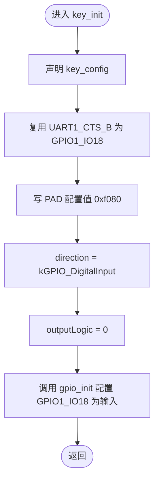
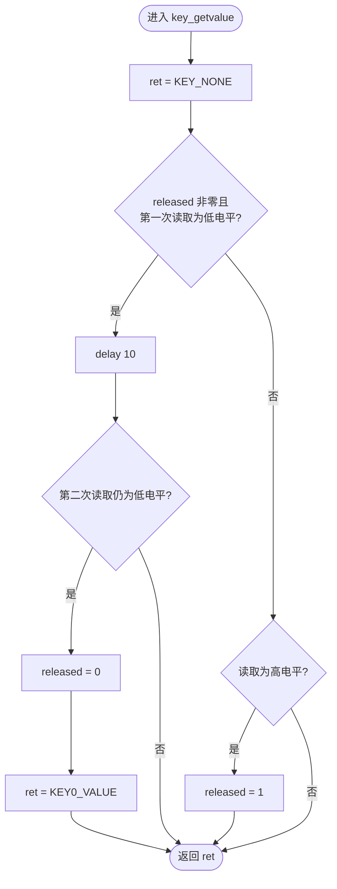
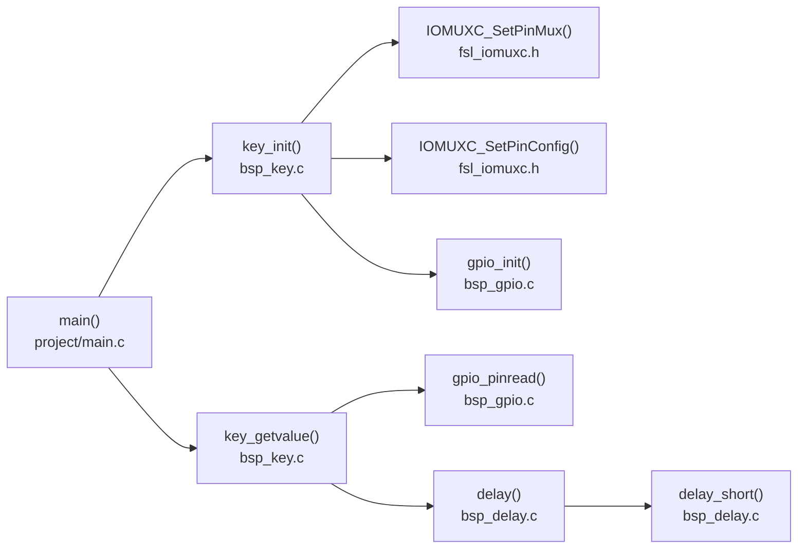
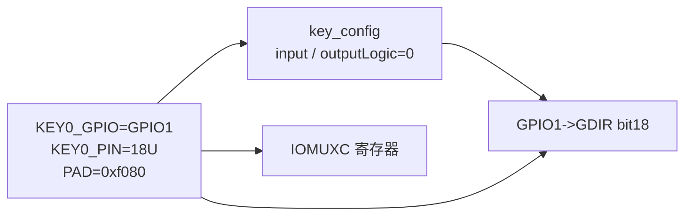
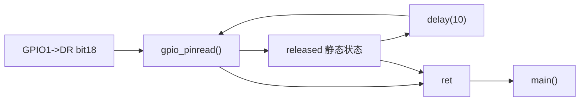

# `bsp_key.c` 详细设计文档

## 1. 文档范围与分析依据

本文档分析 `bsp_key.c` 的实际实现，并结合以下工程文件确认类型、外部接口和调用关系：

- `bsp_key.h`
- `../gpio/bsp_gpio.h`、`../gpio/bsp_gpio.c`
- `../delay/bsp_delay.h`、`../delay/bsp_delay.c`
- `../../imx6ul/imx6ul.h`
- `../../imx6ul/fsl_iomuxc.h`
- `../../imx6ul/MCIMX6Y2.h`
- `../../project/main.c`
- `../../Makefile`

本文档不推断原理图、按键电气连接、CPU 实际频率或未出现在当前工程中的调用方式。无法由当前代码确认的信息标注为“需结合其他文件确认”。

## 2. 文件职责

`bsp_key.c` 是 KEY0 的板级轮询驱动实现，职责如下：

1. 将 `UART1_CTS_B` 管脚复用为 `GPIO1_IO18`。
2. 设置该管脚的 PAD 控制值。
3. 将 `GPIO1_IO18` 配置为数字输入。
4. 轮询读取 KEY0 电平。
5. 使用忙等待延时进行软件消抖。
6. 使用函数内静态状态保证一次持续按下只返回一次 `KEY0_VALUE`。

当前文件只实现 KEY0。`KEY1_VALUE` 和 `KEY2_VALUE` 虽由头文件枚举声明，但本文件没有对应初始化或检测逻辑。

## 3. 外部依赖

### 3.1 头文件依赖

| 头文件 | 直接/间接 | 本文件使用的内容 | 实际来源 |
| --- | --- | --- | --- |
| `bsp_key.h` | 直接 | `KEY_NONE`、`KEY0_VALUE`、`uint8_t` 的间接可见性、公开函数声明 | `bsp_key.h`；其包含 `imx6ul.h` |
| `bsp_gpio.h` | 直接 | `gpio_pin_config_t`、`kGPIO_DigitalInput`、`gpio_init()`、`gpio_pinread()` | GPIO BSP |
| `bsp_delay.h` | 直接 | `delay()` | 延时 BSP |
| `imx6ul.h` | 间接 | `GPIO1`、IOMUXC 接口和基本整数类型 | 由 `bsp_key.h`、`bsp_gpio.h`、`bsp_delay.h` 包含 |
| `fsl_iomuxc.h` | 间接 | `IOMUXC_UART1_CTS_B_GPIO1_IO18`、`IOMUXC_SetPinMux()`、`IOMUXC_SetPinConfig()` | 由 `imx6ul.h` 包含 |
| `MCIMX6Y2.h` | 间接 | `GPIO_Type`、`GPIO1` | 由 `imx6ul.h` 包含 |

### 3.2 外部函数依赖

| 外部函数 | 声明/定义位置 | 本文件调用方 | 已确认行为 |
| --- | --- | --- | --- |
| `IOMUXC_SetPinMux(...)` | `fsl_iomuxc.h`，`static inline` | `key_init()` | 写管脚复用寄存器；输入选择寄存器非零时还会写输入选择寄存器 |
| `IOMUXC_SetPinConfig(...)` | `fsl_iomuxc.h`，`static inline` | `key_init()` | 配置寄存器地址非零时写入 PAD 配置值 |
| `gpio_init(GPIO_Type *base, uint32_t pin, const gpio_pin_config_t *config)` | `bsp_gpio.h` / `bsp_gpio.c` | `key_init()` | 根据配置设置 GPIO 方向；输入配置会清除对应 `GDIR` 位 |
| `gpio_pinread(GPIO_Type *base, uint32_t pin)` | `bsp_gpio.h` / `bsp_gpio.c` | `key_getvalue()` | 返回 `base->DR` 对应位；正常情况下为 `0` 或 `1` |
| `delay(volatile unsigned int ms)` | `bsp_delay.h` / `bsp_delay.c` | `key_getvalue()` | 执行近似毫秒级忙等待；实际时间依赖 CPU 频率、优化和存储器时序 |

### 3.3 硬件依赖

| 硬件资源 | 代码依据 | 用途 |
| --- | --- | --- |
| `GPIO1` | `KEY0_GPIO` 定义为 `GPIO1`；芯片头文件定义其基地址为 `0x209C000` | KEY0 GPIO 控制器 |
| GPIO1 的 18 号引脚 | `KEY0_PIN` 定义为 `18U` | KEY0 输入引脚 |
| `UART1_CTS_B` 管脚 | `IOMUXC_UART1_CTS_B_GPIO1_IO18` | 复用为 `GPIO1_IO18` |
| IOMUXC PAD 配置寄存器 | `IOMUXC_SetPinConfig(..., 0xf080)` | 设置管脚电气参数 |

源码注释说明 KEY0 连接到 `GPIO1_IO18` 且低电平有效。该连接与实际目标板原理图是否一致，需结合其他文件确认。

## 4. 宏定义

| 宏 | 展开值 | 类型/来源 | 使用位置 | 作用 |
| --- | --- | --- | --- | --- |
| `KEY0_GPIO` | `GPIO1` | `GPIO1` 在芯片头文件中为 `GPIO_Type *` 基地址宏 | `key_init()`、`key_getvalue()` | 指定 KEY0 所属 GPIO 控制器 |
| `KEY0_PIN` | `18U` | 无符号整数字面量 | `key_init()`、`key_getvalue()` | 指定 GPIO 控制器内的引脚编号 |

两个宏均仅在本实现文件内可见。

## 5. 全局变量、静态变量与常量

### 5.1 文件级全局变量

本文件未定义文件级全局变量。

### 5.2 文件级静态变量

本文件未定义文件级静态变量。

### 5.3 函数内静态变量

| 变量 | 所属函数 | 类型 | 初值 | 读写方式 | 作用 |
| --- | --- | --- | --- | --- | --- |
| `released` | `key_getvalue()` | `static uint8_t` | `1` | 每次调用读取；确认按下时写 `0`；检测到高电平时写 `1` | 记录是否允许上报下一次按下事件 |

`released` 具有静态存储期，首次进入函数前初始化为 `1`，后续调用保持上次值。当前代码没有对该状态提供外部复位接口。

### 5.4 写入硬件寄存器的数据

`key_init()` 通过外部接口写 IOMUXC 和 GPIO 寄存器。`key_getvalue()` 通过 `gpio_pinread()` 读取 `GPIO1->DR`。具体寄存器位变化见函数详细设计。

## 6. 结构体、枚举与类型

### 6.1 本文件定义的类型

本文件未定义结构体、联合体、枚举或类型别名。

### 6.2 使用的外部结构体

#### `gpio_pin_config_t`

定义于 `bsp_gpio.h`：

| 成员 | 类型 | `key_init()` 中的赋值 | 作用 |
| --- | --- | --- | --- |
| `direction` | `gpio_pin_direction_t` | `kGPIO_DigitalInput` | 指定 GPIO 为数字输入 |
| `outputLogic` | `uint8_t` | `0` | 由调用方初始化；`gpio_init()` 在输入模式分支中不读取该成员 |

### 6.3 使用的外部枚举

| 枚举 | 定义位置 | 本文件使用值 | 用途 |
| --- | --- | --- | --- |
| `gpio_pin_direction_t` | `bsp_gpio.h` | `kGPIO_DigitalInput = 0U` | 配置 KEY0 为输入 |
| `enum keyvalue` | `bsp_key.h` | `KEY_NONE = 0`、`KEY0_VALUE = 1` | 表示无按键事件或 KEY0 按下事件 |

## 7. 函数总览

| 函数 | 链接属性 | 功能 | 直接调用方 |
| --- | --- | --- | --- |
| `key_init(void)` | 外部链接 | 初始化 KEY0 管脚复用、PAD 配置和 GPIO 输入方向 | 当前工程中为 `main()` |
| `key_getvalue(void)` | 外部链接 | 轮询 KEY0，软件消抖并返回单次按下事件 | 当前工程中为 `main()` |

本文件没有定义静态函数。

## 8. 函数详细设计

### 8.1 `key_init(void)`

#### 功能

初始化 KEY0 对应的 `GPIO1_IO18`：

1. 将 `UART1_CTS_B` 复用为 `GPIO1_IO18`。
2. 将 PAD 配置寄存器写为 `0xf080`。
3. 构造输入模式 GPIO 配置。
4. 调用 GPIO BSP 将 18 号引脚配置为输入。

#### 函数原型

```c
void key_init(void);
```

#### 入参与返回值

| 项目 | 说明 |
| --- | --- |
| 入参 | 无 |
| 返回值 | 无 |

#### 局部变量

| 变量 | 类型 | 初始化/赋值 | 用途 |
| --- | --- | --- | --- |
| `key_config` | `gpio_pin_config_t` | `direction = kGPIO_DigitalInput`；`outputLogic = 0` | 传递给 `gpio_init()` 的 GPIO 配置 |

#### 全局、静态状态与硬件读写

| 对象 | 操作 | 说明 |
| --- | --- | --- |
| 文件级全局/静态变量 | 无 | 本函数不访问 C 文件级全局或静态变量 |
| IOMUXC 复用寄存器 | 写 | `IOMUXC_SetPinMux()` 将复用模式设置为宏携带的 `0x5U` |
| IOMUXC PAD 配置寄存器 | 写 | 写入 `0xf080` |
| `GPIO1->GDIR` | 读后写 | `gpio_init()` 清除第 18 位，将引脚设为输入 |

源码注释对 `0xf080` 的解释如下：关闭迟滞、选择 22K 上拉、启用 pull、启用 pull/keeper、关闭开漏、设置中速 100 MHz、关闭输出驱动并选择慢转换速率。上述解释来自当前源码注释；各位的芯片手册定义需结合其他文件确认。

#### 调用关系

| 类型 | 被调用函数 | 说明 |
| --- | --- | --- |
| 文件内调用 | 无 | 本文件没有供其调用的辅助函数 |
| 文件外调用 | `IOMUXC_SetPinMux()` | 设置管脚复用 |
| 文件外调用 | `IOMUXC_SetPinConfig()` | 设置 PAD 控制 |
| 文件外调用 | `gpio_init()` | 设置 GPIO 输入方向 |

当前工程中，文件外的 `main()` 在进入主循环前调用 `key_init()`。是否存在其他调用方，需结合其他文件确认。

#### 执行流程

1. 在栈上声明 `key_config`。
2. 调用 `IOMUXC_SetPinMux(IOMUXC_UART1_CTS_B_GPIO1_IO18, 0)`。
3. 调用 `IOMUXC_SetPinConfig(IOMUXC_UART1_CTS_B_GPIO1_IO18, 0xf080)`。
4. 将 `key_config.direction` 设为数字输入。
5. 将 `key_config.outputLogic` 设为 `0`。
6. 调用 `gpio_init(GPIO1, 18U, &key_config)`。
7. 返回调用方。



### 8.2 `key_getvalue(void)`

#### 功能

轮询读取低电平有效的 KEY0，并通过以下机制上报按下事件：

- 初始允许检测按下。
- 首次读取低电平后执行 `delay(10)`。
- 延时后仍为低电平时，返回一次 `KEY0_VALUE` 并锁定重复上报。
- 后续检测到高电平时恢复允许上报状态。
- 未产生新按下事件时返回 `KEY_NONE`。

#### 函数原型

```c
int key_getvalue(void);
```

#### 入参与返回值

| 项目 | 说明 |
| --- | --- |
| 入参 | 无 |
| 返回值 | `KEY0_VALUE`：确认到一次新的 KEY0 按下；`KEY_NONE`：未确认到新的按下事件 |

当前实现不会返回 `KEY1_VALUE` 或 `KEY2_VALUE`。

#### 局部变量

| 变量 | 类型 | 初值 | 用途 |
| --- | --- | --- | --- |
| `ret` | `int` | `KEY_NONE` | 保存本次调用的返回值 |

#### 静态变量与硬件读写

| 对象 | 操作 | 条件/用途 |
| --- | --- | --- |
| `released` | 读 | 判断是否允许检测新的按下 |
| `released` | 写 `0` | 延时后再次读取仍为低电平，表示已上报当前按下 |
| `released` | 写 `1` | 分支判断读取到高电平，表示按键已释放 |
| `GPIO1->DR` 第 18 位 | 读 | 由 `gpio_pinread()` 完成；一次调用最多读取两次 |

#### 调用关系

| 类型 | 被调用函数 | 说明 |
| --- | --- | --- |
| 文件内调用 | 无 | 本文件没有静态辅助函数 |
| 文件外调用 | `gpio_pinread()` | 读取 KEY0 当前电平 |
| 文件外调用 | `delay()` | 首次检测到低电平后执行消抖等待 |

当前工程中，`main()` 在无限循环内调用 `key_getvalue()`，并在返回 `KEY0_VALUE` 时翻转蜂鸣器状态。

#### 执行流程

1. 将 `ret` 初始化为 `KEY_NONE`。
2. 若 `released` 非零，则读取 KEY0：
   - 若为低电平，执行 `delay(10)`。
   - 延时后再次读取。
   - 若仍为低电平，将 `released` 置 `0`，将 `ret` 置为 `KEY0_VALUE`。
3. 若第一项条件不成立，执行 `else if` 中的 GPIO 读取：
   - 若为高电平，将 `released` 置 `1`。
4. 返回 `ret`。

需要注意：当 `released == 0` 时，逻辑表达式短路，不执行第一个 `gpio_pinread()`，而由 `else if` 执行一次读取；当 `released != 0` 且第一次读取为高电平时，`else if` 会再次读取 GPIO。



#### 状态转换

| 当前 `released` | 检测结果 | 下一状态 | 返回值 |
| --- | --- | --- | --- |
| `1` | 首次低电平，延时后仍为低电平 | `0` | `KEY0_VALUE` |
| `1` | 首次高电平 | `1` | `KEY_NONE` |
| `1` | 首次低电平，延时后变为高电平 | `1` | `KEY_NONE` |
| `0` | 低电平 | `0` | `KEY_NONE` |
| `0` | 高电平 | `1` | `KEY_NONE` |

## 9. 文件级调用关系

### 9.1 当前工程调用图



### 9.2 文件内外关系

- 文件内函数之间没有直接调用关系。
- `key_init()` 和 `key_getvalue()` 均由文件外调用。
- 两个函数调用的所有函数均定义在文件外。
- `key_getvalue()` 依赖 `key_init()` 已经完成硬件初始化这一使用顺序，但代码没有主动检查初始化状态。该顺序在当前 `main()` 中得到满足。

## 10. 数据流分析

### 10.1 初始化数据流



初始化过程中，编译期常量和局部配置结构体最终转换为 IOMUXC 寄存器写入及 `GPIO1->GDIR` 第 18 位清零。

### 10.2 按键检测数据流



低电平经两次采样确认后转换为一次 `KEY0_VALUE` 事件；静态变量 `released` 抑制持续按下期间的重复事件。高电平只更新释放状态，不直接产生事件。

## 11. 风险与改进建议

| 风险/限制 | 代码依据 | 影响 | 改进建议 |
| --- | --- | --- | --- |
| 消抖延时阻塞 CPU | `key_getvalue()` 调用 `delay(10)`；`delay()` 为忙等待 | 检测到低电平时阻塞其他轮询任务；实际等待时间不精确 | 使用定时器或周期采样状态机实现非阻塞消抖 |
| `released` 使函数不可重入 | 函数内静态变量被读写且无同步 | 中断与主循环并发调用或多执行上下文调用时状态可能冲突 | 限定单一调用上下文，或将状态放入实例结构并提供同步；实际并发场景需结合其他文件确认 |
| 未提供初始化状态检查 | `key_getvalue()` 可独立调用 | 初始化前调用时管脚配置和读取结果不可由本文件保证 | 在接口约定中明确先调用 `key_init()`，或维护初始化状态 |
| GPIO 读取失败语义可能被视为按下 | `gpio_pinread()` 在 `base == NULL` 时返回 `0`；低电平代表按下 | 当前固定 `GPIO1` 非空，但接口复用或宏配置错误时可能误报 | 让 GPIO 读取接口返回可区分的错误码，或在初始化时验证配置 |
| 返回类型未使用枚举类型 | `key_getvalue()` 返回 `int`，实际返回 `enum keyvalue` 的枚举项 | 接口允许返回枚举范围外整数，类型语义较弱 | 将返回类型改为 `enum keyvalue`；需评估现有调用方兼容性 |
| 公开枚举与实现能力不一致 | 头文件包含 KEY1/KEY2，本文件只处理 KEY0 | 调用方可能误认为驱动支持三个按键 | 删除未实现枚举值，或补充对应按键实现和文档 |
| PAD 配置使用裸常量 | `IOMUXC_SetPinConfig(..., 0xf080)` | 可读性和维护性依赖注释，修改时易出错 | 使用芯片头文件的位域宏组合配置值，并保留用途说明 |
| 按键电气假设只由注释说明 | 代码按低电平有效处理 | 若硬件连接不同，行为错误 | 结合原理图确认低有效和上拉要求；需结合其他文件确认 |
| 持续按下不会周期性上报 | `released` 在检测到高电平前保持 `0` | 不支持长按重复、长按时长等功能 | 若需求存在，增加按下时长和重复事件状态机；需求需结合其他文件确认 |

## 12. 结论

`bsp_key.c` 实现了单个低电平有效按键 KEY0 的初始化和轮询检测。实现结构简单，当前 `main()` 的初始化顺序和轮询用法与其设计一致。其主要约束是忙等待消抖、单一静态状态、只支持 KEY0，以及对实际硬件连接和时序精度的依赖。
