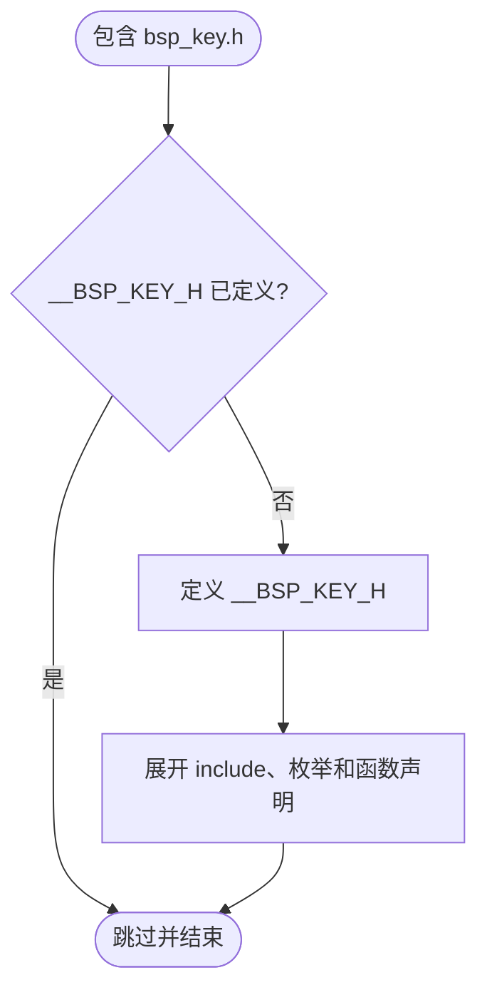
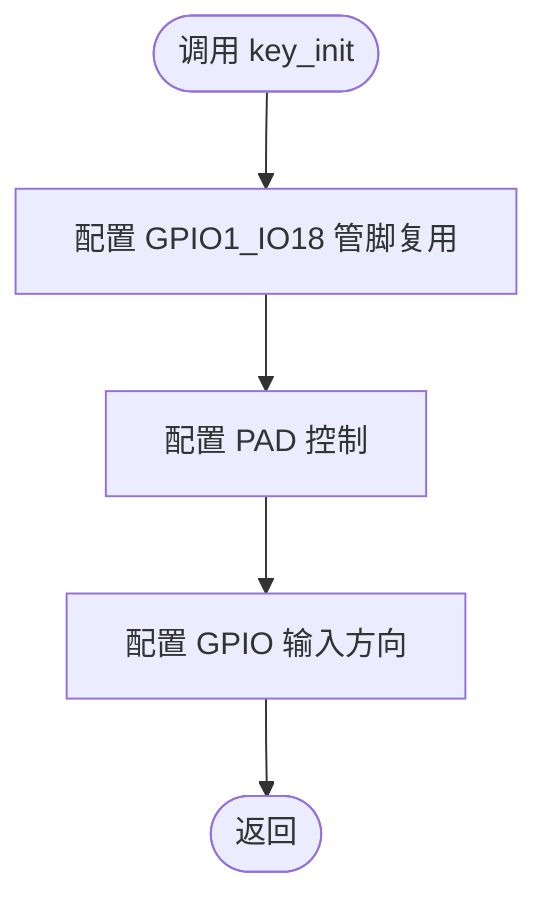
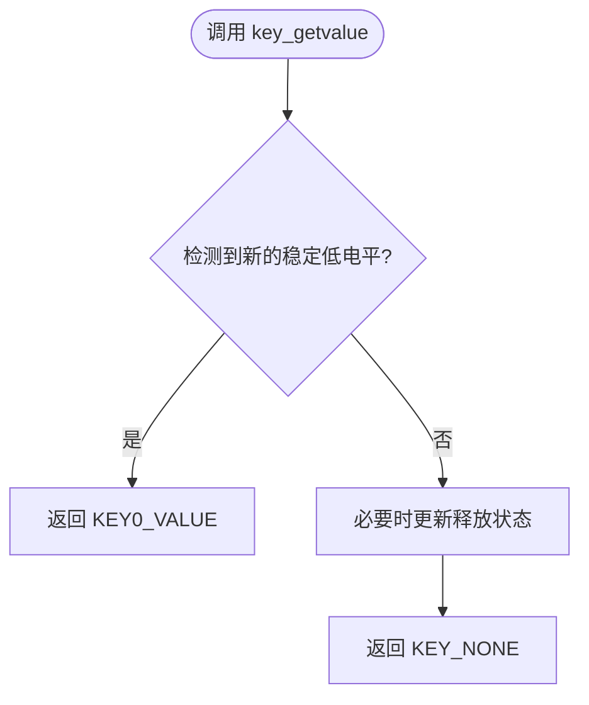
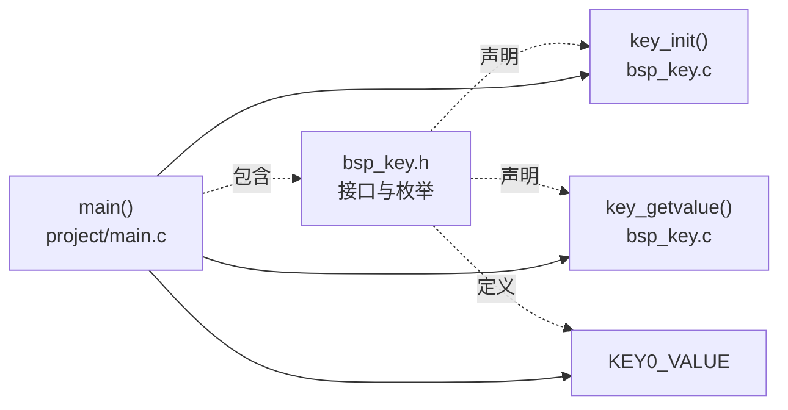
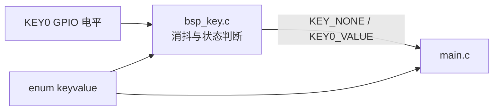

# `bsp_key.h` 详细设计文档

## 1. 文档范围与分析依据

本文档分析 `bsp_key.h` 的实际接口定义，并结合 `bsp_key.c`、`../../project/main.c` 和 `../../imx6ul/imx6ul.h` 确认接口用途与依赖关系。

本文档只描述当前工程能够确认的内容。未在当前代码中体现的按键硬件、其他调用方和扩展需求标注为“需结合其他文件确认”。

## 2. 文件职责

`bsp_key.h` 是按键 BSP 的公开接口头文件，职责如下：

1. 通过头文件保护宏防止重复包含。
2. 包含 i.MX6UL 公共头文件，使基础类型和芯片定义可见。
3. 定义按键返回值枚举 `enum keyvalue`。
4. 声明按键初始化接口 `key_init()`。
5. 声明按键轮询接口 `key_getvalue()`。

该头文件不包含按键初始化、GPIO 读取或消抖实现；实现位于 `bsp_key.c`。

## 3. 外部依赖

| 依赖 | 类型 | 用途 | 说明 |
| --- | --- | --- | --- |
| `imx6ul.h` | 直接包含 | 汇总基本类型和 i.MX6UL SDK/芯片头文件 | 当前头文件自身的枚举和函数声明不直接使用其中的芯片符号；`bsp_key.c` 通过本头文件间接获得部分定义 |
| `bsp_key.c` | 接口实现方 | 实现 `key_init()`、`key_getvalue()` | 当前工程中的对应实现 |
| `project/main.c` | 当前调用方 | 调用两个公开函数，并使用 `KEY0_VALUE` | 是否存在其他调用方，需结合其他文件确认 |

`imx6ul.h` 继续包含 `cc.h`、`MCIMX6Y2.h`、`fsl_common.h` 和 `fsl_iomuxc.h`。这些间接依赖会扩展所有包含 `bsp_key.h` 的编译单元的可见定义。

## 4. 宏定义

### 4.1 头文件保护宏

| 宏 | 定义值 | 作用范围 | 作用 |
| --- | --- | --- | --- |
| `__BSP_KEY_H` | 空 | 包含本头文件的预处理单元 | 防止头文件内容被重复展开 |

处理流程：

1. 若 `__BSP_KEY_H` 尚未定义，则定义该宏并展开头文件主体。
2. 若已定义，则跳过头文件主体。



风险：以双下划线开头的标识符保留给实现使用。建议将保护宏改为项目范围内唯一且不使用保留形式的名称，例如 `BSP_KEY_H` 或 `BAREMETAL_07_KEY_BSP_KEY_H`。

## 5. 全局变量与静态变量

本头文件未声明或定义全局变量、静态变量。

`bsp_key.c` 的 `key_getvalue()` 内部存在函数内静态变量 `released`，但该变量不通过头文件公开。

## 6. 结构体、联合体与枚举

本头文件未定义结构体或联合体。

### 6.1 `enum keyvalue`

#### 功能

定义按键检测接口使用的结果值。

#### 枚举项

| 枚举项 | 实际整数值 | 当前实现是否返回 | 说明 |
| --- | ---: | --- | --- |
| `KEY_NONE` | `0` | 是 | 当前调用未确认到新的按键按下事件 |
| `KEY0_VALUE` | `1` | 是 | KEY0 新按下事件 |
| `KEY1_VALUE` | `2` | 否 | 当前 `bsp_key.c` 没有 KEY1 检测逻辑 |
| `KEY2_VALUE` | `3` | 否 | 当前 `bsp_key.c` 没有 KEY2 检测逻辑 |

仅 `KEY_NONE` 显式赋值为 `0`，后续枚举项按 C 语言规则依次递增，因此其值分别为 `1`、`2`、`3`。

当前 `main()` 只判断 `KEY0_VALUE`。KEY1 和 KEY2 是否为未来扩展预留，需结合其他文件确认。

## 7. 函数及静态函数

本头文件只声明公开函数，不定义函数或静态函数。局部变量、全局状态读写和具体执行流程由 `bsp_key.c` 实现。

### 7.1 `key_init(void)`

#### 声明

```c
void key_init(void);
```

#### 接口说明

| 项目 | 说明 |
| --- | --- |
| 功能 | 初始化按键硬件；当前实现初始化 KEY0 对应的 `GPIO1_IO18` |
| 入参 | 无 |
| 返回值 | 无 |
| 局部变量 | 头文件声明不涉及；实现中使用 `gpio_pin_config_t key_config` |
| 读写全局/静态变量 | 当前实现不读写 C 文件级全局或静态变量 |
| 文件内调用 | 无 |
| 文件外调用 | 实现中调用 IOMUXC 配置接口和 `gpio_init()` |

#### 当前实现流程



### 7.2 `key_getvalue(void)`

#### 声明

```c
int key_getvalue(void);
```

#### 接口说明

| 项目 | 说明 |
| --- | --- |
| 功能 | 轮询按键并返回新的按下事件 |
| 入参 | 无 |
| 返回值 | 当前实现返回 `KEY_NONE` 或 `KEY0_VALUE` |
| 局部变量 | 头文件声明不涉及；实现中使用 `int ret` |
| 读写全局/静态变量 | 当前实现读写函数内静态变量 `released` |
| 文件内调用 | 无 |
| 文件外调用 | 实现中调用 `gpio_pinread()` 和 `delay()` |

#### 当前实现流程



详细的分支、消抖和状态转换见 `bsp_key.c.md`。

## 8. 文件级调用关系



头文件本身不产生运行时调用。图中的虚线表示编译期包含、声明或定义关系，实线表示当前工程中的运行时函数调用或枚举使用关系。

## 9. 数据流分析

### 9.1 接口数据流



`enum keyvalue` 为实现方与调用方提供约定的事件值。硬件电平和内部静态状态由实现文件转换为枚举项对应的整数返回给调用方。

### 9.2 初始化控制流

当前 `main()` 先调用 `key_init()`，再进入循环调用 `key_getvalue()`。头文件没有通过类型系统或运行时状态强制这一顺序。

## 10. 风险与改进建议

| 风险/限制 | 代码依据 | 影响 | 改进建议 |
| --- | --- | --- | --- |
| 保护宏使用保留标识符 | `__BSP_KEY_H` 以双下划线开头 | 严格 C 环境下可能与实现保留名称冲突 | 改为不使用保留形式的项目唯一宏名 |
| 依赖范围偏大 | 公开头文件直接包含聚合头 `imx6ul.h` | 增加编译耦合并向调用方暴露大量芯片定义 | 若接口不再需要其中类型，可移除该包含；需先验证所有构建单元 |
| 返回类型与枚举不一致 | `key_getvalue()` 声明返回 `int` | 接口语义不能限制为 `enum keyvalue` | 将返回类型改为 `enum keyvalue`，并同步实现和调用方 |
| 枚举声明未实现的按键 | 声明 `KEY1_VALUE`、`KEY2_VALUE`，实现只返回 KEY0 | 调用方可能误判支持范围 | 补充实现，或删除/标注未支持项 |
| 缺少接口使用约束说明 | 声明未说明必须先调用 `key_init()`，也未说明按键低有效和一次按下只上报一次 | 调用方需阅读实现才能正确使用 | 在头文件注释中补充初始化顺序、返回语义和轮询约束 |
| 无错误返回通道 | `key_init()` 返回 `void`；`key_getvalue()` 使用事件值返回 | 初始化失败或硬件异常无法通过接口表达 | 若底层可检测错误，增加状态码或独立错误接口；实际需求需结合其他文件确认 |

## 11. 结论

`bsp_key.h` 提供了简洁的按键 BSP 接口和四个事件枚举值。当前实现和调用方实际只使用 `KEY_NONE` 与 `KEY0_VALUE`。接口的主要改进方向是缩小头文件依赖、使用非保留保护宏、让返回类型与枚举一致，并明确初始化顺序和当前支持范围。
