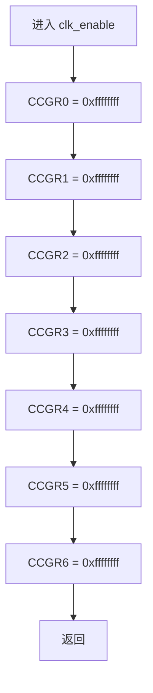
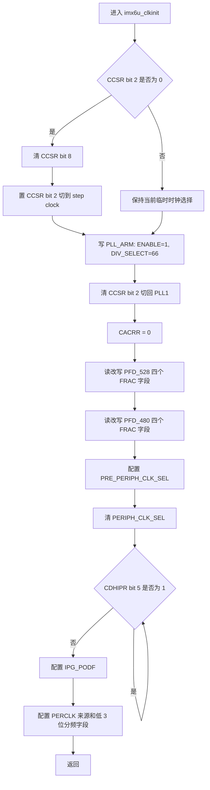
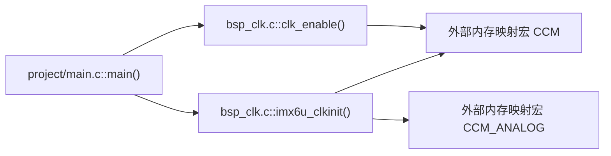
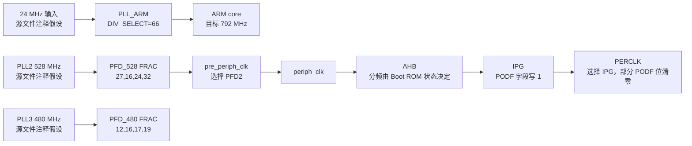

# `bsp_clk.c` 详细设计说明书

## 1. 文档依据与边界

本文档基于以下实际代码生成：

- `bsp/clk/bsp_clk.c`
- `bsp/clk/bsp_clk.h`
- 直接依赖的 `imx6ul/imx6ul.h`、`imx6ul/MCIMX6Y2.h`
- 实际调用方 `project/main.c`

本文只描述代码和直接依赖中可以确认的行为。寄存器位的完整硬件约束、复位值、时序要求和不同芯片版本差异，需结合 i.MX6UL 芯片参考手册确认。

## 2. 文件职责

`bsp_clk.c` 是 i.MX6UL 裸机 BSP 的时钟配置实现文件，职责包括：

1. 通过 `clk_enable()` 将 CCM 的七个时钟门控寄存器全部写为 `0xffffffff`。
2. 通过 `imx6u_clkinit()` 配置 ARM PLL、PLL2/PLL3 PFD 输出、外设主时钟源、IPG 时钟和 PERCLK 时钟。
3. 在切换 `periph_clk` 后轮询硬件握手状态，等待切换完成。

该文件不负责：

- 配置代码中注释明确保留给 Boot ROM 的 `AHB_PODF`。
- 检查 PLL 锁定状态或 PFD 稳定状态。
- 提供时钟查询、关闭、按外设门控或错误返回接口。

## 3. 外部依赖

| 依赖 | 来源 | 用途 |
|---|---|---|
| `bsp_clk.h` | 本模块头文件 | 引入接口声明和 `imx6ul.h` |
| `imx6ul.h` | `bsp_clk.h` 间接包含 | 汇总芯片基础类型和 NXP SDK 头文件 |
| `MCIMX6Y2.h` | `imx6ul.h` 间接包含 | 定义 `CCM_Type`、`CCM_ANALOG_Type`、`CCM`、`CCM_ANALOG` 和寄存器字段 |
| `CCM` | `MCIMX6Y2.h` | 指向基地址 `0x020C4000` 的 `CCM_Type *` 宏 |
| `CCM_ANALOG` | `MCIMX6Y2.h` | 指向基地址 `0x020C8000` 的 `CCM_ANALOG_Type *` 宏 |
| Boot ROM 初始配置 | 源文件注释 | 代码假定 `AHB_PODF` 通常由 Boot ROM 配置为满足目标频率的值；实际启动状态需结合启动流程确认 |

## 4. 宏定义

### 4.1 本文件定义的宏

无。

### 4.2 本文件使用的外部宏

| 宏 | 实际定义 | 作用 |
|---|---|---|
| `CCM` | `((CCM_Type *)0x20C4000u)` | 访问数字时钟控制模块寄存器 |
| `CCM_ANALOG` | `((CCM_ANALOG_Type *)0x20C8000u)` | 访问模拟 PLL/PFD 控制寄存器 |

代码没有使用 `MCIMX6Y2.h` 已提供的寄存器字段掩码宏，而是直接使用位移和十六进制常量。

## 5. 全局变量与静态变量

无全局变量，无文件内静态变量。

`CCM` 和 `CCM_ANALOG` 是外部头文件定义的宏，不是变量；它们展开为指向内存映射寄存器的指针。

## 6. 结构体与枚举

### 6.1 本文件定义

本文件未定义结构体或枚举。

### 6.2 使用的外部结构体

| 结构体 | 使用成员 | 成员访问属性 |
|---|---|---|
| `CCM_Type` | `CCSR`、`CACRR`、`CBCDR`、`CBCMR`、`CSCMR1`、`CDHIPR`、`CCGR0` 至 `CCGR6` | 除 `CDHIPR` 为只读 `__I` 外，其余为读写 `__IO` |
| `CCM_ANALOG_Type` | `PLL_ARM`、`PFD_480`、`PFD_528` | 读写 `__IO` |

`__I`、`__IO` 的具体定义和编译器行为需结合 `MCIMX6Y2.h` 的基础类型依赖确认。

## 7. 对外函数总览

| 函数 | 功能 | 入参 | 返回值 | 文件内调用 | 文件外调用 |
|---|---|---|---|---|---|
| `clk_enable()` | 开启全部 CCM 时钟门控 | 无 | 无 | 无 | `project/main.c:26` |
| `imx6u_clkinit()` | 初始化系统时钟树 | 无 | 无 | 无 | `project/main.c:25` |

本文件无静态函数，两个函数之间也不存在直接调用关系。

## 8. 函数详细设计

### 8.1 `clk_enable`

#### 8.1.1 功能

依次将 `CCM->CCGR0` 至 `CCM->CCGR6` 写为 `0xffffffff`。根据寄存器命名和源文件注释，该操作用于开启全部外设时钟门控；每个门控位对应的具体外设及 `0b11` 的完整硬件语义需结合芯片参考手册确认。

#### 8.1.2 接口

```c
void clk_enable(void);
```

| 项目 | 说明 |
|---|---|
| 入参 | 无 |
| 返回值 | 无 |
| 局部变量 | 无 |
| 前置条件 | `CCM` 内存映射可访问；具体启动阶段要求需结合其他文件确认 |
| 后置状态 | `CCGR0` 至 `CCGR6` 均被覆盖写为 `0xffffffff` |

#### 8.1.3 全局状态与寄存器访问

| 对象 | 操作 | 写入值 |
|---|---|---|
| `CCM->CCGR0` | 写 | `0xffffffff` |
| `CCM->CCGR1` | 写 | `0xffffffff` |
| `CCM->CCGR2` | 写 | `0xffffffff` |
| `CCM->CCGR3` | 写 | `0xffffffff` |
| `CCM->CCGR4` | 写 | `0xffffffff` |
| `CCM->CCGR5` | 写 | `0xffffffff` |
| `CCM->CCGR6` | 写 | `0xffffffff` |

#### 8.1.4 调用关系

- 文件内调用：无。
- 文件外调用：无。
- 已确认调用方：`project/main.c` 的 `main()`。

#### 8.1.5 执行流程

1. 写满 `CCGR0`。
2. 按地址顺序写满 `CCGR1` 至 `CCGR6`。
3. 返回调用方。



### 8.2 `imx6u_clkinit`

#### 8.2.1 功能

按照固定配置初始化系统时钟树。源文件注释给出的目标为：

| 时钟 | 目标频率 |
|---|---:|
| ARM core | 792 MHz |
| PLL2 PFD0/PFD1/PFD2/PFD3 | 352 / 594 / 396 / 297 MHz |
| PLL3 PFD0/PFD1/PFD2/PFD3 | 720 / 540 / 508.24 / 454.74 MHz |
| AHB | 132 MHz |
| IPG | 66 MHz |
| PERCLK | 66 MHz |

上述频率依赖 24 MHz 输入时钟、PLL2 为 528 MHz、PLL3 为 480 MHz以及 Boot ROM 已配置合适的 `AHB_PODF`。这些前提在本函数中未检测，需结合硬件和启动代码确认。

#### 8.2.2 接口

```c
void imx6u_clkinit(void);
```

| 项目 | 说明 |
|---|---|
| 入参 | 无 |
| 返回值 | 无 |
| 局部变量 | `unsigned int reg`：暂存并修改 `PFD_528`、`PFD_480` 寄存器值 |
| 前置条件 | 时钟控制寄存器可访问；输入时钟和 PLL 初始条件满足注释假设，需结合其他文件确认 |
| 后置状态 | 多个 PLL、PFD、时钟选择和分频寄存器被修改 |

#### 8.2.3 全局状态与寄存器访问

| 对象 | 操作 | 作用或结果 |
|---|---|---|
| `CCM->CCSR` bit 2 | 读、清零、置位 | 判断并切换 `pll1_sw_clk` |
| `CCM->CCSR` bit 8 | 条件性清零 | 选择 step clock 来源；具体值语义由外部寄存器定义确认 |
| `CCM_ANALOG->PLL_ARM` | 覆盖写 | 写入 enable 位和 `DIV_SELECT=66` |
| `CCM->CACRR` | 覆盖写 `0` | ARM 分频字段设为代码注释所述 divide by 1，同时覆盖该寄存器其他位 |
| `CCM_ANALOG->PFD_528` | 读改写 | 保留各字节高 2 位，更新四个 6 位 FRAC 字段 |
| `CCM_ANALOG->PFD_480` | 读改写 | 保留各字节高 2 位，更新四个 6 位 FRAC 字段 |
| `CCM->CBCMR` bits 19:18 | 读改写为 `01b` | 选择 `PLL2_PFD2` 作为 `pre_periph_clk`，依据源文件注释 |
| `CCM->CBCDR` bit 25 | 读改写为 `0` | 选择 `pre_periph_clk` 作为 `periph_clk`，依据源文件注释 |
| `CCM->CDHIPR` bit 5 | 反复读取 | 等待 `PERIPH_CLK_SEL_BUSY` 清零 |
| `CCM->CBCDR` bits 9:8 | 读改写为 `01b` | 配置 IPG 分频为注释所述 divide by 2 |
| `CCM->CSCMR1` bit 6 | 读改写为 `0` | 选择 IPG 作为 PERCLK 来源，依据源文件注释 |
| `CCM->CSCMR1` bits 2:0 | 读改写为 `000b` | 将代码实际清除的低 3 位设为 0 |

注意：外部定义显示 `PERCLK_PODF` 掩码为 bits 5:0，但代码只清除 bits 2:0。因此“PERCLK divide by 1”只有在 bits 5:3 原本为 0 时成立，需结合复位值或前序配置确认。

#### 8.2.4 调用关系

- 文件内调用：无。
- 文件外调用：无。
- 已确认调用方：`project/main.c` 的 `main()`。

#### 8.2.5 执行流程

1. 读取 `CCSR` bit 2。
2. 若 bit 2 为 0，则清除 bit 8，并置位 bit 2，使 ARM 临时使用 step clock。
3. 覆盖写 `PLL_ARM`：enable 位置 1，`DIV_SELECT` 写 66。
4. 清除 `CCSR` bit 2，切回 PLL1；将 `CACRR` 写 0。
5. 读改写 `PFD_528` 的四个 FRAC 字段。
6. 读改写 `PFD_480` 的四个 FRAC 字段。
7. 将 `CBCMR` bits 19:18 配置为 `01b`。
8. 清除 `CBCDR` bit 25。
9. 轮询 `CDHIPR` bit 5，直到其为 0。
10. 将 `CBCDR` bits 9:8 配置为 `01b`。
11. 清除 `CSCMR1` bit 6 和 bits 2:0。
12. 返回调用方。



## 9. 文件级调用关系图



`main()` 中已确认的顺序是先执行 `imx6u_clkinit()`，再执行 `clk_enable()`。

## 10. 数据流分析

### 10.1 时钟配置数据流



### 10.2 寄存器读写数据流

- `clk_enable()` 只产生固定值写入，不读取寄存器。
- `imx6u_clkinit()` 对 `CCSR`、`PFD_528`、`PFD_480`、`CBCMR`、`CBCDR`、`CSCMR1` 使用读改写。
- `PLL_ARM` 和 `CACRR` 使用覆盖写，原寄存器其他位不会保留。
- `CDHIPR` 仅被读取，其值控制忙等待循环退出。
- 局部变量 `reg` 只承载 PFD 寄存器的读改写中间值，不跨函数保存状态。

## 11. 风险与改进建议

| 风险 | 代码依据 | 改进建议 |
|---|---|---|
| 无限等待 | `while (CCM->CDHIPR & (1 << 5))` 无超时 | 增加超时计数和可诊断返回值 |
| 未等待 PLL 锁定 | 写 `PLL_ARM` 后立即切回 PLL1 | 根据芯片参考手册确认要求；如需要，轮询 `PLL_ARM.LOCK` 并处理超时 |
| `PLL_ARM` 覆盖写 | 直接赋值 `(1 << 13) \| 66` | 确认必须清除的旁路、电源和选择字段；优先使用字段宏并记录设计值 |
| PERCLK 分频字段未完整清零 | 外部掩码定义为 bits 5:0，代码仅清 bits 2:0 | 使用 `CCM_CSCMR1_PERCLK_PODF_MASK` 清除完整字段 |
| 全部开启时钟门控 | 七个 `CCGRx` 均写 `0xffffffff` | 按实际外设需求启用门控，以降低功耗并避免不必要模块运行 |
| 大量魔数 | 使用 `1 << n`、`3 << n`、`0x3f3f3f3f` | 使用 `MCIMX6Y2.h` 的字段掩码和构造宏，提高可审查性 |
| 依赖 Boot ROM 的 AHB 分频 | 函数不写 `AHB_PODF`，目标 132 MHz 依赖既有值 | 启动时读取并校验 `AHB_PODF`，或按参考手册规定流程显式配置 |
| 无错误反馈 | 两个函数均返回 `void` | 对需要等待或验证的初始化函数返回状态码 |
| 并发读改写风险 | 多次直接读改写共享时钟寄存器 | 若系统后续引入中断或并发执行，需增加临界区或集中管理；当前启动阶段是否存在并发需结合其他文件确认 |
| 配置适用范围固定 | 频率和分频值全部硬编码 | 将经过硬件验证的配置抽象为命名常量或受控配置表 |

## 12. 可验证结论与待确认项

### 12.1 可由代码确认

- 文件包含两个非静态、无参数、无返回值函数。
- 文件不定义宏、全局变量、静态变量、结构体、枚举或静态函数。
- `main()` 按 `imx6u_clkinit()`、`clk_enable()` 的顺序调用本模块。
- `imx6u_clkinit()` 唯一循环是等待 `CDHIPR` bit 5 清零。

### 12.2 需结合其他文件或硬件资料确认

- 24 MHz 输入、PLL2 528 MHz、PLL3 480 MHz 是否在所有目标启动场景成立。
- Boot ROM 是否始终将 `AHB_PODF` 配置为目标值。
- 写 `PLL_ARM` 后是否必须等待锁定或执行额外切换步骤。
- PFD 修改前后是否需要门控、等待稳定或执行握手。
- `clk_enable()` 写满所有门控寄存器对功耗和外设状态的实际影响。
- 当前 `CSCMR1` bits 5:3 的初始值是否保证 PERCLK divide by 1。
