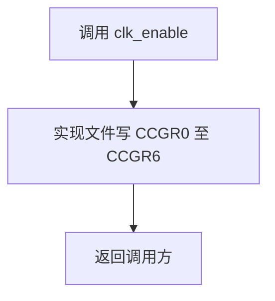
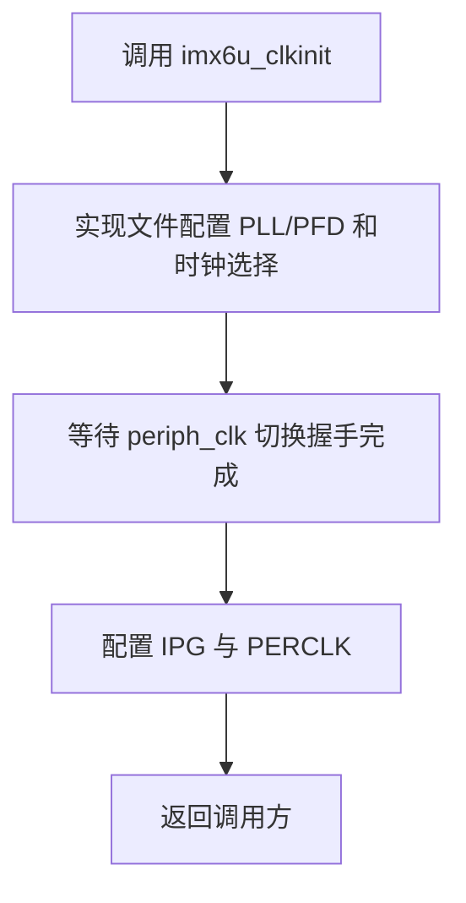
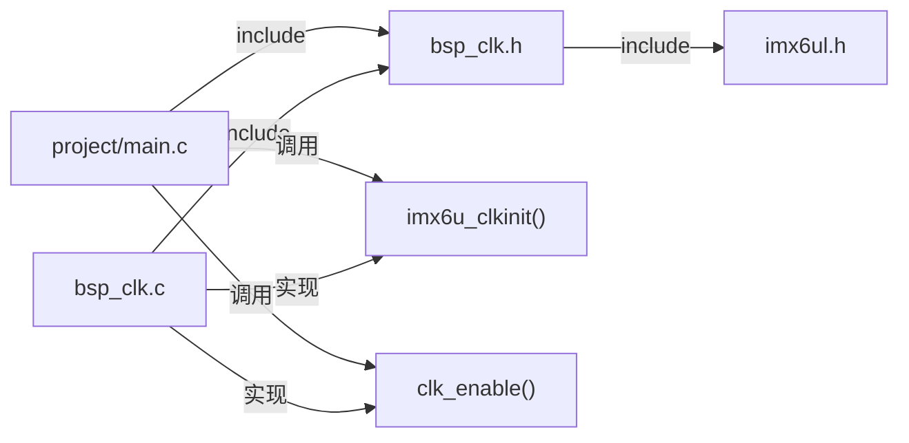

# `bsp_clk.h` 详细设计说明书

## 1. 文件职责

`bsp_clk.h` 是时钟驱动的公共接口头文件，负责：

1. 通过头文件保护宏避免重复包含。
2. 包含芯片公共头文件 `imx6ul.h`，向实现文件提供内存映射寄存器定义。
3. 声明 `clk_enable()` 和 `imx6u_clkinit()` 两个对外函数。

该文件不包含函数实现、配置参数、状态类型或错误码定义。

## 2. 外部依赖

| 依赖 | 直接性 | 作用 |
|---|---|---|
| `imx6ul.h` | 直接包含 | 汇总 `cc.h`、`MCIMX6Y2.h`、`fsl_common.h`、`fsl_iomuxc.h` |
| `MCIMX6Y2.h` | 经 `imx6ul.h` 间接包含 | 为 `bsp_clk.c` 提供 `CCM`、`CCM_ANALOG` 和寄存器结构定义 |

两个函数声明本身只使用 `void`，从声明语法看不依赖 `imx6ul.h` 中的类型。当前把芯片头文件放在公共接口中是否是项目统一约定，需结合其他 BSP 头文件确认。

## 3. 宏定义

| 宏 | 类型 | 作用 |
|---|---|---|
| `__BSP_CLK_H` | 头文件保护宏 | 防止同一翻译单元重复展开本头文件内容 |

宏名以双下划线开头；该命名是否与当前工具链保留标识符规则冲突，需结合编译器规范确认。建议改为项目作用域明确且不使用保留形式的名称，例如 `BSP_CLK_H`。

## 4. 全局变量与静态变量

无全局变量声明，无静态变量声明。

## 5. 结构体与枚举

本文件未定义或声明结构体、联合体、枚举、类型别名。

## 6. 函数接口详细设计

### 6.1 `clk_enable`

```c
void clk_enable(void);
```

| 项目 | 说明 |
|---|---|
| 功能 | 声明开启全部 CCM 外设时钟门控的公共接口 |
| 入参 | 无 |
| 返回值 | 无 |
| 局部变量 | 声明不涉及；实现中无局部变量 |
| 读写全局变量 | 无普通全局变量；实现覆盖写 `CCM->CCGR0` 至 `CCM->CCGR6` |
| 文件内调用 | 无 |
| 文件外调用 | 无 |
| 已确认调用方 | `project/main.c::main()` |

执行流程由 `bsp_clk.c` 实现：



### 6.2 `imx6u_clkinit`

```c
void imx6u_clkinit(void);
```

| 项目 | 说明 |
|---|---|
| 功能 | 声明系统时钟树初始化公共接口 |
| 入参 | 无 |
| 返回值 | 无 |
| 局部变量 | 声明不涉及；实现中有 `unsigned int reg` |
| 读写全局变量 | 无普通全局变量；实现读写 `CCM` 和 `CCM_ANALOG` 内存映射寄存器 |
| 文件内调用 | 无 |
| 文件外调用 | 无 |
| 已确认调用方 | `project/main.c::main()` |

接口不返回初始化状态，因此调用方无法通过该接口判断 PLL、PFD 或时钟切换是否成功。



## 7. 文件级调用与包含关系



## 8. 数据流分析

头文件本身不执行数据处理。其接口数据流特点如下：

- 两个函数均无输入参数，配置值全部由实现文件内部固定常量决定。
- 两个函数均无返回值，调用方无法获取执行结果或当前频率。
- 状态变化完全体现为实现文件对硬件寄存器的读写。
- 接口没有暴露配置结构体、频率枚举或状态查询函数。

## 9. 风险与改进建议

| 风险 | 依据 | 改进建议 |
|---|---|---|
| 初始化结果不可观察 | `imx6u_clkinit()` 返回 `void` | 增加状态返回值，至少区分成功和等待超时 |
| 接口语义过宽 | `clk_enable()` 实际开启全部门控，但名称未体现“全部” | 可重命名为更明确的接口，或提供按模块启用接口 |
| 公共头文件依赖较重 | 仅声明 `void` 函数却包含 `imx6ul.h` | 若项目结构允许，将芯片头文件包含移动到 `bsp_clk.c` |
| 保护宏命名可能使用保留形式 | `__BSP_CLK_H` 以双下划线开头 | 改为 `BSP_CLK_H` 或带项目唯一前缀的名称 |
| 缺少 C++ 链接保护 | 未使用 `extern "C"` | 仅在项目需要被 C++ 编译单元包含时增加；当前是否需要，需结合其他文件确认 |
| 无接口级前置条件说明 | 头文件只提供声明 | 增加简洁注释，说明应在外设初始化之前调用及硬件前提；准确顺序需结合启动设计确认 |

## 10. 可验证结论与待确认项

### 10.1 可由代码确认

- 本文件只有一个头文件保护宏、一个直接包含和两个函数声明。
- 两个接口均为外部链接、无参数、无返回值。
- `project/main.c` 包含本头文件并调用两个接口。

### 10.2 需结合其他文件确认

- `imx6ul.h` 是否必须由公共接口头文件传递包含。
- 两个接口是否还存在当前搜索范围以外的调用方。
- 时钟初始化接口允许调用的启动阶段、重复调用规则和并发约束。
- 项目是否需要 C++ 兼容接口。
