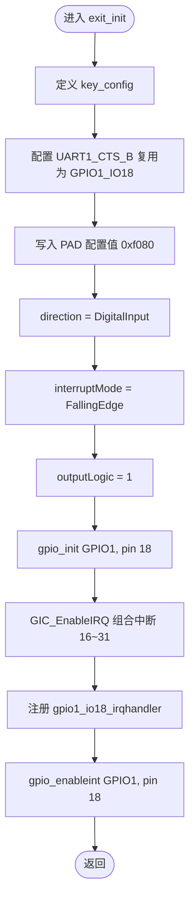
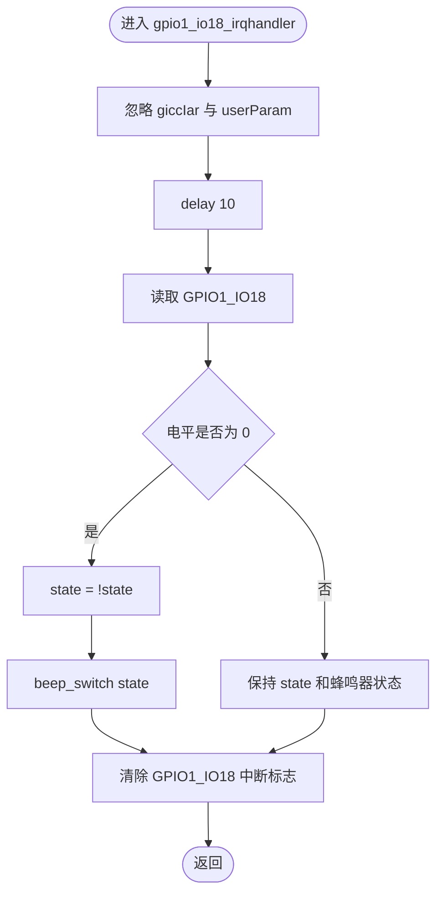
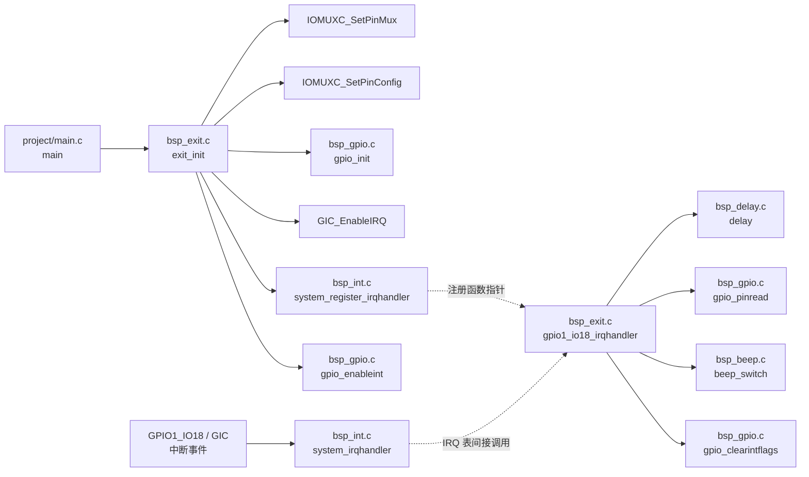
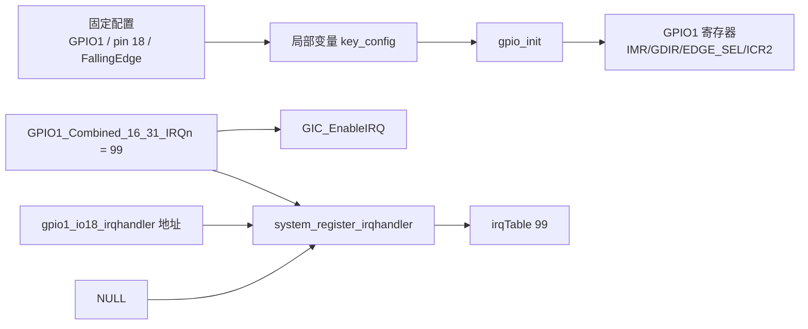
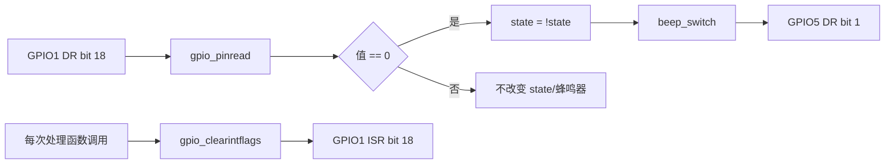
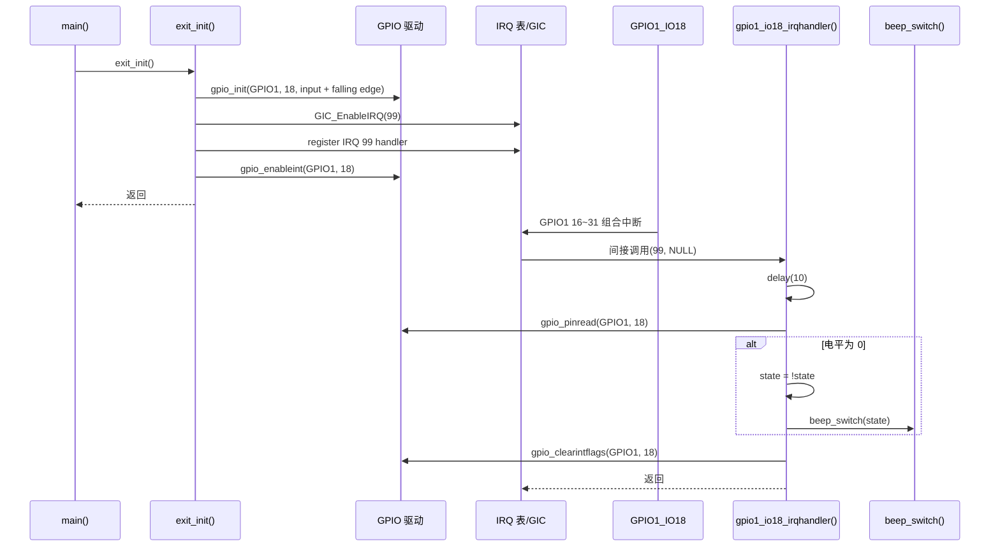

# `bsp_exit.c` 详细设计说明书

## 1. 文档范围

本文档基于以下实际代码进行分析：

- `bsp/exit/bsp_exit.c`
- `bsp/exit/bsp_exit.h`
- 与本文件直接相关的 `bsp_gpio.h/.c`、`bsp_int.h/.c`、`bsp_delay.h/.c`、`bsp_beep.h/.c`
- 用于确认调用入口和芯片定义的 `project/main.c`、`imx6ul/imx6ul.h`、`imx6ul/MCIMX6Y2.h`、`imx6ul/fsl_iomuxc.h`、`imx6ul/core_ca7.h`

本文只描述代码中能够确认的行为。板级原理图、按键电路、电气参数和芯片手册未包含在分析范围内；相关结论无法由代码确认时，均标注为“需结合其他文件确认”。

## 2. 文件职责

`bsp_exit.c` 负责 GPIO1_IO18 外部中断功能，包含以下职责：

1. 将 `UART1_CTS_B` 复用为 `GPIO1_IO18`。
2. 写入 GPIO1_IO18 的 IOMUXC PAD 配置值。
3. 将 GPIO1_IO18 初始化为下降沿触发的数字输入。
4. 使能 GIC 中的 GPIO1 16~31 组合中断。
5. 将 `gpio1_io18_irqhandler()` 注册为该组合中断的 C 级处理函数。
6. 使能 GPIO1_IO18 的 GPIO 中断。
7. 中断发生后执行延时消抖，读取引脚电平；确认低电平时翻转内部状态并切换蜂鸣器状态，最后清除 GPIO 中断标志。

该文件不负责：

- 初始化整个中断控制器和 IRQ 分发表；由 `bsp_int.c` 负责。
- 初始化蜂鸣器 GPIO；由 `bsp_beep.c` 负责。
- 初始化 GPIO 公共驱动；由 `bsp_gpio.c` 提供。
- 判断 GPIO1 16~31 组合中断中除 IO18 外的其他中断源。

## 3. 外部依赖

### 3.1 直接包含的头文件

| 头文件 | 本文件使用的内容 | 依赖用途 |
|---|---|---|
| `bsp_exit.h` | `exit_init()`、`gpio1_io18_irqhandler()` 声明；间接包含 `imx6ul.h` | 保证实现与公开接口一致，并取得芯片基础定义 |
| `bsp_gpio.h` | `gpio_pin_config_t`、`kGPIO_DigitalInput`、`kGPIO_IntFallingEdge`、`gpio_init()`、`gpio_pinread()`、`gpio_enableint()`、`gpio_clearintflags()` | GPIO 配置、读电平、中断使能和中断标志清除 |
| `bsp_int.h` | `system_register_irqhandler()` | 向系统 IRQ 表注册处理函数 |
| `bsp_delay.h` | `delay()` | 中断处理中的延时消抖 |
| `bsp_beep.h` | `beep_switch()` | 根据内部状态切换蜂鸣器 |

### 3.2 间接芯片依赖

| 标识符 | 定义来源 | 实际代码含义 |
|---|---|---|
| `IOMUXC_UART1_CTS_B_GPIO1_IO18` | `fsl_iomuxc.h` | 展开为调用 IOMUXC 接口所需的 5 个引脚配置参数 |
| `IOMUXC_SetPinMux()` | `fsl_iomuxc.h` | 写复用寄存器，将目标 PAD 选择为 GPIO1_IO18 功能 |
| `IOMUXC_SetPinConfig()` | `fsl_iomuxc.h` | 向目标 PAD 配置寄存器写入配置值 |
| `GPIO1` | `MCIMX6Y2.h` | GPIO1 外设基地址指针，地址为 `0x0209C000` |
| `GPIO1_Combined_16_31_IRQn` | `MCIMX6Y2.h` | GPIO1 IO16~IO31 的组合中断，枚举值为 `99` |
| `GIC_EnableIRQ()` | `core_ca7.h` | 使能指定 GIC 中断号 |
| `NULL` | 间接包含的公共定义 | 注册中断时使用的空用户参数 |

### 3.3 调用前置条件

根据 `project/main.c` 的实际调用顺序：

1. `int_init()` 在 `exit_init()` 之前执行，因此系统 IRQ 表已初始化。
2. `beep_init()` 在 `exit_init()` 之前执行，因此本示例中蜂鸣器已完成初始化。
3. `clk_enable()` 在 `exit_init()` 之前执行，但 GPIO1/IOMUXC 具体时钟依赖需结合时钟模块和芯片手册确认。

若其他程序单独复用本模块，上述调用顺序是否仍成立，需结合其他文件确认。

## 4. 本文件宏定义

`bsp_exit.c` 未定义任何宏。

本文件使用的关键外部宏或枚举常量如下：

| 名称 | 值或展开信息 | 用途 |
|---|---|---|
| `IOMUXC_UART1_CTS_B_GPIO1_IO18` | `0x020E008C, 0x5, 0, 0, 0x020E0318` | 指定复用寄存器、GPIO 复用模式和 PAD 配置寄存器 |
| `GPIO1` | `((GPIO_Type *)0x0209C000)` | 访问 GPIO1 寄存器 |
| `GPIO1_Combined_16_31_IRQn` | `99` | GIC 使能和中断处理函数注册 |
| `kGPIO_DigitalInput` | `0` | 配置 GPIO1_IO18 为输入 |
| `kGPIO_IntFallingEdge` | `4` | 配置 GPIO1_IO18 为下降沿触发 |

## 5. 全局变量、静态变量、结构体与枚举

### 5.1 文件级全局变量

无。

### 5.2 文件级静态变量

无。

### 5.3 静态局部变量

| 变量 | 所属函数 | 类型 | 初始化 | 读写方式 | 作用 |
|---|---|---|---|---|---|
| `state` | `gpio1_io18_irqhandler()` | `static unsigned char` | C 语言静态存储期对象，未显式初始化，初始值为 `0` | 条件成立时读取旧值并写入逻辑非值；随后读取并传给 `beep_switch()` | 在多次中断调用之间保存蜂鸣器切换状态 |

`state` 的值只会在确认 GPIO1_IO18 为低电平时于 `0` 和 `1` 之间翻转。

### 5.4 本文件定义的结构体

无。

### 5.5 本文件使用的外部结构体

#### `gpio_pin_config_t`

定义于 `bsp_gpio.h`，本文件在 `exit_init()` 中创建该类型的局部变量。

| 成员 | 类型 | 本文件赋值 | 用途 |
|---|---|---|---|
| `direction` | `gpio_pin_direction_t` | `kGPIO_DigitalInput` | 指定 GPIO1_IO18 为数字输入 |
| `outputLogic` | `uint8_t` | `1` | GPIO 驱动说明该成员仅在输出模式使用；本函数配置为输入，因此该值不会被 `gpio_init()` 用于写输出 |
| `interruptMode` | `gpio_interrupt_mode_t` | `kGPIO_IntFallingEdge` | 指定下降沿中断触发模式 |

### 5.6 本文件定义的枚举

无。

### 5.7 本文件使用的外部枚举

| 枚举类型或枚举值 | 定义位置 | 用途 |
|---|---|---|
| `gpio_pin_direction_t` / `kGPIO_DigitalInput` | `bsp_gpio.h` | GPIO 方向配置 |
| `gpio_interrupt_mode_t` / `kGPIO_IntFallingEdge` | `bsp_gpio.h` | GPIO 中断触发方式配置 |
| `IRQn_Type` / `GPIO1_Combined_16_31_IRQn` | `MCIMX6Y2.h` | GIC 中断号及 IRQ 表索引 |

## 6. 函数总览

| 函数 | 链接属性 | 功能 | 直接调用者 |
|---|---|---|---|
| `exit_init(void)` | 外部链接 | 初始化 GPIO1_IO18 外部中断并注册处理函数 | `project/main.c` |
| `gpio1_io18_irqhandler(unsigned int, void *)` | 外部链接 | 处理 GPIO1_IO18 中断，消抖后切换蜂鸣器并清除中断标志 | `bsp_int.c` 中的 `system_irqhandler()` 通过 IRQ 表间接调用 |

本文件没有静态函数。

## 7. 函数详细设计

### 7.1 `exit_init`

#### 7.1.1 功能

完成 GPIO1_IO18 外部中断的引脚复用、PAD 配置、GPIO 输入及下降沿触发配置、GIC 中断使能、处理函数注册和 GPIO 中断使能。

#### 7.1.2 原型

```c
void exit_init(void);
```

#### 7.1.3 入参

无。

#### 7.1.4 返回值

无。

函数调用的各底层接口均没有在此处返回错误码，因此本函数无法向调用者报告初始化失败。

#### 7.1.5 局部变量

| 名称 | 类型 | 初始化方式 | 用途 |
|---|---|---|---|
| `key_config` | `gpio_pin_config_t` | 成员逐项赋值 | 向 `gpio_init()` 传递 GPIO1_IO18 配置 |

#### 7.1.6 读写全局变量及硬件资源

本函数不直接读写 C 文件级全局变量。

通过外部函数或内联函数间接写入以下资源：

| 资源 | 访问方式 | 作用 |
|---|---|---|
| IOMUXC 复用寄存器 `0x020E008C` | `IOMUXC_SetPinMux(...)` | 将 PAD 复用模式写为 `0x5`，对应宏名中的 GPIO1_IO18 功能 |
| IOMUXC PAD 配置寄存器 `0x020E0318` | `IOMUXC_SetPinConfig(..., 0xf080)` | 写入原始 PAD 配置值 `0xf080` |
| GPIO1 `IMR`、`GDIR`、`EDGE_SEL`、`ICR2` | `gpio_init(GPIO1, 18, &key_config)` | 初始化 GPIO1_IO18 为输入并配置下降沿中断 |
| GIC 中断使能寄存器 | `GIC_EnableIRQ(GPIO1_Combined_16_31_IRQn)` | 使能中断号 99 |
| `bsp_int.c` 内部静态 `irqTable[99]` | `system_register_irqhandler(...)` | 写入处理函数指针和空用户参数 |
| GPIO1 `IMR` | `gpio_enableint(GPIO1, 18)` | 使能 GPIO1_IO18 中断屏蔽位 |

PAD 值 `0xf080` 各位对应的完整电气意义需结合芯片参考手册确认；从头文件位定义只能确认该原始值被写入 PAD 配置寄存器。

#### 7.1.7 调用关系

文件内调用：

- 无。

文件外调用：

| 被调用函数 | 所属模块 | 作用 |
|---|---|---|
| `IOMUXC_SetPinMux()` | `fsl_iomuxc.h`，静态内联 | 配置引脚复用 |
| `IOMUXC_SetPinConfig()` | `fsl_iomuxc.h`，静态内联 | 配置 PAD 控制值 |
| `gpio_init()` | `bsp_gpio.c` | 配置 GPIO 方向与中断触发模式 |
| `GIC_EnableIRQ()` | `core_ca7.h`，静态内联 | 使能 GIC 中断 |
| `system_register_irqhandler()` | `bsp_int.c` | 注册 C 级中断处理函数 |
| `gpio_enableint()` | `bsp_gpio.c` | 使能 GPIO 引脚中断 |

作为参数引用但不直接调用：

- `gpio1_io18_irqhandler`：函数地址被写入 IRQ 表，后续由统一 IRQ 分发器调用。

#### 7.1.8 执行流程

1. 创建局部 GPIO 配置对象 `key_config`。
2. 将 `UART1_CTS_B` PAD 复用为 `GPIO1_IO18`。
3. 将原始 PAD 配置值 `0xf080` 写入对应 PAD 配置寄存器。
4. 设置 `key_config.direction = kGPIO_DigitalInput`。
5. 设置 `key_config.interruptMode = kGPIO_IntFallingEdge`。
6. 设置 `key_config.outputLogic = 1`；由于方向为输入，当前 `gpio_init()` 实现不会使用此值写引脚。
7. 调用 `gpio_init(GPIO1, 18, &key_config)`：
   - 先屏蔽 GPIO1_IO18 中断；
   - 将 GPIO1_IO18 配置为输入；
   - 将其中断模式配置为下降沿。
8. 使能 GIC 中的 GPIO1 IO16~IO31 组合中断。
9. 将 `gpio1_io18_irqhandler` 和 `NULL` 用户参数注册到中断号 99 对应的 IRQ 表项。
10. 使能 GPIO1_IO18 的 GPIO 中断。

#### 7.1.9 Mermaid 流程图



### 7.2 `gpio1_io18_irqhandler`

#### 7.2.1 功能

作为 GPIO1_IO18 的中断处理函数，先进行阻塞延时，再读取 GPIO1_IO18 输入电平；若电平为 `0`，则翻转静态状态并调用 `beep_switch()`。无论电平判断结果如何，最后都清除 GPIO1_IO18 中断标志。

#### 7.2.2 原型

```c
void gpio1_io18_irqhandler(unsigned int giccIar, void *userParam);
```

#### 7.2.3 入参

| 参数 | 类型 | 实际来源 | 本函数处理 |
|---|---|---|---|
| `giccIar` | `unsigned int` | `system_irqhandler()` 传入的中断号；对当前注册项为 `99` | 显式转换为 `void`，不参与逻辑 |
| `userParam` | `void *` | 注册时传入的 `NULL` | 显式转换为 `void`，不参与逻辑 |

#### 7.2.4 返回值

无。

#### 7.2.5 局部变量

普通自动局部变量：无。

静态局部变量：

| 名称 | 类型 | 初值 | 用途 |
|---|---|---|---|
| `state` | `static unsigned char` | `0` | 保存跨中断调用的蜂鸣器切换状态 |

#### 7.2.6 读写全局变量及硬件资源

| 对象或资源 | 访问类型 | 访问路径 | 条件 |
|---|---|---|---|
| 静态局部变量 `state` | 读写 | `state = !state`，随后作为 `beep_switch(state)` 实参读取 | GPIO1_IO18 读取值为 `0` |
| GPIO1 数据寄存器 `DR` 的 bit 18 | 读 | `gpio_pinread(GPIO1, 18)` | 延时结束后 |
| 蜂鸣器 GPIO5 数据寄存器 `DR` 的 bit 1 | 间接读改写 | `beep_switch(state)` | GPIO1_IO18 读取值为 `0` |
| GPIO1 中断状态寄存器 `ISR` 的 bit 18 | 间接写 | `gpio_clearintflags(GPIO1, 18)` | 每次处理函数结束前 |

#### 7.2.7 调用关系

文件内调用：

- 无。

文件外调用：

| 被调用函数 | 所属模块 | 作用 |
|---|---|---|
| `delay(10)` | `bsp_delay.c` | 忙等待延时，用于示例中的消抖 |
| `gpio_pinread(GPIO1, 18)` | `bsp_gpio.c` | 读取 GPIO1_IO18 输入电平 |
| `beep_switch(state)` | `bsp_beep.c` | `state == 1` 时打开蜂鸣器，`state == 0` 时关闭蜂鸣器 |
| `gpio_clearintflags(GPIO1, 18)` | `bsp_gpio.c` | 清除 GPIO1_IO18 中断状态 |

调用者：

- `system_irqhandler()` 根据中断号索引 `irqTable`，通过已注册的函数指针间接调用本函数。

#### 7.2.8 执行流程

1. 进入中断处理函数。
2. 将未使用的 `giccIar` 和 `userParam` 显式转换为 `void`。
3. 调用 `delay(10)` 执行忙等待延时。
4. 读取 GPIO1_IO18 电平。
5. 若读取结果等于 `0`：
   - 将 `state` 翻转；
   - 调用 `beep_switch(state)` 切换蜂鸣器。
6. 若读取结果不等于 `0`，不修改 `state`，也不调用 `beep_switch()`。
7. 清除 GPIO1_IO18 中断标志。
8. 返回统一 IRQ 处理流程。

#### 7.2.9 Mermaid 流程图



## 8. 文件级调用关系

### 8.1 调用关系说明

- 正常初始化路径：`main()` 调用 `exit_init()`，由其配置硬件并注册处理函数。
- 中断路径：GPIO1_IO18 产生中断后，经 GIC 和汇编 IRQ 入口进入 `system_irqhandler()`；该函数查询 IRQ 表并间接调用 `gpio1_io18_irqhandler()`。
- `gpio1_io18_irqhandler()` 根据输入电平决定是否调用蜂鸣器驱动，并始终清除 IO18 中断标志。
- 汇编 IRQ 入口、GIC 应答和中断结束处理的完整实现需结合其他文件确认。

### 8.2 Mermaid 调用关系图



## 9. 数据流分析

### 9.1 初始化数据流



### 9.2 中断处理数据流



### 9.3 状态数据

| 数据 | 产生位置 | 消费位置 | 生命周期 | 备注 |
|---|---|---|---|---|
| `key_config` | `exit_init()` | `gpio_init()` | 单次初始化调用 | 指针仅在同步调用期间使用 |
| 处理函数地址 | `exit_init()` | `system_register_irqhandler()` / `system_irqhandler()` | 注册后持续有效 | 函数具有外部链接和程序全生命周期 |
| `state` | `gpio1_io18_irqhandler()` | 同一函数及 `beep_switch()` | 程序全生命周期 | 初值为 `0`，仅确认低电平时翻转 |
| GPIO1_IO18 电平 | GPIO1 数据寄存器 | `gpio_pinread()` / 条件判断 | 单次 ISR 读取 | 与实际按键电路的对应关系需结合原理图确认 |

## 10. 时序关系



## 11. 风险与改进建议

| 风险或限制 | 实际代码依据 | 影响 | 改进建议 |
|---|---|---|---|
| ISR 内执行忙等待延时 | `gpio1_io18_irqhandler()` 调用 `delay(10)`；`delay()` 使用循环忙等待 | 延长中断占用时间，影响其他中断响应；实际延时时长受 CPU 频率和编译优化影响 | 使用定时器或延后处理机制完成消抖，ISR 只记录事件并清除标志 |
| 组合中断处理函数只处理 IO18 | 注册的是 `GPIO1_Combined_16_31_IRQn`，处理函数固定读取和清除 pin 18 | 若 GPIO1 IO16~31 其他引脚也启用中断，同一 IRQ 到来时本函数不会识别或清除其他源 | 在组合 IRQ 处理函数中读取 GPIO1 `ISR`，分发并清除所有已启用的有效中断源 |
| 清除接口可能同时清除其他 GPIO1 中断标志 | `gpio_clearintflags()` 对写 1 清除的 `ISR` 执行 `base->ISR \|= 1U << pin`；读改写会把读取时已为 1 的其他位也写回 1 | GPIO1 上同时挂起的其他中断标志可能被一并清除，导致事件丢失 | 对写 1 清除寄存器直接写目标位掩码，例如 `base->ISR = 1U << pin`；修改公共 GPIO 驱动前应评估所有调用方 |
| 初始化前未显式清除历史中断标志 | `exit_init()` 在 `gpio_enableint()` 前没有调用 `gpio_clearintflags()` | 若硬件中已有挂起标志，使能后可能立即进入中断；是否发生需结合芯片状态确认 | 在注册处理函数之后、使能 GPIO 中断之前清除目标引脚挂起标志 |
| GPIO 中断先在 GIC 使能，后注册处理函数 | `GIC_EnableIRQ()` 位于 `system_register_irqhandler()` 之前 | 若 GPIO/GIC 中存在挂起事件，注册完成前可能由默认处理函数处理；是否可能取决于全局中断状态和硬件状态，需结合其他文件确认 | 建议先配置并注册处理函数、清除挂起标志，再使能 GPIO 和 GIC 中断 |
| 无初始化错误反馈 | `exit_init()` 返回 `void`，底层接口也无错误码 | 调用者无法检测配置失败或参数异常 | 若项目需要可诊断性，为底层接口增加参数校验和状态返回 |
| 使用魔数配置 PAD | `IOMUXC_SetPinConfig(..., 0xf080)` | 可读性较低，具体电气配置不直观 | 使用芯片头文件位域宏组合配置值，并附上经芯片手册确认的位含义 |
| `state` 与蜂鸣器实际状态可能不同步 | `state` 初始为 0，ISR 中独立翻转；没有读取蜂鸣器当前状态 | 若其他模块调用 `beep_switch()`，或初始化顺序改变，下一次中断的切换结果可能不代表“反转当前硬件状态” | 由蜂鸣器模块统一维护状态并提供 toggle 接口，或明确该模块拥有蜂鸣器控制权 |
| `outputLogic = 1` 对输入配置无效 | `gpio_init()` 仅在输出方向时使用 `outputLogic` | 容易让维护者误认为会设置输入默认电平 | 对输入配置使用明确的初始化方式，或在 GPIO API 中拆分输入/输出配置 |
| 参数未用于验证中断来源 | `giccIar` 和 `userParam` 均被忽略 | 处理函数无法通过参数检查或扩展上下文 | 若组合 IRQ 统一分发，可利用用户参数传入 GPIO 基址、引脚号或回调上下文 |

## 12. 需结合其他文件确认的事项

1. GPIO1_IO18 连接的实际按键、电路有效电平及外部上拉/下拉配置，需结合板级原理图确认。
2. PAD 配置值 `0xf080` 的完整电气效果及是否适合该硬件，需结合芯片参考手册和板级设计确认。
3. 汇编 IRQ 入口如何读取 GICC_IAR、何时写入 GICC_EOIR，以及全局中断何时开启，需结合启动和异常处理代码确认。
4. GPIO1/IOMUXC 时钟是否在调用 `exit_init()` 前稳定开启，需结合时钟初始化代码和芯片手册确认。
5. 系统是否允许嵌套中断，以及 ISR 忙等待期间其他中断的行为，需结合异常配置和中断屏蔽策略确认。
