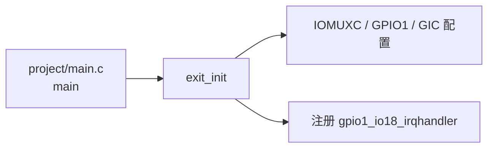
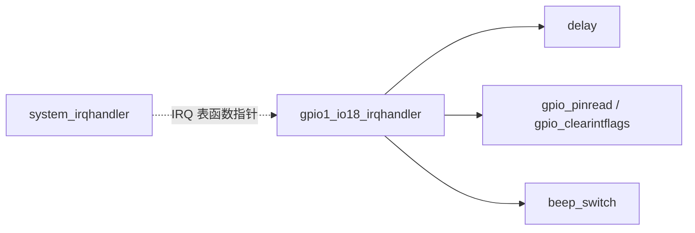
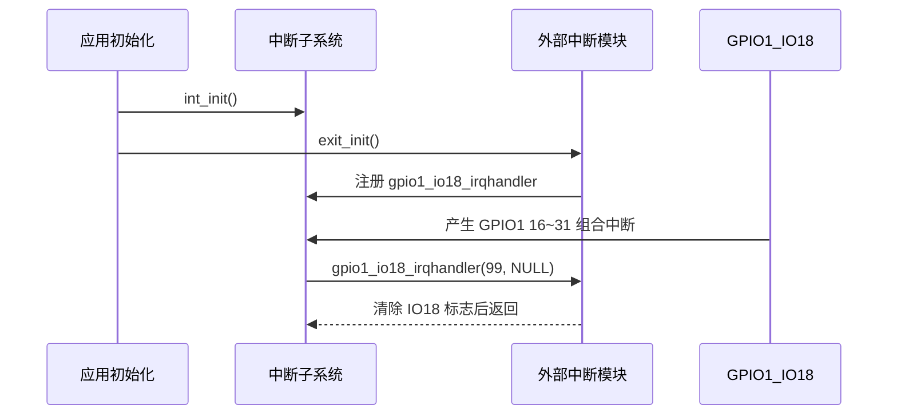

# `bsp_exit.h` 详细设计说明书

## 1. 文件职责

`bsp_exit.h` 是 GPIO1_IO18 外部中断模块的公开接口头文件，职责如下：

1. 通过头文件保护宏避免同一编译单元内重复包含。
2. 包含 `imx6ul.h`，向使用者提供本接口及其工程环境所需的基础芯片定义。
3. 声明外部中断初始化函数 `exit_init()`。
4. 声明 GPIO1_IO18 中断处理函数 `gpio1_io18_irqhandler()`，使其能够在实现文件中注册，也允许其他编译单元引用。

## 2. 外部依赖

### 2.1 直接依赖

| 头文件 | 依赖内容 | 说明 |
|---|---|---|
| `imx6ul.h` | 工程公共类型及芯片头文件集合 | 当前两个函数声明仅使用 C 基础类型；是否必须直接包含该头文件，需结合工程整体头文件约定确认 |

### 2.2 `imx6ul.h` 的直接包含项

根据实际代码，`imx6ul.h` 包含：

- `cc.h`
- `MCIMX6Y2.h`
- `fsl_common.h`
- `fsl_iomuxc.h`
- `core_ca7.h`

这些头文件为 BSP 模块提供公共宏、芯片寄存器、IOMUXC 和 Cortex-A7/GIC 接口。`bsp_exit.h` 自身的函数声明没有直接暴露芯片结构体或枚举类型。

## 3. 宏定义

### 3.1 头文件保护宏

| 宏 | 定义位置 | 功能 |
|---|---|---|
| `_BSP_EXIT_H` | `bsp_exit.h` | 防止头文件被重复展开 |

保护逻辑：

```c
#ifndef _BSP_EXIT_H
#define _BSP_EXIT_H
...
#endif
```

风险：以下划线开头且后接大写字母的标识符通常属于实现保留命名空间。建议改为项目唯一且不使用保留形式的名称，例如 `BSP_EXIT_H` 或 `IMX6UL_BSP_EXIT_H`。

## 4. 全局变量、静态变量、结构体与枚举

| 项目 | 本头文件定义情况 |
|---|---|
| 全局变量声明 | 无 |
| 静态变量 | 无 |
| 结构体定义或声明 | 无 |
| 枚举定义或声明 | 无 |
| 类型别名 | 无 |

## 5. 公开函数接口

### 5.1 接口总览

| 函数 | 功能 | 实现位置 |
|---|---|---|
| `exit_init(void)` | 初始化 GPIO1_IO18 外部中断 | `bsp_exit.c` |
| `gpio1_io18_irqhandler(unsigned int giccIar, void *userParam)` | 处理 GPIO1_IO18 中断 | `bsp_exit.c` |

### 5.2 `exit_init`

#### 功能

初始化 GPIO1_IO18 外部中断。实际实现包括引脚复用、PAD 配置、GPIO 输入及下降沿中断配置、GIC 使能、处理函数注册和 GPIO 中断使能。

#### 原型

```c
void exit_init(void);
```

#### 入参

无。

#### 返回值

无。

#### 调用约束

根据当前 `project/main.c`：

- 在调用本函数前已调用 `int_init()` 初始化中断系统。
- 在调用本函数前已调用 `beep_init()` 初始化蜂鸣器。
- 本函数只在初始化阶段调用一次。

是否支持重复调用，代码没有显式限制；重复调用会重复写配置和 IRQ 表项，其系统级影响需结合其他文件确认。

#### 调用关系



### 5.3 `gpio1_io18_irqhandler`

#### 功能

GPIO1_IO18 的 C 级中断处理函数。实际实现会延时、读取 GPIO1_IO18，确认低电平后翻转内部状态并切换蜂鸣器，最后清除 GPIO1_IO18 中断标志。

#### 原型

```c
void gpio1_io18_irqhandler(unsigned int giccIar, void *userParam);
```

#### 入参

| 参数 | 类型 | 接口含义 | 当前实现 |
|---|---|---|---|
| `giccIar` | `unsigned int` | 由 IRQ 分发器传入的中断标识 | 未使用 |
| `userParam` | `void *` | 注册处理函数时关联的用户上下文 | 注册值为 `NULL`，当前实现未使用 |

参数名称 `giccIar` 暗示其与 GIC 中断应答值有关，但当前 `system_irqhandler()` 实际传给处理函数的是掩码后的中断号 `intNum`。该参数的命名和设计意图是否需要调整，需结合中断框架设计确认。

#### 返回值

无。

#### 调用关系



## 6. 接口使用流程



## 7. 数据流分析

| 数据 | 来源 | 去向 | 说明 |
|---|---|---|---|
| 中断处理函数地址 | `gpio1_io18_irqhandler` 声明对应的函数符号 | `exit_init()` 注册到系统 IRQ 表 | 使统一 IRQ 分发器能够调用模块处理函数 |
| 中断号 | `GPIO1_Combined_16_31_IRQn`，值为 99 | IRQ 表索引及处理函数第一个参数 | 该常量未在本头文件中暴露 |
| 用户参数 | `exit_init()` 注册时传入 `NULL` | `gpio1_io18_irqhandler()` 的 `userParam` | 当前处理函数忽略该参数 |

## 8. 风险与改进建议

| 风险或限制 | 实际依据 | 改进建议 |
|---|---|---|
| 头文件保护宏使用保留命名形式 | `_BSP_EXIT_H` 以下划线和大写字母开头 | 改为 `BSP_EXIT_H` 或带项目名前缀的唯一宏 |
| 中断处理函数作为公共接口暴露 | `gpio1_io18_irqhandler()` 在头文件中声明 | 若只有 `bsp_exit.c` 注册和中断框架调用，可评估将声明限制在实现文件；但当前注册位置就在实现文件中，是否有其他链接或测试需求需结合工程约定确认 |
| 接口缺少文档注释 | 头文件只有函数原型 | 增加简洁的接口注释，说明初始化前置条件、参数来源和 ISR 使用限制 |
| `imx6ul.h` 可能扩大头文件耦合 | 函数声明仅依赖 `unsigned int` 和 `void *` | 若工程规范允许，可移除不必要包含；是否依赖其间接定义或统一包含策略需结合构建和其他文件确认 |
| 初始化接口没有状态返回 | `exit_init()` 返回 `void` | 若底层未来支持错误检测，可改为返回状态码 |
| IRQ 参数命名与实际传值可能不一致 | 参数名为 `giccIar`，而分发器传入 `intNum` | 统一中断框架的参数命名和语义，例如改为 `irq` 或明确传递原始 GICC_IAR |

## 9. 需结合其他文件确认的事项

1. `gpio1_io18_irqhandler()` 是否因测试、链接脚本或其他模块需求必须保持公开声明。
2. 工程是否规定所有 BSP 头文件必须包含 `imx6ul.h`。
3. 初始化函数的重复调用语义和错误处理规范。
4. 中断处理函数第一个参数预期表示原始 GICC_IAR 还是已解析的 IRQ 编号。
