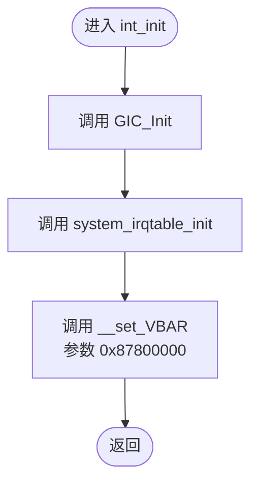
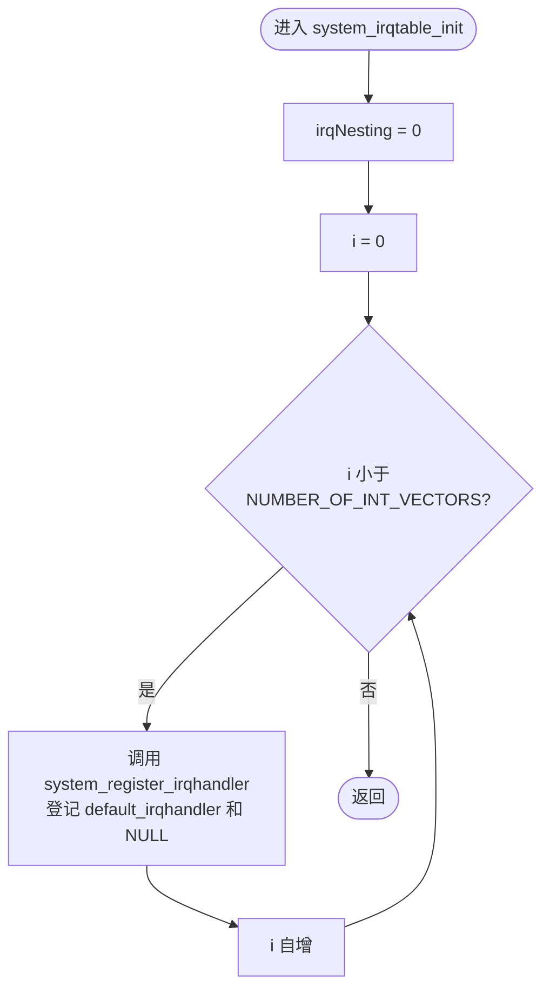
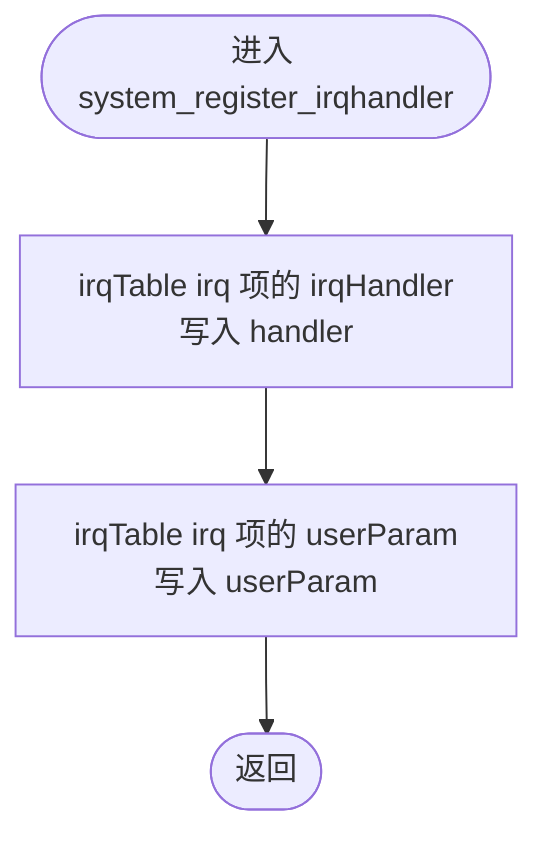
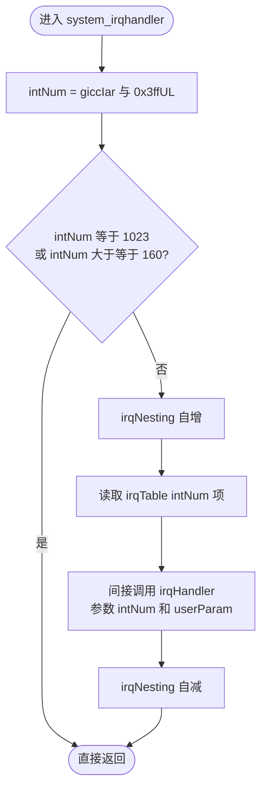
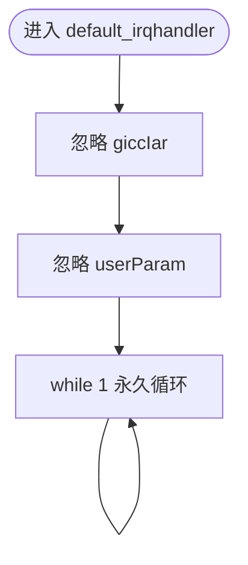
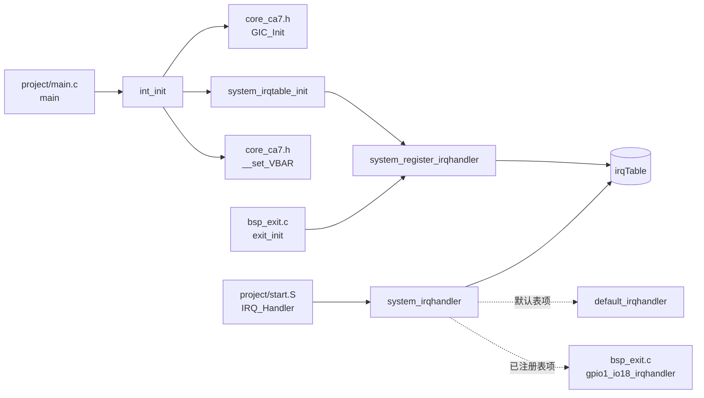
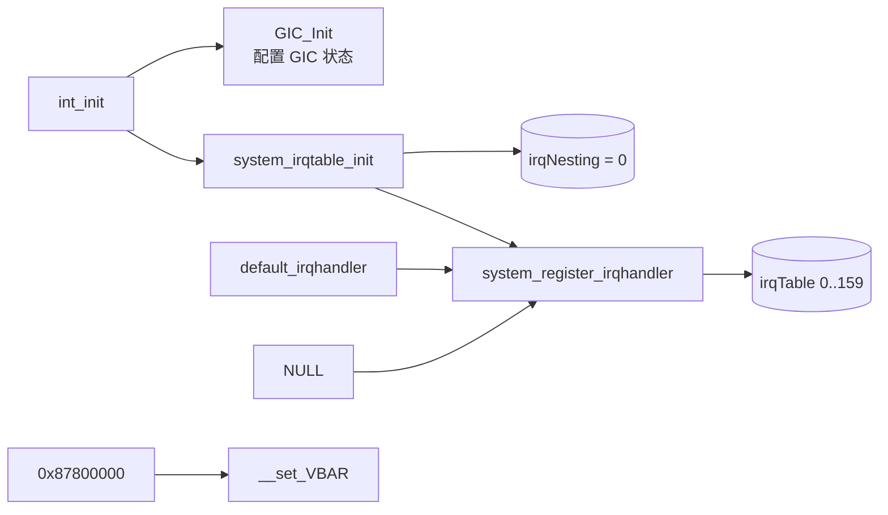
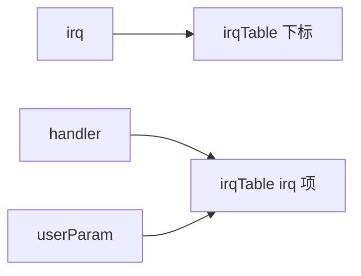
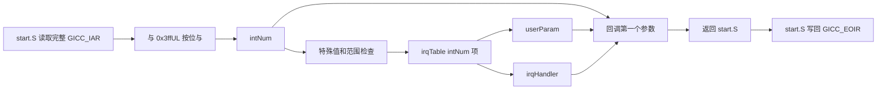
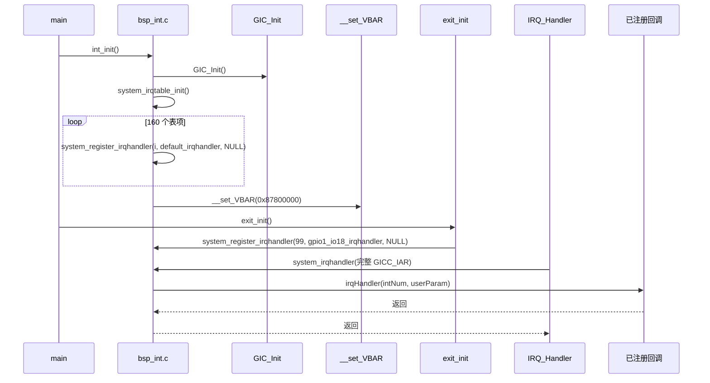

# `bsp_int.c` 详细设计文档

## 1. 文档范围与分析依据

本文档分析 `bsp_int.c` 的实际实现，并结合以下当前工程文件确认类型、常量、外部函数和调用关系：

- `bsp_int.h`
- `../../imx6ul/imx6ul.h`
- `../../imx6ul/MCIMX6Y2.h`
- `../../imx6ul/core_ca7.h`
- `../../project/start.S`
- `../../project/main.c`
- `../exit/bsp_exit.c`
- `../../imx6ul.lds`
- `../../Makefile`

本文档只描述当前代码能够确认的行为。中断控制器的完整硬件语义、异常嵌套策略、启动时 BSS 初始化方式以及当前工程之外的调用方式，无法仅由本文件确认时均标注为“需结合其他文件确认”。

## 2. 文件职责

`bsp_int.c` 是当前裸机工程的 C 层中断分发实现，承担以下职责：

1. 调用外部 GIC 初始化函数。
2. 将 C 层中断处理表全部初始化为默认处理函数。
3. 设置异常向量表基地址为固定地址 `0x87800000`。
4. 为指定中断号登记处理函数和用户参数。
5. 接收汇编 IRQ 入口传入的 `GICC_IAR` 值，提取中断号并调用已登记处理函数。
6. 使用计数器记录进入和退出有效中断分发时的嵌套层数。
7. 对未登记专用处理函数的中断执行永久循环的默认处理。

本文件不负责：

- 使能具体外设中断；当前工程由其他模块调用 `GIC_EnableIRQ()`。
- 读取 `GICC_IAR` 或写入 `GICC_EOIR`；当前工程由 `project/start.S` 完成。
- 清除具体外设的中断状态标志。
- 校验注册参数是否合法。
- 对 `irqNesting` 提供文件外查询接口。

## 3. 外部依赖

### 3.1 头文件依赖

| 头文件 | 直接/间接 | 本文件使用内容 | 实际来源 |
| --- | --- | --- | --- |
| `bsp_int.h` | 直接 | `sys_irq_handle_t`、`system_irq_handler_t`、函数声明 | 本模块公开头文件 |
| `imx6ul.h` | 间接 | 汇总包含芯片和 Cortex-A7 相关定义 | 由 `bsp_int.h` 包含 |
| `MCIMX6Y2.h` | 间接 | `NUMBER_OF_INT_VECTORS`、`IRQn_Type` | 由 `imx6ul.h` 包含 |
| `core_ca7.h` | 间接 | `GIC_Init()`、`__set_VBAR()` | 由 `imx6ul.h` 包含 |
| `cc.h` | 间接 | `uint32_t` | 由芯片头文件包含 |

### 3.2 外部常量与类型依赖

| 名称 | 定义位置 | 当前工程中的实际定义/用途 |
| --- | --- | --- |
| `NUMBER_OF_INT_VECTORS` | `MCIMX6Y2.h` | 定义为 `160`，用于确定 `irqTable` 长度及初始化、分发边界 |
| `IRQn_Type` | `MCIMX6Y2.h` | 中断号枚举类型；实际枚举包含负值 `NotAvail_IRQn = -128` 以及 `0` 至 `159` 的中断号 |
| `uint32_t` | `cc.h` | 定义为 `unsigned int`；用于保存提取后的中断号以及 VBAR 参数强制转换 |
| `system_irq_handler_t` | `bsp_int.h` | C 层中断回调函数指针类型 |
| `sys_irq_handle_t` | `bsp_int.h` | 保存回调函数与用户参数的中断处理表项类型 |

### 3.3 外部函数依赖

| 函数 | 定义位置 | 调用位置 | 实际作用 |
| --- | --- | --- | --- |
| `GIC_Init()` | `core_ca7.h`，静态内联函数 | `int_init()` | 根据当前实现初始化 GIC，禁用中断并使能 Group 0 分发和信号 |
| `__set_VBAR(uint32_t)` | `core_ca7.h`，静态内联函数 | `int_init()` | 通过 CP15 操作设置向量表基地址寄存器 |

`GIC_Init()` 和 `__set_VBAR()` 虽由头文件以内联形式提供，但从 `bsp_int.c` 模块职责角度属于文件外依赖。

### 3.4 当前工程中的外部调用方

| 调用方 | 被调用接口 | 实际用途 |
| --- | --- | --- |
| `project/main.c:main()` | `int_init()` | 在其他 BSP 初始化前初始化中断子系统 |
| `project/start.S:IRQ_Handler` | `system_irqhandler()` | 将读取的 `GICC_IAR` 值传给 C 层中断分发器 |
| `bsp/exit/bsp_exit.c:exit_init()` | `system_register_irqhandler()` | 为 `GPIO1_Combined_16_31_IRQn` 登记 `gpio1_io18_irqhandler` 和 `NULL` 参数 |

当前工程源文件中未发现对 `system_irqtable_init()` 和 `default_irqhandler()` 的直接文件外调用；两者仍具有外部链接并在 `bsp_int.h` 中公开声明。是否存在当前工程之外的调用方，需结合其他文件确认。

### 3.5 与汇编 IRQ 入口的边界

当前工程 `project/start.S:IRQ_Handler` 执行以下与本文件直接相关的操作：

1. 保存 IRQ 上下文。
2. 定位 GIC CPU 接口并读取偏移 `0x0c` 的 `GICC_IAR`。
3. 将完整 `GICC_IAR` 值作为第一个参数调用 `system_irqhandler()`。
4. `system_irqhandler()` 返回后，将同一值写入偏移 `0x10` 的 `GICC_EOIR`。
5. 恢复上下文并从 IRQ 返回。

因此，`bsp_int.c` 只负责 C 层回调分发，不负责中断确认值的读取和结束中断写回。

## 4. 宏定义

`bsp_int.c` 未定义宏。

本文件使用的宏如下：

| 宏 | 来源 | 实际值/作用 |
| --- | --- | --- |
| `NUMBER_OF_INT_VECTORS` | `MCIMX6Y2.h` | 当前定义为 `160`；决定处理表容量和有效中断号上界 |
| `NULL` | 间接依赖 | 在初始化处理表时登记空用户参数；其具体定义需结合其他文件确认 |

以下常量直接写在代码中，不是宏：

| 常量 | 使用位置 | 作用 |
| --- | --- | --- |
| `0x87800000` | `int_init()` | 传给 `__set_VBAR()`；与当前 `imx6ul.lds` 中链接起始地址一致 |
| `0x3ffUL` | `system_irqhandler()` | 提取 `giccIar` 的低 10 位 |
| `1023` | `system_irqhandler()` | 作为直接返回的特殊中断号进行判断 |

`1023` 的完整硬件含义需结合芯片或 GIC 文档确认。

## 5. 全局变量与静态变量

本文件未定义具有外部链接的全局变量，也未定义函数内静态变量。

### 5.1 `irqNesting`

```c
static unsigned int irqNesting;
```

| 属性 | 说明 |
| --- | --- |
| 链接属性 | 文件内静态，仅 `bsp_int.c` 可见 |
| 类型 | `unsigned int` |
| 显式初始化 | 无；`system_irqtable_init()` 将其赋值为 `0` |
| 写入函数 | `system_irqtable_init()`、`system_irqhandler()` |
| 读取函数 | `system_irqhandler()` 的自增、自减操作隐含读取 |
| 文件外可见性 | 不可见；本模块没有查询接口 |

`system_irqhandler()` 只对通过中断号检查的分发执行 `irqNesting++` 和 `irqNesting--`。当前代码不根据该值改变控制流程。

### 5.2 `irqTable`

```c
static sys_irq_handle_t irqTable[NUMBER_OF_INT_VECTORS];
```

| 属性 | 说明 |
| --- | --- |
| 链接属性 | 文件内静态，仅 `bsp_int.c` 可见 |
| 元素类型 | `sys_irq_handle_t` |
| 当前元素数量 | `160` |
| 每项内容 | `irqHandler` 回调函数指针和 `userParam` 用户参数指针 |
| 初始化函数 | `system_irqtable_init()` 通过循环调用 `system_register_irqhandler()` 初始化 |
| 更新函数 | `system_register_irqhandler()` |
| 读取函数 | `system_irqhandler()` |

初始化完成后，每个表项均保存 `default_irqhandler` 和 `NULL`。后续注册会覆盖指定下标对应的两个成员。

## 6. 结构体、枚举与类型

`bsp_int.c` 本身不定义结构体、枚举或类型别名，使用的模块类型由 `bsp_int.h` 提供。

### 6.1 `system_irq_handler_t`

```c
typedef void (*system_irq_handler_t)(unsigned int giccIar, void *param);
```

该类型表示中断回调函数指针。分发时，本文件实际传递给第一个参数的是提取后的中断号 `intNum`，不是传入 `system_irqhandler()` 的完整 `giccIar` 值。

### 6.2 `struct sys_irq_handle`

```c
struct sys_irq_handle {
	system_irq_handler_t irqHandler;
	void *userParam;
};
```

| 成员 | 类型 | 写入位置 | 读取位置 | 用途 |
| --- | --- | --- | --- | --- |
| `irqHandler` | `system_irq_handler_t` | `system_register_irqhandler()` | `system_irqhandler()` | 保存并调用指定中断号的 C 层处理函数 |
| `userParam` | `void *` | `system_register_irqhandler()` | `system_irqhandler()` | 原样传递给处理函数 |

### 6.3 `IRQn_Type`

`IRQn_Type` 定义于 `MCIMX6Y2.h`。当前代码将其直接作为 `irqTable` 下标使用，但注册函数没有检查其值。该枚举实际包含负值 `NotAvail_IRQn = -128`，因此并非所有 `IRQn_Type` 值都可安全用于当前注册函数。

## 7. 函数总览

| 函数 | 链接属性 | 功能 | 文件内调用关系 |
| --- | --- | --- | --- |
| `int_init()` | 外部链接 | 初始化 GIC、处理表和 VBAR | 调用 `system_irqtable_init()` |
| `system_irqtable_init()` | 外部链接 | 重置嵌套计数并用默认处理函数初始化全部表项 | 调用 `system_register_irqhandler()` |
| `system_register_irqhandler()` | 外部链接 | 覆盖指定中断号的处理函数和用户参数 | 不调用其他函数 |
| `system_irqhandler()` | 外部链接 | 从 `giccIar` 提取中断号并分发回调 | 通过函数指针间接调用已注册处理函数 |
| `default_irqhandler()` | 外部链接 | 对未登记专用处理函数的中断永久循环 | 不调用其他函数 |

本文件没有静态函数。

## 8. 函数详细设计

### 8.1 `int_init(void)`

#### 功能

按固定顺序初始化中断控制器、C 层处理表和异常向量表基地址。

#### 函数原型

```c
void int_init(void);
```

#### 入参与返回值

| 项目 | 说明 |
| --- | --- |
| 入参 | 无 |
| 返回值 | 无；无法向调用方报告初始化失败 |

#### 局部变量

本函数未定义局部变量。

#### 全局变量与外部状态读写

| 对象 | 操作 | 说明 |
| --- | --- | --- |
| `irqNesting` | 间接写 | 通过 `system_irqtable_init()` 置 `0` |
| `irqTable` | 间接写 | 通过 `system_irqtable_init()` 初始化全部表项 |
| GIC 寄存器 | 间接读写 | 通过 `GIC_Init()` 操作，具体寄存器见 `core_ca7.h` |
| VBAR | 间接写 | 通过 `__set_VBAR(0x87800000)` 设置 |

#### 调用关系

| 类型 | 函数 | 说明 |
| --- | --- | --- |
| 文件内调用 | `system_irqtable_init()` | 初始化 C 层处理表和嵌套计数 |
| 文件外调用 | `GIC_Init()` | 初始化 GIC |
| 文件外调用 | `__set_VBAR()` | 设置向量表基地址 |

当前工程文件外调用方为 `project/main.c:main()`。

#### 执行流程

1. 调用 `GIC_Init()`。
2. 调用 `system_irqtable_init()`。
3. 将固定值 `0x87800000` 转换为 `uint32_t` 后传给 `__set_VBAR()`。
4. 返回调用方。



### 8.2 `system_irqtable_init(void)`

#### 功能

将中断嵌套计数清零，并把 `irqTable` 的全部 `160` 个表项初始化为 `default_irqhandler` 和 `NULL`。

#### 函数原型

```c
void system_irqtable_init(void);
```

#### 入参与返回值

| 项目 | 说明 |
| --- | --- |
| 入参 | 无 |
| 返回值 | 无 |

#### 局部变量

| 变量 | 类型 | 用途 |
| --- | --- | --- |
| `i` | `unsigned int` | 遍历 `[0, NUMBER_OF_INT_VECTORS)` 的表项下标 |

#### 全局变量读写

| 变量 | 操作 | 说明 |
| --- | --- | --- |
| `irqNesting` | 写 | 进入函数后赋值为 `0` |
| `irqTable` | 间接写 | 每次循环通过 `system_register_irqhandler()` 写入第 `i` 项 |

#### 调用关系

| 类型 | 函数 | 条件/说明 |
| --- | --- | --- |
| 文件内调用 | `system_register_irqhandler((IRQn_Type)i, default_irqhandler, NULL)` | 循环执行 `NUMBER_OF_INT_VECTORS` 次 |
| 文件外调用 | 无 | 本函数不调用其他模块函数 |

当前工程文件内调用方为 `int_init()`。当前工程未发现文件外直接调用方。

#### 执行流程

1. 将 `irqNesting` 赋值为 `0`。
2. 将局部变量 `i` 从 `0` 开始循环。
3. 当 `i < NUMBER_OF_INT_VECTORS` 时，将 `i` 转换为 `IRQn_Type`。
4. 调用 `system_register_irqhandler()`，登记 `default_irqhandler` 和 `NULL`。
5. `i` 自增并继续循环。
6. 全部表项初始化后返回。



### 8.3 `system_register_irqhandler(IRQn_Type irq, system_irq_handler_t handler, void *userParam)`

#### 功能

使用 `irq` 作为 `irqTable` 下标，依次写入处理函数指针和用户参数。

#### 函数原型

```c
void system_register_irqhandler(IRQn_Type irq,
				system_irq_handler_t handler,
				void *userParam);
```

#### 入参与返回值

| 项目 | 说明 |
| --- | --- |
| `irq` | 直接作为 `irqTable` 下标；函数未校验负值或是否小于 `NUMBER_OF_INT_VECTORS` |
| `handler` | 写入目标表项的函数指针；函数允许传入空指针，但之后分发该中断会调用该值 |
| `userParam` | 写入目标表项，并在分发时原样传给处理函数；允许为 `NULL` |
| 返回值 | 无；无法向调用方报告参数无效 |

#### 局部变量

本函数未定义局部变量。

#### 全局变量读写

| 变量 | 操作 | 说明 |
| --- | --- | --- |
| `irqTable[irq].irqHandler` | 写 | 写入 `handler` |
| `irqTable[irq].userParam` | 写 | 写入 `userParam` |
| `irqNesting` | 无 | 本函数不访问 |

#### 调用关系

本函数不调用文件内或文件外函数。

当前工程调用方：

- 文件内：`system_irqtable_init()`。
- 文件外：`bsp/exit/bsp_exit.c:exit_init()`。

#### 执行流程

1. 使用 `irq` 访问 `irqTable[irq]`。
2. 将 `handler` 写入 `irqHandler` 成员。
3. 将 `userParam` 写入 `userParam` 成员。
4. 返回调用方。



### 8.4 `system_irqhandler(unsigned int giccIar)`

#### 功能

接收汇编 IRQ 入口传入的完整 `GICC_IAR` 值，提取低 10 位作为中断号。对于 `1023` 或超出处理表范围的中断号直接返回；其余中断增加嵌套计数，调用对应处理表项，然后减少嵌套计数。

#### 函数原型

```c
void system_irqhandler(unsigned int giccIar);
```

#### 入参与返回值

| 项目 | 说明 |
| --- | --- |
| `giccIar` | 当前工程由 `start.S:IRQ_Handler` 从 GIC CPU 接口的 `GICC_IAR` 读取后传入 |
| 返回值 | 无 |

#### 局部变量

| 变量 | 类型 | 用途 |
| --- | --- | --- |
| `intNum` | `uint32_t` | 保存 `giccIar & 0x3ffUL` 的结果，作为检查值和处理表下标 |

#### 全局变量读写

| 变量 | 操作 | 条件/说明 |
| --- | --- | --- |
| `irqNesting` | 读-改-写，自增 | 有效中断号，调用回调前 |
| `irqNesting` | 读-改-写，自减 | 回调正常返回后 |
| `irqTable[intNum].irqHandler` | 读并间接调用 | 有效中断号 |
| `irqTable[intNum].userParam` | 读 | 作为回调第二个参数 |

如果回调不返回，例如执行 `default_irqhandler()`，则 `irqNesting--` 不会执行。

#### 调用关系

| 类型 | 函数 | 条件/说明 |
| --- | --- | --- |
| 文件内间接调用 | `default_irqhandler()` | 对仍保持默认表项的有效中断号 |
| 文件外间接调用 | 已登记的模块处理函数 | 当前工程示例为 `gpio1_io18_irqhandler()` |
| 文件外直接调用 | 无 | 本函数不直接调用具名外部函数 |

当前工程文件外调用方为 `project/start.S:IRQ_Handler`。

#### 执行流程

1. 对 `giccIar` 与 `0x3ffUL` 执行按位与，结果保存到 `intNum`。
2. 判断 `intNum` 是否等于 `1023`，或是否大于等于 `NUMBER_OF_INT_VECTORS`。
3. 条件成立时直接返回，不修改 `irqNesting`，也不访问 `irqTable`。
4. 对有效中断号执行 `irqNesting++`。
5. 读取 `irqTable[intNum]`，以 `intNum` 和保存的 `userParam` 调用 `irqHandler`。
6. 回调返回后执行 `irqNesting--`。
7. 返回汇编 IRQ 入口。



### 8.5 `default_irqhandler(unsigned int giccIar, void *userParam)`

#### 功能

作为处理表的默认回调。函数显式忽略两个参数并永久循环，不返回调用方。

#### 函数原型

```c
void default_irqhandler(unsigned int giccIar, void *userParam);
```

#### 入参与返回值

| 项目 | 说明 |
| --- | --- |
| `giccIar` | 被显式转换为 `void`，不参与处理；由当前分发器调用时实际值为提取后的中断号 |
| `userParam` | 被显式转换为 `void`，不参与处理；默认表项中的值为 `NULL` |
| 返回值 | 无；实际执行路径永久循环，不返回 |

#### 局部变量

本函数未定义局部变量。

#### 全局变量读写

本函数不直接读写全局变量。由 `system_irqhandler()` 调用时，外层已经执行 `irqNesting++`，由于本函数不返回，外层对应的 `irqNesting--` 不会执行。

#### 调用关系

本函数不调用文件内或文件外函数。它由 `system_irqhandler()` 通过 `irqTable` 中保存的函数指针间接调用。

#### 执行流程

1. 将 `giccIar` 显式转换为 `void`，抑制未使用参数。
2. 将 `userParam` 显式转换为 `void`，抑制未使用参数。
3. 进入条件恒真的 `while (1)` 循环。
4. 不返回。



## 9. 文件级调用关系图

图中实线表示直接调用，虚线表示通过处理表函数指针的间接调用。



## 10. 数据流分析

### 10.1 初始化数据流



`0x87800000` 与当前链接脚本 `imx6ul.lds` 的映像起始地址一致。该固定地址在其他链接布局下是否仍有效，需结合其他文件确认。

### 10.2 注册数据流



注册函数不转换、不复制 `userParam` 指向的数据，只保存指针值。该指针所指对象的生命周期由调用方负责，当前接口没有表达生命周期约束。

### 10.3 中断分发数据流



重要的数据语义：

- `system_irqhandler()` 的入参是完整 `GICC_IAR` 值。
- 回调类型第一个参数名称也叫 `giccIar`，但本文件实际传给回调的是低 10 位提取后的 `intNum`。
- `userParam` 从注册到分发均保持指针值不变。
- 特殊值或超范围值不访问处理表。

## 11. 初始化与运行时序



## 12. 风险与改进建议

以下风险和建议均基于当前代码可见行为。

| 优先级 | 风险/限制 | 代码依据 | 改进建议 |
| --- | --- | --- | --- |
| 高 | 注册接口可能越界写 `irqTable` | `system_register_irqhandler()` 直接使用 `irqTable[irq]`，没有范围检查；`IRQn_Type` 还包含负值 `-128` | 注册前检查 `irq >= 0 && irq < NUMBER_OF_INT_VECTORS`，并通过返回值报告失败 |
| 高 | 可登记空处理函数，分发时会通过空函数指针调用 | 注册函数不检查 `handler`，分发函数直接调用 `irqHandler` | 拒绝空处理函数，或将空值转换为 `default_irqhandler` |
| 高 | 未确认初始化完成前发生 IRQ 时处理表是否有效 | `irqTable` 的有效默认回调依赖 `system_irqtable_init()`；启动代码在进入 `main()` 前已执行 `cpsie i` | 在使能 IRQ 前完成处理表初始化，或调整启动顺序；启动阶段 BSS 状态需结合其他文件确认 |
| 中 | 处理表项更新与 IRQ 分发之间没有同步 | 注册函数分两次写成员，分发函数同时读取成员 | 若允许运行时注册，更新期间屏蔽相关 IRQ 或采用可证明一致的更新机制；实际并发场景需结合其他文件确认 |
| 中 | `irqNesting` 不具备 `volatile` 或原子语义，且没有查询用途 | 文件内只执行赋值、自增和自减，没有读取接口 | 若仅调试使用，提供明确查询/调试接口；若用于并发控制，需重新设计同步语义 |
| 中 | 回调不返回时嵌套计数不会恢复 | `irqNesting--` 位于回调返回之后；默认处理函数永久循环 | 若需要诊断，可在默认处理函数中记录中断号；恢复策略需结合系统故障处理要求确认 |
| 中 | 回调参数命名可能造成语义误解 | 回调类型参数名为 `giccIar`，但分发实际传入 `intNum` | 将回调形参命名统一为 `irq` 或 `intNum`，或改为传递完整 IAR 并明确接口契约 |
| 中 | VBAR 地址硬编码 | `int_init()` 固定传入 `0x87800000` | 使用链接符号表示向量表地址，避免链接地址改变后代码未同步 |
| 低 | 特殊中断号判断存在部分冗余 | `1023 >= NUMBER_OF_INT_VECTORS`，当前 `NUMBER_OF_INT_VECTORS` 为 `160` | 保留时增加硬件语义注释，或仅保留范围判断；完整硬件需求需结合 GIC 文档确认 |
| 低 | 默认处理函数永久循环且无诊断信息 | `while (1)` 空循环 | 根据故障策略增加中断号记录、断点指令、日志或受控复位；具体方式需结合其他文件确认 |
| 低 | 所有函数均公开，扩大模块接口面 | `system_irqtable_init()` 和 `default_irqhandler()` 在头文件声明且非静态 | 若无文件外调用需求，可考虑收窄为文件内静态函数；是否需要公开需结合其他文件确认 |

## 13. 可验证边界条件

| 场景 | 当前行为 |
| --- | --- |
| `giccIar` 低 10 位为 `0..159` | 增加嵌套计数并调用对应表项 |
| `giccIar` 低 10 位为 `160..1022` | 直接返回 |
| `giccIar` 低 10 位为 `1023` | 直接返回 |
| 有效中断未登记专用回调 | 调用 `default_irqhandler()` 并永久循环 |
| 注册 `irq = 0..159` | 覆盖对应表项 |
| 注册负数或大于等于 `160` 的 `irq` | 发生越界访问风险，具体结果无法由 C 源码确认 |
| 注册 `handler = NULL` 后触发对应有效中断 | 通过空函数指针调用，具体结果无法由 C 源码确认 |

## 14. 总结

`bsp_int.c` 使用固定长度处理表实现了简单的 C 层 IRQ 注册与分发机制。其核心路径清晰：初始化 GIC 和默认表项，汇编入口传入 IAR，C 层提取中断号并通过函数指针分发，汇编入口完成 EOI。当前实现适合结构简单的裸机示例，但注册参数校验、初始化时序、运行时更新同步、回调参数语义和硬编码 VBAR 地址是需要优先确认或改进的边界。
