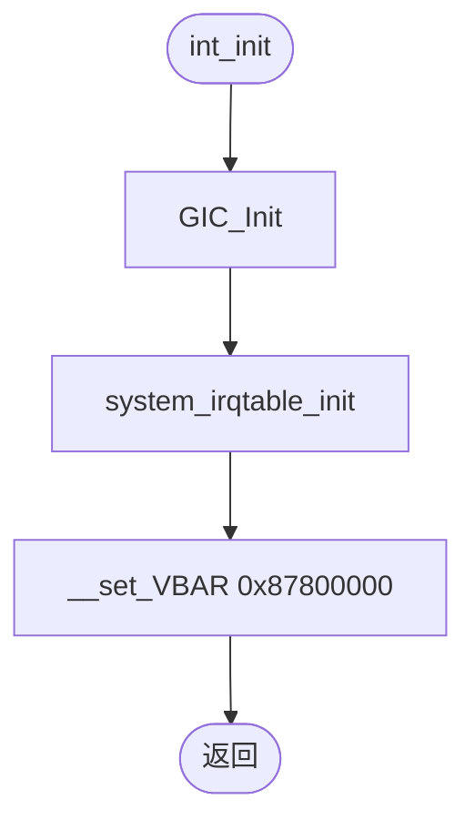
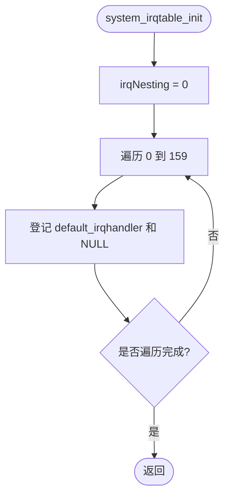
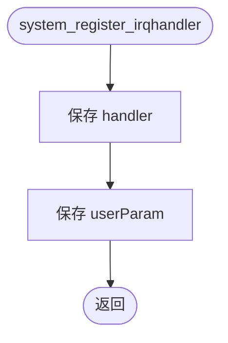
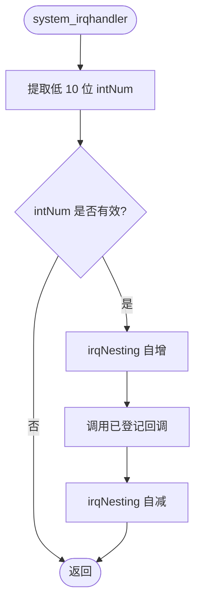
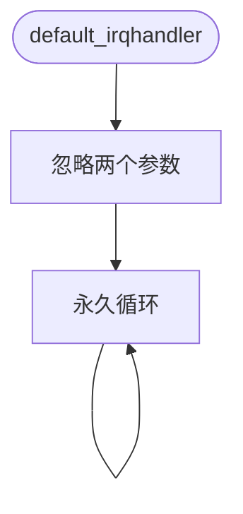
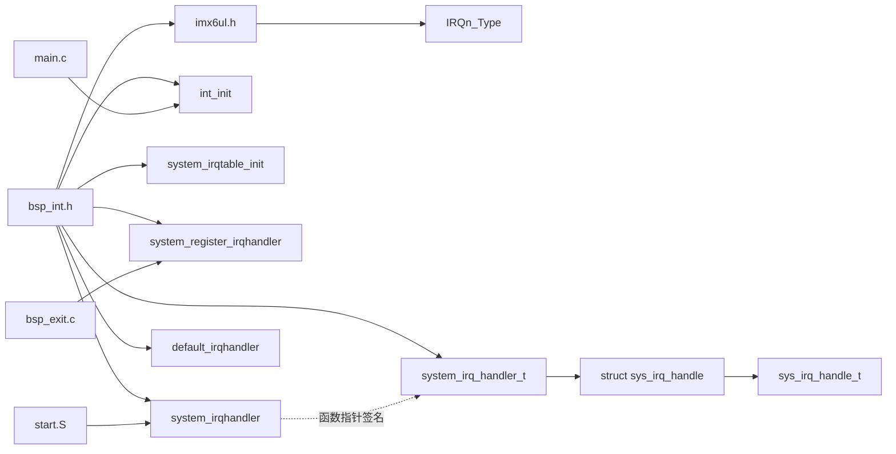
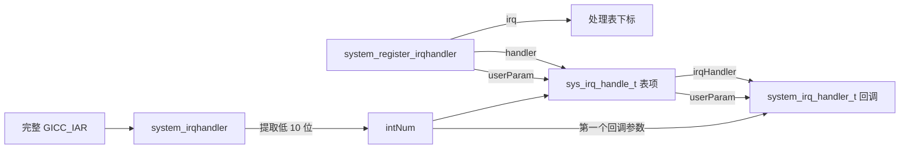

# `bsp_int.h` 详细设计文档

## 1. 文档范围与分析依据

本文档分析 `bsp_int.h` 对外公开的类型和函数接口，并结合以下当前工程文件确认声明的实际用途：

- `bsp_int.c`
- `../../imx6ul/imx6ul.h`
- `../../imx6ul/MCIMX6Y2.h`
- `../../imx6ul/core_ca7.h`
- `../../project/start.S`
- `../../project/main.c`
- `../exit/bsp_exit.c`

本文档区分“头文件公开契约”和“当前实现行为”。头文件未表达、且无法从当前工程确认的信息标注为“需结合其他文件确认”。

## 2. 文件职责

`bsp_int.h` 是中断 BSP 的公开接口头文件，承担以下职责：

1. 通过头文件保护宏避免同一翻译单元内重复展开。
2. 包含 `imx6ul.h`，向本模块接口引入芯片中断号类型和基础定义。
3. 定义 C 层中断回调函数指针类型 `system_irq_handler_t`。
4. 定义中断处理表项结构体 `struct sys_irq_handle`。
5. 定义结构体别名 `sys_irq_handle_t`。
6. 声明中断子系统初始化、处理表初始化、回调注册、IRQ 分发和默认处理函数。

本头文件不定义中断处理表实例，不定义具体中断号，不提供使能、禁用、优先级配置、注销、嵌套层数查询或错误码接口。

## 3. 外部依赖

### 3.1 直接包含依赖

```c
#include "imx6ul.h"
```

当前 `imx6ul.h` 是公共封装头文件，继续包含：

- `cc.h`
- `MCIMX6Y2.h`
- `fsl_common.h`
- `fsl_iomuxc.h`
- `core_ca7.h`

### 3.2 本头文件实际使用的外部定义

| 名称 | 来源 | 使用位置 |
| --- | --- | --- |
| `IRQn_Type` | `MCIMX6Y2.h` | `system_register_irqhandler()` 的 `irq` 参数 |

本头文件自身没有直接使用 `core_ca7.h`、`fsl_common.h` 或 `fsl_iomuxc.h` 中的标识符。是否应缩小包含范围，需结合其他文件和工程头文件组织策略确认。

### 3.3 下游可见性影响

任何包含 `bsp_int.h` 的源文件都会间接获得 `imx6ul.h` 汇总包含的定义。当前工程中的直接使用方包括：

| 文件 | 使用内容 |
| --- | --- |
| `bsp_int.c` | 使用全部类型和函数声明 |
| `project/main.c` | 调用 `int_init()` |
| `bsp/exit/bsp_exit.c` | 调用 `system_register_irqhandler()`，并使用同一回调签名 |

`project/start.S` 通过符号名调用 `system_irqhandler`，但没有包含本 C 头文件。

## 4. 宏定义

### 4.1 头文件保护宏

```c
#ifndef _BSP_INT_H
#define _BSP_INT_H
...
#endif /* _BSP_INT_H */
```

| 宏 | 作用 |
| --- | --- |
| `_BSP_INT_H` | 防止头文件在同一翻译单元中重复展开 |

该宏名称以下划线开头并紧跟大写字母。此类标识符的可移植性约束需结合所用 C 标准和工具链确认。可考虑改为项目命名空间形式，例如 `BSP_INT_H`。

本头文件未定义其他宏。

## 5. 全局变量、静态变量与常量

本头文件不声明或定义全局变量、静态变量及模块常量。

实际实现文件 `bsp_int.c` 定义了以下文件内静态状态，但它们不属于本头文件公开接口：

| 名称 | 类型 | 用途 |
| --- | --- | --- |
| `irqNesting` | `unsigned int` | 记录有效 IRQ 分发进入和退出时的嵌套计数 |
| `irqTable` | `sys_irq_handle_t[NUMBER_OF_INT_VECTORS]` | 保存每个中断号的回调和用户参数 |

## 6. 类型、结构体与枚举

### 6.1 回调类型 `system_irq_handler_t`

```c
typedef void (*system_irq_handler_t)(unsigned int giccIar, void *param);
```

#### 类型职责

定义中断分发器可登记和调用的 C 函数签名。

#### 参数与返回值

| 项目 | 头文件表达的含义 | 当前实现实际行为 |
| --- | --- | --- |
| `giccIar` | 参数名表示 GICC IAR 值 | `system_irqhandler()` 实际传入从 IAR 低 10 位提取的 `intNum` |
| `param` | 无类型用户参数指针 | 注册时保存，分发时原样传递 |
| 返回值 | `void` | 回调无法向分发器返回状态 |

头文件没有表达：

- `param` 是否允许为 `NULL`。当前实现允许保存和传递 `NULL`。
- 回调是否必须返回。当前默认回调不返回。
- 回调可调用哪些函数、是否允许重新注册处理函数以及是否允许嵌套中断。需结合其他文件确认。

#### 当前兼容回调

当前工程可确认的兼容函数包括：

- `default_irqhandler(unsigned int, void *)`
- `gpio1_io18_irqhandler(unsigned int, void *)`

### 6.2 结构体 `struct sys_irq_handle`

```c
struct sys_irq_handle {
	system_irq_handler_t irqHandler;
	void *userParam;
};
```

#### 结构体职责

将一个中断处理函数指针与一个调用方提供的用户参数指针组合为处理表项。

#### 成员说明

| 成员 | 类型 | 当前实现中的写入方 | 当前实现中的读取方 |
| --- | --- | --- | --- |
| `irqHandler` | `system_irq_handler_t` | `system_register_irqhandler()` | `system_irqhandler()` |
| `userParam` | `void *` | `system_register_irqhandler()` | `system_irqhandler()` |

头文件没有约束 `irqHandler` 非空，也没有描述 `userParam` 指向对象的所有权和生命周期。当前实现只保存指针值，不管理其指向对象。

结构体大小、成员偏移和对齐由目标 ABI 决定，需结合工具链确认。

### 6.3 类型别名 `sys_irq_handle_t`

```c
typedef struct sys_irq_handle sys_irq_handle_t;
```

该别名用于在实现文件中声明中断处理表：

```c
static sys_irq_handle_t irqTable[NUMBER_OF_INT_VECTORS];
```

### 6.4 外部枚举 `IRQn_Type`

`IRQn_Type` 不在本头文件中定义，而是通过 `imx6ul.h` 间接引入。当前 `MCIMX6Y2.h` 中：

- `NUMBER_OF_INT_VECTORS` 定义为 `160`。
- 有效表下标对应 `0` 至 `159`。
- 枚举还包含 `NotAvail_IRQn = -128`。

因此，“参数类型为 `IRQn_Type`”不等同于“值一定可安全作为处理表下标”。当前公开接口没有在声明层表达有效范围。

## 7. 函数声明总览

| 函数 | 接口职责 | 当前实现定义位置 | 当前工程调用方 |
| --- | --- | --- | --- |
| `int_init()` | 初始化中断子系统 | `bsp_int.c` | `project/main.c:main()` |
| `system_irqtable_init()` | 初始化 C 层处理表 | `bsp_int.c` | `bsp_int.c:int_init()` |
| `system_register_irqhandler()` | 登记中断回调和用户参数 | `bsp_int.c` | `bsp_int.c:system_irqtable_init()`、`bsp_exit.c:exit_init()` |
| `system_irqhandler()` | C 层 IRQ 分发入口 | `bsp_int.c` | `project/start.S:IRQ_Handler` |
| `default_irqhandler()` | 默认中断处理回调 | `bsp_int.c` | 由 `system_irqhandler()` 间接调用 |

本头文件没有声明静态函数。其全部函数声明均对应具有外部链接的实现。

## 8. 函数接口详细设计

### 8.1 `int_init(void)`

#### 公开功能

初始化中断子系统。

#### 接口

```c
void int_init(void);
```

| 项目 | 说明 |
| --- | --- |
| 入参 | 无 |
| 返回值 | 无 |
| 当前实现局部变量 | 无 |
| 当前实现读写状态 | 间接初始化 GIC、`irqNesting`、`irqTable` 和 VBAR |

#### 当前实现调用关系

- 文件内：调用 `system_irqtable_init()`。
- 文件外：调用 `GIC_Init()` 和 `__set_VBAR()`。
- 当前工程调用方：`project/main.c:main()`。

#### 当前实现流程



头文件没有表达必须在何时调用、是否可重复调用以及失败处理方式。当前工程在 `main()` 中先调用它，再初始化其他 BSP。

### 8.2 `system_irqtable_init(void)`

#### 公开功能

初始化 C 层中断处理表。

#### 接口

```c
void system_irqtable_init(void);
```

| 项目 | 说明 |
| --- | --- |
| 入参 | 无 |
| 返回值 | 无 |
| 当前实现局部变量 | `unsigned int i` |
| 当前实现读写状态 | 将 `irqNesting` 置 `0`，将全部处理表项设为默认回调和 `NULL` |

#### 当前实现调用关系

- 文件内调用：循环调用 `system_register_irqhandler()`。
- 文件外调用：无。
- 当前工程调用方：`int_init()`。

#### 当前实现流程



该函数公开在头文件中，因此文件外代码可以重新初始化处理表并覆盖已经登记的回调。是否属于预期接口需结合其他文件确认。

### 8.3 `system_register_irqhandler(IRQn_Type irq, system_irq_handler_t handler, void *userParam)`

#### 公开功能

为指定中断号登记 C 层回调函数和用户参数。

#### 接口

```c
void system_register_irqhandler(IRQn_Type irq,
				system_irq_handler_t handler,
				void *userParam);
```

| 参数/返回值 | 头文件可确认信息 | 当前实现行为 |
| --- | --- | --- |
| `irq` | 类型为 `IRQn_Type` | 直接作为 `irqTable` 下标，不校验范围 |
| `handler` | 类型为 `system_irq_handler_t` | 直接保存，不检查空值 |
| `userParam` | 任意对象指针 | 直接保存，可为 `NULL` |
| 返回值 | 无 | 无法报告注册失败 |
| 当前实现局部变量 | 无 | 无 |

#### 当前实现读写状态

- 写 `irqTable[irq].irqHandler`。
- 写 `irqTable[irq].userParam`。
- 不访问 `irqNesting`。

#### 当前实现调用关系

- 不调用其他函数。
- 文件内调用方：`system_irqtable_init()`。
- 文件外调用方：`bsp_exit.c:exit_init()`。

#### 当前实现流程



接口未提供注销函数。调用方可以登记 `default_irqhandler` 达到恢复默认处理的效果，但这不是头文件明确声明的注销契约。

### 8.4 `system_irqhandler(unsigned int giccIar)`

#### 公开功能

作为 C 层 IRQ 分发入口接收 IAR 值并调用登记的处理函数。

#### 接口

```c
void system_irqhandler(unsigned int giccIar);
```

| 项目 | 说明 |
| --- | --- |
| `giccIar` | 当前工程由 `start.S` 从 GICC IAR 读取并传入 |
| 返回值 | 无 |
| 当前实现局部变量 | `uint32_t intNum` |
| 当前实现读写状态 | 读处理表；对有效中断分发前后更新 `irqNesting` |

#### 当前实现调用关系

- 通过函数指针间接调用 `irqTable[intNum].irqHandler`。
- 当前工程调用方为 `project/start.S:IRQ_Handler`。
- 当前实现不负责写 `GICC_EOIR`；汇编调用方在本函数返回后完成写回。

#### 当前实现流程



尽管该函数在 C 头文件中公开，当前工程的直接调用边界是汇编 IRQ 入口。其他 C 代码是否应直接调用它，需结合其他文件确认。

### 8.5 `default_irqhandler(unsigned int giccIar, void *userParam)`

#### 公开功能

提供符合 `system_irq_handler_t` 签名的默认处理函数。

#### 接口

```c
void default_irqhandler(unsigned int giccIar, void *userParam);
```

| 项目 | 说明 |
| --- | --- |
| `giccIar` | 当前实现忽略；由分发器调用时实际为中断号 |
| `userParam` | 当前实现忽略 |
| 返回值 | 无；当前实现永久循环 |
| 当前实现局部变量 | 无 |
| 当前实现读写状态 | 不直接读写全局变量 |

#### 当前实现调用关系

- 不调用其他函数。
- 由 `system_irqhandler()` 通过处理表间接调用。
- `system_irqtable_init()` 将其登记到全部初始表项。

#### 当前实现流程



## 9. 文件级声明与调用关系图



## 10. 接口数据流



头文件中的回调参数名 `giccIar` 与当前实现传入的 `intNum` 不一致，是接口语义上最需要明确的点。

## 11. 风险与改进建议

| 优先级 | 风险/限制 | 接口依据 | 改进建议 |
| --- | --- | --- | --- |
| 高 | 注册接口没有表达有效中断号范围 | `IRQn_Type` 包含负值，函数返回 `void` | 在接口注释中明确范围，并考虑返回错误码 |
| 高 | 注册接口没有表达 `handler` 不可为空 | 函数指针参数无约束，当前实现直接调用 | 增加非空约束和实现检查，或约定空值恢复默认处理 |
| 中 | 回调第一个参数语义不一致 | 类型参数名为 `giccIar`，当前实现传入 `intNum` | 将名称改为 `irq`/`intNum`，并补充明确接口注释 |
| 中 | `userParam` 生命周期和所有权未说明 | 使用无类型指针，接口无注释 | 明确只借用指针、调用期间必须有效等约束；实际策略需结合其他文件确认 |
| 中 | 内部辅助接口公开 | `system_irqtable_init()`、`default_irqhandler()` 均在头文件声明 | 若无文件外使用需求，考虑移出公开头文件并设为文件内静态 |
| 中 | 分发入口对普通 C 调用方公开但契约不完整 | `system_irqhandler()` 公开声明，未说明 IAR 来源和 EOI 责任 | 注释说明仅供异常入口调用以及 EOI 由调用方完成 |
| 低 | 公共头文件依赖范围较大 | 仅为 `IRQn_Type` 包含汇总头 `imx6ul.h` | 结合项目头文件策略评估是否引入更窄依赖 |
| 低 | 头文件保护宏命名可移植性需确认 | `_BSP_INT_H` 以下划线和大写字母开头 | 改为项目命名空间保护宏，例如 `BSP_INT_H` |
| 低 | 无 C++ 链接保护 | 未使用 `extern "C"` | 若工程需要被 C++ 包含，再增加条件链接保护；当前需求需结合其他文件确认 |

## 12. 建议的接口契约补充项

若后续仅补充文档而不改变函数签名，建议至少明确以下内容：

1. `int_init()` 的调用时机、是否允许重复调用，以及与 IRQ 使能的顺序要求。
2. `system_register_irqhandler()` 的有效 `irq` 范围和 `handler` 非空要求。
3. `userParam` 的所有权、生命周期和并发访问责任。
4. 回调第一个参数到底表示完整 `GICC_IAR` 还是提取后的中断号。
5. `system_irqhandler()` 的预期调用方以及 `GICC_EOIR` 写回责任。
6. 回调是否必须返回、是否允许嵌套和运行时重新注册。

上述策略无法仅由当前头文件确认，需结合其他文件确认。

## 13. 总结

`bsp_int.h` 定义了一个最小化的中断注册与分发接口：使用 `IRQn_Type` 定位中断，使用 `system_irq_handler_t` 和 `void *` 表达回调及上下文，并公开初始化、注册、分发和默认处理函数。当前接口简单直接，但对有效范围、空回调、参数语义、生命周期、调用边界和错误处理的约束表达不足；这些约束应优先在接口文档或实现校验中明确。
