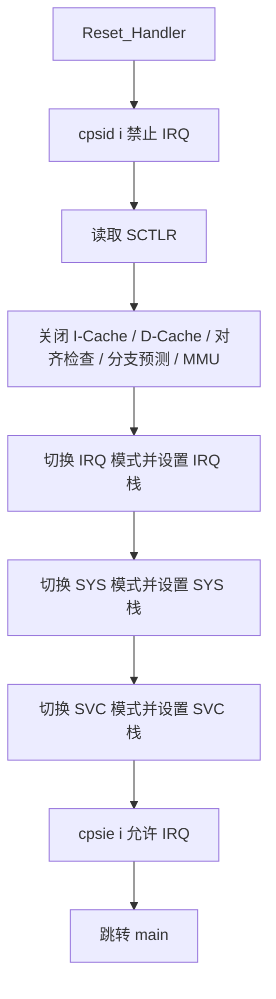
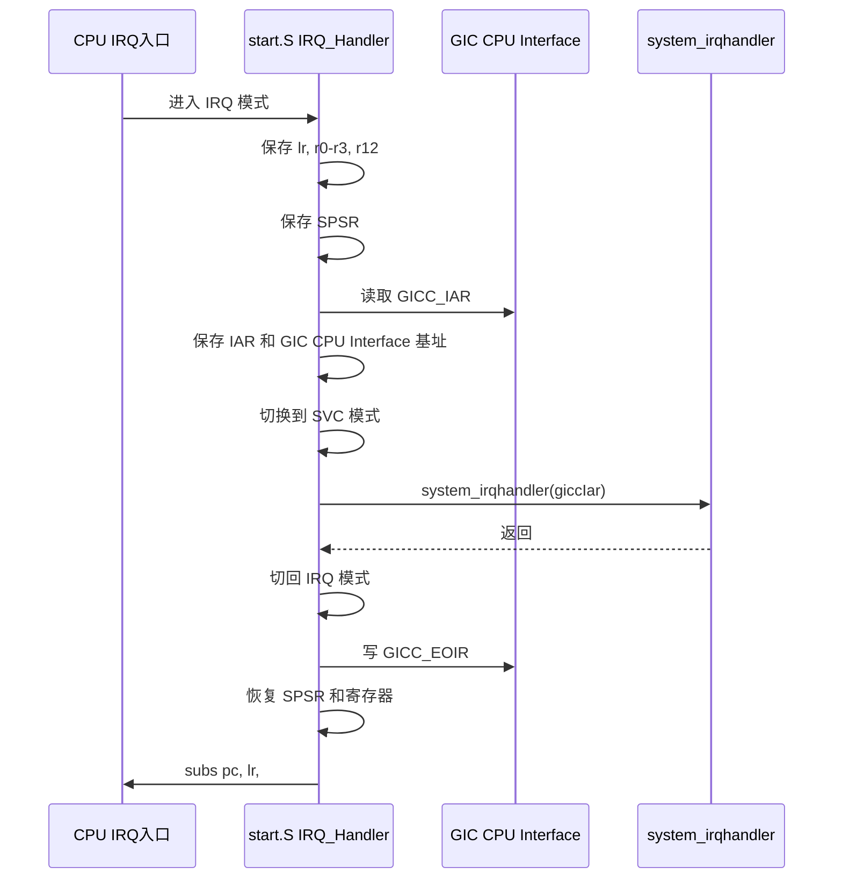
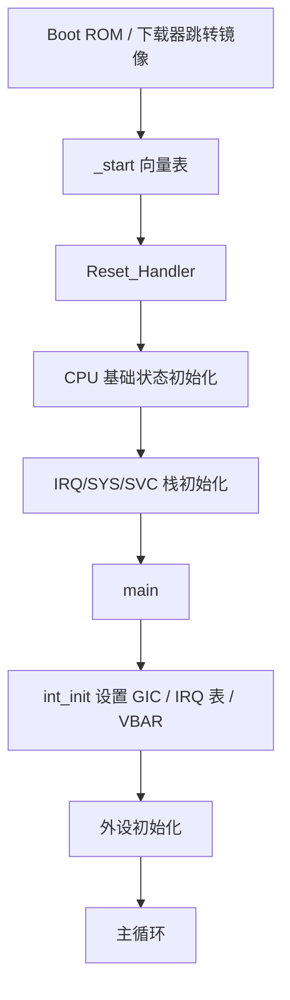
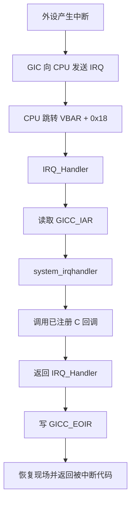

# start.S 详细设计说明书

## 1. 文件概述

`start.S` 是当前 i.MX6UL 裸机中断示例工程的启动汇编文件，提供程序最早执行的入口 `_start`，并实现 ARM 异常向量表、复位入口初始化、默认异常处理入口以及 IRQ 异常入口。

该文件位于 `project/start.S`，由上级 `Makefile` 作为汇编源文件编译进最终镜像。链接脚本 `imx6ul.lds` 使用 `ENTRY(_start)` 指定入口地址，并将镜像链接到 `0x87800000`。中断初始化模块 `bsp/int/bsp_int.c` 后续通过 `__set_VBAR(0x87800000)` 将异常向量基地址设置到镜像起始地址，使 CPU 异常进入本文件开头的向量表。

## 2. 设计目标

1. 在镜像起始位置提供 ARM 异常向量表。
2. 在复位后关闭可能影响裸机初始化的处理器特性。
3. 为不同 CPU 模式配置独立栈空间。
4. 跳转到 C 语言入口 `main()`。
5. 为未实现的异常提供默认自循环处理。
6. 为 IRQ 异常提供上下文保存、GIC 中断确认、C 层分发调用、EOI 写回和现场恢复。

## 3. 适用运行环境

| 项目 | 当前设计 |
| --- | --- |
| CPU 架构 | ARM Cortex-A7 / ARMv7-A |
| 芯片平台 | NXP i.MX6UL |
| 运行模式 | 裸机，无操作系统 |
| 镜像链接地址 | `0x87800000` |
| 向量表基地址 | `0x87800000`，由 `int_init()` 设置 VBAR |
| GIC 版本 | ARM GIC，当前使用 CPU Interface 的 IAR/EOIR |
| C 入口 | `main()` |
| C 层 IRQ 分发入口 | `system_irqhandler(unsigned int giccIar)` |

## 4. 文件外部接口

### 4.1 导出符号

| 符号 | 类型 | 作用 |
| --- | --- | --- |
| `_start` | 全局符号 | 镜像入口和异常向量表起始地址 |

`_start` 使用 `.global _start` 导出，供链接脚本 `ENTRY(_start)` 引用。

### 4.2 引用的外部符号

| 符号 | 来源 | 用途 |
| --- | --- | --- |
| `main` | `project/main.c` | 复位初始化完成后跳转到 C 主程序 |
| `system_irqhandler` | `bsp/int/bsp_int.c` | IRQ 入口读取 `GICC_IAR` 后调用的 C 层中断分发函数 |

## 5. 异常向量表设计

文件从 `_start` 开始放置 8 项异常向量：

| 偏移 | 异常类型 | 跳转目标 |
| --- | --- | --- |
| `0x00` | Reset | `Reset_Handler` |
| `0x04` | Undefined Instruction | `Undefined_Handler` |
| `0x08` | SVC | `SVC_Handler` |
| `0x0C` | Prefetch Abort | `PrefAbort_Handler` |
| `0x10` | Data Abort | `DataAbort_Handler` |
| `0x14` | Reserved / Not Used | `NotUsed_Handler` |
| `0x18` | IRQ | `IRQ_Handler` |
| `0x1C` | FIQ | `FIQ_Handler` |

每个向量项使用：

```asm
ldr pc, =Handler
```

该方式通过 literal pool 装载处理函数地址到 `pc`，可跳转到完整 32 位地址，不受短分支范围限制。代价是向量表附近需要保留 literal pool 数据，且向量表代码布局应保持在镜像起始区域。

## 6. 复位入口设计

### 6.1 总体流程

`Reset_Handler` 是复位异常的实际处理入口，其执行流程如下：



### 6.2 IRQ 屏蔽

入口首先执行：

```asm
cpsid i
```

该指令设置 CPSR 中的 IRQ mask 位，防止启动早期在栈、向量表或中断表尚未就绪时进入 IRQ。

### 6.3 处理器控制寄存器配置

代码通过 CP15 读取并修改 SCTLR：

```asm
mrc p15, 0, r0, c1, c0, 0
bic r0, r0, #(1 << 12)
bic r0, r0, #(1 << 2)
bic r0, r0, #0x2
bic r0, r0, #(1 << 11)
bic r0, r0, #0x1
mcr p15, 0, r0, c1, c0, 0
```

| 位 | 宏观含义 | 当前动作 | 设计目的 |
| --- | --- | --- | --- |
| bit 12 | I-Cache enable | 清零 | 关闭指令 Cache |
| bit 2 | D-Cache enable | 清零 | 关闭数据 Cache |
| bit 1 | Alignment check enable | 清零 | 关闭对齐检查 |
| bit 11 | Branch prediction enable | 清零 | 关闭分支预测 |
| bit 0 | MMU enable | 清零 | 关闭 MMU |

该设计让后续 C 初始化运行在直接物理地址和较少处理器副作用的环境中，适合简单裸机示例。

### 6.4 栈初始化

当前文件分别为 IRQ、SYS、SVC 模式设置栈指针：

| CPU 模式 | CPSR mode 值 | 栈顶地址 | 用途 |
| --- | --- | --- | --- |
| IRQ | `0x12` | `0x80600000` | IRQ 异常入口保存中断现场 |
| SYS | `0x1F` | `0x80400000` | 系统模式栈，供普通特权代码使用 |
| SVC | `0x13` | `0x80200000` | 复位后进入 C 代码使用的主栈 |

模式切换使用如下模式：

```asm
mrs r0, cpsr
bic r0, r0, #0x1f
orr r0, r0, #mode
msr cpsr, r0
ldr sp, =stack_top
```

ARM 不同异常模式拥有 banked `sp`。因此必须切换到目标模式后写入 `sp`，才能初始化该模式对应的栈。

### 6.5 进入 C 入口

复位处理最后执行：

```asm
cpsie i
b main
```

`b main` 直接跳转到 C 主函数，不设置返回地址。当前 `main()` 内部是无限循环，正常情况下不会返回。

需要注意，当前启动代码在进入 `main()` 前已经重新打开 IRQ，而 `main()` 第一条初始化调用是 `int_init()`。如果此时硬件存在挂起中断，可能在 C 层中断表和 VBAR 设置完成前进入 IRQ 路径。

## 7. 默认异常处理设计

未实现的异常处理函数包括：

| 处理函数 | 对应异常 | 当前行为 |
| --- | --- | --- |
| `Undefined_Handler` | 未定义指令 | 自循环 |
| `SVC_Handler` | SVC 调用 | 自循环 |
| `PrefAbort_Handler` | 取指中止 | 自循环 |
| `DataAbort_Handler` | 数据访问中止 | 自循环 |
| `NotUsed_Handler` | 保留向量 | 自循环 |
| `FIQ_Handler` | FIQ | 自循环 |

实现形式为：

```asm
ldr r0, =Handler
bx r0
```

该写法会反复跳回自身，相当于死循环。它适合作为调试阶段的停机点，但不会保存错误现场、读取异常状态寄存器，也不会输出诊断信息。

## 8. IRQ 异常入口设计

### 8.1 总体职责

`IRQ_Handler` 是 IRQ 异常的汇编入口，负责完成 C 函数无法独立完成的异常上下文处理：

1. 保存被中断现场的关键寄存器。
2. 保存 IRQ 模式下的 `SPSR`。
3. 读取 GIC CPU Interface 的 `GICC_IAR`。
4. 切换到 SVC 模式调用 C 层 `system_irqhandler()`。
5. 返回 IRQ 模式后写 `GICC_EOIR`。
6. 恢复 `SPSR` 和通用寄存器。
7. 使用异常返回指令回到被中断代码。

### 8.2 执行流程



### 8.3 寄存器保存策略

IRQ 入口保存如下寄存器：

```asm
push {lr}
push {r0-r3, r12}
mrs r0, spsr
push {r0}
```

| 保存项 | 原因 |
| --- | --- |
| `lr_irq` | IRQ 异常返回地址，最终用于 `subs pc, lr, #4` |
| `r0-r3` | ARM AAPCS 调用者保存寄存器，调用 C 函数会被改写 |
| `r12` | 调用过程临时寄存器，调用 C 函数可能改写 |
| `SPSR_irq` | 保存被中断现场的 CPSR，异常返回前必须恢复 |

当前实现未保存 `r4-r11`。按 AAPCS 约定，普通 C 函数应保护 callee-saved 寄存器，因此在调用符合 ABI 的 C 代码时通常可接受。但如果中断回调或内联汇编破坏 ABI，仍可能导致现场损坏。

### 8.4 GIC CPU Interface 定位

代码使用：

```asm
mrc p15, 4, r1, c15, c0, 0
add r1, r1, #0x2000
```

`mrc p15, 4, r1, c15, c0, 0` 读取 Cortex-A7 的 CBAR 相关基址。随后加 `0x2000` 定位到 GIC CPU Interface。

后续访问：

| 地址 | 寄存器 | 访问方向 | 作用 |
| --- | --- | --- | --- |
| `r1 + 0x0C` | `GICC_IAR` | 读 | 获取中断应答值和中断号 |
| `r1 + 0x10` | `GICC_EOIR` | 写 | 通知 GIC 当前中断处理完成 |

### 8.5 C 层分发调用

读取 IAR 后：

```asm
ldr r0, [r1, #0x0c]
push {r0, r1}
cps #0x13
push {lr}

ldr r2, =system_irqhandler
blx r2

pop {lr}
```

`r0` 按 ARM 调用约定作为第一个参数传入 `system_irqhandler(giccIar)`。`system_irqhandler()` 在 C 层提取低 10 位中断号，并通过 `irqTable[intNum]` 调用已注册处理函数。

调用 C 函数前切换到 SVC 模式，主要原因是：

1. 使用 SVC 栈执行较复杂的 C 层处理逻辑。
2. 避免 IRQ 模式栈承载过深的 C 调用链。
3. 保持 IRQ 模式栈只用于异常入口的最小现场保存。

`push {r0, r1}` 在切换模式前保存 IAR 和 GIC CPU Interface 基址，返回 IRQ 模式后用于写回 EOI。

### 8.6 EOI 写回

C 层处理完成后：

```asm
cps #0x12
pop {r0, r1}
str r0, [r1, #0x10]
```

代码切回 IRQ 模式，恢复之前保存的 `GICC_IAR` 值和 GIC CPU Interface 基址，然后将原始 IAR 值写入 `GICC_EOIR`。该设计明确把中断结束通知责任放在汇编入口，而不是 C 层 `system_irqhandler()`。

### 8.7 IRQ 返回

恢复现场后执行：

```asm
msr spsr_cxsf, r0
pop {r0-r3, r12}
pop {lr}
subs pc, lr, #4
```

`subs pc, lr, #4` 是 ARM IRQ 异常返回常用形式：

1. 从 `lr_irq - 4` 恢复到被中断指令之后的正确执行位置。
2. 因为目标寄存器是 `pc` 且使用带 `S` 的数据处理指令，处理器会从 `SPSR_irq` 恢复 CPSR。

## 9. 与其他模块的关系

### 9.1 链接脚本关系

`imx6ul.lds` 中：

```ld
ENTRY(_start)
. = 0x87800000;
.text :
{
    KEEP(*(.text._start))
    *(.text)
    *(.text.*)
}
```

`ENTRY(_start)` 指定程序入口。`. = 0x87800000` 指定链接地址。当前 `start.S` 未显式声明 `.section .text._start`，因此 `KEEP(*(.text._start))` 不会直接匹配本文件向量表；实际能否位于镜像起始处依赖对象链接顺序和默认 `.text` 布局。当前工程只有一个汇编启动文件，风险较低，但设计上建议显式放入 `.text._start`。

### 9.2 `bsp_int.c` 关系

`bsp_int.c` 的 `int_init()` 执行：

```c
GIC_Init();
system_irqtable_init();
__set_VBAR((uint32_t)0x87800000);
```

该函数负责初始化 GIC、中断表和 VBAR。`start.S` 的 IRQ 向量必须与 VBAR 地址一致，否则 IRQ 发生时 CPU 无法进入 `IRQ_Handler`。

### 9.3 `main.c` 关系

`Reset_Handler` 直接跳转到 `main()`。当前 `main()` 初始化顺序为：

```c
int_init();
imx6u_clkinit();
clk_enable();
led_init();
beep_init();
key_init();
exit_init();
```

因此 `start.S` 只负责最小 CPU 级启动，设备时钟、GIC 详细初始化、外设初始化和中断回调注册均由 C 层完成。

## 10. 栈内存布局

当前静态栈顶设计如下：

```text
0x80600000  IRQ stack top

0x80400000  SYS stack top

0x80200000  SVC stack top

0x87800000  image link address / vector table
```

ARM 栈通常向低地址增长。当前栈区域位于镜像地址 `0x87800000` 以下，和程序镜像之间有较大间隔。该设计简单直接，但没有使用链接脚本定义栈边界，也没有栈溢出检测。

## 11. 关键常量说明

| 常量 | 所在位置 | 含义 |
| --- | --- | --- |
| `0x87800000` | 链接脚本、`int_init()` | 镜像链接地址和 VBAR 基地址 |
| `0x80600000` | `start.S` | IRQ 模式栈顶 |
| `0x80400000` | `start.S` | SYS 模式栈顶 |
| `0x80200000` | `start.S` | SVC 模式栈顶 |
| `0x12` | `start.S` | IRQ 模式 CPSR mode 值 |
| `0x13` | `start.S` | SVC 模式 CPSR mode 值 |
| `0x1F` | `start.S` | SYS 模式 CPSR mode 值 |
| `0x2000` | `start.S` | 从私有外设基址到 GIC CPU Interface 的偏移 |
| `0x0C` | `start.S` | `GICC_IAR` 偏移 |
| `0x10` | `start.S` | `GICC_EOIR` 偏移 |

## 12. 启动和中断时序

### 12.1 上电启动路径



### 12.2 外设中断路径



## 13. 设计边界和不负责事项

`start.S` 当前不负责以下工作：

1. 清零 `.bss` 段。
2. 搬移 `.data` 段初始化值。
3. 初始化 FIQ、Abort、Undefined 等异常的完整诊断逻辑。
4. 配置 MMU 页表或 Cache 策略。
5. 初始化 GIC 分发器和 CPU Interface 的详细寄存器。
6. 注册具体外设中断回调。
7. 检查栈空间是否溢出。

这些工作目前分别由 C 层模块完成，或尚未实现。

## 14. 风险与改进建议

| 等级 | 问题 | 依据 | 建议 |
| --- | --- | --- | --- |
| 高 | 进入 `main()` 前已执行 `cpsie i` | 中断表和 VBAR 在 `main()->int_init()` 中才初始化 | 将 `cpsie i` 延后到 `int_init()` 和必要外设注册完成后，或确保所有中断源在此之前均关闭 |
| 高 | 未清零 `.bss` | 链接脚本定义了 `__bss_start/__bss_end`，但启动代码没有清零逻辑 | 在 `Reset_Handler` 中调用或实现 `.bss` 清零，避免静态变量初值依赖下载环境 |
| 中 | 向量表段未显式放入 `.text._start` | 链接脚本有 `KEEP(*(.text._start))`，但 `start.S` 未声明该 section | 在 `_start` 前增加 `.section .text._start, "ax"` 并保持对齐 |
| 中 | 栈地址硬编码 | IRQ/SYS/SVC 栈顶直接写在汇编中 | 将栈地址移入链接脚本符号，便于统一维护内存布局 |
| 中 | 默认异常处理无诊断 | 默认处理器只自循环 | 在调试版本中保存异常号、`lr`、`spsr`、DFSR/IFSR/FAR 等寄存器 |
| 中 | IRQ 入口不支持嵌套中断策略 | 进入 IRQ 后未重新打开 IRQ，也没有优先级嵌套控制 | 若需要中断嵌套，应明确优先级、栈深度和临界区策略 |
| 低 | 未保存 `r4-r11` | 依赖 C 代码遵守 AAPCS | 保持当前策略可接受；若存在裸汇编回调，可改为完整保存通用寄存器 |
| 低 | `main()` 返回未定义 | 使用 `b main`，没有返回处理 | 保持 `main()` 不返回，或增加返回后的死循环保护 |

## 15. 建议的后续优化示例

### 15.1 显式指定向量表段

```asm
.section .text._start, "ax"
.align 5
.global _start
```

这样可以和链接脚本中的 `KEEP(*(.text._start))` 对齐，确保向量表固定保留在镜像最前面。

### 15.2 增加 BSS 清零

可在进入 `main()` 前增加逻辑：

```asm
ldr r0, =__bss_start
ldr r1, =__bss_end
mov r2, #0
1:
cmp r0, r1
strlo r2, [r0], #4
blo 1b
```

该逻辑需要链接脚本导出的 `__bss_start` 和 `__bss_end` 符号。

### 15.3 延后全局 IRQ 使能

当前启动代码在 `main()` 前打开 IRQ。更稳妥的时序是：

1. `Reset_Handler` 完成 CPU 初始化和栈初始化。
2. 保持 IRQ 禁止状态进入 `main()`。
3. `main()` 调用 `int_init()`。
4. 外设模块完成中断回调注册并清除挂起标志。
5. 最后统一打开全局 IRQ。

## 16. 总结

`start.S` 是当前裸机工程的最底层入口，承担了异常向量表、CPU 初始状态、模式栈和 IRQ 汇编入口的核心职责。其 IRQ 路径设计清晰：汇编层负责异常现场与 GIC IAR/EOIR，C 层负责中断号解析和回调分发。

当前实现适合教学型或小型裸机示例，但从健壮性看，仍建议优先处理全局 IRQ 使能时序、`.bss` 清零、向量表 section 固定和栈地址链接脚本化这几项问题。
