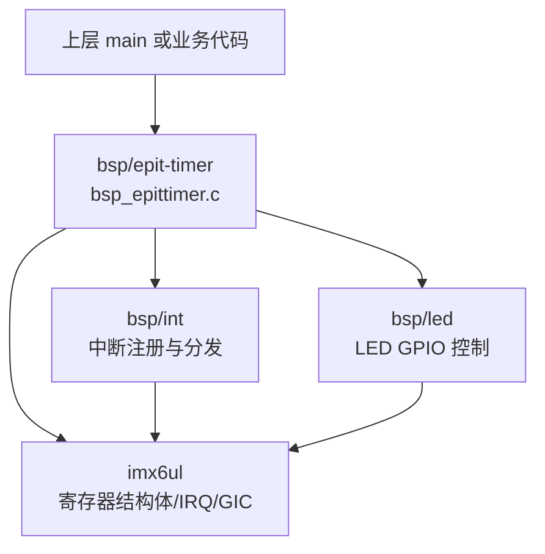
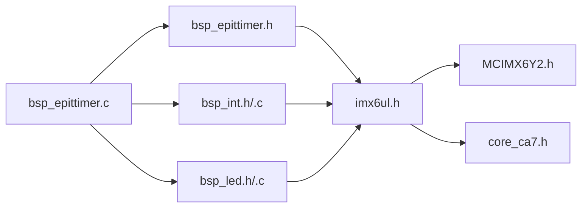
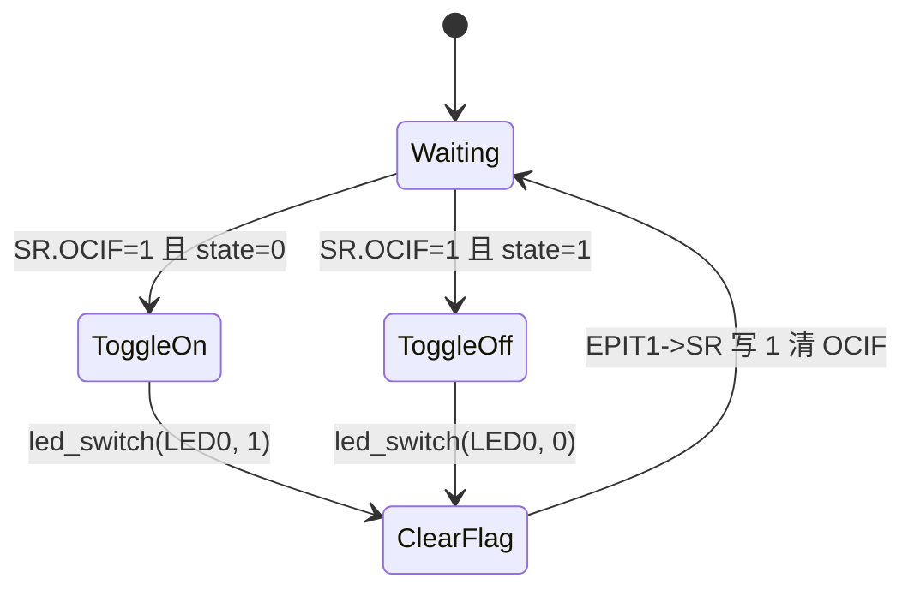
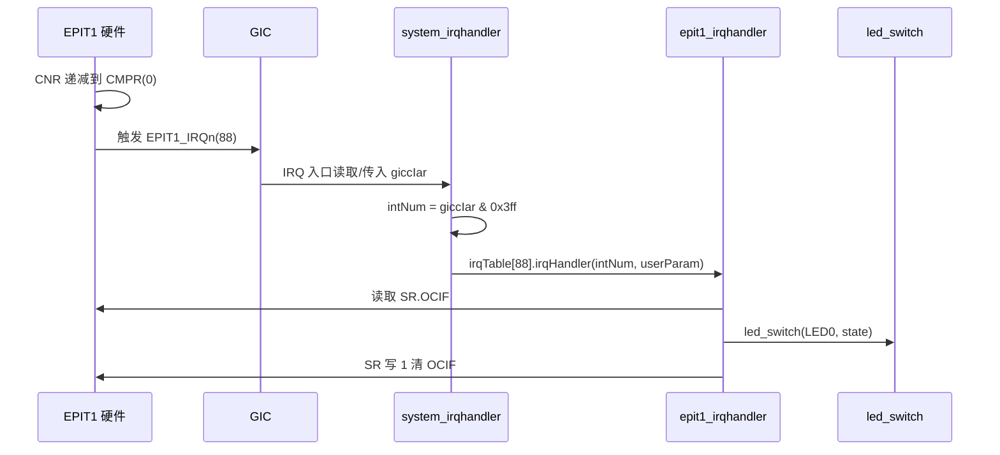
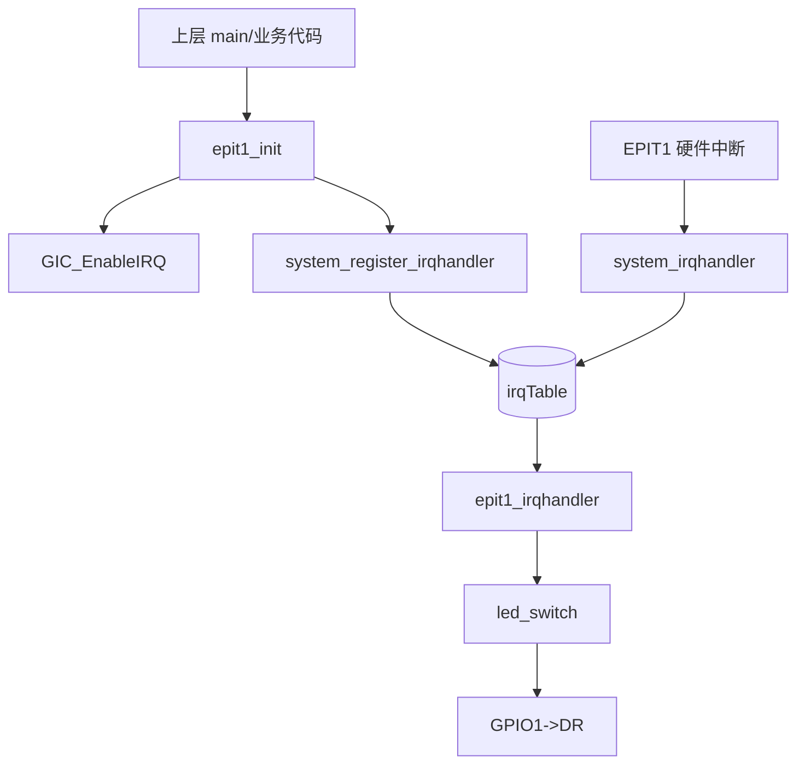
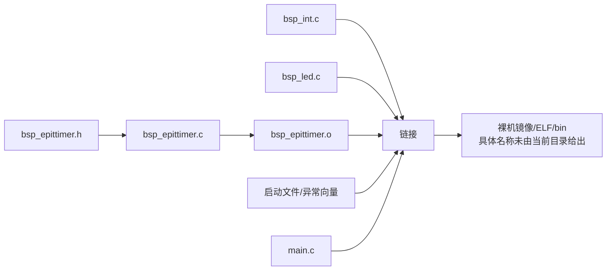

# bsp_epittimer 模块技术设计说明书

## 目录

- [1. 文档范围与源码依据](#1-文档范围与源码依据)
- [2. 工程整体架构和目录职责](#2-工程整体架构和目录职责)
- [3. 模块功能与依赖关系](#3-模块功能与依赖关系)
- [4. 文件级代码分析](#4-文件级代码分析)
- [5. 关键函数实现分析](#5-关键函数实现分析)
- [6. 初始化流程、运行流程与调用关系](#6-初始化流程运行流程与调用关系)
- [7. 外设访问分析](#7-外设访问分析)
- [8. 编译流程与最终产物](#8-编译流程与最终产物)
- [9. 资源管理、错误处理与日志机制](#9-资源管理错误处理与日志机制)
- [10. 风险点与优化建议](#10-风险点与优化建议)
- [11. 整体架构总结](#11-整体架构总结)

## 1. 文档范围与源码依据

本文档分析当前目录：

```text
/home/gs/code/i.MX6UL/baremetal/10-epit-timer/bsp/epit-timer
├── bsp_epittimer.c
└── bsp_epittimer.h
```

当前目录未提供 `Makefile`、`CMakeLists.txt`、`Android.bp`、Yocto 配方或其他构建脚本。本文涉及构建系统和最终产物的结论仅基于本模块源码及其 include 依赖，未臆测不存在的构建文件。

为解释外部符号，参考了相邻 BSP/SoC 头文件中的实际定义：

- `../../imx6ul/imx6ul.h`：统一包含 `MCIMX6Y2.h`、`core_ca7.h`、IOMUXC 等 SoC 头文件。
- `../../imx6ul/MCIMX6Y2.h`：定义 `EPIT_Type`、`EPIT1`、`EPIT1_IRQn`、寄存器位掩码。
- `../../imx6ul/core_ca7.h`：定义 `GIC_EnableIRQ()`。
- `../int/bsp_int.h/.c`：定义 BSP 中断注册和分发接口。
- `../led/bsp_led.h/.c`：定义 `LED0` 和 `led_switch()`。

## 2. 工程整体架构和目录职责

从当前模块和相邻 BSP 目录可以看出，该工程是 i.MX6UL 裸机 BSP 示例的一部分，当前 `epit-timer` 模块负责配置 SoC 的 EPIT1 定时器，并在 EPIT1 输出比较中断中翻转 LED0。



目录职责：

| 路径 | 角色 | 当前文档使用方式 |
| --- | --- | --- |
| `bsp/epit-timer` | EPIT1 定时器驱动模块 | 本文重点分析对象 |
| `bsp/int` | BSP 级中断表、IRQ 注册、IRQ 分发 | 作为 EPIT1 中断注册和运行链路依赖 |
| `bsp/led` | LED0 GPIO 初始化和开关控制 | 作为 EPIT1 ISR 的动作输出依赖 |
| `imx6ul` | i.MX6UL 寄存器、IRQ 枚举、GIC 操作、IOMUXC | 作为硬件访问定义来源 |

## 3. 模块功能与依赖关系

### 3.1 模块功能

`bsp_epittimer` 提供两个接口：

```c
void epit1_init(unsigned int frac, unsigned int value);
void epit1_irqhandler(unsigned int giccIar, void *userParam);
```

功能边界：

- 初始化 EPIT1 为 32 位递减定时器。
- 使用 peripheral clock 作为 EPIT1 时钟源。
- 设置预分频参数 `frac` 和装载值 `value`。
- 使能 EPIT1 输出比较中断。
- 注册 EPIT1 IRQ 处理函数到 BSP 中断表。
- 中断发生时翻转 LED0。

未实现的功能：

- 未提供 EPIT2 支持。
- 未提供停止、重启、动态修改周期、读取当前计数值等 API。
- 未提供回调注册机制，ISR 行为固定为翻转 LED0。
- 未涉及 Linux 用户态/内核态接口，如 `ioctl`、`sysfs`、`procfs`、socket 或普通文件访问。

### 3.2 依赖关系

`bsp_epittimer.c` 的 include：

```c
#include "bsp_epittimer.h"
#include "bsp_int.h"
#include "bsp_led.h"
```

依赖说明：

| 依赖 | 使用点 | 作用 |
| --- | --- | --- |
| `bsp_epittimer.h` | 本模块头文件 | 暴露 `epit1_init()`、`epit1_irqhandler()` |
| `bsp_int.h` | `system_register_irqhandler()` | 将 EPIT1 ISR 注册到 BSP 中断表 |
| `bsp_led.h` | `LED0`、`led_switch()` | EPIT1 中断动作：翻转 LED0 |
| `imx6ul.h` | 经头文件间接包含 | 提供 `EPIT1`、`EPIT1_IRQn`、`GIC_EnableIRQ()` 等 |

模块依赖图：



## 4. 文件级代码分析

### 4.1 bsp_epittimer.h

源码：

```c
#ifndef _BSP_EPITTIMER_H
#define _BSP_EPITTIMER_H

#include "imx6ul.h"

void epit1_init(unsigned int frac, unsigned int value);
void epit1_irqhandler(unsigned int giccIar, void *userParam);

#endif /* _BSP_EPITTIMER_H */
```

职责：

- 提供 EPIT1 模块对外接口声明。
- 通过 `#include "imx6ul.h"` 引入 SoC 基础类型、寄存器定义和 IRQ 类型。

接口：

| 接口 | 参数 | 返回值 | 说明 |
| --- | --- | --- | --- |
| `epit1_init()` | `frac`：预分频值；`value`：EPIT 装载值 | `void` | 配置并启动 EPIT1 |
| `epit1_irqhandler()` | `giccIar`：中断号或 GICC_IAR 传入值；`userParam`：用户参数 | `void` | EPIT1 中断处理函数 |

宏定义：

- `_BSP_EPITTIMER_H`：头文件重复包含保护。

结构体：

- 本文件未定义结构体。
- `EPIT_Type` 来自 `MCIMX6Y2.h`：

```c
typedef struct {
  __IO uint32_t CR;
  __IO uint32_t SR;
  __IO uint32_t LR;
  __IO uint32_t CMPR;
  __I  uint32_t CNR;
} EPIT_Type;
```

### 4.2 bsp_epittimer.c

职责：

- 直接操作 EPIT1 寄存器。
- 配置 EPIT1 递减计数、重装载、输出比较中断。
- 使能 GIC 中的 EPIT1 IRQ。
- 向 BSP 中断分发层注册 EPIT1 ISR。
- 在 ISR 中检查并清除 EPIT1 状态位，同时翻转 LED0。

全局/静态数据：

```c
static unsigned char state;
```

该变量定义在 `epit1_irqhandler()` 函数内部，具有静态存储期，仅 ISR 内可见，用于保存 LED0 的翻转状态。

本文件未定义模块级全局变量、结构体或宏。

## 5. 关键函数实现分析

### 5.1 epit1_init()

源码核心：

```c
void epit1_init(unsigned int frac, unsigned int value)
{
	if (frac > 0xfff) {
		frac = 0xfff;
	}

	EPIT1->CR = 0;

	EPIT1->CR = (1U << 24) |
		    (frac << 4) |
		    (1U << 3) |
		    (1U << 2) |
		    (1U << 1);

	EPIT1->LR = value;
	EPIT1->CMPR = 0;

	GIC_EnableIRQ(EPIT1_IRQn);

	system_register_irqhandler(EPIT1_IRQn,
				   epit1_irqhandler,
				   NULL);

	EPIT1->CR |= 1U << 0;
}
```

执行步骤：

1. 限制 `frac` 最大值为 `0xfff`。
2. 清零 `EPIT1->CR`，确保定时器关闭并清除旧控制配置。
3. 写入 EPIT1 控制寄存器：
   - bit 24：`CLKSRC`，选择 peripheral clock。
   - bit 4..15：`PRESCALAR`，预分频参数。
   - bit 3：`RLD`，计数到 0 后从 `LR` 重装载。
   - bit 2：`OCIEN`，使能输出比较中断。
   - bit 1：`ENMOD`，使能时从 `LR` 装载计数器。
   - bit 0 未置位，配置阶段保持 EPIT1 disabled。
4. `EPIT1->LR = value`，设置装载值。
5. `EPIT1->CMPR = 0`，比较值为 0。递减计数到 0 时产生输出比较事件。
6. `GIC_EnableIRQ(EPIT1_IRQn)`，使能 GIC 中断号 88。
7. `system_register_irqhandler()` 注册 `epit1_irqhandler()`。
8. `EPIT1->CR |= 1U << 0`，置位 `EN` 启动 EPIT1。

寄存器字段依据 `MCIMX6Y2.h`：

| 字段 | 掩码 | shift | 当前设置 |
| --- | --- | --- | --- |
| `EPIT_CR_EN` | `0x1` | 0 | 最后置 1，启动 |
| `EPIT_CR_ENMOD` | `0x2` | 1 | 1，使能时从 LR 装载 |
| `EPIT_CR_OCIEN` | `0x4` | 2 | 1，使能输出比较中断 |
| `EPIT_CR_RLD` | `0x8` | 3 | 1，到 0 后重装载 |
| `EPIT_CR_PRESCALAR` | `0xFFF0` | 4 | `frac << 4` |
| `EPIT_CR_CLKSRC` | `0x3000000` | 24 | `1U << 24` |

周期数据流：

```text
输入 frac/value
  -> frac 饱和到 0..0xfff
  -> EPIT1->CR.PRESCALAR = frac
  -> EPIT1->LR = value
  -> EPIT1 从 LR 开始递减
  -> CNR 递减到 CMPR(0)
  -> SR.OCIF 置位并触发 EPIT1_IRQn
```

计时周期与输入关系：

```text
EPIT 输入时钟 = peripheral clock
预分频分母 = frac + 1
一次中断约为 (value + 1 或 value 个计数周期，具体以芯片参考手册计数边界为准) / (peripheral clock / (frac + 1))
```

源码注释明确 `frac = 0` 表示 1 分频，`frac = 4095` 表示 4096 分频。当前源码没有读取或配置 peripheral clock 频率，因此文档不能给出绝对中断周期。

### 5.2 epit1_irqhandler()

源码核心：

```c
void epit1_irqhandler(unsigned int giccIar, void *userParam)
{
	static unsigned char state;

	(void)giccIar;
	(void)userParam;

	if (EPIT1->SR & (1U << 0)) {
		state = !state;
		led_switch(LED0, state);
	}

	EPIT1->SR |= 1U << 0;
}
```

执行步骤：

1. 忽略 `giccIar` 和 `userParam`，说明当前 ISR 不依赖中断号或外部上下文。
2. 检查 `EPIT1->SR` bit 0，即输出比较中断标志 `OCIF`。
3. 如果 `OCIF` 置位：
   - `state = !state`，翻转本地静态状态。
   - `led_switch(LED0, state)`，将状态输出到 LED0。
4. 写 1 清除 `EPIT1->SR` bit 0。

状态机：



注意：`led_switch()` 中 LED0 是低电平点亮：

```c
if (status == ON)
	LED0_GPIO->DR &= ~LED0_PIN_MASK;
else
	LED0_GPIO->DR |= LED0_PIN_MASK;
```

因此 `state = 1` 时 LED0 点亮，`state = 0` 时 LED0 熄灭，前提是 `ON` 宏实际等于 1。`ON` 宏定义未在当前两个文件中出现，来自更底层公共头文件；本文不扩展分析该宏来源。

## 6. 初始化流程、运行流程与调用关系

### 6.1 初始化流程

EPIT1 初始化依赖前置条件：

- SoC 时钟已配置，EPIT1 peripheral clock 可用。
- GIC 基础初始化已完成。相邻 `bsp_int.c` 的 `int_init()` 调用 `GIC_Init()` 并初始化中断表。
- LED0 如果希望可见输出，应已完成 `led_init()`。

源码无法证明上层调用顺序，因此上述前置条件是基于模块依赖得出的工程约束，不代表本文件自行完成。

```mermaid
flowchart TD
    Start[上层调用 epit1_init(frac, value)] --> Clamp[限制 frac <= 0xfff]
    Clamp --> Disable[EPIT1->CR = 0]
    Disable --> Config[配置 CR: CLKSRC/PRESCALAR/RLD/OCIEN/ENMOD]
    Config --> Load[EPIT1->LR = value]
    Load --> Compare[EPIT1->CMPR = 0]
    Compare --> GIC[GIC_EnableIRQ EPIT1_IRQn]
    GIC --> Register[system_register_irqhandler 注册 ISR]
    Register --> Enable[EPIT1->CR.EN = 1]
    Enable --> Run[EPIT1 开始递减计数]
```

### 6.2 中断运行流程



### 6.3 调用关系图



### 6.4 线程与并发模型

本模块是裸机中断驱动模型，不存在 POSIX 线程、内核线程或 RTOS task 相关代码。

并发上下文：

- `epit1_init()` 运行在普通上下文。
- `epit1_irqhandler()` 运行在 IRQ 上下文。
- `state` 仅在 ISR 内访问，不与普通上下文共享。
- `LED0_GPIO->DR` 可能被其他模块同时访问，当前 LED 驱动没有加锁或原子位操作保护。裸机单核场景通常依赖关中断或约定所有权；源码未体现这种保护。

## 7. 外设访问分析

### 7.1 EPIT1 MMIO 访问

`EPIT1` 定义：

```c
#define EPIT1_BASE (0x20D0000u)
#define EPIT1 ((EPIT_Type *)EPIT1_BASE)
```

寄存器访问：

| 访问 | 类型 | 作用 |
| --- | --- | --- |
| `EPIT1->CR = 0` | MMIO 写 | 关闭/复位控制配置 |
| `EPIT1->CR = ...` | MMIO 写 | 配置时钟源、分频、重装载和中断 |
| `EPIT1->LR = value` | MMIO 写 | 设置装载值 |
| `EPIT1->CMPR = 0` | MMIO 写 | 设置比较值 |
| `EPIT1->CR |= 1U << 0` | MMIO 读-改-写 | 启动 EPIT1 |
| `EPIT1->SR & (1U << 0)` | MMIO 读 | 判断输出比较标志 |
| `EPIT1->SR |= 1U << 0` | MMIO 读-改-写 | 清中断标志 |

### 7.2 GIC 访问

`GIC_EnableIRQ()` 来自 `core_ca7.h`：

```c
gic->D_ISENABLER[((uint32_t)(int32_t)IRQn) >> 5] =
    (uint32_t)(1UL << (((uint32_t)(int32_t)IRQn) & 0x1FUL));
```

本模块调用：

```c
GIC_EnableIRQ(EPIT1_IRQn);
```

`EPIT1_IRQn` 在 `MCIMX6Y2.h` 中为 88。

### 7.3 LED GPIO 访问

本模块不直接访问 GPIO，而是通过 `led_switch(LED0, state)` 间接访问。相邻 LED 驱动最终写 `GPIO1->DR`，LED0 连接到 `GPIO1_IO03`，且低电平点亮。

### 7.4 Linux 接口

当前源码未出现以下接口：

- `ioctl`
- `sysfs`
- `procfs`
- socket
- 文件打开/读写
- Linux kernel driver `request_irq()`、`platform_driver`、`of_*`、`clk_*`

该模块属于裸机 BSP MMIO + GIC 中断模型，不是 Linux 驱动。

## 8. 编译流程与最终产物

当前目录未提供构建文件，因此不能从本目录确认完整编译命令、链接脚本、镜像格式或最终产物名称。

从源码依赖看，本模块至少需要参与编译/链接的对象包括：

```text
bsp/epit-timer/bsp_epittimer.c
bsp/int/bsp_int.c
bsp/led/bsp_led.c
imx6ul 相关头文件
启动汇编/异常向量/GIC 初始化代码
上层 main.c
链接脚本
```

可能的编译输入关系：



不确定项：

- 交叉编译器名称未在当前目录给出。
- include 路径未在当前目录给出。
- 最终产物是 `.elf`、`.bin` 还是下载镜像，当前目录无法确认。
- 未发现 Android.bp 或 Yocto 配方，因此本模块没有可分析的 Android/Yocto 集成信息。

## 9. 资源管理、错误处理与日志机制

### 9.1 资源管理

本模块管理的硬件资源：

| 资源 | 获取/配置 | 释放 |
| --- | --- | --- |
| EPIT1 控制寄存器 | `epit1_init()` 写 CR/LR/CMPR | 未提供 stop/deinit |
| EPIT1 IRQ | `GIC_EnableIRQ(EPIT1_IRQn)` | 未调用 `GIC_DisableIRQ()` |
| BSP IRQ 表项 | `system_register_irqhandler()` | 未提供注销 |
| LED0 输出 | ISR 调用 `led_switch()` | LED 驱动管理，非本模块释放 |

### 9.2 错误处理

已有错误/边界处理：

```c
if (frac > 0xfff) {
	frac = 0xfff;
}
```

该处理防止 `frac << 4` 超出 `PRESCALAR` 12 位字段后污染 CR 其他 bit。

缺失的错误处理：

- `value` 未校验。`value = 0` 时会形成极短中断周期，可能导致系统持续进入 EPIT1 ISR。
- 未校验中断系统是否已初始化。
- 未校验 LED 是否已初始化。
- `system_register_irqhandler()` 无返回值，也未校验 `irq` 越界；不过当前传入固定 `EPIT1_IRQn = 88`，小于 `NUMBER_OF_INT_VECTORS = 160`。
- 未处理重复调用 `epit1_init()` 时中断正在运行的竞态。

### 9.3 日志机制

当前两个文件没有日志、串口打印、断言或错误码返回机制。

这符合裸机早期 BSP 示例的简单风格，但不利于定位初始化顺序、非法参数或中断异常。

## 10. 风险点与优化建议

| 风险点 | 代码位置 | 影响 | 建议 |
| --- | --- | --- | --- |
| `value` 未校验 | `epit1_init()` | `value = 0` 可能导致极高频中断，拖垮系统 | 对 `value == 0` 做保护，或明确允许并在注释中说明 |
| 清 SR 使用读-改-写 | `EPIT1->SR |= 1U << 0` | 对写 1 清除寄存器，读-改-写可能误清其他 W1C 标志；当前 SR 只有 bit0 风险较低 | 改为 `EPIT1->SR = EPIT_SR_OCIF_MASK` |
| 魔数较多 | `1U << 24`、`1U << 3` 等 | 可读性和维护性弱 | 使用 `EPIT_CR_CLKSRC(1)`、`EPIT_CR_PRESCALAR(frac)`、`EPIT_CR_RLD(1)` 等 SDK 宏 |
| 无 deinit/stop API | 整个模块 | 上层无法停止 EPIT1 或释放 IRQ | 增加 `epit1_stop()`/`epit1_deinit()` |
| ISR 行为固定 | `epit1_irqhandler()` | EPIT 模块与 LED 驱动强耦合，难复用 | 支持用户回调，LED 翻转放到示例层 |
| 初始化顺序依赖外部保证 | `GIC_EnableIRQ()`、`led_switch()` | 若 GIC/LED 未初始化，行为不可预期 | 在接口注释中声明前置条件，或在系统初始化流程中集中管理 |
| 重复初始化未保护 | `epit1_init()` | 运行中改写 CR/LR/CMPR 可能产生边界行为 | 重入前先 disable EPIT1 和 IRQ，清 pending 状态后再配置 |
| 无日志/断言 | 整个模块 | 调试困难 | 在调试构建中加入轻量 assert 或串口日志 |

建议后的控制寄存器写法示例：

```c
EPIT1->CR = EPIT_CR_CLKSRC(1) |
	    EPIT_CR_PRESCALAR(frac) |
	    EPIT_CR_RLD(1) |
	    EPIT_CR_OCIEN(1) |
	    EPIT_CR_ENMOD(1);
```

建议后的清中断写法：

```c
EPIT1->SR = EPIT_SR_OCIF_MASK;
```

如果希望提升模块复用性，建议把 LED 操作移出驱动层：

```c
typedef void (*epit_callback_t)(void *param);

void epit1_init(unsigned int frac, unsigned int value,
		epit_callback_t cb, void *param);
```

这样 EPIT 驱动只负责定时器和中断，LED 翻转作为上层示例逻辑实现。

## 11. 整体架构总结

`bsp_epittimer` 是一个小型裸机 EPIT1 定时器驱动/示例模块，核心链路清晰：

```text
上层调用 epit1_init()
  -> 配置 EPIT1 CR/LR/CMPR
  -> 使能 GIC EPIT1_IRQn
  -> 注册 epit1_irqhandler()
  -> EPIT1 周期性触发输出比较中断
  -> BSP 中断分发层调用 epit1_irqhandler()
  -> ISR 翻转 LED0 并清除 SR.OCIF
```

该模块适合作为 i.MX6UL EPIT1 中断定时示例，但当前实现把定时器驱动和 LED 示例动作耦合在一起，缺少停止/重配置接口、参数校验和可观测性。若作为可维护 BSP 组件，建议优先完成三项改造：使用寄存器位宏替代魔数、增加 stop/deinit 与参数校验、把 ISR 中的 LED 操作改为用户回调或上层事件处理。
