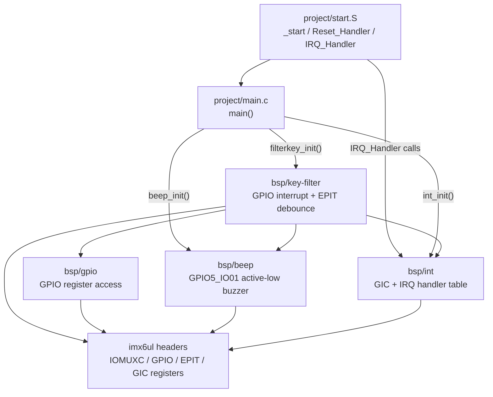
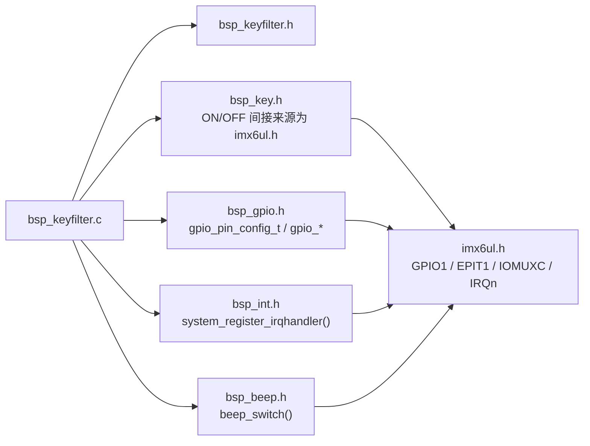
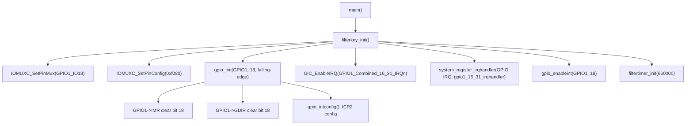
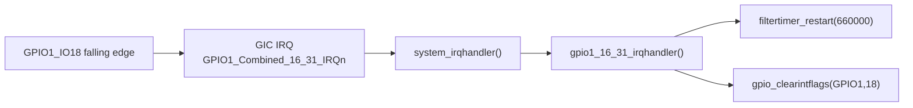
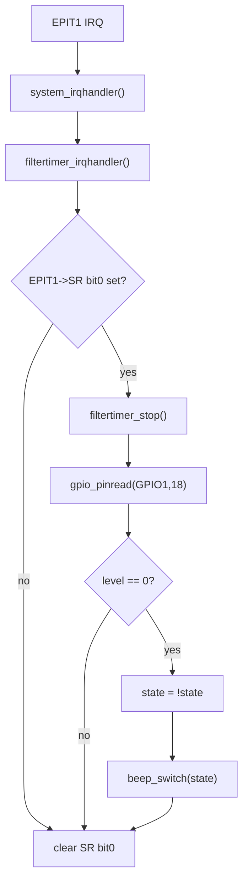
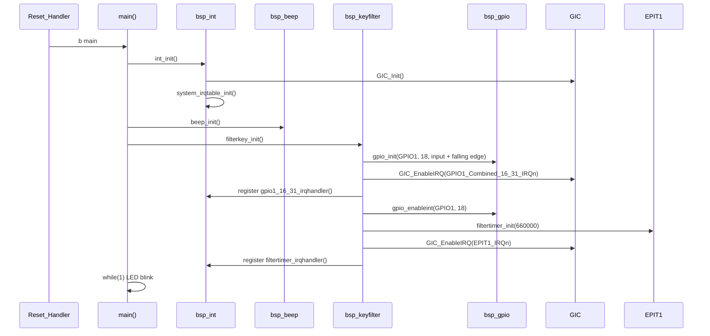
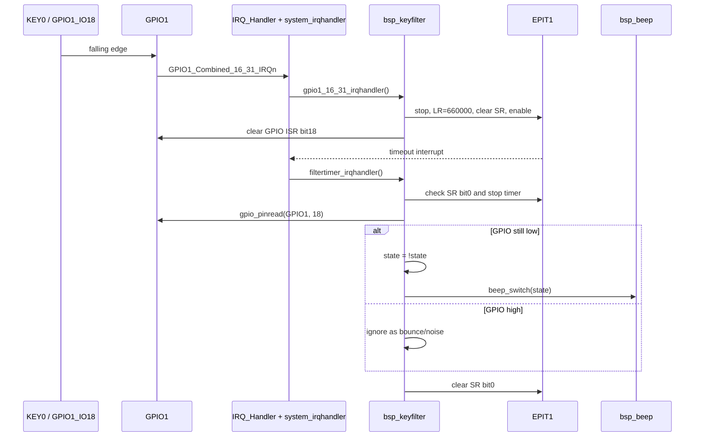
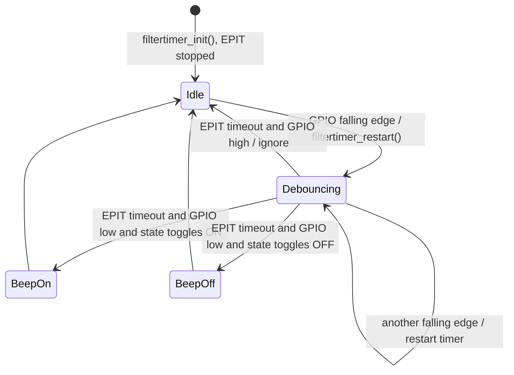
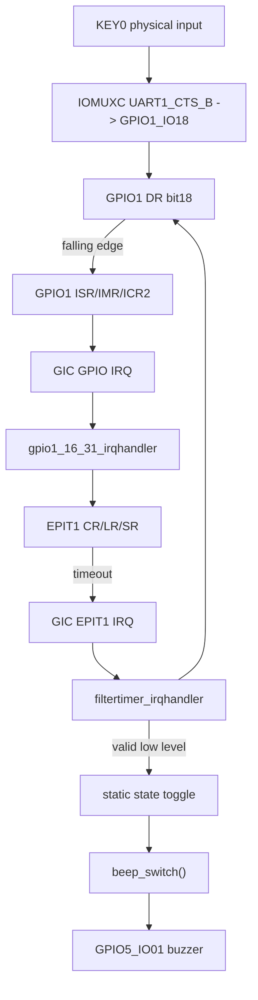
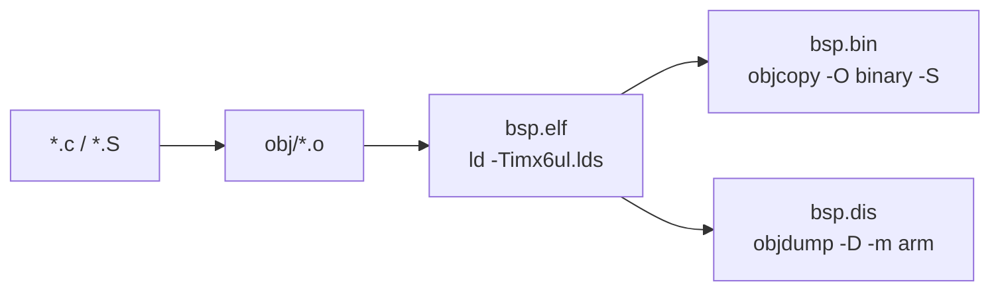

# bsp_keyfilter 按键消抖模块技术文档

## 目录

- [1. 文档范围](#1-文档范围)
- [2. 工程整体架构和目录职责](#2-工程整体架构和目录职责)
- [3. 模块功能与依赖关系](#3-模块功能与依赖关系)
- [4. 文件级代码分析](#4-文件级代码分析)
- [5. 关键函数实现分析](#5-关键函数实现分析)
- [6. 初始化流程、运行流程与状态](#6-初始化流程运行流程与状态)
- [7. 外设访问与寄存器数据流](#7-外设访问与寄存器数据流)
- [8. 编译流程与最终产物](#8-编译流程与最终产物)
- [9. 资源管理、错误处理与日志机制](#9-资源管理错误处理与日志机制)
- [10. 风险点与优化建议](#10-风险点与优化建议)
- [11. 整体架构总结](#11-整体架构总结)

## 1. 文档范围

本文分析当前工程中的 `bsp/key-filter/bsp_keyfilter.c` 与 `bsp/key-filter/bsp_keyfilter.h`，并结合其直接依赖文件说明模块在裸机 BSP 中的调用关系。

已确认存在的相关文件：

```text
project/main.c
project/start.S
Makefile
imx6ul.lds
bsp/key-filter/bsp_keyfilter.c
bsp/key-filter/bsp_keyfilter.h
bsp/gpio/bsp_gpio.c
bsp/gpio/bsp_gpio.h
bsp/int/bsp_int.c
bsp/int/bsp_int.h
bsp/beep/bsp_beep.c
bsp/beep/bsp_beep.h
bsp/key/bsp_key.c
bsp/key/bsp_key.h
```

未在当前工程范围内发现 `CMakeLists.txt`、`Android.bp`、Yocto `.bb/.bbappend` 配方。因此本文不会臆测这些构建系统的内容，只在编译章节说明当前 Makefile 构建链路。

本工程是 i.MX6UL 裸机程序，不是 Linux 内核驱动或 Linux 用户态程序。源码中未出现 `ioctl`、`sysfs`、`procfs`、`socket`、普通文件 I/O 等接口。

## 2. 工程整体架构和目录职责

当前工程是一个裸机 BSP 示例，入口位于 `project/start.S` 和 `project/main.c`，通过 Makefile 收集多个 BSP 子目录源码，链接到固定 DDR 地址 `0x87800000`。

目录职责如下：

| 目录/文件 | 职责 |
| --- | --- |
| `project/start.S` | 异常向量表、复位入口、栈初始化、IRQ 汇编入口、跳转 `main()` |
| `project/main.c` | BSP 初始化顺序与主循环，调用 `filterkey_init()` |
| `bsp/key-filter/` | 按键 GPIO 中断 + EPIT1 定时器消抖模块 |
| `bsp/gpio/` | GPIO 输入输出、GPIO 中断模式配置、IMR/ISR 操作 |
| `bsp/int/` | GIC 初始化后的 C 层 IRQ 分发注册表 |
| `bsp/beep/` | 蜂鸣器 GPIO 控制，供按键消抖确认后切换状态 |
| `bsp/key/` | 轮询式按键驱动示例，当前主流程未调用 |
| `bsp/epit-timer/` | EPIT 定时器示例，当前 key-filter 自己直接配置 EPIT1 |
| `imx6ul/` | SoC 寄存器、IOMUXC、GIC、IRQn 等芯片定义 |
| `Makefile` | 交叉编译、链接、生成 ELF/BIN/DIS |
| `imx6ul.lds` | 链接脚本，定义镜像装载地址和段布局 |

整体架构图：



## 3. 模块功能与依赖关系

`bsp_keyfilter` 模块实现 KEY0 的中断触发和定时器消抖：

1. 将 `UART1_CTS_B` 复用为 `GPIO1_IO18`。
2. 配置 `GPIO1_IO18` 为输入、下降沿中断。
3. 将 `GPIO1_Combined_16_31_IRQn` 注册到 `gpio1_16_31_irqhandler()`。
4. 初始化 `EPIT1` 为消抖定时器，但默认不启动。
5. GPIO 下降沿中断发生后重启 EPIT1。
6. EPIT1 超时后再次读取 GPIO 电平。
7. 若按键仍为低电平，则认为按键有效，翻转蜂鸣器状态。

模块依赖关系：



关键依赖接口：

| 依赖 | 被调用接口/对象 | 用途 |
| --- | --- | --- |
| `bsp_gpio` | `gpio_init()` | 配置 GPIO 方向和中断触发模式 |
| `bsp_gpio` | `gpio_enableint()` | 打开 GPIO IMR 对应位 |
| `bsp_gpio` | `gpio_clearintflags()` | 清除 GPIO ISR 中断状态 |
| `bsp_gpio` | `gpio_pinread()` | 定时器超时后读取按键电平 |
| `bsp_int` | `system_register_irqhandler()` | 注册 GPIO 和 EPIT1 的 C 层中断处理函数 |
| SoC/GIC | `GIC_EnableIRQ()` | 使能 GIC 中对应 IRQ |
| SoC/IOMUXC | `IOMUXC_SetPinMux()` / `IOMUXC_SetPinConfig()` | 复用和 pad 电气属性配置 |
| SoC/EPIT | `EPIT1->CR/LR/CMPR/SR` | 定时器消抖 |
| `bsp_beep` | `beep_switch()` | 有效按键后切换蜂鸣器 |

## 4. 文件级代码分析

### 4.1 `bsp_keyfilter.h`

头文件只导出函数声明，没有结构体、枚举或宏定义：

```c
void filterkey_init(void);
void filtertimer_init(unsigned int value);
void filtertimer_stop(void);
void filtertimer_restart(unsigned int value);
void filtertimer_irqhandler(unsigned int giccIar, void *userParam);
void gpio1_16_31_irqhandler(unsigned int giccIar, void *userParam);
```

接口职责：

| 接口 | 类型 | 职责 |
| --- | --- | --- |
| `filterkey_init()` | 初始化接口 | 配置 KEY0 GPIO 中断并初始化 EPIT1 消抖定时器 |
| `filtertimer_init(value)` | 初始化接口 | 配置 EPIT1 计数器、中断和 IRQ handler |
| `filtertimer_stop()` | 控制接口 | 停止 EPIT1 |
| `filtertimer_restart(value)` | 控制接口 | 清状态、设置装载值并重新启动 EPIT1 |
| `filtertimer_irqhandler()` | IRQ handler | 消抖超时后确认按键状态并切换蜂鸣器 |
| `gpio1_16_31_irqhandler()` | IRQ handler | GPIO 下降沿中断后启动消抖定时器 |

该头文件没有 `extern "C"` 包裹，如未来被 C++ 编译单元引用，需要补充 C++ 兼容保护。

### 4.2 `bsp_keyfilter.c`

文件包含：

```c
#include "bsp_key.h"
#include "bsp_gpio.h"
#include "bsp_int.h"
#include "bsp_beep.h"
#include "bsp_keyfilter.h"
```

当前 `.c` 文件没有定义本地结构体，只定义了一个宏：

```c
#define KEY_FILTER_TIMER_COUNT  (66000000U / 100U)
```

含义：按 EPIT1 选择 66 MHz peripheral clock、分频系数为 1 估算，`66000000 / 100 = 660000` 个计数周期，对应约 10 ms 消抖窗口。

注意：该时间计算依赖 EPIT1 时钟实际为 66 MHz。代码没有动态读取时钟树配置，也没有断言 `imx6u_clkinit()` 后 EPIT1 时钟一定为该值。

## 5. 关键函数实现分析

### 5.1 `filterkey_init()`

源码核心：

```c
IOMUXC_SetPinMux(IOMUXC_UART1_CTS_B_GPIO1_IO18, 0);
IOMUXC_SetPinConfig(IOMUXC_UART1_CTS_B_GPIO1_IO18, 0xf080);

key_config.direction = kGPIO_DigitalInput;
key_config.interruptMode = kGPIO_IntFallingEdge;
key_config.outputLogic = 1;

gpio_init(GPIO1, 18, &key_config);

GIC_EnableIRQ(GPIO1_Combined_16_31_IRQn);
system_register_irqhandler(GPIO1_Combined_16_31_IRQn,
                           gpio1_16_31_irqhandler,
                           NULL);
gpio_enableint(GPIO1, 18);
filtertimer_init(KEY_FILTER_TIMER_COUNT);
```

职责：

- 将 `UART1_CTS_B` pad 复用为 `GPIO1_IO18`。
- 使用 pad 配置值 `0xf080`。同工程 `bsp/key/bsp_key.c` 注释说明该值对应上拉、keeper/pull、100 MHz medium speed、slow slew 等配置。
- 配置 GPIO1 pin 18 为输入。
- 配置下降沿触发中断，适配 KEY0 active-low 的硬件连接。
- 使能 GIC 中 `GPIO1_Combined_16_31_IRQn`。
- 在 BSP 中断表中注册 `gpio1_16_31_irqhandler()`。
- 使能 GPIO 模块 IMR bit 18。
- 初始化 EPIT1 消抖定时器。

调用关系：



### 5.2 `filtertimer_init(unsigned int value)`

源码核心：

```c
EPIT1->CR = 0;
EPIT1->CR = (1U << 24) |
            (1U << 3) |
            (1U << 2) |
            (1U << 1);

EPIT1->LR = value;
EPIT1->CMPR = 0;

GIC_EnableIRQ(EPIT1_IRQn);
system_register_irqhandler(EPIT1_IRQn,
                           filtertimer_irqhandler,
                           NULL);
```

职责：

- 先清零 `EPIT1->CR`，确保定时器停止并清除旧配置。
- 配置 EPIT1 控制寄存器：
  - bit 24：选择 peripheral clock，源码注释认为是 66 MHz。
  - bit 3：reload mode。
  - bit 2：output compare interrupt enable。
  - bit 1：initial value 从 LR 装载。
  - bit 0 未置位，因此初始化后定时器保持关闭。
- 设置 `LR = value`。
- 设置 `CMPR = 0`，即计数到 0 触发比较中断。
- 使能 GIC 中 `EPIT1_IRQn`。
- 注册 `filtertimer_irqhandler()`。

该函数只配置定时器，不启动定时器。启动发生在 GPIO 中断中的 `filtertimer_restart()`。

### 5.3 `filtertimer_stop()`

源码：

```c
EPIT1->CR &= ~(1U << 0);
```

职责：清除 EPIT1 `CR` bit 0，停止计数器。该函数没有清除 `SR` 状态位，状态清除由 `filtertimer_restart()` 和 `filtertimer_irqhandler()` 完成。

### 5.4 `filtertimer_restart(unsigned int value)`

源码：

```c
EPIT1->CR &= ~(1U << 0);
EPIT1->LR = value;
EPIT1->SR |= 1U << 0;
EPIT1->CR |= 1U << 0;
```

职责：

1. 停止 EPIT1。
2. 重新装载定时器周期。
3. 写 1 清除 EPIT1 比较中断状态位。
4. 置位 `CR` bit 0 启动定时器。

该函数用于“重新计时”，因此连续按键抖动产生多个 GPIO 下降沿时，消抖窗口会被刷新到最新一次下降沿之后。

### 5.5 `gpio1_16_31_irqhandler(unsigned int giccIar, void *userParam)`

源码：

```c
(void)giccIar;
(void)userParam;

filtertimer_restart(KEY_FILTER_TIMER_COUNT);

gpio_clearintflags(GPIO1, 18);
```

职责：

- 忽略中断号和用户参数。
- GPIO1_IO18 下降沿到来后启动 10 ms 消抖定时器。
- 清除 GPIO1 pin 18 中断状态。

数据流：



注意：`GPIO1_Combined_16_31_IRQn` 是 GPIO1 16 到 31 组合中断，handler 当前没有检查 `GPIO1->ISR` 是否确实为 pin 18 触发。如果同组其他 pin 也使能中断，该 handler 会误启动消抖定时器。

### 5.6 `filtertimer_irqhandler(unsigned int giccIar, void *userParam)`

源码核心：

```c
static unsigned char state = OFF;

if (EPIT1->SR & (1U << 0)) {
    filtertimer_stop();

    if (gpio_pinread(GPIO1, 18) == 0) {
        state = !state;
        beep_switch(state);
    }
}

EPIT1->SR |= 1U << 0;
```

职责：

- 使用静态局部变量 `state` 保存蜂鸣器目标状态。
- 检查 EPIT1 `SR` bit 0 是否为 output compare 事件。
- 若超时事件有效，停止定时器。
- 再次读取 `GPIO1_IO18`：
  - 若仍为低电平，认为按键稳定按下，翻转 `state`。
  - 调用 `beep_switch(state)` 控制蜂鸣器。
- 最后写 1 清除 EPIT1 `SR` bit 0。

调用关系：



这里的 `state` 初始为 `OFF`。第一次有效按下后变为 `ON`，`beep_switch(ON)` 使蜂鸣器打开；第二次有效按下后变为 `OFF`，蜂鸣器关闭。

## 6. 初始化流程、运行流程与状态

### 6.1 系统初始化时序

`project/main.c` 中的初始化顺序：

```c
int_init();
imx6u_clkinit();
clk_enable();

led_init();
beep_init();
filterkey_init();
```

时序图：



### 6.2 按键运行时序



### 6.3 状态机

该模块没有显式状态机结构体，但存在隐式状态：

- EPIT1 运行状态：停止 / 运行中。
- 蜂鸣器目标状态：`filtertimer_irqhandler()` 内部静态变量 `state`，初始 `OFF`。
- GPIO 输入状态：`GPIO1_IO18` 当前电平，低有效。

状态机图：



注意：当前逻辑只在下降沿后做“按下确认”，没有等待释放后再允许下一次有效按下的状态门控。实际硬件若在长按期间产生额外下降沿噪声，可能再次翻转蜂鸣器。

## 7. 外设访问与寄存器数据流

### 7.1 IOMUXC

`filterkey_init()` 直接访问 IOMUXC 封装接口：

```c
IOMUXC_SetPinMux(IOMUXC_UART1_CTS_B_GPIO1_IO18, 0);
IOMUXC_SetPinConfig(IOMUXC_UART1_CTS_B_GPIO1_IO18, 0xf080);
```

目标：把 `UART1_CTS_B` 管脚配置为 `GPIO1_IO18`，并配置 pad 控制属性。该引脚为 KEY0 输入，低电平表示按下。

### 7.2 GPIO1

GPIO 访问路径：

- `gpio_init(GPIO1, 18, &key_config)`：
  - `IMR` 清 bit 18，初始化时先屏蔽中断。
  - `GDIR` 清 bit 18，配置输入。
  - `ICR2` 配置 pin 18 下降沿触发。
- `gpio_enableint(GPIO1, 18)`：
  - `IMR` 置 bit 18，打开 GPIO 中断。
- `gpio_clearintflags(GPIO1, 18)`：
  - `ISR` 写 1 清 bit 18。
- `gpio_pinread(GPIO1, 18)`：
  - 读取 `DR` bit 18，判断按键是否仍为低电平。

### 7.3 GIC 和 C 层 IRQ 表

GPIO 与 EPIT1 都通过如下模式接入中断系统：

```c
GIC_EnableIRQ(...);
system_register_irqhandler(..., handler, NULL);
```

`system_irqhandler()` 从 `giccIar & 0x3ffUL` 得到中断号，然后调用 `irqTable[intNum].irqHandler(intNum, irqTable[intNum].userParam)`。

### 7.4 EPIT1

EPIT1 寄存器使用：

| 寄存器 | 操作 | 用途 |
| --- | --- | --- |
| `EPIT1->CR` | 清零 | 停止并复位配置 |
| `EPIT1->CR` | 写 bit 24/3/2/1 | 选择时钟、reload、使能 compare interrupt、从 LR 装载 |
| `EPIT1->CR` | bit 0 清/置 | 停止/启动计数 |
| `EPIT1->LR` | 写 `value` | 装载消抖周期 |
| `EPIT1->CMPR` | 写 0 | 计数到 0 触发比较事件 |
| `EPIT1->SR` | 读 bit 0 | 判断 compare interrupt 状态 |
| `EPIT1->SR` | 写 1 bit 0 | 清除 compare interrupt 状态 |

数据流图：



## 8. 编译流程与最终产物

当前工程使用 `Makefile` 构建，未发现 CMake、Android.bp 或 Yocto 配方。

关键 Makefile 配置：

```make
CROSS_COMPILE := arm-linux-gnueabihf-
TARGET        ?= bsp
CC      := $(CROSS_COMPILE)gcc
LD      := $(CROSS_COMPILE)ld
OBJCOPY := $(CROSS_COMPILE)objcopy
OBJDUMP := $(CROSS_COMPILE)objdump
```

`bsp/key-filter` 同时出现在 `INCDIRS` 和 `SRCDIRS`：

```make
INCDIRS := ... bsp/key-filter
SRCDIRS := ... bsp/key-filter
```

编译参数：

```make
CFLAGS := -Wall -O2 -nostdlib -ffreestanding $(INCLUDE)
LDFLAGS := -Timx6ul.lds
```

构建流程：



最终产物：

| 产物 | 说明 |
| --- | --- |
| `obj/bsp_keyfilter.o` | key-filter 模块目标文件 |
| `bsp.elf` | 链接后的 ELF 镜像 |
| `bsp.bin` | 去符号裸二进制镜像，Makefile 默认目标 |
| `bsp.dis` | 反汇编文件 |

链接脚本 `imx6ul.lds` 指定入口和装载地址：

```ld
ENTRY(_start)
. = 0x87800000;
```

因此镜像入口来自 `project/start.S` 的 `_start`，中断向量基址也在 `int_init()` 中设置为 `0x87800000`。

## 9. 资源管理、错误处理与日志机制

### 9.1 资源管理

本模块管理的硬件资源：

| 资源 | 使用者 | 生命周期 |
| --- | --- | --- |
| `GPIO1_IO18` | `filterkey_init()` / IRQ handlers | 初始化后长期占用 |
| `GPIO1_Combined_16_31_IRQn` | `gpio1_16_31_irqhandler()` | 注册后长期有效 |
| `EPIT1` | `filtertimer_*()` | 初始化后作为消抖一次性定时器反复启动/停止 |
| `EPIT1_IRQn` | `filtertimer_irqhandler()` | 注册后长期有效 |
| 蜂鸣器 `GPIO5_IO01` | `beep_switch()` | 由 `beep_init()` 初始化，key-filter 只调用控制接口 |

没有动态内存分配，没有文件描述符，没有 socket，没有 Linux 设备节点，因此不存在常规用户态资源释放流程。

### 9.2 错误处理

当前代码没有返回值，也没有错误码路径：

- `filterkey_init()` 默认 IOMUXC/GPIO/GIC/EPIT 配置全部成功。
- `filtertimer_init()` 默认 IRQ 注册成功。
- `filtertimer_restart()` 不检查 `value` 是否为 0。
- IRQ handler 不检查来源 pin 是否为 GPIO1_IO18。

这符合简单裸机 demo 的常见写法，但作为可维护 BSP 模块，缺少配置参数校验和异常诊断。

### 9.3 日志机制

当前代码未实现日志、串口打印、断言或 trace。中断异常路径中，`default_irqhandler()` 会进入死循环，但没有输出中断号。

## 10. 风险点与优化建议

### 10.1 GPIO 组合中断未确认 pin 来源

风险：`GPIO1_Combined_16_31_IRQn` 覆盖 GPIO1 pin 16 到 31。当前 handler 无条件启动消抖并清 pin 18：

```c
filtertimer_restart(KEY_FILTER_TIMER_COUNT);
gpio_clearintflags(GPIO1, 18);
```

如果同组其他 GPIO 后续也启用中断，会误触发按键消抖。

建议：在 handler 中检查 `GPIO1->ISR & (1U << 18)`，只处理 pin 18。

### 10.2 未清除 GPIO 历史中断状态后再使能

`filterkey_init()` 中调用顺序是注册 handler 后直接 `gpio_enableint(GPIO1, 18)`。如果 GPIO ISR bit 18 在使能前已有残留状态，可能立即进入中断。

建议：使能前增加 `gpio_clearintflags(GPIO1, 18)`。

### 10.3 长按期间可能被额外下降沿重复翻转

当前状态机只在定时器超时后确认低电平，不维护“已按下，等待释放”状态。若长按期间因干扰产生额外下降沿，仍可能再次进入消抖并翻转蜂鸣器。

建议：增加 `pressed/released` 状态，只有从释放态检测到稳定按下才生成一次 key event，稳定释放后回到释放态。

### 10.4 EPIT1 为全局硬件资源，缺少占用说明

`bsp/epit-timer` 目录也存在 EPIT1 示例代码。当前 key-filter 模块直接占用 `EPIT1`。如果未来两个模块同时编译并初始化，会互相覆盖 `EPIT1->CR/LR/CMPR` 和 IRQ handler。

建议：统一 EPIT 资源管理，或在模块文档/头文件中明确 `bsp_keyfilter` 独占 EPIT1。

### 10.5 `KEY_FILTER_TIMER_COUNT` 硬编码时钟假设

当前使用：

```c
#define KEY_FILTER_TIMER_COUNT (66000000U / 100U)
```

风险：如果 EPIT1 时钟源或 IPG clock 频率变化，消抖时间会偏离 10 ms。

建议：将计数值封装为 `EPIT_CLK_HZ / 100`，并由时钟模块提供 EPIT/IPG 时钟频率；或者在注释中明确该值依赖 66 MHz。

### 10.6 中断注册缺少边界和空指针保护

`system_register_irqhandler()` 直接写 `irqTable[irq]`，未检查 `irq < NUMBER_OF_INT_VECTORS`、`handler != NULL`。这不是 key-filter 独有问题，但 key-filter 依赖该机制。

建议：在 `bsp_int` 层增加边界检查，或至少在 debug 构建中断言。

### 10.7 头文件暴露了内部控制函数和 IRQ handler

`bsp_keyfilter.h` 暴露了 `filtertimer_*()` 和 IRQ handler。对外部模块来说，合理公共接口通常只需要 `filterkey_init()`。

建议：如果没有跨文件调用需求，将内部函数改为 `static` 并只在 `.c` 内部声明；头文件保留 `filterkey_init()`。当前中断注册在同一 `.c` 内完成，不要求 handler 外部可见。

### 10.8 无日志导致调试困难

按键消抖、IRQ 注册、EPIT 超时等路径没有任何诊断输出。

建议：如果工程已有 UART/console，可在 debug 宏下增加有限日志；中断 handler 中应避免重日志，只记录计数器或轻量状态。

## 11. 整体架构总结

`bsp_keyfilter` 是一个典型裸机按键消抖模块：用 GPIO 下降沿中断捕获按键按下事件，再用 EPIT1 延迟约 10 ms 后复采样 GPIO 电平，确认稳定低电平后翻转蜂鸣器状态。该设计避免了主循环轮询延时消抖，不阻塞 `main()` 中 LED 闪烁逻辑。

当前实现结构清晰、依赖少、无动态内存，适合作为教学或单功能 demo。但作为可扩展 BSP 组件，还需要补强 GPIO 组合中断来源判断、按下/释放状态门控、EPIT1 资源占用说明、时钟参数化和中断注册健壮性。若后续工程继续增加外设和中断源，建议把“按键事件生成”和“蜂鸣器动作”解耦，形成 `key event -> application callback` 的接口，避免底层按键驱动直接绑定蜂鸣器业务逻辑。
