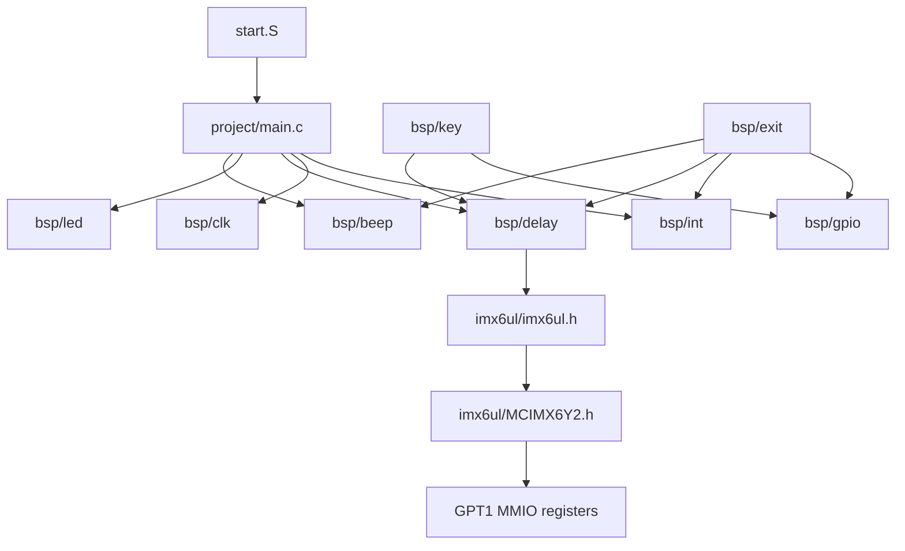
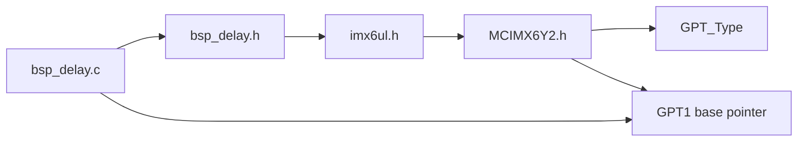
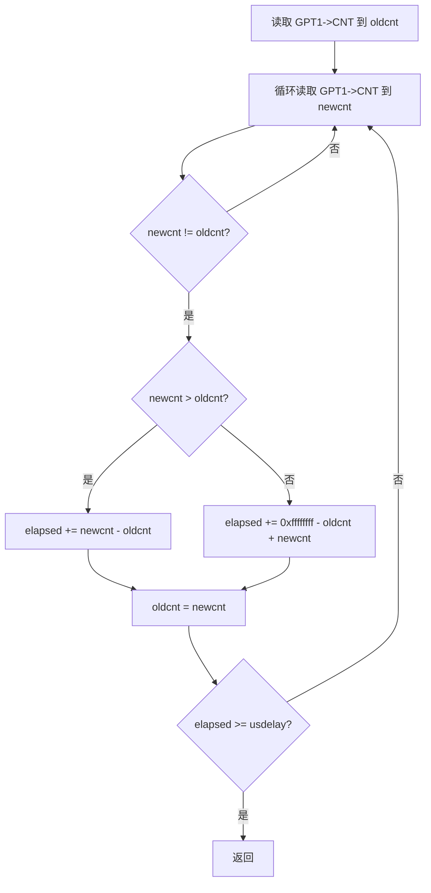
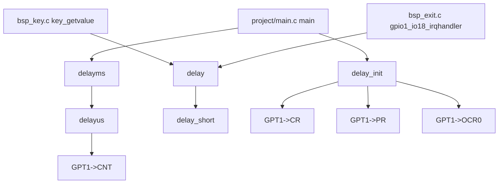
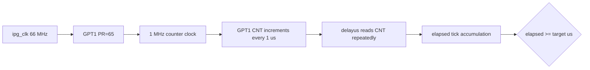
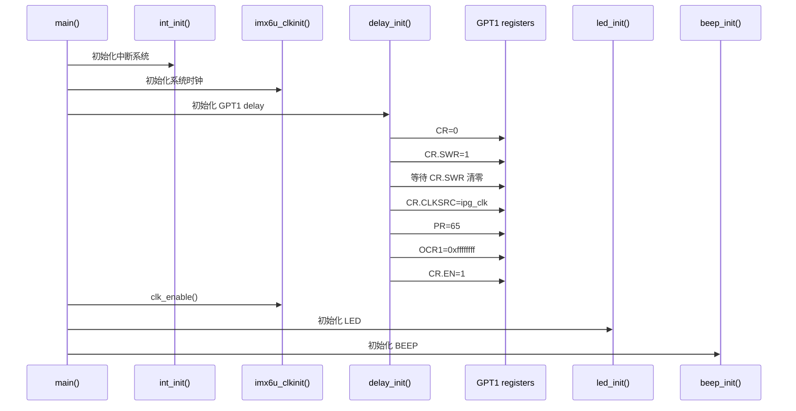
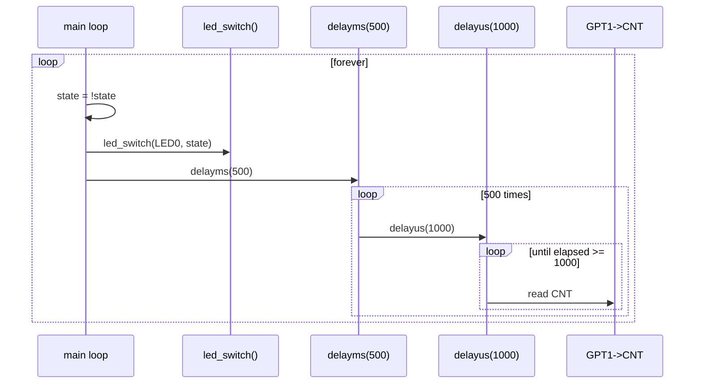
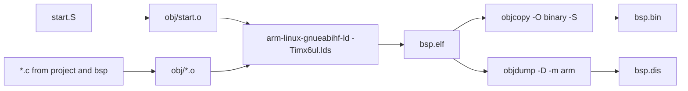

# bsp_delay 高精度延时模块技术文档

## 目录

- [1. 文档范围与源码依据](#1-文档范围与源码依据)
- [2. 工程整体架构和目录职责](#2-工程整体架构和目录职责)
- [3. delay 模块职责与依赖关系](#3-delay-模块职责与依赖关系)
- [4. 文件级代码分析](#4-文件级代码分析)
- [5. 关键函数实现、调用关系和数据流](#5-关键函数实现调用关系和数据流)
- [6. 初始化流程、运行流程与状态](#6-初始化流程运行流程与状态)
- [7. 外设访问分析](#7-外设访问分析)
- [8. 编译流程及最终产物](#8-编译流程及最终产物)
- [9. 资源管理、错误处理和日志机制](#9-资源管理错误处理和日志机制)
- [10. 代码风险与优化建议](#10-代码风险与优化建议)
- [11. 整体架构总结](#11-整体架构总结)

## 1. 文档范围与源码依据

本文档基于当前工程中实际存在的文件生成，重点分析 `bsp/delay` 延时 BSP 模块。

已核对的关键文件：

| 文件 | 作用 |
| --- | --- |
| `bsp/delay/bsp_delay.c` | GPT1 初始化、微秒延时、毫秒延时、粗延时实现 |
| `bsp/delay/bsp_delay.h` | delay 模块对外接口声明 |
| `imx6ul/imx6ul.h` | i.MX6UL 公共头文件聚合器 |
| `imx6ul/MCIMX6Y2.h` | GPT 寄存器结构、基地址、位定义 |
| `project/main.c` | 调用 `delay_init()` 和 `delayms(500)` 的主流程 |
| `Makefile` | 工程编译入口，生成 `bsp.elf`、`bsp.bin`、`bsp.dis` |
| `bsp/key/bsp_key.c` | 调用 `delay(10)` 做按键轮询消抖 |
| `bsp/exit/bsp_exit.c` | 在 GPIO 中断处理函数中调用 `delay(10)` 做消抖 |

未发现的构建文件：

- 当前工程未发现 `CMakeLists.txt`。
- 当前工程未发现 `Android.bp`。
- 当前工程未发现 Yocto `*.bb` / `*.bbappend` 配方。

因此，本文不会臆测 CMake、Android Soong 或 Yocto 构建逻辑。

## 2. 工程整体架构和目录职责

当前工程是 i.MX6UL 裸机 BSP 示例，目录结构由 `Makefile` 的 `INCDIRS` 和 `SRCDIRS` 明确列出：

```makefile
INCDIRS := imx6ul \
           bsp/clk \
           bsp/led \
           bsp/delay \
           bsp/beep \
           bsp/gpio \
           bsp/key \
           bsp/int \
           bsp/exit \
           bsp/epit-timer \
           bsp/key-filter

SRCDIRS := project \
           bsp/clk \
           bsp/led \
           bsp/delay \
           bsp/beep \
           bsp/gpio \
           bsp/key \
           bsp/int \
           bsp/exit \
           bsp/epit-timer \
           bsp/key-filter
```

### 2.1 目录职责

| 目录 | 主要职责 | 与 delay 的关系 |
| --- | --- | --- |
| `project` | 启动汇编和 `main.c` 应用入口 | `main.c` 初始化 delay，并周期调用 `delayms(500)` |
| `imx6ul` | 芯片寄存器、IOMUX、CPU 核心头文件 | 提供 `GPT_Type`、`GPT1` 等寄存器定义 |
| `bsp/clk` | 时钟初始化和外设时钟使能 | delay 假设 GPT1 输入时钟 `ipg_clk = 66 MHz` |
| `bsp/delay` | GPT1 高精度延时和软件粗延时 | 本文重点模块 |
| `bsp/gpio` | GPIO 初始化、读写、中断控制 | key/exit 模块使用 delay 做消抖 |
| `bsp/key` | KEY0 轮询读取和软件消抖 | 依赖 `delay(10)` |
| `bsp/exit` | GPIO 外部中断初始化和 ISR | ISR 中调用 `delay(10)` |
| `bsp/led` | LED 初始化和开关控制 | `main.c` 中 LED 翻转后调用 `delayms(500)` |
| `bsp/beep` | 蜂鸣器初始化和开关控制 | `exit` ISR 中按键触发蜂鸣器切换 |
| `bsp/int` | GIC/系统中断表初始化和分发 | `exit`/`key-filter` 使用 |
| `bsp/epit-timer` | EPIT 定时器模块 | 与 GPT delay 属于不同定时器路径 |
| `bsp/key-filter` | 基于定时器的按键滤波 | 与 `delay()` 消抖形成替代实现 |

### 2.2 工程架构图



## 3. delay 模块职责与依赖关系

`bsp_delay` 是一个裸机忙等延时模块，提供两类延时能力：

1. 基于 GPT1 计数器的精确延时：`delay_init()`、`delayus()`、`delayms()`。
2. 纯软件循环粗延时：`delay_short()`、`delay()`。

### 3.1 模块依赖

`bsp_delay.h` 只包含一个芯片公共头文件：

```c
#include "imx6ul.h"
```

`imx6ul.h` 本身是聚合头文件：

```c
#include "cc.h"
#include "MCIMX6Y2.h"
#include "fsl_common.h"
#include "fsl_iomuxc.h"
#include "core_ca7.h"
```

delay 模块真正依赖的是 `MCIMX6Y2.h` 中的 GPT 定义：

```c
typedef struct {
  __IO uint32_t CR;
  __IO uint32_t PR;
  __IO uint32_t SR;
  __IO uint32_t IR;
  __IO uint32_t OCR[3];
  __I  uint32_t ICR[2];
  __I  uint32_t CNT;
} GPT_Type;

#define GPT1_BASE (0x2098000u)
#define GPT1      ((GPT_Type *)GPT1_BASE)
```

### 3.2 依赖关系图



## 4. 文件级代码分析

### 4.1 `bsp_delay.h`

源码：

```c
#ifndef __BSP_DELAY_H
#define __BSP_DELAY_H

#include "imx6ul.h"

void delay_init(void);
void delayus(unsigned int usdelay);
void delayms(unsigned int msdelay);
void delay_short(volatile unsigned int n);
void delay(volatile unsigned int n);

#endif /* __BSP_DELAY_H */
```

接口说明：

| 接口 | 参数 | 返回值 | 职责 |
| --- | --- | --- | --- |
| `delay_init` | 无 | 无 | 复位并配置 GPT1，使 GPT1 用作延时基准 |
| `delayus` | `usdelay`：微秒数 | 无 | 基于 GPT1 `CNT` 忙等指定微秒数 |
| `delayms` | `msdelay`：毫秒数 | 无 | 循环调用 `delayus(1000)` |
| `delay_short` | `n`：软件循环次数 | 无 | 空循环粗延时 |
| `delay` | `n`：外层循环次数 | 无 | 多次调用 `delay_short(0x7ff)` 的传统粗延时 |

头文件没有定义模块私有结构体或宏。所有寄存器类型、寄存器地址和位定义均来自 `imx6ul.h -> MCIMX6Y2.h`。

### 4.2 `bsp_delay.c`

#### 4.2.1 `delay_init`

源码：

```c
void delay_init(void)
{
    GPT1->CR = 0;

    GPT1->CR = 1U << 15;
    while ((GPT1->CR >> 15) & 0x1) {
    }

    GPT1->CR = 1U << 6;

    GPT1->PR = 65;
    GPT1->OCR[0] = 0xffffffff;

    GPT1->CR |= 1U << 0;
}
```

寄存器访问：

| 语句 | 寄存器 | 位/值 | 作用 |
| --- | --- | --- | --- |
| `GPT1->CR = 0` | `CR` | 全 0 | 停止/清空 GPT1 控制配置 |
| `GPT1->CR = 1U << 15` | `CR.SWR` | bit15 = 1 | 发起 GPT 软件复位 |
| `while ((GPT1->CR >> 15) & 0x1)` | `CR.SWR` | 等待 bit15 清零 | 等待硬件复位完成 |
| `GPT1->CR = 1U << 6` | `CR.CLKSRC` | bit8:6 = `001` | 选择时钟源为 ipg_clk |
| `GPT1->PR = 65` | `PR.PRESCALER` | 65 | 分频系数为 `65 + 1` |
| `GPT1->OCR[0] = 0xffffffff` | `OCR1` | 最大值 | 输出比较 1 设置到 32 位最大值 |
| `GPT1->CR |= 1U << 0` | `CR.EN` | bit0 = 1 | 使能 GPT1 |

代码注释说明输入时钟为 66 MHz，预分频寄存器设置为 65，因此计数频率为：

```text
66 MHz / (65 + 1) = 1 MHz
```

所以 GPT1 计数器每增加 1 表示 1 us。

需要注意：源码注释写的是 free-running mode，但代码只设置了 `CR.CLKSRC = 1` 和 `CR.EN = 1`，没有显式设置 `GPT_CR_FRR` bit9。若芯片复位默认 `FRR = 0`，则严格意义上不是显式 free-running 配置。当前代码通过 `OCR[0] = 0xffffffff` 使比较点位于最大值，实际运行表现接近 32 位长周期计数，但文档不把它等同于已显式设置 FRR。

#### 4.2.2 `delayus`

源码：

```c
void delayus(unsigned int usdelay)
{
    unsigned long oldcnt;
    unsigned long newcnt;
    unsigned long elapsed = 0;

    oldcnt = GPT1->CNT;

    while (1) {
        newcnt = GPT1->CNT;

        if (newcnt != oldcnt) {
            if (newcnt > oldcnt) {
                elapsed += newcnt - oldcnt;
            } else {
                elapsed += 0xffffffff - oldcnt + newcnt;
            }

            oldcnt = newcnt;

            if (elapsed >= usdelay) {
                break;
            }
        }
    }
}
```

实现逻辑：

1. 读取当前 GPT1 `CNT` 作为 `oldcnt`。
2. 循环读取 `CNT` 到 `newcnt`。
3. 只有 `newcnt != oldcnt` 时才累计流逝 tick。
4. 若 `newcnt > oldcnt`，说明计数器未回绕，累计 `newcnt - oldcnt`。
5. 否则认为发生 32 位回绕，累计 `0xffffffff - oldcnt + newcnt`。
6. 当累计 tick 数 `elapsed >= usdelay` 时退出。

数据流：



#### 4.2.3 `delayms`

源码：

```c
void delayms(unsigned int msdelay)
{
    unsigned int i;

    for (i = 0; i < msdelay; i++) {
        delayus(1000);
    }
}
```

`delayms()` 不直接访问硬件，只按毫秒数循环调用 `delayus(1000)`。因此它的精度、阻塞特性和错误风险都继承自 `delayus()`。

#### 4.2.4 `delay_short`

源码：

```c
void delay_short(volatile unsigned int n)
{
    while (n--) {
    }
}
```

`volatile` 用于阻止编译器把空循环完全优化掉。该函数不依赖 GPT1，不需要 `delay_init()`，适合极早期硬件未初始化时的短延时需求，但延时时长与 CPU 主频、编译选项、流水线状态有关，不具备确定的时间单位。

#### 4.2.5 `delay`

源码：

```c
void delay(volatile unsigned int n)
{
    while (n--) {
        delay_short(0x7ff);
    }
}
```

`delay()` 是粗粒度兼容接口。当前工程中它被用于按键消抖：

```c
/* bsp/key/bsp_key.c */
if (released && gpio_pinread(KEY0_GPIO, KEY0_PIN) == 0) {
    delay(10);
    ...
}
```

```c
/* bsp/exit/bsp_exit.c */
void gpio1_io18_irqhandler(unsigned int giccIar, void *userParam)
{
    ...
    delay(10);
    ...
}
```

## 5. 关键函数实现、调用关系和数据流

### 5.1 实际调用关系

工程中实际发现的 delay 调用点：

| 调用方 | 调用 | 用途 |
| --- | --- | --- |
| `project/main.c` | `delay_init()` | 主流程初始化 GPT1 delay |
| `project/main.c` | `delayms(500)` | LED0 每 500 ms 翻转一次 |
| `bsp/key/bsp_key.c` | `delay(10)` | KEY0 轮询消抖 |
| `bsp/exit/bsp_exit.c` | `delay(10)` | GPIO1_IO18 中断消抖 |
| `bsp/delay/bsp_delay.c` | `delayus(1000)` | `delayms()` 内部调用 |
| `bsp/delay/bsp_delay.c` | `delay_short(0x7ff)` | `delay()` 内部调用 |

### 5.2 调用关系图



### 5.3 GPT1 延时数据流



## 6. 初始化流程、运行流程与状态

### 6.1 主初始化流程

`project/main.c` 的实际初始化顺序：

```c
int_init();
imx6u_clkinit();
delay_init();
clk_enable();

led_init();
beep_init();
```

对应流程：



注意：从代码顺序看，`delay_init()` 在 `clk_enable()` 之前调用。是否安全取决于 `imx6u_clkinit()` 是否已经保证 GPT1 所需时钟可用。仅凭 delay 模块源码无法确认 GPT1 时钟门控状态。

### 6.2 主运行流程

```c
while (1) {
    state = !state;
    led_switch(LED0, state);
    delayms(500);
}
```

运行时序：



### 6.3 线程和状态机

该工程是裸机程序，当前 delay 模块没有线程、任务、锁、信号量或显式状态机。

模块隐含状态：

| 状态 | 位置 | 说明 |
| --- | --- | --- |
| GPT1 是否已初始化 | GPT1 硬件寄存器 | 由 `delay_init()` 配置，没有软件标志记录 |
| GPT1 当前计数值 | `GPT1->CNT` | `delayus()` 反复读取 |
| 软件粗延时循环计数 | 栈上参数/局部变量 | `delay()` 和 `delay_short()` 使用 |

## 7. 外设访问分析

### 7.1 MMIO 寄存器访问

delay 模块通过 `GPT1` 指针直接访问物理寄存器：

```c
#define GPT1_BASE (0x2098000u)
#define GPT1      ((GPT_Type *)GPT1_BASE)
```

实际访问的寄存器：

| 寄存器 | 访问函数 | 访问类型 | 用途 |
| --- | --- | --- | --- |
| `GPT1->CR` | `delay_init()` | 写/读轮询 | 复位、选择时钟、使能 GPT1 |
| `GPT1->PR` | `delay_init()` | 写 | 设置预分频 |
| `GPT1->OCR[0]` | `delay_init()` | 写 | 设置输出比较 1 为最大值 |
| `GPT1->CNT` | `delayus()` | 读 | 获取当前计数值 |

### 7.2 未使用的 Linux/用户态外设接口

当前源码未使用以下接口：

- `ioctl`
- `sysfs`
- `procfs`
- socket
- 普通文件读写
- Linux kernel driver API
- 设备树运行时解析

这是裸机 BSP 代码，外设访问方式是直接 MMIO。

## 8. 编译流程及最终产物

### 8.1 编译工具链

`Makefile` 指定交叉编译前缀：

```makefile
CROSS_COMPILE := arm-linux-gnueabihf-
CC      := $(CROSS_COMPILE)gcc
LD      := $(CROSS_COMPILE)ld
OBJCOPY := $(CROSS_COMPILE)objcopy
OBJDUMP := $(CROSS_COMPILE)objdump
```

### 8.2 编译参数

```makefile
CFLAGS  := -Wall -O2 -nostdlib -ffreestanding $(INCLUDE)
ASFLAGS := $(CFLAGS)
LDFLAGS := -Timx6ul.lds
```

含义：

| 参数 | 作用 |
| --- | --- |
| `-Wall` | 打开常见告警 |
| `-O2` | 二级优化 |
| `-nostdlib` | 不链接标准 C 运行库 |
| `-ffreestanding` | 裸机/自由环境编译 |
| `-Timx6ul.lds` | 使用自定义链接脚本 |

### 8.3 源文件收集和对象文件生成

`Makefile` 通过目录扫描收集源码：

```makefile
SFILES := $(foreach dir,$(SRCDIRS),$(wildcard $(dir)/*.S))
CFILES := $(foreach dir,$(SRCDIRS),$(wildcard $(dir)/*.c))

OBJS := $(patsubst %.S,$(OBJDIR)/%.o,$(notdir $(SFILES))) \
        $(patsubst %.c,$(OBJDIR)/%.o,$(notdir $(CFILES)))
```

delay 模块对应产物为：

```text
obj/bsp_delay.o
```

### 8.4 链接和最终产物

默认目标：

```makefile
all: $(TARGET).bin
```

生成流程：

```makefile
$(LD) $(LDFLAGS) -o $(TARGET).elf $^
$(OBJCOPY) -O binary -S $(TARGET).elf $@
$(OBJDUMP) -D -m arm $(TARGET).elf > $(TARGET).dis
```

当前工程中已存在的最终产物：

| 产物 | 说明 |
| --- | --- |
| `bsp.elf` | 链接后的 ELF 文件 |
| `bsp.bin` | 去符号后的裸二进制镜像 |
| `bsp.dis` | 反汇编输出 |
| `load.imx` | 当前目录存在该文件，但它不是由当前 `Makefile` 直接生成 |

构建流程图：



## 9. 资源管理、错误处理和日志机制

### 9.1 资源管理

delay 模块管理的唯一硬件资源是 GPT1。

当前行为：

- `delay_init()` 会直接重置并重新配置 GPT1。
- 模块没有 `delay_deinit()`。
- 模块没有保存 GPT1 旧配置。
- 模块没有检查 GPT1 是否已被其他模块占用。
- 模块没有中断资源申请，不使用 GPT IRQ。

因此，GPT1 在本工程中应视为 delay 模块独占资源。

### 9.2 错误处理

当前 delay 模块所有接口返回 `void`，没有错误码。

潜在失败点：

| 位置 | 失败模式 | 当前处理 |
| --- | --- | --- |
| `delay_init()` 等待 `CR.SWR` 清零 | GPT1 时钟不可用或硬件异常导致永久等待 | 无限循环，无超时 |
| `delayus()` 等待 `CNT` 变化 | GPT1 未启动、时钟门控关闭或计数器不动 | 无限循环，无超时 |
| `delayms()` 大参数 | 长时间阻塞 | 无提前返回或看门狗处理 |

### 9.3 日志机制

当前 delay 模块没有日志输出，也没有 `printf`、串口、断言或错误统计。

这符合裸机早期 BSP 的最小实现方式，但不利于定位 GPT 时钟未使能、复位未完成、计数器不动等问题。

## 10. 代码风险与优化建议

### 10.1 `delay_init()` 未显式设置 free-running bit

源码注释写明 free-running mode：

```c
 * Mode         : free-running mode
```

但实际代码：

```c
GPT1->CR = 1U << 6;
```

该语句只设置 `CR.CLKSRC` 的 bit6。`MCIMX6Y2.h` 中 `GPT_CR_FRR_SHIFT` 是 bit9，当前没有显式设置。

建议：

```c
GPT1->CR = (1U << 6) | (1U << 9);
```

或使用 SDK 宏提升可读性：

```c
GPT1->CR = GPT_CR_CLKSRC(1) | GPT_CR_FRR(1);
```

### 10.2 `delayus()` 回绕累计少 1 tick

当前回绕计算：

```c
elapsed += 0xffffffff - oldcnt + newcnt;
```

若 `oldcnt = 0xfffffffe`，`newcnt = 0`，实际跨过 `0xffffffff` 和 `0` 两个 tick，当前公式得到 `1`。更严谨的 32 位回绕累计应为：

```c
elapsed += 0xffffffffU - oldcnt + newcnt + 1U;
```

更简洁的方式是使用无符号 32 位自然溢出：

```c
uint32_t start = GPT1->CNT;
while ((uint32_t)(GPT1->CNT - start) < usdelay) {
}
```

### 10.3 `delayus(0)` 会至少等待一个 tick

当前 `delayus()` 只有在 `newcnt != oldcnt` 后才检查：

```c
if (elapsed >= usdelay) {
    break;
}
```

当 `usdelay == 0` 时，函数仍然会等待 `CNT` 变化一次。建议函数入口直接返回：

```c
if (usdelay == 0) {
    return;
}
```

### 10.4 `unsigned long` 宽度不固定

当前使用：

```c
unsigned long oldcnt;
unsigned long newcnt;
unsigned long elapsed = 0;
```

在 ARM 32 位交叉编译环境通常是 32 位，但从代码可移植性和寄存器语义看，`GPT1->CNT` 是 `uint32_t`。建议统一使用 `uint32_t`，避免宿主或工具链差异造成语义变化。

### 10.5 GPT1 时钟假设没有运行时校验

源码注释假设：

```c
 *   ipg_clk = 66 MHz
```

但 delay 模块没有检查或配置 CCM 时钟。若 `imx6u_clkinit()` 修改了 IPG 时钟，或者 GPT1 时钟门控未打开，则延时精度会失效，甚至永久阻塞。

建议：

- 在模块注释中明确 `delay_init()` 的前置条件：GPT1 IPG 时钟已使能，频率为 66 MHz。
- 或把 GPT1 时钟使能和频率配置收敛到 delay 初始化路径。
- 至少增加复位等待和计数等待超时保护。

### 10.6 中断处理函数中调用粗延时

`bsp_exit.c` 中断处理函数里调用：

```c
delay(10);
```

这会在 IRQ 上下文中忙等，增加中断延迟。源码注释已经提示生产场景应把消抖延后到 timer/bottom-half 风格处理。

建议：

- 裸机示例可保留。
- 若用于可维护 BSP，建议使用 EPIT/GPT 定时器做延迟确认，ISR 只清中断和启动滤波定时器。

### 10.7 `Makefile` 对同名源文件不安全

对象文件生成使用 `$(notdir ...)`：

```makefile
OBJS := $(patsubst %.c,$(OBJDIR)/%.o,$(notdir $(CFILES)))
```

如果不同目录出现同名 `.c` 文件，会映射到同一个 `obj/xxx.o`，产生覆盖或错误依赖。当前已知源码没有暴露这个冲突，但这是工程级风险。

建议保留目录层级生成对象文件，或给不同模块对象加前缀。

## 11. 整体架构总结

`bsp_delay` 是当前 i.MX6UL 裸机工程的基础 BSP 服务模块。它通过 `MCIMX6Y2.h` 暴露的 `GPT1` MMIO 指针直接配置 GPT1，把 66 MHz `ipg_clk` 经 `PR=65` 分频为 1 MHz，从而让 `CNT` 每 tick 对应 1 us。上层通过 `delayus()` 和 `delayms()` 获得相对精确的忙等延时，通过 `delay()`/`delay_short()` 保留早期或兼容性的粗延时。

该实现结构简单、依赖少，适合裸机教学和早期 bring-up。但从 BSP 可维护性看，应优先修正 `FRR` 未显式设置、回绕少 1 tick、`delayus(0)` 行为、无超时保护和 IRQ 中忙等消抖等问题。若后续工程复杂度增加，建议把 GPT1 资源所有权、时钟前置条件和延时 API 行为写入模块头文件注释，并使用 `uint32_t` 与 SDK 位宏替代裸魔数。
