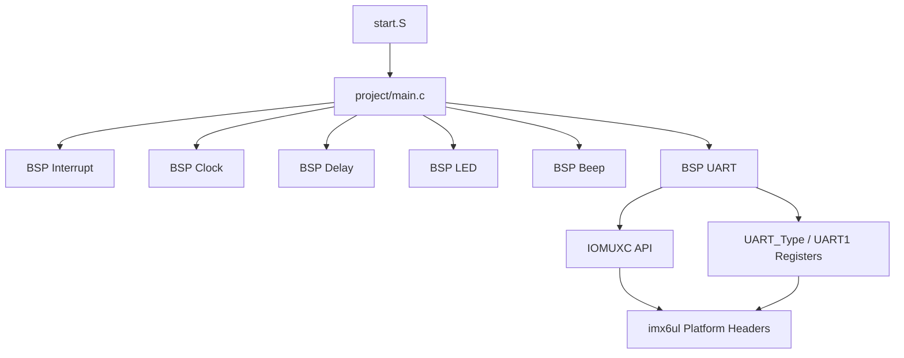
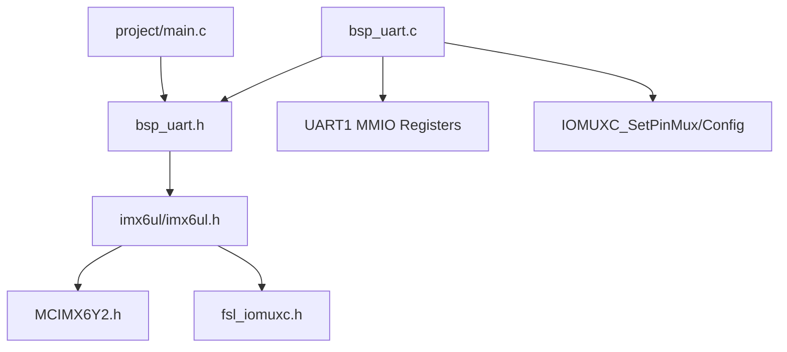
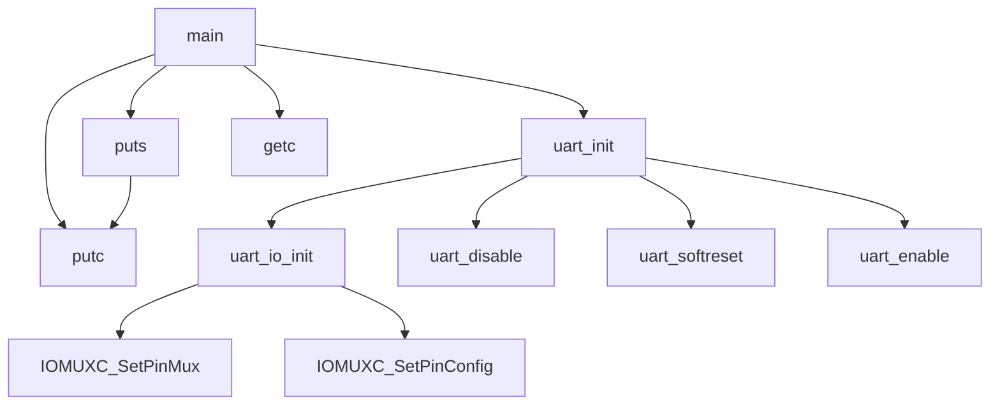
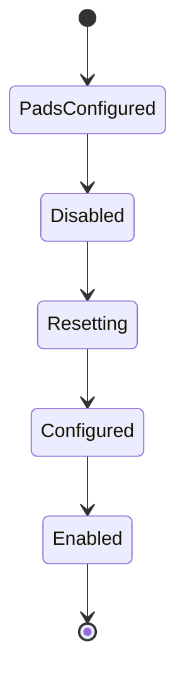
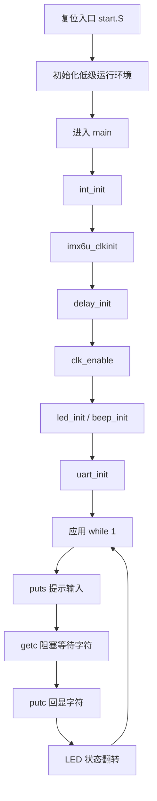
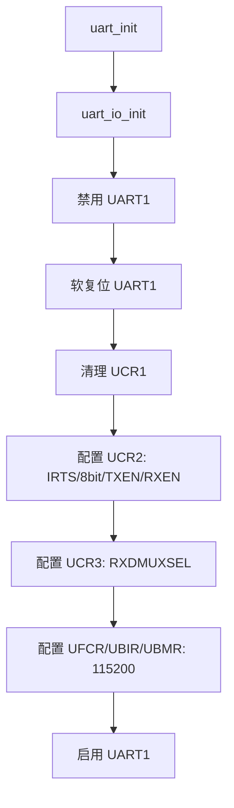
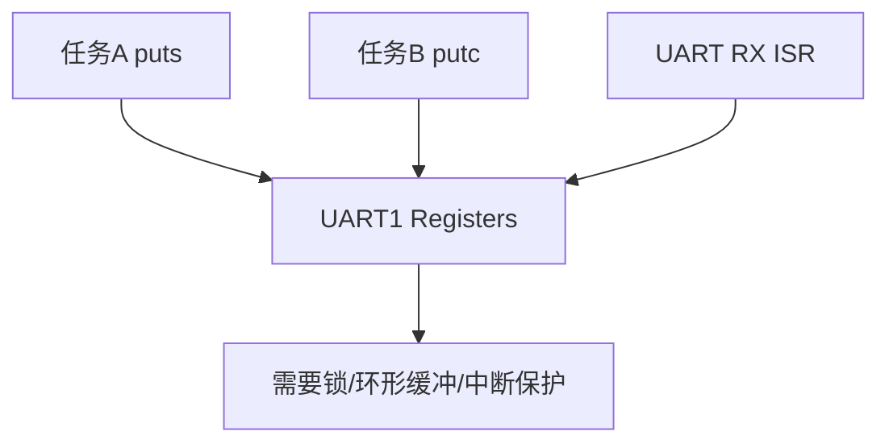

# i.MX6UL UART BSP 软件设计说明书

## 目录

1. [整体架构分析](#1-整体架构分析)  
2. [文件分析](#2-文件分析)  
3. [函数分析](#3-函数分析)  
4. [数据结构分析](#4-数据结构分析)  
5. [执行流程](#5-执行流程)  
6. [线程分析](#6-线程分析)  
7. [资源分析](#7-资源分析)  
8. [接口分析](#8-接口分析)  
9. [代码质量分析](#9-代码质量分析)  
10. [结论](#10-结论)

## 1. 整体架构分析

### 1.1 工程功能定位

本工程是 i.MX6UL 裸机 UART 示例工程的一部分，目标是在无操作系统环境下完成 UART1 串口初始化，并向上层应用提供同步阻塞式字符收发能力。当前分析对象为 `bsp/uart/bsp_uart.c` 与 `bsp/uart/bsp_uart.h`。

| 项目 | 说明 |
|---|---|
| 工程作用 | 初始化 i.MX6UL UART1 引脚复用、控制寄存器、波特率相关寄存器，并提供基础字符输入输出 API |
| 所属层次 | Driver / HAL 边界层。代码直接访问 SoC 寄存器，属于 BSP Driver；头文件向应用提供较薄的 HAL 风格接口 |
| 对外能力 | UART1 初始化、启用/禁用、软复位、波特率计算配置、阻塞发送字符、阻塞发送字符串、阻塞接收字符 |
| 输入 | 应用层调用、UART RX 引脚输入、UART 控制器状态位、源时钟频率与目标波特率 |
| 输出 | UART TX 引脚串行数据、UART 控制器寄存器配置状态、返回接收到的 8-bit 字符 |

### 1.2 目录结构

当前 UART 模块所在工程目录结构如下：

```text
13-uart/
├── Makefile
├── imx6ul.lds
├── imx6ul/
│   ├── imx6ul.h
│   ├── MCIMX6Y2.h
│   ├── fsl_iomuxc.h
│   ├── fsl_common.h
│   ├── core_ca7.h
│   └── cc.h
├── project/
│   ├── start.S
│   └── main.c
├── bsp/
│   ├── beep/
│   ├── clk/
│   ├── delay/
│   ├── epittimer/
│   ├── exit/
│   ├── gpio/
│   ├── int/
│   ├── key/
│   ├── keyfilter/
│   ├── led/
│   └── uart/
│       ├── bsp_uart.c
│       └── bsp_uart.h
└── obj/
```

| 目录 | 职责 |
|---|---|
| `project/` | 启动汇编与应用入口，负责系统初始化顺序编排和业务循环 |
| `bsp/` | 板级支持包，封装外设驱动和基础硬件能力 |
| `bsp/uart/` | UART1 串口驱动，负责引脚复用、控制器初始化、轮询式收发 |
| `imx6ul/` | SoC 设备头文件、寄存器结构体、位域宏、IOMUXC 内联函数 |
| `obj/` | 编译中间产物 |
| 根目录 | 构建脚本、链接脚本、最终镜像与反汇编产物 |

### 1.3 模块划分

| 模块 | 职责 | 边界 | 依赖 |
|---|---|---|---|
| Application | 示例主循环，完成 echo 行为和 LED 状态切换 | 不直接访问 UART 寄存器 | BSP UART、Clock、Delay、LED、Beep、Interrupt |
| Startup | 初始化栈、异常向量、跳转 `main` | 与 C 运行时和链接脚本相关 | SoC 启动约定 |
| Clock BSP | 初始化与开启外设时钟 | 提供 UART 等外设可用的时钟基础 | CCM 寄存器 |
| UART BSP | UART1 引脚与控制器配置、阻塞收发 | 只暴露字符级 API，不管理协议帧或缓冲队列 | IOMUXC、UART 寄存器定义 |
| GPIO/LED/Beep BSP | 其他板级外设控制 | 与 UART 无直接数据耦合 | GPIO、IOMUXC、Clock |
| Platform Header | 描述 SoC 寄存器、宏和内联访问函数 | 不包含业务策略 | NXP CMSIS/SDK 风格定义 |

模块初始化顺序由 `project/main.c` 编排：

1. `int_init()`
2. `imx6u_clkinit()`
3. `delay_init()`
4. `clk_enable()`
5. `led_init()`
6. `beep_init()`
7. `uart_init()`
8. 进入应用主循环

模块关系图：



## 2. 文件分析

### 2.1 `bsp_uart.h`

| 项目 | 说明 |
|---|---|
| 文件作用 | UART BSP 对外接口声明 |
| 为什么存在 | 隔离应用层与 UART 实现细节，使 `main.c` 只依赖函数接口而非直接操作寄存器 |
| 主要功能 | 声明 UART 初始化、启停、复位、波特率设置、字符/字符串收发、`raise` 桩函数 |
| 主要数据结构 | 不定义新结构体；使用 `imx6ul.h` 提供的 `UART_Type` |
| 主要接口 | `uart_init`、`uart_io_init`、`uart_disable`、`uart_enable`、`uart_softreset`、`uart_setbaudrate`、`putc`、`puts`、`getc`、`raise` |
| 被哪些文件调用 | `project/main.c`、`bsp_uart.c` |
| 调用哪些文件 | 无函数调用；通过 `#include "imx6ul.h"` 引入平台定义 |
| 依赖头文件 | `imx6ul.h`，间接依赖 `MCIMX6Y2.h`、`fsl_iomuxc.h` 等 |

### 2.2 `bsp_uart.c`

| 项目 | 说明 |
|---|---|
| 文件作用 | UART1 驱动实现文件 |
| 为什么存在 | 封装 i.MX6UL UART 控制器寄存器配置和轮询收发逻辑 |
| 主要功能 | 初始化 UART1 为 115200-8N1、配置 TX/RX Pad、控制 UART 使能/复位、计算波特率分频、阻塞发送与接收 |
| 主要数据结构 | 使用 `UART_Type *base` 表示 UART 控制器实例；直接使用 `UART1` 宏作为默认实例 |
| 主要接口 | 与 `bsp_uart.h` 一一对应 |
| 被哪些文件调用 | `project/main.c` 调用 `uart_init`、`puts`、`getc`、`putc`；本文件内部互相调用 |
| 调用哪些文件/模块 | `IOMUXC_SetPinMux`、`IOMUXC_SetPinConfig`，访问 `UART1` 寄存器 |
| 依赖头文件 | `bsp_uart.h` -> `imx6ul.h` -> `MCIMX6Y2.h`、`fsl_iomuxc.h` |

文件依赖关系图：



## 3. 函数分析

### 3.1 函数总览

| 函数 | 功能 | 调用者 | 被调用函数 |
|---|---|---|---|
| `uart_init` | 初始化 UART1 为 115200-8N1 | `main.c` | `uart_io_init`、`uart_disable`、`uart_softreset`、`uart_enable` |
| `uart_io_init` | 配置 UART1 TX/RX 引脚复用和 Pad 属性 | `uart_init` | `IOMUXC_SetPinMux`、`IOMUXC_SetPinConfig` |
| `uart_setbaudrate` | 基于目标波特率和源时钟计算并配置分频寄存器 | 当前工程未调用 | 无外部函数调用 |
| `uart_disable` | 清除 UART enable 位 | `uart_init` 或潜在外部调用 | 无 |
| `uart_enable` | 设置 UART enable 位 | `uart_init` 或潜在外部调用 | 无 |
| `uart_softreset` | 对 UART 控制器执行软复位并等待完成 | `uart_init` 或潜在外部调用 | 无 |
| `putc` | 阻塞发送 1 字节 | `main.c`、`puts` | 无 |
| `puts` | 阻塞发送以 NUL 结尾的字符串 | `main.c` | `putc` |
| `getc` | 阻塞接收 1 字节 | `main.c` | 无 |
| `raise` | 裸机工具链所需桩函数 | libgcc/编译器运行时潜在引用 | 无 |

函数调用图：



### 3.2 `uart_init(void)`

| 项目 | 说明 |
|---|---|
| 功能 | 完成 UART1 Pad、控制器复位、帧格式、RXDMUXSEL、波特率寄存器和使能配置 |
| 输入参数 | 无 |
| 返回值 | 无 |
| 主要流程 | 配置 IO -> 禁用 UART -> 软复位 -> 清 UCR1 -> 配置 UCR2 8N1/TX/RX/IRTS -> 设置 UCR3 RXDMUXSEL -> 配置 UFCR/UBIR/UBMR -> 使能 UART |
| 状态变化 | UART1 从未知/复位态进入启用态；TX/RX Pad 切到 UART 功能 |
| 资源申请 | 无动态资源；占用 UART1 外设和对应 TX/RX 引脚 |
| 资源释放 | 无 |
| 锁 | 无 |
| 错误处理 | 无返回码；软复位等待无超时 |
| 异常路径 | 若 UART 时钟未开启、寄存器不可访问或复位位不恢复，可能永久阻塞 |

状态机：



### 3.3 `uart_io_init(void)`

| 项目 | 说明 |
|---|---|
| 功能 | 将 `UART1_TX_DATA` 和 `UART1_RX_DATA` Pad 配置为 UART1 TX/RX，并设置 Pad 电气属性 |
| 输入参数 | 无 |
| 返回值 | 无 |
| 主要流程 | 调用 IOMUXC 配置 mux -> 调用 IOMUXC 配置 pad control |
| 状态变化 | 引脚从默认复用状态切换为 UART 功能 |
| 资源申请/释放 | 无动态资源；占用两个物理引脚 |
| 锁 | 无 |
| 错误处理 | 无 |
| 异常路径 | 若引脚被其他模块复用，会产生资源冲突；代码未检测 |

### 3.4 `uart_setbaudrate(UART_Type *base, unsigned int baudrate, unsigned int srcclock_hz)`

| 项目 | 说明 |
|---|---|
| 功能 | 计算 UART 分频参数，并在误差小于 3% 时写入 `UFCR.RFDIV`、`UBIR`、`UBMR` |
| 输入参数 | `base`：UART 寄存器基地址；`baudrate`：目标波特率；`srcclock_hz`：UART 源时钟 |
| 返回值 | 无 |
| 主要流程 | 约分 `srcclock_hz / (baudrate * 16)` -> 限制 UBIR/UBMR 表达范围 -> 根据 divider 映射 RFDIV -> 计算误差 -> 误差合格则写寄存器 |
| 状态变化 | 可能改变 UART 波特率分频配置 |
| 资源申请/释放 | 无 |
| 锁 | 无 |
| 错误处理 | 通过“不写寄存器”隐式处理误差过大，无错误码 |
| 异常路径 | `baudrate == 0` 会导致除零风险；`base == NULL` 会导致非法访问；当前未校验 |

### 3.5 `uart_disable(UART_Type *base)`

| 项目 | 说明 |
|---|---|
| 功能 | 清除 `UCR1.UARTEN`，禁用 UART 控制器 |
| 输入参数 | `base`：UART 寄存器基地址 |
| 返回值 | 无 |
| 主要流程 | 对 `base->UCR1` 执行按位清零 |
| 状态变化 | UART 控制器进入禁用态 |
| 资源申请/释放 | 无 |
| 锁 | 无 |
| 错误处理 | 无 |
| 异常路径 | `base == NULL` 时非法访问 |

### 3.6 `uart_enable(UART_Type *base)`

| 项目 | 说明 |
|---|---|
| 功能 | 设置 `UCR1.UARTEN`，启用 UART 控制器 |
| 输入参数 | `base`：UART 寄存器基地址 |
| 返回值 | 无 |
| 主要流程 | 对 `base->UCR1` 执行按位置位 |
| 状态变化 | UART 控制器进入启用态 |
| 资源申请/释放 | 无 |
| 锁 | 无 |
| 错误处理 | 无 |
| 异常路径 | `base == NULL` 时非法访问 |

### 3.7 `uart_softreset(UART_Type *base)`

| 项目 | 说明 |
|---|---|
| 功能 | 清除 `UCR2.SRST` 发起软复位，并轮询等待复位完成 |
| 输入参数 | `base`：UART 寄存器基地址 |
| 返回值 | 无 |
| 主要流程 | 清除 `UCR2[0]` -> 循环等待 `UCR2[0]` 自动恢复为 1 |
| 状态变化 | UART 内部状态机复位 |
| 资源申请/释放 | 无 |
| 锁 | 无 |
| 错误处理 | 无超时、无错误码 |
| 异常路径 | 时钟未开或硬件异常时可能永久等待 |

### 3.8 `putc(unsigned char c)`

| 项目 | 说明 |
|---|---|
| 功能 | 等待 UART1 发送完成状态可用后写入 1 字节 |
| 输入参数 | `c`：待发送字符 |
| 返回值 | 无 |
| 主要流程 | 轮询 `USR2.TXDC` -> 写 `UTXD` 低 8 位 |
| 状态变化 | TX FIFO/发送移位寄存器接收新字节 |
| 资源申请/释放 | 无 |
| 锁 | 无 |
| 错误处理 | 无 |
| 异常路径 | UART 未初始化、TX 被禁用或硬件异常时可能永久阻塞 |

### 3.9 `puts(const char *str)`

| 项目 | 说明 |
|---|---|
| 功能 | 逐字符发送 NUL 结尾字符串 |
| 输入参数 | `str`：字符串首地址 |
| 返回值 | 无 |
| 主要流程 | 从首字符开始遍历，直到 `'\0'`，每个字符调用 `putc` |
| 状态变化 | 依赖 `putc` 改变 UART TX 状态 |
| 资源申请/释放 | 无 |
| 锁 | 无 |
| 错误处理 | 无 |
| 异常路径 | `str == NULL` 会非法访问；字符串未以 NUL 结尾会越界读取 |

### 3.10 `getc(void)`

| 项目 | 说明 |
|---|---|
| 功能 | 等待 UART1 接收到数据后返回低 8 位字符 |
| 输入参数 | 无 |
| 返回值 | 接收到的 `unsigned char` |
| 主要流程 | 轮询 `USR2.RDR` -> 读取 `URXD` 低 8 位 |
| 状态变化 | 消费 UART RX 数据寄存器中的 1 字节 |
| 资源申请/释放 | 无 |
| 锁 | 无 |
| 错误处理 | 未检查 parity、frame、overrun、break 等错误位 |
| 异常路径 | 没有输入数据时永久阻塞 |

### 3.11 `raise(int sig_nr)`

| 项目 | 说明 |
|---|---|
| 功能 | 提供裸机环境下的空 `raise` 实现，满足工具链或 libgcc 符号依赖 |
| 输入参数 | `sig_nr`：信号编号，当前忽略 |
| 返回值 | 无 |
| 主要流程 | 显式丢弃参数 |
| 状态变化 | 无 |
| 资源申请/释放 | 无 |
| 锁 | 无 |
| 错误处理 | 无 |
| 异常路径 | 无 |

## 4. 数据结构分析

### 4.1 `UART_Type`

`UART_Type` 来自 `MCIMX6Y2.h`，是 UART 控制器的内存映射寄存器结构体。字段按照硬件手册偏移排列，例如 `URXD` 位于 `0x00`，`UTXD` 位于 `0x40`，`UCR1` 位于 `0x80`，`USR2` 位于 `0x98`，`UBIR/UBMR` 位于 `0xA4/0xA8`。

| 项目 | 说明 |
|---|---|
| 为什么这样设计 | 使用 C 结构体表达 MMIO 寄存器布局，使 `base->UCR1` 这类访问直接对应硬件地址 |
| 生命周期 | SoC 上电后一直存在，非软件创建 |
| 内存布局 | 固定物理地址映射；保留字段保证寄存器偏移正确 |
| 谁负责创建 | 硬件与平台头文件宏定义共同决定 |
| 谁负责释放 | 不释放 |
| 是否线程安全 | 结构体本身不提供同步；并发访问需外部保护 |

### 4.2 宏与位域

| 宏 | 作用 | 生命周期/所有权 |
|---|---|---|
| `UART1` | 将 `UART1_BASE` 转换为 `UART_Type *` | 编译期常量，平台头文件提供 |
| `UART1_BASE` | UART1 物理基地址 `0x2020000` | 编译期常量 |
| `UART_UFCR_RFDIV_MASK` / `UART_UFCR_RFDIV(x)` | 操作 `UFCR.RFDIV` 分频字段 | 编译期宏 |
| `UART_UBIR_INC_MASK` / `UART_UBIR_INC(x)` | 表示 `UBIR` 有效位宽和写入格式 | 编译期宏 |
| `UART_UBMR_MOD(x)` | 表示 `UBMR` 写入格式 | 编译期宏 |
| `IOMUXC_UART1_TX_DATA_UART1_TX` | UART1 TX Pad 复用参数集合 | 编译期宏，传给 IOMUXC API |
| `IOMUXC_UART1_RX_DATA_UART1_RX` | UART1 RX Pad 复用参数集合 | 编译期宏，传给 IOMUXC API |

### 4.3 本模块自定义类型

当前 `bsp_uart.c/h` 未自定义 `struct`、`enum`、`union`、`typedef`。设计上保持极薄封装，直接复用平台头文件类型。

### 4.4 线程安全结论

本模块无锁、无原子操作、无中断屏蔽保护。单线程裸机主循环下可用；若后续引入中断收发、多任务 RTOS 或多个调用者同时访问 UART，需要增加发送互斥、接收缓冲区和寄存器访问临界区设计。

## 5. 执行流程

### 5.1 启动到运行流程



### 5.2 UART 初始化流程



### 5.3 退出与异常恢复

当前裸机示例无退出路径，`main` 理论上返回 `0`，但正常运行不会到达。异常恢复能力较弱：

| 场景 | 当前行为 | 风险 |
|---|---|---|
| UART 无输入 | `getc` 永久阻塞 | 主循环停滞 |
| UART TX 不可用 | `putc` 永久阻塞 | 日志或输出路径卡死 |
| 软复位不完成 | `uart_softreset` 永久阻塞 | 系统初始化卡死 |
| RX 错误 | 直接返回低 8 位 | 上层无法区分有效数据与错误数据 |

## 6. 线程分析

当前工程是裸机单主循环模型，没有 OS 线程。

| 项目 | 分析 |
|---|---|
| 线程数量 | 1 个主执行流 |
| 线程职责 | 初始化硬件并执行 UART echo 业务 |
| mutex | 无 |
| spinlock | 无 |
| condition/event | 无 |
| queue | 无 |
| 共享数据 | UART1 MMIO 寄存器、LED 状态变量 |
| 竞争风险 | 当前无多线程竞争；若中断或多任务同时调用 `putc/getc`，可能产生输出交织、状态位竞争、RX 数据丢失 |

潜在扩展场景：



## 7. 资源分析

| 资源 | 使用情况 | 生命周期 | 风险 |
|---|---|---|---|
| 内存 | 无堆内存；使用少量栈变量和 MMIO 寄存器映射 | 函数调用期间或硬件全生命周期 | `puts(NULL)` 访问非法地址 |
| 文件 | 无 | 不适用 | 无 |
| socket | 无 | 不适用 | 无 |
| 设备节点 | 无 OS，无 `/dev` 节点 | 不适用 | 无 |
| GPIO | UART TX/RX Pad 通过 IOMUXC 复用，不作为 GPIO 使用 | `uart_io_init` 后持续占用 | 与其他模块复用冲突 |
| I2C/SPI | 无 | 不适用 | 无 |
| UART | 使用 UART1 控制器、TXD/RXD、UCR/USR/UBIR/UBMR 等寄存器 | 初始化后持续占用 | 无超时、无错误状态上报 |
| DMA | 无 | 不适用 | 大吞吐场景 CPU 占用高 |
| Timer | 无 | 不适用 | 无超时能力 |
| Signal | `raise` 桩函数吞掉信号 | 全局符号 | 运行时错误不会被显式处理 |

资源生命周期图：


## 8. 接口分析

### 8.1 API 文档

| API | 参数 | 返回值 | 调用时机 | 线程安全 | 错误码 |
|---|---|---|---|---|---|
| `void uart_init(void)` | 无 | 无 | 时钟初始化后、首次串口使用前 | 否 | 无 |
| `void uart_io_init(void)` | 无 | 无 | `uart_init` 内部，或需重新配置 Pad 时 | 否 | 无 |
| `void uart_disable(UART_Type *base)` | UART 控制器基址 | 无 | 复位前、重配置前或关闭 UART 时 | 否 | 无 |
| `void uart_enable(UART_Type *base)` | UART 控制器基址 | 无 | 配置完成后 | 否 | 无 |
| `void uart_softreset(UART_Type *base)` | UART 控制器基址 | 无 | 初始化或异常恢复时 | 否 | 无 |
| `void uart_setbaudrate(UART_Type *base, unsigned int baudrate, unsigned int srcclock_hz)` | 控制器基址、目标波特率、源时钟 | 无 | 需要动态配置波特率时 | 否 | 无 |
| `void putc(unsigned char c)` | 待发送字符 | 无 | UART 初始化后 | 否 | 无 |
| `void puts(const char *str)` | NUL 结尾字符串 | 无 | UART 初始化后 | 否 | 无 |
| `unsigned char getc(void)` | 无 | 接收到的字符 | UART 初始化后 | 否 | 无 |
| `void raise(int sig_nr)` | 信号编号 | 无 | 运行时库需要符号时 | 不涉及 | 无 |

### 8.2 典型调用示例

```c
#include "bsp_uart.h"

int main(void)
{
    unsigned char ch;

    /* 时钟与基础 BSP 初始化完成后调用 */
    uart_init();

    puts("Please input one character:");
    ch = getc();

    puts("You input:");
    putc(ch);
    puts("\r\n");

    while (1) {
    }
}
```

### 8.3 调用约束

1. 调用 `putc`、`puts`、`getc` 前必须完成 `uart_init`。
2. 调用 `uart_init` 前应确保 UART1 相关时钟已开启。
3. `puts` 参数必须是有效的 NUL 结尾字符串。
4. 当前 API 是阻塞式接口，不适合硬实时路径或不可阻塞上下文。
5. 多调用者并发使用前需要外部同步。

## 9. 代码质量分析

### 9.1 优点

| 方面 | 评价 |
|---|---|
| 模块划分 | UART 相关代码集中在 `bsp/uart`，应用层通过头文件使用，边界清晰 |
| 代码规模 | 实现短小，适合裸机教学和早期 bring-up |
| 依赖关系 | 仅依赖平台头文件和 IOMUXC API，外部依赖少 |
| 性能 | 轮询收发实现简单，单字符低频交互开销可接受 |
| 可移植性 | 部分函数接受 `UART_Type *base`，具备扩展到其他 UART 实例的基础 |

### 9.2 主要问题与潜在 Bug

| 问题 | 影响 | 建议 |
|---|---|---|
| `uart_init` 固定写死 UART1 与 115200 | 不利于复用 UART2-8 或动态波特率 | 引入 `uart_config` 或 `uart_init(base, config)` |
| `uart_setbaudrate` 未被 `uart_init` 使用 | 存在两套波特率配置思路，维护不一致 | 使用该函数替代硬编码 `UFCR/UBIR/UBMR` |
| 无参数校验 | `base == NULL`、`baudrate == 0`、`str == NULL` 可导致异常 | 对可恢复错误返回状态码 |
| 轮询无超时 | 硬件异常或无输入会永久阻塞 | 增加 timeout 版本 API |
| 未检查 RX 错误位 | parity/frame/overrun 错误被静默忽略 | 在 `getc` 中返回错误码或提供状态查询 |
| `putc/puts/getc` 与 C 标准库同名 | 后续引入 libc 时可能符号冲突或语义不一致 | 改名为 `uart_putc`、`uart_puts`、`uart_getc` |
| 无并发保护 | 中断/RTOS 场景可能输出交织或数据竞争 | 引入锁、环形缓冲区或单 writer 设计 |
| `raise` 空实现 | 运行时异常被吞掉 | 至少进入死循环、打印错误或触发断点 |
| 位操作使用裸数字 | 可读性依赖注释，易写错 bit | 优先使用平台头文件中的 bit mask 宏 |

### 9.3 可维护性改进建议

1. 增加配置结构：

```c
typedef struct {
    UART_Type *base;
    unsigned int baudrate;
    unsigned int srcclock_hz;
    unsigned char data_bits;
    unsigned char stop_bits;
    unsigned char parity;
} uart_config_t;
```

2. 将 API 分为基础阻塞接口与可恢复接口：

```c
int uart_init_config(const uart_config_t *cfg);
int uart_putc_timeout(UART_Type *base, unsigned char c, unsigned int timeout);
int uart_getc_timeout(UART_Type *base, unsigned char *c, unsigned int timeout);
```

3. 使用明确命名替换标准库同名符号：

```c
void uart_putc(unsigned char c);
void uart_puts(const char *str);
int uart_getc(unsigned char *c);
```

4. 增加错误状态枚举：

```c
typedef enum {
    UART_OK = 0,
    UART_ERR_INVAL = -1,
    UART_ERR_TIMEOUT = -2,
    UART_ERR_RX_FRAME = -3,
    UART_ERR_RX_PARITY = -4,
    UART_ERR_RX_OVERRUN = -5,
} uart_status_t;
```

### 9.4 性能分析

当前发送和接收均为忙等轮询。优点是确定性强、实现简单、无需中断栈和缓冲区；缺点是 CPU 在等待期间无法执行其他任务。对串口命令行、早期调试输出、低速 echo 示例足够；对持续数据流、日志高吞吐、低功耗或多任务系统不够。

## 10. 结论

`bsp_uart.c/h` 是一个典型裸机 BSP UART 驱动模块，直接基于 i.MX6UL 平台头文件访问 UART1 与 IOMUXC 寄存器，对应用层提供最小字符收发能力。当前设计适合教学、bring-up 和低频调试输出；若作为生产级 BSP，需要补充参数化配置、错误码、超时机制、RX 错误处理、并发保护和命名规范化。

从架构角度看，本模块边界清楚、依赖简单，但抽象层次较薄，仍明显暴露硬件实例和阻塞语义。建议后续演进方向是保留当前轻量实现，同时增加可配置、可诊断、可恢复的 UART HAL 接口，供更复杂的应用、中断驱动或 RTOS 场景复用。
