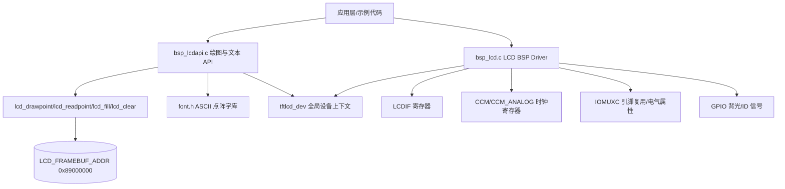
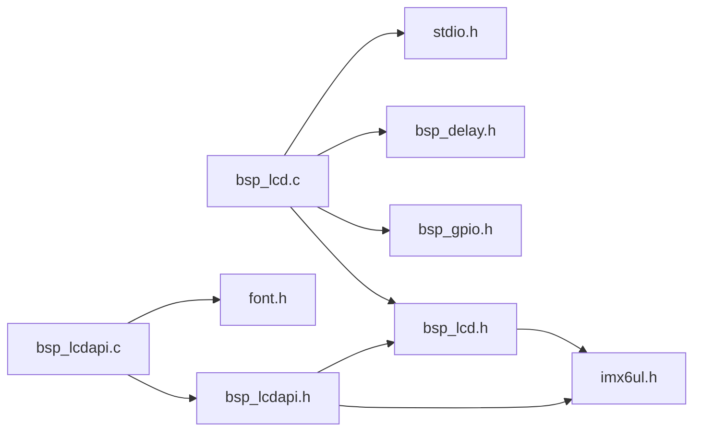
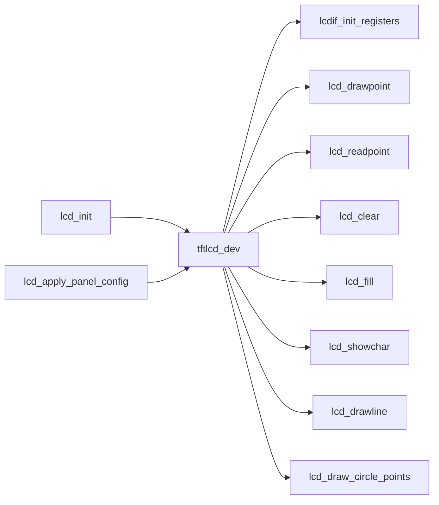
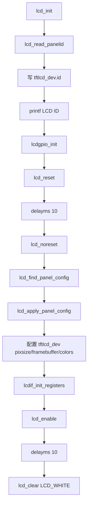
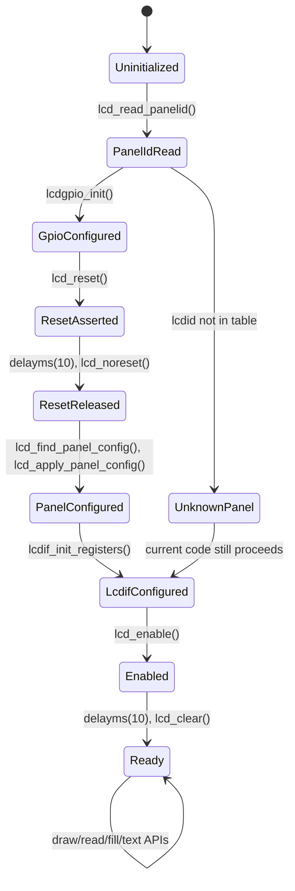
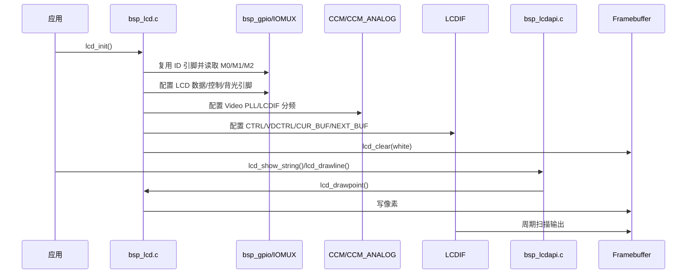

# LCD BSP/GUI API 软件详细设计说明书

文档对象：`bsp_lcd.c`、`bsp_lcdapi.c`  
关联接口：`bsp_lcd.h`、`bsp_lcdapi.h`、`font.h`  
分析方法：逆向设计分析，严格基于当前源码。未在源码中出现的线程、锁、动态内存、功能安全机制等，不作实现性推断，仅给出源码可证结论和风险。

## 1. 模块概述

本模块位于裸机 i.MX6UL LCD BSP 层，分为两层：

- `bsp_lcd.c`：LCDIF 控制器、GPIO/IOMUX、Video PLL/LCD 时钟、面板识别、帧缓冲基础读写。
- `bsp_lcdapi.c`：基于帧缓冲点绘制能力的图形/字符/数字/字符串显示 API。

整体设计采用“全局设备上下文 + 直接寄存器访问 + 固定帧缓冲地址”的裸机驱动模式。`tftlcd_dev` 是跨文件共享的 LCD 运行时状态对象，底层驱动负责填充其几何参数、像素格式、颜色和帧缓冲地址；上层 API 读取该对象并调用 `lcd_drawpoint()` 向帧缓冲写像素。



## 2. 文件职责

### 2.1 `bsp_lcd.c`

设计目的：

- 识别接入 LCD 面板 ID。
- 根据面板 ID 查找分辨率、时序、时钟分频和极性配置。
- 初始化 LCD 相关 GPIO/IOMUX。
- 配置 Video PLL、LCDIF 时钟源和分频。
- 配置 LCDIF DOTCLK 模式、ARGB8888 输入格式、传输尺寸、垂直/水平时序和帧缓冲地址。
- 提供基础像素读写、清屏和矩形填充能力。

模块位置：

- 位于 BSP 外设驱动层，直接依赖 SoC 寄存器定义 `imx6ul.h`、GPIO BSP、Delay BSP。
- 对上提供 `bsp_lcd.h` 中声明的初始化和基础绘图接口。

### 2.2 `bsp_lcdapi.c`

设计目的：

- 在 `lcd_drawpoint()` 之上实现线、矩形、圆、字符、数字和字符串绘制。
- 通过 `font.h` 中的 ASCII 点阵字库支持 12/16/24/32 字号字符显示。

模块位置：

- 位于基础 LCD 驱动之上的轻量图形 API 层。
- 不直接操作 LCDIF/CCM/IOMUX/GPIO 寄存器，只操作帧缓冲间接接口。

## 3. 头文件依赖关系



依赖说明：

- `imx6ul.h` 提供 `LCDIF`、`CCM`、`CCM_ANALOG`、`IOMUXC_*`、`GPIO*` 等寄存器和宏定义。
- `bsp_gpio.h` 提供 `gpio_pin_config_t`、`gpio_init()`、`gpio_pinread()`、`gpio_pinwrite()`。
- `bsp_delay.h` 提供 `delayms()`。
- `font.h` 定义 `asc2_1206`、`asc2_1608`、`asc2_2412`、`asc2_3216` 四组 ASCII 点阵。
- `stdio.h` 仅在 `lcd_init()` 中用于打印 LCD ID。

## 4. 宏定义设计

### 4.1 `bsp_lcd.h` 公共宏

颜色宏：

- `LCD_BLUE`、`LCD_GREEN`、`LCD_RED`、`LCD_CYAN`、`LCD_MAGENTA`、`LCD_YELLOW`
- `LCD_LIGHT*`、`LCD_DARK*`、`LCD_WHITE`、`LCD_GRAY`、`LCD_BLACK`
- `LCD_BROWN`、`LCD_ORANGE`、`LCD_TRANSPARENT`

设计含义：均为 32 bit ARGB8888/RGB888 兼容颜色常量，当前高 8 bit alpha 未显式使用，多数颜色取值为 `0x00RRGGBB`。`LCD_TRANSPARENT` 与 `LCD_BLACK` 同值，源码未实现 alpha blending 或透明处理，因此“透明”仅为命名语义，不具备透明显示机制。

屏幕 ID 宏：

- `ATK4342`：`0x4342`，480x272。
- `ATK4384`：`0x4384`，800x480。
- `ATK7084`：`0x7084`，800x480。
- `ATK7016`：`0x7016`，1024x600。
- `ATK1018`：`0x1018`，1280x800。
- `ATKVGA`：`0xff00`，1366x768。

帧缓冲宏：

- `LCD_FRAMEBUF_ADDR`：固定地址 `0x89000000`。

地址确定依据：

- `LCD_FRAMEBUF_ADDR` 不是由 LCDIF 控制器或运行时分配器自动计算得到，而是 BSP 人工规划的 DDR 物理地址。
- i.MX6UL 外部 DDR 通常映射在 `0x80000000` 起始的物理地址空间；本工程启动代码将 IRQ/SYS/SVC 栈分别设置在 `0x80600000`、`0x80400000`、`0x80200000`。
- 链接脚本 `imx6ul.lds` 将程序镜像从 `0x87800000` 开始链接；帧缓冲放在 `0x89000000`，相对程序起始地址后移 `0x01800000`，即 24 MiB，用于避开代码段、只读数据、数据段和 BSS 的常规增长空间。
- 当前像素格式固定为 ARGB8888，每像素 4 字节；最大已支持分辨率为 `1366x768`，单帧缓冲大小为 `1366 * 768 * 4 = 4196352` 字节，即 `0x400800`，占用范围约为 `0x89000000` 到 `0x89400800`。
- 因此该地址可用的前提是：板级 DDR 容量覆盖 `0x89000000` 到最大帧缓冲结束地址，且程序镜像、BSS、栈、堆或其他 DMA 缓冲不会占用这段区域。
- 当前链接脚本未使用 `MEMORY` 或专用 section 显式保留帧缓冲区，源码也没有启动时边界检查；所以该地址属于工程约定，不是被工具链强制保护的内存分配结果。

### 4.2 `bsp_lcd.c` 私有宏

- `LCD_CTRL_DOTCLK_MODE`：写入/置位 `LCDIF->CTRL` 的 DOTCLK 模式相关位组合。
- `LCD_CTRL1_ARGB8888`：写入 `LCDIF->CTRL1`，配置输入格式为 ARGB8888。
- `LCD_VDCTRL0_COMMON(vspw)`：生成 `VDCTRL0` 的通用固定字段和垂直同步脉宽。

这些宏封装寄存器位组合，减少 `lcdif_init_registers()` 中的魔法值密度，但寄存器位语义未在源码中完整命名。

## 5. 数据结构设计

### 5.1 `struct tftlcd_typedef`

定义位置：`bsp_lcd.h`。  
生命周期：全局静态存储期，由 `bsp_lcd.c` 定义为 `tftlcd_dev`，系统启动后存在至程序结束。  
内存布局：按声明顺序布局，包含 `unsigned short`、`unsigned char` 和 `unsigned int` 字段；实际 padding 由编译器 ABI 决定，源码未使用 packed。

字段说明：

| 字段 | 类型 | 作用 | 写入位置 | 读取位置 |
|---|---|---|---|---|
| `height` | `unsigned short` | LCD 有效显示高度 | `lcd_apply_panel_config()` | LCDIF 配置、绘图边界、清屏/填充 |
| `width` | `unsigned short` | LCD 有效显示宽度 | `lcd_apply_panel_config()` | LCDIF 配置、地址计算、绘图边界 |
| `pixsize` | `unsigned char` | 每像素字节数 | `lcd_init()` 固定为 4 | `lcd_drawpoint()`、`lcd_readpoint()` |
| `vspw` | `unsigned short` | 垂直同步脉宽 | `lcd_apply_panel_config()` | `lcdif_init_registers()` |
| `vbpd` | `unsigned short` | 垂直后肩 | `lcd_apply_panel_config()` | `lcdif_init_registers()` |
| `vfpd` | `unsigned short` | 垂直前肩 | `lcd_apply_panel_config()` | `lcdif_init_registers()` |
| `hspw` | `unsigned short` | 水平同步脉宽 | `lcd_apply_panel_config()` | `lcdif_init_registers()` |
| `hbpd` | `unsigned short` | 水平后肩 | `lcd_apply_panel_config()` | `lcdif_init_registers()` |
| `hfpd` | `unsigned short` | 水平前肩 | `lcd_apply_panel_config()` | `lcdif_init_registers()` |
| `framebuffer` | `unsigned int` | 帧缓冲起始物理/裸机地址 | `lcd_init()` | LCDIF `CUR_BUF/NEXT_BUF`、所有像素读写 |
| `forecolor` | `unsigned int` | 前景色 | `lcd_init()` 初始化，外部可直接修改 | API 绘制前景像素 |
| `backcolor` | `unsigned int` | 背景色 | `lcd_init()` 初始化，外部可直接修改 | `lcd_showchar()` 背景像素 |
| `id` | `unsigned int` | 面板 ID | `lcd_init()` | 当前源码未在本模块后续读取 |

读写关系：



线程安全：源码无互斥、原子、临界区或中断屏蔽。若单线程裸机顺序调用，状态一致性由调用顺序保证；若 ISR 或多执行上下文并发读写 `tftlcd_dev` 或帧缓冲，源码不提供保护。

### 5.2 `lcd_panel_config_t`

定义位置：`bsp_lcd.c` 私有 typedef。  
设计目的：把面板识别 ID 映射到分辨率、时序、时钟分频、DOTCLK 极性和 ENABLE 极性，降低 `lcd_init()` 中的条件分支复杂度。

字段说明：

| 字段 | 类型 | 作用 |
|---|---|---|
| `id` | `unsigned short` | 与 `lcd_read_panelid()` 返回值匹配 |
| `width`/`height` | `unsigned short` | 有效显示区域 |
| `vspw`/`vbpd`/`vfpd` | `unsigned short` | 垂直同步/后肩/前肩 |
| `hspw`/`hbpd`/`hfpd` | `unsigned short` | 水平同步/后肩/前肩 |
| `loopDiv` | `unsigned char` | Video PLL loop divider |
| `prediv` | `unsigned char` | LCDIF_PRE 分频参数 |
| `div` | `unsigned char` | LCDIF 分频参数 |
| `dotclk_rising` | `unsigned char` | DOTCLK 极性选择，1 表示源码写 bit25 为 1 |
| `enable_active_high` | `unsigned char` | ENABLE 极性选择，1 表示源码写 bit24 为 1 |

静态配置表 `lcd_panel_configs[]`：

| ID | 分辨率 | VSPW/VBPD/VFPD | HSPW/HBPD/HFPD | loop/pre/div | DOTCLK | ENABLE |
|---|---:|---|---|---|---:|---:|
| `ATK4342` | 480x272 | 1/8/8 | 1/40/5 | 27/8/8 | 0 | 1 |
| `ATK4384` | 800x480 | 3/32/13 | 48/88/40 | 42/4/8 | 0 | 1 |
| `ATK7084` | 800x480 | 1/23/22 | 1/46/210 | 30/3/7 | 0 | 1 |
| `ATK7016` | 1024x600 | 3/20/12 | 20/140/160 | 32/3/5 | 0 | 1 |
| `ATK1018` | 1280x800 | 3/10/10 | 10/80/70 | 35/3/5 | 0 | 1 |
| `ATKVGA` | 1366x768 | 3/24/3 | 143/213/70 | 32/3/3 | 1 | 0 |

## 6. 全局变量与静态变量

| 名称 | 作用域 | 类型 | 初始化 | 修改位置 | 线程安全 |
|---|---|---|---|---|---|
| `tftlcd_dev` | 全局外部可见 | `struct tftlcd_typedef` | C 静态零初始化 | `lcd_init()`、`lcd_apply_panel_config()`；外部也可通过 `extern` 修改 | 无保护 |
| `lcd_panel_configs[]` | `bsp_lcd.c` 文件内 | `static const lcd_panel_config_t[]` | 编译期常量 | 无 | 只读，线程安全 |

`bsp_lcdapi.c` 无文件级静态可变变量。其依赖 `font.h` 中的全局字库数组；这些数组在 `font.h` 中定义为 `const unsigned char`，如果被多个 C 文件包含会产生多重定义风险，当前分析对象中仅 `bsp_lcdapi.c` 包含。

## 7. 初始化、配置与运行流程

### 7.1 初始化流程



关键设计点：

- 面板识别先于 GPIO 初始化，这是因为 `lcd_read_panelid()` 临时把部分 LCD 数据线复用为 GPIO 输入。
- `lcdgpio_init()` 随后把 LCD 数据线/控制线恢复到 LCDIF 复用功能，并初始化背光 GPIO。
- `lcd_apply_panel_config()` 只在 `cfg != 0` 时写入宽高和时序并初始化时钟；未知 ID 时返回，后续 `tftlcd_dev.width/height` 保持零初始化。
- `lcdif_init_registers()` 对 `cfg == 0` 有默认极性，但仍使用 `tftlcd_dev` 中的宽高/时序值。

### 7.2 数据流

```mermaid
flowchart LR
    IDPins[M0/M1/M2 GPIO 输入] --> lcd_read_panelid
    lcd_read_panelid --> PanelID[Panel ID]
    PanelID --> lcd_find_panel_config
    lcd_find_panel_config --> PanelCfg[lcd_panel_config_t]
    PanelCfg --> lcd_apply_panel_config
    lcd_apply_panel_config --> Dev[tftlcd_dev 时序/几何]
    PanelCfg --> lcdclk_init
    Dev --> lcdif_init_registers
    Dev --> PixelAddr[framebuffer + pixsize*(width*y+x)]
    API[绘图 API] --> PixelAddr
    PixelAddr --> FB[帧缓冲]
    FB --> LCDIF[LCDIF 扫描输出]
```

### 7.3 控制流

- 启动/配置控制流：应用调用 `lcd_init()`，驱动按固定顺序配置引脚、复位、时钟、LCDIF 和帧缓冲。
- 运行时绘制控制流：应用调用 `bsp_lcdapi.c` 或基础绘图接口，函数同步写帧缓冲，无异步队列、DMA 提交接口或双缓冲切换逻辑。
- 事件处理流程：源码无中断注册、事件回调或输入事件处理。
- 资源释放流程：源码无 deinit、关背光、停时钟、释放显存等接口。

## 8. 函数详细设计

### 8.1 `bsp_lcd.c`

#### `lcd_find_panel_config(unsigned short lcdid)`

- 类型/作用域：`static const lcd_panel_config_t *`，文件内私有。
- 功能：在线性表 `lcd_panel_configs[]` 中按 `id` 查找面板配置。
- 调用时机：`lcd_init()` 读取面板 ID 后。
- 参数：`lcdid` 为面板 ID。
- 返回值：匹配时返回配置表元素地址；未匹配返回 `0`。
- 调用关系：被 `lcd_init()` 调用；不调用其他项目函数。
- 执行流程：遍历配置表，比较 `lcd_panel_configs[i].id == lcdid`，命中即返回。
- 异常路径：未知 ID 返回空指针。
- 线程安全：只读静态常量表，本函数本身可重入；但典型调用上下文依赖全局初始化流程。
- 时间复杂度：`O(N)`，当前 `N=6`；空间复杂度 `O(1)`。

#### `lcd_apply_panel_config(const lcd_panel_config_t *cfg)`

- 类型/作用域：`static void`，文件内私有。
- 功能：把面板配置写入 `tftlcd_dev`，并按配置初始化 LCD 时钟。
- 调用时机：`lcd_init()` 查表后。
- 参数：`cfg` 为配置表元素指针，可为空。
- 返回值：无。
- 调用关系：调用 `lcdclk_init()`。
- 执行流程：空指针直接返回；否则复制宽高、V/H 时序到 `tftlcd_dev`；调用 `lcdclk_init(loopDiv, prediv, div)`。
- 异常路径：`cfg == 0` 时不配置宽高/时序/时钟。
- 线程安全：写全局 `tftlcd_dev`，无锁；初始化阶段单线程调用才安全。
- 时间复杂度：`O(1)`。

#### `lcdif_init_registers(const lcd_panel_config_t *cfg)`

- 类型/作用域：`static void`，文件内私有。
- 功能：根据 `tftlcd_dev` 和可选面板极性配置 LCDIF 寄存器。
- 调用时机：`lcd_init()` 完成 `tftlcd_dev.pixsize/framebuffer/colors` 设置后。
- 参数：`cfg` 提供 DOTCLK 和 ENABLE 极性；为空时使用 `dotclk_polarity=0`、`enable_polarity=1`。
- 返回值：无。
- 调用关系：不调用其他项目函数，直接写 `LCDIF` 寄存器。
- 执行流程：
  - 计算 `dotclk_polarity` 与 `enable_polarity`。
  - `CTRL` 置 DOTCLK 模式相关位。
  - `CTRL1` 设 ARGB8888。
  - `TRANSFER_COUNT` 写高度和宽度。
  - `VDCTRL0~4` 写同步极性、总行/列周期、有效区起点和宽度。
  - `CUR_BUF/NEXT_BUF` 均指向 `tftlcd_dev.framebuffer`。
- 异常路径：无返回错误；若 `tftlcd_dev.width/height` 为 0，仍会写寄存器。
- 线程安全：直接改硬件寄存器和读取全局对象，无锁。
- 时间复杂度：`O(1)`。

#### `lcd_init(void)`

- 类型/作用域：外部 API。
- 功能：完整初始化 LCD 面板、引脚、时钟、LCDIF 和帧缓冲默认状态。
- 调用时机：系统启动后、调用任何绘图 API 前。
- 参数/返回值：无。
- 调用关系：调用 `lcd_read_panelid()`、`printf()`、`lcdgpio_init()`、`lcd_reset()`、`delayms()`、`lcd_noreset()`、`lcd_find_panel_config()`、`lcd_apply_panel_config()`、`lcdif_init_registers()`、`lcd_enable()`、`lcd_clear()`。
- 执行流程：见初始化流程图。
- 异常路径：
  - `lcd_read_panelid()` 返回 0 时，`lcd_find_panel_config()` 返回 0，宽高/时序/时钟不被配置，后续仍会配置 LCDIF 和清屏；由于宽高为 0，`lcd_clear()` 循环次数为 0。
  - 无错误码、断言或降级策略。
- 线程安全：非可重入初始化函数；并发调用会竞争寄存器和全局状态。
- 时间复杂度：主要由 `lcd_clear()` 决定，为 `O(width*height)`。

#### `lcd_read_panelid(void)`

- 类型/作用域：外部 API。
- 功能：通过三个 LCD 数据线复用为 GPIO 输入读取面板 ID 编码。
- 调用时机：`lcd_init()` 初期；也可外部单独调用，但会改变相关 IOMUX/GPIO 配置。
- 参数：无。
- 返回值：返回 `ATK4342/ATK7084/ATK7016/ATK4384/ATK1018/ATKVGA` 或 0。
- 调用关系：调用 `IOMUXC_SetPinMux()`、`IOMUXC_SetPinConfig()`、`gpio_init()`、`gpio_pinread()`。
- 执行流程：
  - 将 `LCD_VSYNC` 复用为 `GPIO3_IO03`，配置电气属性。
  - 将 `GPIO3_IO03` 配为输出并输出 1，用于“打开模拟开关”。
  - 将 `LCD_DATA07/15/23` 复用为 `GPIO3_IO12/20/28`。
  - 配置三根 ID 线电气属性，并初始化为输入。
  - 读取 M0/M1/M2，形成 `idx = M0 | M1<<1 | M2<<2`。
  - 按 `idx` 映射屏幕 ID。
- 异常路径：未识别编码返回 0；GPIO/IOMUX 操作无错误反馈。
- 线程安全：修改引脚复用状态，不可与 LCD 正常扫描或其他 GPIO 使用并发。
- 时间复杂度：`O(1)`。

#### `lcdgpio_init(void)`

- 类型/作用域：外部 API。
- 功能：配置 LCD 数据线、时钟、同步、DE 和背光引脚的复用及电气属性。
- 调用时机：`lcd_init()` 中面板 ID 读取后。
- 参数/返回值：无。
- 调用关系：调用 `IOMUXC_SetPinMux()`、`IOMUXC_SetPinConfig()`、`gpio_init()`、`gpio_pinwrite()`。
- 执行流程：
  - 将 `LCD_DATA00~23` 复用为 `LCDIF_DATA00~23`。
  - 将 `LCD_CLK/LCD_ENABLE/LCD_HSYNC/LCD_VSYNC` 复用为 LCDIF 功能。
  - 将 `GPIO1_IO08` 复用为 GPIO，用作背光。
  - 为 LCD 数据/控制线写电气属性 `0xB9`。
  - 初始化 `GPIO1_IO08` 为输出并写 1。
- 异常路径：无错误返回；源码中存在一处 `IOMUXC_SetPinConfig(IOMUXC_UART1_CTS_B_GPIO1_IO18,0xF080)`，与背光 `GPIO1_IO08` 注释不一致，应在评审中确认是否为遗留配置或笔误。
- 线程安全：直接修改 IOMUX/GPIO，无锁。
- 时间复杂度：`O(1)`，固定数量寄存器操作。

#### `lcdclk_init(unsigned char loopDiv, unsigned char prediv, unsigned char div)`

- 类型/作用域：外部 API。
- 功能：配置 Video PLL 和 LCDIF 时钟分频。源码注释给出公式 `LCD CLK = 24 * loopDiv / prediv / div`。
- 调用时机：`lcd_apply_panel_config()`。
- 参数：`loopDiv`、`prediv`、`div` 来自面板配置表。
- 返回值：无。
- 调用关系：直接写 `CCM_ANALOG` 和 `CCM` 寄存器。
- 执行流程：
  - 清零 `PLL_VIDEO_NUM/DENOM`，不使用小数分频。
  - 写 `PLL_VIDEO`：使能 Video PLL，设置 postDivider 和 loop divider。
  - 配置 `MISC2` video post-div 字段。
  - 选择 LCDIF_PRE_CLK 来源为 PLL5。
  - 配置 LCDIF_PRE 分频和 LCDIF 分频。
  - 选择 LCDIF_PRE 作为 LCDIF 时钟源。
- 异常路径：未检查 `prediv`/`div` 是否为 0；若外部直接传入 0，`prediv - 1`/`div - 1` 发生无符号下溢后写寄存器。
- 线程安全：修改全局时钟树，无锁，不可并发。
- 时间复杂度：`O(1)`。

#### `lcd_reset(void)` / `lcd_noreset(void)` / `lcd_enable(void)`

- 类型/作用域：外部 API。
- 功能：
  - `lcd_reset()`：写 `LCDIF->CTRL = 1 << 31` 强制复位。
  - `lcd_noreset()`：写 `LCDIF->CTRL = 0 << 31` 取消复位，实际等价写 0。
  - `lcd_enable()`：置位 `LCDIF->CTRL bit0` 使能 LCDIF。
- 调用时机：`lcd_init()`；外部也可直接调用。
- 异常路径：无状态检查或超时等待。
- 线程安全：直接写 LCDIF 寄存器，无锁。
- 时间复杂度：`O(1)`。
- 设计注意：`lcd_noreset()` 使用赋值而非清 bit，会清除 `CTRL` 其他位；当前调用顺序中后续 `lcdif_init_registers()` 会重新配置相关位，因此该行为与当前流程匹配，但对外部单独调用不具备保持其他配置的语义。

#### `lcd_drawpoint(unsigned short x, unsigned short y, unsigned int color)`

- 类型/作用域：外部 API。
- 功能：向帧缓冲指定坐标写入一个 32 bit 像素。
- 调用时机：所有绘图 API 的基础操作；LCD 初始化后。
- 参数：`x/y` 坐标，`color` 颜色。
- 返回值：无。
- 调用关系：不调用其他函数。
- 执行流程：计算地址 `framebuffer + pixsize * (width * y + x)`，转为 `unsigned int *` 后写 `color`。
- 异常路径：无边界检查；越界坐标会导致越界内存写。
- 线程安全：无帧缓冲访问保护；并发绘制可能互相覆盖。
- 时间复杂度：`O(1)`。

#### `lcd_readpoint(unsigned short x, unsigned short y)`

- 类型/作用域：外部 API。
- 功能：读取帧缓冲指定坐标的 32 bit 像素值。
- 参数/返回值：输入 `x/y`，返回颜色值。
- 异常路径：无边界检查；越界坐标会导致越界内存读。
- 线程安全：无保护；并发写入时读值不具备一致性保证。
- 时间复杂度：`O(1)`。

#### `lcd_clear(unsigned int color)`

- 类型/作用域：外部 API。
- 功能：以指定颜色填充整个有效屏幕区域。
- 调用关系：被 `lcd_init()` 调用；不调用 `lcd_drawpoint()`，直接线性写帧缓冲。
- 执行流程：`startaddr = framebuffer`，`num = width * height`，循环写 `startaddr[i] = color`。
- 异常路径：依赖 `tftlcd_dev.width/height/framebuffer` 有效；源码无校验。
- 线程安全：无保护。
- 时间复杂度：`O(width*height)`。

#### `lcd_fill(unsigned short x0, unsigned short y0, unsigned short x1, unsigned short y1, unsigned int color)`

- 类型/作用域：外部 API。
- 功能：填充矩形区域。
- 调用关系：内部调用 `lcd_drawpoint()`。
- 执行流程：
  - 尝试限制边界：`x1/y1` 超过屏幕时裁剪到最大值。
  - 双重循环遍历 `y0..y1`、`x0..x1` 并画点。
- 异常路径：
  - `x0 < 0`、`y0 < 0` 对 `unsigned short` 永远为假，无法处理负输入。
  - 未处理 `x0 > x1` 或 `y0 > y1` 的输入；由于无符号循环，存在循环异常或大范围越界风险。
- 线程安全：无保护。
- 时间复杂度：`O((x1-x0+1)*(y1-y0+1))`。

### 8.2 `bsp_lcdapi.c`

#### `lcd_font_width(unsigned char size)`

- 类型/作用域：`static unsigned char`。
- 功能：返回 ASCII 字符宽度，设计为 `size/2`。
- 调用者：`lcd_font_bytes()`、`lcd_shownum()`、`lcd_showxnum()`、`lcd_show_string()`。
- 异常路径：未限制 size；奇数字号向下取整。
- 时间复杂度：`O(1)`。

#### `lcd_font_bytes(unsigned char size)`

- 类型/作用域：`static unsigned char`。
- 功能：计算单个字符点阵占用字节数：`ceil(size/8) * (size/2)`。
- 调用者：`lcd_showchar()`。
- 异常路径：未限制 size；返回类型为 `unsigned char`，大字号可能溢出。当前支持 12/16/24/32，其中最大 128，未溢出。
- 时间复杂度：`O(1)`。

#### `lcd_get_ascii_font(unsigned char ch, unsigned char size)`

- 类型/作用域：`static const unsigned char *`。
- 功能：按字符和字号返回对应字库首地址。
- 调用者：`lcd_showchar()`。
- 执行流程：检查字符范围 `' '` 到 `'~'`；计算索引 `ch - ' '`；按字号 12/16/24/32 选择对应数组；否则返回 0。
- 异常路径：非可打印 ASCII 或不支持字号返回 0。
- 时间复杂度：`O(1)`。

#### `lcd_draw_circle_points(int x0, int y0, int x, int y)`

- 类型/作用域：`static void`。
- 功能：按圆八分对称性绘制 8 个对称点。
- 调用者：`lcd_draw_Circle()`。
- 调用关系：8 次调用 `lcd_drawpoint()`，颜色使用 `tftlcd_dev.forecolor`。
- 异常路径：坐标为负时强制转换为 `unsigned short`，可能变为大正数并越界写帧缓冲。
- 时间复杂度：`O(1)`。

#### `lcd_drawline(unsigned short x1, unsigned short y1, unsigned short x2, unsigned short y2)`

- 类型/作用域：外部 API。
- 功能：绘制直线。
- 设计：基于误差累积的 Bresenham/DDA 类整数线段算法。
- 调用关系：调用 `lcd_drawpoint()`。
- 执行流程：
  - 计算 `delta_x/delta_y` 与步进方向 `incx/incy`。
  - 取最大方向距离 `distance`。
  - 循环 `0..distance+1`，画点并按误差更新 x/y。
- 异常路径：无边界检查，坐标越界由 `lcd_drawpoint()` 直接写出。
- 线程安全：无保护。
- 时间复杂度：`O(max(|x2-x1|, |y2-y1|))`。

#### `lcd_draw_rectangle(unsigned short x1, unsigned short y1, unsigned short x2, unsigned short y2)`

- 类型/作用域：外部 API。
- 功能：绘制矩形边框。
- 调用关系：4 次调用 `lcd_drawline()`。
- 异常路径：未检查坐标顺序和边界。
- 时间复杂度：`O(width + height)`。

#### `lcd_draw_Circle(unsigned short x0, unsigned short y0, unsigned char r)`

- 类型/作用域：外部 API。
- 功能：绘制圆形轮廓。
- 设计：中点圆算法，利用八分对称减少计算。
- 调用关系：循环调用 `lcd_draw_circle_points()`。
- 异常路径：未裁剪边界，圆超出屏幕时可能越界写；`r==0` 时 `while (y > x)` 不执行，不画点。
- 时间复杂度：`O(r)`。

#### `lcd_showchar(unsigned short x, unsigned short y, unsigned char num, unsigned char size, unsigned char mode)`

- 类型/作用域：外部 API。
- 功能：在指定位置显示一个 ASCII 字符。
- 参数：
  - `x/y`：左上起始坐标。
  - `num`：字符编码。
  - `size`：字号，仅支持 12/16/24/32。
  - `mode`：源码中 `mode == 0` 时绘制背景色；非 0 时背景透明/叠加。
- 调用关系：调用 `lcd_get_ascii_font()`、`lcd_font_bytes()`、`lcd_drawpoint()`。
- 执行流程：
  - 获取字库指针，失败返回。
  - 逐字节读取点阵数据，每字节按最高位到最低位扫描。
  - bit 为 1 绘前景色；bit 为 0 且 `mode == 0` 绘背景色。
  - y 达到屏幕高度或 x 达到屏幕宽度时提前返回。
- 异常路径：
  - 不支持字符/字号直接返回。
  - 只检查递增后的右/下边界，不检查初始坐标是否已越界。
- 线程安全：读取全局颜色和写帧缓冲，无保护。
- 时间复杂度：`O(size * size/2)`。

#### `lcd_pow(unsigned char m, unsigned char n)`

- 类型/作用域：外部 API。
- 功能：计算 `m^n`。
- 调用者：`lcd_shownum()`、`lcd_showxnum()`。
- 异常路径：无溢出检查；返回 `unsigned int`。
- 时间复杂度：`O(n)`。

#### `lcd_shownum(unsigned short x, unsigned short y, unsigned int num, unsigned char len, unsigned char size)`

- 类型/作用域：外部 API。
- 功能：按定长字段显示无符号整数，高位 0 显示为空格。
- 调用关系：循环调用 `lcd_pow()` 和 `lcd_showchar()`。
- 执行流程：从最高位到最低位取十进制数字；尚未遇到非零且非最后一位时显示空格；否则显示数字。
- 异常路径：`len` 过大时 `lcd_pow(10, len-i-1)` 可能溢出；无边界检查。
- 时间复杂度：`O(len^2)`，因为每一位都调用一次 `lcd_pow()`，`lcd_pow()` 本身与指数成正比。

#### `lcd_showxnum(unsigned short x, unsigned short y, unsigned int num, unsigned char len, unsigned char size, unsigned char mode)`

- 类型/作用域：外部 API。
- 功能：按定长字段显示无符号整数，可选择高位补零和叠加模式。
- 参数扩展：
  - `mode & 0x80`：高位 0 显示为字符 `'0'`，否则为空格。
  - `mode & 0x01`：传递给 `lcd_showchar()` 作为叠加控制。
- 调用关系：循环调用 `lcd_pow()` 和 `lcd_showchar()`。
- 异常路径：同 `lcd_shownum()`。
- 时间复杂度：`O(len^2)`。

#### `lcd_show_string(unsigned short x, unsigned short y, unsigned short width, unsigned short height, unsigned char size, char *p)`

- 类型/作用域：外部 API。
- 功能：在指定矩形区域内显示可打印 ASCII 字符串。
- 参数：
  - `x/y`：区域起点。
  - `width/height`：显示区域尺寸。
  - `size`：字号。
  - `p`：字符串指针。
- 调用关系：调用 `lcd_font_width()`、`lcd_showchar()`。
- 执行流程：
  - 空指针返回。
  - 遍历 `p`，只处理 `' '` 到 `'~'` 的字符。
  - x 达到区域右边界后换行，y 增加一个字号高度。
  - y 达到区域下边界后停止。
- 异常路径：
  - 遇到不可打印字符或字符串结束符时停止。
  - `x + width`、`y + height` 使用 `unsigned short`，可能溢出回绕。
  - 不支持 `const char *`，接口会限制只读字符串传参的类型安全。
- 时间复杂度：`O(n * size * size/2)`，`n` 为实际绘制字符数。

## 9. 完整函数调用树

```mermaid
flowchart TD
    lcd_init --> lcd_read_panelid
    lcd_init --> printf
    lcd_init --> lcdgpio_init
    lcd_init --> lcd_reset
    lcd_init --> delayms
    lcd_init --> lcd_noreset
    lcd_init --> lcd_find_panel_config
    lcd_init --> lcd_apply_panel_config
    lcd_apply_panel_config --> lcdclk_init
    lcd_init --> lcdif_init_registers
    lcd_init --> lcd_enable
    lcd_init --> lcd_clear

    lcd_read_panelid --> IOMUXC_SetPinMux
    lcd_read_panelid --> IOMUXC_SetPinConfig
    lcd_read_panelid --> gpio_init
    lcd_read_panelid --> gpio_pinread

    lcdgpio_init --> IOMUXC_SetPinMux
    lcdgpio_init --> IOMUXC_SetPinConfig
    lcdgpio_init --> gpio_init
    lcdgpio_init --> gpio_pinwrite

    lcd_clear --> framebuffer_write
    lcd_fill --> lcd_drawpoint
    lcd_drawpoint --> framebuffer_write
    lcd_readpoint --> framebuffer_read

    lcd_drawline --> lcd_drawpoint
    lcd_draw_rectangle --> lcd_drawline
    lcd_draw_Circle --> lcd_draw_circle_points
    lcd_draw_circle_points --> lcd_drawpoint
    lcd_showchar --> lcd_get_ascii_font
    lcd_showchar --> lcd_font_bytes
    lcd_font_bytes --> lcd_font_width
    lcd_showchar --> lcd_drawpoint
    lcd_shownum --> lcd_font_width
    lcd_shownum --> lcd_pow
    lcd_shownum --> lcd_showchar
    lcd_showxnum --> lcd_font_width
    lcd_showxnum --> lcd_pow
    lcd_showxnum --> lcd_showchar
    lcd_show_string --> lcd_font_width
    lcd_show_string --> lcd_showchar
```



## 10. 状态机分析

源码未显式定义状态枚举或状态变量，但可从初始化顺序还原隐式状态机：



风险：隐式状态未由变量保护。外部可以在 `lcd_init()` 前调用绘图 API，源码无法检测。

## 11. 内存管理

- 无 `malloc`、`kmalloc`、`free` 或静态内存池。
- 帧缓冲使用固定地址 `LCD_FRAMEBUF_ADDR = 0x89000000`。
- 该固定地址依赖板级 DDR 映射和工程内存布局约定；源码未从链接脚本符号或运行时内存管理器申请该区域。
- 字库为编译期 `const` 数组。
- 像素访问通过裸指针地址计算完成。

主要风险：

- 固定帧缓冲地址是否可用、是否与链接脚本/DDR 内存布局冲突，不在本源码中验证；若程序镜像、BSS、栈、堆或其他 DMA 缓冲增长到 `0x89000000` 附近，会发生内存覆盖。
- 无 cache clean/invalidate、buffer 属性配置或内存屏障；若 CPU cache 开启，显示一致性需由其他模块保证。
- 无边界检查的点读写可能导致任意内存访问。

## 12. 线程模型、锁机制与并发

源码呈现单线程裸机模型：

- 无任务、线程、ISR 注册、回调、工作队列。
- 无 Mutex、Spinlock、Semaphore、Atomic。
- 无临界区或中断屏蔽。

并发结论：

- 在单核裸机顺序调用场景下可工作。
- 若存在中断或 RTOS 任务并发绘图，对 `tftlcd_dev` 和帧缓冲的访问无同步保证。
- 若初始化与绘图并发，可能出现宽高/帧缓冲地址不一致或 LCDIF 寄存器被中途修改。

## 13. 错误处理与日志机制

错误处理：

- `lcd_find_panel_config()`、`lcd_get_ascii_font()` 使用空指针返回表达失败。
- `lcd_apply_panel_config()`、`lcd_showchar()`、`lcd_show_string()` 对空指针直接返回。
- 多数硬件配置函数无错误码。
- 未知面板 ID 返回 0，但 `lcd_init()` 未停止初始化或上报错误。

日志机制：

- 仅 `lcd_init()` 使用 `printf("LCD ID=%#X\r\n", lcdid)`。
- 无日志等级、错误日志、诊断计数器或故障码。

## 14. 条件编译与配置项

- 当前两个 C 文件无条件编译分支。
- 配置项主要由宏和静态表决定：
  - 颜色宏。
  - 面板 ID 宏。
  - 帧缓冲地址宏。
  - `lcd_panel_configs[]` 面板配置表。
  - `font.h` 字库数组。

可扩展点：

- 新增面板：添加 ID 宏、扩展 `lcd_read_panelid()` 映射、增加 `lcd_panel_configs[]` 条目。
- 新增字号：在 `font.h` 增加字库，并扩展 `lcd_get_ascii_font()`。
- 新增绘图原语：复用 `lcd_drawpoint()` 或直接线性写帧缓冲。

## 15. 模块间接口关系



## 16. 代码质量与标准符合性分析

### 16.1 设计优点

- 面板参数表驱动：当前版本将多面板时序集中到 `lcd_panel_configs[]`，比大量 `if/else` 写散配置更易维护。
- 分层清晰：底层硬件初始化与上层图形 API 分离。
- 绘图 API 不直接访问硬件寄存器，硬件耦合集中在 `bsp_lcd.c`。
- 字库选择集中在 `lcd_get_ascii_font()`，不支持字符/字号有明确返回路径。
- 初始化流程符合裸机 LCD 常见顺序：识别面板、配置引脚、复位、时钟、控制器、使能、清屏。

### 16.2 Linux Kernel Coding Style 视角

当前代码不是 Linux Kernel 驱动，而是裸机 BSP；若按 Kernel 风格审视，存在以下差异：

- 使用 `unsigned int/short/char` 而非固定宽度类型或内核类型。
- 多处缺少空格，如 `if(idx==0)return`、`1<<31`。
- 硬编码寄存器位较多，缺少位字段命名宏。
- 公共头文件声明了 `video_pllinit()`，但分析对象中未实现，接口一致性风险。
- `font.h` 定义全局对象而非 `extern` 声明，不符合常见头文件职责。

### 16.3 MISRA C 视角

主要风险项：

- 整数类型宽度不明确，地址强转为指针并解引用。
- 无符号参数与负值比较：`if (x0 < 0)`、`if (y0 < 0)` 永远为假。
- 多处隐式整数提升和移位表达式使用有符号常量，如 `1 << 31`。
- 指针/整数相互转换：帧缓冲地址和寄存器访问。
- 无边界检查导致数组/内存越界风险。
- `font.h` 在头文件中定义对象，可能违反单一定义预期。
- Magic number 较多，缺少语义命名。

### 16.4 CERT C 视角

关注点：

- 越界写：`lcd_drawpoint()`、`lcd_readpoint()` 不验证坐标。
- 整数溢出：帧缓冲地址计算、`width * y + x`、`width * height`、`lcd_pow()`。
- 空指针：部分 API 已处理，但硬件寄存器基址宏有效性不在源码中检查。
- 格式化输出：`printf()` 参数类型与 `%#X` 期望 `unsigned int`，`lcdid` 作为 `unsigned short` 会经默认提升为 `int`；通常可工作，但严格审查应关注类型匹配。

### 16.5 ISO 26262 Part 6 软件架构视角

当前源码未体现功能安全项目所需的安全架构要素：

- 无 Safety Requirement ID、ASIL 分解、Traceability 标识。
- 无输入范围监控、输出合理性检查、寄存器回读校验。
- 无故障检测、故障处理、降级或安全状态进入机制。
- 无 Watchdog/Heartbeat。
- 无 Diagnostic Coverage 度量或诊断路径。
- 无 FFI 资源隔离策略：全局状态、帧缓冲和硬件寄存器均可被任意调用方访问。

若本模块进入功能安全项目，至少应补充：

- 面板 ID 未识别时的安全策略：停止使能 LCDIF、上报故障、保持背光关闭或显示安全画面。
- LCDIF/CCM/IOMUX 配置后回读校验。
- 帧缓冲边界保护和 API 参数防御。
- 关键全局状态初始化完成标志和状态机保护。
- 对帧缓冲地址、尺寸和像素格式的启动时一致性检查。
- 周期性显示链路诊断需结合硬件能力定义，例如 CRC、测试图案、背光监控或外部显示监控；当前源码未支持。

## 17. 功能安全分析

基于源码可证事实，本模块未声明安全目标或安全需求，因此以下为“若作为安全相关显示输出链路使用时”的差距分析，而非对源码已有机制的确认。

| 项目 | 源码现状 | 风险 |
|---|---|---|
| SG/FSR/TSR/SSR | 未定义 | 无需求到代码追踪 |
| Safety Mechanism | 未实现 | LCD 初始化错误或绘制越界无法检测 |
| Fault Detection | 仅未知面板返回 0，但未处理 | 错误配置可能静默发生 |
| Fault Handling | 无 | 无安全状态 |
| Fault Propagation | 无隔离 | 错误坐标可传播为内存破坏 |
| FFI | 无内存/时间/控制流隔离 | 可影响其他模块内存 |
| SPF | LCDIF 配置、帧缓冲地址、时钟配置均可能是单点故障 | 无诊断覆盖 |
| Latent Fault | 面板 ID 线 stuck、字库损坏、帧缓冲损坏无检测 | 潜伏故障无法发现 |
| Diagnostic Coverage | 未度量 | 不满足安全论证 |
| Watchdog/Heartbeat | 未实现 | 无运行时活性监控 |
| 异常恢复 | 未实现 | 无 reset/reinit/retry 策略 |

## 18. 主要风险与改进建议

不修改当前代码的前提下，设计评审建议如下：

1. 为 `lcd_init()` 增加初始化状态和错误返回语义，未知面板时停止后续硬件使能。
2. 为 `lcd_drawpoint()`、`lcd_readpoint()`、`lcd_fill()`、圆/线/字符绘制增加坐标边界裁剪或错误返回。
3. 修正 `lcd_fill()` 中无符号参数与负数比较无效的问题，并处理 `x0 > x1`、`y0 > y1`。
4. 将寄存器位魔法值抽象为具名宏，并对 `lcdclk_init()` 的 `prediv/div` 做非零检查。
5. 确认 `lcdgpio_init()` 中 `IOMUXC_UART1_CTS_B_GPIO1_IO18` 配置是否符合硬件设计。
6. 将 `font.h` 的字库定义迁移到 `.c`，头文件仅保留 `extern` 声明，避免多重定义。
7. 若启用 cache/MMU，补充帧缓冲内存属性和 cache 一致性策略。
8. 在链接脚本中显式保留帧缓冲区，或通过链接符号统一定义程序区、栈区和帧缓冲区边界，避免固定地址与其他内存用途重叠。
9. 若存在 RTOS/中断并发绘制，定义帧缓冲访问互斥或限定调用上下文。
10. 功能安全项目中补充寄存器回读、故障码、安全状态、诊断测试和需求追踪。

## 19. 结论

`bsp_lcd.c` 和 `bsp_lcdapi.c` 构成了一个典型裸机 LCD 显示栈：底层完成面板识别、时钟/引脚/LCDIF 初始化和帧缓冲访问，上层提供基于点绘制的基础图形与文本能力。当前实现结构清晰、功能边界明确，适合作为教学或非安全裸机 BSP 的 LCD 基础驱动。

从工程化和认证视角看，模块缺少错误返回、边界保护、并发约束、寄存器回读诊断和安全状态处理。若用于量产或功能安全项目，应优先补齐输入防御、初始化失败处理、硬件配置校验、内存边界保护和需求追踪机制。
