# bsp_rtc.c 软件详细设计说明书（SDD）

## 1. 文档范围与依据

本文档对 `bsp/rtc/bsp_rtc.c` 及其公开头文件 `bsp/rtc/bsp_rtc.h` 进行逆向设计分析，目标是从源码还原 RTC BSP 模块的软件详细设计。分析依据包括：

- `bsp_rtc.c`
- `bsp_rtc.h`
- `imx6ul/imx6ul.h`
- `imx6ul/cc.h`
- `imx6ul/MCIMX6Y2.h` 中的 `SNVS_Type`、`SNVS` 基址和相关寄存器定义
- `project/main.c` 中对 RTC API 的调用
- `Makefile` 中的编译目录与包含路径

本文档只描述源码中可以直接证明的行为。对于功能安全、线程模型、锁机制、错误处理等方面，若源码未实现，则明确标注为“未实现”或“未体现”，不作超出源码的功能假设。

## 2. 模块概述

`bsp_rtc.c` 是 i.MX6UL 裸机工程中的 RTC BSP 驱动模块，负责直接访问 SNVS（Secure Non-Volatile Storage）外设中的 LP SRTC（Low Power Secure RTC）计数器，并提供日历时间与秒计数之间的转换接口。

该模块不是 Linux Kernel RTC class driver，也没有设备树、platform driver、regmap、interrupt、alarm、sysfs、PM 回调等 Linux RTC 子系统机制。它是裸机 BSP 层的硬件抽象模块，以同步函数调用方式向上层应用提供时间初始化、启停、设置、读取和日期换算能力。

## 3. 模块职责

### 3.1 主要职责

- 配置 SNVS `HPCOMR` 以允许非特权软件访问 SNVS 寄存器。
- 使能或关闭 SNVS LP SRTC。
- 将 `struct rtc_datetime` 表示的日历时间转换为从 1970-01-01 00:00:00 开始累计的秒数。
- 将秒数转换回 `struct rtc_datetime`。
- 写入 SNVS LP SRTC 计数器寄存器。
- 读取 SNVS LP SRTC 计数器寄存器。

### 3.2 非职责范围

源码未实现以下能力：

- RTC alarm。
- 周期中断。
- 秒中断。
- 闹钟唤醒。
- 电源管理回调。
- RTC 校准。
- 时区、夏令时、闰秒。
- 输入参数合法性检查。
- 超时保护。
- 错误码返回。
- 并发互斥。
- 诊断上报或故障恢复。

## 4. 工程位置与模块关系

`Makefile` 将 `bsp/rtc` 同时加入 `INCDIRS` 和 `SRCDIRS`，因此 `bsp_rtc.c` 被编译为裸机镜像的一部分，`bsp_rtc.h` 可被工程内模块直接包含。

`project/main.c` 中的使用关系如下：

- `board_init()` 调用 `rtc_init()` 初始化 RTC。
- `rtc_set_default_datetime()` 构造 `struct rtc_datetime` 后调用 `rtc_setdatetime()` 设置默认时间。
- 主循环周期调用 `rtc_getdatetime()` 获取当前 RTC 时间，并通过 LCD 显示。

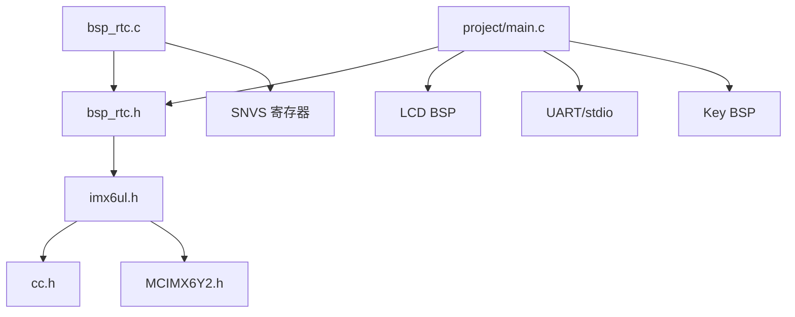

## 5. 头文件依赖关系

`bsp_rtc.c` 只直接包含 `bsp_rtc.h`。

`bsp_rtc.h` 直接包含 `imx6ul.h`。`imx6ul.h` 进一步包含：

- `cc.h`：提供 `u64`、`uint32_t`、`__IO` 等基本类型和访问限定宏。
- `MCIMX6Y2.h`：提供 `SNVS_Type`、`SNVS`、外设基址和寄存器结构。
- `fsl_common.h`
- `fsl_iomuxc.h`
- `core_ca7.h`

RTC 模块实际依赖的关键定义为：

- `u64`：在 `cc.h` 中定义为 `unsigned long long int`。
- `SNVS`：在 `MCIMX6Y2.h` 中定义为 `((SNVS_Type *)SNVS_BASE)`。
- `SNVS_BASE`：在 `MCIMX6Y2.h` 中定义为 `0x20CC000u`。
- `SNVS_Type`：包含 `HPCOMR` 和 `LPCR`，但源码所用的 `LPSRTCMR/LPSRTCLR` 未在该结构体中暴露。

## 6. 硬件寄存器设计

### 6.1 已使用寄存器

| 寄存器 | 来源 | 访问方式 | 用途 |
|---|---|---|---|
| `SNVS->HPCOMR` | `SNVS_Type` 成员 | 结构体成员访问 | 允许访问 SNVS 寄存器，并设置 bit8 |
| `SNVS->LPCR` | `SNVS_Type` 成员 | 结构体成员访问 | 使能/关闭 LP SRTC |
| `LPSRTCMR` | 固定偏移 `0x50` | 地址偏移访问 | LP SRTC 秒计数高位部分 |
| `LPSRTCLR` | 固定偏移 `0x54` | 地址偏移访问 | LP SRTC 秒计数低位部分 |

### 6.2 偏移访问设计

`bsp_rtc.c` 明确说明某些 `MCIMX6Y2.h` 中的 `SNVS_Type` 没有暴露 `LPSRTCMR/LPSRTCLR` 成员，因此使用寄存器偏移访问。

源码定义：

| 宏 | 值 | 设计目的 |
|---|---:|---|
| `RTC_SNVS_LPSRTCMR_OFFSET` | `0x50U` | LP SRTC Counter MSB Register 偏移 |
| `RTC_SNVS_LPSRTCLR_OFFSET` | `0x54U` | LP SRTC Counter LSB Register 偏移 |
| `RTC_REG32(addr)` | `(*(volatile unsigned int *)(addr))` | 将地址转换为 32 位 volatile MMIO 访问 |
| `RTC_SNVS_BASE_ADDR` | `((unsigned int)SNVS)` | 获取 SNVS 外设基地址 |
| `RTC_SNVS_LPSRTCMR` | `RTC_REG32(base + 0x50)` | LPSRTCMR 寄存器访问宏 |
| `RTC_SNVS_LPSRTCLR` | `RTC_REG32(base + 0x54)` | LPSRTCLR 寄存器访问宏 |

该设计提升了对不同 SDK 头文件版本的适配性，但也绕过了强类型寄存器结构体，增加了地址转换、指针宽度和 MISRA/CERT 合规风险。

## 7. 宏定义

### 7.1 `bsp_rtc.c` 内部宏

| 宏 | 值 | 作用域 | 说明 |
|---|---:|---|---|
| `RTC_SNVS_HPCOMR_NPSWA_EN` | `(1U << 31)` | 文件内 | 设置 `HPCOMR` bit31，允许访问 SNVS 寄存器 |
| `RTC_SNVS_HPCOMR_BIT8` | `(1U << 8)` | 文件内 | 设置 `HPCOMR` bit8，源码注释说明该位详细含义需要 NDA |
| `RTC_SNVS_LPCR_SRTC_ENV` | `(1U << 0)` | 文件内 | `LPCR` bit0，控制 SRTC enable |
| `RTC_SNVS_SRTC_HIGH_SHIFT` | `17U` | 文件内 | 秒数写入/读取高位寄存器的移位量 |
| `RTC_SNVS_SRTC_LOW_SHIFT` | `15U` | 文件内 | 秒数写入/读取低位寄存器的移位量 |
| `RTC_SNVS_LPSRTCMR_OFFSET` | `0x50U` | 文件内 | LP SRTC MSB 计数寄存器偏移 |
| `RTC_SNVS_LPSRTCLR_OFFSET` | `0x54U` | 文件内 | LP SRTC LSB 计数寄存器偏移 |
| `RTC_REG32(addr)` | `(*(volatile unsigned int *)(addr))` | 文件内 | 32 位 MMIO 访问 |
| `RTC_SNVS_BASE_ADDR` | `((unsigned int)SNVS)` | 文件内 | SNVS 基地址 |
| `RTC_SNVS_LPSRTCMR` | 表达式 | 文件内 | MSB 计数寄存器左值 |
| `RTC_SNVS_LPSRTCLR` | 表达式 | 文件内 | LSB 计数寄存器左值 |

### 7.2 `bsp_rtc.h` 公开宏

| 宏 | 值 | 说明 |
|---|---:|---|
| `SECONDS_IN_A_DAY` | `86400U` | 一天秒数 |
| `SECONDS_IN_A_HOUR` | `3600U` | 一小时秒数 |
| `SECONDS_IN_A_MINUTE` | `60U` | 一分钟秒数 |
| `DAYS_IN_A_YEAR` | `365U` | 平年天数 |
| `YEAR_RANGE_START` | `1970U` | 日期换算起始年份 |
| `YEAR_RANGE_END` | `2099U` | 日期范围结束年份，当前源码未使用 |

## 8. 数据结构设计

### 8.1 `struct rtc_datetime`

定义位置：`bsp_rtc.h`

```c
struct rtc_datetime
{
    unsigned short year;
    unsigned char month;
    unsigned char day;
    unsigned char hour;
    unsigned char minute;
    unsigned char second;
};
```

### 8.2 成员说明

| 成员 | 类型 | 设计范围 | 读写位置 | 生命周期 |
|---|---|---|---|---|
| `year` | `unsigned short` | 注释为 `1970 ~ 2099` | 转换函数读写；上层应用写入 | 由调用方分配和管理 |
| `month` | `unsigned char` | 注释为 `1 ~ 12` | 转换函数读写；上层应用写入 | 由调用方分配和管理 |
| `day` | `unsigned char` | 注释为 `1 ~ 31` | 转换函数读写；上层应用写入 | 由调用方分配和管理 |
| `hour` | `unsigned char` | 注释为 `0 ~ 23` | 转换函数读写；上层应用写入 | 由调用方分配和管理 |
| `minute` | `unsigned char` | 注释为 `0 ~ 59` | 转换函数读写；上层应用写入 | 由调用方分配和管理 |
| `second` | `unsigned char` | 注释为 `0 ~ 59` | 转换函数读写；上层应用写入 | 由调用方分配和管理 |

### 8.3 内存布局

在典型 ARM EABI 下，`unsigned short` 为 2 字节且按 2 字节对齐，`unsigned char` 为 1 字节。该结构体成员总大小为 7 字节，按最大 2 字节对齐时结构体大小通常为 8 字节。源码未使用 `packed`，实际大小以编译器 ABI 为准。

### 8.4 生命周期与所有权

该结构体不在 RTC 模块内部静态持有。所有实例均由调用者创建：

- `main.c` 的 `rtc_set_default_datetime()` 在栈上创建并传入 `rtc_setdatetime()`。
- `main.c` 主循环在栈上创建并传入 `rtc_getdatetime()`。
- `bsp_rtc.c` 中 `rtc_init()` 的示例代码被 `#if 0` 禁用，不参与编译。

## 9. 全局变量与静态变量

### 9.1 `g_month_days_before`

```c
static const unsigned short g_month_days_before[13] = {
    0U, 0U, 31U, 59U, 90U, 120U, 151U, 181U, 212U, 243U, 273U, 304U, 334U
};
```

- 作用：提供非闰年每个月之前的累计天数。
- 索引范围：源码期望 `datetime->month` 为 `1..12`；索引 0 保留为 0。
- 初始化位置：文件作用域静态常量初始化。
- 修改位置：无。
- 访问位置：`rtc_coverdate_to_seconds()`。
- 线程安全：只读常量，本身线程安全；但函数未校验索引，非法月份会导致越界读。
- 生命周期：整个程序生命周期。

### 9.2 `g_days_per_month`

```c
static const unsigned char g_days_per_month[13] = {
    0U, 31U, 28U, 31U, 30U, 31U, 30U, 31U, 31U, 30U, 31U, 30U, 31U
};
```

- 作用：提供非闰年每月天数。
- 索引范围：`1..12`；索引 0 保留为 0。
- 初始化位置：文件作用域静态常量初始化。
- 修改位置：无。
- 访问位置：`rtc_convertseconds_to_datetime()`。
- 线程安全：只读常量，本身线程安全。
- 生命周期：整个程序生命周期。

## 10. API 接口总览

| 函数 | 可见性 | 作用 |
|---|---|---|
| `rtc_init()` | 公开 | 初始化 SNVS 访问权限并使能 RTC |
| `rtc_enable()` | 公开 | 使能 LP SRTC |
| `rtc_disable()` | 公开 | 关闭 LP SRTC |
| `rtc_isleapyear()` | 公开 | 判断闰年 |
| `rtc_coverdate_to_seconds()` | 公开 | 日历时间转换为秒数 |
| `rtc_setdatetime()` | 公开 | 设置 RTC 时间 |
| `rtc_convertseconds_to_datetime()` | 公开 | 秒数转换为日历时间 |
| `rtc_getseconds()` | 公开 | 读取 RTC 秒计数 |
| `rtc_getdatetime()` | 公开 | 获取当前日历时间 |

源码中没有 `static` 函数。所有函数均通过头文件导出。

## 11. 函数详细设计

### 11.1 `rtc_init`

原型：

```c
void rtc_init(void);
```

功能：初始化 RTC 模块。设置 `SNVS->HPCOMR` 的 `NPSWA_EN` 和 bit8，然后调用 `rtc_enable()` 使能 LP SRTC。

设计目的：

- 解除或允许 SNVS 寄存器访问。
- 确保 RTC 计数器处于运行状态。

调用时机：

- `project/main.c` 的 `board_init()` 在系统时钟、延时、外设时钟、LED、蜂鸣器、UART、LCD 初始化后调用。

参数：无。

返回值：无。

调用关系：

- 调用 `rtc_enable()`。
- 被 `board_init()` 调用。

执行流程：

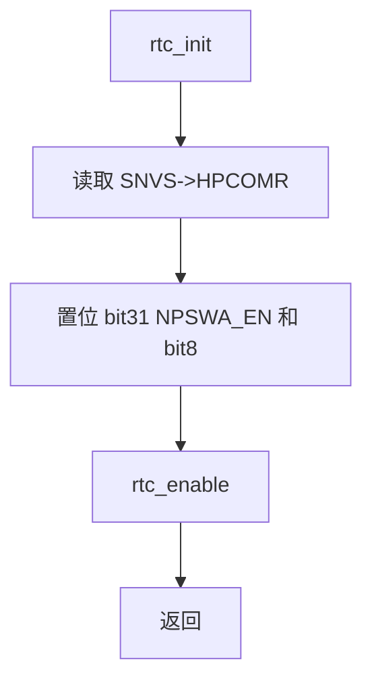

异常路径：

- 无错误返回。
- 若 `SNVS->LPCR` bit0 无法置位，`rtc_enable()` 会永久忙等。

线程安全性：

- 未实现锁。
- 对 `HPCOMR` 执行读-改-写，若存在并发访问可能丢失其他上下文的位修改。

时间复杂度：

- 固定寄存器访问为 O(1)。
- 使能等待循环时间取决于硬件状态，源码未设置上限。

### 11.2 `rtc_enable`

原型：

```c
void rtc_enable(void);
```

功能：设置 `SNVS->LPCR` bit0，使能 LP SRTC，并忙等直到该位读回为 1。

设计目的：

- 将硬件 SRTC 从关闭状态切换到运行状态。
- 通过读回确认寄存器状态生效。

参数：无。

返回值：无。

调用关系：

- 被 `rtc_init()` 调用。
- 被 `rtc_setdatetime()` 在设置前 RTC 已使能时调用。

执行流程：

```mermaid
flowchart TD
    A[rtc_enable] --> B[SNVS->LPCR |= SRTC_ENV]
    B --> C{LPCR bit0 == 1?}
    C -- 否 --> C
    C -- 是 --> D[返回]
```

异常路径：

- 若硬件不响应或寄存器写入失败，函数永久停留在 `while`。

线程安全性：

- 未实现锁。
- 对 `LPCR` 读-改-写，存在并发位修改覆盖风险。

时间复杂度：

- 理想为 O(1)。
- 最坏情况无界。

### 11.3 `rtc_disable`

原型：

```c
void rtc_disable(void);
```

功能：清除 `SNVS->LPCR` bit0，关闭 LP SRTC，并忙等直到该位读回为 0。

设计目的：

- 在写入 `LPSRTCMR/LPSRTCLR` 前停止 RTC。源码注释明确说明设置这两个寄存器时必须先关闭 RTC。

参数：无。

返回值：无。

调用关系：

- 被 `rtc_setdatetime()` 调用。
- 可由外部模块直接调用。

执行流程：

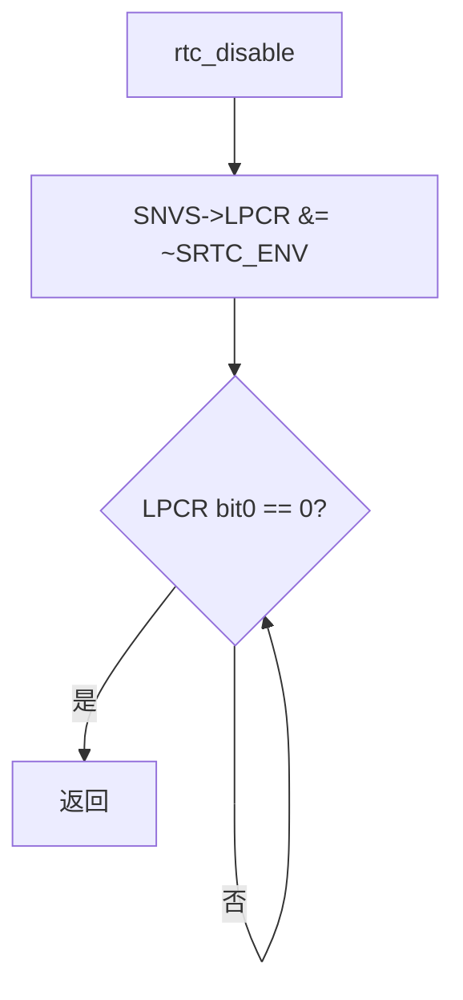

异常路径：

- 若硬件不响应或 bit0 无法清零，函数永久忙等。

线程安全性：

- 未实现锁。
- 对 `LPCR` 读-改-写，存在并发访问风险。

时间复杂度：

- 理想为 O(1)。
- 最坏情况无界。

### 11.4 `rtc_isleapyear`

原型：

```c
unsigned char rtc_isleapyear(unsigned short year);
```

功能：按公历规则判断年份是否为闰年。

设计目的：

- 为日期到秒数、秒数到日期的双向转换提供年份天数判断。

参数：

| 参数 | 类型 | 输入/输出 | 说明 |
|---|---|---|---|
| `year` | `unsigned short` | 输入 | 待判断年份 |

返回值：

- `1`：闰年。
- `0`：平年。

调用关系：

- 被 `rtc_coverdate_to_seconds()` 调用。
- 被 `rtc_convertseconds_to_datetime()` 调用。

执行逻辑：

```c
(year % 400 == 0) || ((year % 4 == 0) && (year % 100 != 0))
```

异常路径：

- 无。
- 未限制年份范围。

线程安全性：

- 纯计算函数，无共享可变状态，线程安全。

时间复杂度：

- O(1)。

### 11.5 `rtc_coverdate_to_seconds`

原型：

```c
unsigned int rtc_coverdate_to_seconds(struct rtc_datetime *datetime);
```

说明：函数名为 `coverdate`，从实现看语义应为 “convert date to seconds”。本文档保持源码原名。

功能：将 `datetime` 表示的日期时间转换为从 `YEAR_RANGE_START`（1970 年）开始累计的秒数。

设计目的：

- 为 `rtc_setdatetime()` 生成 SNVS SRTC 计数器所需的秒计数。

参数：

| 参数 | 类型 | 输入/输出 | 说明 |
|---|---|---|---|
| `datetime` | `struct rtc_datetime *` | 输入 | 日期时间指针 |

返回值：

- `unsigned int` 秒数。

调用关系：

- 调用 `rtc_isleapyear()`。
- 读取 `g_month_days_before`。
- 被 `rtc_setdatetime()` 调用。

执行流程：

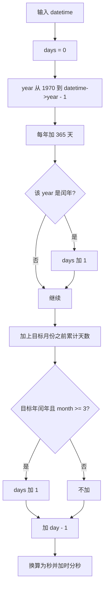

异常路径与边界：

- 未检查 `datetime == NULL`。
- 未检查 `year` 是否在 `1970..2099`。
- 未检查 `month` 是否在 `1..12`，非法月份可能导致 `g_month_days_before` 越界访问。
- 未检查 `day/hour/minute/second` 是否在声明范围内。
- 返回类型为 `unsigned int`，对 1970-01-01 至 2099-12-31 的秒数范围可以覆盖，但源码未强制限制输入年份，超范围年份可能导致溢出。
- 若 `datetime->year < 1970`，年份循环不执行，仍会按给定月日计算出 1970 年内偏移语义的秒数。

线程安全性：

- 只读静态常量，无共享可变状态。
- 调用者必须保证传入指针在调用期间有效且不被并发修改。

时间复杂度：

- O(Y)，其中 Y 为 `datetime->year - 1970` 的年数差。

### 11.6 `rtc_setdatetime`

原型：

```c
void rtc_setdatetime(struct rtc_datetime *datetime);
```

功能：设置 RTC 日期时间。

设计目的：

- 在符合硬件要求的顺序下写入 LP SRTC 计数器：先关闭 RTC，再写入高/低计数寄存器，必要时恢复使能状态。

参数：

| 参数 | 类型 | 输入/输出 | 说明 |
|---|---|---|---|
| `datetime` | `struct rtc_datetime *` | 输入 | 要设置的日期时间 |

返回值：无。

调用关系：

- 读取 `SNVS->LPCR` 保存原始使能状态。
- 调用 `rtc_disable()`。
- 调用 `rtc_coverdate_to_seconds()`。
- 写 `RTC_SNVS_LPSRTCMR`。
- 写 `RTC_SNVS_LPSRTCLR`。
- 若设置前 `SRTC_ENV` 已置位，则调用 `rtc_enable()`。
- 被 `main.c` 的 `rtc_set_default_datetime()` 调用。

执行流程：

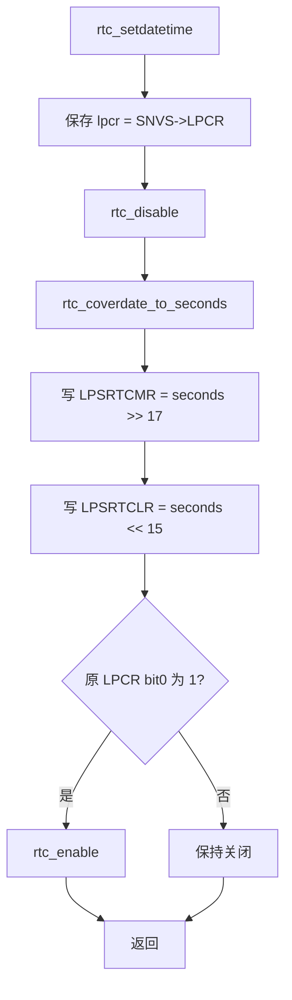

异常路径：

- `datetime == NULL` 会导致解引用非法地址。
- 日期字段非法可能导致错误秒数或数组越界。
- `rtc_disable()` 或 `rtc_enable()` 可能永久忙等。
- 写寄存器无读回校验，无法确认写入结果。

线程安全性：

- 未实现锁。
- 设置时间过程会临时关闭 RTC。若其他上下文同时读取 RTC，可能读到关闭期间或更新过程中的状态。
- `LPCR` 原始值只用于恢复 bit0，其他位未恢复，仅通过 `rtc_enable()` 置 bit0。

时间复杂度：

- 日期转换 O(Y)。
- 硬件等待无界。

### 11.7 `rtc_convertseconds_to_datetime`

原型：

```c
void rtc_convertseconds_to_datetime(u64 seconds, struct rtc_datetime *datetime);
```

功能：将从 1970-01-01 00:00:00 起算的秒数转换为日历时间。

设计目的：

- 为 `rtc_getdatetime()` 将硬件秒计数转换为上层可显示的年月日时分秒。

参数：

| 参数 | 类型 | 输入/输出 | 说明 |
|---|---|---|---|
| `seconds` | `u64` | 输入 | 秒数 |
| `datetime` | `struct rtc_datetime *` | 输出 | 转换后的日期时间 |

返回值：无。

调用关系：

- 调用 `rtc_isleapyear()`。
- 读取 `g_days_per_month`。
- 被 `rtc_getdatetime()` 调用。

执行流程：

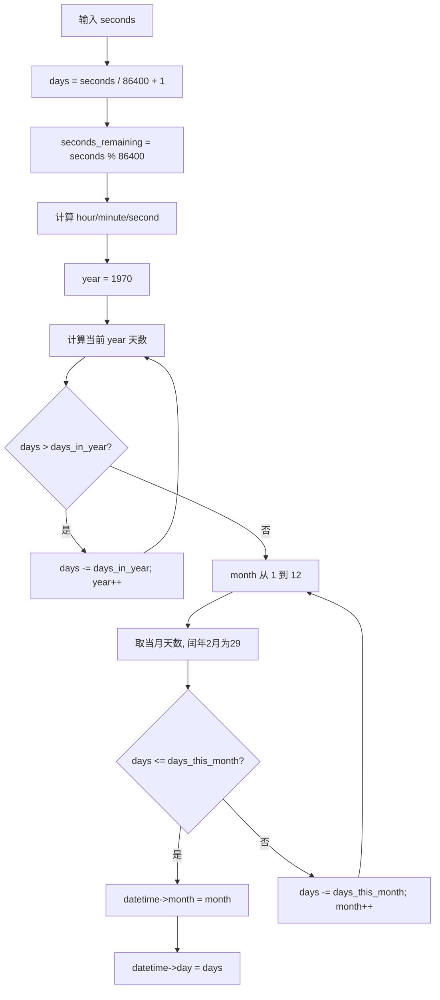

异常路径与边界：

- 未检查 `datetime == NULL`。
- 输入 `seconds` 为 `u64`，但 `datetime->year` 为 `unsigned short`。极大秒数会导致年份持续增长并最终发生 `unsigned short` 回绕风险。
- `YEAR_RANGE_END` 未被使用，转换不会在 2099 年停止。
- 月份循环正常情况下会设置 `month`。若输入秒数导致年份回绕或 `days` 异常，源码没有兜底错误路径。

线程安全性：

- 只读静态常量，无共享可变状态。
- 调用者必须保证输出结构体指针有效且不被并发访问冲突。

时间复杂度：

- O(Y + 12)，其中 Y 为从 1970 到目标年份的年数差。

### 11.8 `rtc_getseconds`

原型：

```c
unsigned int rtc_getseconds(void);
```

功能：读取 SNVS LP SRTC 计数器并转换为秒数。

设计目的：

- 为上层提供低成本秒计数读取接口。

参数：无。

返回值：

- 当前 RTC 秒数，类型为 `unsigned int`。

调用关系：

- 读取 `RTC_SNVS_LPSRTCMR` 和 `RTC_SNVS_LPSRTCLR`。
- 被 `rtc_getdatetime()` 调用。

执行逻辑：

```c
(RTC_SNVS_LPSRTCMR << 17) | (RTC_SNVS_LPSRTCLR >> 15)
```

异常路径：

- 无错误返回。
- 未进行一致性读取。若硬件计数器在读取 MSB 与 LSB 之间变化，可能得到撕裂值。
- 未校验 RTC 是否已使能。

线程安全性：

- 无锁。
- 仅读寄存器，不修改软件共享状态。
- 硬件多寄存器快照一致性未保证。

时间复杂度：

- O(1)。

### 11.9 `rtc_getdatetime`

原型：

```c
void rtc_getdatetime(struct rtc_datetime *datetime);
```

功能：获取当前 RTC 时间并转换为日历格式。

设计目的：

- 组合底层秒计数读取与日历转换，向应用层提供年月日时分秒接口。

参数：

| 参数 | 类型 | 输入/输出 | 说明 |
|---|---|---|---|
| `datetime` | `struct rtc_datetime *` | 输出 | 当前日期时间 |

返回值：无。

调用关系：

- 调用 `rtc_getseconds()`。
- 调用 `rtc_convertseconds_to_datetime()`。
- 被 `main.c` 主循环调用。

执行流程：

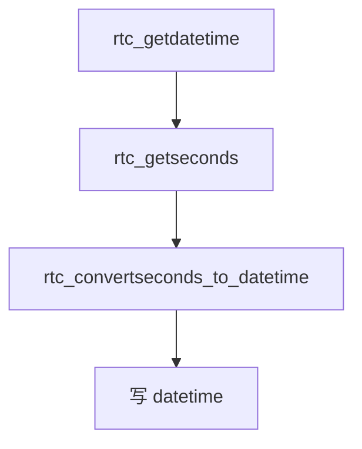

异常路径：

- `datetime == NULL` 会导致非法写入。
- `rtc_getseconds()` 可能读到不一致计数。
- 转换函数无年份上限。

线程安全性：

- 未实现锁。
- 调用者负责保护输出对象。

时间复杂度：

- O(Y)，由秒数转换目标年份决定。

## 12. 完整函数调用树

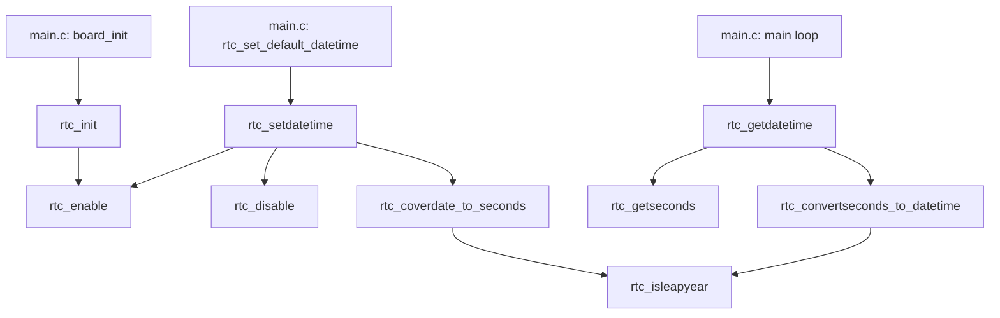

## 13. 数据流分析

### 13.1 设置时间数据流

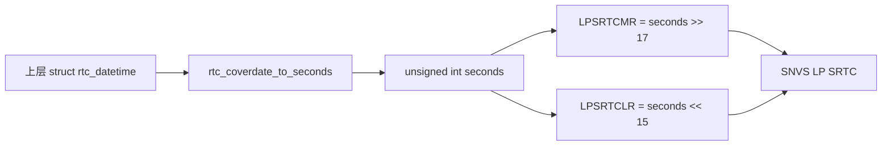

### 13.2 获取时间数据流

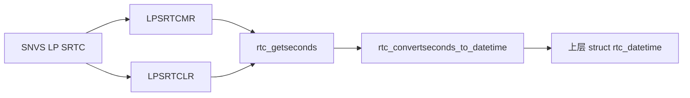

## 14. 控制流与运行流程

### 14.1 系统初始化流程

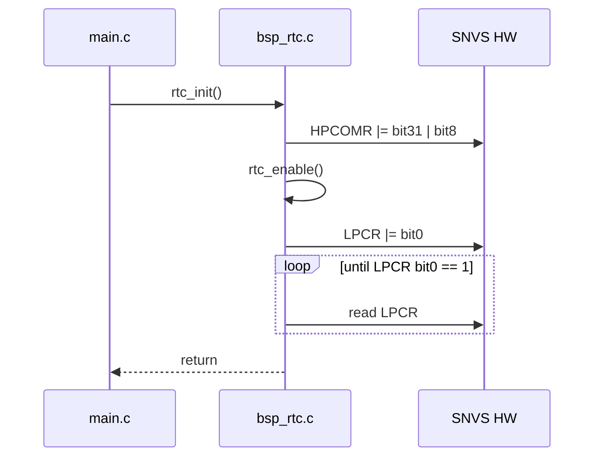

### 14.2 设置时间流程

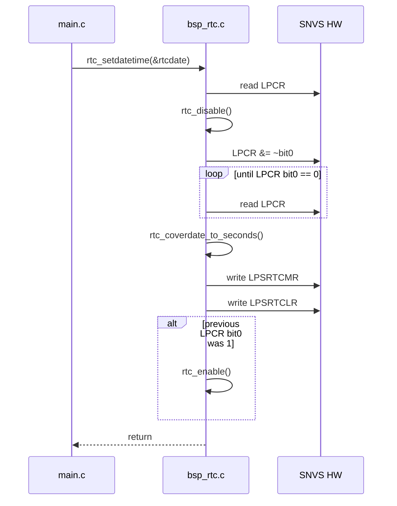

### 14.3 读取时间流程

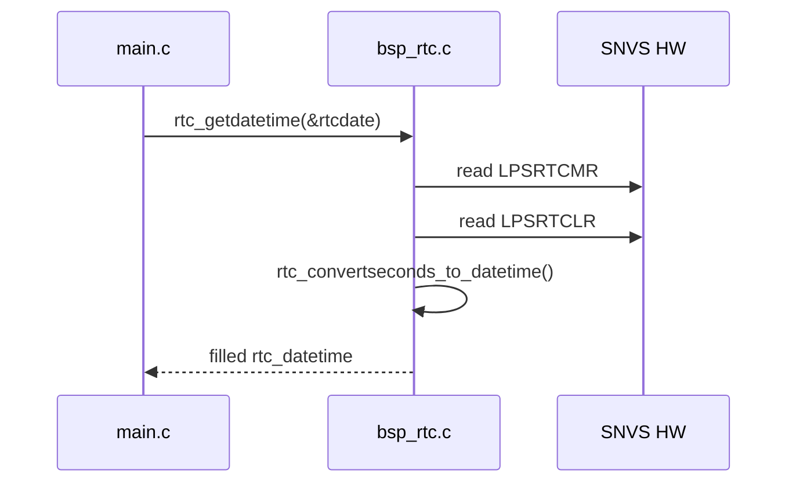

## 15. 状态机分析

源码没有显式状态变量。可从 `SNVS->LPCR bit0` 推导出模块所控制的硬件状态：

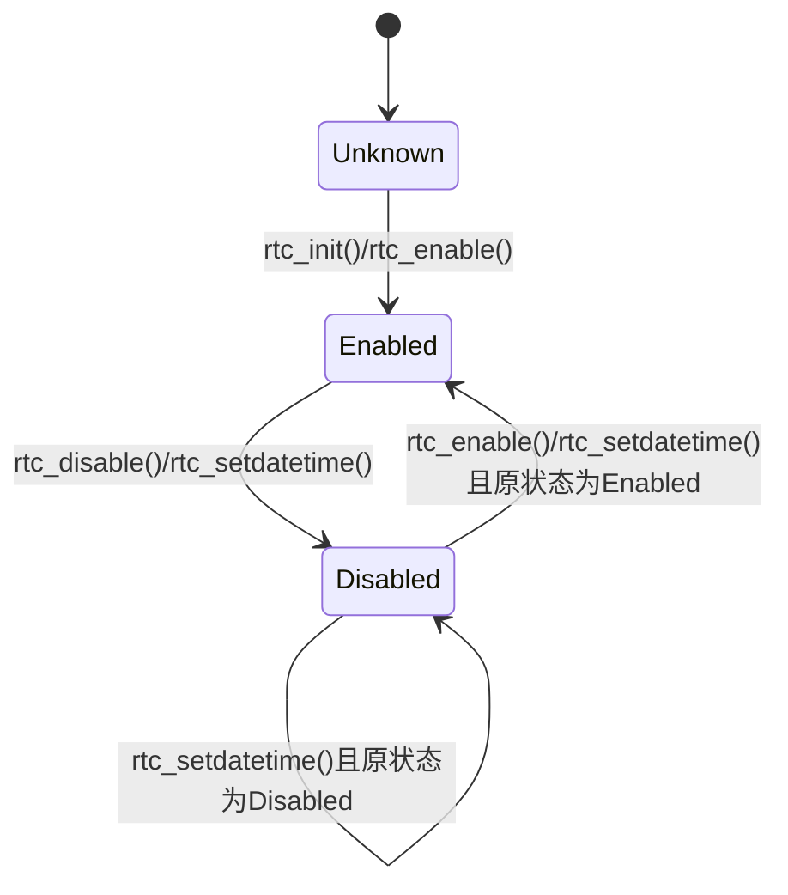

状态说明：

- `Unknown`：上电后或调用 RTC API 前，源码未读取并记录软件状态。
- `Enabled`：`SNVS->LPCR bit0 == 1`。
- `Disabled`：`SNVS->LPCR bit0 == 0`。

## 16. 线程模型、锁机制与并发

源码未使用 RTOS、线程、Linux task、interrupt handler、mutex、spinlock、semaphore、atomic 或 critical section。

基于当前工程调用点，`main.c` 以单主循环方式调用 RTC API，未发现中断上下文调用 RTC API 的证据。但模块 API 是公开的，若未来被中断或多执行上下文调用，存在以下并发风险：

- `SNVS->HPCOMR` 和 `SNVS->LPCR` 的读-改-写不是原子操作。
- `rtc_setdatetime()` 会关闭 RTC 并写两个计数寄存器，期间其他上下文读取可能得到瞬时不一致值。
- `rtc_getseconds()` 读取两个硬件寄存器，没有快照锁定或重读一致性校验。
- 输出参数 `struct rtc_datetime *` 由调用者管理，模块不提供保护。

## 17. 内存管理

源码未使用：

- `malloc/free`
- `kmalloc/kfree`
- 静态可变缓冲区
- DMA buffer
- 栈外动态资源

模块内存主要包括：

- 两个文件作用域 `static const` 查表数组。
- 调用栈上的局部变量。
- 调用方传入的 `struct rtc_datetime` 指针。
- MMIO 寄存器地址访问。

无资源释放流程，因为模块没有分配软件资源。

## 18. 错误处理策略

当前源码采用“无返回错误码 + 忙等确认”的策略：

- 所有会访问硬件的控制函数返回 `void` 或直接返回秒数。
- `rtc_enable()` 和 `rtc_disable()` 通过无限 `while` 等待硬件状态。
- `rtc_setdatetime()` 不校验输入，不返回设置是否成功。
- `rtc_getseconds()` 不校验读取一致性。
- 转换函数不校验日期范围。

该策略适合教学或简单裸机演示，但不适合高可靠或功能安全项目。

## 19. 日志机制

`bsp_rtc.c` 内部没有日志、断言、错误计数、诊断事件或串口输出。

`main.c` 在调用 `rtc_setdatetime()` 后打印 `RTC Init finish`，但这属于应用层提示，不是 RTC 模块内部日志机制。

## 20. 配置项与条件编译

### 20.1 配置项

模块配置主要由宏常量体现：

- 起始年份：`YEAR_RANGE_START`
- 结束年份：`YEAR_RANGE_END`，但未被源码使用。
- 时间单位换算常量。
- SNVS 寄存器位和偏移。

### 20.2 条件编译

`rtc_init()` 中存在 `#if 0` 禁用的默认时间设置代码：

- 创建 `struct rtc_datetime rtcdate`。
- 设置为 `2018-12-13 14:52:00`。
- 调用 `rtc_setdatetime()`。

该代码不参与当前构建。实际工程中，默认时间设置在 `main.c` 的 `rtc_set_default_datetime()` 中完成，并由按键触发。

## 21. 可扩展性分析

当前模块接口简单，便于裸机应用直接调用。但扩展到完整 RTC 驱动时存在结构限制：

- 无抽象设备对象，所有操作绑定全局 `SNVS`。
- 无错误码，无法向上层传播硬件故障。
- 无参数校验，无法构建稳健 API 契约。
- 无 alarm、interrupt、calibration、power management。
- 所有函数公开，内部工具函数未封装为 `static`，接口面偏大。
- 日期范围宏 `YEAR_RANGE_END` 未参与逻辑，范围约束没有落地。

## 22. 代码质量分析

### 22.1 设计优点

- 模块职责清晰，围绕 RTC 初始化、启停、设置、读取和日期转换展开。
- 使用 `static const` 查表减少月份累计天数重复计算。
- 针对 SDK 头文件未暴露 `LPSRTCMR/LPSRTCLR` 的情况，采用偏移访问，体现了对不同头文件版本的兼容性处理。
- 设置时间前先关闭 RTC，符合源码注释中的硬件操作约束。
- 设置时间后根据原始 `LPCR` bit0 状态决定是否重新使能，避免无条件改变调用前的使能状态。
- 数值常量使用 `U` 后缀，减少有符号/无符号混用问题。

### 22.2 Linux Kernel Coding Style 视角

该文件不是 Linux Kernel 代码，但若按内核风格审视：

- 函数名、宏名总体可读，但 `rtc_coverdate_to_seconds` 疑似拼写错误，应为 `convert`。
- 所有函数均导出在头文件中，缺少 `static` 内部函数封装。
- 忙等循环没有超时，不符合内核驱动常见的 `read_poll_timeout` 类设计思想。
- 直接裸指针 MMIO 访问没有使用 `readl/writel` 或屏障语义；裸机环境可工作，但不符合 Linux 驱动抽象。
- 未提供错误码，内核接口通常应返回 `int` 表示失败原因。

### 22.3 MISRA C 视角

潜在问题包括：

- 宏 `RTC_REG32(addr)` 将整数转换为指针并解引用，涉及实现定义行为和强制类型转换风险。
- `RTC_SNVS_BASE_ADDR` 将指针 `SNVS` 转为 `unsigned int`，在指针宽度大于 `unsigned int` 的平台存在截断风险。
- 输入指针未做空指针检查。
- 数组索引来自外部输入 `datetime->month`，未做范围检查。
- 多处复合表达式依赖整数提升和移位，虽当前目标为 32 位 ARM，但可移植性有限。
- `YEAR_RANGE_END` 定义未使用，配置约束与实现不一致。

### 22.4 CERT C 视角

潜在问题包括：

- 空指针解引用风险：`rtc_coverdate_to_seconds()`、`rtc_setdatetime()`、`rtc_convertseconds_to_datetime()`、`rtc_getdatetime()`。
- 越界访问风险：`g_month_days_before[datetime->month]`。
- 整数溢出风险：超出预期年份范围时，`days * SECONDS_IN_A_DAY` 可能溢出 `unsigned int`。
- 无限循环风险：`rtc_enable()`、`rtc_disable()` 无超时。
- 读取硬件多寄存器未保证一致性，可能导致错误时间值传播。

### 22.5 ISO 26262 Part 6 软件架构视角

当前源码未体现功能安全项目所需的安全机制。若该模块用于功能安全项目，应关注以下差距：

| 主题 | 当前源码状态 | 风险 |
|---|---|---|
| Safety Requirement 分配 | 未体现 SG/FSR/TSR/SSR | 无需求可追踪性 |
| Safety Mechanism | 未实现 | 无故障检测与控制 |
| Fault Detection | 未实现 | RTC 停振、寄存器写失败、非法时间无法检测 |
| Fault Handling | 未实现 | 失败时可能永久忙等或输出错误时间 |
| Fault Propagation | 未控制 | 错误时间可直接传递到显示/上层逻辑 |
| FFI | 未体现 | 与其他 SNVS 功能共享寄存器时无隔离策略 |
| SPF | 未分析 | RTC 单点失效可能不被检测 |
| Latent Fault | 未检测 | 长期潜伏的计数异常无法发现 |
| Diagnostic Coverage | 无 | 无法量化诊断覆盖率 |
| Watchdog/Heartbeat | 未实现 | 无限忙等可能阻塞主循环 |
| 异常恢复 | 未实现 | 无复位、降级、默认时间或错误状态策略 |

## 23. 功能安全风险清单

以下风险均由源码行为直接推导：

1. `rtc_enable()`/`rtc_disable()` 无限忙等，硬件异常时系统可能卡死。
2. 日期输入无校验，非法 `month` 可导致数组越界。
3. 日期输入无范围限制，`YEAR_RANGE_END` 未生效。
4. `rtc_getseconds()` 非原子读取高低寄存器，可能得到不一致秒数。
5. 设置 RTC 时无写后读校验，无法发现寄存器写入失败。
6. 无错误返回，上层无法区分成功、失败或硬件异常。
7. 无并发保护，未来若中断或多上下文使用，存在竞态。
8. 无诊断事件、错误计数、降级状态或恢复策略。

## 24. 改进建议

在不改变现有设计目标的前提下，后续可考虑：

- 为 `rtc_enable()`、`rtc_disable()` 增加超时并返回错误码。
- 为所有指针参数增加空指针检查。
- 增加日期范围校验函数，落实 `YEAR_RANGE_START/YEAR_RANGE_END`。
- 将纯内部转换辅助函数按实际接口需求收敛为 `static`，减少外部误用。
- 对 `rtc_getseconds()` 增加一致性读取策略，例如重复读取高低寄存器直到稳定。
- 设置时间后进行写后读校验。
- 使用固定宽度类型 `uint32_t` 替代 `unsigned int` 表示 MMIO 和秒计数。
- 避免将指针转换为 `unsigned int`，使用 `uintptr_t` 或 SDK 推荐寄存器访问方式。
- 增加 API 返回值，使上层可以处理硬件故障和非法参数。
- 若用于安全项目，建立 SSR 到代码的追踪矩阵，并定义诊断、故障反应和安全状态。

## 25. 结论

`bsp_rtc.c` 是一个面向 i.MX6UL 裸机教学/验证工程的 RTC BSP 模块。其核心设计是：通过 SNVS LP SRTC 寄存器提供秒计数基础能力，再由软件完成 1970 年以来秒数与年月日时分秒之间的转换。模块结构简单、硬件访问直接、上层使用方便。

从认证和高可靠软件角度看，该模块仍缺少参数校验、错误返回、超时保护、寄存器一致性读取、并发控制和功能安全诊断机制。因此它可以作为基础 BSP 驱动或教学样例使用，但若进入量产、车规或安全相关项目，需要补充明确的软件安全需求、诊断机制、故障处理策略和可验证的架构约束。
