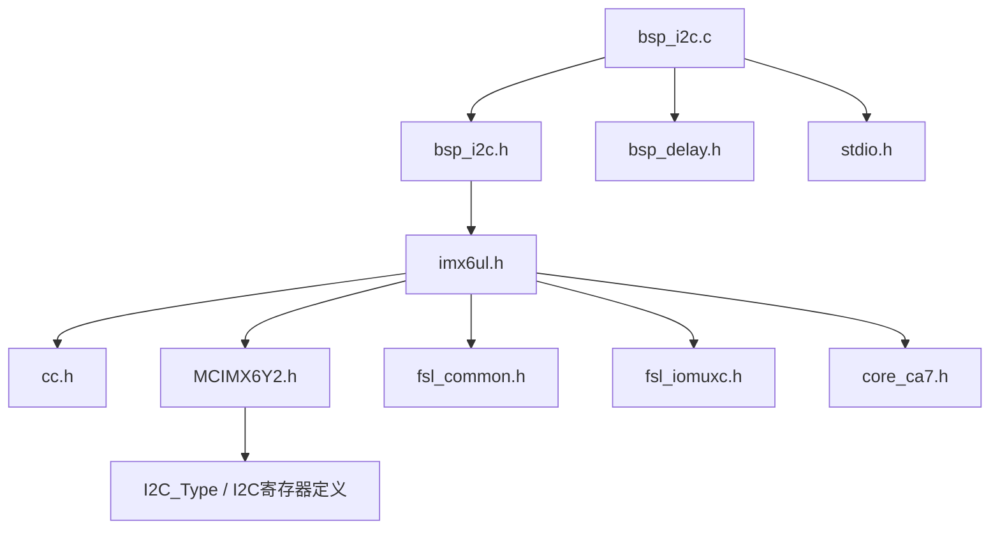
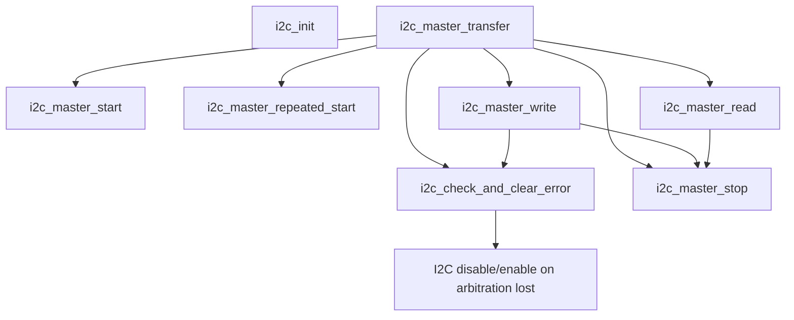
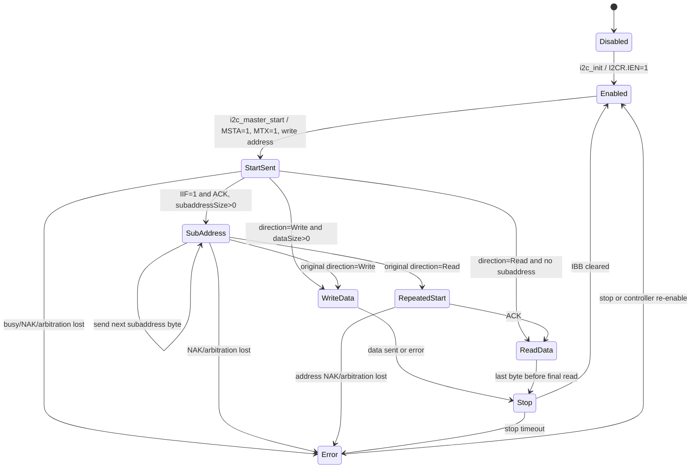
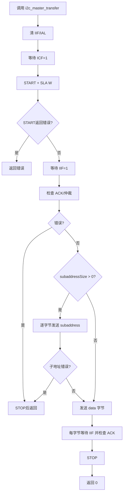
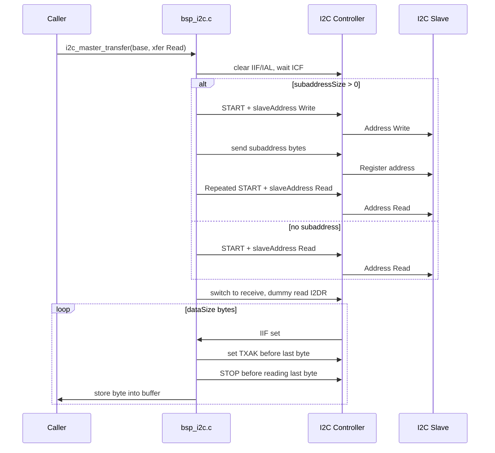
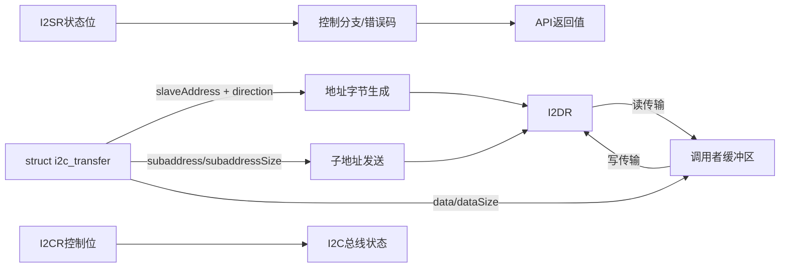
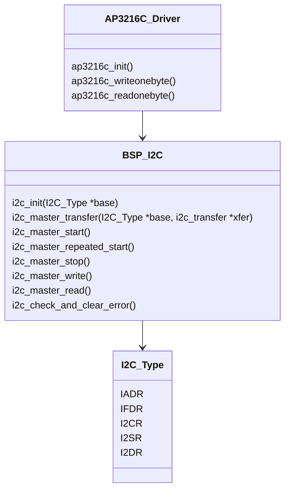

# bsp_i2c.c 软件详细设计说明书

## 1. 文档范围

本文档基于 `bsp/i2c/bsp_i2c.c`、`bsp/i2c/bsp_i2c.h` 以及相关 SoC 头文件中公开的寄存器定义进行逆向设计分析。分析对象是 i.MX6UL bare-metal 工程中的 I2C 主机轮询驱动模块。

本文档仅陈述源码中可以直接确认的事实。未在源码中实现的线程、锁、中断、DMA、日志、动态内存、看门狗和功能安全机制，均明确标记为“未实现”或“源码未体现”。

## 2. 模块定位与设计目的

`bsp_i2c.c` 位于 BSP 层，向上为具体 I2C 从设备驱动提供统一的主机传输接口，向下直接访问 i.MX6UL I2C 控制器寄存器。源码中已确认的上层用户是 `bsp/ap3216c/bsp_ap3216c.c`，该传感器驱动使用 `i2c_init(I2C1)` 初始化 I2C1，并通过 `i2c_master_transfer(I2C1, &masterXfer)` 进行寄存器读写。

模块核心设计目标如下：

- 封装 i.MX6UL I2C 控制器的寄存器级访问。
- 提供阻塞式、轮询式 I2C master 读写能力。
- 支持 7 位从机地址、可变长度子地址、写传输、读传输以及带 repeated start 的寄存器读。
- 对仲裁丢失、NAK、总线停止超时等部分错误进行状态码化。
- 不维护模块级全局状态，使同一套函数可通过不同 `I2C_Type *base` 操作 I2C1 至 I2C4 控制器。

## 3. 文件与依赖关系

### 3.1 文件职责

| 文件 | 职责 |
|---|---|
| `bsp_i2c.c` | I2C master 初始化、起始条件、重复起始、停止条件、数据读写、组合传输和错误检查实现。 |
| `bsp_i2c.h` | 状态码、传输方向枚举、传输描述结构体和 API 原型声明。 |
| `imx6ul.h` | i.MX6UL 公共头文件封装，包含 `MCIMX6Y2.h` 等 SoC 相关定义。 |
| `MCIMX6Y2.h` | 定义 `I2C_Type` 寄存器布局、I2C 寄存器位掩码、I2C1 至 I2C4 基地址。 |
| `bsp_delay.h` | 被 `bsp_i2c.c` include，但本文件未调用其中任何函数。 |
| `stdio.h` | 被 `bsp_i2c.c` include，但本文件未调用标准 I/O 函数。 |

### 3.2 头文件依赖图



### 3.3 模块架构图


## 4. 外部硬件抽象与寄存器模型

`I2C_Type` 定义在 `MCIMX6Y2.h`，是 I2C 外设寄存器布局：

| 成员 | 偏移 | 类型 | 作用 | 本模块访问 |
|---|---:|---|---|---|
| `IADR` | `0x0` | `__IO uint16_t` | I2C 地址寄存器 | 未访问 |
| `RESERVED_0[2]` | `0x2` | `uint8_t[2]` | 对齐/保留 | 不适用 |
| `IFDR` | `0x4` | `__IO uint16_t` | I2C 频率分频寄存器 | `i2c_init()` 写入 `0x15` |
| `RESERVED_1[2]` | `0x6` | `uint8_t[2]` | 对齐/保留 | 不适用 |
| `I2CR` | `0x8` | `__IO uint16_t` | I2C 控制寄存器 | 所有控制流程读写 |
| `RESERVED_2[2]` | `0xA` | `uint8_t[2]` | 对齐/保留 | 不适用 |
| `I2SR` | `0xC` | `__IO uint16_t` | I2C 状态寄存器 | 轮询、清标志、错误判断 |
| `RESERVED_3[2]` | `0xE` | `uint8_t[2]` | 对齐/保留 | 不适用 |
| `I2DR` | `0x10` | `__IO uint16_t` | I2C 数据寄存器 | 发送地址、子地址、数据；接收数据 |

本模块使用的寄存器位含义如下：

| 寄存器 | 位 | SoC 宏名 | 源码用途 |
|---|---:|---|---|
| `IFDR` | `[5:0]` | `I2C_IFDR_IC` | 设置分频值，源码写 `0x15`。 |
| `I2CR` | `7` | `I2C_I2CR_IEN` | 使能/关闭 I2C。 |
| `I2CR` | `5` | `I2C_I2CR_MSTA` | 主模式/产生 START；清零用于 STOP。 |
| `I2CR` | `4` | `I2C_I2CR_MTX` | 发送/接收模式选择。 |
| `I2CR` | `3` | `I2C_I2CR_TXAK` | 接收时发送 NACK。 |
| `I2CR` | `2` | `I2C_I2CR_RSTA` | repeated start。 |
| `I2SR` | `7` | `I2C_I2SR_ICF` | 字节传输完成轮询。 |
| `I2SR` | `5` | `I2C_I2SR_IBB` | 总线忙判断。 |
| `I2SR` | `4` | `I2C_I2SR_IAL` | 仲裁丢失判断和清除。 |
| `I2SR` | `1` | `I2C_I2SR_IIF` | 中断/传输完成标志轮询和清除。 |
| `I2SR` | `0` | `I2C_I2SR_RXAK` | NAK 判断。 |
| `I2DR` | `[7:0]` | `I2C_I2DR_DATA` | 地址、子地址、数据收发。 |

## 5. 公开接口、宏和数据结构

### 5.1 状态码宏

| 宏 | 值 | 语义 | 产生位置 |
|---|---:|---|---|
| `I2C_STATUS_OK` | `0` | 操作成功 | `i2c_check_and_clear_error()`、`i2c_master_stop()` |
| `I2C_STATUS_BUSY` | `1` | 忙状态 | 头文件定义；源码中未返回该宏名，`i2c_master_start()` 和 `i2c_master_repeated_start()` 直接返回 `1` |
| `I2C_STATUS_IDLE` | `2` | 空闲状态 | 仅定义，未使用 |
| `I2C_STATUS_NAK` | `3` | 从机未应答 | `i2c_check_and_clear_error()` |
| `I2C_STATUS_ARBITRATIONLOST` | `4` | 仲裁丢失 | `i2c_check_and_clear_error()` |
| `I2C_STATUS_TIMEOUT` | `5` | 超时 | `i2c_master_stop()` |
| `I2C_STATUS_ADDRNAK` | `6` | 地址阶段 NAK | `i2c_master_transfer()` repeated-start 读地址阶段错误映射 |

### 5.2 `enum i2c_direction`

```c
enum i2c_direction {
    kI2C_Write = 0x0,
    kI2C_Read = 0x1,
};
```

该枚举描述 I2C 地址字节最低位 R/W 方向。`kI2C_Write` 产生地址字节 bit0 为 0，`kI2C_Read` 产生地址字节 bit0 为 1。

### 5.3 `struct i2c_transfer`

```c
struct i2c_transfer {
    unsigned char slaveAddress;
    enum i2c_direction direction;
    unsigned int subaddress;
    unsigned char subaddressSize;
    unsigned char *volatile data;
    volatile unsigned int dataSize;
};
```

| 成员 | 作用 | 读写关系 | 生命周期 |
|---|---|---|---|
| `slaveAddress` | 7 位 I2C 从机地址，不包含 R/W 位。 | 被 `i2c_master_transfer()` 读取，用于 start/repeated start 地址字节生成。 | 调用者创建并初始化，传输期间只读。 |
| `direction` | 传输方向。 | `i2c_master_transfer()` 读取；读寄存器且有子地址时临时局部变量 `direction` 改为写，不修改结构体成员。 | 调用者管理。 |
| `subaddress` | 从设备内部寄存器地址或子地址。 | `i2c_master_transfer()` 右移后逐字节写入 `I2DR`。 | 调用者管理，传输期间只读。 |
| `subaddressSize` | 子地址长度，单位字节。 | `i2c_master_transfer()` 会递减该成员，属于输入参数被破坏性消费。 | 调用者管理；调用返回后该字段可能变为 0。 |
| `data` | 数据缓冲区。 | 写传输时作为源；读传输时作为目的。 | 调用者保证缓冲区有效且长度至少为 `dataSize`。 |
| `dataSize` | 数据长度。 | `i2c_master_transfer()` 读取并传给读写函数；本函数不修改该成员。 | 调用者管理。 |

设计注意：`subaddressSize` 在传输过程中被递减，这使结构体不是纯描述对象，重复使用同一 `struct i2c_transfer` 需要调用者重新赋值。该行为由源码直接体现。

## 6. 全局变量、静态变量和资源

本模块没有定义全局变量、文件内静态变量、静态函数、动态分配内存或显式资源句柄。

| 类别 | 源码状态 |
|---|---|
| 全局变量 | 无 |
| 静态变量 | 无 |
| 静态函数 | 无 |
| 动态内存 | 无 `malloc`/`free`/`kmalloc`/`kfree` |
| 中断处理 | 未注册 ISR，未使能 `I2CR[IIEN]` |
| DMA | 未实现 |
| 锁机制 | 无 mutex/spinlock/semaphore/atomic |
| 日志机制 | 无 `printf` 调用，尽管 include 了 `stdio.h` |
| 资源释放 | 无独立释放接口；通过 STOP 释放 I2C 总线主机占用 |

## 7. 控制流与数据流

### 7.1 总体调用关系



### 7.2 传输状态机



### 7.3 写传输流程



### 7.4 读传输流程



### 7.5 数据流图



## 8. 函数详细设计

### 8.1 `void i2c_init(I2C_Type *base)`

功能：初始化指定 I2C 控制器，源码注释目标波特率为 100 kHz。

设计目的：在操作控制器配置寄存器前先关闭 I2C，然后设置分频寄存器 `IFDR`，最后打开 I2C。

调用时机：上层完成 IOMUX 和 pad 配置后调用。源码中 `ap3216c_init()` 调用 `i2c_init(I2C1)`。

参数：

| 参数 | 说明 |
|---|---|
| `base` | I2C 控制器寄存器基地址，如 `I2C1`。源码未做 NULL 检查。 |

返回值：无。

执行流程：

1. 清除 `I2CR[7]`，关闭 I2C。
2. 写 `IFDR = 0x15`。
3. 设置 `I2CR[7]`，使能 I2C。

异常路径：无显式错误返回；若 `base` 非法会直接触发非法内存访问或未定义硬件行为。

调用关系：不调用本模块其他函数。

线程安全性：无锁。若多个执行上下文同时访问同一 I2C 控制器，寄存器读改写存在竞争。

时间复杂度：O(1)。

### 8.2 `unsigned char i2c_master_start(I2C_Type *base, unsigned char address, enum i2c_direction direction)`

功能：发送 START 条件并发送 7 位从机地址和方向位。

设计目的：把总线从空闲状态切换到主发送状态，启动一次 I2C transaction。

调用时机：`i2c_master_transfer()` 中地址阶段调用。

参数：

| 参数 | 说明 |
|---|---|
| `base` | I2C 控制器基地址。 |
| `address` | 7 位从机地址。源码未屏蔽高位。 |
| `direction` | `kI2C_Write` 或 `kI2C_Read`。 |

返回值：

| 返回值 | 含义 |
|---:|---|
| `0` | START 和地址写寄存器动作已发起。 |
| `1` | 检测到 `I2SR[IBB]` 总线忙。该值等于 `I2C_STATUS_BUSY`。 |

执行流程：

1. 检查 `I2SR[5]`，若总线忙返回 1。
2. 设置 `I2CR[MSTA]` 和 `I2CR[MTX]`。
3. 写 `I2DR = (address << 1) | read_bit`。

异常路径：只检查总线忙，不检查 ACK；ACK 由调用者后续调用 `i2c_check_and_clear_error()` 处理。

调用关系：被 `i2c_master_transfer()` 调用。

线程安全性：无锁，不能安全并发操作同一控制器。

时间复杂度：O(1)，但硬件完成时间由调用者后续轮询承担。

### 8.3 `unsigned char i2c_master_repeated_start(I2C_Type *base, unsigned char address, enum i2c_direction direction)`

功能：发送 repeated START 条件并发送新的地址方向字节。

设计目的：支持典型寄存器读序列：先写寄存器地址，再不释放总线，重复起始后切换为读。

调用时机：`i2c_master_transfer()` 在 `xfer->direction == kI2C_Read` 且已发送子地址后调用。

返回值：

| 返回值 | 含义 |
|---:|---|
| `0` | repeated START 和地址写寄存器动作已发起。 |
| `1` | 总线忙且当前不在主模式。 |

执行流程：

1. 若 `I2SR[IBB]` 为 1 且 `I2CR[MSTA]` 为 0，返回 1。
2. 设置 `I2CR[MTX]` 和 `I2CR[RSTA]`。
3. 写 `I2DR = (address << 1) | read_bit`。

异常路径：不检查 ACK；调用者后续轮询 `IIF` 并调用错误检查。

线程安全性：无锁。

时间复杂度：O(1)。

### 8.4 `unsigned char i2c_check_and_clear_error(I2C_Type *base, unsigned int status)`

功能：根据传入状态字检查仲裁丢失和 NAK，并执行必要清理。

设计目的：集中处理 I2C 字节阶段常见错误，向上返回统一状态码。

参数：

| 参数 | 说明 |
|---|---|
| `base` | I2C 控制器基地址。 |
| `status` | 调用者读取的 `I2SR` 快照。 |

返回值：

| 返回值 | 含义 |
|---:|---|
| `I2C_STATUS_ARBITRATIONLOST` | `status[4]` 为 1。函数清 `I2SR[IAL]` 并关闭/重新打开 I2C。 |
| `I2C_STATUS_NAK` | `status[0]` 为 1。 |
| `I2C_STATUS_OK` | 未检测到上述错误。 |

执行流程：

1. 若仲裁丢失，清 `I2SR[IAL]`，关闭再开启 `I2CR[IEN]`，返回仲裁丢失。
2. 否则若 RXAK 为 1，返回 NAK。
3. 否则返回 OK。

异常路径：不处理超时、不处理总线挂死、不处理非法 `base`。

调用关系：由 `i2c_master_transfer()` 和 `i2c_master_write()` 调用。

线程安全性：会修改控制器使能位；并发访问同一控制器时可能影响其他传输。

时间复杂度：O(1)。

### 8.5 `unsigned char i2c_master_stop(I2C_Type *base)`

功能：发送 STOP 条件，并等待总线忙标志清除。

设计目的：结束一次主机传输，释放 I2C 总线。

返回值：

| 返回值 | 含义 |
|---:|---|
| `I2C_STATUS_OK` | `I2SR[IBB]` 在计数耗尽前清零。 |
| `I2C_STATUS_TIMEOUT` | 轮询计数 `0xffff` 耗尽。 |

执行流程：

1. 清除 `I2CR[MSTA]`、`I2CR[MTX]`、`I2CR[TXAK]`。
2. 循环等待 `I2SR[IBB]` 清零。
3. 超时返回 `I2C_STATUS_TIMEOUT`，否则返回 OK。

异常路径：仅 STOP 等待有超时保护。调用者多数情况下未检查该返回值。

线程安全性：无锁。

时间复杂度：O(T)，T 为 `I2SR[IBB]` 清零前的轮询次数，最大 65535 次。

### 8.6 `void i2c_master_write(I2C_Type *base, const unsigned char *buf, unsigned int size)`

功能：在已经完成地址阶段后发送数据缓冲区，并最终发送 STOP。

设计目的：提供连续数据写入能力，按字节等待传输完成并检查 ACK/仲裁错误。

参数：

| 参数 | 说明 |
|---|---|
| `base` | I2C 控制器基地址。 |
| `buf` | 待发送数据缓冲区。源码未做 NULL 检查。 |
| `size` | 字节数。 |

返回值：无。内部错误只会提前跳出发送循环并发送 STOP，不向上返回具体错误。

执行流程：

1. 等待 `I2SR[ICF]` 为 1。该等待无超时。
2. 清 `I2SR[IIF]`。
3. 设置 `I2CR[MTX]` 为发送模式。
4. 循环发送每个字节：
   - 写 `I2DR = *buf++`。
   - 等待 `I2SR[IIF]` 为 1。该等待无超时。
   - 清 `I2SR[IIF]`。
   - 调用 `i2c_check_and_clear_error()`；若非 OK，跳出。
5. 清 `I2SR[IIF]`。
6. 调用 `i2c_master_stop()`。

异常路径：

- NAK 或仲裁丢失会中断写循环，但因函数返回类型为 `void`，错误不会传播到 `i2c_master_transfer()`。
- 等待 `ICF` 和 `IIF` 没有超时，硬件异常可能导致永久阻塞。

调用关系：由 `i2c_master_transfer()` 调用；内部调用 `i2c_check_and_clear_error()` 和 `i2c_master_stop()`。

线程安全性：无锁；`buf` 由调用者保证生命周期和并发访问安全。

时间复杂度：O(n + W)，n 为 `size`，W 为硬件轮询等待时间。

### 8.7 `void i2c_master_read(I2C_Type *base, unsigned char *buf, unsigned int size)`

功能：在已经完成读地址阶段后接收指定字节数，并在最后一个字节前发送 STOP。

设计目的：实现 i.MX6UL I2C 接收流程，包括 dummy read、单字节读 NACK、多字节读倒数第二字节设置 NACK。

参数：

| 参数 | 说明 |
|---|---|
| `base` | I2C 控制器基地址。 |
| `buf` | 接收缓冲区。源码未做 NULL 检查。 |
| `size` | 读取字节数。 |

返回值：无。

执行流程：

1. 定义 `volatile uint8_t dummy` 并自增一次，避免未使用告警。
2. 等待 `I2SR[ICF]` 为 1。该等待无超时。
3. 清 `I2SR[IIF]`。
4. 清 `I2CR[MTX]` 和 `I2CR[TXAK]`，进入接收模式并默认 ACK。
5. 若 `size == 1`，设置 `I2CR[TXAK]`，准备单字节 NACK。
6. 读取一次 `I2DR` 到 `dummy`，触发硬件接收。
7. 循环读取每个字节：
   - 等待 `I2SR[IIF]`。该等待无超时。
   - 清 `I2SR[IIF]`。
   - 若当前为最后一个字节前的阶段，调用 `i2c_master_stop()`。
   - 若即将接收最后一个字节，设置 `I2CR[TXAK]`。
   - 从 `I2DR` 读取数据写入 `*buf++`。

异常路径：

- 没有 ACK/仲裁错误检查。
- 等待 `ICF` 和 `IIF` 没有超时。
- `i2c_master_stop()` 返回值未检查。

调用关系：由 `i2c_master_transfer()` 调用；内部调用 `i2c_master_stop()`。

线程安全性：无锁；`buf` 由调用者保证生命周期和并发访问安全。

时间复杂度：O(n + W)，n 为 `size`，W 为硬件轮询等待时间。

### 8.8 `unsigned char i2c_master_transfer(I2C_Type *base, struct i2c_transfer *xfer)`

功能：执行一次完整 I2C 主机传输，包括地址阶段、可选子地址阶段、可选 repeated start、数据读写阶段。

设计目的：向上层设备驱动提供统一事务接口，隐藏底层 START/STOP/IIF/ACK 操作细节。

参数：

| 参数 | 说明 |
|---|---|
| `base` | I2C 控制器基地址。 |
| `xfer` | 传输描述结构体。源码未做 NULL 检查。 |

返回值：

| 返回值 | 含义 |
|---:|---|
| `0` | 函数控制流完成；注意数据阶段内部错误可能未被传播。 |
| `1` | START 或 repeated START 忙错误。 |
| `I2C_STATUS_NAK` | 地址阶段或子地址阶段 NAK。 |
| `I2C_STATUS_ARBITRATIONLOST` | 地址阶段或子地址阶段仲裁丢失。 |
| `I2C_STATUS_ADDRNAK` | repeated-start 读地址阶段错误被映射为地址 NAK。 |

执行流程：

1. `ret = 0`，局部 `direction = xfer->direction`。
2. 清 `I2SR[IIF]` 和 `I2SR[IAL]`。
3. 等待 `I2SR[ICF]` 为 1。该等待无超时。
4. 若存在子地址且原始方向为读，将第一次地址阶段方向改为写。
5. 调用 `i2c_master_start()` 发送 START 和地址。
6. 等待 `I2SR[IIF]`。
7. 调用 `i2c_check_and_clear_error()` 检查地址阶段。
8. 若有子地址：
   - 逐字节递减 `xfer->subaddressSize`。
   - 将 `xfer->subaddress` 按大端顺序移位后写入 `I2DR`。
   - 等待 `IIF` 并检查错误。
   - 若原始方向为读，清 `IIF`，调用 `i2c_master_repeated_start()`，等待 `IIF`，检查读地址阶段错误。
9. 若原始方向为写且 `dataSize > 0`，调用 `i2c_master_write()`。
10. 若原始方向为读且 `dataSize > 0`，调用 `i2c_master_read()`。
11. 返回 0。

异常路径：

- `i2c_master_start()` 返回非 0 时直接返回，不额外 STOP。
- 地址阶段或子地址阶段错误会 STOP 并返回错误。
- repeated-start 读地址阶段错误会映射为 `I2C_STATUS_ADDRNAK`，STOP 后返回。
- 数据写和数据读函数为 `void`，其内部错误和 STOP 超时不会传回。
- 多处等待没有超时，可能永久阻塞。

调用关系：模块最高层事务函数，由上层设备驱动调用。

线程安全性：无锁。调用者必须保证同一 I2C 控制器同一时间只有一个上下文访问。

时间复杂度：O(s + n + W)，s 为子地址字节数，n 为数据字节数，W 为硬件轮询等待时间。

## 9. 初始化、配置、运行和异常流程

### 9.1 初始化流程

```mermaid
flowchart TD
    A[上层配置 IOMUX/PAD] --> B[i2c_init(base)]
    B --> C[清 I2CR.IEN 关闭I2C]
    C --> D[IFDR=0x15]
    D --> E[置 I2CR.IEN 使能I2C]
    E --> F[等待上层发起 transfer]
```

### 9.2 配置流程

源码中只有固定配置：

- 分频寄存器 `IFDR` 固定写入 `0x15`。
- 注释说明按 `IPG_CLK_ROOT=66 MHz` 和分频近似值 640 得到约 100 kHz。
- 未提供运行期波特率参数。
- 未配置 IOMUX、pad 电气属性、I2C 时钟门控或中断。

### 9.3 运行流程

模块采用同步阻塞运行模型。调用者进入 `i2c_master_transfer()` 后，当前执行上下文一直轮询硬件状态位直到传输完成、发生被处理的错误，或在某些 STOP 场景超时。

### 9.4 异常处理流程

已实现异常处理：

- START 前总线忙检查。
- repeated START 前“总线忙且非主模式”检查。
- 地址阶段、子地址阶段和写数据阶段 ACK/NAK 检查。
- 仲裁丢失时清错误位，并关闭/重新开启 I2C。
- STOP 等待总线释放时有限轮询超时。

未实现或未完整传播的异常处理：

- 多数 `while(!(I2SR & flag))` 没有超时。
- `i2c_master_write()` 内部错误不返回给调用者。
- `i2c_master_read()` 不检查错误。
- STOP 超时多数调用点不检查返回值。
- NULL 指针、非法 `size`、非法 `subaddressSize`、非法 `direction` 未检查。

## 10. 线程模型、锁机制和内存管理

该模块面向 bare-metal 单线程或受上层串行化保护的执行环境。源码未体现 RTOS 任务、Linux 线程、中断上下文保护或 SMP 并发保护。

| 主题 | 设计结论 |
|---|---|
| 线程模型 | 同步阻塞、调用者上下文执行。 |
| 锁机制 | 无 mutex、spinlock、semaphore、atomic。 |
| 中断 | 未启用 I2C 中断，完全轮询。 |
| 内存管理 | 不分配、不释放动态内存。 |
| 缓冲区所有权 | `data` 缓冲区由调用者提供并保持有效。 |
| 可重入性 | 对不同 I2C 控制器实例理论上可独立调用；对同一 `base` 不可并发重入。 |

## 11. API 与模块间接口关系



## 12. 函数调用树

```text
i2c_init

i2c_master_start

i2c_master_repeated_start

i2c_check_and_clear_error

i2c_master_stop

i2c_master_write
|-- i2c_check_and_clear_error
`-- i2c_master_stop

i2c_master_read
`-- i2c_master_stop

i2c_master_transfer
|-- i2c_master_start
|-- i2c_check_and_clear_error
|-- i2c_master_stop
|-- i2c_check_and_clear_error
|-- i2c_master_stop
|-- i2c_master_repeated_start
|-- i2c_check_and_clear_error
|-- i2c_master_stop
|-- i2c_master_write
|   |-- i2c_check_and_clear_error
|   `-- i2c_master_stop
`-- i2c_master_read
    `-- i2c_master_stop
```

## 13. 代码质量与标准符合性分析

### 13.1 设计优点

- 分层清晰：设备驱动通过 `i2c_master_transfer()` 使用控制器驱动，控制器驱动直接面向 `I2C_Type`。
- 无全局状态：接口通过 `base` 参数选择 I2C 实例，具备一定复用性。
- 支持 repeated start：满足寄存器型 I2C 从设备常见读序列。
- 错误状态有基本抽象：头文件定义了 NAK、仲裁丢失、超时等状态码。
- STOP 有有限超时：相比完全无限等待，STOP 阶段具备基本故障逃逸路径。

### 13.2 Linux Kernel Coding Style 视角

本模块不是 Linux kernel driver，但若按 Linux Kernel Coding Style 和内核驱动习惯评审，存在以下问题：

- 大量裸数字位操作，如 `(1 << 7)`，未使用 SoC 头文件已有 `I2C_I2CR_IEN_MASK` 等宏，降低可读性和可审计性。
- include 了未使用的 `bsp_delay.h` 和 `stdio.h`。
- 缩进风格不一致，存在 tab/space 混用。
- 部分注释有拼写问题，例如 `addrss`、`dividison`、`IC2`。
- 公共函数全部导出，未区分高层 API 与内部 helper；如果只希望上层使用 `i2c_init()` 和 `i2c_master_transfer()`，其他函数可考虑收敛为内部接口。
- 返回值语义不一致：部分函数返回状态，部分函数 `void` 吞掉错误。

### 13.3 MISRA C 视角

潜在不符合点包括：

- 未检查指针参数是否为 NULL。
- 使用 magic number 表示寄存器位。
- `i2c_master_transfer()` 修改输入结构体成员 `subaddressSize`，接口副作用不明显。
- `while(!(base->I2SR & (1 << 1)));` 这类空循环体可读性和可维护性较差，且无超时。
- 多处隐式类型转换，例如 `address << 1` 后写入 16 位寄存器。
- `enum i2c_direction` 未做非法枚举值防御。
- `volatile` 使用在 `unsigned char *volatile data` 和 `volatile unsigned int dataSize` 上，表达的是指针本身或成员访问易变，而不是缓冲区内容易变；是否符合意图需要重新审查。

### 13.4 CERT C 视角

潜在风险包括：

- 空指针解引用风险：`base`、`xfer`、`buf` 均未检查。
- 无限循环导致拒绝服务风险：多个硬件轮询点无超时。
- 错误未传播风险：写/读数据阶段无法向调用者报告失败。
- 整数和移位边界风险：`xfer->subaddressSize` 未限制，`8 * xfer->subaddressSize` 若输入异常可能形成不合理移位。
- 缓冲区越界风险：模块信任 `dataSize` 与 `data` 实际容量匹配。

### 13.5 ISO 26262 Part 6 软件架构视角

源码没有功能安全项目所需的安全需求标识、ASIL 分解、诊断机制说明或安全状态定义。因此只能评价其作为普通 bare-metal BSP 的安全相关成熟度。

| ISO 26262 关注点 | 源码体现 | 评价 |
|---|---|---|
| 软件组件边界 | I2C 控制器驱动边界清晰 | 有利于架构分解 |
| 接口定义 | 有头文件接口和状态码 | 错误传播不完整 |
| 错误检测 | NAK、仲裁丢失、部分 STOP 超时 | 覆盖不足 |
| 错误处理 | STOP、仲裁丢失时重启 I2C | 缺少恢复策略确认和上报一致性 |
| 资源隔离 | 无全局状态 | 同一控制器并发无保护 |
| 可测试性 | 函数较短，事务流程清晰 | 硬件寄存器强耦合，缺少抽象/mock |
| 可追踪性 | 无 SG/FSR/TSR/SSR 标识 | 不满足安全项目追踪要求 |
| 确定性 | 阻塞轮询简单 | 无超时轮询破坏时间确定性 |

## 14. 功能安全专项分析

### 14.1 Safety Requirement 承担情况

源码未包含 SG、FSR、TSR、SSR、安全目标 ID、需求 ID 或安全相关注释。因此不能确认该模块承担任何已分配的 ISO 26262 安全需求。

如果该模块被纳入功能安全项目，它可能作为“传感器 I2C 通信通道”的技术软件组件参与数据采集链路，但这属于系统集成层面的分配，不能从当前源码直接认定。

### 14.2 Safety Mechanism

源码中可识别的基础诊断/防护机制：

- ACK/NAK 检测。
- 仲裁丢失检测。
- 仲裁丢失后控制器 disable/enable。
- STOP 阶段总线忙超时。

源码未体现的安全机制：

- 通信 CRC/PEC。
- 数据范围检查、合理性检查、时序新鲜度检查。
- 重试策略。
- 故障计数与降级策略。
- 安全状态切换。
- 看门狗喂狗策略或 heartbeat。
- I2C 总线恢复，例如 SCL 手动 clock pulse 释放 SDA。
- 周期性 latent fault 检测。

### 14.3 Fault Detection / Handling / Propagation

| 故障 | 检测 | 处理 | 传播 |
|---|---|---|---|
| 总线忙 | START 前检查 `I2SR[IBB]` | 直接返回 1 | 可传播到上层 |
| repeated START 非主模式忙 | 检查 `I2SR[IBB]` 和 `I2CR[MSTA]` | 返回 1 | 在当前调用点未检查 `i2c_master_repeated_start()` 返回值，而是继续等待 IIF |
| NAK | 检查 `I2SR[RXAK]` | 地址/子地址阶段 STOP；写数据阶段 break + STOP | 地址/子地址传播，写数据阶段不传播 |
| 仲裁丢失 | 检查 `I2SR[IAL]` | 清 IAL，disable/enable I2C | 地址/子地址传播，写数据阶段不传播 |
| STOP 总线不释放 | `i2c_master_stop()` 计数超时 | 返回 TIMEOUT | 多数调用者未检查 |
| 传输完成标志不置位 | 多处等待 ICF/IIF | 无处理 | 不传播，永久阻塞 |

### 14.4 SPF、Latent Fault 与 Diagnostic Coverage

从源码看，单点故障风险较高的点包括：

- I2C 控制器或总线卡死导致无限等待，系统主循环可能被阻塞。
- 数据阶段错误被吞掉，上层可能认为传输成功。
- 缓冲区或传输描述结构体非法会直接导致未定义行为。
- 子地址长度异常可能导致不符合预期的移位和寄存器访问序列。

潜在故障检测不足：

- 没有周期性自检。
- 没有对 I2C 控制器配置寄存器进行读回校验。
- 没有对从设备通信结果进行端到端保护。

Diagnostic Coverage 不能从源码定量计算。定性看，仅覆盖部分通信协议级错误，无法覆盖总线永久忙、时钟异常、数据损坏、软件误用、寄存器配置破坏等故障。

### 14.5 Freedom From Interference

源码没有内存保护、时间预算、锁、优先级隔离或共享资源仲裁。模块无全局变量有利于数据隔离，但同一 I2C 控制器寄存器是共享硬件资源，当前接口没有防止并发访问或长时间阻塞的机制。因此不能证明满足 FFI。

## 15. 可维护性、可测试性和可扩展性

### 15.1 可维护性

当前实现短小直接，便于理解硬件流程。但 magic number、错误传播不一致、未使用寄存器宏、接口副作用等问题会增加后续维护成本。

### 15.2 可测试性

可测试点：

- `i2c_master_transfer()` 的方向选择和子地址发送顺序。
- ACK/NAK 和仲裁丢失状态码返回。
- STOP 超时路径。

测试困难点：

- 函数直接访问 memory-mapped register，缺少硬件抽象层。
- 无限轮询路径难以单元测试。
- 数据阶段错误不返回，自动化断言困难。

### 15.3 可扩展性

已有扩展基础：

- `base` 参数支持多 I2C 控制器。
- `struct i2c_transfer` 支持不同从机地址、方向、子地址长度和数据长度。

扩展限制：

- 波特率固定。
- 不支持中断/DMA。
- 不支持多消息批处理。
- 不支持 10 位地址。
- 不支持超时参数。
- 不支持总线恢复策略。

## 16. 改进建议

以下建议不改变本文档对现有源码的事实描述，仅作为设计评审输入：

1. 使用 `MCIMX6Y2.h` 中已有寄存器位宏替代裸数字位操作。
2. 移除未使用的 `bsp_delay.h` 和 `stdio.h` include。
3. 为所有等待 `ICF/IIF/IBB` 的循环增加统一超时机制，并将超时传播到上层。
4. 将 `i2c_master_write()` 和 `i2c_master_read()` 改为返回状态码，避免数据阶段错误丢失。
5. 不在 `i2c_master_transfer()` 中破坏性修改 `xfer->subaddressSize`，改用局部计数变量。
6. 增加参数检查：`base`、`xfer`、`data`、`dataSize`、`subaddressSize`、`direction`。
7. 明确 API 分层：只暴露初始化和事务接口，内部 START/STOP/helper 可收敛为文件内静态函数。
8. 如果用于功能安全项目，补充安全需求追踪、故障响应策略、通信诊断、总线恢复、时间预算、FFI 分析和测试证据。
9. 对寄存器配置进行可选读回校验，提升配置故障检测能力。
10. 为上层定义统一错误语义，区分地址 NAK、数据 NAK、仲裁丢失、总线忙、总线卡死和参数错误。

## 17. 结论

`bsp_i2c.c` 是一个面向 i.MX6UL bare-metal BSP 的简洁 I2C master 轮询驱动。其设计思想是用最小状态和直接寄存器访问完成常见 I2C 从设备寄存器读写，尤其适配 AP3216C 这类传感器设备。模块结构清晰、依赖少、无动态内存和全局状态，适合教学、验证和简单裸机应用。

从工程化和功能安全角度看，该模块仍缺少完整错误传播、统一超时、参数防御、并发保护、可测试抽象和安全机制。若进入量产或 ISO 26262 项目，需要在保持寄存器访问确定性的同时，补齐诊断覆盖、故障处理、时间确定性和需求追踪。
