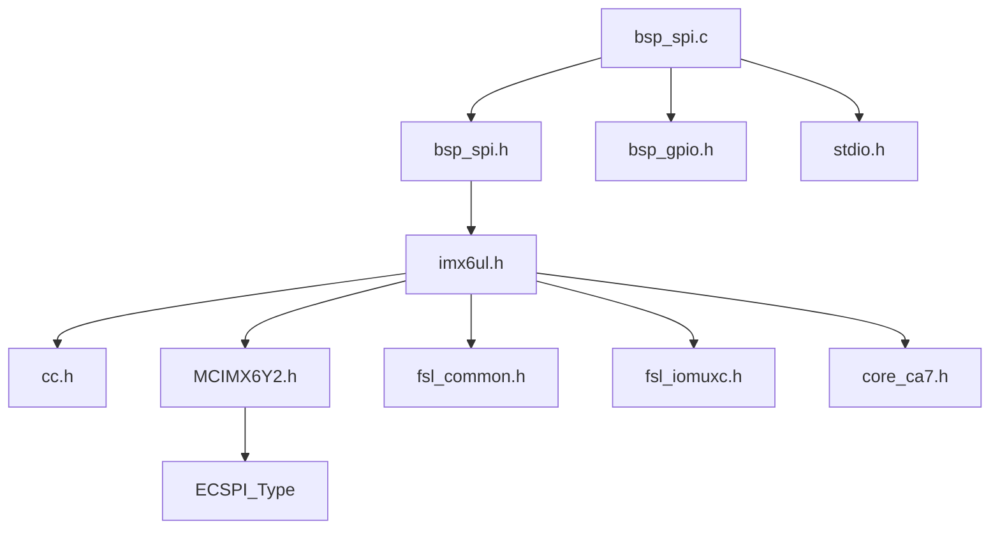
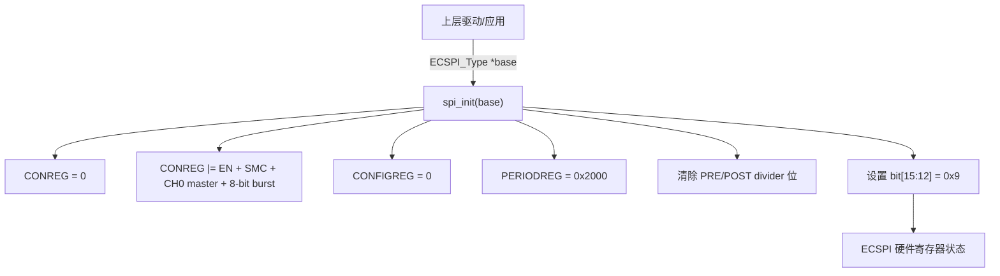
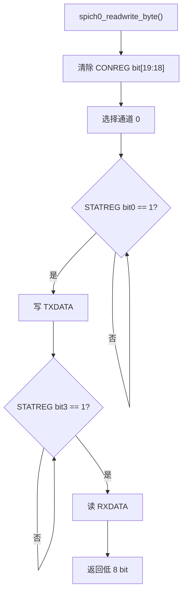
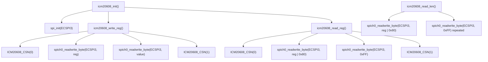
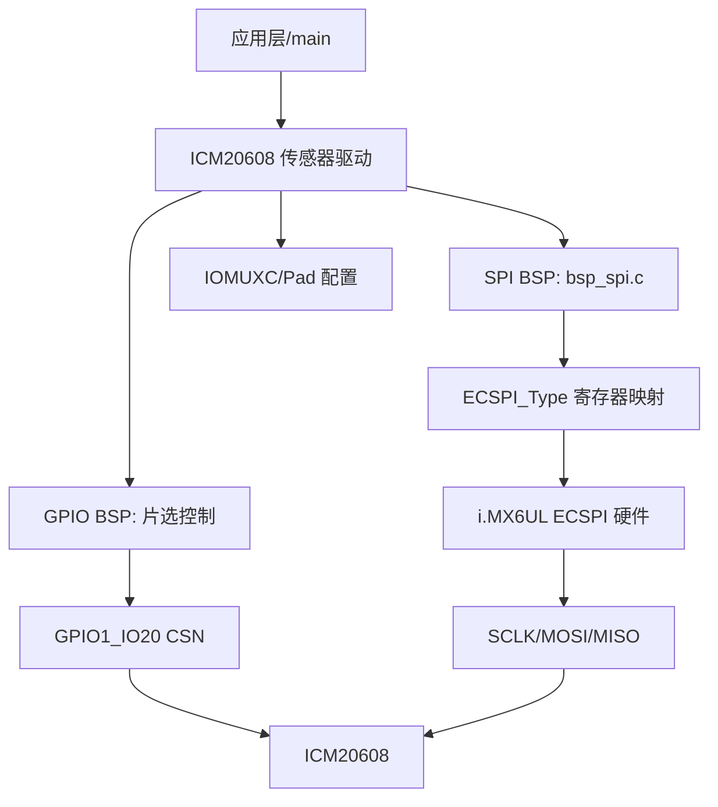
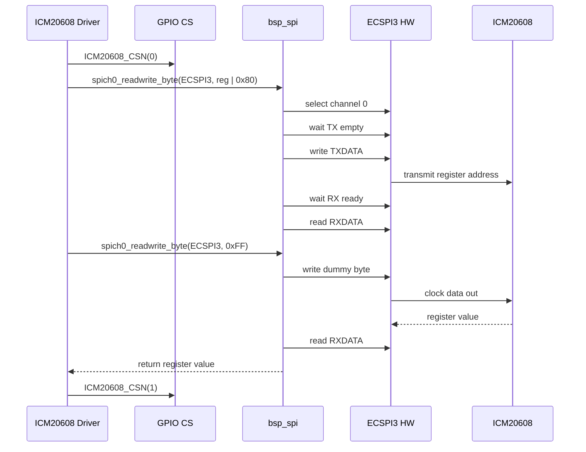
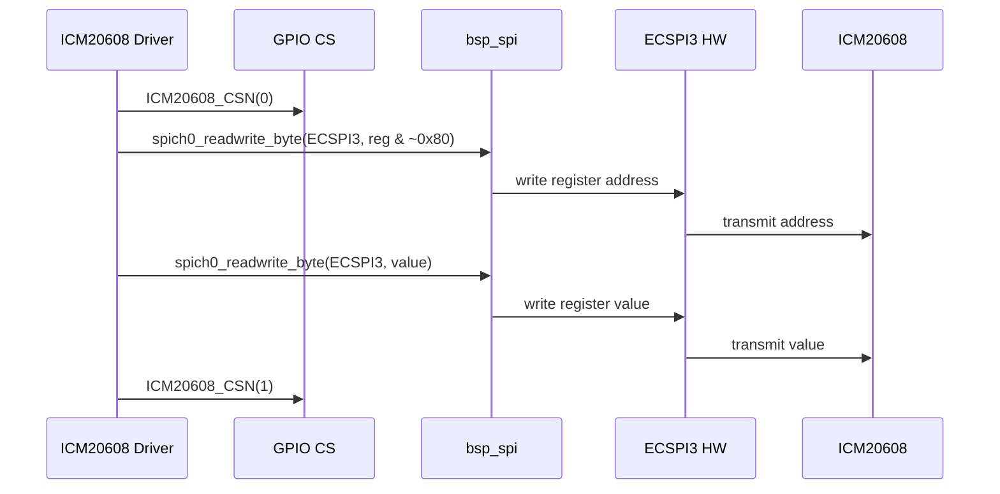
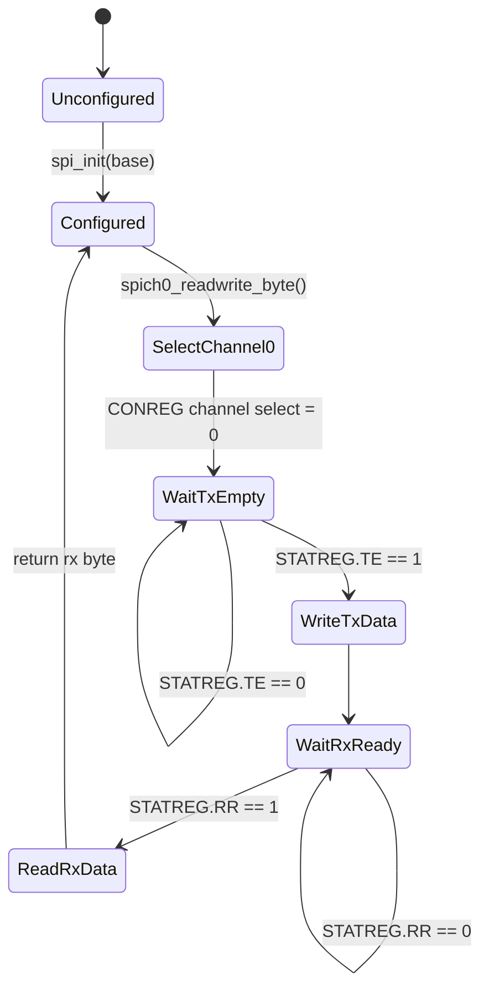

# bsp_spi.c 软件详细设计说明书（SDD）

## 1. 文档范围

本文档对 `baremetal/18-spi/bsp/spi/bsp_spi.c` 进行逆向设计分析，依据文件如下：

- `bsp_spi.c`
- `bsp_spi.h`
- `18-spi/imx6ul/imx6ul.h`
- `18-spi/imx6ul/MCIMX6Y2.h` 中 `ECSPI_Type` 及 ECSPI 寄存器位定义
- `18-spi/bsp/icm20608/bsp_icm20608.c/.h` 中对 SPI BSP 的实际调用关系

本文档只基于已读取源码进行分析；未在源码中出现的能力、时序保证、安全机制或硬件约束均标记为“源码未体现”。

## 2. 模块概述

`bsp_spi.c` 是 i.MX6UL 裸机工程中的 ECSPI 底层 BSP 模块，提供面向外设驱动的最小 SPI 控制接口。模块职责集中在两点：

1. 初始化指定 ECSPI 控制器的核心寄存器，使其工作在 SPI 主模式、通道 0、8 bit 突发长度、轮询传输模式。
2. 通过通道 0 完成一个字节的同步发送和接收。

该模块不负责 IOMUX 引脚复用、电气属性配置、GPIO 片选、时钟门控、外设协议封装、错误恢复、DMA 或中断处理。这些职责在当前工程中由上层传感器驱动、SoC 头文件或其他 BSP 模块承担。

## 3. 工程位置与上下文

| 项目 | 内容 |
|---|---|
| 源文件 | `baremetal/18-spi/bsp/spi/bsp_spi.c` |
| 头文件 | `baremetal/18-spi/bsp/spi/bsp_spi.h` |
| 所属层次 | BSP / 外设控制器抽象层 |
| 下层依赖 | i.MX6UL ECSPI 寄存器映射结构 `ECSPI_Type` |
| 上层用户 | `bsp_icm20608.c` 中的 ICM20608 传感器驱动 |
| 运行环境 | 裸机，无操作系统线程、锁、调度器语义 |
| 传输模型 | 轮询阻塞式、单字节、全双工 |

## 4. 模块职责边界

### 4.1 模块负责

- 配置 `CONREG`、`CONFIGREG`、`PERIODREG`。
- 选择 ECSPI 通道 0。
- 等待发送 FIFO 空标志。
- 写入 `TXDATA`。
- 等待接收 FIFO 有数据标志。
- 读取 `RXDATA` 并返回低 8 bit 结果。

### 4.2 模块不负责

- 不配置 ECSPI 时钟源或 CCM 时钟门控。
- 不配置 IOMUXC 管脚复用和 Pad Control。
- 不控制片选 GPIO。
- 不实现多字节事务。
- 不实现超时、错误码、异常恢复。
- 不使用 ECSPI 中断或 DMA。
- 不提供并发互斥。
- 不管理动态内存。
- 不提供日志输出。

## 5. 头文件依赖关系

说明：

- `bsp_spi.h` 直接依赖 `imx6ul.h`，用于获得 `ECSPI_Type`。
- `bsp_spi.c` 包含 `bsp_gpio.h` 和 `stdio.h`，但本文件源码未使用其中符号，属于当前实现中的冗余包含。
- `ECSPI_Type` 在 `MCIMX6Y2.h` 中定义。

## 6. 外部类型与寄存器模型

### 6.1 `ECSPI_Type`

`ECSPI_Type` 是 NXP SDK 风格的内存映射寄存器结构体，代表一个 ECSPI 控制器实例。

| 成员 | 偏移 | 访问属性 | 作用 | 本模块读写情况 |
|---|---:|---|---|---|
| `RXDATA` | `0x00` | `__I uint32_t` | 接收数据寄存器 | `spich0_readwrite_byte()` 读取 |
| `TXDATA` | `0x04` | `__O uint32_t` | 发送数据寄存器 | `spich0_readwrite_byte()` 写入 |
| `CONREG` | `0x08` | `__IO uint32_t` | 控制寄存器 | `spi_init()`、`spich0_readwrite_byte()` 读改写 |
| `CONFIGREG` | `0x0C` | `__IO uint32_t` | 通道配置寄存器 | `spi_init()` 写 0 |
| `INTREG` | `0x10` | `__IO uint32_t` | 中断控制寄存器 | 本模块未访问 |
| `DMAREG` | `0x14` | `__IO uint32_t` | DMA 控制寄存器 | 本模块未访问 |
| `STATREG` | `0x18` | `__IO uint32_t` | 状态寄存器 | `spich0_readwrite_byte()` 轮询读取 |
| `PERIODREG` | `0x1C` | `__IO uint32_t` | 采样周期控制寄存器 | `spi_init()` 写 `0x2000` |
| `TESTREG` | `0x20` | `__IO uint32_t` | 测试控制寄存器 | 本模块未访问 |
| `RESERVED_0[28]` | `0x24` | `uint8_t[28]` | 保留地址空间 | 本模块未访问 |
| `MSGDATA` | `0x40` | `__O uint32_t` | Message Data Register | 本模块未访问 |

### 6.2 内存布局

该结构体按硬件寄存器偏移定义，生命周期由 SoC 硬件决定，不由软件创建或销毁。`ECSPI1` 到 `ECSPI4` 宏将固定物理基地址转换为 `ECSPI_Type *`：

| 实例 | 基地址 |
|---|---:|
| `ECSPI1` | `0x02008000` |
| `ECSPI2` | `0x0200C000` |
| `ECSPI3` | `0x02010000` |
| `ECSPI4` | `0x02014000` |

当前上层 ICM20608 驱动实际调用 `spi_init(ECSPI3)` 和 `spich0_readwrite_byte(ECSPI3, ...)`。

## 7. 本模块接口清单

| 类型 | 名称 | 可见性 | 作用 |
|---|---|---|---|
| API | `void spi_init(ECSPI_Type *base)` | 外部可见 | 初始化指定 ECSPI 控制器 |
| API | `unsigned char spich0_readwrite_byte(ECSPI_Type *base, unsigned char txdata)` | 外部可见 | 在 ECSPI 通道 0 发送并接收 1 字节 |

本文件无自定义 `struct`、`union`、`enum`、`typedef`，无文件内宏定义，无全局变量，无静态变量，无静态函数。

## 8. 宏定义分析

### 8.1 本文件宏定义

`bsp_spi.c` 未定义宏。

### 8.2 头文件保护宏

`bsp_spi.h` 定义 `_BSP_SPI_H` 作为 include guard。该宏仅用于防止头文件重复包含，不参与运行逻辑。

### 8.3 外部 ECSPI 位宏

`MCIMX6Y2.h` 提供了 ECSPI 寄存器位掩码，例如：

- `ECSPI_CONREG_EN_MASK`
- `ECSPI_CONREG_SMC_MASK`
- `ECSPI_CONREG_CHANNEL_MODE_MASK`
- `ECSPI_CONREG_POST_DIVIDER_MASK`
- `ECSPI_CONREG_PRE_DIVIDER_MASK`
- `ECSPI_CONREG_CHANNEL_SELECT_MASK`
- `ECSPI_CONREG_BURST_LENGTH_MASK`
- `ECSPI_STATREG_TE_MASK`
- `ECSPI_STATREG_RR_MASK`

当前 `bsp_spi.c` 未使用这些命名宏，而是直接使用位移常量，如 `(1 << 0)`、`(7 << 20)`、`(1 << 3)`。

## 9. 全局变量与静态变量

本模块无全局变量、无文件作用域静态变量。

局部变量如下：

| 函数 | 变量 | 类型 | 初始化 | 读写关系 | 生命周期 |
|---|---|---|---|---|---|
| `spich0_readwrite_byte` | `spirxdata` | `uint32_t` | `0` | 从 `RXDATA` 赋值，函数返回时转换为 `unsigned char` | 函数栈帧 |
| `spich0_readwrite_byte` | `spitxdata` | `uint32_t` | `txdata` | 写入 `TXDATA` | 函数栈帧 |

## 10. 初始化配置设计

### 10.1 `spi_init()` 配置项

`spi_init()` 对寄存器的写入顺序如下：

1. `CONREG = 0`，清除控制寄存器。
2. 设置 `CONREG`：
   - bit 0 = 1，使能 ECSPI。
   - bit 3 = 1，设置 SMC，写 TXFIFO 后立即启动 SPI burst。
   - bit 4 = 1，配置通道 0 为主模式。
   - bit[31:20] = 7，配置 burst length 为 8 bit。
3. `CONFIGREG = 0`，配置通道 0 默认相位、极性、片选极性等。
4. `PERIODREG = 0x2000`，设置采样周期。
5. 清除 `CONREG` bit[15:12] 与 bit[11:8]。
6. 设置 `CONREG |= (0x9 << 12)`。

### 10.2 源码注释与实际位操作差异

源码注释写明：

- `PER_DIVIDER` 位于 bit[11:8]。
- `POST_DIVIDER` 位于 bit[15:12]。
- 目标 SPI CLK 为 6 MHz。

但结合 `MCIMX6Y2.h` 的命名定义：

- bit[11:8] 是 `POST_DIVIDER`。
- bit[15:12] 是 `PRE_DIVIDER`。

当前代码执行的是 `base->CONREG |= (0x9 << 12)`，即设置 bit[15:12] 为 `0x9`，清零 bit[11:8]。按寄存器定义，这对应 `PRE_DIVIDER = 9`、`POST_DIVIDER = 0`。源码注释中的 `PER_DIVIDER` 命名与 SDK 头文件的 `PRE_DIVIDER` 命名不一致；但从公式意图看，代码配置的是预分频为 9，后分频为 0。

## 11. 数据流设计

### 11.1 初始化数据流

### 11.2 单字节传输数据流

SPI 是全双工接口。每次写出 1 字节时，同时从 MISO 接收 1 字节。上层若只想读取，则发送 dummy byte，例如 ICM20608 驱动使用 `0xFF`。

## 12. 控制流设计

控制流中存在两个无超时忙等循环。若硬件未就绪、时钟未打开、控制器未正确初始化或总线异常，函数可能永久阻塞。

## 13. 函数详细设计

### 13.1 `void spi_init(ECSPI_Type *base)`

**功能**  
初始化指定 ECSPI 控制器的核心工作模式，使其支持通道 0 主模式、8 bit SPI burst、轮询式单字节传输。

**设计目的**  
为上层 SPI 从设备驱动提供控制器初始化入口。当前工程中该函数被 ICM20608 初始化流程调用，具体调用为 `spi_init(ECSPI3)`。

**调用时机**  
应在执行 `spich0_readwrite_byte()` 之前调用。源码中的实际调用顺序为：ICM20608 驱动先完成 ECSPI3 SCLK/MOSI/MISO 的 IOMUX 与 Pad 配置、GPIO 片选配置，再调用 `spi_init(ECSPI3)`。

**参数**

| 参数 | 类型 | 方向 | 说明 |
|---|---|---|---|
| `base` | `ECSPI_Type *` | 输入 | 指向 ECSPI 控制器寄存器基地址，例如 `ECSPI3` |

**返回值**  
无。

**寄存器访问**

| 寄存器 | 访问 | 目的 |
|---|---|---|
| `CONREG` | 写、读改写 | 使能控制器、配置主模式、突发长度、时钟分频 |
| `CONFIGREG` | 写 | 设置通道配置为 0 |
| `PERIODREG` | 写 | 设置采样周期为 `0x2000` |

**执行流程**

1. 将 `base->CONREG` 清零。
2. 设置 `EN`、`SMC`、通道 0 主模式、8 bit burst length。
3. 将 `base->CONFIGREG` 清零。
4. 将 `base->PERIODREG` 设置为 `0x2000`。
5. 清除时钟分频相关位。
6. 设置 bit[15:12] 为 `0x9`。

**异常路径**  
源码未实现参数校验。若 `base == NULL` 或指向非法地址，将产生未定义行为或硬件访问异常。源码未验证时钟源、时钟门控、寄存器写入是否生效。

**线程安全性**  
源码未提供锁、关中断或原子保护。在裸机单线程顺序调用下可用；若中断上下文或多执行流同时访问同一 ECSPI 实例，`CONREG` 的读改写存在竞争风险。

**时间复杂度**  
O(1)，固定次数寄存器访问。

**空间复杂度**  
O(1)，无动态内存分配。

**与其他函数关系**  
`spich0_readwrite_byte()` 依赖 `spi_init()` 已完成控制器模式配置，但源码没有状态变量记录初始化完成状态。

### 13.2 `unsigned char spich0_readwrite_byte(ECSPI_Type *base, unsigned char txdata)`

**功能**  
在 ECSPI 通道 0 上发送 1 字节，同时接收 1 字节，并返回接收到的数据。

**设计目的**  
为上层 SPI 从设备协议提供最小传输原语。上层可通过连续调用该函数构造寄存器地址阶段、写数据阶段、dummy 读阶段和批量读取阶段。

**调用时机**  
在 SPI 控制器初始化完成、目标从设备片选有效期间调用。ICM20608 驱动在调用前后通过 `ICM20608_CSN(0/1)` 控制 GPIO1_IO20 片选。

**参数**

| 参数 | 类型 | 方向 | 说明 |
|---|---|---|---|
| `base` | `ECSPI_Type *` | 输入 | ECSPI 控制器基地址 |
| `txdata` | `unsigned char` | 输入 | 待发送的 8 bit 数据 |

**返回值**

| 类型 | 说明 |
|---|---|
| `unsigned char` | 从 `RXDATA` 读取的数据经返回类型截断后的低 8 bit |

**寄存器访问**

| 寄存器 | 访问 | 目的 |
|---|---|---|
| `CONREG` | 读改写 | 选择 ECSPI 通道 0 |
| `STATREG` | 轮询读 | 等待 TX FIFO 空、RX FIFO 有数据 |
| `TXDATA` | 写 | 发送数据 |
| `RXDATA` | 读 | 读取接收数据 |

**执行流程**

1. 定义 `spirxdata = 0`。
2. 定义 `spitxdata = txdata`，将 8 bit 数据扩展到 32 bit。
3. 清除 `CONREG` bit[19:18]。
4. 设置 `CONREG` bit[19:18] 为 0，选择通道 0。
5. 忙等直到 `STATREG & (1 << 0)` 非 0，即发送 FIFO 为空。
6. 将 `spitxdata` 写入 `TXDATA`。
7. 忙等直到 `STATREG & (1 << 3)` 非 0，即接收 FIFO 有数据。
8. 从 `RXDATA` 读取到 `spirxdata`。
9. 返回 `spirxdata`，由函数返回类型转换为 `unsigned char`。

**异常路径**  
源码未实现超时。若 `STATREG` bit0 或 bit3 长期不满足条件，函数永久阻塞。源码未检查接收溢出 `RO`、传输完成 `TC`、FIFO full 等状态位。

**线程安全性**  
非线程安全。该函数会修改 `CONREG` 通道选择位并访问 FIFO。若多个上下文共享同一 ECSPI 实例或不同片选设备，必须由上层保证互斥和片选事务完整性。

**时间复杂度**  
理论循环结构为 O(N)，其中 N 为硬件状态位变为就绪所需轮询次数。若硬件正常，等待时间受 SPI 时钟、FIFO 状态和硬件响应影响；若硬件异常，N 无上界。

**空间复杂度**  
O(1)，仅使用两个局部 `uint32_t` 变量。

**与其他函数关系**  
该函数不调用本模块其他函数。上层 ICM20608 的 `icm20608_write_reg()`、`icm20608_read_reg()` 和 `icm20608_read_len()` 通过多次调用该函数实现完整 SPI 事务。

## 14. 函数调用关系

### 14.1 本模块内部调用树

本模块两个 API 之间无直接调用关系。

### 14.2 工程实际调用树

## 15. 模块架构

设计上，SPI BSP 只抽象控制器数据传输，不抽象 SPI 设备。片选由设备驱动管理，这使得不同 SPI 从设备可以按自身协议控制片选时序，但也要求上层严格维护事务边界。

## 16. 典型时序

### 16.1 ICM20608 单寄存器读时序

### 16.2 ICM20608 单寄存器写时序

## 17. 状态机分析

源码未定义显式状态变量，但可从控制流还原隐式状态机：

异常状态未在源码中建模。无超时导致 `WaitTxEmpty` 和 `WaitRxReady` 可能成为永久等待状态。

## 18. 运行流程

实际工程中的推荐顺序由调用方源码体现：

1. 配置 SCLK/MOSI/MISO 管脚复用到 ECSPI3。
2. 配置 SCLK/MOSI/MISO Pad 属性。
3. 配置 GPIO1_IO20 作为软件片选输出。
4. 调用 `spi_init(ECSPI3)`。
5. 对 SPI 从设备执行寄存器读写：
   - 拉低 CS。
   - 调用 `spich0_readwrite_byte()` 发送地址。
   - 调用 `spich0_readwrite_byte()` 发送或读取数据。
   - 拉高 CS。

## 19. 事件处理、异常处理与资源释放

| 项目 | 源码体现 |
|---|---|
| 事件处理 | 无中断事件；采用轮询状态位 |
| 异常检测 | 未检测非法参数、FIFO 异常、接收溢出、传输超时 |
| 异常处理 | 无错误码、无恢复流程 |
| 资源释放 | 无资源申请，因此无释放流程 |
| 日志机制 | `bsp_spi.c` 未打印日志；包含 `stdio.h` 但未使用 |
| 条件编译 | 无 |

## 20. 线程模型与锁机制

该模块面向裸机环境，没有 POSIX 线程、Linux task、mutex、spinlock、semaphore、atomic 或临界区保护。

并发风险：

- `CONREG` 使用读改写操作，如果中断或其他上下文同时修改同一寄存器，可能丢失位修改。
- FIFO 是硬件共享资源，多个调用者交错访问会破坏 SPI 字节顺序。
- 片选由上层控制，若多个设备共享 ECSPI 控制器，上层必须保证片选互斥。

结论：模块本身不可重入，也不具备多上下文并发安全性。

## 21. 内存管理

模块无 `malloc`、`free`、`kmalloc`、栈外缓冲区或静态缓冲区。所有数据通过寄存器和局部变量传递。

| 内存类别 | 使用情况 |
|---|---|
| 动态内存 | 无 |
| 静态内存 | 无 |
| 栈内存 | `spich0_readwrite_byte()` 中两个 `uint32_t` 局部变量 |
| MMIO | 通过 `ECSPI_Type *base` 访问硬件寄存器 |

## 22. 可扩展性分析

当前实现是面向单一教学/板级场景的最小抽象。可扩展点包括：

- 支持通道参数化，而不是固定通道 0。
- 支持 CPOL/CPHA、片选极性、bit order、burst length 和 SPI clock 参数化。
- 增加超时参数和错误码。
- 支持多字节同步传输接口。
- 支持中断或 DMA。
- 使用 SDK 已定义位掩码宏替代裸位移常量。
- 增加设备级配置结构，分离控制器初始化和设备片选策略。

## 23. 代码质量评审

### 23.1 设计优点

- 接口极简，便于上层驱动快速调用。
- 控制器基地址通过参数传入，理论上可复用到 ECSPI1/ECSPI2/ECSPI3/ECSPI4。
- 使用 SoC 官方寄存器结构体访问 MMIO，避免手写裸地址。
- 片选交由上层设备驱动控制，满足某些 SPI 设备需要跨多个字节保持 CS 有效的事务模型。

### 23.2 主要问题与风险

| 类别 | 问题 | 影响 |
|---|---|---|
| 鲁棒性 | 无 `base` 空指针检查 | 非法调用会导致异常或未定义行为 |
| 实时性 | 轮询循环无超时 | 硬件异常时永久阻塞 |
| 可维护性 | 使用 magic number 位操作 | 寄存器含义不够自描述，易改错 |
| 一致性 | 注释中的分频字段名称与 `MCIMX6Y2.h` 命名不一致 | 审查和维护时可能误解时钟配置 |
| 可移植性 | 固定通道 0、固定 8 bit、固定配置 | 难以适配其他 SPI 从设备 |
| 安全性 | 未检测 `STATREG` 错误位 | 接收溢出等硬件故障不能被发现 |
| 并发性 | 无互斥保护 | 多上下文访问同一 ECSPI 会产生竞争 |
| 清洁度 | `bsp_gpio.h`、`stdio.h` 未使用 | 依赖关系冗余 |

### 23.3 Linux Kernel Coding Style 角度

该模块是裸机代码，不是 Linux Kernel driver，但从 Kernel 风格审视：

- 建议使用命名宏或 helper 表达寄存器位，减少裸位移常量。
- 忙等循环应有超时或至少使用统一 polling helper 的风格。
- API 应返回错误码，以便调用方处理硬件异常。
- 未使用头文件应移除以降低耦合。
- 函数命名 `spich0_readwrite_byte` 可读性一般，建议统一为 `spi_ch0_readwrite_byte` 或项目内一致命名。

### 23.4 MISRA C 角度

潜在不符合或需偏离说明的点：

- 使用裸整型常量进行位移，建议使用带 `U` 后缀的无符号常量。
- 缺少参数有效性检查。
- `while (...) {}` 空循环无超时，可能违反防止不可控无限循环的设计原则。
- `uint32_t` 返回到 `unsigned char` 存在隐式窄化转换，建议显式掩码或显式转换。
- 对硬件寄存器的读改写需要明确 volatile 语义依赖；该语义来自外部 `__IO` 定义，需在合规材料中引用。

### 23.5 CERT C 角度

相关风险：

- 空指针或非法指针解引用风险。
- 无界循环导致拒绝服务式阻塞。
- 整型转换未显式说明，可能掩盖高位数据。
- 对共享 MMIO 寄存器缺少并发访问控制。

### 23.6 ISO 26262 Part 6 软件架构角度

若该模块被用于功能安全项目，当前源码只能作为 QM/非安全相关底层样例，尚不足以直接支撑 ASIL 安全软件组件。

| ISO 26262 关注点 | 当前源码状态 |
|---|---|
| 软件架构元素职责明确性 | 基本明确，负责 ECSPI 初始化和单字节传输 |
| 接口定义 | 参数和返回值简单，但无错误语义 |
| 错误检测 | 源码未体现 |
| 错误处理 | 源码未体现 |
| 超时监控 | 源码未体现 |
| 资源隔离 | 源码未体现 |
| 自检机制 | 源码未体现 |
| 可测试性 | 可通过寄存器 mock 测试路径，但源码未提供测试接口 |
| 可追溯性 | 无需求 ID、无安全需求映射 |

## 24. 功能安全分析

### 24.1 Safety Requirement 映射

源码未包含 SG、FSR、TSR、SSR 标识，也未体现安全需求追踪信息。只能从实现行为识别潜在技术需求：

- 控制器应被正确配置为目标 SPI 模式。
- 单字节传输应在硬件就绪后写入 TX FIFO。
- 单字节传输应在 RX FIFO 有数据后读取。

上述不是源码中明示的安全需求，不能替代正式安全需求。

### 24.2 Safety Mechanism

源码未体现以下安全机制：

- 超时监控。
- 寄存器配置读回校验。
- SPI loopback 自检。
- CRC/E2E 保护。
- FIFO 溢出检测。
- 通信错误计数。
- 失效降级。
- 看门狗喂狗或 heartbeat。

### 24.3 Fault Detection

当前实现检测到的唯一条件是硬件状态位达到期望值：

- `STATREG bit0`：发送 FIFO 空。
- `STATREG bit3`：接收 FIFO 有数据。

该检测不是故障检测，只是正常传输前置条件判断。以下故障源码未检测：

- ECSPI 时钟未使能。
- `base` 错误。
- TX FIFO 永不为空。
- RX FIFO 永无数据。
- RX overflow。
- 从设备无响应。
- SPI 模式不匹配。
- 片选未正确控制。

### 24.4 Fault Handling 与 Fault Propagation

无显式故障处理。硬件异常主要传播为两类行为：

- 永久阻塞在忙等循环。
- 返回错误或无效接收字节，但调用方无法区分。

### 24.5 Freedom From Interference

当前模块没有分区、锁、时间预算、资源配额或错误隔离机制。共享 ECSPI 控制器时，无法从模块内部保证不同软件组件或不同 SPI 从设备之间的 Freedom From Interference。

### 24.6 SPF、Latent Fault 与 Diagnostic Coverage

| 项目 | 分析 |
|---|---|
| 单点故障 SPF | SPI 控制器挂死、时钟未使能、状态位异常可直接导致传感器通信不可用 |
| 潜在故障 Latent Fault | 错误 SPI 分频、模式配置不匹配、偶发 FIFO 溢出可能长期未被检测 |
| Diagnostic Coverage | 源码未提供诊断机制，无法声称诊断覆盖率 |
| Watchdog/Heartbeat | 源码未体现 |
| 异常恢复 | 源码未体现 |

## 25. 改进建议

以下建议为设计评审建议，不属于当前源码事实：

1. 使用 `MCIMX6Y2.h` 中的命名宏替代裸位移常量。
2. 为轮询等待增加超时，并将 API 返回值扩展为状态码。
3. 增加 `base` 参数合法性检查，至少检查非空。
4. 增加配置结构体，参数化 SPI mode、channel、clock、burst length。
5. 增加寄存器配置读回校验，初始化失败时返回错误。
6. 检查 `STATREG` 中 overflow、transfer complete 等关键状态位。
7. 移除未使用头文件依赖。
8. 对共享 ECSPI 实例增加上层互斥策略或在文档中明确单线程约束。
9. 若用于功能安全项目，建立 SSR 到代码的追踪矩阵，并加入超时、诊断、故障上报和恢复机制。

## 26. 结论

`bsp_spi.c` 是一个极简 ECSPI 轮询式 BSP 驱动模块，适合裸机教学或单一 SPI 从设备场景。其设计重点是将 ECSPI 控制器初始化和单字节全双工传输封装为两个简单 API，并将片选和设备协议留给上层驱动。

从工程化和认证角度看，当前实现缺少参数校验、超时、错误码、并发保护、诊断机制和安全需求追踪，不适合直接作为功能安全项目中的安全相关 SPI 通信组件。若用于 ISO 26262 项目，需要围绕故障检测、故障处理、时间约束、FFI、可测试性和需求追踪进行系统性增强。
