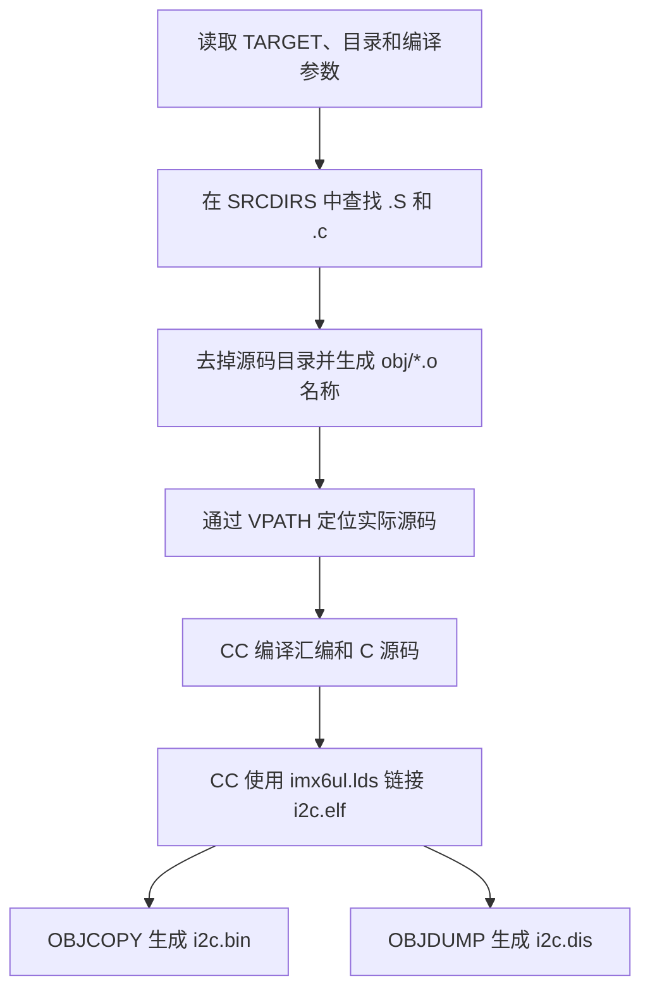

# 67-i2c Makefile 编译流程

## 1. 文档目的

本文分析 `67-i2c/Makefile` 如何收集源码、编译目标文件、链接裸机镜像并生成下载文件。
文档内容对应当前工程实现，不改变任何编译逻辑。

Makefile 的最终目标是生成以下文件：

| 文件 | 用途 |
| --- | --- |
| `i2c.elf` | 包含段和符号信息的 ARM ELF 文件 |
| `i2c.bin` | 用于构造启动镜像的纯二进制程序 |
| `i2c.dis` | 从 ELF 生成的 ARM 反汇编文件 |

## 2. 使用方式

Makefile 不读取配置文件，也不调用环境初始化脚本。它直接使用调用环境提供的
`CC`、`OBJCOPY` 和 `OBJDUMP` 等工具变量。

项目统一环境可以这样准备：

```bash
cd /home/gs/code/i.MX6UL
source tools/envsetup.sh
make -C baremetal/67-i2c
```

也可以由调用方通过其他方式提供等价的工具变量：

```bash
CC=/path/to/arm-linux-gnueabihf-gcc \
OBJCOPY=/path/to/arm-linux-gnueabihf-objcopy \
OBJDUMP=/path/to/arm-linux-gnueabihf-objdump \
make -C baremetal/67-i2c
```

清理构建产物：

```bash
make -C baremetal/67-i2c clean
```

## 3. 总体编译流程



当前工程共收集：

- 2 个 `.S` 汇编文件；
- 23 个 `.c` 文件；
- 合计生成 25 个 `obj/*.o` 目标文件。

## 4. 目标名称

```makefile
TARGET ?= i2c
```

`?=` 表示仅在调用方没有设置 `TARGET` 时使用默认值 `i2c`。因此默认输出为：

```text
i2c.elf
i2c.bin
i2c.dis
```

调用方可以覆盖目标名称：

```bash
make -C baremetal/67-i2c TARGET=ap3216c_test
```

此时输出文件名称会相应变为 `ap3216c_test.*`，程序内容和链接地址不变。

## 5. 编译和链接参数

### 5.1 CFLAGS

```makefile
CFLAGS := -Wall -Wextra -nostdlib -ffreestanding -fno-builtin -c -O2 \
          -marm -mcpu=cortex-a7 -mfpu=neon-vfpv4 -mfloat-abi=hard
```

各参数含义如下：

| 参数 | 作用 |
| --- | --- |
| `-Wall -Wextra` | 启用常用及扩展编译告警 |
| `-nostdlib` | 不自动使用宿主系统的标准启动文件和标准库 |
| `-ffreestanding` | 按独立运行环境编译，不假设存在完整操作系统和标准 C 运行时 |
| `-fno-builtin` | 不把普通函数调用自动替换为宿主标准库内建实现 |
| `-c` | 只编译或汇编，不在该步骤链接 |
| `-O2` | 使用二级优化 |
| `-marm` | 生成 ARM 指令集代码，而不是 Thumb 代码 |
| `-mcpu=cortex-a7` | 针对 Cortex-A7 处理器生成指令 |
| `-mfpu=neon-vfpv4` | 指定 NEON/VFPv4 浮点单元 |
| `-mfloat-abi=hard` | 使用硬浮点参数传递 ABI |

当前 `project/start.S` 没有显式启用 NEON 和 FPU。现有 I2C 示例不依赖浮点运算；如果
后续加入浮点代码，必须在执行相关指令前正确配置 CPACR 和 FPEXC。所有目标文件仍须
保持相同的 CPU 和浮点 ABI 参数，否则链接或函数调用可能出现 ABI 不匹配。

### 5.2 LDLIBS

```makefile
LDLIBS := -lgcc
```

裸机代码虽然不链接标准 C 库，但编译器仍可能为除法、乘法或类型转换生成 GCC
运行时辅助函数。`-lgcc` 由当前 `CC` 对应的工具链解析，可以避免写死 GCC 版本目录。

## 6. 头文件目录

`INCDIRS` 登记全部头文件搜索目录：

```makefile
INCDIRS := imx6ul \
           stdio/include \
           bsp/clk \
           ... \
           bsp/i2c \
           bsp/ap3216c
```

随后使用 `patsubst` 为每个目录添加 `-I`：

```makefile
INCLUDE := $(patsubst %, -I%, $(INCDIRS))
```

例如：

```text
imx6ul bsp/i2c bsp/ap3216c
```

会转换为：

```text
-Iimx6ul -Ibsp/i2c -Ibsp/ap3216c
```

这些参数只参与源码编译，不直接参与最终链接。

## 7. 源码目录

`SRCDIRS` 描述需要参与构建的源码目录：

```makefile
SRCDIRS := project \
           stdio/lib \
           bsp/clk \
           ... \
           bsp/i2c \
           bsp/ap3216c
```

目录职责如下：

| 目录 | 主要内容 |
| --- | --- |
| `project/` | 启动汇编和应用入口 `main.c` |
| `stdio/lib/` | 精简的字符串、格式化输出及编译器辅助实现 |
| `bsp/clk/` | 系统时钟初始化 |
| `bsp/int/`、`bsp/exit/` | GIC 和外部中断处理 |
| `bsp/epit-timer/`、`bsp/key-filter/` | 定时器和按键消抖 |
| `bsp/uart/` | UART 初始化和字符收发 |
| `bsp/lcd/` | LCD 控制与显示接口 |
| `bsp/rtc/` | RTC 日期和时间处理 |
| `bsp/i2c/` | i.MX6UL I2C 控制器驱动 |
| `bsp/ap3216c/` | 通过 I2C 访问 AP3216C 传感器 |

只有这些目录第一层中的 `.S` 和 `.c` 文件会被 `wildcard` 收集。新增子目录不会自动
递归参与构建，必须同步更新 `SRCDIRS`。

## 8. 源文件收集

```makefile
SFILES := $(foreach dir, $(SRCDIRS), $(wildcard $(dir)/*.S))
CFILES := $(foreach dir, $(SRCDIRS), $(wildcard $(dir)/*.c))
```

处理过程为：

1. `foreach` 依次取出 `SRCDIRS` 中的目录；
2. `wildcard` 查找该目录第一层的 `.S` 或 `.c` 文件；
3. 将所有匹配结果合并到 `SFILES` 和 `CFILES`。

当前汇编源码为：

```text
project/start.S
stdio/lib/lib1funcs.S
```

## 9. 目标文件名称生成

```makefile
SFILENDIR := $(notdir $(SFILES))
CFILENDIR := $(notdir $(CFILES))

SOBJS := $(patsubst %, obj/%, $(SFILENDIR:.S=.o))
COBJS := $(patsubst %, obj/%, $(CFILENDIR:.c=.o))
OBJS := $(SOBJS) $(COBJS)
```

以 `bsp/i2c/bsp_i2c.c` 为例：

```text
bsp/i2c/bsp_i2c.c
        ↓ notdir
bsp_i2c.c
        ↓ 后缀替换
bsp_i2c.o
        ↓ 添加 obj/ 前缀
obj/bsp_i2c.o
```

所有目标文件被扁平放入 `obj/`。因此不同源码目录不能出现同名源码，例如同时存在：

```text
bsp/i2c/device.c
bsp/spi/device.c
```

两者都会映射为 `obj/device.o`，造成目标冲突。新增源码前应检查文件基本名是否唯一。

## 10. VPATH 源码查找

```makefile
VPATH := $(SRCDIRS)
```

目标规则只保留源码文件名，例如 `bsp_i2c.c`，而不携带原始目录。`VPATH` 告诉
`make` 应按 `SRCDIRS` 的顺序到哪些目录查找该文件。

`VPATH` 与扁平目标文件方案相互配合，但也意味着同名文件只会按搜索顺序选择其中
一个，这也是必须避免同名源码的原因。

## 11. 汇编和 C 编译规则

### 11.1 汇编文件

```makefile
$(SOBJS) : obj/%.o : %.S
	@mkdir -p obj
	$(CC) $(CFLAGS) $(INCLUDE) -o $@ $<
```

这是静态模式规则：

- `$@` 表示当前目标，例如 `obj/start.o`；
- `$<` 表示第一个依赖，例如 `project/start.S`；
- `.S` 使用 `CC` 编译，使启动汇编可以使用 C 预处理能力；
- `mkdir -p` 保证首次编译时存在 `obj/`，重复和并行执行也不会报错。

### 11.2 C 文件

```makefile
$(COBJS) : obj/%.o : %.c
	@mkdir -p obj
	$(CC) $(CFLAGS) $(INCLUDE) -o $@ $<
```

该规则与汇编规则使用相同的 CPU、浮点 ABI 和头文件路径，从而保证所有目标文件的
架构属性一致。

## 12. 链接和产物转换

默认目标为：

```makefile
all: $(TARGET).bin
```

`i2c.bin` 依赖全部目标文件：

```makefile
$(TARGET).bin: $(OBJS)
	$(CC) -nostdlib -Timx6ul.lds -o $(TARGET).elf $^ $(LDLIBS)
	$(OBJCOPY) -O binary -S $(TARGET).elf $@
	$(OBJDUMP) -D -m arm $(TARGET).elf > $(TARGET).dis
```

其中：

- `$^` 表示全部目标文件依赖；
- 使用 `CC` 驱动链接，使 `-lgcc` 能从当前交叉工具链中正确解析；
- `-nostdlib` 阻止链接宿主启动文件和标准库；
- `-Timx6ul.lds` 指定裸机链接脚本；
- `OBJCOPY -O binary -S` 从 ELF 提取纯二进制镜像；
- `OBJDUMP -D -m arm` 对 ELF 的全部可反汇编段生成 ARM 反汇编结果。

## 13. 链接脚本关系

`imx6ul.lds` 指定入口和内存布局：

```text
ENTRY(_start)
加载地址：0x87800000
段顺序：.text → .rodata → .data → .bss
```

链接脚本还导出 `__bss_start` 和 `__bss_end`。`project/start.S` 在进入 `main()` 前使用
这两个符号清零 BSS，因此链接脚本和启动汇编必须配套修改。

## 14. clean 规则

```makefile
clean:
	rm -rf $(TARGET).elf $(TARGET).dis $(TARGET).bin $(COBJS) $(SOBJS)
```

该规则删除当前 `TARGET` 对应的三个输出文件和 Makefile 计算出的目标文件，但保留空的
`obj/` 目录。构建规则使用 `mkdir -p`，因此目录存在或不存在都不影响下次编译。

## 15. 增量构建限制

当前 Makefile 没有使用 `-MMD -MP` 生成头文件依赖文件。因此：

- 修改 `.c` 或 `.S` 文件会重新编译对应目标；
- 修改 `.h` 文件后，`make` 不一定知道哪些目标需要重新编译；
- 修改公共头文件后应执行一次干净构建。

推荐命令：

```bash
make -C baremetal/67-i2c clean
make -C baremetal/67-i2c
```

## 16. 修改 Makefile 时的检查项

新增或调整源码时应确认：

1. 新目录是否已同时加入 `INCDIRS` 和 `SRCDIRS`；
2. 新源码是否位于登记目录的第一层；
3. 新源码文件名是否与其他目录中的文件重名；
4. 新增目标是否保持 Cortex-A7 和硬浮点 ABI 一致；
5. 是否仍使用 `CC` 完成最终链接并保留 `-lgcc`；
6. 链接地址是否继续与下载工具和启动介质布局一致；
7. 修改头文件后是否执行了干净构建。

## 17. 结论

该 Makefile 采用“目录列表收集源码、扁平化目标文件、`VPATH` 查找源码、编译器驱动
链接”的构建方式。结构直观，适合当前规模的裸机示例。维护时最需要注意的是同名源码
冲突、非递归源码收集以及缺少头文件自动依赖这三个限制。
