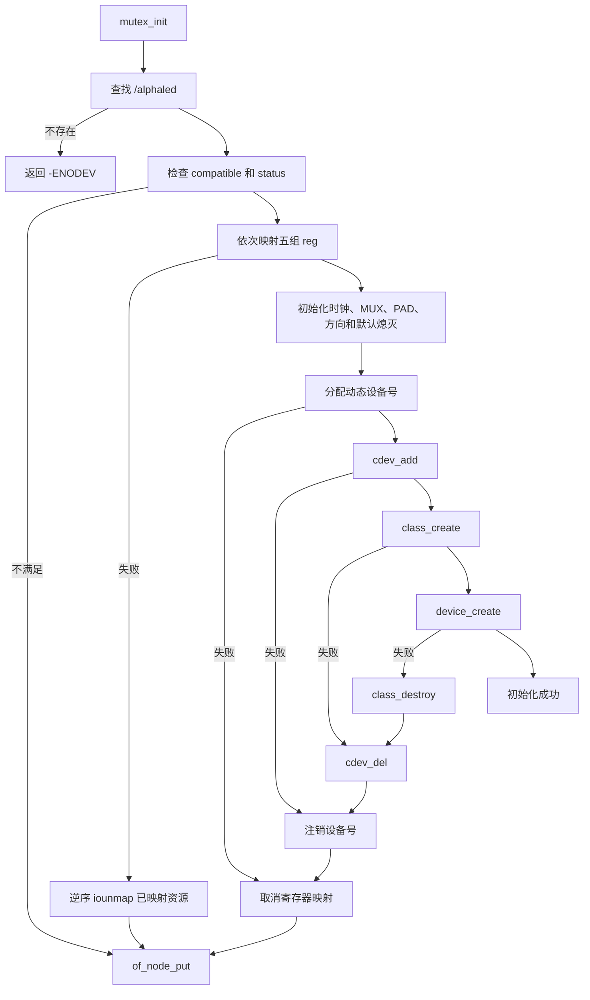
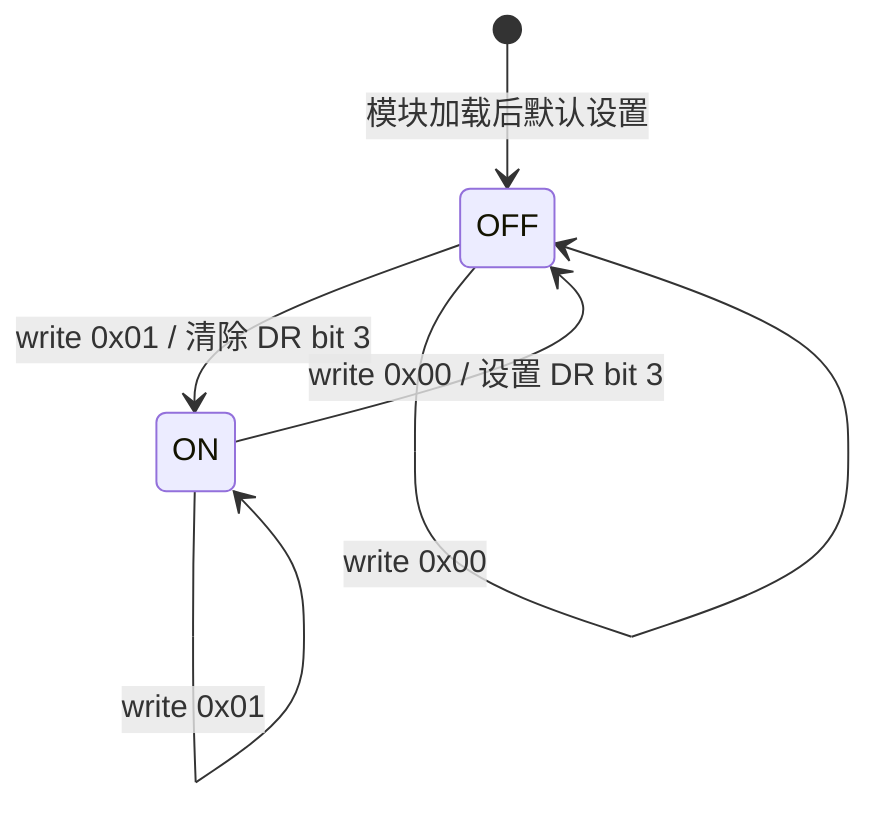

# `dtsled.c` 详细设计

## 1. 文档目的

本文描述 `dtsled.c` 的软件结构、设备树契约、字符设备接口、硬件初始化、
并发控制、资源生命周期和错误处理，为代码维护、板级适配和目标板验证提供依据。

本文以当前工程源码为准，分析范围包括：

- 驱动源码：`drivers/11-dts-led/dtsled.c`；
- 用户态测试程序：`drivers/11-dts-led/app/dtsled_test.c`；
- 模块构建文件：`drivers/11-dts-led/Makefile`；
- 设备树节点：`kernel/arch/arm/boot/dts/imx6ull-14x14-evk.dts` 和
  `kernel/arch/arm/boot/dts/imx6ull-alientek-emmc.dts` 中的 `/alphaled`。

## 2. 设计目标与边界

### 2.1 设计目标

驱动完成以下工作：

1. 按绝对路径查找设备树根节点 `/alphaled`；
2. 从节点的 `reg` 属性映射五组 SoC 寄存器；
3. 使能 GPIO1 时钟并将 GPIO1_IO03 配置为 GPIO 输出；
4. 注册一个动态设备号的字符设备并创建 `/dev/dtsled`；
5. 通过单字节读写接口控制和查询低电平有效 LED；
6. 在初始化失败或模块卸载时释放已申请资源。

### 2.2 设计边界

当前实现是板级教学驱动，不是 Linux GPIO、pinctrl、clock 和 platform driver
框架下的通用 LED 驱动。它直接访问 i.MX6ULL 寄存器，具有以下边界：

- 只管理 GPIO1_IO03 上的一个 LED；
- 只接受固定路径 `/alphaled`，不通过 `of_match_table` 自动匹配设备；
- `reg` 资源的数量和顺序属于驱动与设备树之间的固定契约；
- 不申请 GPIO descriptor，无法由 GPIO 子系统检测引脚占用冲突；
- 不保存和恢复加载前的时钟、MUX、PAD、方向及输出寄存器状态；
- 不提供 `ioctl`、`poll`、异步通知或 LED class 接口。

## 3. 总体架构

```mermaid
flowchart LR
    APP[用户态程序] -->|open/read/write| VFS[VFS 字符设备层]
    VFS --> FOPS[dtsled_fops]
    FOPS --> CORE[状态读写逻辑]
    CORE --> MMIO[readl/writel]
    DT[/设备树 /alphaled/] -->|of_find_node_by_path| INIT[模块初始化]
    DT -->|of_iomap × 5| MMIO
    INIT --> CDEV[cdev 与设备号]
    INIT --> SYSFS[class 和 device]
    SYSFS --> DEV[/dev/dtsled]
    MMIO --> HW[GPIO1_IO03 低电平有效 LED]
```

驱动使用单个静态全局对象 `dtsled` 保存全部状态。字符设备的 `open` 回调通过
`inode->i_cdev` 找回该对象，并存入 `filp->private_data`，后续 `read` 和 `write`
不再进行全局查找。

## 4. 设备树接口设计

### 4.1 节点约束

驱动要求运行中设备树满足以下条件：

| 项目 | 要求 | 检查方式 |
| --- | --- | --- |
| 节点路径 | `/alphaled` | `of_find_node_by_path()` |
| `compatible` | `atkalpha-led` | `of_device_is_compatible()` |
| `status` | 可用，通常为 `okay` | `of_device_is_available()` |
| `reg` 数量 | 至少五组可映射资源 | 五次 `of_iomap()` |
| 单组长度 | 当前设备树均为 4 字节 | 由设备树 `reg` 描述 |

参考节点如下：

```dts
alphaled {
	#address-cells = <1>;
	#size-cells = <1>;
	compatible = "atkalpha-led";
	status = "okay";
	reg = <0x020c406c 0x04
	       0x020e0068 0x04
	       0x020e02f4 0x04
	       0x0209c000 0x04
	       0x0209c004 0x04>;
};
```

### 4.2 `reg` 索引契约

`enum dtsled_register` 的枚举顺序必须与设备树中的资源顺序完全一致：

| 索引 | 枚举值 | 物理地址 | 寄存器用途 |
| ---: | --- | --- | --- |
| 0 | `DTSLED_REG_CCM_CCGR1` | `0x020c406c` | GPIO1 模块时钟门控 |
| 1 | `DTSLED_REG_SW_MUX_GPIO1_IO03` | `0x020e0068` | GPIO1_IO03 MUX 模式 |
| 2 | `DTSLED_REG_SW_PAD_GPIO1_IO03` | `0x020e02f4` | GPIO1_IO03 PAD 电气配置 |
| 3 | `DTSLED_REG_GPIO1_DR` | `0x0209c000` | GPIO1 输出数据 |
| 4 | `DTSLED_REG_GPIO1_GDIR` | `0x0209c004` | GPIO1 引脚方向 |

驱动没有使用 `reg-names`，因此改变资源顺序会导致寄存器被错误解释，即使所有
地址本身都有效。

## 5. 核心数据结构

`struct dtsled_device` 是驱动的唯一设备实例：

| 成员 | 类型 | 作用与生命周期 |
| --- | --- | --- |
| `devid` | `dev_t` | `alloc_chrdev_region()` 分配，退出时注销 |
| `cdev` | `struct cdev` | 关联 `dtsled_fops`，加入 VFS 字符设备模型 |
| `class` | `struct class *` | 创建 `/sys/class/dtsled` |
| `device` | `struct device *` | 创建 sysfs 设备并触发 `/dev/dtsled` 节点创建 |
| `node` | `struct device_node *` | 持有 `/alphaled` 的引用，退出或失败时释放 |
| `regs` | `void __iomem *[5]` | 保存五组寄存器的虚拟地址 |
| `lock` | `struct mutex` | 串行化 GPIO1_DR 的状态读取和读改写 |

对象采用静态存储期，初始内容为零。该特性使部分映射失败时，
`dtsled_unmap_registers()` 能通过空指针判断哪些资源已经成功映射。

## 6. 常量与硬件语义

| 常量 | 值 | 设计含义 |
| --- | ---: | --- |
| `DTSLED_COUNT` | 1 | 仅注册一个次设备号 |
| `LED_OFF` | 0 | 用户态协议中的熄灭状态 |
| `LED_ON` | 1 | 用户态协议中的点亮状态 |
| `GPIO1_IO03_MASK` | `BIT(3)` | GPIO1_IO03 对应 DR/GDIR 的 bit 3 |
| `CCM_CCGR1_GPIO1_SHIFT` | 26 | GPIO1 时钟门控字段起始位 |
| `CCM_CCGR1_GPIO1_ENABLE` | `3 << 26` | 将 GPIO1 时钟配置为所有模式开启 |
| `GPIO1_IO03_MUX_MODE` | 5 | 将引脚复用为 GPIO 功能 |
| `GPIO1_IO03_PAD_CONFIG` | `0x10b0` | 写入当前板级 PAD 配置值 |

LED 为低电平有效：GPIO 数据位为 0 时点亮，为 1 时熄灭。因此用户态逻辑状态
与 GPIO1_DR bit 3 的电平编码相反。

## 7. 模块初始化设计

### 7.1 初始化流程



### 7.2 硬件初始化顺序

`dtsled_hw_init()` 按以下顺序配置硬件：

1. 对 `CCM_CCGR1` 执行读改写，将 bit 27:26 设置为 `0b11`；
2. 将 `SW_MUX_GPIO1_IO03` 写为 `5`，选择 GPIO 功能；
3. 将 `SW_PAD_GPIO1_IO03` 写为 `0x10b0`；
4. 对 `GPIO1_GDIR` 执行读改写，将 bit 3 置 1，配置为输出；
5. 在互斥锁保护下调用 `dtsled_set_state(LED_OFF)`，将 `GPIO1_DR` bit 3 置 1，
   使 LED 默认熄灭。

此流程先设置方向、后设置默认输出状态，可能在加载瞬间出现短暂电平变化；本文
仅记录当前实现，不将其解释为额外的无毛刺保证。

### 7.3 字符设备注册

驱动使用 `alloc_chrdev_region()` 动态分配主设备号，次设备号从 0 开始且数量为
1。`cdev_init()` 将对象关联到 `dtsled_fops`，`cdev_add()` 使 VFS 可以分派文件
操作。随后创建名为 `dtsled` 的 class 和 device，目标系统的设备管理机制据此
创建 `/dev/dtsled`。

## 8. 文件操作接口设计

### 8.1 操作集合

| VFS 操作 | 驱动函数 | 行为 |
| --- | --- | --- |
| `open` | `dtsled_open()` | 设置 `filp->private_data` |
| `read` | `dtsled_read()` | 返回一个当前逻辑状态字节 |
| `write` | `dtsled_write()` | 使用首字节设置 LED 状态 |
| `llseek` | `no_llseek` | 不允许定位文件偏移 |

`.owner = THIS_MODULE` 用于在文件操作期间维持模块引用，避免设备仍被打开时模块
代码被卸载。

### 8.2 `open` 设计

`dtsled_open()` 使用 `container_of(inode->i_cdev, struct dtsled_device, cdev)`
取得包含 `cdev` 的设备对象，并写入 `filp->private_data`。函数不申请每文件资源，
没有对应的 `release` 回调，也不限制并发打开次数。

### 8.3 `read` 设计

读取语义如下：

1. `count == 0` 或 `*offp != 0` 时返回 0；
2. 加锁读取 GPIO1_DR bit 3，并转换为逻辑状态；
3. 解锁后向用户缓冲区复制一个字节；
4. 复制成功后将偏移增加 1，并返回 1；
5. `copy_to_user()` 失败时返回 `-EFAULT`，且文件偏移保持不变。

因此，每个新打开的文件描述符只产生一次一字节数据；第二次读取返回 EOF。读取
的是 GPIO1_DR 的当前数据位，不是驱动单独缓存的软件状态。

### 8.4 `write` 设计

写入语义如下：

1. `count < 1` 时返回 `-EINVAL`；
2. 只复制并解释用户缓冲区的第一个字节；
3. 字节不是 `LED_OFF` 或 `LED_ON` 时返回 `-EINVAL`；
4. 加锁执行 GPIO1_DR 读改写，然后解锁；
5. 成功时返回 1，即使调用方提供的 `count` 大于 1。

`write` 不使用文件偏移，连续写入同一个文件描述符仍会执行。由于成功返回值只为
1，提供多字节缓冲区的调用方会观察到短写，应按单字节协议调用。

### 8.5 用户态二进制协议

| 方向 | 数据长度 | 数据值 | 含义 |
| --- | ---: | ---: | --- |
| 用户态到内核 | 1 字节 | `0x00` | 熄灭 LED |
| 用户态到内核 | 1 字节 | `0x01` | 点亮 LED |
| 内核到用户态 | 1 字节 | `0x00` | 当前为熄灭状态 |
| 内核到用户态 | 1 字节 | `0x01` | 当前为点亮状态 |

该接口传输原始二进制字节，不接受 ASCII 字符 `'0'`、`'1'`、`"on"` 或
`"off"`。工程中的 `app/dtsled_test.c` 已按该协议使用 `uint8_t` 调用
`read()` 和 `write()`。

## 9. 并发与调用上下文

### 9.1 互斥范围

`dtsled.lock` 保护 GPIO1_DR 的访问：

- `dtsled_set_state()` 的读改写必须在持锁状态执行；
- `dtsled_get_state()` 的读取也在同一把锁下执行；
- `dtsled_read()` 和 `dtsled_write()` 可以被多个进程并发调用，但对状态寄存器的
  操作被串行化；
- `copy_to_user()` 和 `copy_from_user()` 位于锁外，避免持锁访问用户内存。

互斥锁只能协调本驱动内部访问，不能阻止其他驱动、内核子系统或裸寄存器代码
同时修改 GPIO1_DR。

### 9.2 上下文约束

模块初始化、退出和全部文件操作都在进程上下文执行。`read`、`write` 可能因
mutex 或用户内存访问而睡眠，不可从 IRQ、softirq 或其他原子上下文直接调用。

## 10. 状态转换

驱动不维护独立状态机，逻辑状态由 GPIO1_DR bit 3 直接决定：



| 逻辑状态 | 用户态值 | GPIO1_DR bit 3 | 引脚电平 | LED |
| --- | ---: | ---: | --- | --- |
| `LED_OFF` | 0 | 1 | 高 | 熄灭 |
| `LED_ON` | 1 | 0 | 低 | 点亮 |

## 11. 资源生命周期与错误回滚

### 11.1 正常生命周期

资源申请顺序为：

```text
设备树节点引用
    → 五组寄存器映射
    → 字符设备号
    → cdev
    → class
    → device
```

模块退出时按逆序执行 `device_destroy()`、`class_destroy()`、`cdev_del()`、
`unregister_chrdev_region()`、`iounmap()` 和 `of_node_put()`。

### 11.2 初始化错误处理

| 失败点 | 返回值 | 已申请资源的处理 |
| --- | --- | --- |
| 找不到 `/alphaled` | `-ENODEV` | 无节点引用需要释放 |
| 节点不兼容或不可用 | `-ENODEV` | 释放节点引用 |
| 任一 `of_iomap()` 失败 | `-ENOMEM` | 逆序取消已完成映射，释放节点引用 |
| `alloc_chrdev_region()` 失败 | 原始负错误码 | 取消映射，释放节点引用 |
| `cdev_add()` 失败 | 原始负错误码 | 注销设备号并释放前序资源 |
| `class_create()` 失败 | `PTR_ERR()` | 删除 cdev 并释放前序资源 |
| `device_create()` 失败 | `PTR_ERR()` | 销毁 class、删除 cdev 并释放前序资源 |

`dtsled_map_registers()` 自己负责部分映射失败的回滚；调用者不会重复取消这些
映射。初始化阶段在硬件配置完成后才注册字符设备，因此注册失败时硬件寄存器已被
修改，但错误回滚只取消映射，不恢复修改前的硬件值。

## 12. 函数设计汇总

| 函数 | 输入 | 输出 | 主要职责 |
| --- | --- | --- | --- |
| `dtsled_set_state()` | 设备、逻辑状态 | 无 | 低有效编码并读改写 GPIO1_DR |
| `dtsled_get_state()` | 设备 | `LED_ON/OFF` | 读取 GPIO1_DR 并转换为逻辑状态 |
| `dtsled_open()` | inode、file | 0 | 建立文件到设备对象的关联 |
| `dtsled_read()` | file、用户缓冲区、长度、偏移 | 0、1 或 `-EFAULT` | 单次返回一个状态字节 |
| `dtsled_write()` | file、用户缓冲区、长度、偏移 | 1、`-EINVAL` 或 `-EFAULT` | 校验并设置状态 |
| `dtsled_unmap_registers()` | 设备 | 无 | 逆序取消全部有效映射 |
| `dtsled_map_registers()` | 设备 | 0 或 `-ENOMEM` | 按索引映射五组资源 |
| `dtsled_hw_init()` | 设备 | 无 | 配置 GPIO1_IO03 并默认熄灭 |
| `dtsled_init()` | 无 | 0 或负错误码 | 完成全部模块初始化和失败回滚 |
| `dtsled_exit()` | 无 | 无 | 注销设备并释放全部软件资源 |

## 13. 构建、部署与验证

### 13.1 编译

在 `drivers/11-dts-led/` 执行：

```bash
make modules
make app
```

预期生成内核模块 `dtsled.ko` 和静态链接的 ARM 用户态程序
`app/dtsled_test`。构建依赖 Makefile 指定的 ARM 交叉工具链和内核构建目录。

### 13.2 运行

目标板必须使用包含有效 `/alphaled` 节点的 DTB 启动。部署模块和测试程序后执行：

```bash
insmod dtsled.ko
./app/dtsled_test on
./app/dtsled_test get
./app/dtsled_test off
rmmod dtsled
```

### 13.3 预期结果

- 加载后出现 `/dev/dtsled`，LED 默认熄灭；
- `on` 点亮 LED 并输出 `PASS: LED turned on`；
- 随后的 `get` 输出 `PASS: LED is on`；
- `off` 熄灭 LED 并输出 `PASS: LED turned off`；
- 模块日志包含动态分配的主、次设备号和卸载信息。

## 14. 已知限制与风险

1. GPIO1_IO03 若同时被 `gpio-leds` 或其他驱动使用，双方可能互相覆盖状态；
2. 直接写完整 MUX 和 PAD 寄存器值，不保留这些寄存器原有配置；
3. 卸载和初始化失败路径不恢复加载前的硬件寄存器状态；
4. 驱动依赖 `reg` 位置，不具备 `reg-names` 带来的顺序解耦能力；
5. 全局单实例设计无法直接扩展到多个设备树节点；
6. 状态读取反映 GPIO 数据寄存器，不保证等同于 LED 的实际光学或引脚采样状态；
7. 接口是自定义字符设备二进制协议，不能直接使用标准 LED class 的 sysfs 控制；
8. `read` 受文件偏移控制，同一文件描述符第二次读取返回 EOF；
9. `write` 只消费首字节，多字节写入会返回短写；
10. 实际 LED 动作、DTB 部署和引脚冲突只能在目标板上完成验证。

## 15. 设计结论

`dtsled.c` 以较小的软件结构实现了从设备树寄存器资源到字符设备接口的完整链路。
核心设计是固定五资源映射、低电平有效状态转换、动态字符设备注册以及基于 mutex
的 GPIO1_DR 串行访问。维护时必须优先保持设备树 `reg` 顺序、单字节用户态协议、
资源逆序释放和低有效电平语义一致；如需产品化，应单独评估迁移到 platform、GPIO
descriptor、pinctrl、clock 和 LED class 框架的兼容性与测试范围。
