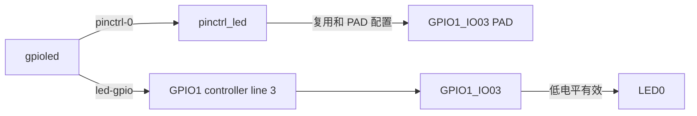

# GPIO LED 设备树修改原理与变更记录

## 1. 文档目的

本文记录 `imx6ull-14x14-evk.dts` 中 GPIO1_IO03 的设备树配置变更，说明
`pinctrl`、GPIO 描述符和引脚冲突处理原理，并记录配套字符设备驱动的实现与
验证状态。

相关文件：

- 设备树：`kernel/arch/arm/boot/dts/imx6ull-14x14-evk.dts`；
- 驱动源码：`drivers/12-gpioled/gpioled.c`；
- 构建文件：`drivers/12-gpioled/Makefile`；
- 文档：`drivers/12-gpioled/docs/other_001_gpioled_device_tree_change.md`。

## 2. GPIO LED 配置原理

### 2.1 PIN 复用与电气属性

在 `&iomuxc` 的 `imx6ul-evk` 子节点中定义：

```dts
pinctrl_led: ledgrp {
	fsl,pins = <
		MX6UL_PAD_GPIO1_IO03__GPIO1_IO03 0x10b0 /* LED0 */
	>;
};
```

`MX6UL_PAD_GPIO1_IO03__GPIO1_IO03` 将 GPIO1_IO03 PAD 复用为 GPIO 功能，
`0x10b0` 是写入 PAD 控制寄存器的板级电气配置值。`pinctrl_led` 是供其他节点
引用的标签，`ledgrp` 是该引脚组的节点名。

### 2.2 LED 设备节点

根节点下新增：

```dts
gpioled {
	#address-cells = <1>;
	#size-cells = <1>;
	compatible = "atkalpha-gpioled";
	pinctrl-names = "default";
	pinctrl-0 = <&pinctrl_led>;
	led-gpio = <&gpio1 3 GPIO_ACTIVE_LOW>;
	status = "okay";
};
```

| 属性 | 作用 |
| --- | --- |
| `compatible` | 供 GPIO LED 驱动识别设备节点 |
| `pinctrl-names` | 声明默认 pinctrl 状态 |
| `pinctrl-0` | 将默认状态关联到 `pinctrl_led` |
| `led-gpio` | 指定 GPIO1_IO03，且 LED 低电平有效 |
| `status` | 使能设备节点 |

GPIO specifier 中 `&gpio1` 表示 GPIO1 控制器，`3` 表示第 3 号 GPIO line，
即 GPIO1_IO03；`GPIO_ACTIVE_LOW` 表示逻辑有效状态对应物理低电平。配套驱动可
读取 `led-gpio`，取得 GPIO 编号并通过 GPIO 子系统 API 申请和控制引脚。

## 3. 引脚冲突检查原理

一个 PAD 在同一时刻只能由一种复用功能控制，同一 GPIO 也不应同时分配给多个
设备。增加 GPIO 节点前必须同时检查：

1. `MX6UL_PAD_GPIO1_IO03` 是否出现在其他 `fsl,pins` 中；
2. `<&gpio1 3 ...>` 是否被其他设备节点引用；
3. 是否存在绕过 GPIO 子系统、直接操作同一寄存器的驱动节点。

否则 pinctrl 状态应用或 GPIO 申请可能失败；即使 GPIO 子系统没有检测到冲突，
多个驱动直接修改同一硬件资源也会造成 LED 状态不可预测。

## 4. 冲突检查结果与处理

### 4.1 原系统 LED

原 `gpio-leds` 节点中的 `led1` 使用 GPIO1_IO03，并通过
`pinctrl_gpio_leds` 配置同一 PAD，会与新 `gpioled` 直接冲突。

本次处理如下：

- 从 `gpio-leds` 的 `pinctrl-0` 中移除 `pinctrl_gpio_leds`；
- 移除使用 GPIO1_IO03 的 `led1` 子节点；
- 保留 `beep` 子节点和 `pinctrl_beep`，避免影响蜂鸣器。

修改后不再提供原 `sys-led` heartbeat 功能，GPIO1_IO03 改由 `gpioled` 使用。

### 4.2 TSC 配置

`pinctrl_tsc` 原来同时配置 GPIO1_IO01、GPIO1_IO02、GPIO1_IO03 和
GPIO1_IO04，`&tsc` 还使用 `xnur-gpio = <&gpio1 3 GPIO_ACTIVE_LOW>`。

本次从 `pinctrl_tsc` 删除 GPIO1_IO03，并删除 `&tsc` 的 `xnur-gpio` 属性；
其余 TSC PIN 配置予以保留，原有 `status = "disabled"` 不变。如果以后启用
TSC，必须重新选择无冲突的 `xnur-gpio` 并补全硬件配置。

### 4.3 旧 `alphaled` 节点

上一实验的 `/alphaled` 节点描述 GPIO1_IO03 相关物理寄存器，`dtsled.c` 会
直接映射并修改这些寄存器。它不通过 GPIO 子系统申请引脚，但加载旧模块后仍会与
新驱动竞争。

本次将 `/alphaled` 的 `status` 从 `okay` 改为 `disabled`，使旧模块的节点
可用性检查失败，避免两个实验驱动同时控制 GPIO1_IO03。节点及其寄存器信息保留，
便于追溯上一实验配置。

## 5. 变更记录

| 序号 | 位置 | 修改前 | 修改后 | 原因 |
| ---: | --- | --- | --- | --- |
| 1 | 根节点 | 无 `gpioled` | 新增 `gpioled` 节点 | 描述新 GPIO LED 设备 |
| 2 | `&iomuxc/imx6ul-evk` | `pinctrl_gpio_leds`，PAD 值 `0x17059` | `pinctrl_led: ledgrp`，PAD 值 `0x10b0` | 按实验要求配置引脚 |
| 3 | `gpio-leds` | `led1` 占用 GPIO1_IO03 | 移除 `led1` 及其 pinctrl 引用 | 避免 GPIO 和 pinctrl 冲突 |
| 4 | `pinctrl_tsc` | 包含 GPIO1_IO03 | 移除 GPIO1_IO03 | 避免 PAD 重复配置 |
| 5 | `&tsc` | `xnur-gpio` 使用 GPIO1_IO03 | 移除该属性 | 避免 GPIO 重复占用 |
| 6 | `/alphaled` | `status = "okay"` | `status = "disabled"` | 避免旧裸寄存器驱动竞争 |

## 6. 修改后的资源关系



## 7. 验证方法

### 7.1 静态冲突检查

```bash
cd /home/gs/code/i.MX6UL/kernel
rg -n 'MX6UL_PAD_GPIO1_IO03|gpio1[[:space:]]+3' \
	arch/arm/boot/dts/imx6ull-14x14-evk.dts
```

有效配置中应只剩 `pinctrl_led` 和 `gpioled` 对 GPIO1_IO03 的配套引用。

### 7.2 设备树编译

使用项目实际构建流程重新生成目标 DTB：

```bash
cd /home/gs/code/i.MX6UL/kernel
./build_all.sh
```

编译后应反编译实际部署的 DTB，确认 `gpioled`、`pinctrl_led`、
`atkalpha-gpioled` 和 `led-gpio` 均存在。

### 7.3 目标板验证

更新 DTB 并重启后执行：

```bash
test -d /proc/device-tree/gpioled && echo "PASS" || echo "FAIL"
tr -d '\000' </proc/device-tree/gpioled/compatible
```

预期 compatible 输出 `atkalpha-gpioled`。加载配套驱动后，还应验证 GPIO 申请
成功、LED 开关与实际电平一致，并确认日志没有 pinctrl 或 GPIO 占用冲突。

## 8. 已知影响与限制

- 原 `sys-led` heartbeat 功能被移除；
- TSC 的 `xnur-gpio` 被移除，TSC 继续保持禁用；
- 旧 `dtsled` 实验节点被禁用，旧模块不能与新配置同时使用；
- DTB 是否生效取决于编译、烧写位置和 bootloader 启动配置；
- LED 电气行为和 GPIO 申请结果仍需在目标板验证。

## 9. 本次验证记录

### 9.1 静态检查

已执行 GPIO1_IO03 全文件检索。有效配置中只保留：

- `pinctrl_led` 中的 `MX6UL_PAD_GPIO1_IO03__GPIO1_IO03 0x10b0`；
- `gpioled` 中的 `led-gpio = <&gpio1 3 GPIO_ACTIVE_LOW>`。

已执行 `git diff --check`，未发现空白错误。

### 9.2 DTS 独立编译

使用 C 预处理器展开
`imx6ull-14x14-nand-4.3-800x480-c.dts`，再使用内核源码树中的 `dtc`
生成临时 DTB，编译成功。反编译结果确认：

- `ledgrp` 的 PAD 配置值为 `0x10b0`；
- `gpioled` 的 `compatible` 为 `atkalpha-gpioled`；
- `gpioled` 的状态为 `okay`；
- `led-gpio` 指向 GPIO1 line 3，并携带 active-low 标志；
- `alphaled` 的状态为 `disabled`。

### 9.3 全量构建限制

已实际执行 `./build_all.sh`，但在脚本的 `make distclean` 阶段失败。首个问题是
`.tmp_versions/*.mod` 属于其他用户，当前用户无权删除。随后尝试直接构建目标 DTB，
又因 `scripts/mod/elfconfig.h` 属于 `nobody:nogroup` 且不可写而失败。这是内核构建
树既有的文件所有权问题，不是本次 DTS 语法错误。

因此，本次已完成 DTS 独立编译验证，但未完成全量内核构建和目标板运行验证。

### 9.4 驱动模块编译

已在 `drivers/12-gpioled/` 执行：

```bash
make modules
```

`gpioled.c` 已完成交叉编译、MODPOST 和模块链接，成功生成 `gpioled.ko`，编译
过程中未输出警告。该结果证明源码与当前内核构建接口兼容，不代表已完成目标板
GPIO 和 LED 动作验证。
