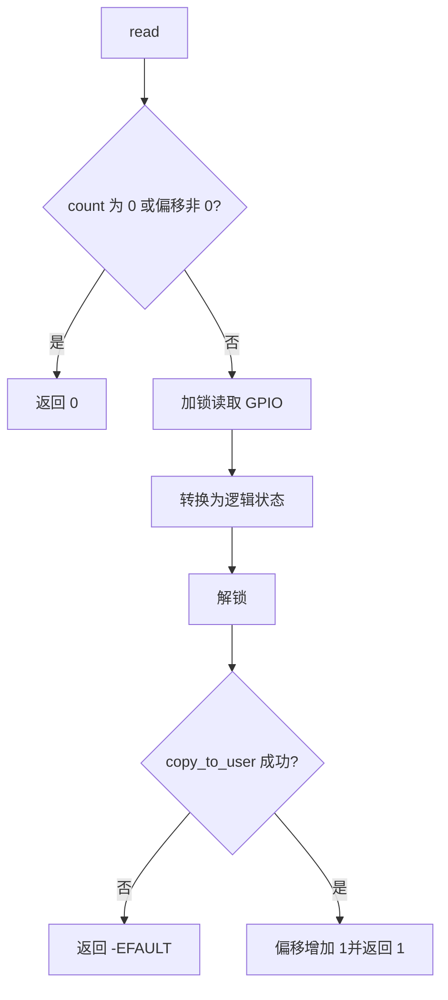
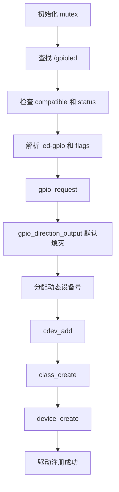

# GPIO LED 驱动详细设计

## 1. 文档目的

本文描述 `drivers/12-gpioled` 的设备树接口、内核驱动、字符设备协议、用户态
测试程序、资源生命周期、并发控制和验证方法，为代码维护与目标板调试提供依据。

本文以当前实现为准，涉及：

- `kernel/arch/arm/boot/dts/imx6ull-14x14-evk.dts`；
- `drivers/12-gpioled/gpioled.c`；
- `drivers/12-gpioled/app/gpioled_test.c`；
- 内核模块和用户态程序各自的 Makefile。

## 2. 设计目标与边界

### 2.1 设计目标

系统通过设备树描述 GPIO1_IO03 上的低电平有效 LED，由内核模块提供
`/dev/gpioled` 字符设备，并由独立用户态程序完成以下操作：

- 写入 `1` 点亮 LED；
- 写入 `0` 熄灭 LED；
- 读取当前 LED 逻辑状态；
- 在初始化失败或模块卸载时完整释放资源。

### 2.2 设计边界

- 驱动只支持设备树绝对路径 `/gpioled` 对应的单个 LED；
- 用户接口为自定义单字节二进制协议，不是 Linux LED class 接口；
- 驱动使用 Linux 传统整数 GPIO API，以兼容当前 Linux 4.1 内核；
- GPIO 有效电平取自设备树，不在驱动中固定为低电平；
- 不提供 `ioctl`、`poll`、异步通知和亮度调节；
- 实际引脚电平与 LED 光学状态需要在目标板验证。

## 3. 总体架构

```mermaid
flowchart LR
    APP[gpioled_test] -->|open/read/write| DEV[/dev/gpioled]
    DEV --> VFS[VFS 字符设备层]
    VFS --> FOPS[gpioled_fops]
    FOPS --> CORE[LED 状态转换]
    CORE --> GPIOAPI[Linux GPIO API]
    DT[/gpioled 设备树节点/] -->|led-gpio| GPIOAPI
    DT -->|pinctrl-0| PINCTRL[pinctrl_led]
    PINCTRL --> PAD[GPIO1_IO03 PAD]
    GPIOAPI --> LED[低电平有效 LED0]
```

设备树负责描述硬件资源和有效电平；驱动负责资源申请、状态控制和字符设备接口；
用户态程序负责构造协议数据并验证系统调用结果。内核态与用户态分别构建，互不混合
编译规则。

## 4. 设备树设计

### 4.1 PIN 配置

`pinctrl_led` 位于 `&iomuxc/imx6ul-evk` 下：

```dts
pinctrl_led: ledgrp {
	fsl,pins = <
		MX6UL_PAD_GPIO1_IO03__GPIO1_IO03 0x10b0 /* LED0 */
	>;
};
```

该配置将 PAD 复用为 GPIO1_IO03，并使用 `0x10b0` 配置电气属性。

### 4.2 设备节点

```dts
gpioled {
	#address-cells = <1>;
	#size-cells = <1>;
	compatible = "atkalpha-gpioled";
	pinctrl-names = "default";
	pinctrl-0 = <&pinctrl_led>;
	led-gpio = <&gpio1 3 GPIO_ACTIVE_LOW>;
	status = "okay";
};
```

| 属性 | 驱动要求 | 用途 |
| --- | --- | --- |
| 节点路径 | `/gpioled` | `of_find_node_by_path()` 的查找目标 |
| `compatible` | `atkalpha-gpioled` | 防止错误节点被驱动使用 |
| `status` | 可用 | 禁用节点时拒绝加载驱动 |
| `pinctrl-0` | `pinctrl_led` | 应用 GPIO1_IO03 的复用和 PAD 配置 |
| `led-gpio` | 一个 GPIO specifier | 提供 GPIO 编号和 active-low 标志 |

### 4.3 冲突规避

GPIO1_IO03 原有占用已按以下方式处理：

- 移除 `gpio-leds` 中的 `sys-led` 及旧 pinctrl 引用；
- 从 `pinctrl_tsc` 中移除 GPIO1_IO03；
- 从禁用的 `&tsc` 中移除 `xnur-gpio`；
- 将直接操作同一组寄存器的 `/alphaled` 节点设为 `disabled`。

因此，有效设备树配置中只有 `pinctrl_led` 和 `gpioled` 配套使用 GPIO1_IO03。

## 5. 内核驱动数据设计

### 5.1 常量

| 常量 | 值 | 含义 |
| --- | --- | --- |
| `GPIOLED_COUNT` | 1 | 申请一个字符设备号 |
| `GPIOLED_NAME` | `gpioled` | 模块资源、class 和 device 名称 |
| `GPIOLED_NODE_PATH` | `/gpioled` | 设备树绝对路径 |
| `GPIOLED_GPIO_PROPERTY` | `led-gpio` | GPIO 属性名 |
| `LED_OFF` | 0 | 熄灭的逻辑状态 |
| `LED_ON` | 1 | 点亮的逻辑状态 |

### 5.2 设备对象

`struct gpioled_device` 是静态单实例对象：

| 成员 | 作用 | 生命周期 |
| --- | --- | --- |
| `devid` | 动态字符设备号 | 初始化时分配，退出时注销 |
| `cdev` | VFS 字符设备对象 | `cdev_add()` 后生效 |
| `class` | sysfs class | 用于组织设备节点 |
| `device` | sysfs device | 触发创建设备文件 `/dev/gpioled` |
| `node` | 设备树节点引用 | 查找成功后持有，退出或失败时释放 |
| `gpio` | Linux GPIO 编号 | 从 `led-gpio` 解析得到 |
| `active_low` | 有效电平标志 | 从 OF GPIO flags 解析得到 |
| `lock` | 互斥锁 | 串行化 LED 状态读取和修改 |

`open` 通过 `inode->i_cdev` 和 `container_of()` 找到设备对象，将其存入
`filp->private_data`，后续文件操作不依赖全局查找。

## 6. 状态控制设计

### 6.1 逻辑状态与物理电平

`gpioled_set_state()` 根据 `active_low` 完成逻辑值到 GPIO 物理值的转换。
当前设备树使用 `GPIO_ACTIVE_LOW`，关系如下：

| 用户态值 | 逻辑状态 | GPIO 电平 | LED 状态 |
| ---: | --- | ---: | --- |
| 0 | `LED_OFF` | 1 | 熄灭 |
| 1 | `LED_ON` | 0 | 点亮 |

若设备树改为 active-high，转换函数会自动使用相反的物理输出关系，无需修改用户态
协议。

### 6.2 状态读取

`gpioled_get_state()` 通过 `gpio_get_value()` 读取 GPIO 数据值，然后结合
`active_low` 转换为 `LED_ON` 或 `LED_OFF`。该值反映 GPIO 控制器数据状态，
不构成对引脚电压或 LED 发光状态的物理测量。

## 7. 字符设备接口

### 7.1 文件操作

| 操作 | 回调 | 设计行为 |
| --- | --- | --- |
| `open` | `gpioled_open()` | 建立 file 到设备对象的关联 |
| `read` | `gpioled_read()` | 返回一个当前逻辑状态字节 |
| `write` | `gpioled_write()` | 校验并应用一个状态字节 |
| `llseek` | `no_llseek` | 禁止文件定位 |

`.owner = THIS_MODULE` 保证文件操作期间维持模块引用。驱动不分配每文件资源，
因此不需要独立的 `release` 回调。

### 7.2 读取流程



每个新打开的文件描述符只返回一次一字节数据，后续读取因文件偏移非零而返回 EOF。

### 7.3 写入流程

`write` 要求 `count >= 1`，只读取用户缓冲区首字节：

1. 长度不足返回 `-EINVAL`；
2. `copy_from_user()` 失败返回 `-EFAULT`；
3. 状态不是 0 或 1 时返回 `-EINVAL`；
4. 加锁、设置 GPIO、解锁；
5. 成功返回 1。

即使用户提供多字节数据，驱动也只消费首字节并返回 1，因此调用方应始终使用
单字节写入。

### 7.4 二进制协议

| 方向 | 长度 | 值 | 含义 |
| --- | ---: | ---: | --- |
| 用户态到驱动 | 1 字节 | `0x00` | 熄灭 LED |
| 用户态到驱动 | 1 字节 | `0x01` | 点亮 LED |
| 驱动到用户态 | 1 字节 | `0x00` | 当前为熄灭状态 |
| 驱动到用户态 | 1 字节 | `0x01` | 当前为点亮状态 |

协议不接受 ASCII 字符 `'0'`、`'1'`、`"on"` 或 `"off"`。

## 8. 初始化与错误回滚

### 8.1 初始化流程



GPIO 方向设置时直接传入无效电平，使引脚成为输出后保持默认熄灭状态。

### 8.2 资源申请顺序

```text
设备树节点引用
    → GPIO
    → 字符设备号
    → cdev
    → class
    → device
```

错误路径通过标签按相反顺序释放已成功申请的资源。主要错误包括：

| 失败位置 | 返回值 | 回滚行为 |
| --- | --- | --- |
| 节点不存在 | `-ENODEV` | 无需释放节点 |
| 节点不兼容或不可用 | `-ENODEV` | 释放节点引用 |
| GPIO 解析失败 | OF/GPIO 原始错误码 | 释放节点引用 |
| GPIO 申请或方向配置失败 | GPIO API 原始错误码 | 释放 GPIO 和节点引用 |
| 设备号、cdev、class、device 失败 | 原始负错误码 | 逆序释放全部前序资源 |

### 8.3 模块退出

退出时先移除 device、class、cdev 和设备号，使新的用户态访问不再进入驱动；随后
在锁内将 LED 设置为熄灭，最后释放 GPIO 和设备树节点引用。

## 9. 并发与调用上下文

`gpioled.lock` 同时保护读取和设置操作，保证多个进程并发访问 `/dev/gpioled`
时 GPIO 状态操作按顺序执行。用户内存复制位于锁外，避免持锁执行可能缺页的操作。

文件操作、模块初始化和退出均在进程上下文运行。`read` 和 `write` 可能因 mutex
或用户内存访问睡眠，不可从 hardirq、softirq 或其他原子上下文直接调用。

互斥锁只协调本驱动内部访问，设备树层面仍必须确保 GPIO1_IO03 不被其他驱动占用。

## 10. 用户态测试程序

### 10.1 命令接口

```text
gpioled_test <on|off|get> [device]
```

默认设备为 `/dev/gpioled`，第二个参数可覆盖设备路径。

| 命令 | 系统调用 | 成功输出 |
| --- | --- | --- |
| `on` | 写入 `uint8_t 1` | `PASS: LED turned on` |
| `off` | 写入 `uint8_t 0` | `PASS: LED turned off` |
| `get` | 读取一个 `uint8_t` | `PASS: LED is on/off` |

程序检查 `open()`、`read()`、`write()` 和 `close()` 的返回值；短读、短写或非法
状态均判定为失败，错误信息输出到标准错误，进程返回非零状态。

### 10.2 构建分离

根 Makefile 只负责任务转发：

- `make modules` 调用内核构建系统生成 `gpioled.ko`；
- `make app` 进入 `app/`，由独立 Makefile 生成静态链接的 `gpioled_test`；
- `make` 依次完成以上两项；
- `make clean` 分别清理内核模块和用户态产物。

## 11. 编译与运行

### 11.1 编译

```bash
cd /home/gs/code/i.MX6UL/drivers/12-gpioled
make modules
make app
```

预期产物：

```text
gpioled.ko
app/gpioled_test
```

### 11.2 目标板运行

目标板使用更新后的 DTB 启动后执行：

```bash
insmod gpioled.ko
./gpioled_test on
./gpioled_test get
./gpioled_test off
rmmod gpioled
```

## 12. 验证结果

已实际完成：

- 目标 NAND DTS 经 C 预处理和 `dtc` 独立编译成功；
- 反编译 DTB 确认 `gpioled`、`pinctrl_led`、`led-gpio` 和 active-low 标志；
- `make modules` 成功生成 ARM 32-bit EABI5 `gpioled.ko`，无编译警告；
- `make app` 成功生成 ARM 32-bit EABI5 静态程序 `gpioled_test`，无编译警告；
- `git diff --check` 通过。

尚未完成目标板模块加载、GPIO 申请和实际 LED 动作验证。全量内核构建仍受内核树
既有的 `.tmp_versions` 与 `scripts/mod/elfconfig.h` 文件所有权问题影响，但该问题
不阻碍独立 DTS 编译和外部模块编译。

## 13. 已知限制

1. 仅支持单个 `/gpioled` 实例；
2. 使用固定节点路径，不是基于 `of_match_table` 的 platform driver；
3. 使用传统整数 GPIO API，只适配当前内核工程；
4. 自定义属性名为 `led-gpio`，不是标准 LED binding；
5. 每个文件描述符只能读取一次状态，后续读取返回 EOF；
6. 多字节写入只消费首字节并返回 1；
7. 不提供亮度、触发器和电源管理功能；
8. 原系统 `sys-led` heartbeat 功能已被移除；
9. TSC 继续禁用，若重新启用必须重新配置其 `xnur-gpio`；
10. 目标板 DTB 部署与硬件动作仍需实际验证。

## 14. 设计结论

本实现建立了设备树、GPIO 子系统、字符设备和用户态测试程序之间的完整控制链路。
关键约束是 GPIO1_IO03 的独占性、active-low 逻辑转换、单字节协议和资源逆序释放。
后续若扩展为产品驱动，应评估 platform driver、GPIO descriptor、标准 LED class、
电源管理以及多实例支持，并同步调整设备树 binding 和测试范围。
