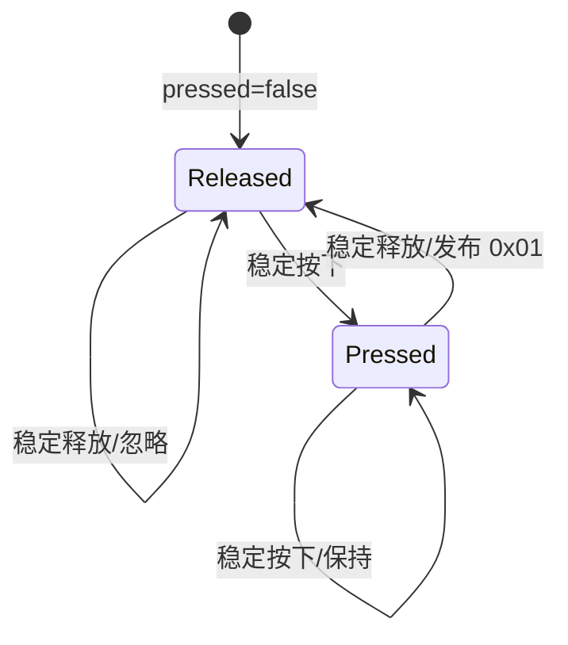
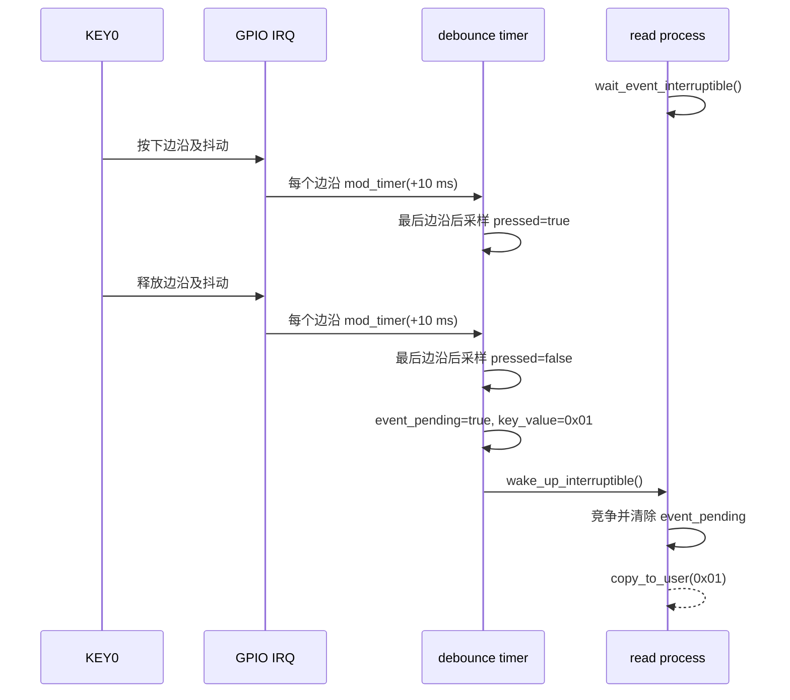
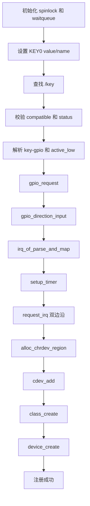

# imx6uirq 中断按键驱动详细设计

## 1. 文档目的

本文描述 `drivers/17-interrupt/imx6uirq.c` 的设备树接口、GPIO 中断处理、内核
定时器消抖、字符设备读取、并发同步、资源生命周期和错误回滚，为代码维护、问题
定位及目标板验证提供依据。

本文以当前源码为准，关联文件如下：

- `kernel/arch/arm/boot/dts/imx6ull-14x14-evk.dts`；
- `drivers/17-interrupt/imx6uirq.c`；
- `drivers/17-interrupt/app/src/imx6uirq_test.c`；
- `drivers/17-interrupt/Makefile`；
- `drivers/17-interrupt/app/Makefile`。

## 2. 设计目标与边界

### 2.1 设计目标

驱动使用 GPIO1_IO18 的双边沿中断检测 KEY0，通过 10 ms 内核定时器过滤机械按键
抖动，并在确认一次完整的“稳定按下、稳定释放”后向用户态报告键值 `0x01`。

具体目标如下：

- 从设备树解析 GPIO、中断和有效电平；
- hardirq 中只重新安排消抖定时器，不执行复杂处理；
- timer softirq 中读取稳定电平并更新按键状态；
- 没有事件时让读取进程睡眠，避免用户态忙轮询；
- 支持 `O_NONBLOCK` 读取；
- 在初始化失败和模块卸载时完整释放资源。

### 2.2 设计边界

- 只支持 `/key` 节点中的一个 KEY0；
- 对用户态报告的固定键值为 `0x01`；
- 使用单事件槽，不提供事件队列；
- 不实现 `poll`、`select`、异步通知或 Linux input 子系统接口；
- 不区分按下持续时间，不实现长按和连发；
- 多个进程共享同一个设备状态，每个事件只由一个读取进程取得；
- 使用 Linux 4.1.15 的传统整数 GPIO API 和旧式 timer callback 接口；
- 实际中断波形和消抖效果必须在目标板验证。

## 3. 总体架构

```mermaid
flowchart LR
    KEY[KEY0 GPIO1_IO18] -->|上升沿或下降沿| GPIOIRQ[GPIO1 IRQ controller]
    GPIOIRQ --> ISR[key_irq_handler]
    ISR -->|mod_timer 10 ms| TIMER[debounce timer]
    TIMER --> CALLBACK[debounce_timer_callback]
    CALLBACK -->|gpio_get_value| KEY
    CALLBACK --> STATE[pressed/event_pending/key_value]
    STATE --> WAIT[wait queue]
    WAIT --> READ[imx6uirq_read]
    READ -->|copy_to_user 1 byte| APP[imx6uirq_test]
    DT[/key device tree node/] --> GPIOIRQ
    DT --> KEY
```



设备树负责描述引脚、GPIO specifier 和中断 specifier；中断处理函数负责延迟采样；
定时器回调负责状态确认和事件发布；字符设备层负责等待、竞争事件并复制给用户态。

## 4. 设备树接口

### 4.1 `/key` 节点

当前驱动要求以下节点：

```dts
key {
	#address-cells = <1>;
	#size-cells = <1>;
	compatible = "atkalpha-key";
	pinctrl-names = "default";
	pinctrl-0 = <&pinctrl_key>;
	key-gpio = <&gpio1 18 GPIO_ACTIVE_LOW>; /* KEY0 */
	interrupt-parent = <&gpio1>;
	interrupts = <18 IRQ_TYPE_EDGE_BOTH>;
	status = "okay";
};
```

| 属性 | 当前值 | 驱动用途 |
| --- | --- | --- |
| 节点路径 | `/key` | `of_find_node_by_path()` 的查找目标 |
| `compatible` | `atkalpha-key` | 防止驱动使用不匹配节点 |
| `status` | `okay` | 表示节点可用 |
| `pinctrl-0` | `pinctrl_key` | 将 PAD 复用为 GPIO1_IO18 |
| `key-gpio` | `<&gpio1 18 GPIO_ACTIVE_LOW>` | 解析 GPIO 编号及低有效标志 |
| `interrupt-parent` | `&gpio1` | 指定 GPIO1 为中断控制器 |
| `interrupts` | `<18 IRQ_TYPE_EDGE_BOTH>` | 指定 line 18 和双边沿触发 |

### 4.2 pinctrl 配置

```dts
pinctrl_key: keygrp {
	fsl,pins = <
		MX6UL_PAD_UART1_CTS_B__GPIO1_IO18 0xf080 /* KEY0 */
	>;
};
```

该配置将 `UART1_CTS_B` PAD 复用为 GPIO1_IO18。驱动不直接操作 IOMUXC 寄存器，
节点启用时由 pinctrl 框架应用该配置。

### 4.3 GPIO 与 IRQ 的两条解析路径

同一个物理引脚通过两个设备树属性进入驱动：

```text
key-gpio
    → of_get_named_gpio_flags()
    → Linux GPIO 编号 + active_low

interrupt-parent + interrupts
    → irq_of_parse_and_map()
    → Linux 虚拟 IRQ 编号 + trigger type
```

GPIO 编号用于读取按键电平，IRQ 编号用于 `request_irq()` 和 `free_irq()`。两者描述
同一 GPIO1 line 18，但属于 GPIO 子系统和 IRQ 子系统的不同命名空间，不能互换。

## 5. 常量设计

| 常量 | 值 | 含义 |
| --- | ---: | --- |
| `IMX6UIRQ_COUNT` | 1 | 申请一个字符设备号 |
| `IMX6UIRQ_NAME` | `imx6uirq` | 模块资源、class 和 device 名称 |
| `IMX6UIRQ_NODE_PATH` | `/key` | 设备树绝对路径 |
| `IMX6UIRQ_GPIO_PROPERTY` | `key-gpio` | GPIO 属性名称 |
| `KEY0_VALUE` | `0x01` | KEY0 对用户态报告的键值 |
| `DEBOUNCE_DELAY_MS` | 10 | 最后一次边沿后的稳定等待时间 |

`DEBOUNCE_DELAY_MS` 表示软件消抖窗口，不保证回调恰好在 10 ms 执行。实际执行时间
受内核 `HZ`、jiffies 换算、中断负载和 softirq 调度影响。

## 6. 数据结构设计

### 6.1 `struct irq_key_desc`

该结构集中保存一个按键的硬件描述：

| 成员 | 含义 | 初始化来源 |
| --- | --- | --- |
| `gpio` | Linux GPIO 编号 | `of_get_named_gpio_flags()` |
| `irq` | Linux IRQ 编号 | `irq_of_parse_and_map()` |
| `value` | 用户态键值 | 固定为 `KEY0_VALUE` |
| `active_low` | 是否低电平表示按下 | OF GPIO flags |
| `name` | GPIO 和 IRQ consumer 名称 | 固定为 `KEY0` |

虽然当前只有一个按键，该结构将硬件属性与设备管理状态分离，便于明确 GPIO、IRQ
和用户态键值之间的对应关系。

### 6.2 `struct imx6uirq_device`

`imx6uirq` 是模块静态分配的单实例设备对象：

| 成员 | 作用 | 并发或生命周期规则 |
| --- | --- | --- |
| `devid` | 动态字符设备号 | 初始化时分配，退出时注销 |
| `cdev` | VFS 字符设备对象 | `cdev_add()` 后对 VFS 生效 |
| `class` | sysfs class | 用于组织 `/sys/class/imx6uirq` |
| `device` | sysfs device | 触发创建 `/dev/imx6uirq` |
| `node` | `/key` 节点引用 | 成功查找后持有，退出时 `of_node_put()` |
| `key` | KEY0 硬件描述 | 初始化后只读 |
| `timer` | 10 ms 消抖定时器 | IRQ 重排，softirq 回调执行 |
| `lock` | 状态自旋锁 | hardirq-safe，持锁期间禁止睡眠 |
| `wait` | 读取等待队列 | 事件发布后唤醒阻塞进程 |
| `pressed` | 是否确认过稳定按下 | 在 timer softirq 中持锁更新 |
| `event_pending` | 单事件槽是否有效 | timer 发布，read 消费 |
| `key_value` | 单事件槽保存的键值 | 与 `event_pending` 同锁保护 |

静态存储期保证未显式赋值的 `pressed`、`event_pending` 和 `key_value` 初始为 0。

## 7. 中断与消抖设计

### 7.1 中断处理函数

`key_irq_handler()` 在 hardirq 上下文执行。它不读取 GPIO，也不修改按键状态，只执行：

```c
mod_timer(&dev->timer,
	  jiffies + msecs_to_jiffies(DEBOUNCE_DELAY_MS));
```

每个新边沿都会把超时时刻移动到“当前时刻 + 10 ms”。因此，若机械触点在窗口内
连续产生多个边沿，先前的采样计划会被覆盖，只有最后一次边沿后稳定 10 ms 才执行
一次有效采样。

hardirq 路径没有执行以下操作：

- 不调用可能睡眠的函数；
- 不向用户态复制数据；
- 不创建或释放资源；
- 不打印每次按键边沿，避免中断日志风暴。

### 7.2 消抖回调

`debounce_timer_callback()` 在 timer softirq 上下文执行，主要步骤如下：

1. 使用 `gpio_get_value()` 读取稳定后的物理电平；
2. 根据 `active_low` 转换为逻辑按下状态；
3. 获取 `lock`；
4. 稳定按下时设置 `pressed = true`；
5. 稳定释放且此前已确认按下时发布一个事件；
6. 释放 `lock`；
7. 在锁外打印消抖结果及可能的事件覆盖告警；
8. 如有新事件，唤醒等待队列。

当前设备树使用 `GPIO_ACTIVE_LOW`，转换关系如下：

| GPIO 物理电平 | 转换后的 `pressed` | 含义 |
| ---: | --- | --- |
| 0 | `true` | KEY0 按下 |
| 1 | `false` | KEY0 释放 |

唤醒操作放在锁外，缩短自旋锁临界区。`gpio_get_value()` 对当前 SoC 内存映射 GPIO
可用于原子上下文；若迁移到可能睡眠的 GPIO controller，则不能继续在 timer
softirq 中直接采样，需改用 threaded IRQ 或 workqueue。

### 7.3 状态机



`pressed` 描述物理按键序列是否已确认按下，`event_pending` 描述字符设备事件槽是否
有数据。上图仅描述 `pressed` 状态机；`event_pending` 与其相互独立。事件发布后
`pressed` 已回到 false，但事件可以等待用户态稍后读取，新一轮按下也不会自动清除
尚未读取的事件。

### 7.4 正常事件时序



## 8. 字符设备接口

### 8.1 设备节点和文件操作

驱动动态分配设备号，并通过 class/device 模型创建 `/dev/imx6uirq`。文件操作如下：

| 操作 | 回调 | 行为 |
| --- | --- | --- |
| `open` | `imx6uirq_open()` | 保存设备对象到 `filp->private_data` |
| `read` | `imx6uirq_read()` | 等待并返回一个释放事件 |
| `llseek` | `no_llseek` | 禁止文件定位 |

`.owner = THIS_MODULE` 使打开的文件持有模块引用。驱动没有为每个文件分配私有资源，
因此不需要 `release` 回调。

### 8.2 `open` 流程

`imx6uirq_open()` 使用 `container_of(inode->i_cdev, ...)` 得到所属设备对象，再保存到
`filp->private_data`。后续 `read` 通过文件对象取得设备，不直接依赖全局变量。成功
打开后，驱动输出 `imx6uirq: device opened`，用于确认用户态 `open()` 已进入驱动。

### 8.3 阻塞读取

普通文件没有事件时执行：

```c
wait_event_interruptible(dev->wait,
			 READ_ONCE(dev->event_pending));
```

等待队列会使进程进入可中断睡眠。收到信号时，驱动返回 `-ERESTARTSYS`；事件发布
后，进程被唤醒并在自旋锁内再次确认 `event_pending`。

等待条件使用 `READ_ONCE()` 防止编译器合并或缓存对共享标志的读取。事件的完整性
仍由 `lock` 保证，等待条件只用于决定是否值得进入竞争阶段。

### 8.4 非阻塞读取

使用 `O_NONBLOCK` 打开设备时：

- `event_pending == false`：立即返回 `-EAGAIN`；
- 存在事件：进入同一持锁竞争和复制流程；
- 事件被其他读取进程先取走：返回 `-EAGAIN`。

### 8.5 多读取进程竞争

唤醒后可能有多个读取进程同时运行，因此不能仅依据等待条件直接复制数据。每个进程
必须获取 `lock` 并重新检查事件：

```text
获取 lock
    → event_pending 为 true
        → 清零 event_pending
        → 复制 key_value 到局部变量
        → 当前进程获得事件
    → event_pending 为 false
        → 事件已被其他进程获得
释放 lock
```

只有把 `event_pending` 从 true 改为 false 的进程取得事件。阻塞读取者竞争失败后重新
等待，非阻塞读取者返回 `-EAGAIN`。

### 8.6 用户态协议和返回值

成功读取固定返回一个字节：

| 长度 | 值 | 含义 |
| ---: | ---: | --- |
| 1 字节 | `0x01` | KEY0 已完成稳定按下和稳定释放 |

错误返回如下：

| 条件 | 返回值 |
| --- | ---: |
| `count < 1` | `-EINVAL` |
| 用户内存复制失败 | `-EFAULT` |
| 阻塞等待被信号中断 | `-ERESTARTSYS` |
| 非阻塞且没有可取得事件 | `-EAGAIN` |

`offp` 不参与事件流控制，每次成功读取都返回一个新事件，不存在普通文件的 EOF 语义。

### 8.7 用户态操作日志

驱动只在用户态操作成功进入关键路径时输出日志：

| 用户态操作 | 内核日志 |
| --- | --- |
| `open()` 成功 | `imx6uirq: device opened` |
| 消抖后确认按下 | `imx6uirq: KEY0 press confirmed after debounce` |
| 消抖后确认释放 | `imx6uirq: KEY0 release confirmed, event queued` |
| 新事件覆盖未读事件 | `imx6uirq: unread key event overwritten` |
| `read()` 缓冲区小于 1 字节 | `imx6uirq: read buffer too small: <count>` |
| 阻塞读取被信号中断 | `imx6uirq: read wait interrupted: <error>` |
| `copy_to_user()` 失败 | `imx6uirq: failed to copy key event to user space` |
| `read()` 成功取得事件 | `imx6uirq: key event delivered, value=0x01` |

成功读取日志位于 `copy_to_user()` 之后，因此只有键值已经复制到用户缓冲区时才会
打印。正常的非阻塞无事件及多读取者竞争失败使用 `pr_debug()`，默认日志级别下不会
持续输出；中断边沿本身不打印，避免机械抖动导致日志刷屏。所有消抖状态日志均在
释放自旋锁后打印。

## 9. 并发与同步设计

### 9.1 执行上下文

| 路径 | 上下文 | 是否允许睡眠 | 主要操作 |
| --- | --- | --- | --- |
| `key_irq_handler()` | hardirq | 否 | `mod_timer()` |
| `debounce_timer_callback()` | timer softirq | 否 | GPIO 采样、状态更新、唤醒 |
| `imx6uirq_open()` | 进程上下文 | 当前实现不睡眠 | 建立私有数据关联 |
| `imx6uirq_read()` | 进程上下文 | 是 | 等待队列、`copy_to_user()` |
| 模块初始化和退出 | 进程上下文 | 是 | 资源申请与释放 |

### 9.2 自旋锁保护范围

`lock` 保护以下共享成员：

- `pressed`；
- `event_pending`；
- `key_value`。

读取路径使用 `spin_lock_irqsave()`，即使当前只有 timer softirq 修改这些状态，也能
保持与未来 hardirq 状态访问兼容，并避免本地 IRQ 打断进程临界区。

以下可能耗时或睡眠的操作位于锁外：

- `wait_event_interruptible()`；
- `copy_to_user()`；
- 模块资源申请和释放。

### 9.3 单事件槽语义

`event_pending` 只有一个布尔位。如果用户态未及时读取，下一次释放事件会再次写入
同一个 `key_value` 并保持 `event_pending = true`，不会累计次数。因此快速连续按键
可能合并为一个待读事件。这是当前简单字符协议的明确限制，不属于队列实现。

## 10. 初始化设计

### 10.1 初始化流程



定时器必须在 `request_irq()` 之前初始化，因为 IRQ 注册成功后中断可能立即发生，
中断处理函数必须始终看到可用的 `timer_list`。

### 10.2 中断触发配置

设备树 `interrupts` 指定 `IRQ_TYPE_EDGE_BOTH`，驱动请求 IRQ 时同时传入：

```c
IRQF_TRIGGER_FALLING | IRQF_TRIGGER_RISING
```

这明确要求下降沿和上升沿均触发。下降沿对应当前低有效按键的按下过程，上升沿对应
释放过程；若缺失任一边沿，就无法可靠形成完整事件。

### 10.3 注册成功日志

驱动成功加载后打印 GPIO、IRQ、major 和 minor，便于核对设备树映射和设备号：

```text
imx6uirq: registered, GPIO=<n> IRQ=<n> major=<n> minor=<n>
```

日志为运行时可见输出，因此使用英文。

## 11. 错误回滚设计

### 11.1 资源申请顺序

```text
设备树节点引用
    → GPIO
    → IRQ mapping
    → timer 初始化
    → IRQ handler
    → 字符设备号
    → cdev
    → class
    → device
```

### 11.2 回滚关系

| 资源申请 | 对应释放 |
| --- | --- |
| `of_find_node_by_path()` | `of_node_put()` |
| `gpio_request()` | `gpio_free()` |
| `irq_of_parse_and_map()` | `irq_dispose_mapping()` |
| `request_irq()` | `free_irq()` |
| 已可能激活的 timer | `del_timer_sync()` |
| `alloc_chrdev_region()` | `unregister_chrdev_region()` |
| `cdev_add()` | `cdev_del()` |
| `class_create()` | `class_destroy()` |
| `device_create()` | `device_destroy()` |

错误标签按资源申请的逆序排列。`request_irq()` 成功后的失败路径先调用 `free_irq()`，
阻止新的中断再次执行 `mod_timer()`，然后调用 `del_timer_sync()` 等待可能正在运行的
消抖回调结束，最后释放 IRQ mapping、GPIO 和设备树节点。

### 11.3 主要失败条件

| 失败位置 | 返回值或来源 | 已执行的关键回滚 |
| --- | --- | --- |
| `/key` 不存在 | `-ENODEV` | 无节点引用需要释放 |
| 节点不兼容或不可用 | `-ENODEV` | `of_node_put()` |
| GPIO 解析失败 | OF/GPIO 原始负错误码 | 释放节点引用 |
| GPIO 申请或方向设置失败 | GPIO API 原始错误码 | 释放已申请 GPIO 和节点 |
| IRQ 映射失败 | `-EINVAL` | 释放 GPIO 和节点 |
| IRQ 申请失败 | `request_irq()` 错误码 | 释放 mapping、GPIO 和节点 |
| 字符设备注册失败 | 对应内核 API 错误码 | 停止 IRQ/timer 并逆序释放资源 |

## 12. 模块退出与生命周期

模块退出流程如下：

```text
device_destroy
    → class_destroy
    → cdev_del
    → unregister_chrdev_region
    → free_irq
    → del_timer_sync
    → irq_dispose_mapping
    → gpio_free
    → of_node_put
```

关键顺序是 `free_irq()` 位于 `del_timer_sync()` 之前。若先删除 timer 而 IRQ 仍可触发，
新的中断可能在删除后再次安排 timer。先释放 IRQ 能阻止新的回调来源，随后同步删除
timer，保证释放 GPIO 和设备对象之前不再有消抖回调访问它们。

`.owner = THIS_MODULE` 保证文件打开期间模块引用计数不为零，正常模块卸载不会与仍在
执行的文件操作并发。

## 13. 用户态测试程序

测试程序路径：

```text
drivers/17-interrupt/app/src/imx6uirq_test.c
```

用途：阻塞读取指定数量的 KEY0 完整事件，并验证每个一字节键值均为 `0x01`。

编译：

```bash
cd drivers/17-interrupt
make modules
make app
```

运行：

```bash
insmod imx6uirq.ko
./app/imx6uirq_test 1 /dev/imx6uirq
```

按下并释放 KEY0 后，预期输出：

```text
PASS: KEY0 released, value=0x01
```

清理：

```bash
rmmod imx6uirq
make clean
```

## 14. 验证方法

### 14.1 静态接口检查

确认设备树和驱动保持以下一致性：

- 节点路径为 `/key`；
- `compatible` 为 `atkalpha-key`；
- GPIO 属性为 `key-gpio`；
- GPIO line 和 interrupt line 均为 18；
- GPIO 为低有效，中断为双边沿；
- 用户态期望值与 `KEY0_VALUE` 均为 `0x01`。

### 14.2 编译验证

当前源码已使用 Linux 4.1.15 ARM 工具链完成以下验证：

- `imx6uirq.ko` 交叉编译成功；
- `imx6uirq_test` 静态交叉编译成功；
- 设备树经 ARM CPP 和内核源码树自带 DTC 编译成功；
- 反编译 DTB 后，`interrupts` 为 `<0x12 0x3>`，即 line 18 和
  `IRQ_TYPE_EDGE_BOTH`。

标准内核 `make imx6ull-14x14-evk.dtb` 曾被构建树中归属 `nobody:nogroup` 的只读
`scripts/mod/elfconfig.h` 阻断。该问题属于现有构建目录权限，不是 DTS 语法错误；
设备树已通过等价的预处理和 DTC 编译完成语法验证。

### 14.3 目标板验证

目标板必须部署最新 DTB，且 `15-key/key.ko`、`gpio-keys` 或其他驱动不得占用
GPIO1_IO18。建议依次检查：

```bash
insmod imx6uirq.ko
dmesg | tail
ls -l /dev/imx6uirq
cat /proc/interrupts | grep KEY0
./app/imx6uirq_test 3 /dev/imx6uirq
rmmod imx6uirq
```

验证三个方面：

1. 每次完整按下和释放只产生一次用户态输出；
2. 短时间机械抖动不产生多个事件；
3. 卸载模块后 `/proc/interrupts` 中不再存在 KEY0，且可重新加载模块。

当前尚未执行目标板运行验证，因此不能据此宣称实际中断、GPIO 电平和消抖效果已经
在硬件上通过。

## 15. 已知限制与扩展方向

### 15.1 已知限制

- 单事件槽不能累计快速连续事件；
- 不提供时间戳、按下事件或长按信息；
- 不支持 `poll`/`select`/`epoll`；
- 不支持多个按键；
- 固定使用 10 ms 消抖窗口；
- 传统 GPIO API 仅适用于当前不会睡眠的 SoC GPIO controller；
- 本驱动是字符设备教学实现，不是通用 Linux input 驱动。

### 15.2 可选扩展

若后续需求扩大，可在保持当前 ABI 或明确设计新 ABI 后考虑：

- 使用环形队列保存多个事件；
- 添加 `poll` 回调支持事件循环；
- 将事件扩展为键值、动作和时间戳结构；
- 从设备树读取可配置消抖时间；
- 使用数组管理多个 GPIO 按键；
- 迁移到 descriptor-based GPIO API；
- 对接 Linux input 子系统，向标准输入事件设备报告按键。

这些扩展会影响数据结构、并发模型或用户态接口，不属于当前实现范围。

## 16. 结论

`imx6uirq.c` 将 GPIO 双边沿中断作为快速触发入口，使用可重排的 10 ms 内核定时器
完成稳定电平采样，再通过自旋锁、单事件槽和等待队列向用户态交付一次完整释放事件。
当前实现明确区分 hardirq、timer softirq 和进程上下文，并在错误路径及模块退出路径
中按安全顺序释放 IRQ、timer、GPIO 和字符设备资源。

该设计适合作为 i.MX6ULL GPIO 中断、软件消抖和阻塞字符设备读取的教学示例；若用于
通用输入设备或高事件速率场景，应进一步采用 input 子系统和队列化事件模型。
