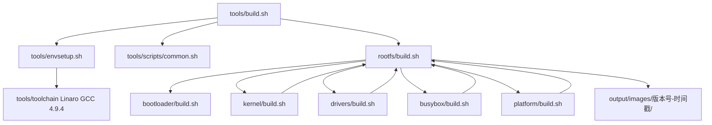

# i.MX6UL 统一编译框架

`tools/` 是工程的统一构建入口与公共构建逻辑目录。所有脚本从自身位置动态定位工程根目录，
不依赖执行命令时所在的工作目录，也不依赖宿主机的用户主目录。

## 目录结构

```text
tools/
├── build.sh                 完整系统构建入口
├── envsetup.sh              工程内交叉工具链环境初始化
├── scripts/
│   └── common.sh             模块脚本共享的路径、日志与安全函数
└── toolchain/
    └── gcc-linaro-4.9.4-2017.01-x86_64_arm-linux-gnueabihf/
```

## 构建架构



## 环境初始化

`envsetup.sh` 读取 `configs/imx6ul.env`，并导出以下关键变量：

```text
PROJECT_ROOT
ARCH=arm
TOOLCHAIN_DIR
CROSS_COMPILE=<工程内工具链>/bin/arm-linux-gnueabihf-
CC、CXX、AR、AS、LD、OBJCOPY、OBJDUMP、STRIP
JOBS
```

构建前会检查工具链目录与 `${CROSS_COMPILE}gcc`。所有模块脚本都会使用
工程内工具链，避免调用者残留的其他架构交叉编译环境影响结果。

## 组件入口

从工程根目录执行：

```bash
./tools/build.sh
```

不带参数时，`./tools/build.sh` 直接执行完整系统构建，不提供交互式菜单。具体组件必须在
对应目录执行其 `build.sh`：

```bash
./bootloader/build.sh build
./kernel/build.sh build
./busybox/build.sh build
./drivers/build.sh build
./platform/build.sh build
./rootfs/build.sh build
```

`tools/build.sh` 只负责完整构建的顺序调度，不承载任何组件的具体编译命令。

### platform

`platform/build.sh` 是用户态程序的唯一总入口。要增加应用时：

1. 在 `platform/build.sh` 的 `PLATFORM_APPS` 中登记应用目录名；
2. 在应用目录中创建 Makefile，并提供 `all`、`install`、`clean` 目标；
3. 由总入口通过 `make -C platform/<app>` 调用该 Makefile。

可直接执行：

```bash
cd platform
./build.sh build
./build.sh build 01-chrdev_test
```

### drivers

`drivers/build.sh` 是外部内核模块的唯一总入口。要选择统一构建或安装的驱动时，在
`DRIVER_COMPONENTS` 中登记 `drivers/` 下的一级目录名。总入口使用已准备好的 Kernel
构建目录调用 Kbuild，指定单个驱动在 drivers 目录执行。

```bash
cd drivers
./build.sh build
./build.sh build 12-gpioled
```

## Kernel、U-Boot 与 BusyBox 兼容模式

工程使用的 Kernel 4.1、U-Boot 2016.03 和 BusyBox 1.29 均可能因历史原地构建文件而
拒绝 `O=` 独立输出构建。`configs/imx6ul.env` 为三者提供以下模式：

```text
auto    检测到历史构建状态时复用源码树；洁净时使用 output/build/
source  始终复用源码树
out     强制使用 output/build/，调用前必须确认源码树已清理
```

框架不会自动执行 `mrproper`、`distclean`、`sudo` 或 `chown`，避免丢失现有配置和修改
文件所有者。

## 输出、日志与发布

```text
output/
├── build/                  独立构建中间目录
├── boot/                   u-boot.imx
├── kernel/                 zImage 和默认 DTB
├── modules/                模块产物
├── platform/               用户态程序构建输出
├── rootfs/staging/         RootFS 暂存目录
└── images/<板名>-<版本>-<时间戳>/
    ├── u-boot.imx
    ├── zImage
    ├── imx6ull-14x14-nand-4.3-800x480-c.dtb
    ├── rootfs.tar
    ├── manifest.txt
    └── sha256sum.txt

logs/<时间戳>/              各构建阶段日志
```

`logs/` 与 `output/` 均由 Git 忽略。RootFS 安装和打包只操作工程内的 staging 目录，
不会默认使用 sudo 修改宿主机文件系统。

## 清理命令

```bash
./bootloader/build.sh clean
./kernel/build.sh clean
./busybox/build.sh clean
./drivers/build.sh clean
./platform/build.sh clean
./rootfs/build.sh clean
```

各模块的 `clean` 仅删除其自身构建中间文件；不会删除源码、工程配置或已发布镜像目录。
